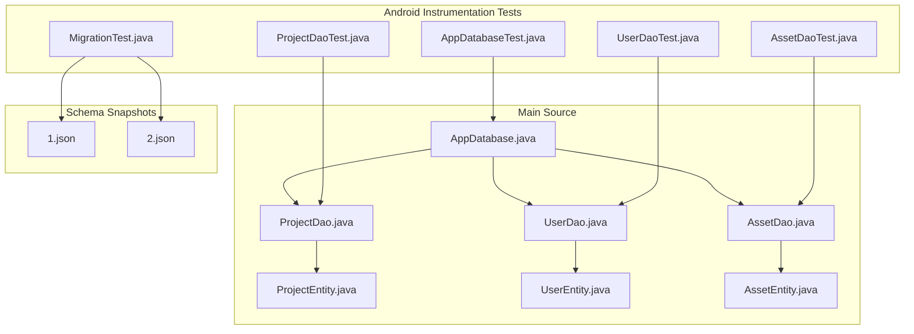
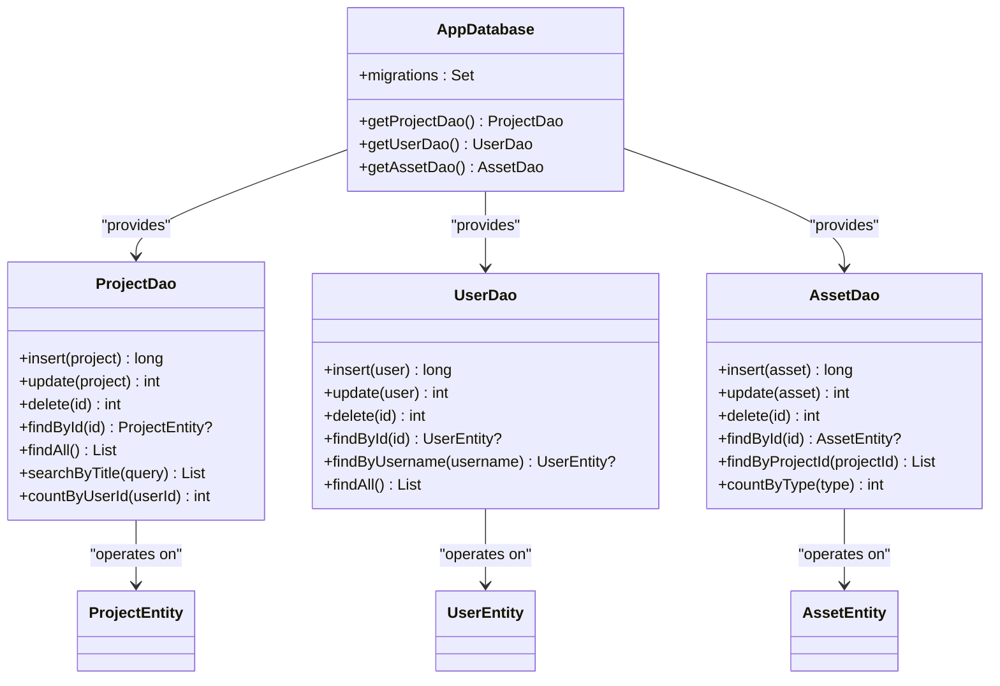
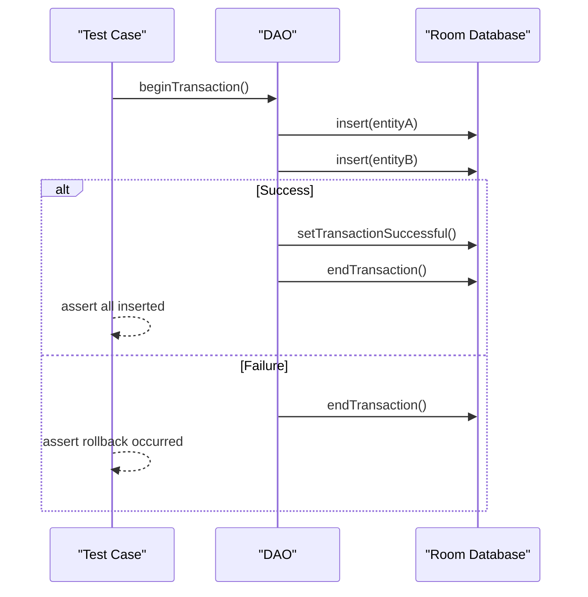
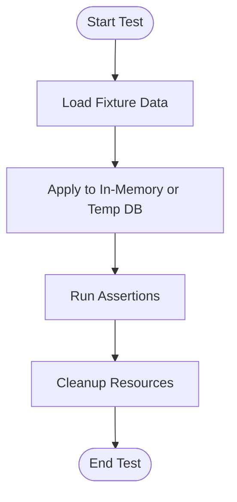
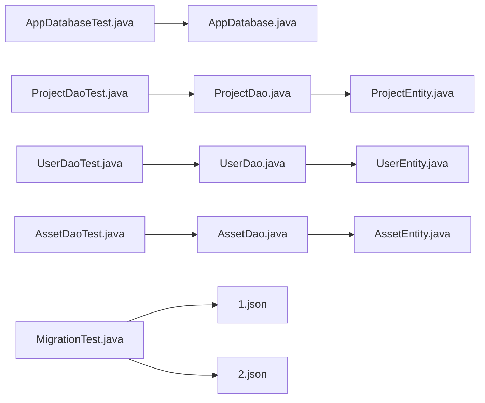

# Database Integration Testing

<cite>
**Referenced Files in This Document**
- [AppDatabase.java](file://catroid/src/main/java/org/catrobat/catroid/database/AppDatabase.java)
- [ProjectDao.java](file://catroid/src/main/java/org/catrobat/catroid/database/dao/ProjectDao.java)
- [UserDao.java](file://catroid/src/main/java/org/catrobat/catroid/database/dao/UserDao.java)
- [AssetDao.java](file://catroid/src/main/java/org/catrobat/catroid/database/dao/AssetDao.java)
- [ProjectEntity.java](file://catroid/src/main/java/org/catrobat/catroid/database/entity/ProjectEntity.java)
- [UserEntity.java](file://catroid/src/main/java/org/catrobat/catroid/database/entity/UserEntity.java)
- [AssetEntity.java](file://catroid/src/main/java/org/catrobat/catroid/database/entity/AssetEntity.java)
- [AppDatabaseTest.java](file://catroid/src/androidTest/java/org/catrobat/catroid/test/database/AppDatabaseTest.java)
- [ProjectDaoTest.java](file://catroid/src/androidTest/java/org/catrobat/catroid/test/database/ProjectDaoTest.java)
- [UserDaoTest.java](file://catroid/src/androidTest/java/org/catrobat/catroid/test/database/UserDaoTest.java)
- [AssetDaoTest.java](file://catroid/src/androidTest/java/org/catrobat/catroid/test/database/AssetDaoTest.java)
- [MigrationTest.java](file://catroid/src/androidTest/java/org/catrobat/catroid/test/database/MigrationTest.java)
- [1.json](file://catroid/schemas/org.catrobat.catroid.db.AppDatabase/1.json)
- [2.json](file://catroid/schemas/org.catrobat.catroid.db.AppDatabase/2.json)
</cite>

## Table of Contents
1. [Introduction](#introduction)
2. [Project Structure](#project-structure)
3. [Core Components](#core-components)
4. [Architecture Overview](#architecture-overview)
5. [Detailed Component Analysis](#detailed-component-analysis)
6. [Dependency Analysis](#dependency-analysis)
7. [Performance Considerations](#performance-considerations)
8. [Troubleshooting Guide](#troubleshooting-guide)
9. [Conclusion](#conclusion)
10. [Appendices](#appendices)

## Introduction
This document provides comprehensive guidance for database integration testing of the Room persistence layer in NewCatroid. It covers test database setup, schema migration testing, data validation rules, and strategies for testing project persistence, asset storage, and user data management. It also includes examples for complex queries, entity relationships, transaction handling, fixtures, state management, cleanup procedures, migration verification, performance optimization, and concurrent access scenarios.

## Project Structure
The Room-based persistence layer is implemented under the main source tree with corresponding Android instrumentation tests under androidTest. Schema snapshots are stored in a dedicated schemas directory to support migration testing.

**Diagram sources**
- [AppDatabase.java](file://catroid/src/main/java/org/catrobat/catroid/database/AppDatabase.java)
- [ProjectDao.java](file://catroid/src/main/java/org/catrobat/catroid/database/dao/ProjectDao.java)
- [UserDao.java](file://catroid/src/main/java/org/catrobat/catroid/database/dao/UserDao.java)
- [AssetDao.java](file://catroid/src/main/java/org/catrobat/catroid/database/dao/AssetDao.java)
- [ProjectEntity.java](file://catroid/src/main/java/org/catrobat/catroid/database/entity/ProjectEntity.java)
- [UserEntity.java](file://catroid/src/main/java/org/catrobat/catroid/database/entity/UserEntity.java)
- [AssetEntity.java](file://catroid/src/main/java/org/catrobat/catroid/database/entity/AssetEntity.java)
- [AppDatabaseTest.java](file://catroid/src/androidTest/java/org/catrobat/catroid/test/database/AppDatabaseTest.java)
- [ProjectDaoTest.java](file://catroid/src/androidTest/java/org/catrobat/catroid/test/database/ProjectDaoTest.java)
- [UserDaoTest.java](file://catroid/src/androidTest/java/org/catrobat/catroid/test/database/UserDaoTest.java)
- [AssetDaoTest.java](file://catroid/src/androidTest/java/org/catrobat/catroid/test/database/AssetDaoTest.java)
- [MigrationTest.java](file://catroid/src/androidTest/java/org/catrobat/catroid/test/database/MigrationTest.java)
- [1.json](file://catroid/schemas/org.catrobat.catroid.db.AppDatabase/1.json)
- [2.json](file://catroid/schemas/org.catrobat.catroid.db.AppDatabase/2.json)

**Section sources**
- [AppDatabase.java](file://catroid/src/main/java/org/catrobat/catroid/database/AppDatabase.java)
- [ProjectDao.java](file://catroid/src/main/java/org/catrobat/catroid/database/dao/ProjectDao.java)
- [UserDao.java](file://catroid/src/main/java/org/catrobat/catroid/database/dao/UserDao.java)
- [AssetDao.java](file://catroid/src/main/java/org/catrobat/catroid/database/dao/AssetDao.java)
- [ProjectEntity.java](file://catroid/src/main/java/org/catrobat/catroid/database/entity/ProjectEntity.java)
- [UserEntity.java](file://catroid/src/main/java/org/catrobat/catroid/database/entity/UserEntity.java)
- [AssetEntity.java](file://catroid/src/main/java/org/catrobat/catroid/database/entity/AssetEntity.java)
- [AppDatabaseTest.java](file://catroid/src/androidTest/java/org/catrobat/catroid/test/database/AppDatabaseTest.java)
- [ProjectDaoTest.java](file://catroid/src/androidTest/java/org/catrobat/catroid/test/database/ProjectDaoTest.java)
- [UserDaoTest.java](file://catroid/src/androidTest/java/org/catrobat/catroid/test/database/UserDaoTest.java)
- [AssetDaoTest.java](file://catroid/src/androidTest/java/org/catrobat/catroid/test/database/AssetDaoTest.java)
- [MigrationTest.java](file://catroid/src/androidTest/java/org/catrobat/catroid/test/database/MigrationTest.java)
- [1.json](file://catroid/schemas/org.catrobat.catroid.db.AppDatabase/1.json)
- [2.json](file://catroid/schemas/org.catrobat.catroid.db.AppDatabase/2.json)

## Core Components
- AppDatabase: Central Room database singleton providing access to DAOs and migration configuration.
- DAOs: Data Access Objects encapsulating CRUD operations, complex queries, and transactions for entities.
- Entities: Room-mapped models representing projects, users, and assets, including relationships and constraints.
- Test Suite: Instrumented tests validating database initialization, DAO behavior, migrations, and concurrency.

Key responsibilities:
- AppDatabase coordinates schema versioning and migrations.
- DAOs define query interfaces and transaction boundaries.
- Entities enforce data validation via annotations and constraints.
- Tests ensure correctness across lifecycle, migrations, and concurrent access.

**Section sources**
- [AppDatabase.java](file://catroid/src/main/java/org/catrobat/catroid/database/AppDatabase.java)
- [ProjectDao.java](file://catroid/src/main/java/org/catrobat/catroid/database/dao/ProjectDao.java)
- [UserDao.java](file://catroid/src/main/java/org/catrobat/catroid/database/dao/UserDao.java)
- [AssetDao.java](file://catroid/src/main/java/org/catrobat/catroid/database/dao/AssetDao.java)
- [ProjectEntity.java](file://catroid/src/main/java/org/catrobat/catroid/database/entity/ProjectEntity.java)
- [UserEntity.java](file://catroid/src/main/java/org/catrobat/catroid/database/entity/UserEntity.java)
- [AssetEntity.java](file://catroid/src/main/java/org/catrobat/catroid/database/entity/AssetEntity.java)

## Architecture Overview
The architecture follows a layered approach: UI or business logic interacts with DAOs, which operate on Room-managed entities through the central AppDatabase instance. Migrations are declared and verified using schema snapshots.

**Diagram sources**
- [AppDatabase.java](file://catroid/src/main/java/org/catrobat/catroid/database/AppDatabase.java)
- [ProjectDao.java](file://catroid/src/main/java/org/catrobat/catroid/database/dao/ProjectDao.java)
- [UserDao.java](file://catroid/src/main/java/org/catrobat/catroid/database/dao/UserDao.java)
- [AssetDao.java](file://catroid/src/main/java/org/catrobat/catroid/database/dao/AssetDao.java)
- [ProjectEntity.java](file://catroid/src/main/java/org/catrobat/catroid/database/entity/ProjectEntity.java)
- [UserEntity.java](file://catroid/src/main/java/org/catrobat/catroid/database/entity/UserEntity.java)
- [AssetEntity.java](file://catroid/src/main/java/org/catrobat/catroid/database/entity/AssetEntity.java)

## Detailed Component Analysis

### Database Initialization and Test Setup
- Use an in-memory database for fast, isolated tests when persistence is not required.
- For migration and file-backed tests, use a temporary database path that is cleaned up after each test.
- Provide a test Application context if needed to initialize dependencies.

Recommended patterns:
- @RunWith(AndroidJUnit4.class) or JUnit 5 equivalents for instrumentation tests.
- @Before/@After or @BeforeEach/@AfterEach for setup and teardown.
- Ensure database instances are closed to avoid resource leaks.

**Section sources**
- [AppDatabaseTest.java](file://catroid/src/androidTest/java/org/catrobat/catroid/test/database/AppDatabaseTest.java)

### Project Persistence Testing
Focus areas:
- Insert, update, delete, and retrieval by ID.
- Querying by title or other fields; verify search behavior and ordering.
- Counting projects per user to validate foreign key relationships.
- Transactional batch inserts and rollbacks on failure.

Example test flows:
- Create a project, assert existence, modify fields, re-fetch and assert updated values.
- Delete a project and confirm it no longer appears in queries.
- Validate unique constraints (e.g., project identifiers).

**Section sources**
- [ProjectDaoTest.java](file://catroid/src/androidTest/java/org/catrobat/catroid/test/database/ProjectDaoTest.java)
- [ProjectDao.java](file://catroid/src/main/java/org/catrobat/catroid/database/dao/ProjectDao.java)
- [ProjectEntity.java](file://catroid/src/main/java/org/catrobat/catroid/database/entity/ProjectEntity.java)

### User Data Management Testing
Focus areas:
- CRUD operations for users.
- Lookup by username and ID.
- Ensuring uniqueness constraints on usernames.
- Verifying cascading effects when related entities are deleted.

Example test flows:
- Insert a user, fetch by username, assert equality.
- Update user profile fields and verify persistence.
- Delete a user and ensure dependent references are handled as expected.

**Section sources**
- [UserDaoTest.java](file://catroid/src/androidTest/java/org/catrobat/catroid/test/database/UserDaoTest.java)
- [UserDao.java](file://catroid/src/main/java/org/catrobat/catroid/database/dao/UserDao.java)
- [UserEntity.java](file://catroid/src/main/java/org/catrobat/catroid/database/entity/UserEntity.java)

### Asset Storage Testing
Focus areas:
- CRUD operations for assets.
- Retrieval by project association.
- Counting assets by type to validate categorization.
- Handling large binary metadata or paths efficiently.

Example test flows:
- Insert multiple assets linked to a project, fetch by project ID, assert counts and content.
- Update asset metadata and verify changes persist.
- Delete assets and confirm referential integrity.

**Section sources**
- [AssetDaoTest.java](file://catroid/src/androidTest/java/org/catrobat/catroid/test/database/AssetDaoTest.java)
- [AssetDao.java](file://catroid/src/main/java/org/catrobat/catroid/database/dao/AssetDao.java)
- [AssetEntity.java](file://catroid/src/main/java/org/catrobat/catroid/database/entity/AssetEntity.java)

### Complex Queries and Relationships
Patterns to cover:
- JOINs between entities (e.g., projects and their assets).
- Aggregations such as COUNT, SUM, GROUP BY.
- Ordering and pagination for large result sets.
- Conditional filtering and full-text search where applicable.

Validation techniques:
- Compare query results against expected datasets.
- Assert ordering stability and tie-breaking rules.
- Verify nullability and empty result handling.

**Section sources**
- [ProjectDao.java](file://catroid/src/main/java/org/catrobat/catroid/database/dao/ProjectDao.java)
- [AssetDao.java](file://catroid/src/main/java/org/catrobat/catroid/database/dao/AssetDao.java)
- [ProjectEntity.java](file://catroid/src/main/java/org/catrobat/catroid/database/entity/ProjectEntity.java)
- [AssetEntity.java](file://catroid/src/main/java/org/catrobat/catroid/database/entity/AssetEntity.java)

### Transaction Handling
Guidelines:
- Wrap multi-step writes in transactions to ensure atomicity.
- Roll back on partial failures to maintain consistency.
- Test both successful commits and rollback scenarios.

Sequence diagram for a typical transaction flow:

**Diagram sources**
- [ProjectDao.java](file://catroid/src/main/java/org/catrobat/catroid/database/dao/ProjectDao.java)
- [AssetDao.java](file://catroid/src/main/java/org/catrobat/catroid/database/dao/AssetDao.java)

**Section sources**
- [ProjectDao.java](file://catroid/src/main/java/org/catrobat/catroid/database/dao/ProjectDao.java)
- [AssetDao.java](file://catroid/src/main/java/org/catrobat/catroid/database/dao/AssetDao.java)

### Test Data Fixtures and State Management
Recommendations:
- Define reusable fixture builders for entities to reduce duplication.
- Use JSON or helper methods to construct realistic datasets.
- Reset database state between tests to prevent cross-test contamination.

Flowchart for fixture-driven test setup:

[No sources needed since this diagram shows conceptual workflow, not actual code structure]

### Migration Testing
Approach:
- Maintain schema snapshots for each version under schemas.
- Write tests that migrate from older versions to the latest schema.
- Populate data at the old schema, run migration, and verify data integrity and new features.

Verification steps:
- Confirm tables exist and columns match expectations.
- Validate data transformations during migration.
- Ensure backward compatibility for existing app installations.

**Section sources**
- [MigrationTest.java](file://catroid/src/androidTest/java/org/catrobat/catroid/test/database/MigrationTest.java)
- [1.json](file://catroid/schemas/org.catrobat.catroid.db.AppDatabase/1.json)
- [2.json](file://catroid/schemas/org.catrobat.catroid.db.AppDatabase/2.json)

### Concurrent Access Scenarios
Considerations:
- Room enforces single-threaded write access by default; background threads must be used appropriately.
- Use @Query with Flow or LiveData for reactive reads if applicable.
- Stress test with concurrent readers and serialized writers to detect deadlocks or contention.

Testing strategy:
- Launch multiple reader tasks concurrently.
- Serialize writes within transactions.
- Assert eventual consistency and absence of corruption.

**Section sources**
- [AppDatabase.java](file://catroid/src/main/java/org/catrobat/catroid/database/AppDatabase.java)
- [ProjectDao.java](file://catroid/src/main/java/org/catrobat/catroid/database/dao/ProjectDao.java)
- [AssetDao.java](file://catroid/src/main/java/org/catrobat/catroid/database/dao/AssetDao.java)

## Dependency Analysis
The following diagram illustrates how tests depend on DAOs and entities, and how migrations rely on schema snapshots.

**Diagram sources**
- [AppDatabaseTest.java](file://catroid/src/androidTest/java/org/catrobat/catroid/test/database/AppDatabaseTest.java)
- [ProjectDaoTest.java](file://catroid/src/androidTest/java/org/catrobat/catroid/test/database/ProjectDaoTest.java)
- [UserDaoTest.java](file://catroid/src/androidTest/java/org/catrobat/catroid/test/database/UserDaoTest.java)
- [AssetDaoTest.java](file://catroid/src/androidTest/java/org/catrobat/catroid/test/database/AssetDaoTest.java)
- [MigrationTest.java](file://catroid/src/androidTest/java/org/catrobat/catroid/test/database/MigrationTest.java)
- [AppDatabase.java](file://catroid/src/main/java/org/catrobat/catroid/database/AppDatabase.java)
- [ProjectDao.java](file://catroid/src/main/java/org/catrobat/catroid/database/dao/ProjectDao.java)
- [UserDao.java](file://catroid/src/main/java/org/catrobat/catroid/database/dao/UserDao.java)
- [AssetDao.java](file://catroid/src/main/java/org/catrobat/catroid/database/dao/AssetDao.java)
- [ProjectEntity.java](file://catroid/src/main/java/org/catrobat/catroid/database/entity/ProjectEntity.java)
- [UserEntity.java](file://catroid/src/main/java/org/catrobat/catroid/database/entity/UserEntity.java)
- [AssetEntity.java](file://catroid/src/main/java/org/catrobat/catroid/database/entity/AssetEntity.java)
- [1.json](file://catroid/schemas/org.catrobat.catroid.db.AppDatabase/1.json)
- [2.json](file://catroid/schemas/org.catrobat.catroid.db.AppDatabase/2.json)

**Section sources**
- [AppDatabaseTest.java](file://catroid/src/androidTest/java/org/catrobat/catroid/test/database/AppDatabaseTest.java)
- [ProjectDaoTest.java](file://catroid/src/androidTest/java/org/catrobat/catroid/test/database/ProjectDaoTest.java)
- [UserDaoTest.java](file://catroid/src/androidTest/java/org/catrobat/catroid/test/database/UserDaoTest.java)
- [AssetDaoTest.java](file://catroid/src/androidTest/java/org/catrobat/catroid/test/database/AssetDaoTest.java)
- [MigrationTest.java](file://catroid/src/androidTest/java/org/catrobat/catroid/test/database/MigrationTest.java)
- [AppDatabase.java](file://catroid/src/main/java/org/catrobat/catroid/database/AppDatabase.java)
- [ProjectDao.java](file://catroid/src/main/java/org/catrobat/catroid/database/dao/ProjectDao.java)
- [UserDao.java](file://catroid/src/main/java/org/catrobat/catroid/database/dao/UserDao.java)
- [AssetDao.java](file://catroid/src/main/java/org/catrobat/catroid/database/dao/AssetDao.java)
- [ProjectEntity.java](file://catroid/src/main/java/org/catrobat/catroid/database/entity/ProjectEntity.java)
- [UserEntity.java](file://catroid/src/main/java/org/catrobat/catroid/database/entity/UserEntity.java)
- [AssetEntity.java](file://catroid/src/main/java/org/catrobat/catroid/database/entity/AssetEntity.java)
- [1.json](file://catroid/schemas/org.catrobat.catroid.db.AppDatabase/1.json)
- [2.json](file://catroid/schemas/org.catrobat.catroid.db.AppDatabase/2.json)

## Performance Considerations
- Prefer in-memory databases for unit-style integration tests to minimize I/O overhead.
- Use temporary file-backed databases only when migration or persistence behavior is under test.
- Batch writes within transactions to reduce commit costs.
- Index frequently queried columns (e.g., titles, usernames, foreign keys) and validate query plans in tests.
- Avoid loading large datasets into memory; paginate or stream results where possible.
- Measure execution time in tests for critical paths and guard against regressions.

[No sources needed since this section provides general guidance]

## Troubleshooting Guide
Common issues and resolutions:
- Database locked errors: Ensure proper transaction boundaries and close connections in teardown.
- Migration failures: Verify schema snapshots reflect intended changes and include data transformation logic.
- Constraint violations: Check uniqueness and foreign key constraints in entities and DAOs.
- Concurrency anomalies: Serialize writes and isolate readers; add assertions for consistency.

Checklist:
- Confirm database instance lifecycle management in tests.
- Validate fixture data completeness and referential integrity.
- Review error messages and stack traces for specific constraint or migration failures.

**Section sources**
- [AppDatabaseTest.java](file://catroid/src/androidTest/java/org/catrobat/catroid/test/database/AppDatabaseTest.java)
- [MigrationTest.java](file://catroid/src/androidTest/java/org/catrobat/catroid/test/database/MigrationTest.java)

## Conclusion
Effective database integration testing for Room involves careful setup of test databases, robust migration verification, thorough coverage of CRUD and complex queries, and attention to transactions, concurrency, and performance. By leveraging fixtures, isolating state, and asserting on both data and schema evolution, teams can maintain reliability and correctness across NewCatroid’s persistence layer.

[No sources needed since this section summarizes without analyzing specific files]

## Appendices

### Example Test Scenarios Checklist
- Initialize in-memory database and verify basic CRUD for projects, users, and assets.
- Execute complex queries with joins and aggregations; assert ordering and counts.
- Perform transactional batch operations and validate rollback behavior.
- Migrate from schema version 1 to 2 and confirm data integrity and new features.
- Simulate concurrent reads and serialized writes; assert no deadlocks or corruption.
- Clean up resources and ensure deterministic test outcomes.

[No sources needed since this section provides general guidance]