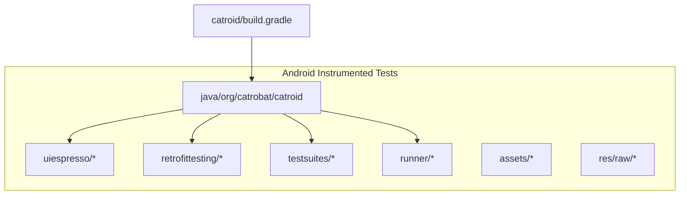
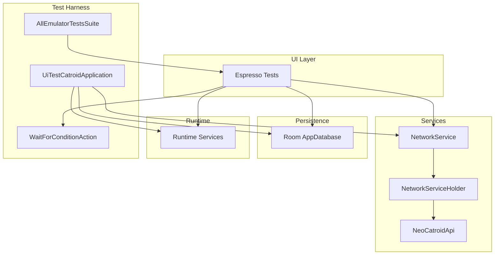
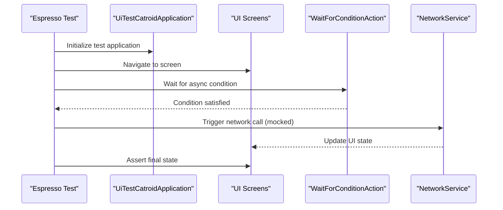
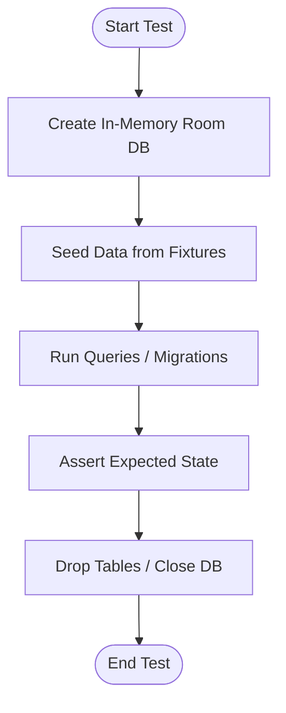
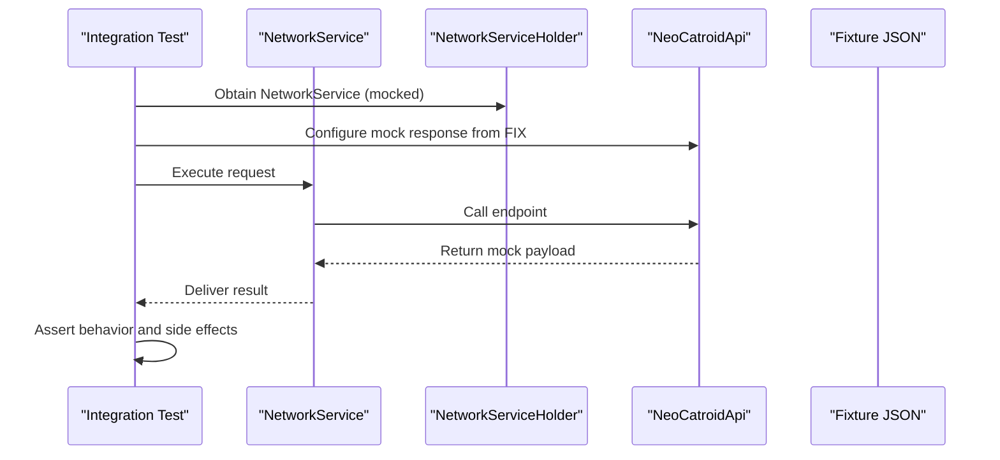
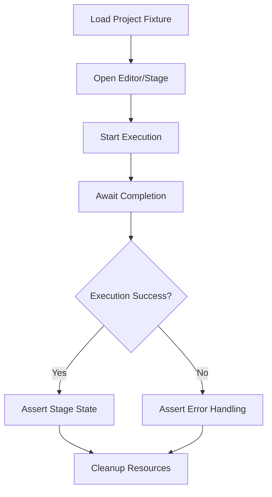
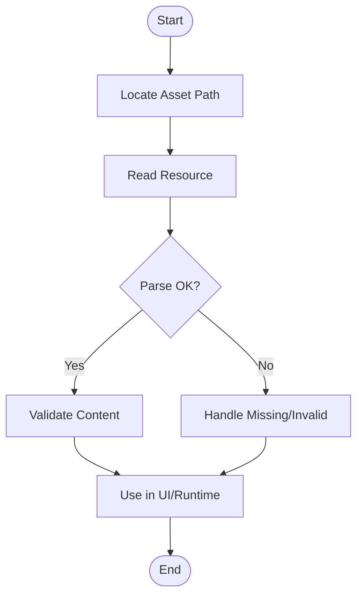
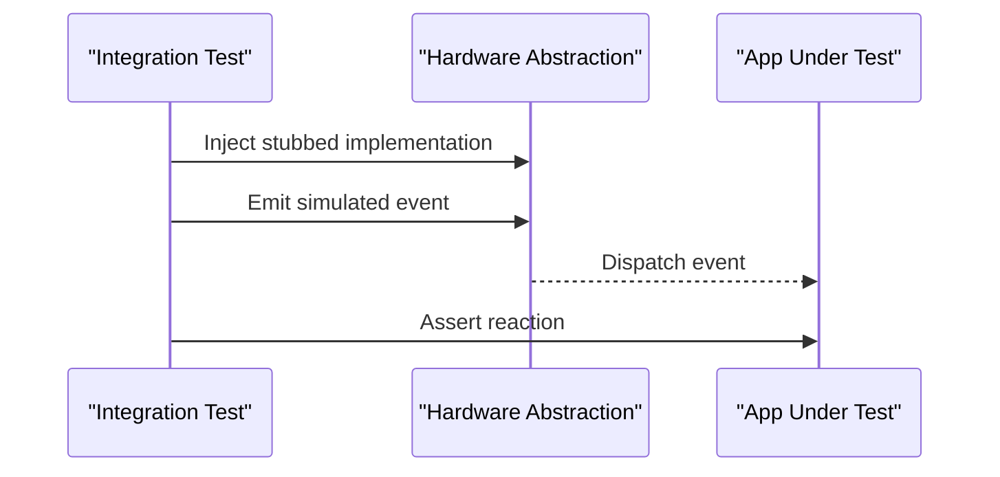
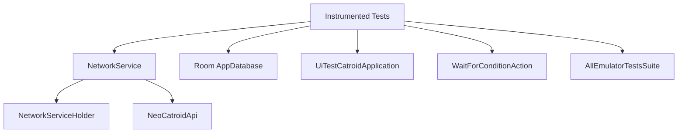

# Integration Testing

<cite>
**Referenced Files in This Document**
- [UiTestCatroidApplication.kt](file://catroid/src/androidTest/java/org/catrobat/catroid/UiTestCatroidApplication.kt)
- [WaitForConditionAction.kt](file://catroid/src/androidTest/java/org/catrobat/catroid/WaitForConditionAction.kt)
- [AllEmulatorTestsSuite.java](file://catroid/src/androidTest/java/org/catrobat/catroid/AllEmulatorTestsSuite.java)
- [retrofittesting](file://catroid/src/androidTest/java/org/catrobat/catroid/retrofittesting)
- [uiespresso](file://catroid/src/androidTest/java/org/catrobat/catroid/uiespresso)
- [test suites](file://catroid/src/androidTest/java/org/catrobat/catroid/testsuites)
- [runner](file://catroid/src/androidTest/java/org/catrobat/catroid/runner)
- [assets](file://catroid/src/androidTest/assets)
- [res/raw](file://catroid/src/androidTest/res/raw)
- [build.gradle](file://catroid/build.gradle)
- [NetworkService.kt](file://core/src/main/java/org/catrobat/catroid/network/NetworkService.kt)
- [NetworkServiceHolder.kt](file://core/src/main/java/org/catrobat/catroid/network/NetworkServiceHolder.kt)
- [NeoCatroidApi.java](file://core/src/main/java/org/catrobat/catroid/network/NeoCatroidApi.java)
- [AppDatabase schema 1](file://catroid/schemas/org.catrobat.catroid.db.AppDatabase/1.json)
- [AppDatabase schema 2](file://catroid/schemas/org.catrobat.catroid.db.AppDatabase/2.json)
</cite>

## Table of Contents
1. [Introduction](#introduction)
2. [Project Structure](#project-structure)
3. [Core Components](#core-components)
4. [Architecture Overview](#architecture-overview)
5. [Detailed Component Analysis](#detailed-component-analysis)
6. [Dependency Analysis](#dependency-analysis)
7. [Performance Considerations](#performance-considerations)
8. [Troubleshooting Guide](#troubleshooting-guide)
9. [Conclusion](#conclusion)
10. [Appendices](#appendices)

## Introduction
This document provides comprehensive integration testing guidance for NewCatroid, focusing on:
- Espresso framework setup and UI integration tests
- Database testing with the Room persistence layer
- Network testing using Retrofit mocks
- Testing component interactions, service integrations, and external API calls
- Examples covering block execution workflows, asset loading processes, and hardware abstraction layer interactions
- Test environment setup, mock services configuration, asynchronous operation handling
- Guidance on test data fixtures, database state management, and cleanup procedures

The goal is to help contributors author reliable, maintainable integration tests that validate end-to-end behaviors across UI, storage, networking, and runtime subsystems.

## Project Structure
Integration tests are organized under the androidTest source set within the catroid module. Key directories include:
- java: Instrumented test classes (Espresso UI tests, test runners, suites, and helpers)
- assets: Test fixtures for project files, backpack payloads, and network responses
- res/raw: Additional raw resources used by tests

**Diagram sources**
- [build.gradle](file://catroid/build.gradle)
- [uiespresso](file://catroid/src/androidTest/java/org/catrobat/catroid/uiespresso)
- [retrofittesting](file://catroid/src/androidTest/java/org/catrobat/catroid/retrofittesting)
- [test suites](file://catroid/src/androidTest/java/org/catrobat/catroid/testsuites)
- [runner](file://catroid/src/androidTest/java/org/catrobat/catroid/runner)
- [assets](file://catroid/src/androidTest/assets)
- [res/raw](file://catroid/src/androidTest/res/raw)

**Section sources**
- [build.gradle](file://catroid/build.gradle)

## Core Components
- UiTestCatroidApplication: Custom Application subclass used during instrumentation tests to initialize test-specific dependencies and services.
- WaitForConditionAction: Utility action to wait for asynchronous conditions in UI tests (e.g., background tasks completing).
- AllEmulatorTestsSuite: Test suite orchestrator to group and run emulator-based integration tests.
- retrofittesting: Package containing Retrofit-related test utilities and mock configurations for network layers.
- uiespresso: Package containing Espresso-based UI integration tests.
- testsuites: Collection of test suites organizing related integration tests.
- runner: Test runner utilities for instrumented tests.

These components collectively provide a foundation for UI-driven integration tests, controlled initialization, and robust waiting strategies for async operations.

**Section sources**
- [UiTestCatroidApplication.kt](file://catroid/src/androidTest/java/org/catrobat/catroid/UiTestCatroidApplication.kt)
- [WaitForConditionAction.kt](file://catroid/src/androidTest/java/org/catrobat/catroid/WaitForConditionAction.kt)
- [AllEmulatorTestsSuite.java](file://catroid/src/androidTest/java/org/catrobat/catroid/AllEmulatorTestsSuite.java)
- [retrofittesting](file://catroid/src/androidTest/java/org/catrobat/catroid/retrofittesting)
- [uiespresso](file://catroid/src/androidTest/java/org/catrobat/catroid/uiespresso)
- [test suites](file://catroid/src/androidTest/java/org/catrobat/catroid/testsuites)
- [runner](file://catroid/src/androidTest/java/org/catrobat/catroid/runner)

## Architecture Overview
The integration testing architecture centers around:
- UI layer validated via Espresso
- Persistence layer validated via Room database instances
- Networking layer validated via Retrofit mocks
- Runtime and services initialized through a test Application class

**Diagram sources**
- [UiTestCatroidApplication.kt](file://catroid/src/androidTest/java/org/catrobat/catroid/UiTestCatroidApplication.kt)
- [WaitForConditionAction.kt](file://catroid/src/androidTest/java/org/catrobat/catroid/WaitForConditionAction.kt)
- [AllEmulatorTestsSuite.java](file://catroid/src/androidTest/java/org/catrobat/catroid/AllEmulatorTestsSuite.java)
- [NetworkService.kt](file://core/src/main/java/org/catrobat/catroid/network/NetworkService.kt)
- [NetworkServiceHolder.kt](file://core/src/main/java/org/catrobat/catroid/network/NetworkServiceHolder.kt)
- [NeoCatroidApi.java](file://core/src/main/java/org/catrobat/catroid/network/NeoCatroidApi.java)

## Detailed Component Analysis

### Espresso UI Integration Tests
- Purpose: Validate user-facing flows and UI state transitions.
- Setup: Use UiTestCatroidApplication to bootstrap dependencies; leverage WaitForConditionAction to synchronize with background work.
- Best practices:
  - Keep tests focused on single user journeys.
  - Avoid flaky waits; prefer explicit condition checks.
  - Isolate UI tests from real network calls by mocking or intercepting requests.

**Diagram sources**
- [UiTestCatroidApplication.kt](file://catroid/src/androidTest/java/org/catrobat/catroid/UiTestCatroidApplication.kt)
- [WaitForConditionAction.kt](file://catroid/src/androidTest/java/org/catrobat/catroid/WaitForConditionAction.kt)
- [NetworkService.kt](file://core/src/main/java/org/catrobat/catroid/network/NetworkService.kt)

**Section sources**
- [UiTestCatroidApplication.kt](file://catroid/src/androidTest/java/org/catrobat/catroid/UiTestCatroidApplication.kt)
- [WaitForConditionAction.kt](file://catroid/src/androidTest/java/org/catrobat/catroid/WaitForConditionAction.kt)
- [uiespresso](file://catroid/src/androidTest/java/org/catrobat/catroid/uiespresso)

### Database Testing with Room
- Purpose: Ensure persistence correctness across migrations and queries.
- Approach:
  - Use an in-memory Room database instance for isolation.
  - Seed data via fixtures located in assets and res/raw.
  - Verify schema evolution using provided migration JSON files.
- State management:
  - Create fresh database per test.
  - Roll back or drop tables after assertions.
  - Validate migration paths between versions.

**Diagram sources**
- [AppDatabase schema 1](file://catroid/schemas/org.catrobat.catroid.db.AppDatabase/1.json)
- [AppDatabase schema 2](file://catroid/schemas/org.catrobat.catroid.db.AppDatabase/2.json)
- [assets](file://catroid/src/androidTest/assets)
- [res/raw](file://catroid/src/androidTest/res/raw)

**Section sources**
- [AppDatabase schema 1](file://catroid/schemas/org.catrobat.catroid.db.AppDatabase/1.json)
- [AppDatabase schema 2](file://catroid/schemas/org.catrobat.catroid.db.AppDatabase/2.json)
- [assets](file://catroid/src/androidTest/assets)
- [res/raw](file://catroid/src/androidTest/res/raw)

### Network Testing with Retrofit Mocks
- Purpose: Validate API contracts and error handling without hitting production endpoints.
- Configuration:
  - Use retrofittesting utilities to configure mock responses.
  - Replace real NetworkService implementation with a test variant.
  - Inject mocked NeoCatroidApi into NetworkServiceHolder where applicable.
- Scenarios:
  - Successful responses mapped to UI updates.
  - Error codes and timeouts handled gracefully.
  - Payload validation against fixture JSON files.

**Diagram sources**
- [retrofittesting](file://catroid/src/androidTest/java/org/catrobat/catroid/retrofittesting)
- [NetworkService.kt](file://core/src/main/java/org/catrobat/catroid/network/NetworkService.kt)
- [NetworkServiceHolder.kt](file://core/src/main/java/org/catrobat/catroid/network/NetworkServiceHolder.kt)
- [NeoCatroidApi.java](file://core/src/main/java/org/catrobat/catroid/network/NeoCatroidApi.java)
- [assets](file://catroid/src/androidTest/assets)

**Section sources**
- [retrofittesting](file://catroid/src/androidTest/java/org/catrobat/catroid/retrofittesting)
- [NetworkService.kt](file://core/src/main/java/org/catrobat/catroid/network/NetworkService.kt)
- [NetworkServiceHolder.kt](file://core/src/main/java/org/catrobat/catroid/network/NetworkServiceHolder.kt)
- [NeoCatroidApi.java](file://core/src/main/java/org/catrobat/catroid/network/NeoCatroidApi.java)

### Block Execution Workflow Testing
- Purpose: Validate end-to-end execution of block-based scripts within the runtime.
- Strategy:
  - Load sample projects/fixtures from assets.
  - Drive UI to start execution and observe stage changes.
  - Use WaitForConditionAction to await completion signals.
  - Assert visual state and runtime variables.

[No sources needed since this diagram shows conceptual workflow, not actual code structure]

### Asset Loading Process Testing
- Purpose: Ensure assets (images, sounds, project files) load correctly and are accessible at runtime.
- Strategy:
  - Reference fixtures in assets and res/raw.
  - Validate file integrity and parsing success.
  - Confirm resource IDs resolve in UI contexts.

[No sources needed since this diagram shows conceptual workflow, not actual code structure]

### Hardware Abstraction Layer Interactions
- Purpose: Test interactions with hardware abstractions (sensors, Bluetooth, etc.) deterministically.
- Strategy:
  - Provide stubbed implementations for hardware interfaces in tests.
  - Simulate events and verify app reactions.
  - Use test runners and suites to orchestrate multi-step scenarios.

[No sources needed since this diagram shows conceptual workflow, not actual code structure]

## Dependency Analysis
Integration tests depend on core services and modules:
- NetworkService and its holder manage HTTP clients and API definitions.
- NeoCatroidApi defines Retrofit endpoints consumed by tests.
- Room schemas define persistence expectations validated by tests.
- Test harness components initialize and coordinate test environments.

**Diagram sources**
- [NetworkService.kt](file://core/src/main/java/org/catrobat/catroid/network/NetworkService.kt)
- [NetworkServiceHolder.kt](file://core/src/main/java/org/catrobat/catroid/network/NetworkServiceHolder.kt)
- [NeoCatroidApi.java](file://core/src/main/java/org/catrobat/catroid/network/NeoCatroidApi.java)
- [UiTestCatroidApplication.kt](file://catroid/src/androidTest/java/org/catrobat/catroid/UiTestCatroidApplication.kt)
- [WaitForConditionAction.kt](file://catroid/src/androidTest/java/org/catrobat/catroid/WaitForConditionAction.kt)
- [AllEmulatorTestsSuite.java](file://catroid/src/androidTest/java/org/catrobat/catroid/AllEmulatorTestsSuite.java)

**Section sources**
- [NetworkService.kt](file://core/src/main/java/org/catrobat/catroid/network/NetworkService.kt)
- [NetworkServiceHolder.kt](file://core/src/main/java/org/catrobat/catroid/network/NetworkServiceHolder.kt)
- [NeoCatroidApi.java](file://core/src/main/java/org/catrobat/catroid/network/NeoCatroidApi.java)
- [UiTestCatroidApplication.kt](file://catroid/src/androidTest/java/org/catrobat/catroid/UiTestCatroidApplication.kt)
- [WaitForConditionAction.kt](file://catroid/src/androidTest/java/org/catrobat/catroid/WaitForConditionAction.kt)
- [AllEmulatorTestsSuite.java](file://catroid/src/androidTest/java/org/catrobat/catroid/AllEmulatorTestsSuite.java)

## Performance Considerations
- Prefer in-memory databases for speed and isolation.
- Minimize heavy asset loads; use small fixtures.
- Batch assertions to reduce UI interactions.
- Reuse shared test fixtures and avoid redundant setup.
- Leverage test suites to parallelize independent tests where possible.

[No sources needed since this section provides general guidance]

## Troubleshooting Guide
Common issues and resolutions:
- Flaky UI tests: Replace sleeps with WaitForConditionAction and explicit visibility/state checks.
- Network failures: Ensure Retrofit mocks return deterministic responses; verify fixture JSON validity.
- Database inconsistencies: Drop and recreate Room instances per test; confirm migration paths exist.
- Initialization errors: Validate UiTestCatroidApplication sets up required services before UI actions.

**Section sources**
- [WaitForConditionAction.kt](file://catroid/src/androidTest/java/org/catrobat/catroid/WaitForConditionAction.kt)
- [UiTestCatroidApplication.kt](file://catroid/src/androidTest/java/org/catrobat/catroid/UiTestCatroidApplication.kt)
- [retrofittesting](file://catroid/src/androidTest/java/org/catrobat/catroid/retrofittesting)
- [assets](file://catroid/src/androidTest/assets)
- [res/raw](file://catroid/src/androidTest/res/raw)

## Conclusion
NewCatroid’s integration testing strategy combines Espresso UI validation, Room persistence verification, and Retrofit network mocking, orchestrated by dedicated test harness components. By following the patterns outlined here—using fixtures, managing database state, configuring mock services, and synchronizing asynchronous operations—you can build robust, maintainable integration tests that cover critical workflows such as block execution, asset loading, and hardware abstraction interactions.

[No sources needed since this section summarizes without analyzing specific files]

## Appendices

### Test Environment Setup Checklist
- Configure UiTestCatroidApplication for test builds.
- Add Retrofit mock utilities under retrofittesting.
- Place fixtures in assets and res/raw.
- Define Room schema migrations and validate them.
- Organize tests into suites and runners for clarity.

**Section sources**
- [UiTestCatroidApplication.kt](file://catroid/src/androidTest/java/org/catrobat/catroid/UiTestCatroidApplication.kt)
- [retrofittesting](file://catroid/src/androidTest/java/org/catrobat/catroid/retrofittesting)
- [assets](file://catroid/src/androidTest/assets)
- [res/raw](file://catroid/src/androidTest/res/raw)
- [AppDatabase schema 1](file://catroid/schemas/org.catrobat.catroid.db.AppDatabase/1.json)
- [AppDatabase schema 2](file://catroid/schemas/org.catrobat.catroid.db.AppDatabase/2.json)