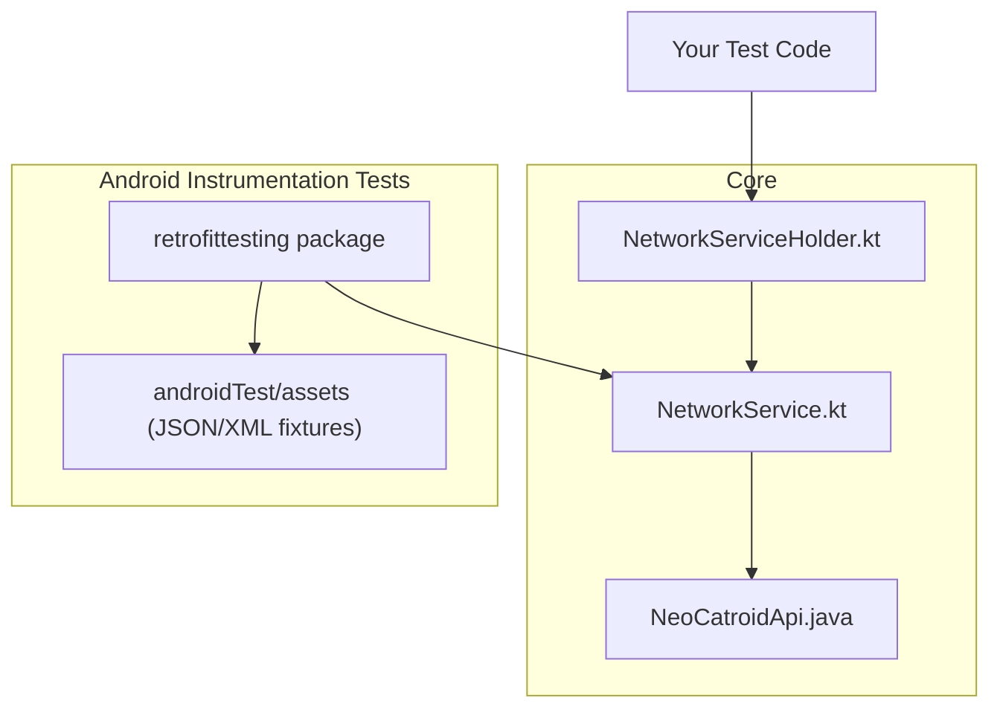
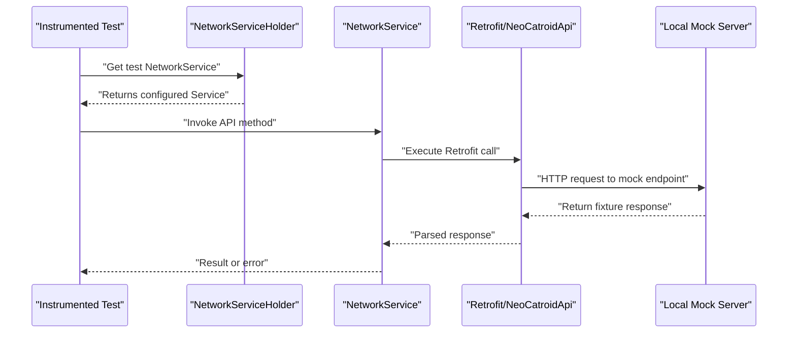
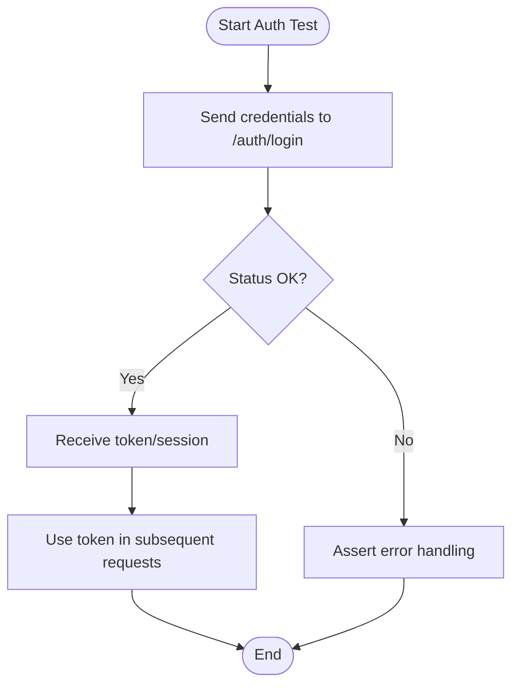
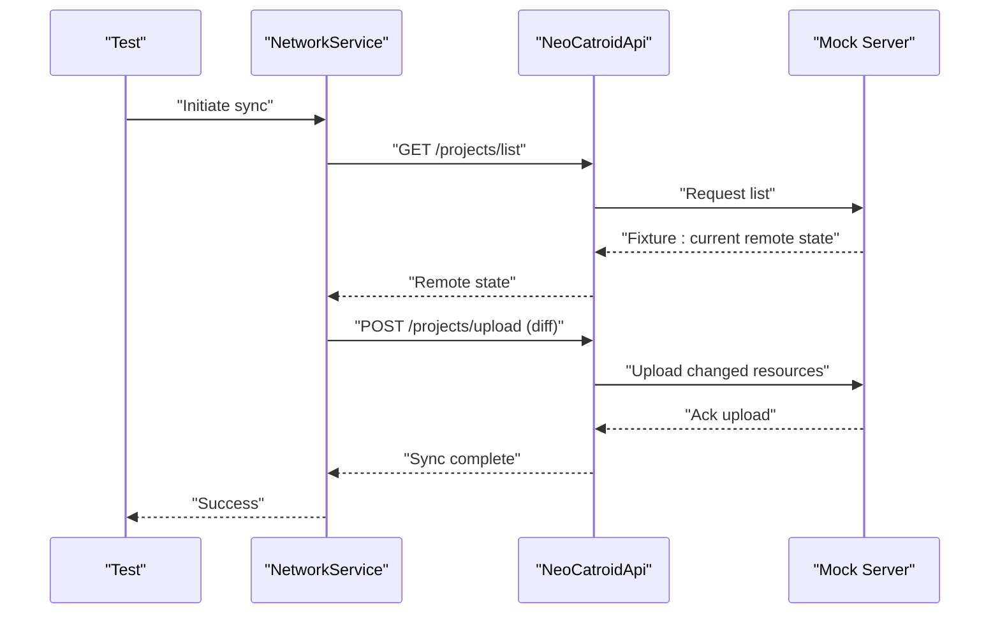
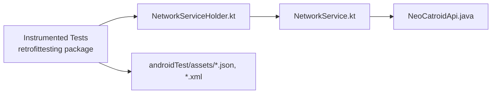

# Network Integration Testing

<cite>
**Referenced Files in This Document**
- [NetworkService.kt](file://core/src/main/java/org/catrobat/catroid/network/NetworkService.kt)
- [NetworkServiceHolder.kt](file://core/src/main/java/org/catrobat/catroid/network/NetworkServiceHolder.kt)
- [NeoCatroidApi.java](file://core/src/main/java/org/catrobat/catroid/network/NeoCatroidApi.java)
- [retrofittesting package](file://catroid/src/androidTest/java/org/catrobat/catroid/retrofittesting)
- [androidTest assets](file://catroid/src/androidTest/assets)
</cite>

## Table of Contents
1. [Introduction](#introduction)
2. [Project Structure](#project-structure)
3. [Core Components](#core-components)
4. [Architecture Overview](#architecture-overview)
5. [Detailed Component Analysis](#detailed-component-analysis)
6. [Dependency Analysis](#dependency-analysis)
7. [Performance Considerations](#performance-considerations)
8. [Troubleshooting Guide](#troubleshooting-guide)
9. [Conclusion](#conclusion)
10. [Appendices](#appendices)

## Introduction
This document provides comprehensive guidance for network integration testing in NewCatroid, focusing on Retrofit-based API calls. It explains how to set up a mock server, manage response fixtures, simulate network errors, and test cloud service integrations including authentication flows and data synchronization. It also covers project upload/download scenarios, user authentication, real-time collaboration features, handling timeouts and retries, offline behavior, and strategies for test data management and network condition simulation.

## Project Structure
The networking layer is centralized under the core module with Retrofit interfaces and service holders. Android instrumentation tests reside under androidTest, where you can place mock server logic and response fixtures.

**Diagram sources**
- [NetworkService.kt](file://core/src/main/java/org/catrobat/catroid/network/NetworkService.kt)
- [NetworkServiceHolder.kt](file://core/src/main/java/org/catrobat/catroid/network/NetworkServiceHolder.kt)
- [NeoCatroidApi.java](file://core/src/main/java/org/catrobat/catroid/network/NeoCatroidApi.java)
- [retrofittesting package](file://catroid/src/androidTest/java/org/catrobat/catroid/retrofittesting)
- [androidTest assets](file://catroid/src/androidTest/assets)

**Section sources**
- [NetworkService.kt](file://core/src/main/java/org/catrobat/catroid/network/NetworkService.kt)
- [NetworkServiceHolder.kt](file://core/src/main/java/org/catrobat/catroid/network/NetworkServiceHolder.kt)
- [NeoCatroidApi.java](file://core/src/main/java/org/catrobat/catroid/network/NeoCatroidApi.java)
- [retrofittesting package](file://catroid/src/androidTest/java/org/catrobat/catroid/retrofittesting)
- [androidTest assets](file://catroid/src/androidTest/assets)

## Core Components
- NetworkService: Central entry point for HTTP operations via Retrofit. Use this class to configure base URLs, interceptors, and client instances for both production and test environments.
- NetworkServiceHolder: Provides access to the configured NetworkService instance across the app or tests. In tests, replace it with a test-specific holder that points to a local mock server.
- NeoCatroidApi: Retrofit interface defining endpoints, request/response models, and serialization rules. Tests should assert against these contracts.

Key responsibilities:
- Base URL configuration and environment switching
- Interceptors for logging, auth headers, and error mapping
- Serialization/deserialization for JSON payloads
- Error translation into domain-friendly exceptions

**Section sources**
- [NetworkService.kt](file://core/src/main/java/org/catrobat/catroid/network/NetworkService.kt)
- [NetworkServiceHolder.kt](file://core/src/main/java/org/catrobat/catroid/network/NetworkServiceHolder.kt)
- [NeoCatroidApi.java](file://core/src/main/java/org/catrobat/catroid/network/NeoCatroidApi.java)

## Architecture Overview
The following diagram shows how tests interact with the networking stack and a local mock server.

**Diagram sources**
- [NetworkService.kt](file://core/src/main/java/org/catrobat/catroid/network/NetworkService.kt)
- [NetworkServiceHolder.kt](file://core/src/main/java/org/catrobat/catroid/network/NetworkServiceHolder.kt)
- [NeoCatroidApi.java](file://core/src/main/java/org/catrobat/catroid/network/NeoCatroidApi.java)

## Detailed Component Analysis

### Mock Server Setup
- Choose a lightweight embedded HTTP server (e.g., WireMock, MockWebServer). For Android instrumentation tests, an embedded server avoids external dependencies on CI.
- Configure the server to respond with predefined fixtures from androidTest/assets. Map routes to files by path and status code.
- Start the server before tests and stop it after each test to ensure isolation.
- Point NetworkService’s base URL to http://127.0.0.1:<port> during tests.

Best practices:
- Use unique ports per test run to avoid conflicts.
- Reset state between tests to prevent cross-test pollution.
- Keep route definitions close to the corresponding NeoCatroidApi methods for clarity.

**Section sources**
- [NetworkService.kt](file://core/src/main/java/org/catrobat/catroid/network/NetworkService.kt)
- [NetworkServiceHolder.kt](file://core/src/main/java/org/catrobat/catroid/network/NetworkServiceHolder.kt)
- [androidTest assets](file://catroid/src/androidTest/assets)

### Response File Management
- Store expected responses in androidTest/assets using descriptive names (e.g., featured_projects_success_response.json).
- Organize fixtures by feature area (auth, projects, backpack, categories).
- Include both success and failure payloads (e.g., invalid_project.xml, backpack_invalid.json).
- Validate deserialization by asserting model fields match expectations.

Guidelines:
- Keep fixtures minimal but representative of real server outputs.
- Version fixtures alongside API changes.
- Provide edge-case fixtures (empty lists, large payloads, malformed JSON).

**Section sources**
- [androidTest assets](file://catroid/src/androidTest/assets)

### Network Error Simulation
- Simulate server-side failures by returning non-2xx status codes (e.g., 401, 403, 404, 500).
- Inject connection-level errors (timeouts, DNS failures) at the OkHttp level.
- Verify that your error mapping translates raw HTTP errors into domain exceptions and UI feedback.

Common scenarios:
- Authentication failures (expired token, invalid credentials)
- Resource not found or permission denied
- Server errors and partial responses
- Malformed payloads to exercise parsing errors

**Section sources**
- [NetworkService.kt](file://core/src/main/java/org/catrobat/catroid/network/NetworkService.kt)
- [NeoCatroidApi.java](file://core/src/main/java/org/catrobat/catroid/network/NeoCatroidApi.java)

### Cloud Service Integrations
- Isolate third-party services behind NeoCatroidApi. Replace base URLs in tests to point to your mock server.
- For features like project upload/download, backpack sync, and category listing, create dedicated fixtures and assertions.
- Ensure idempotency checks are covered when applicable.

Examples:
- Upload a project file and assert success/failure based on server response.
- Download a project and verify content integrity.
- Sync backpack items and validate list updates.

**Section sources**
- [NeoCatroidApi.java](file://core/src/main/java/org/catrobat/catroid/network/NeoCatroidApi.java)
- [NetworkService.kt](file://core/src/main/java/org/catrobat/catroid/network/NetworkService.kt)

### Authentication Flows
- Mock login endpoints to return tokens or session cookies as required by your API.
- Add an interceptor to attach Authorization headers automatically in tests.
- Cover flows for successful login, invalid credentials, token refresh, and logout.

Flow overview:

**Diagram sources**
- [NeoCatroidApi.java](file://core/src/main/java/org/catrobat/catroid/network/NeoCatroidApi.java)
- [NetworkService.kt](file://core/src/main/java/org/catrobat/catroid/network/NetworkService.kt)

**Section sources**
- [NeoCatroidApi.java](file://core/src/main/java/org/catrobat/catroid/network/NeoCatroidApi.java)
- [NetworkService.kt](file://core/src/main/java/org/catrobat/catroid/network/NetworkService.kt)

### Data Synchronization Processes
- Model sync operations as sequences of API calls (list, diff, upload, download).
- Use fixtures to represent incremental changes and conflict scenarios.
- Assert final state consistency after sync completes.

Sync flow overview:

**Diagram sources**
- [NeoCatroidApi.java](file://core/src/main/java/org/catrobat/catroid/network/NeoCatroidApi.java)
- [NetworkService.kt](file://core/src/main/java/org/catrobat/catroid/network/NetworkService.kt)

**Section sources**
- [NeoCatroidApi.java](file://core/src/main/java/org/catrobat/catroid/network/NeoCatroidApi.java)
- [NetworkService.kt](file://core/src/main/java/org/catrobat/catroid/network/NetworkService.kt)

### Real-Time Collaboration Features
- For collaborative editing or presence features, mock WebSocket-like behaviors or polling endpoints if applicable.
- If using long-polling, simulate delayed responses and concurrent updates.
- Validate optimistic updates and conflict resolution strategies.

[No sources needed since this section doesn't analyze specific files]

### Handling Timeouts, Retries, and Offline Scenarios
- Configure timeouts at the OkHttp/Retrofit level and assert behavior when exceeded.
- Implement retry policies for transient errors; verify that tests cover max-retry exhaustion.
- Simulate offline mode by refusing connections or returning immediate errors; ensure UI reflects offline state.

Recommendations:
- Separate unit tests for retry/backoff logic from integration tests.
- Use deterministic delays in mocks to validate timeout paths without flakiness.

**Section sources**
- [NetworkService.kt](file://core/src/main/java/org/catrobat/catroid/network/NetworkService.kt)

### Test Data Management and Fixtures Strategy
- Maintain a clear directory structure under androidTest/assets grouped by feature.
- Use naming conventions that reflect endpoint and outcome (e.g., projects_categories_response.json).
- Provide invalid fixtures to exercise error paths (e.g., backpack_invalid.json, invalid_project.xml).

**Section sources**
- [androidTest assets](file://catroid/src/androidTest/assets)

### Network Condition Simulation
- Use OkHttp’s MockInterceptor or server-level controls to inject latency, packet loss, and throttling.
- Combine with device network profiles (e.g., slow 3G) for realistic conditions.
- Validate UI indicators (progress, error messages) under degraded networks.

**Section sources**
- [NetworkService.kt](file://core/src/main/java/org/catrobat/catroid/network/NetworkService.kt)

## Dependency Analysis
The test layer depends on the networking components and uses fixtures to drive behavior. The following diagram highlights key relationships.

**Diagram sources**
- [retrofittesting package](file://catroid/src/androidTest/java/org/catrobat/catroid/retrofittesting)
- [NetworkServiceHolder.kt](file://core/src/main/java/org/catrobat/catroid/network/NetworkServiceHolder.kt)
- [NetworkService.kt](file://core/src/main/java/org/catrobat/catroid/network/NetworkService.kt)
- [NeoCatroidApi.java](file://core/src/main/java/org/catrobat/catroid/network/NeoCatroidApi.java)
- [androidTest assets](file://catroid/src/androidTest/assets)

**Section sources**
- [retrofittesting package](file://catroid/src/androidTest/java/org/catrobat/catroid/retrofittesting)
- [NetworkServiceHolder.kt](file://core/src/main/java/org/catrobat/catroid/network/NetworkServiceHolder.kt)
- [NetworkService.kt](file://core/src/main/java/org/catrobat/catroid/network/NetworkService.kt)
- [NeoCatroidApi.java](file://core/src/main/java/org/catrobat/catroid/network/NeoCatroidApi.java)
- [androidTest assets](file://catroid/src/androidTest/assets)

## Performance Considerations
- Prefer small, focused fixtures to reduce I/O overhead.
- Reuse a single mock server instance across related tests when safe.
- Avoid heavy uploads/downloads in fast-path tests; use smaller payloads.
- Parallelize independent tests carefully to avoid port conflicts.

[No sources needed since this section provides general guidance]

## Troubleshooting Guide
Common issues and resolutions:
- Port binding conflicts: Assign dynamic ports and log them for debugging.
- Fixture mismatch: Compare actual vs expected structures; update fixtures when APIs evolve.
- Timeouts: Increase test timeouts for slow operations; ensure mocks respond promptly.
- Authentication header missing: Verify interceptor wiring in test NetworkService setup.
- Offline behavior not triggered: Confirm connection refusal or immediate error injection.

**Section sources**
- [NetworkService.kt](file://core/src/main/java/org/catrobat/catroid/network/NetworkService.kt)
- [NeoCatroidApi.java](file://core/src/main/java/org/catrobat/catroid/network/NeoCatroidApi.java)

## Conclusion
By centralizing networking through NetworkService and NeoCatroidApi, and by leveraging a local mock server with well-managed fixtures, NewCatroid’s integration tests can reliably validate cloud interactions, authentication, synchronization, and resilience patterns. Adopting consistent fixture organization, robust error simulation, and careful timeout/retry coverage will improve test stability and confidence in network-dependent features.

[No sources needed since this section summarizes without analyzing specific files]

## Appendices

### Example Scenarios Checklist
- Project upload:
  - Success path with valid XML
  - Failure path with invalid_project.xml
- Project download:
  - Successful retrieval and integrity check
  - Partial or corrupted payload handling
- User authentication:
  - Valid credentials, invalid credentials, expired token
- Backpack sync:
  - List, add, remove, conflict resolution
- Categories listing:
  - Empty list, large dataset, malformed response

**Section sources**
- [androidTest assets](file://catroid/src/androidTest/assets)
- [NeoCatroidApi.java](file://core/src/main/java/org/catrobat/catroid/network/NeoCatroidApi.java)