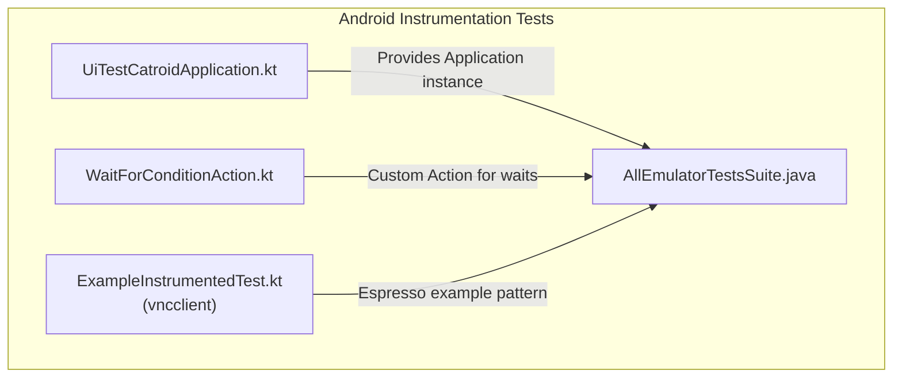
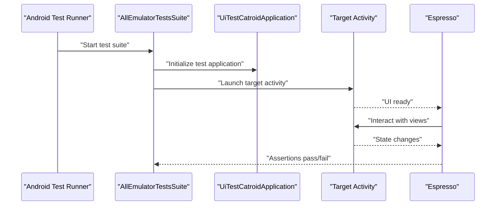
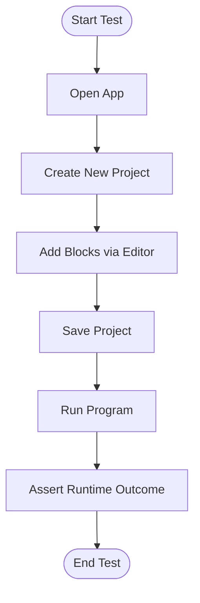
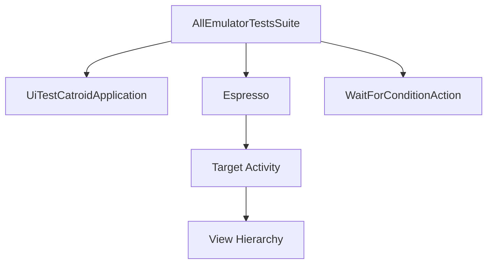

# UI Integration Testing

<cite>
**Referenced Files in This Document**
- [UiTestCatroidApplication.kt](file://catroid/src/androidTest/java/org/catrobat/catroid/UiTestCatroidApplication.kt)
- [WaitForConditionAction.kt](file://catroid/src/androidTest/java/org/catrobat/catroid/WaitForConditionAction.kt)
- [AllEmulatorTestsSuite.java](file://catroid/src/androidTest/java/org/catrobat/catroid/AllEmulatorTestsSuite.java)
- [ExampleInstrumentedTest.kt](file://vncclient/src/androidTest/java/com/danvexteam/vncclient/ExampleInstrumentedTest.kt)
</cite>

## Table of Contents
1. [Introduction](#introduction)
2. [Project Structure](#project-structure)
3. [Core Components](#core-components)
4. [Architecture Overview](#architecture-overview)
5. [Detailed Component Analysis](#detailed-component-analysis)
6. [Dependency Analysis](#dependency-analysis)
7. [Performance Considerations](#performance-considerations)
8. [Troubleshooting Guide](#troubleshooting-guide)
9. [Conclusion](#conclusion)
10. [Appendices](#appendices)

## Introduction
This document explains how to perform UI integration testing for NewCatroid using the Espresso framework. It covers test setup, launching activities, interacting with views, and validating user workflows such as creating projects, adding blocks, and running programs. It also provides guidance on handling asynchronous operations, animations, background tasks, preparing test data, mocking external dependencies, and configuring the test environment.

## Project Structure
The Android instrumentation tests live under the androidTest source set of the catroid module. The structure includes:
- Test application class used by instrumentation tests
- Custom actions and rules for synchronization and waiting
- Test suites for orchestrating emulator-based runs
- Example instrumentation test in a sub-module (vncclient) demonstrating standard Espresso usage patterns

**Diagram sources**
- [UiTestCatroidApplication.kt](file://catroid/src/androidTest/java/org/catrobat/catroid/UiTestCatroidApplication.kt)
- [WaitForConditionAction.kt](file://catroid/src/androidTest/java/org/catrobat/catroid/WaitForConditionAction.kt)
- [AllEmulatorTestsSuite.java](file://catroid/src/androidTest/java/org/catrobat/catroid/AllEmulatorTestsSuite.java)
- [ExampleInstrumentedTest.kt](file://vncclient/src/androidTest/java/com/danvexteam/vncclient/ExampleInstrumentedTest.kt)

**Section sources**
- [UiTestCatroidApplication.kt](file://catroid/src/androidTest/java/org/catrobat/catroid/UiTestCatroidApplication.kt)
- [WaitForConditionAction.kt](file://catroid/src/androidTest/java/org/catrobat/catroid/WaitForConditionAction.kt)
- [AllEmulatorTestsSuite.java](file://catroid/src/androidTest/java/org/catrobat/catroid/AllEmulatorTestsSuite.java)
- [ExampleInstrumentedTest.kt](file://vncclient/src/androidTest/java/com/danvexteam/vncclient/ExampleInstrumentedTest.kt)

## Core Components
- Test Application Class: Provides a custom Application instance for instrumentation tests, enabling consistent initialization across test runs.
- Custom Wait Action: Supplies a reusable action to wait for conditions, useful for synchronizing with asynchronous UI updates or background work.
- Test Suite Orchestrator: Aggregates and runs emulator-based tests, centralizing configuration and lifecycle management.
- Example Instrumentation Test: Demonstrates standard Espresso usage patterns that can be adapted for Catroid’s UI flows.

Key responsibilities:
- Establishing a stable test runtime via a dedicated Application class
- Synchronizing tests with UI state changes through custom actions
- Running cohesive suites of UI tests on emulators
- Providing a baseline example for writing robust Espresso tests

**Section sources**
- [UiTestCatroidApplication.kt](file://catroid/src/androidTest/java/org/catrobat/catroid/UiTestCatroidApplication.kt)
- [WaitForConditionAction.kt](file://catroid/src/androidTest/java/org/catrobat/catroid/WaitForConditionAction.kt)
- [AllEmulatorTestsSuite.java](file://catroid/src/androidTest/java/org/catrobat/catroid/AllEmulatorTestsSuite.java)
- [ExampleInstrumentedTest.kt](file://vncclient/src/androidTest/java/com/danvexteam/vncclient/ExampleInstrumentedTest.kt)

## Architecture Overview
At a high level, Espresso drives the UI while your test code interacts with Activities and Views. The test suite initializes the test application and coordinates execution. Custom actions help synchronize with asynchronous behavior.

[No sources needed since this diagram shows conceptual workflow, not actual code structure]

## Detailed Component Analysis

### Test Application Setup
Purpose:
- Provide a deterministic Application instance for instrumentation tests
- Centralize any test-specific initialization required before Activities start

Guidance:
- Use the test Application class when launching Activities in tests to ensure consistent state
- Keep initialization minimal and focused on UI-relevant setup

**Section sources**
- [UiTestCatroidApplication.kt](file://catroid/src/androidTest/java/org/catrobat/catroid/UiTestCatroidApplication.kt)

### Synchronization and Waiting
Purpose:
- Handle asynchronous UI updates, animations, and background tasks reliably
- Avoid flaky tests by explicitly waiting for conditions

Guidance:
- Create custom Actions that assert and wait for specific UI states
- Use these actions around interactions that trigger background work or animations
- Prefer explicit waits over arbitrary sleeps

**Section sources**
- [WaitForConditionAction.kt](file://catroid/src/androidTest/java/org/catrobat/catroid/WaitForConditionAction.kt)

### Test Suite Orchestration
Purpose:
- Aggregate and run emulator-based UI tests
- Provide centralized configuration for test environments

Guidance:
- Use the suite to group related UI tests
- Ensure the test runner uses the correct test Application class
- Configure device/emulator settings at the suite level where applicable

**Section sources**
- [AllEmulatorTestsSuite.java](file://catroid/src/androidTest/java/org/catrobat/catroid/AllEmulatorTestsSuite.java)

### Espresso Usage Patterns
Purpose:
- Demonstrate standard patterns for locating, interacting with, and asserting on UI elements

Guidance:
- Follow the example instrumentation test for basic view interaction and assertions
- Adapt patterns to Catroid’s Activities and Fragments
- Combine with custom wait actions for robustness

**Section sources**
- [ExampleInstrumentedTest.kt](file://vncclient/src/androidTest/java/com/danvexteam/vncclient/ExampleInstrumentedTest.kt)

### Block Editor Interactions
Approach:
- Launch the block editor screen from the project list or create-project flow
- Locate block categories and individual blocks using view identifiers or content descriptions
- Drag-and-drop blocks onto the stage area using drag gestures
- Validate block placement and visual feedback

Synchronization:
- Use custom wait actions to confirm drop completion and layout stabilization
- Assert on newly added blocks’ presence and properties

Best practices:
- Isolate each drag-and-drop scenario
- Reset editor state between scenarios
- Use meaningful assertions on final block arrangement

[No sources needed since this section doesn't analyze specific files]

### Form Inputs and Navigation
Approach:
- Navigate to forms (e.g., project creation dialogs)
- Input text into fields, select options, and submit
- Verify navigation to subsequent screens and persisted values

Synchronization:
- Wait for form validation messages or loading indicators to disappear
- Assert on success prompts or error messages

Best practices:
- Parameterize inputs for multiple scenarios
- Clear input fields before reusing forms
- Validate both immediate feedback and downstream effects

[No sources needed since this section doesn't analyze specific files]

### End-to-End Workflows
Examples:
- Create a new project, add blocks, save, and run the program
- Import a project, modify it, and verify runtime behavior

Flow overview:

[No sources needed since this diagram shows conceptual workflow, not actual code structure]

## Dependency Analysis
Conceptual relationships among test components:
- The test suite depends on the test application for initialization
- Espresso depends on the launched Activity and its View hierarchy
- Custom wait actions depend on the UI thread and view tree stability

[No sources needed since this diagram shows conceptual workflow, not actual code structure]

## Performance Considerations
- Minimize heavy initialization in tests; defer expensive setup until necessary
- Reuse Activities where possible to avoid repeated launches
- Use precise matchers and selectors to reduce search overhead
- Avoid unnecessary screenshots or logs during routine runs
- Group related interactions to reduce context switches

[No sources needed since this section provides general guidance]

## Troubleshooting Guide
Common issues and remedies:
- Flaky waits: Replace implicit delays with explicit custom wait actions that assert on concrete UI states
- Stale view references: Re-query views after significant UI transitions
- Background tasks: Introduce synchronization points before assertions
- Network or I/O: Mock or stub external dependencies to isolate UI behavior
- Emulator instability: Increase timeouts selectively and ensure device readiness before starting tests

[No sources needed since this section provides general guidance]

## Conclusion
By leveraging the test application class, custom synchronization actions, and structured test suites, you can build robust Espresso-based UI integration tests for NewCatroid. Focus on deterministic setup, explicit synchronization, and clear assertions to maintain reliability across complex workflows like block editing and program execution.

[No sources needed since this section summarizes without analyzing specific files]

## Appendices

### Test Data Preparation
- Place static assets (XML projects, images, sounds) in the androidTest assets directory
- Load resources via resource IDs or file paths available to instrumentation tests
- Version-control only small, essential fixtures; generate large datasets programmatically if needed

[No sources needed since this section provides general guidance]

### Mocking External Dependencies
- Replace network calls with local JSON fixtures or mock servers
- Stub storage and system services behind interfaces to control behavior in tests
- Ensure mocks are reset between tests to prevent cross-test contamination

[No sources needed since this section provides general guidance]

### Environment Configuration
- Configure the test runner to use the test Application class
- Set device locale, orientation, and permissions relevant to UI flows
- Define environment flags to disable non-essential features during tests

[No sources needed since this section provides general guidance]