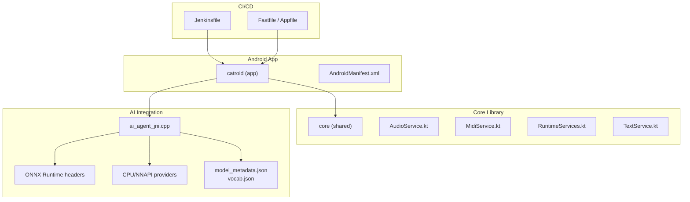
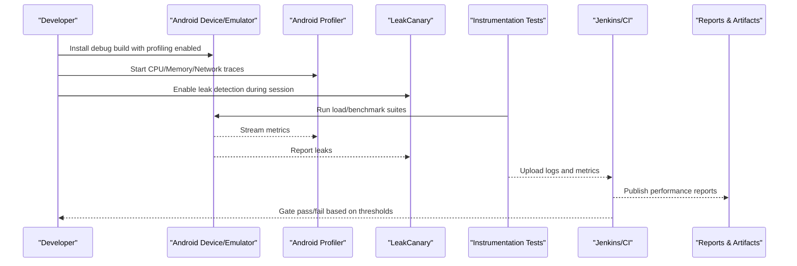
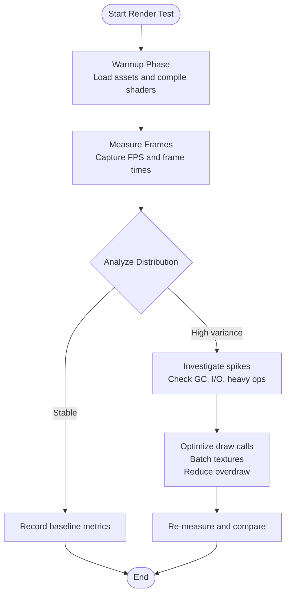
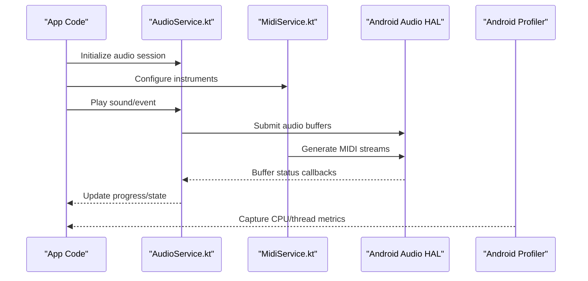
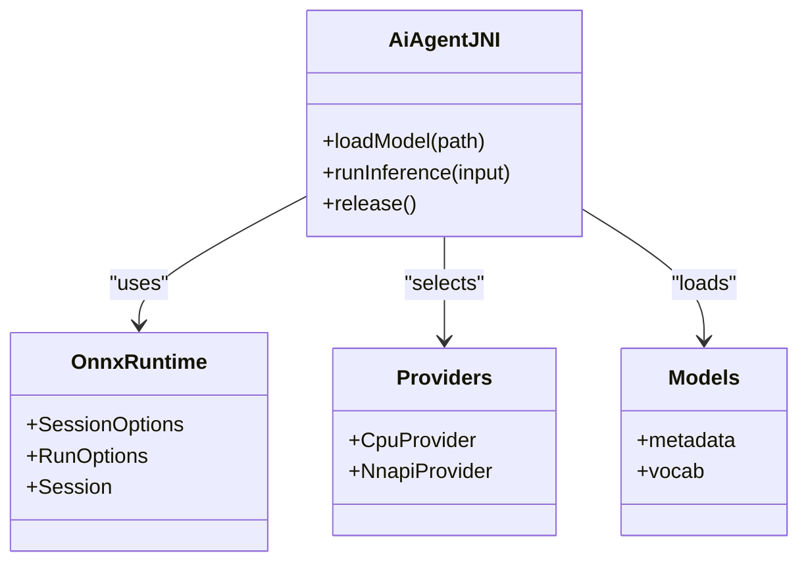
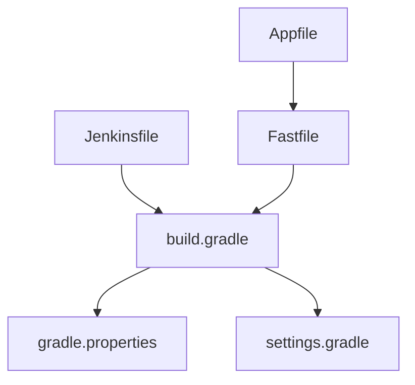

# Performance Testing

<cite>
**Referenced Files in This Document**
- [Jenkinsfile](file://Jenkinsfile)
- [build.gradle](file://catroid/build.gradle)
- [gradle.properties](file://gradle.properties)
- [settings.gradle](file://settings.gradle)
- [AndroidManifest.xml](file://catroid/src/main/AndroidManifest.xml)
- [AudioService.kt](file://core/src/main/java/org/catrobat/catroid/audio/AudioService.kt)
- [MidiService.kt](file://core/src/main/java/org/catrobat/catroid/audio/MidiService.kt)
- [RuntimeServices.kt](file://core/src/main/java/org/catrobat/catroid/runtime/RuntimeServices.kt)
- [TextService.kt](file://core/src/main/java/org/catrobat/catroid/text/TextService.kt)
- [ai_agent_jni.cpp](file://catroid/src/main/cpp/ai_agent_jni.cpp)
- [onnxruntime_cxx_api.h](file://catroid/src/main/cpp/onnxruntime_cxx_api.h)
- [cpu_provider_factory.h](file://catroid/src/main/cpp/cpu_provider_factory.h)
- [nnapi_provider_factory.h](file://catroid/src/main/cpp/nnapi_provider_factory.h)
- [model_metadata.json](file://aip/model/model_metadata.json)
- [vocab.json](file://aip/model/vocab.json)
- [train.py](file://aip/train.py)
- [suggest.py](file://aip/suggest.py)
- [tokenizer.py](file://aip/tokenizer.py)
- [code_xml_parser.py](file://aip/code_xml_parser.py)
- [pattern_extractor.py](file://aip/pattern_extractor.py)
- [AllEmulatorTestsSuite.java](file://catroid/src/androidTest/java/org/catrobat/catroid/AllEmulatorTestsSuite.java)
- [UiTestCatroidApplication.kt](file://catroid/src/androidTest/java/org/catrobat/catroid/UiTestCatroidApplication.kt)
- [WaitForConditionAction.kt](file://catroid/src/androidTest/java/org/catrobat/catroid/WaitForConditionAction.kt)
- [Fastfile](file://fastlane/Fastfile)
- [Appfile](file://fastlane/Appfile)
</cite>

## Table of Contents
1. Introduction
2. Project Structure
3. Core Components
4. Architecture Overview
5. Detailed Component Analysis
6. Dependency Analysis
7. Performance Considerations
8. Troubleshooting Guide
9. Conclusion
10. Appendices

## Introduction
This document provides comprehensive performance testing guidance for NewCatroid, focusing on:
- Profiling methodologies using Android Profiler
- Memory leak detection with LeakCanary
- CPU performance analysis and benchmarking frameworks
- Load testing scenarios for concurrent block execution, large project handling, and resource-intensive operations
- Automated performance gates in CI/CD pipelines
- Examples for rendering performance, audio processing speed, and AI model inference time
- Production monitoring, A/B testing strategies, and optimization recommendations based on test results

The content is grounded in the repository’s structure and existing components, including runtime services, audio subsystems, text rendering, and AI integration via ONNX Runtime.

## Project Structure
NewCatroid is a multi-module Android project with:
- Android app module under catroid
- Shared core logic under core
- Desktop runtime under desktop-runtime
- AI-related scripts and models under aip
- CI configuration files at the root (Jenkinsfiles)
- Build and release tooling via Gradle and Fastlane

**Diagram sources**
- [AndroidManifest.xml](file://catroid/src/main/AndroidManifest.xml)
- [AudioService.kt](file://core/src/main/java/org/catrobat/catroid/audio/AudioService.kt)
- [MidiService.kt](file://core/src/main/java/org/catrobat/catroid/audio/MidiService.kt)
- [RuntimeServices.kt](file://core/src/main/java/org/catrobat/catroid/runtime/RuntimeServices.kt)
- [TextService.kt](file://core/src/main/java/org/catrobat/catroid/text/TextService.kt)
- [ai_agent_jni.cpp](file://catroid/src/main/cpp/ai_agent_jni.cpp)
- [onnxruntime_cxx_api.h](file://catroid/src/main/cpp/onnxruntime_cxx_api.h)
- [cpu_provider_factory.h](file://catroid/src/main/cpp/cpu_provider_factory.h)
- [nnapi_provider_factory.h](file://catroid/src/main/cpp/nnapi_provider_factory.h)
- [model_metadata.json](file://aip/model/model_metadata.json)
- [vocab.json](file://aip/model/vocab.json)
- [Jenkinsfile](file://Jenkinsfile)
- [Fastfile](file://fastlane/Fastfile)
- [Appfile](file://fastlane/Appfile)

**Section sources**
- [AndroidManifest.xml](file://catroid/src/main/AndroidManifest.xml)
- [build.gradle](file://catroid/build.gradle)
- [gradle.properties](file://gradle.properties)
- [settings.gradle](file://settings.gradle)
- [Jenkinsfile](file://Jenkinsfile)
- [Fastfile](file://fastlane/Fastfile)
- [Appfile](file://fastlane/Appfile)

## Core Components
Key areas relevant to performance testing:
- Audio subsystem: AudioService and MidiService handle playback and synthesis; critical for latency-sensitive operations.
- Runtime orchestration: RuntimeServices coordinates stage execution and service lifecycle.
- Text rendering: TextService rasterizes text; important for UI responsiveness and frame pacing.
- AI inference: ai_agent_jni bridges Java/Kotlin to C++ ONNX Runtime; CPU/NNAPI providers available.

Performance testing should target these components with specific metrics:
- Rendering: frames per second (FPS), frame time distribution, GPU/CPU utilization
- Audio: latency, throughput, buffer underruns
- AI: inference time, memory footprint, provider selection overhead

**Section sources**
- [AudioService.kt](file://core/src/main/java/org/catrobat/catroid/audio/AudioService.kt)
- [MidiService.kt](file://core/src/main/java/org/catrobat/catroid/audio/MidiService.kt)
- [RuntimeServices.kt](file://core/src/main/java/org/catrobat/catroid/runtime/RuntimeServices.kt)
- [TextService.kt](file://core/src/main/java/org/catrobat/catroid/text/TextService.kt)
- [ai_agent_jni.cpp](file://catroid/src/main/cpp/ai_agent_jni.cpp)
- [onnxruntime_cxx_api.h](file://catroid/src/main/cpp/onnxruntime_cxx_api.h)
- [cpu_provider_factory.h](file://catroid/src/main/cpp/cpu_provider_factory.h)
- [nnapi_provider_factory.h](file://catroid/src/main/cpp/nnapi_provider_factory.h)

## Architecture Overview
The performance testing architecture integrates profiling tools, automated tests, and CI gates:

[No sources needed since this diagram shows conceptual workflow, not actual code structure]

## Detailed Component Analysis

### Rendering Performance Testing
Focus areas:
- Frame pacing and FPS stability
- Texture upload and shader compilation costs
- Stage redraw frequency and offscreen rendering

Recommended methodology:
- Use Android Profiler to capture GPU timeline and CPU usage during stage runs
- Instrument frame callbacks to measure frame times and detect jank
- Create load scenarios with many sprites, complex shaders, and frequent updates

[No sources needed since this diagram shows conceptual workflow, not actual code structure]

### Audio Processing Speed and Latency
Focus areas:
- Playback latency and buffer management
- Real-time synthesis and effects processing
- Concurrency between audio threads and UI/rendering

Recommended methodology:
- Use Android Profiler to monitor thread contention and CPU usage
- Measure round-trip latency from input to output
- Stress test with multiple simultaneous sounds and high-frequency events

**Diagram sources**
- [AudioService.kt](file://core/src/main/java/org/catrobat/catroid/audio/AudioService.kt)
- [MidiService.kt](file://core/src/main/java/org/catrobat/catroid/audio/MidiService.kt)

**Section sources**
- [AudioService.kt](file://core/src/main/java/org/catrobat/catroid/audio/AudioService.kt)
- [MidiService.kt](file://core/src/main/java/org/catrobat/catroid/audio/MidiService.kt)

### AI Model Inference Time
Focus areas:
- ONNX Runtime initialization and model loading
- Inference latency across CPU and NNAPI providers
- Memory usage and thermal throttling impacts

Recommended methodology:
- Benchmark model warm-up vs steady-state inference
- Compare CPU vs NNAPI provider performance
- Monitor memory allocation patterns and GC pressure

**Diagram sources**
- [ai_agent_jni.cpp](file://catroid/src/main/cpp/ai_agent_jni.cpp)
- [onnxruntime_cxx_api.h](file://catroid/src/main/cpp/onnxruntime_cxx_api.h)
- [cpu_provider_factory.h](file://catroid/src/main/cpp/cpu_provider_factory.h)
- [nnapi_provider_factory.h](file://catroid/src/main/cpp/nnapi_provider_factory.h)
- [model_metadata.json](file://aip/model/model_metadata.json)
- [vocab.json](file://aip/model/vocab.json)

**Section sources**
- [ai_agent_jni.cpp](file://catroid/src/main/cpp/ai_agent_jni.cpp)
- [onnxruntime_cxx_api.h](file://catroid/src/main/cpp/onnxruntime_cxx_api.h)
- [cpu_provider_factory.h](file://catroid/src/main/cpp/cpu_provider_factory.h)
- [nnapi_provider_factory.h](file://catroid/src/main/cpp/nnapi_provider_factory.h)
- [model_metadata.json](file://aip/model/model_metadata.json)
- [vocab.json](file://aip/model/vocab.json)

### Text Rendering Performance
Focus areas:
- Rasterization cost for dynamic text
- Font loading and caching strategies
- Impact on frame pacing during UI updates

Recommended methodology:
- Measure time to render large text blocks
- Profile texture generation and memory usage
- Evaluate batching and reuse of pre-rendered glyphs

**Section sources**
- [TextService.kt](file://core/src/main/java/org/catrobat/catroid/text/TextService.kt)

### Runtime Services Coordination
Focus areas:
- Service lifecycle and startup time
- Inter-service communication overhead
- Resource cleanup and memory retention

Recommended methodology:
- Profile startup sequences and service initialization
- Measure inter-process or inter-thread messaging latency
- Validate proper disposal of resources to prevent leaks

**Section sources**
- [RuntimeServices.kt](file://core/src/main/java/org/catrobat/catroid/runtime/RuntimeServices.kt)

## Dependency Analysis
Build and dependency configuration impact performance testing:
- Gradle settings and properties influence build variants and instrumentation options
- Jenkins pipelines orchestrate test execution and artifact collection
- Fastlane automates builds and deployment for consistent test environments

**Diagram sources**
- [build.gradle](file://catroid/build.gradle)
- [gradle.properties](file://gradle.properties)
- [settings.gradle](file://settings.gradle)
- [Jenkinsfile](file://Jenkinsfile)
- [Fastfile](file://fastlane/Fastfile)
- [Appfile](file://fastlane/Appfile)

**Section sources**
- [build.gradle](file://catroid/build.gradle)
- [gradle.properties](file://gradle.properties)
- [settings.gradle](file://settings.gradle)
- [Jenkinsfile](file://Jenkinsfile)
- [Fastfile](file://fastlane/Fastfile)
- [Appfile](file://fastlane/Appfile)

## Performance Considerations
General guidance applicable across components:
- Establish baselines for key metrics (FPS, latency, memory) and track regressions
- Use representative workloads that mirror real user scenarios
- Profile on diverse devices to account for hardware variability
- Separate warm-up from steady-state measurements for AI and heavy operations
- Monitor thermal throttling and adjust test duration accordingly

[No sources needed since this section provides general guidance]

## Troubleshooting Guide
Common issues and resolutions:
- High CPU usage during rendering: reduce overdraw, batch draw calls, optimize shaders
- Audio glitches: ensure adequate buffer sizes, avoid blocking operations on audio thread
- AI inference slowdowns: prefer NNAPI when available, minimize model size, pre-warm sessions
- Memory leaks: enable LeakCanary, review long-lived references, validate resource disposal
- Flaky tests: stabilize timing assumptions, use WaitForCondition utilities, isolate network dependencies

**Section sources**
- [UiTestCatroidApplication.kt](file://catroid/src/androidTest/java/org/catrobat/catroid/UiTestCatroidApplication.kt)
- [WaitForConditionAction.kt](file://catroid/src/androidTest/java/org/catrobat/catroid/WaitForConditionAction.kt)

## Conclusion
Effective performance testing for NewCatroid requires a combination of targeted profiling, robust instrumentation, and automated CI gates. Focus on rendering, audio, text, and AI components with clear metrics and realistic workloads. Integrate LeakCanary for memory health, use Android Profiler for deep insights, and establish regression thresholds to maintain quality over time.

[No sources needed since this section summarizes without analyzing specific files]

## Appendices

### Load Testing Scenarios
- Concurrent block execution: simulate many active sprites and rules running simultaneously
- Large project handling: load projects with numerous stages, sprites, and assets
- Resource-intensive operations: stress test with complex shaders, heavy audio mixing, and frequent text updates

[No sources needed since this section provides general guidance]

### Benchmarking Frameworks
- Use Android microbenchmark libraries for unit-level benchmarks
- Instrumentation tests for end-to-end scenarios
- Custom harnesses leveraging WaitForCondition utilities for stable assertions

**Section sources**
- [AllEmulatorTestsSuite.java](file://catroid/src/androidTest/java/org/catrobat/catroid/AllEmulatorTestsSuite.java)
- [UiTestCatroidApplication.kt](file://catroid/src/androidTest/java/org/catrobat/catroid/UiTestCatroidApplication.kt)
- [WaitForConditionAction.kt](file://catroid/src/androidTest/java/org/catrobat/catroid/WaitForConditionAction.kt)

### Automated Performance Gates in CI/CD
- Define threshold checks for FPS, latency, and memory usage
- Fail builds when regressions exceed acceptable limits
- Archive performance reports and artifacts for trend analysis

**Section sources**
- [Jenkinsfile](file://Jenkinsfile)
- [Fastfile](file://fastlane/Fastfile)
- [Appfile](file://fastlane/Appfile)

### Production Monitoring and A/B Testing
- Instrument key performance indicators in production builds
- Use feature flags to roll out performance improvements to subsets of users
- Collect telemetry on rendering, audio, and AI metrics for continuous validation

[No sources needed since this section provides general guidance]

### Optimization Strategies Based on Test Results
- Rendering: reduce overdraw, optimize texture formats, minimize state changes
- Audio: tune buffer sizes, avoid main-thread work, leverage hardware acceleration
- AI: select optimal provider, quantize models, cache sessions
- Text: pre-rasterize static text, reuse glyph textures, limit dynamic updates

[No sources needed since this section provides general guidance]