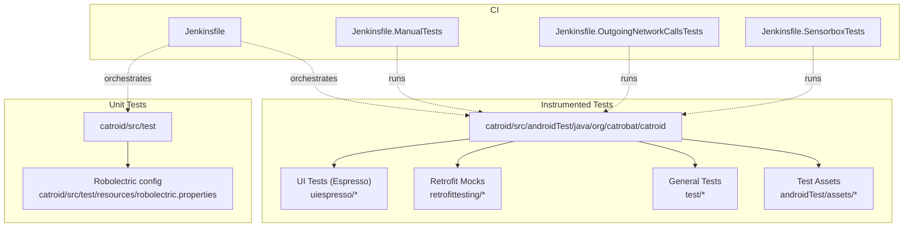
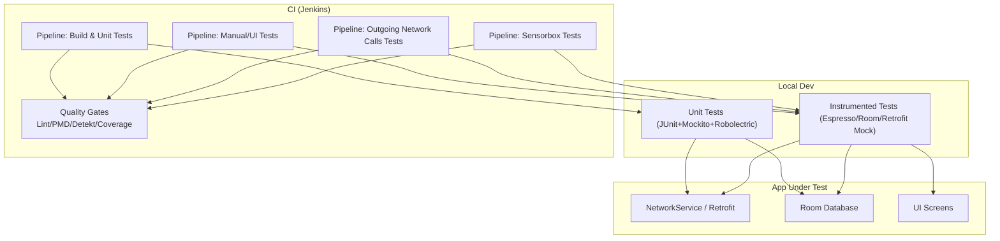
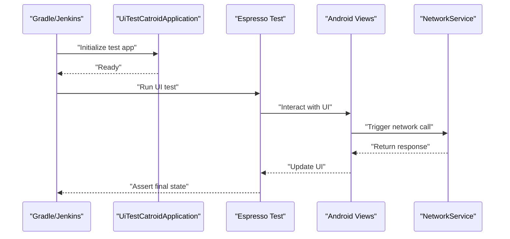
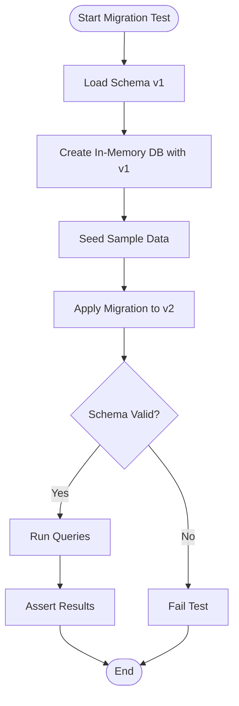
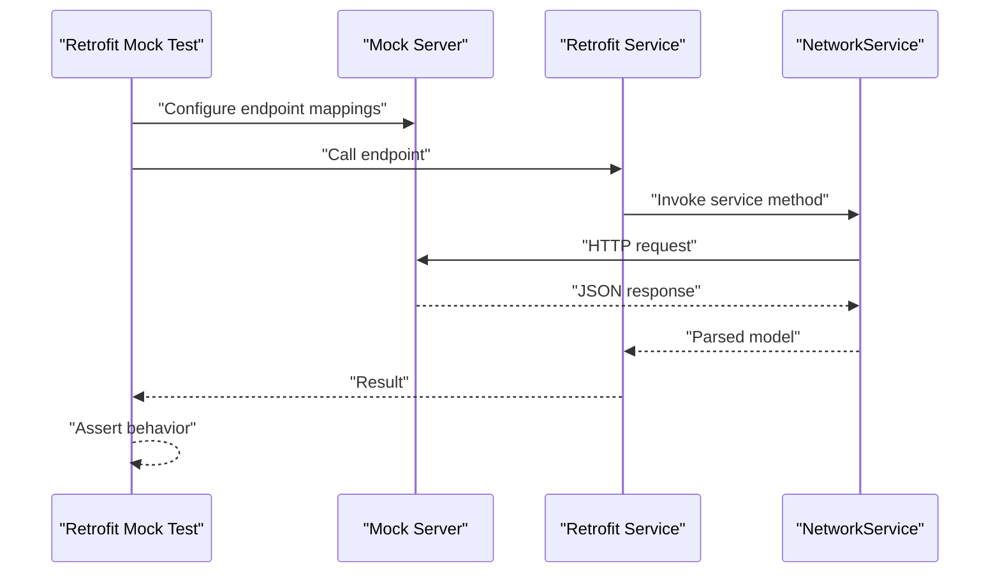
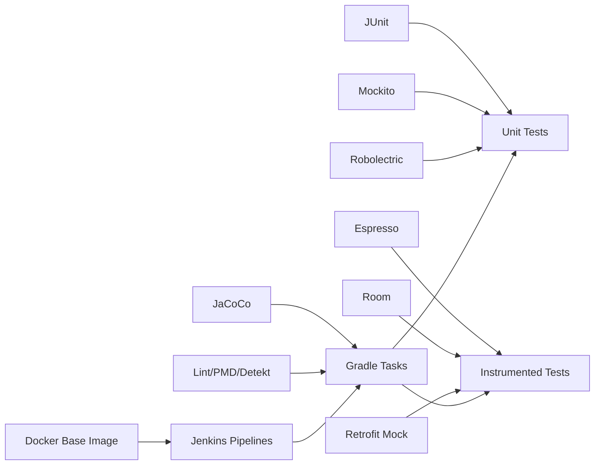
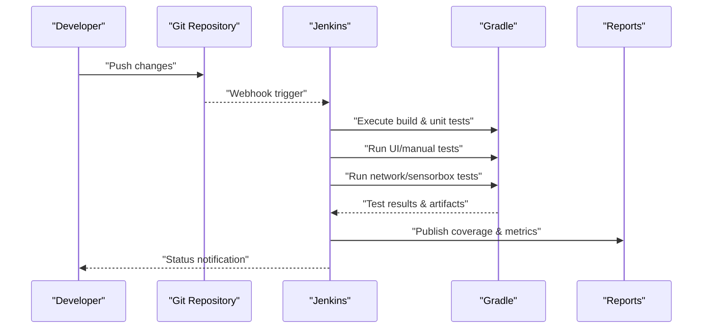

# Testing Strategies

<cite>
**Referenced Files in This Document**
- [Jenkinsfile](file://Jenkinsfile)
- [Jenkinsfile.ManualTests](file://Jenkinsfile.ManualTests)
- [Jenkinsfile.OutgoingNetworkCallsTests](file://Jenkinsfile.OutgoingNetworkCallsTests)
- [Jenkinsfile.SensorboxTests](file://Jenkinsfile.SensorboxTests)
- [Jenkinsfile.baseDocker](file://Jenkinsfile.baseDocker)
- [gradle/code_quality_tasks.gradle](file://catroid/gradle/code_quality_tasks.gradle)
- [gradle/setup_jacoco.gradle](file://catroid/gradle/setup_jacoco.gradle)
- [catroid/src/androidTest/java/org/catrobat/catroid/UiTestCatroidApplication.kt](file://catroid/src/androidTest/java/org/catrobat/catroid/UiTestCatroidApplication.kt)
- [catroid/src/androidTest/java/org/catrobat/catroid/WaitForConditionAction.kt](file://catroid/src/androidTest/java/org/catrobat/catroid/WaitForConditionAction.kt)
- [catroid/src/androidTest/java/org/catrobat/catroid/uiespresso](file://catroid/src/androidTest/java/org/catrobat/catroid/uiespresso)
- [catroid/src/androidTest/java/org/catrobat/catroid/test](file://catroid/src/androidTest/java/org/catrobat/catroid/test)
- [catroid/src/androidTest/java/org/catrobat/catroid/retrofittesting](file://catroid/src/androidTest/java/org/catrobat/catroid/retrofittesting)
- [catroid/src/androidTest/assets](file://catroid/src/androidTest/assets)
- [catroid/src/test/resources/robolectric.properties](file://catroid/src/test/resources/robolectric.properties)
- [catroid/src/main/assets/trustedDomains.json](file://catroid/src/main/assets/trustedDomains.json)
- [core/src/main/java/org/catrobat/catroid/network/NetworkService.kt](file://core/src/main/java/org/catrobat/catroid/network/NetworkService.kt)
- [core/src/main/java/org/catrobat/catroid/network/NetworkServiceHolder.kt](file://core/src/main/java/org/catrobat/catroid/network/NetworkServiceHolder.kt)
- [catroid/schemas/org.catrobat.catroid.db.AppDatabase/1.json](file://catroid/schemas/org.catrobat.catroid.db.AppDatabase/1.json)
- [catroid/schemas/org.catrobat.catroid.db.AppDatabase/2.json](file://catroid/schemas/org.catrobat.catroid.db.AppDatabase/2.json)
</cite>

## Table of Contents
1. Introduction
2. Project Structure
3. Core Components
4. Architecture Overview
5. Detailed Component Analysis
6. Dependency Analysis
7. Performance Considerations
8. Troubleshooting Guide
9. Conclusion
10. Appendices

## Introduction
This document defines the comprehensive testing strategy for NewCatroid, covering unit tests with JUnit and Mockito, Android UI integration tests with Espresso, database testing with Room, network testing with Retrofit mocks, performance and load testing approaches, automated quality gates, and continuous integration using Jenkins. It also includes guidance on test data management, environment setup, and debugging failed tests. The goal is to provide a clear, actionable guide that scales across the multi-module project while ensuring reliability, speed, and maintainability.

## Project Structure
NewCatroid organizes tests alongside source code:
- Unit tests under catroid/src/test (JUnit + Robolectric + Mockito)
- Instrumented tests under catroid/src/androidTest (Espresso, Room, Retrofit mocks)
- Shared test assets under catroid/src/androidTest/assets
- CI pipelines defined as Jenkinsfiles at repository root
- Gradle tasks for code quality and coverage under catroid/gradle

**Diagram sources**
- [catroid/src/test/resources/robolectric.properties](file://catroid/src/test/resources/robolectric.properties)
- [catroid/src/androidTest/java/org/catrobat/catroid/uiespresso](file://catroid/src/androidTest/java/org/catrobat/catroid/uiespresso)
- [catroid/src/androidTest/java/org/catrobat/catroid/retrofittesting](file://catroid/src/androidTest/java/org/catrobat/catroid/retrofittesting)
- [catroid/src/androidTest/java/org/catrobat/catroid/test](file://catroid/src/androidTest/java/org/catrobat/catroid/test)
- [catroid/src/androidTest/assets](file://catroid/src/androidTest/assets)
- [Jenkinsfile](file://Jenkinsfile)
- [Jenkinsfile.ManualTests](file://Jenkinsfile.ManualTests)
- [Jenkinsfile.OutgoingNetworkCallsTests](file://Jenkinsfile.OutgoingNetworkCallsTests)
- [Jenkinsfile.SensorboxTests](file://Jenkinsfile.SensorboxTests)

**Section sources**
- [catroid/src/test/resources/robolectric.properties](file://catroid/src/test/resources/robolectric.properties)
- [catroid/src/androidTest/java/org/catrobat/catroid/uiespresso](file://catroid/src/androidTest/java/org/catrobat/catroid/uiespresso)
- [catroid/src/androidTest/java/org/catrobat/catroid/retrofittesting](file://catroid/src/androidTest/java/org/catrobat/catroid/retrofittesting)
- [catroid/src/androidTest/java/org/catrobat/catroid/test](file://catroid/src/androidTest/java/org/catrobat/catroid/test)
- [catroid/src/androidTest/assets](file://catroid/src/androidTest/assets)
- [Jenkinsfile](file://Jenkinsfile)
- [Jenkinsfile.ManualTests](file://Jenkinsfile.ManualTests)
- [Jenkinsfile.OutgoingNetworkCallsTests](file://Jenkinsfile.OutgoingNetworkCallsTests)
- [Jenkinsfile.SensorboxTests](file://Jenkinsfile.SensorboxTests)

## Core Components
- Unit testing framework
  - JUnit 4/5 for assertions and lifecycle
  - Mockito for mocking dependencies
  - Robolectric for Android context and resources without device/emulator
- Instrumented testing
  - Espresso for UI interactions and assertions
  - Room for database verification and migration tests
  - Retrofit mock server for deterministic network tests
- Test application and helpers
  - Custom Application class for instrumentation tests
  - Synchronization helpers for asynchronous flows
- CI and quality
  - Jenkins pipelines for fast feedback and gated checks
  - Code quality tasks and JaCoCo coverage configuration

**Section sources**
- [catroid/src/androidTest/java/org/catrobat/catroid/UiTestCatroidApplication.kt](file://catroid/src/androidTest/java/org/catrobat/catroid/UiTestCatroidApplication.kt)
- [catroid/src/androidTest/java/org/catrobat/catroid/WaitForConditionAction.kt](file://catroid/src/androidTest/java/org/catrobat/catroid/WaitForConditionAction.kt)
- [catroid/src/androidTest/java/org/catrobat/catroid/retrofittesting](file://catroid/src/androidTest/java/org/catrobat/catroid/retrofittesting)
- [catroid/schemas/org.catrobat.catroid.db.AppDatabase/1.json](file://catroid/schemas/org.catrobat.catroid.db.AppDatabase/1.json)
- [catroid/schemas/org.catrobat.catroid.db.AppDatabase/2.json](file://catroid/schemas/org.catrobat.catroid.db.AppDatabase/2.json)
- [gradle/code_quality_tasks.gradle](file://catroid/gradle/code_quality_tasks.gradle)
- [gradle/setup_jacoco.gradle](file://catroid/gradle/setup_jacoco.gradle)

## Architecture Overview
The testing architecture separates concerns by layer and execution environment:
- Fast unit tests run locally and on CI without devices
- Instrumented tests run on emulators or physical devices via Gradle and Jenkins
- Network layer is isolated behind interfaces and Retrofit; tests use mock servers
- Database layer uses Room schemas for migration validation
- Quality gates enforce style, lint, PMD, Detekt, and coverage thresholds

[No sources needed since this diagram shows conceptual workflow, not actual code structure]

## Detailed Component Analysis

### Unit Testing Framework Setup (JUnit, Mockito, Robolectric)
- Use JUnit annotations for test classes and methods
- Apply Mockito for stubbing and verifying behavior of collaborators
- Configure Robolectric to emulate Android runtime and resources
- Organize tests by feature/domain packages mirroring production code

Key practices:
- Keep tests small and focused on single responsibilities
- Prefer pure functions and dependency injection to maximize testability
- Use @Config for Robolectric settings when necessary

**Section sources**
- [catroid/src/test/resources/robolectric.properties](file://catroid/src/test/resources/robolectric.properties)

### Test Organization Patterns
- Group tests by feature modules and domain areas
- Separate unit vs instrumented tests into src/test and src/androidTest respectively
- Maintain shared utilities and fixtures in dedicated packages
- Use descriptive test names reflecting scenarios and expected outcomes

**Section sources**
- [catroid/src/androidTest/java/org/catrobat/catroid/test](file://catroid/src/androidTest/java/org/catrobat/catroid/test)

### Mocking Strategies for Android Dependencies
- Replace Android-specific services with fakes or mocks
- Use dependency injection to swap implementations in tests
- For system services (e.g., sensors), prefer Robolectric plugins or custom providers
- Avoid heavy Android components in unit tests; isolate logic behind interfaces

**Section sources**
- [catroid/src/androidTest/java/org/catrobat/catroid/UiTestCatroidApplication.kt](file://catroid/src/androidTest/java/org/catrobat/catroid/UiTestCatroidApplication.kt)

### Integration Testing with Espresso
- Use UiTestCatroidApplication to bootstrap the app state for UI tests
- Leverage WaitForConditionAction for synchronization with async operations
- Write page-object-like helpers for complex screens
- Stabilize flaky interactions with explicit waits and idling resources

**Diagram sources**
- [catroid/src/androidTest/java/org/catrobat/catroid/UiTestCatroidApplication.kt](file://catroid/src/androidTest/java/org/catrobat/catroid/UiTestCatroidApplication.kt)
- [catroid/src/androidTest/java/org/catrobat/catroid/WaitForConditionAction.kt](file://catroid/src/androidTest/java/org/catrobat/catroid/WaitForConditionAction.kt)
- [core/src/main/java/org/catrobat/catroid/network/NetworkService.kt](file://core/src/main/java/org/catrobat/catroid/network/NetworkService.kt)

**Section sources**
- [catroid/src/androidTest/java/org/catrobat/catroid/UiTestCatroidApplication.kt](file://catroid/src/androidTest/java/org/catrobat/catroid/UiTestCatroidApplication.kt)
- [catroid/src/androidTest/java/org/catrobat/catroid/WaitForConditionAction.kt](file://catroid/src/androidTest/java/org/catrobat/catroid/WaitForConditionAction.kt)
- [catroid/src/androidTest/java/org/catrobat/catroid/uiespresso](file://catroid/src/androidTest/java/org/catrobat/catroid/uiespresso)

### Database Testing with Room
- Validate schema evolution using migration tests against versioned JSON schemas
- Use in-memory databases for fast, isolated tests
- Assert entity relationships and query correctness

**Diagram sources**
- [catroid/schemas/org.catrobat.catroid.db.AppDatabase/1.json](file://catroid/schemas/org.catrobat.catroid.db.AppDatabase/1.json)
- [catroid/schemas/org.catrobat.catroid.db.AppDatabase/2.json](file://catroid/schemas/org.catrobat.catroid.db.AppDatabase/2.json)

**Section sources**
- [catroid/schemas/org.catrobat.catroid.db.AppDatabase/1.json](file://catroid/schemas/org.catrobat.catroid.db.AppDatabase/1.json)
- [catroid/schemas/org.catrobat.catroid.db.AppDatabase/2.json](file://catroid/schemas/org.catrobat.catroid.db.AppDatabase/2.json)

### Network Testing with Retrofit Mocks
- Use a local mock server to return deterministic responses from androidTest/assets
- Define endpoints and responses aligned with trusted domains
- Validate request/response contracts and error handling paths

**Diagram sources**
- [catroid/src/androidTest/java/org/catrobat/catroid/retrofittesting](file://catroid/src/androidTest/java/org/catrobat/catroid/retrofittesting)
- [catroid/src/androidTest/assets](file://catroid/src/androidTest/assets)
- [catroid/src/main/assets/trustedDomains.json](file://catroid/src/main/assets/trustedDomains.json)
- [core/src/main/java/org/catrobat/catroid/network/NetworkService.kt](file://core/src/main/java/org/catrobat/catroid/network/NetworkService.kt)
- [core/src/main/java/org/catrobat/catroid/network/NetworkServiceHolder.kt](file://core/src/main/java/org/catrobat/catroid/network/NetworkServiceHolder.kt)

**Section sources**
- [catroid/src/androidTest/java/org/catrobat/catroid/retrofittesting](file://catroid/src/androidTest/java/org/catrobat/catroid/retrofittesting)
- [catroid/src/androidTest/assets](file://catroid/src/androidTest/assets)
- [catroid/src/main/assets/trustedDomains.json](file://catroid/src/main/assets/trustedDomains.json)
- [core/src/main/java/org/catrobat/catroid/network/NetworkService.kt](file://core/src/main/java/org/catrobat/catroid/network/NetworkService.kt)
- [core/src/main/java/org/catrobat/catroid/network/NetworkServiceHolder.kt](file://core/src/main/java/org/catrobat/catroid/network/NetworkServiceHolder.kt)

### Examples of Test Cases
- Blocks
  - Validate block parsing, serialization, and parameter constraints
  - Ensure block metadata matches runtime expectations
- Runtime Execution
  - Simulate stage events and verify sprite transformations and audio playback
  - Check concurrency and timing-sensitive behaviors with controlled clocks
- Hardware Integration
  - Mock sensor inputs and camera callbacks for deterministic results
  - Validate permission flows and fallbacks
- AI Features
  - Provide synthetic input tensors and validate inference outputs within tolerance
  - Test model loading and caching strategies

[No sources needed since this section provides general guidance]

### Test Data Management
- Store static payloads (JSON/XML) under androidTest/assets
- Use builders/factories to generate entities and projects programmatically
- Version test datasets alongside schema migrations
- Isolate test data per test class to avoid cross-test interference

**Section sources**
- [catroid/src/androidTest/assets](file://catroid/src/androidTest/assets)

### Environment Setup
- Configure Robolectric properties for unit tests
- Initialize test application for instrumented tests
- Set up mock servers before running network tests
- Prepare Room in-memory databases for DB tests

**Section sources**
- [catroid/src/test/resources/robolectric.properties](file://catroid/src/test/resources/robolectric.properties)
- [catroid/src/androidTest/java/org/catrobat/catroid/UiTestCatroidApplication.kt](file://catroid/src/androidTest/java/org/catrobat/catroid/UiTestCatroidApplication.kt)

### Debugging Failed Tests
- Capture logs and screenshots for UI failures
- Use WaitForConditionAction to stabilize flaky interactions
- Reproduce issues locally with minimal test cases
- Inspect mock server requests/responses for network tests

**Section sources**
- [catroid/src/androidTest/java/org/catrobat/catroid/WaitForConditionAction.kt](file://catroid/src/androidTest/java/org/catrobat/catroid/WaitForConditionAction.kt)

## Dependency Analysis
Testing dependencies are layered:
- Unit tests depend on JUnit, Mockito, Robolectric
- Instrumented tests depend on Espresso, Room, Retrofit mock server
- CI depends on Gradle tasks and Docker base image for consistent environments
- Coverage and quality tools integrate via Gradle scripts

**Diagram sources**
- [gradle/code_quality_tasks.gradle](file://catroid/gradle/code_quality_tasks.gradle)
- [gradle/setup_jacoco.gradle](file://catroid/gradle/setup_jacoco.gradle)
- [Jenkinsfile.baseDocker](file://Jenkinsfile.baseDocker)

**Section sources**
- [gradle/code_quality_tasks.gradle](file://catroid/gradle/code_quality_tasks.gradle)
- [gradle/setup_jacoco.gradle](file://catroid/gradle/setup_jacoco.gradle)
- [Jenkinsfile.baseDocker](file://Jenkinsfile.baseDocker)

## Performance Considerations
- Keep unit tests fast by avoiding heavy Android initialization
- Parallelize independent test suites where possible
- Use in-memory databases and lightweight mocks for DB and network tests
- Profile critical paths with micro-benchmarks outside UI tests
- Limit screenshot captures to failure paths to reduce overhead

[No sources needed since this section provides general guidance]

## Troubleshooting Guide
Common issues and resolutions:
- Flaky UI tests: add explicit waits, stabilize animations, and isolate resources
- Network test timeouts: ensure mock server starts before tests and verify port availability
- Room migration failures: compare expected vs actual schema diffs and update JSON schemas
- Coverage gaps: configure JaCoCo filters and include missing packages
- CI instability: pin tool versions in Docker base image and cache Gradle dependencies

**Section sources**
- [catroid/src/androidTest/java/org/catrobat/catroid/WaitForConditionAction.kt](file://catroid/src/androidTest/java/org/catrobat/catroid/WaitForConditionAction.kt)
- [catroid/schemas/org.catrobat.catroid.db.AppDatabase/1.json](file://catroid/schemas/org.catrobat.catroid.db.AppDatabase/1.json)
- [catroid/schemas/org.catrobat.catroid.db.AppDatabase/2.json](file://catroid/schemas/org.catrobat.catroid.db.AppDatabase/2.json)
- [gradle/setup_jacoco.gradle](file://catroid/gradle/setup_jacoco.gradle)
- [Jenkinsfile.baseDocker](file://Jenkinsfile.baseDocker)

## Conclusion
NewCatroid’s testing strategy balances speed and confidence through layered tests: fast unit tests, robust instrumented tests, and strict CI quality gates. By isolating Android dependencies, standardizing test data, and automating execution and reporting, the team can iterate quickly while maintaining high reliability across blocks, runtime, hardware integrations, and AI features.

[No sources needed since this section summarizes without analyzing specific files]

## Appendices

### Continuous Integration Setup with Jenkins
- Primary pipeline orchestrates builds and tests
- Dedicated pipelines for manual/UI tests, outgoing network calls, and sensorbox tests
- Base Docker image ensures reproducible environments

**Diagram sources**
- [Jenkinsfile](file://Jenkinsfile)
- [Jenkinsfile.ManualTests](file://Jenkinsfile.ManualTests)
- [Jenkinsfile.OutgoingNetworkCallsTests](file://Jenkinsfile.OutgoingNetworkCallsTests)
- [Jenkinsfile.SensorboxTests](file://Jenkinsfile.SensorboxTests)
- [Jenkinsfile.baseDocker](file://Jenkinsfile.baseDocker)

**Section sources**
- [Jenkinsfile](file://Jenkinsfile)
- [Jenkinsfile.ManualTests](file://Jenkinsfile.ManualTests)
- [Jenkinsfile.OutgoingNetworkCallsTests](file://Jenkinsfile.OutgoingNetworkCallsTests)
- [Jenkinsfile.SensorboxTests](file://Jenkinsfile.SensorboxTests)
- [Jenkinsfile.baseDocker](file://Jenkinsfile.baseDocker)

### Automated Test Execution and Quality Gates
- Execute unit and instrumented tests via Gradle tasks
- Enforce code quality with lint, PMD, and Detekt tasks
- Generate and publish JaCoCo coverage reports
- Gate merges on passing tests and quality thresholds

**Section sources**
- [gradle/code_quality_tasks.gradle](file://catroid/gradle/code_quality_tasks.gradle)
- [gradle/setup_jacoco.gradle](file://catroid/gradle/setup_jacoco.gradle)

### Example Test Case References
- UI flows: see uiespresso package for screen-level interactions
- Network contracts: see retrofittesting package for mock-based validations
- General logic: see test package for domain-focused tests

**Section sources**
- [catroid/src/androidTest/java/org/catrobat/catroid/uiespresso](file://catroid/src/androidTest/java/org/catrobat/catroid/uiespresso)
- [catroid/src/androidTest/java/org/catrobat/catroid/retrofittesting](file://catroid/src/androidTest/java/org/catrobat/catroid/retrofittesting)
- [catroid/src/androidTest/java/org/catrobat/catroid/test](file://catroid/src/androidTest/java/org/catrobat/catroid/test)