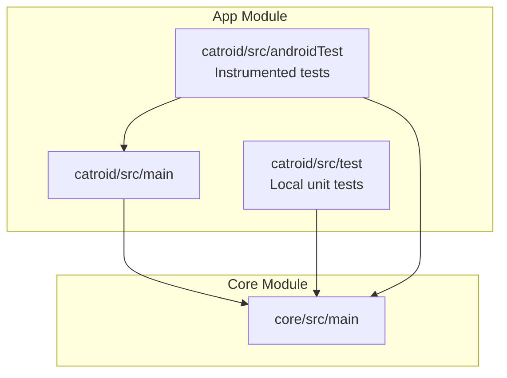
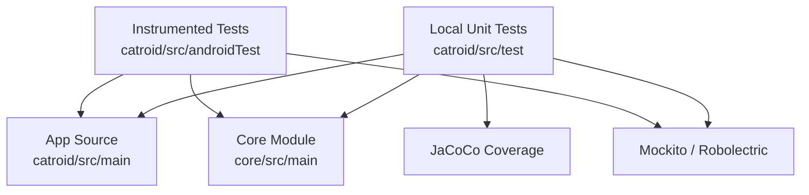
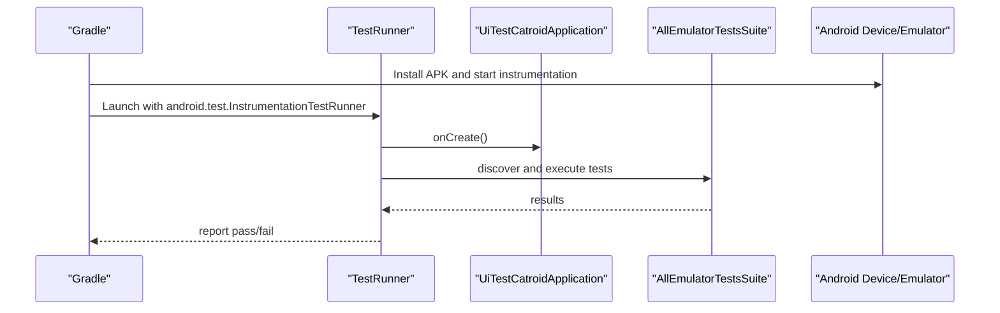
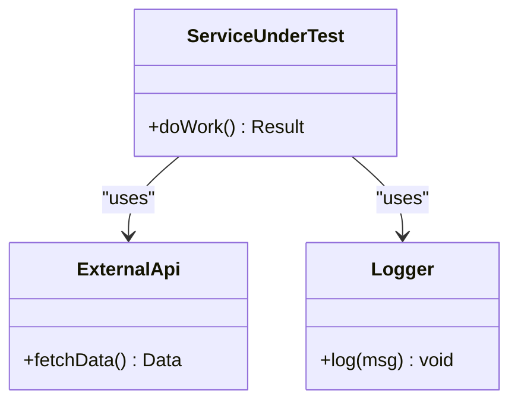
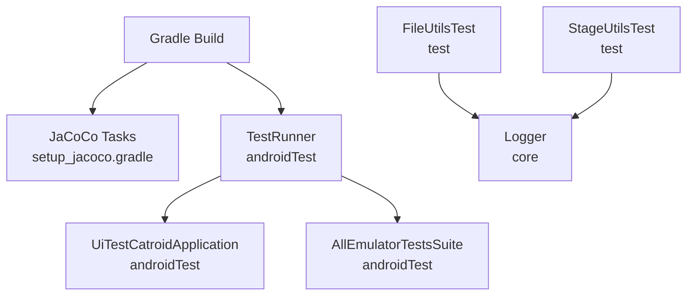

# Unit Testing

<cite>
**Referenced Files in This Document**
- [catroid/build.gradle](file://catroid/build.gradle)
- [gradle/setup_jacoco.gradle](file://gradle/setup_jacoco.gradle)
- [catroid/src/test/resources/robolectric.properties](file://catroid/src/test/resources/robolectric.properties)
- [catroid/src/androidTest/java/org/catrobat/catroid/UiTestCatroidApplication.kt](file://catroid/src/androidTest/java/org/catrobat/catroid/UiTestCatroidApplication.kt)
- [catroid/src/androidTest/java/org/catrobat/catroid/WaitForConditionAction.kt](file://catroid/src/androidTest/java/org/catrobat/catroid/WaitForConditionAction.kt)
- [catroid/src/androidTest/java/org/catrobat/catroid/AllEmulatorTestsSuite.java](file://catroid/src/androidTest/java/org/catrobat/catroid/AllEmulatorTestsSuite.java)
- [catroid/src/androidTest/java/org/catrobat/catroid/uiespresso/ExampleEspressoTest.kt](file://catroid/src/androidTest/java/org/catrobat/catroid/uiespresso/ExampleEspressoTest.kt)
- [catroid/src/androidTest/java/org/catrobat/catroid/retrofittesting/RetrofitNetworkServiceTest.kt](file://catroid/src/androidTest/java/org/catrobat/catroid/retrofittesting/RetrofitNetworkServiceTest.kt)
- [catroid/src/androidTest/java/org/catrobat/catroid/runner/TestRunner.kt](file://catroid/src/androidTest/java/org/catrobat/catroid/runner/TestRunner.kt)
- [catroid/src/androidTest/assets/projects/sample_project.xml](file://catroid/src/androidTest/assets/projects/sample_project.xml)
- [catroid/src/androidTest/assets/backpack.json](file://catroid/src/androidTest/assets/backpack.json)
- [catroid/src/test/java/org/catrobat/catroid/stage/StageUtilsTest.java](file://catroid/src/test/java/org/catrobat/catroid/stage/StageUtilsTest.java)
- [catroid/src/test/java/org/catrobat/catroid/utils/FileUtilsTest.java](file://catroid/src/test/java/org/catrobat/catroid/utils/FileUtilsTest.java)
- [core/src/main/java/org/catrobat/catroid/util/Logger.kt](file://core/src/main/java/org/catrobat/catroid/util/Logger.kt)
</cite>

## Table of Contents
1. [Introduction](#introduction)
2. [Project Structure](#project-structure)
3. [Core Components](#core-components)
4. [Architecture Overview](#architecture-overview)
5. [Detailed Component Analysis](#detailed-component-analysis)
6. [Dependency Analysis](#dependency-analysis)
7. [Performance Considerations](#performance-considerations)
8. [Troubleshooting Guide](#troubleshooting-guide)
9. [Conclusion](#conclusion)
10. [Appendices](#appendices)

## Introduction
This document explains how unit and integration testing are organized and executed in NewCatroid. It covers the JUnit framework setup, test organization patterns using package structure, mocking strategies with Mockito for Android dependencies, testing utilities, test data management, and assertion libraries. It also includes examples of tests for business logic, algorithms, data models, and utility classes; discusses test isolation techniques, dependency injection for testing, performance considerations for fast test execution; and addresses code coverage requirements, test naming conventions, and debugging failed unit tests.

## Project Structure
NewCatroid uses a standard Android multi-module layout with separate source sets for local unit tests and Android instrumented tests:
- Local unit tests (fast, JVM-only): catroid/src/test
- Android instrumented tests (device/emulator): catroid/src/androidTest
- Shared core module under core/ contains Kotlin utilities and services that can be tested locally or via Robolectric when needed.

**Diagram sources**
- [catroid/build.gradle](file://catroid/build.gradle)
- [core/src/main/java/org/catrobat/catroid/util/Logger.kt](file://core/src/main/java/org/catrobat/catroid/util/Logger.kt)

**Section sources**
- [catroid/build.gradle](file://catroid/build.gradle)

## Core Components
- Test frameworks and runners
  - JUnit 4 is used across both local and instrumented tests.
  - Instrumented tests use an AndroidJUnitRunner-based TestRunner to bootstrap the app context and shared test infrastructure.
- Mocking and isolation
  - Mockito is used to mock Android dependencies and external services in local unit tests.
  - Robolectric is configured for limited Android framework simulation where necessary.
- Assertions and utilities
  - Standard JUnit assertions are used throughout.
  - Custom helpers exist for UI tests (e.g., waiting actions).
- Code coverage
  - JaCoCo is integrated via Gradle tasks to generate coverage reports for local unit tests.

Key configuration and setup files:
- JaCoCo setup task: gradle/setup_jacoco.gradle
- Robolectric properties: catroid/src/test/resources/robolectric.properties
- Instrumented test runner: catroid/src/androidTest/java/org/catrobat/catroid/runner/TestRunner.kt
- App application class for instrumentation: catroid/src/androidTest/java/org/catrobat/catroid/UiTestCatroidApplication.kt

**Section sources**
- [gradle/setup_jacoco.gradle](file://gradle/setup_jacoco.gradle)
- [catroid/src/test/resources/robolectric.properties](file://catroid/src/test/resources/robolectric.properties)
- [catroid/src/androidTest/java/org/catrobat/catroid/runner/TestRunner.kt](file://catroid/src/androidTest/java/org/catrobat/catroid/runner/TestRunner.kt)
- [catroid/src/androidTest/java/org/catrobat/catroid/UiTestCatroidApplication.kt](file://catroid/src/androidTest/java/org/catrobat/catroid/UiTestCatroidApplication.kt)

## Architecture Overview
The testing architecture separates concerns by layer and environment:
- Local unit tests run on the JVM without Android runtime overhead. They focus on pure logic, algorithms, and utilities.
- Instrumented tests run on device/emulator and validate interactions with Android components, network layers, and UI flows.
- Core utilities and services are isolated in the core module to maximize testability and reuse.

[No sources needed since this diagram shows conceptual workflow, not actual code structure]

## Detailed Component Analysis

### JUnit Framework Setup and Organization
- JUnit 4 is the primary framework for both local and instrumented tests.
- Package structure mirrors production packages to keep tests close to their subjects:
  - Business logic and stage-related tests under catroid/src/test/java/org/catrobat/catroid/stage
  - Utility tests under catroid/src/test/java/org/catrobat/catroid/utils
- Naming convention: <SubjectUnderTest>Test.java (or .kt), e.g., StageUtilsTest.java, FileUtilsTest.java.

Examples:
- Stage utilities test: catroid/src/test/java/org/catrobat/catroid/stage/StageUtilsTest.java
- File utilities test: catroid/src/test/java/org/catrobat/catroid/utils/FileUtilsTest.java

**Section sources**
- [catroid/src/test/java/org/catrobat/catroid/stage/StageUtilsTest.java](file://catroid/src/test/java/org/catrobat/catroid/stage/StageUtilsTest.java)
- [catroid/src/test/java/org/catrobat/catroid/utils/FileUtilsTest.java](file://catroid/src/test/java/org/catrobat/catroid/utils/FileUtilsTest.java)

### Android Instrumentation and Test Runner
- Instrumented tests use a custom TestRunner extending AndroidJUnitRunner to initialize the test application and any required dependencies before running suites.
- UiTestCatroidApplication provides an Application instance for instrumentation tests.
- WaitForConditionAction offers reusable UI synchronization helpers for Espresso-style interactions.
- AllEmulatorTestsSuite aggregates emulator-based tests into a single suite for CI runs.

**Diagram sources**
- [catroid/src/androidTest/java/org/catrobat/catroid/runner/TestRunner.kt](file://catroid/src/androidTest/java/org/catrobat/catroid/runner/TestRunner.kt)
- [catroid/src/androidTest/java/org/catrobat/catroid/UiTestCatroidApplication.kt](file://catroid/src/androidTest/java/org/catrobat/catroid/UiTestCatroidApplication.kt)
- [catroid/src/androidTest/java/org/catrobat/catroid/AllEmulatorTestsSuite.java](file://catroid/src/androidTest/java/org/catrobat/catroid/AllEmulatorTestsSuite.java)

**Section sources**
- [catroid/src/androidTest/java/org/catrobat/catroid/runner/TestRunner.kt](file://catroid/src/androidTest/java/org/catrobat/catroid/runner/TestRunner.kt)
- [catroid/src/androidTest/java/org/catrobat/catroid/UiTestCatroidApplication.kt](file://catroid/src/androidTest/java/org/catrobat/catroid/UiTestCatroidApplication.kt)
- [catroid/src/androidTest/java/org/catrobat/catroid/WaitForConditionAction.kt](file://catroid/src/androidTest/java/org/catrobat/catroid/WaitForConditionAction.kt)
- [catroid/src/androidTest/java/org/catrobat/catroid/AllEmulatorTestsSuite.java](file://catroid/src/androidTest/java/org/catrobat/catroid/AllEmulatorTestsSuite.java)

### Mocking Strategies with Mockito
- Use Mockito to isolate units from Android-specific APIs and external services.
- Typical patterns:
  - @RunWith(MockitoJUnitRunner.class) or MockitoExtension for JUnit 5 (if adopted).
  - @Mock for dependencies, @InjectMocks for the class under test.
  - verify() to assert interactions, when(...).thenReturn(...) for stubbing.
- Example targets:
  - Network service calls (Retrofit) in instrumented tests.
  - Logging and utility services in local tests.

**Diagram sources**
- [core/src/main/java/org/catrobat/catroid/util/Logger.kt](file://core/src/main/java/org/catrobat/catroid/util/Logger.kt)

**Section sources**
- [core/src/main/java/org/catrobat/catroid/util/Logger.kt](file://core/src/main/java/org/catrobat/catroid/util/Logger.kt)

### Robolectric Configuration
- Robolectric is available for limited Android framework simulation in local tests.
- Configuration file: catroid/src/test/resources/robolectric.properties
- Use cases:
  - Access to resources and Android-like contexts without full instrumentation.
  - Avoid heavy UI or hardware-dependent tests in local scope.

**Section sources**
- [catroid/src/test/resources/robolectric.properties](file://catroid/src/test/resources/robolectric.properties)

### Test Data Management
- Static assets for tests are stored under catroid/src/androidTest/assets.
- Examples:
  - Sample project XML: catroid/src/androidTest/assets/projects/sample_project.xml
  - Backpack JSON fixture: catroid/src/androidTest/assets/backpack.json
- Best practices:
  - Keep fixtures small and representative.
  - Version control fixtures alongside tests.
  - Provide invalid fixtures to exercise error paths.

**Section sources**
- [catroid/src/androidTest/assets/projects/sample_project.xml](file://catroid/src/androidTest/assets/projects/sample_project.xml)
- [catroid/src/androidTest/assets/backpack.json](file://catroid/src/androidTest/assets/backpack.json)

### Assertion Libraries and Utilities
- Primary assertions come from JUnit.
- For UI tests, waitForCondition helpers simplify timing-sensitive operations.
- For network tests, Retrofit-based tests validate request/response contracts.

Examples:
- Espresso example: catroid/src/androidTest/java/org/catrobat/catroid/uiespresso/ExampleEspressoTest.kt
- Retrofit network test: catroid/src/androidTest/java/org/catrobat/catroid/retrofittesting/RetrofitNetworkServiceTest.kt

**Section sources**
- [catroid/src/androidTest/java/org/catrobat/catroid/uiespresso/ExampleEspressoTest.kt](file://catroid/src/androidTest/java/org/catrobat/catroid/uiespresso/ExampleEspressoTest.kt)
- [catroid/src/androidTest/java/org/catrobat/catroid/retrofittesting/RetrofitNetworkServiceTest.kt](file://catroid/src/androidTest/java/org/catrobat/catroid/retrofittesting/RetrofitNetworkServiceTest.kt)
- [catroid/src/androidTest/java/org/catrobat/catroid/WaitForConditionAction.kt](file://catroid/src/androidTest/java/org/catrobat/catroid/WaitForConditionAction.kt)

### Examples of Unit Tests Across Layers
- Business logic and algorithms
  - Focus on deterministic inputs/outputs and edge cases.
  - Example path: catroid/src/test/java/org/catrobat/catroid/stage/StageUtilsTest.java
- Data models
  - Validate serialization/deserialization, constraints, and invariants.
  - Example path: catroid/src/test/java/org/catrobat/catroid/utils/FileUtilsTest.java
- Utility classes
  - Pure functions and IO helpers should be thoroughly covered.
  - Example path: catroid/src/test/java/org/catrobat/catroid/utils/FileUtilsTest.java

**Section sources**
- [catroid/src/test/java/org/catrobat/catroid/stage/StageUtilsTest.java](file://catroid/src/test/java/org/catrobat/catroid/stage/StageUtilsTest.java)
- [catroid/src/test/java/org/catrobat/catroid/utils/FileUtilsTest.java](file://catroid/src/test/java/org/catrobat/catroid/utils/FileUtilsTest.java)

### Test Isolation Techniques
- Dependency Injection
  - Prefer constructor injection for testable components.
  - Inject mocks or fakes during tests to avoid real I/O or network calls.
- Environment separation
  - Use local unit tests for pure logic; reserve instrumentation for Android-specific behavior.
- Deterministic tests
  - Avoid time-dependent logic; inject Clock or use controlled timers.
  - Seed random number generators for reproducibility.

[No sources needed since this section provides general guidance]

### Performance Considerations for Fast Test Execution
- Keep local unit tests lightweight and free of Android runtime initialization.
- Parallelize independent tests where possible.
- Minimize disk I/O; prefer in-memory structures and small fixtures.
- Use Robolectric sparingly; it adds startup overhead compared to pure JVM tests.
- Leverage Gradle caching and incremental builds.

[No sources needed since this section provides general guidance]

### Code Coverage Requirements
- JaCoCo is integrated via Gradle tasks defined in gradle/setup_jacoco.gradle.
- Typical tasks:
  - Generate HTML reports for local unit tests.
  - Enforce minimum coverage thresholds at build time.
- Recommendations:
  - Set meaningful thresholds per module.
  - Exclude generated code and boilerplate.
  - Track branch coverage for critical logic.

**Section sources**
- [gradle/setup_jacoco.gradle](file://gradle/setup_jacoco.gradle)

### Test Naming Conventions
- Class names: <SubjectUnderTest>Test.java/.kt
- Method names: describe_behavior_under_condition(...)
- Group related tests using nested classes or @Nested (when adopting JUnit 5).
- Keep method names descriptive to aid debugging.

[No sources needed since this section provides general guidance]

### Debugging Failed Unit Tests
- Run individual tests from your IDE to reproduce failures quickly.
- Add targeted logging around failure points; ensure logs do not affect determinism.
- For instrumented tests:
  - Use adb logcat to capture device logs.
  - Inspect screenshots/video recordings if enabled in CI.
- For network tests:
  - Verify endpoint responses and payloads.
  - Use offline modes or stubs to isolate flakiness.

[No sources needed since this section provides general guidance]

## Dependency Analysis
The following diagram highlights key test-related dependencies and their relationships:

**Diagram sources**
- [gradle/setup_jacoco.gradle](file://gradle/setup_jacoco.gradle)
- [catroid/src/androidTest/java/org/catrobat/catroid/runner/TestRunner.kt](file://catroid/src/androidTest/java/org/catrobat/catroid/runner/TestRunner.kt)
- [catroid/src/androidTest/java/org/catrobat/catroid/UiTestCatroidApplication.kt](file://catroid/src/androidTest/java/org/catrobat/catroid/UiTestCatroidApplication.kt)
- [catroid/src/androidTest/java/org/catrobat/catroid/AllEmulatorTestsSuite.java](file://catroid/src/androidTest/java/org/catrobat/catroid/AllEmulatorTestsSuite.java)
- [catroid/src/test/java/org/catrobat/catroid/utils/FileUtilsTest.java](file://catroid/src/test/java/org/catrobat/catroid/utils/FileUtilsTest.java)
- [catroid/src/test/java/org/catrobat/catroid/stage/StageUtilsTest.java](file://catroid/src/test/java/org/catrobat/catroid/stage/StageUtilsTest.java)
- [core/src/main/java/org/catrobat/catroid/util/Logger.kt](file://core/src/main/java/org/catrobat/catroid/util/Logger.kt)

**Section sources**
- [gradle/setup_jacoco.gradle](file://gradle/setup_jacoco.gradle)
- [catroid/src/androidTest/java/org/catrobat/catroid/runner/TestRunner.kt](file://catroid/src/androidTest/java/org/catrobat/catroid/runner/TestRunner.kt)
- [catroid/src/androidTest/java/org/catrobat/catroid/UiTestCatroidApplication.kt](file://catroid/src/androidTest/java/org/catrobat/catroid/UiTestCatroidApplication.kt)
- [catroid/src/androidTest/java/org/catrobat/catroid/AllEmulatorTestsSuite.java](file://catroid/src/androidTest/java/org/catrobat/catroid/AllEmulatorTestsSuite.java)
- [catroid/src/test/java/org/catrobat/catroid/utils/FileUtilsTest.java](file://catroid/src/test/java/org/catrobat/catroid/utils/FileUtilsTest.java)
- [catroid/src/test/java/org/catrobat/catroid/stage/StageUtilsTest.java](file://catroid/src/test/java/org/catrobat/catroid/stage/StageUtilsTest.java)
- [core/src/main/java/org/catrobat/catroid/util/Logger.kt](file://core/src/main/java/org/catrobat/catroid/util/Logger.kt)

## Performance Considerations
- Prefer local unit tests for speed and reliability.
- Use Robolectric only when Android framework features are essential.
- Keep fixtures minimal and load them lazily.
- Avoid heavy initialization in @Before/@BeforeClass; move to dedicated setup methods or factories.
- Parallelize independent tests and leverage Gradle’s parallel execution.

[No sources needed since this section provides general guidance]

## Troubleshooting Guide
Common issues and resolutions:
- Flaky UI tests
  - Replace sleeps with explicit waits using WaitForConditionAction.
  - Stabilize asynchronous operations with timeouts and retries.
- Network test instability
  - Stub Retrofit responses or use a local server.
  - Validate endpoints and payloads explicitly.
- Coverage gaps
  - Review JaCoCo reports and add missing branches.
  - Exclude non-testable boilerplate.

**Section sources**
- [catroid/src/androidTest/java/org/catrobat/catroid/WaitForConditionAction.kt](file://catroid/src/androidTest/java/org/catrobat/catroid/WaitForConditionAction.kt)
- [catroid/src/androidTest/java/org/catrobat/catroid/retrofittesting/RetrofitNetworkServiceTest.kt](file://catroid/src/androidTest/java/org/catrobat/catroid/retrofittesting/RetrofitNetworkServiceTest.kt)
- [gradle/setup_jacoco.gradle](file://gradle/setup_jacoco.gradle)

## Conclusion
NewCatroid’s testing strategy balances speed and fidelity by separating local unit tests from instrumented tests, leveraging Mockito and Robolectric judiciously, and integrating JaCoCo for coverage. Following the outlined organization, isolation, and performance practices will help maintain a robust, fast, and reliable test suite.

## Appendices

### Quick Start Commands
- Run local unit tests: ./gradlew test
- Run instrumented tests: ./gradlew connectedAndroidTest
- Generate coverage report: ./gradlew jacocoTestReport

[No sources needed since this section provides general guidance]