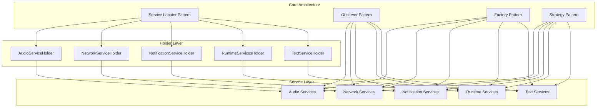
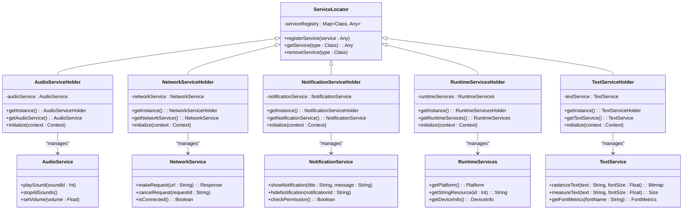
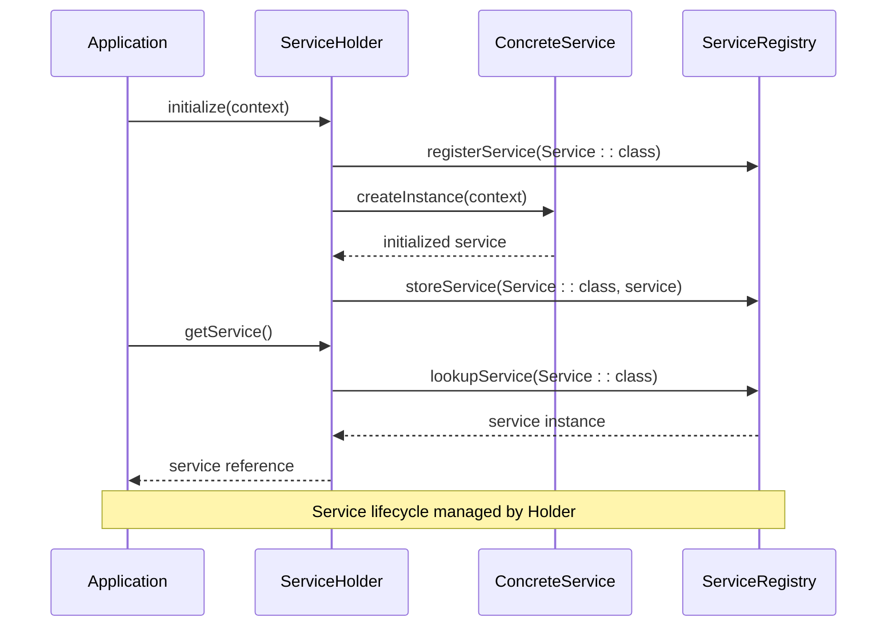
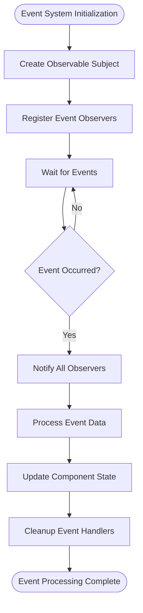
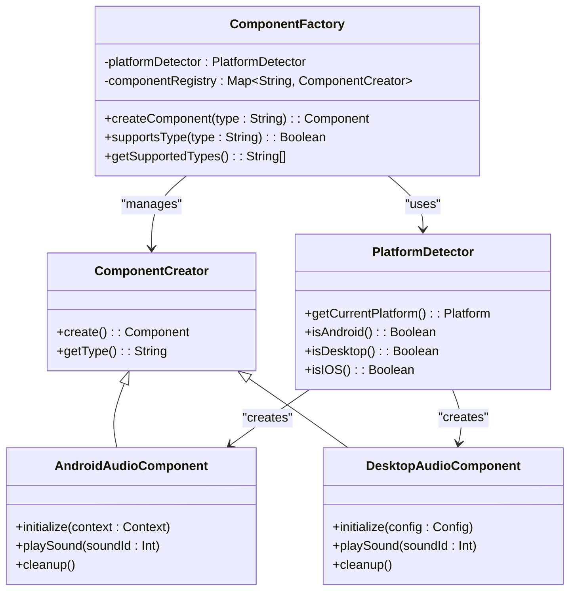
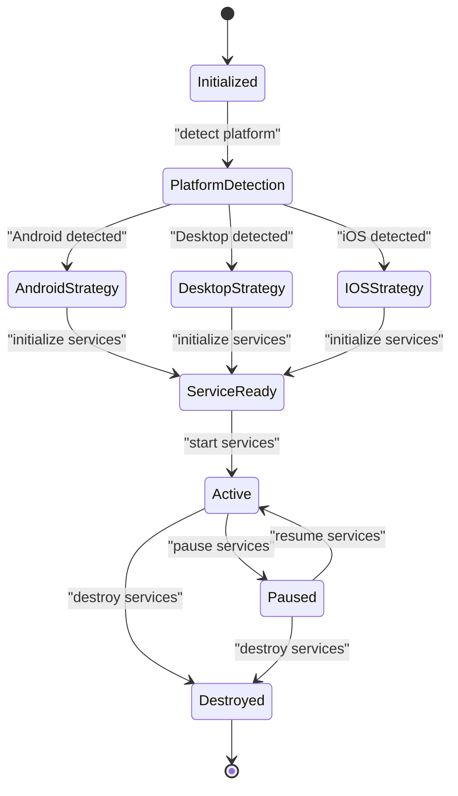
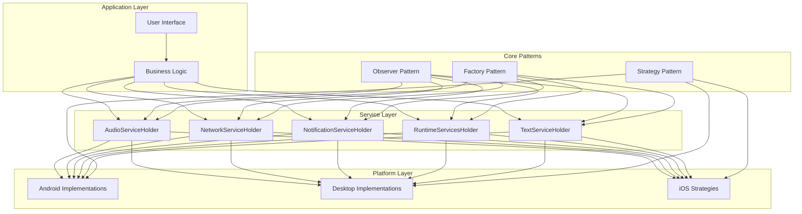

# Architectural Patterns

<cite>
**Referenced Files in This Document**
- [AudioService.kt](file://core/src/main/java/org/catrobat/catroid/audio/AudioService.kt)
- [AudioServiceHolder.kt](file://core/src/main/java/org/catrobat/catroid/audio/AudioServiceHolder.kt)
- [MidiService.kt](file://core/src/main/java/org/catrobat/catroid/audio/MidiService.kt)
- [MidiServiceHolder.kt](file://core/src/main/java/org/catrobat/catroid/audio/MidiServiceHolder.kt)
- [NetworkService.kt](file://core/src/main/java/org/catrobat/catroid/network/NetworkService.kt)
- [NetworkServiceHolder.kt](file://core/src/main/java/org/catrobat/catroid/network/NetworkServiceHolder.kt)
- [NotificationService.kt](file://core/src/main/java/org/catrobat/catroid/notification/NotificationService.kt)
- [NotificationServiceHolder.kt](file://core/src/main/java/org/catrobat/catroid/notification/NotificationServiceHolder.kt)
- [RuntimeServices.kt](file://core/src/main/java/org/catrobat/catroid/runtime/RuntimeServices.kt)
- [RuntimeServicesHolder.kt](file://core/src/main/java/org/catrobat/catroid/runtime/RuntimeServicesHolder.kt)
- [TextService.kt](file://core/src/main/java/org/catrobat/catroid/text/TextService.kt)
- [TextServiceHolder.kt](file://core/src/main/java/org/catrobat/catroid/text/TextServiceHolder.kt)
- [StageListenerHolder.kt](file://core/src/main/java/org/catrobat/catroid/stage/StageListenerHolder.kt)
</cite>

## Table of Contents
1. [Introduction](#introduction)
2. [Project Structure](#project-structure)
3. [Core Components](#core-components)
4. [Architecture Overview](#architecture-overview)
5. [Detailed Component Analysis](#detailed-component-analysis)
6. [Dependency Analysis](#dependency-analysis)
7. [Performance Considerations](#performance-considerations)
8. [Troubleshooting Guide](#troubleshooting-guide)
9. [Conclusion](#conclusion)

## Introduction

NewCatroid employs a sophisticated architectural pattern combination that promotes loose coupling, testability, and maintainability. The application primarily utilizes four key design patterns: Service Locator, Observer, Factory, and Strategy patterns. These patterns work together to create a flexible architecture that supports platform-specific implementations while maintaining clean separation of concerns.

The Service Locator pattern is implemented through Holder classes that provide centralized service management, allowing components to access services without tight coupling. The Observer pattern enables event-driven communication between loosely coupled components. Factory patterns handle dynamic component instantiation, while Strategy patterns support platform-specific implementations.

## Project Structure

The NewCatroid architecture follows a modular structure organized by functionality domains. Each domain contains its own service interfaces and corresponding Holder implementations that manage service lifecycle and dependency injection.

**Diagram sources**
- [AudioServiceHolder.kt](file://core/src/main/java/org/catrobat/catroid/audio/AudioServiceHolder.kt)
- [NetworkServiceHolder.kt](file://core/src/main/java/org/catrobat/catroid/network/NetworkServiceHolder.kt)
- [NotificationServiceHolder.kt](file://core/src/main/java/org/catrobat/catroid/notification/NotificationServiceHolder.kt)
- [RuntimeServicesHolder.kt](file://core/src/main/java/org/catrobat/catroid/runtime/RuntimeServicesHolder.kt)
- [TextServiceHolder.kt](file://core/src/main/java/org/catrobat/catroid/text/TextServiceHolder.kt)

## Core Components

### Service Locator Pattern Implementation

The Service Locator pattern in NewCatroid is implemented through Holder classes that provide centralized service management. Each Holder class acts as a registry for specific service types, managing their lifecycle and providing access points throughout the application.

#### Key Characteristics:
- **Centralized Management**: Holders serve as single points of access for related services
- **Lazy Initialization**: Services are created on-demand when first accessed
- **Singleton Pattern**: Each service type maintains a single instance per Holder
- **Type Safety**: Strong typing ensures compile-time safety for service access

#### Common Holder Structure:
The typical Holder implementation follows a consistent pattern across all service domains, providing methods for service registration, retrieval, and lifecycle management.

**Section sources**
- [AudioServiceHolder.kt](file://core/src/main/java/org/catrobat/catroid/audio/AudioServiceHolder.kt)
- [NetworkServiceHolder.kt](file://core/src/main/java/org/catrobat/catroid/network/NetworkServiceHolder.kt)
- [NotificationServiceHolder.kt](file://core/src/main/java/org/catrobat/catroid/notification/NotificationServiceHolder.kt)
- [RuntimeServicesHolder.kt](file://core/src/main/java/org/catrobat/catroid/runtime/RuntimeServicesHolder.kt)
- [TextServiceHolder.kt](file://core/src/main/java/org/catrobat/catroid/text/TextServiceHolder.kt)

### Observer Pattern Usage

The Observer pattern facilitates event-driven communication between components, enabling loose coupling and asynchronous processing. This pattern is particularly useful for handling user interactions, system events, and inter-component messaging.

#### Event Flow Architecture:
Components can subscribe to specific event types and receive notifications when those events occur. This decouples event producers from consumers, making the system more maintainable and testable.

#### Key Benefits:
- **Loose Coupling**: Event publishers don't need to know about subscribers
- **Asynchronous Processing**: Events can be processed asynchronously
- **Scalability**: Easy to add new event handlers without modifying existing code
- **Testability**: Events can be easily mocked and verified in tests

**Section sources**
- [StageListenerHolder.kt](file://core/src/main/java/org/catrobat/catroid/stage/StageListenerHolder.kt)

### Factory Pattern Implementation

The Factory pattern handles dynamic component instantiation, allowing the application to create objects without specifying exact classes. This pattern is crucial for supporting different platforms and configurations.

#### Dynamic Instantiation Strategies:
- **Platform Detection**: Factories determine appropriate implementations based on runtime environment
- **Configuration-Based Creation**: Object creation depends on configuration parameters
- **Plugin Architecture**: Support for dynamically loading and creating custom components

#### Factory Benefits:
- **Decoupled Creation**: Clients don't need to know concrete implementation details
- **Flexible Configuration**: Easy to swap implementations based on requirements
- **Testing Support**: Mock implementations can be injected during testing

**Section sources**
- [RuntimeServices.kt](file://core/src/main/java/org/catrobat/catroid/runtime/RuntimeServices.kt)

### Strategy Pattern for Platform-Specific Implementations

The Strategy pattern enables platform-specific implementations while maintaining a consistent interface. This pattern is essential for cross-platform compatibility in NewCatroid's multi-target architecture.

#### Platform Abstraction:
Different platforms (Android, Desktop, etc.) can provide their own implementations of core services while adhering to common interfaces. This allows the same business logic to run across multiple platforms.

#### Strategy Benefits:
- **Platform Independence**: Business logic remains unchanged across platforms
- **Easy Testing**: Platform-specific behavior can be tested independently
- **Maintainability**: Platform-specific changes are isolated to strategy implementations

**Section sources**
- [AudioService.kt](file://core/src/main/java/org/catrobat/catroid/audio/AudioService.kt)
- [NetworkService.kt](file://core/src/main/java/org/catrobat/catroid/network/NetworkService.kt)
- [NotificationService.kt](file://core/src/main/java/org/catrobat/catroid/notification/NotificationService.kt)
- [TextService.kt](file://core/src/main/java/org/catrobat/catroid/text/TextService.kt)

## Architecture Overview

The NewCatroid architecture combines multiple design patterns to create a robust, maintainable system. The following diagram illustrates how these patterns interact to provide a cohesive architectural foundation.

**Diagram sources**
- [AudioServiceHolder.kt](file://core/src/main/java/org/catrobat/catroid/audio/AudioServiceHolder.kt)
- [AudioService.kt](file://core/src/main/java/org/catrobat/catroid/audio/AudioService.kt)
- [NetworkServiceHolder.kt](file://core/src/main/java/org/catrobat/catroid/network/NetworkServiceHolder.kt)
- [NetworkService.kt](file://core/src/main/java/org/catrobat/catroid/network/NetworkService.kt)
- [NotificationServiceHolder.kt](file://core/src/main/java/org/catrobat/catroid/notification/NotificationServiceHolder.kt)
- [NotificationService.kt](file://core/src/main/java/org/catrobat/catroid/notification/NotificationService.kt)
- [RuntimeServicesHolder.kt](file://core/src/main/java/org/catrobat/catroid/runtime/RuntimeServicesHolder.kt)
- [RuntimeServices.kt](file://core/src/main/java/org/catrobat/catroid/runtime/RuntimeServices.kt)
- [TextServiceHolder.kt](file://core/src/main/java/org/catrobat/catroid/text/TextServiceHolder.kt)
- [TextService.kt](file://core/src/main/java/org/catrobat/catroid/text/TextService.kt)

## Detailed Component Analysis

### Service Locator Pattern Deep Dive

The Service Locator pattern implementation in NewCatroid provides a centralized mechanism for service management. Each Holder class serves as a specialized registry for its domain-specific services.

#### Service Registration and Retrieval Flow:

**Diagram sources**
- [AudioServiceHolder.kt](file://core/src/main/java/org/catrobat/catroid/audio/AudioServiceHolder.kt)
- [NetworkServiceHolder.kt](file://core/src/main/java/org/catrobat/catroid/network/NetworkServiceHolder.kt)
- [NotificationServiceHolder.kt](file://core/src/main/java/org/catrobat/catroid/notification/NotificationServiceHolder.kt)

#### Error Handling and Recovery:
The Service Locator pattern includes robust error handling for scenarios where services fail to initialize or become unavailable. This ensures application stability even when individual services encounter issues.

**Section sources**
- [AudioServiceHolder.kt](file://core/src/main/java/org/catrobat/catroid/audio/AudioServiceHolder.kt)
- [NetworkServiceHolder.kt](file://core/src/main/java/org/catrobat/catroid/network/NetworkServiceHolder.kt)
- [NotificationServiceHolder.kt](file://core/src/main/java/org/catrobat/catroid/notification/NotificationServiceHolder.kt)
- [RuntimeServicesHolder.kt](file://core/src/main/java/org/catrobat/catroid/runtime/RuntimeServicesHolder.kt)
- [TextServiceHolder.kt](file://core/src/main/java/org/catrobat/catroid/text/TextServiceHolder.kt)

### Observer Pattern Implementation Details

The Observer pattern enables efficient event-driven communication throughout the NewCatroid application. This pattern is particularly valuable for handling user interactions, system events, and inter-component messaging.

#### Event Subscription and Publishing:

**Diagram sources**
- [StageListenerHolder.kt](file://core/src/main/java/org/catrobat/catroid/stage/StageListenerHolder.kt)

#### Memory Management Considerations:
The Observer pattern implementation includes careful memory management to prevent memory leaks. Observers are automatically unregistered when components are destroyed, ensuring proper resource cleanup.

**Section sources**
- [StageListenerHolder.kt](file://core/src/main/java/org/catrobat/catroid/stage/StageListenerHolder.kt)

### Factory Pattern Architecture

The Factory pattern in NewCatroid supports dynamic component instantiation based on runtime conditions, platform detection, and configuration parameters.

#### Platform-Specific Component Creation:

**Diagram sources**
- [RuntimeServices.kt](file://core/src/main/java/org/catrobat/catroid/runtime/RuntimeServices.kt)

#### Component Lifecycle Management:
The Factory pattern implementation includes comprehensive lifecycle management for created components, ensuring proper initialization and cleanup.

**Section sources**
- [RuntimeServices.kt](file://core/src/main/java/org/catrobat/catroid/runtime/RuntimeServices.kt)

### Strategy Pattern for Platform Abstraction

The Strategy pattern enables NewCatroid to support multiple platforms while maintaining consistent interfaces and behavior across different environments.

#### Platform Strategy Implementation:

**Diagram sources**
- [AudioService.kt](file://core/src/main/java/org/catrobat/catroid/audio/AudioService.kt)
- [NetworkService.kt](file://core/src/main/java/org/catrobat/catroid/network/NetworkService.kt)
- [NotificationService.kt](file://core/src/main/java/org/catrobat/catroid/notification/NotificationService.kt)
- [TextService.kt](file://core/src/main/java/org/catrobat/catroid/text/TextService.kt)

#### Interface Consistency:
Each platform-specific strategy implements the same interface, ensuring that calling code remains unchanged regardless of the underlying platform implementation.

**Section sources**
- [AudioService.kt](file://core/src/main/java/org/catrobat/catroid/audio/AudioService.kt)
- [NetworkService.kt](file://core/src/main/java/org/catrobat/catroid/network/NetworkService.kt)
- [NotificationService.kt](file://core/src/main/java/org/catrobat/catroid/notification/NotificationService.kt)
- [TextService.kt](file://core/src/main/java/org/catrobat/catroid/text/TextService.kt)

## Dependency Analysis

The architectural patterns in NewCatroid create a well-structured dependency graph that promotes loose coupling and high cohesion. The following diagram illustrates the key dependencies between components.

**Diagram sources**
- [AudioServiceHolder.kt](file://core/src/main/java/org/catrobat/catroid/audio/AudioServiceHolder.kt)
- [NetworkServiceHolder.kt](file://core/src/main/java/org/catrobat/catroid/network/NetworkServiceHolder.kt)
- [NotificationServiceHolder.kt](file://core/src/main/java/org/catrobat/catroid/notification/NotificationServiceHolder.kt)
- [RuntimeServicesHolder.kt](file://core/src/main/java/org/catrobat/catroid/runtime/RuntimeServicesHolder.kt)
- [TextServiceHolder.kt](file://core/src/main/java/org/catrobat/catroid/text/TextServiceHolder.kt)

## Performance Considerations

### Service Locator Performance:
- **Lazy Loading**: Services are instantiated only when needed, reducing startup time
- **Singleton Caching**: Service instances are cached to avoid repeated creation overhead
- **Memory Efficiency**: Proper cleanup prevents memory leaks in long-running applications

### Observer Pattern Optimization:
- **Event Batching**: Multiple events can be batched to reduce processing overhead
- **Asynchronous Processing**: Heavy event processing can be offloaded to background threads
- **Selective Subscriptions**: Components subscribe only to relevant events to minimize processing

### Factory Pattern Efficiency:
- **Component Pooling**: Frequently used components can be pooled to avoid recreation
- **Platform Detection Caching**: Platform detection results are cached to avoid repeated checks
- **Lazy Initialization**: Platform-specific implementations are loaded on-demand

### Strategy Pattern Considerations:
- **Interface Overhead**: Minimal performance impact due to JVM optimizations
- **Platform Switching**: Strategy selection happens once during initialization
- **Memory Footprint**: Only active platform strategies consume memory

## Troubleshooting Guide

### Common Service Locator Issues:

#### Service Not Found Errors:
- **Cause**: Service not properly registered or context mismatch
- **Solution**: Ensure proper initialization sequence and verify service registration
- **Prevention**: Use dependency injection frameworks for complex scenarios

#### Memory Leaks in Holders:
- **Cause**: Holding references to activities or contexts longer than necessary
- **Solution**: Use application context instead of activity context where possible
- **Prevention**: Implement proper cleanup in service destroy methods

### Observer Pattern Problems:

#### Memory Leaks from Observers:
- **Cause**: Observers not properly unregistered when components are destroyed
- **Solution**: Implement automatic observer cleanup in component lifecycle methods
- **Prevention**: Use weak references for observer callbacks

#### Event Processing Delays:
- **Cause**: Synchronous event processing blocking main thread
- **Solution**: Offload heavy event processing to background threads
- **Prevention**: Implement event prioritization and batching

### Factory Pattern Issues:

#### Incorrect Platform Detection:
- **Cause**: Platform detection logic failing under certain conditions
- **Solution**: Add fallback mechanisms and logging for debugging
- **Prevention**: Comprehensive platform detection testing across environments

#### Component Creation Failures:
- **Cause**: Missing dependencies or configuration errors
- **Solution**: Implement graceful degradation and fallback implementations
- **Prevention**: Validate all dependencies before component creation

### Strategy Pattern Challenges:

#### Platform-Specific Bugs:
- **Cause**: Inconsistent behavior across platform implementations
- **Solution**: Implement comprehensive cross-platform testing
- **Prevention**: Abstract common behavior into base classes

#### Performance Differences:
- **Cause**: Varying performance characteristics across platforms
- **Solution**: Profile each platform implementation separately
- **Prevention**: Set performance benchmarks for each platform

## Conclusion

NewCatroid's architectural patterns create a robust, maintainable, and extensible foundation for the application. The combination of Service Locator, Observer, Factory, and Strategy patterns provides:

- **Loose Coupling**: Components communicate through well-defined interfaces
- **Testability**: Each pattern component can be easily tested in isolation
- **Extensibility**: New features can be added without modifying existing code
- **Platform Support**: Cross-platform compatibility through strategy implementations
- **Maintainability**: Clear separation of concerns simplifies code maintenance

The Service Locator pattern through Holder classes provides centralized service management, while the Observer pattern enables efficient event-driven communication. Factory patterns support dynamic component instantiation, and Strategy patterns enable platform-specific implementations. Together, these patterns create an architecture that is both flexible and maintainable, supporting the complex requirements of a modern Android application like NewCatroid.