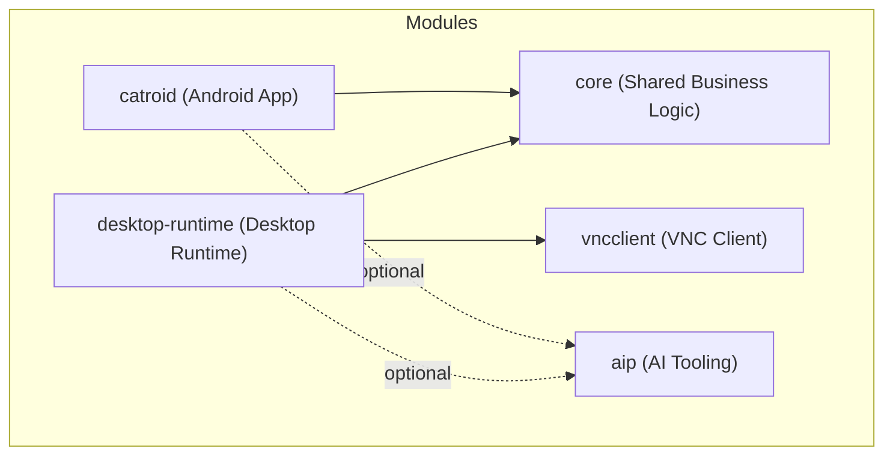
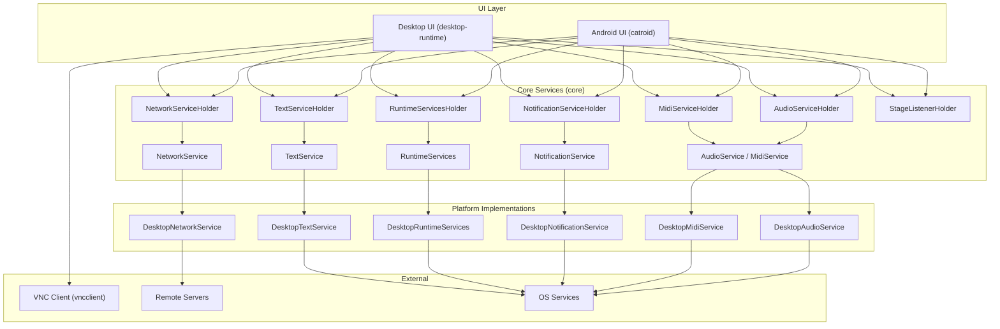
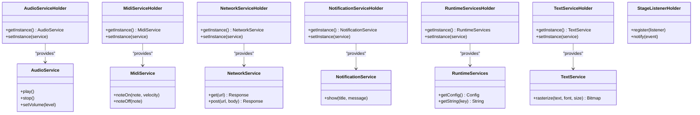
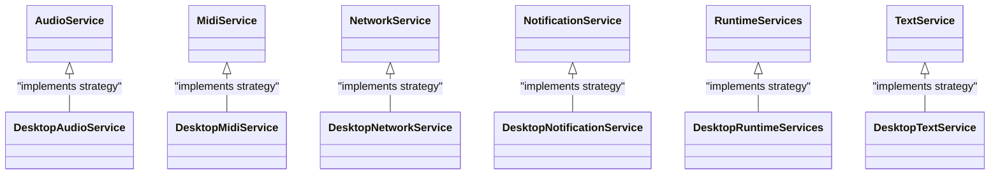
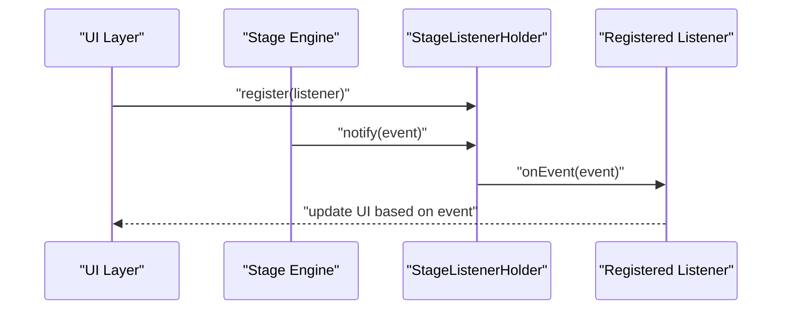
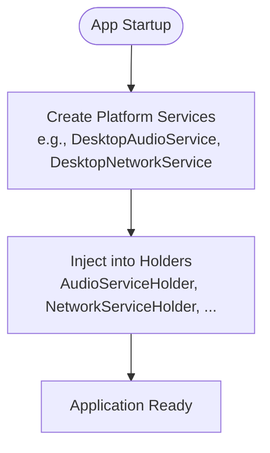
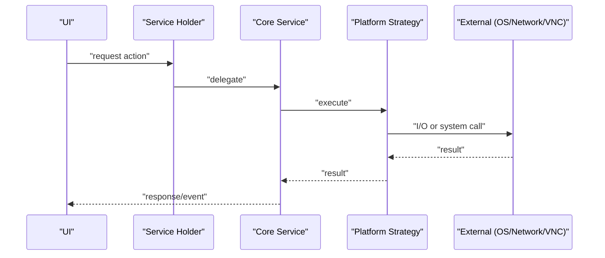
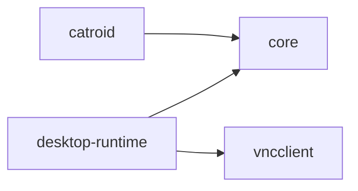

# Architecture Overview

<cite>
**Referenced Files in This Document**
- [core/build.gradle](file://core/build.gradle)
- [core/src/main/java/org/catrobat/catroid/audio/AudioService.kt](file://core/src/main/java/org/catrobat/catroid/audio/AudioService.kt)
- [core/src/main/java/org/catrobat/catroid/audio/AudioServiceHolder.kt](file://core/src/main/java/org/catrobat/catroid/audio/AudioServiceHolder.kt)
- [core/src/main/java/org/catrobat/catroid/audio/MidiService.kt](file://core/src/main/java/org/catrobat/catroid/audio/MidiService.kt)
- [core/src/main/java/org/catrobat/catroid/audio/MidiServiceHolder.kt](file://core/src/main/java/org/catrobat/catroid/audio/MidiServiceHolder.kt)
- [core/src/main/java/org/catrobat/catroid/network/NetworkService.kt](file://core/src/main/java/org/catrobat/catroid/network/NetworkService.kt)
- [core/src/main/java/org/catrobat/catroid/network/NetworkServiceHolder.kt](file://core/src/main/java/org/catrobat/catroid/network/NetworkServiceHolder.kt)
- [core/src/main/java/org/catrobat/catroid/notification/NotificationService.kt](file://core/src/main/java/org/catrobat/catroid/notification/NotificationService.kt)
- [core/src/main/java/org/catrobat/catroid/notification/NotificationServiceHolder.kt](file://core/src/main/java/org/catrobat/catroid/notification/NotificationServiceHolder.kt)
- [core/src/main/java/org/catrobat/catroid/runtime/RuntimeServices.kt](file://core/src/main/java/org/catrobat/catroid/runtime/RuntimeServices.kt)
- [core/src/main/java/org/catrobat/catroid/runtime/RuntimeServicesHolder.kt](file://core/src/main/java/org/catrobat/catroid/runtime/RuntimeServicesHolder.kt)
- [core/src/main/java/org/catrobat/catroid/text/TextService.kt](file://core/src/main/java/org/catrobat/catroid/text/TextService.kt)
- [core/src/main/java/org/catrobat/catroid/text/TextServiceHolder.kt](file://core/src/main/java/org/catrobat/catroid/text/TextServiceHolder.kt)
- [core/src/main/java/org/catrobat/catroid/stage/StageListenerHolder.kt](file://core/src/main/java/org/catrobat/catroid/stage/StageListenerHolder.kt)
- [desktop-runtime/build.gradle](file://desktop-runtime/build.gradle)
- [desktop-runtime/src/main/java/org/catrobat/catroid/audio/DesktopAudioService.kt](file://desktop-runtime/src/main/java/org/catrobat/catroid/audio/DesktopAudioService.kt)
- [desktop-runtime/src/main/java/org/catrobat/catroid/audio/DesktopMidiService.kt](file://desktop-runtime/src/main/java/org/catrobat/catroid/audio/DesktopMidiService.kt)
- [desktop-runtime/src/main/java/org/catrobat/catroid/network/DesktopNetworkService.kt](file://desktop-runtime/src/main/java/org/catrobat/catroid/network/DesktopNetworkService.kt)
- [desktop-runtime/src/main/java/org/catrobat/catroid/notification/DesktopNotificationService.kt](file://desktop-runtime/src/main/java/org/catrobat/catroid/notification/DesktopNotificationService.kt)
- [desktop-runtime/src/main/java/org/catrobat/catroid/runtime/DesktopRuntimeServices.kt](file://desktop-runtime/src/main/java/org/catrobat/catroid/runtime/DesktopRuntimeServices.kt)
- [desktop-runtime/src/main/java/org/catrobat/catroid/text/DesktopTextService.kt](file://desktop-runtime/src/main/java/org/catrobat/catroid/text/DesktopTextService.kt)
- [vncclient/build.gradle](file://vncclient/build.gradle)
- [catroid/build.gradle](file://catroid/build.gradle)
</cite>

## Table of Contents
1. Introduction
2. Project Structure
3. Core Components
4. Architecture Overview
5. Detailed Component Analysis
6. Dependency Analysis
7. Performance Considerations
8. Troubleshooting Guide
9. Conclusion

## Introduction
This document describes NewCatroid’s multi-module architecture with a clear separation between core business logic, Android-specific implementations, and desktop runtime components. It explains the modular structure (core library, main Android application, desktop runtime, AI components, and VNC client), highlights architectural patterns such as Service Locator via Holder classes, Observer for event handling, Factory for component instantiation, and Strategy for platform-specific implementations. It also outlines data flows across UI, business logic, and execution engines, along with infrastructure requirements, scalability considerations, and deployment topology for mobile and desktop environments.

## Project Structure
NewCatroid is organized into multiple Gradle modules:
- core: Platform-agnostic business logic and service interfaces (Kotlin).
- catroid: Main Android application module that composes services and UI.
- desktop-runtime: Desktop entry point and platform-specific implementations of core services.
- vncclient: VNC client integration used by the desktop runtime to render remote stages.
- aip: AI-related scripts and models (Python-based training/serving tooling).

**Diagram sources**
- [catroid/build.gradle](file://catroid/build.gradle)
- [core/build.gradle](file://core/build.gradle)
- [desktop-runtime/build.gradle](file://desktop-runtime/build.gradle)
- [vncclient/build.gradle](file://vncclient/build.gradle)

**Section sources**
- [catroid/build.gradle](file://catroid/build.gradle)
- [core/build.gradle](file://core/build.gradle)
- [desktop-runtime/build.gradle](file://desktop-runtime/build.gradle)
- [vncclient/build.gradle](file://vncclient/build.gradle)

## Core Components
The core module defines platform-agnostic services and their holders. Holders implement the Service Locator pattern by providing global access to concrete service instances. Services are typically paired with a Holder class to decouple consumers from platform-specific implementations.

Key service areas:
- Audio: Audio playback and MIDI support.
- Network: HTTP and networking abstractions.
- Notification: System notification delivery.
- Runtime: Runtime configuration and string localization.
- Text: Rasterization and text rendering utilities.
- Stage: Event listener management for stage lifecycle.

Representative files:
- Audio services and holders: [AudioService.kt](file://core/src/main/java/org/catrobat/catroid/audio/AudioService.kt), [AudioServiceHolder.kt](file://core/src/main/java/org/catrobat/catroid/audio/AudioServiceHolder.kt), [MidiService.kt](file://core/src/main/java/org/catrobat/catroid/audio/MidiService.kt), [MidiServiceHolder.kt](file://core/src/main/java/org/catrobat/catroid/audio/MidiServiceHolder.kt)
- Network service and holder: [NetworkService.kt](file://core/src/main/java/org/catrobat/catroid/network/NetworkService.kt), [NetworkServiceHolder.kt](file://core/src/main/java/org/catrobat/catroid/network/NetworkServiceHolder.kt)
- Notification service and holder: [NotificationService.kt](file://core/src/main/java/org/catrobat/catroid/notification/NotificationService.kt), [NotificationServiceHolder.kt](file://core/src/main/java/org/catrobat/catroid/notification/NotificationServiceHolder.kt)
- Runtime services and holder: [RuntimeServices.kt](file://core/src/main/java/org/catrobat/catroid/runtime/RuntimeServices.kt), [RuntimeServicesHolder.kt](file://core/src/main/java/org/catrobat/catroid/runtime/RuntimeServicesHolder.kt)
- Text service and holder: [TextService.kt](file://core/src/main/java/org/catrobat/catroid/text/TextService.kt), [TextServiceHolder.kt](file://core/src/main/java/org/catrobat/catroid/text/TextServiceHolder.kt)
- Stage listener holder: [StageListenerHolder.kt](file://core/src/main/java/org/catrobat/catroid/stage/StageListenerHolder.kt)

These components expose stable APIs consumed by both Android and desktop runtimes. The Holder classes centralize instance resolution, enabling different platforms to supply their own implementations without changing consumer code.

**Section sources**
- [core/src/main/java/org/catrobat/catroid/audio/AudioService.kt](file://core/src/main/java/org/catrobat/catroid/audio/AudioService.kt)
- [core/src/main/java/org/catrobat/catroid/audio/AudioServiceHolder.kt](file://core/src/main/java/org/catrobat/catroid/audio/AudioServiceHolder.kt)
- [core/src/main/java/org/catrobat/catroid/audio/MidiService.kt](file://core/src/main/java/org/catrobat/catroid/audio/MidiService.kt)
- [core/src/main/java/org/catrobat/catroid/audio/MidiServiceHolder.kt](file://core/src/main/java/org/catrobat/catroid/audio/MidiServiceHolder.kt)
- [core/src/main/java/org/catrobat/catroid/network/NetworkService.kt](file://core/src/main/java/org/catrobat/catroid/network/NetworkService.kt)
- [core/src/main/java/org/catrobat/catroid/network/NetworkServiceHolder.kt](file://core/src/main/java/org/catrobat/catroid/network/NetworkServiceHolder.kt)
- [core/src/main/java/org/catrobat/catroid/notification/NotificationService.kt](file://core/src/main/java/org/catrobat/catroid/notification/NotificationService.kt)
- [core/src/main/java/org/catrobat/catroid/notification/NotificationServiceHolder.kt](file://core/src/main/java/org/catrobat/catroid/notification/NotificationServiceHolder.kt)
- [core/src/main/java/org/catrobat/catroid/runtime/RuntimeServices.kt](file://core/src/main/java/org/catrobat/catroid/runtime/RuntimeServices.kt)
- [core/src/main/java/org/catrobat/catroid/runtime/RuntimeServicesHolder.kt](file://core/src/main/java/org/catrobat/catroid/runtime/RuntimeServicesHolder.kt)
- [core/src/main/java/org/catrobat/catroid/text/TextService.kt](file://core/src/main/java/org/catrobat/catroid/text/TextService.kt)
- [core/src/main/java/org/catrobat/catroid/text/TextServiceHolder.kt](file://core/src/main/java/org/catrobat/catroid/text/TextServiceHolder.kt)
- [core/src/main/java/org/catrobat/catroid/stage/StageListenerHolder.kt](file://core/src/main/java/org/catrobat/catroid/stage/StageListenerHolder.kt)

## Architecture Overview
The system separates concerns across layers:
- UI Layer: Android Activities/Fragments or Desktop windows.
- Business Logic: Core services and domain logic in the core module.
- Execution Engines: Stage runtime, audio/MIDI pipelines, network I/O, and text rendering.
- Platform Abstraction: Holder classes resolve platform-specific implementations at startup.

**Diagram sources**
- [core/src/main/java/org/catrobat/catroid/audio/AudioService.kt](file://core/src/main/java/org/catrobat/catroid/audio/AudioService.kt)
- [core/src/main/java/org/catrobat/catroid/audio/AudioServiceHolder.kt](file://core/src/main/java/org/catrobat/catroid/audio/AudioServiceHolder.kt)
- [core/src/main/java/org/catrobat/catroid/audio/MidiService.kt](file://core/src/main/java/org/catrobat/catroid/audio/MidiService.kt)
- [core/src/main/java/org/catrobat/catroid/audio/MidiServiceHolder.kt](file://core/src/main/java/org/catrobat/catroid/audio/MidiServiceHolder.kt)
- [core/src/main/java/org/catrobat/catroid/network/NetworkService.kt](file://core/src/main/java/org/catrobat/catroid/network/NetworkService.kt)
- [core/src/main/java/org/catrobat/catroid/network/NetworkServiceHolder.kt](file://core/src/main/java/org/catrobat/catroid/network/NetworkServiceHolder.kt)
- [core/src/main/java/org/catrobat/catroid/notification/NotificationService.kt](file://core/src/main/java/org/catrobat/catroid/notification/NotificationService.kt)
- [core/src/main/java/org/catrobat/catroid/notification/NotificationServiceHolder.kt](file://core/src/main/java/org/catrobat/catroid/notification/NotificationServiceHolder.kt)
- [core/src/main/java/org/catrobat/catroid/runtime/RuntimeServices.kt](file://core/src/main/java/org/catrobat/catroid/runtime/RuntimeServices.kt)
- [core/src/main/java/org/catrobat/catroid/runtime/RuntimeServicesHolder.kt](file://core/src/main/java/org/catrobat/catroid/runtime/RuntimeServicesHolder.kt)
- [core/src/main/java/org/catrobat/catroid/text/TextService.kt](file://core/src/main/java/org/catrobat/catroid/text/TextService.kt)
- [core/src/main/java/org/catrobat/catroid/text/TextServiceHolder.kt](file://core/src/main/java/org/catrobat/catroid/text/TextServiceHolder.kt)
- [desktop-runtime/src/main/java/org/catrobat/catroid/audio/DesktopAudioService.kt](file://desktop-runtime/src/main/java/org/catrobat/catroid/audio/DesktopAudioService.kt)
- [desktop-runtime/src/main/java/org/catrobat/catroid/audio/DesktopMidiService.kt](file://desktop-runtime/src/main/java/org/catrobat/catroid/audio/DesktopMidiService.kt)
- [desktop-runtime/src/main/java/org/catrobat/catroid/network/DesktopNetworkService.kt](file://desktop-runtime/src/main/java/org/catrobat/catroid/network/DesktopNetworkService.kt)
- [desktop-runtime/src/main/java/org/catrobat/catroid/notification/DesktopNotificationService.kt](file://desktop-runtime/src/main/java/org/catrobat/catroid/notification/DesktopNotificationService.kt)
- [desktop-runtime/src/main/java/org/catrobat/catroid/runtime/DesktopRuntimeServices.kt](file://desktop-runtime/src/main/java/org/catrobat/catroid/runtime/DesktopRuntimeServices.kt)
- [desktop-runtime/src/main/java/org/catrobat/catroid/text/DesktopTextService.kt](file://desktop-runtime/src/main/java/org/catrobat/catroid/text/DesktopTextService.kt)
- [vncclient/build.gradle](file://vncclient/build.gradle)

## Detailed Component Analysis

### Service Locator Pattern via Holder Classes
The Holder classes provide centralized access to service instances, enabling platform-specific composition at startup while keeping consumers decoupled.

**Diagram sources**
- [core/src/main/java/org/catrobat/catroid/audio/AudioService.kt](file://core/src/main/java/org/catrobat/catroid/audio/AudioService.kt)
- [core/src/main/java/org/catrobat/catroid/audio/AudioServiceHolder.kt](file://core/src/main/java/org/catrobat/catroid/audio/AudioServiceHolder.kt)
- [core/src/main/java/org/catrobat/catroid/audio/MidiService.kt](file://core/src/main/java/org/catrobat/catroid/audio/MidiService.kt)
- [core/src/main/java/org/catrobat/catroid/audio/MidiServiceHolder.kt](file://core/src/main/java/org/catrobat/catroid/audio/MidiServiceHolder.kt)
- [core/src/main/java/org/catrobat/catroid/network/NetworkService.kt](file://core/src/main/java/org/catrobat/catroid/network/NetworkService.kt)
- [core/src/main/java/org/catrobat/catroid/network/NetworkServiceHolder.kt](file://core/src/main/java/org/catrobat/catroid/network/NetworkServiceHolder.kt)
- [core/src/main/java/org/catrobat/catroid/notification/NotificationService.kt](file://core/src/main/java/org/catrobat/catroid/notification/NotificationService.kt)
- [core/src/main/java/org/catrobat/catroid/notification/NotificationServiceHolder.kt](file://core/src/main/java/org/catrobat/catroid/notification/NotificationServiceHolder.kt)
- [core/src/main/java/org/catrobat/catroid/runtime/RuntimeServices.kt](file://core/src/main/java/org/catrobat/catroid/runtime/RuntimeServices.kt)
- [core/src/main/java/org/catrobat/catroid/runtime/RuntimeServicesHolder.kt](file://core/src/main/java/org/catrobat/catroid/runtime/RuntimeServicesHolder.kt)
- [core/src/main/java/org/catrobat/catroid/text/TextService.kt](file://core/src/main/java/org/catrobat/catroid/text/TextService.kt)
- [core/src/main/java/org/catrobat/catroid/text/TextServiceHolder.kt](file://core/src/main/java/org/catrobat/catroid/text/TextServiceHolder.kt)
- [core/src/main/java/org/catrobat/catroid/stage/StageListenerHolder.kt](file://core/src/main/java/org/catrobat/catroid/stage/StageListenerHolder.kt)

**Section sources**
- [core/src/main/java/org/catrobat/catroid/audio/AudioServiceHolder.kt](file://core/src/main/java/org/catrobat/catroid/audio/AudioServiceHolder.kt)
- [core/src/main/java/org/catrobat/catroid/audio/MidiServiceHolder.kt](file://core/src/main/java/org/catrobat/catroid/audio/MidiServiceHolder.kt)
- [core/src/main/java/org/catrobat/catroid/network/NetworkServiceHolder.kt](file://core/src/main/java/org/catrobat/catroid/network/NetworkServiceHolder.kt)
- [core/src/main/java/org/catrobat/catroid/notification/NotificationServiceHolder.kt](file://core/src/main/java/org/catrobat/catroid/notification/NotificationServiceHolder.kt)
- [core/src/main/java/org/catrobat/catroid/runtime/RuntimeServicesHolder.kt](file://core/src/main/java/org/catrobat/catroid/runtime/RuntimeServicesHolder.kt)
- [core/src/main/java/org/catrobat/catroid/text/TextServiceHolder.kt](file://core/src/main/java/org/catrobat/catroid/text/TextServiceHolder.kt)
- [core/src/main/java/org/catrobat/catroid/stage/StageListenerHolder.kt](file://core/src/main/java/org/catrobat/catroid/stage/StageListenerHolder.kt)

### Strategy Pattern for Platform-Specific Implementations
Platform-specific strategies implement core service interfaces. For example, desktop implementations replace Android-specific behavior with desktop equivalents.

**Diagram sources**
- [desktop-runtime/src/main/java/org/catrobat/catroid/audio/DesktopAudioService.kt](file://desktop-runtime/src/main/java/org/catrobat/catroid/audio/DesktopAudioService.kt)
- [desktop-runtime/src/main/java/org/catrobat/catroid/audio/DesktopMidiService.kt](file://desktop-runtime/src/main/java/org/catrobat/catroid/audio/DesktopMidiService.kt)
- [desktop-runtime/src/main/java/org/catrobat/catroid/network/DesktopNetworkService.kt](file://desktop-runtime/src/main/java/org/catrobat/catroid/network/DesktopNetworkService.kt)
- [desktop-runtime/src/main/java/org/catrobat/catroid/notification/DesktopNotificationService.kt](file://desktop-runtime/src/main/java/org/catrobat/catroid/notification/DesktopNotificationService.kt)
- [desktop-runtime/src/main/java/org/catrobat/catroid/runtime/DesktopRuntimeServices.kt](file://desktop-runtime/src/main/java/org/catrobat/catroid/runtime/DesktopRuntimeServices.kt)
- [desktop-runtime/src/main/java/org/catrobat/catroid/text/DesktopTextService.kt](file://desktop-runtime/src/main/java/org/catrobat/catroid/text/DesktopTextService.kt)

**Section sources**
- [desktop-runtime/src/main/java/org/catrobat/catroid/audio/DesktopAudioService.kt](file://desktop-runtime/src/main/java/org/catrobat/catroid/audio/DesktopAudioService.kt)
- [desktop-runtime/src/main/java/org/catrobat/catroid/audio/DesktopMidiService.kt](file://desktop-runtime/src/main/java/org/catrobat/catroid/audio/DesktopMidiService.kt)
- [desktop-runtime/src/main/java/org/catrobat/catroid/network/DesktopNetworkService.kt](file://desktop-runtime/src/main/java/org/catrobat/catroid/network/DesktopNetworkService.kt)
- [desktop-runtime/src/main/java/org/catrobat/catroid/notification/DesktopNotificationService.kt](file://desktop-runtime/src/main/java/org/catrobat/catroid/notification/DesktopNotificationService.kt)
- [desktop-runtime/src/main/java/org/catrobat/catroid/runtime/DesktopRuntimeServices.kt](file://desktop-runtime/src/main/java/org/catrobat/catroid/runtime/DesktopRuntimeServices.kt)
- [desktop-runtime/src/main/java/org/catrobat/catroid/text/DesktopTextService.kt](file://desktop-runtime/src/main/java/org/catrobat/catroid/text/DesktopTextService.kt)

### Observer Pattern for Event Handling
Stage events propagate through listeners managed by StageListenerHolder. Consumers register listeners and receive notifications when stage state changes.

**Diagram sources**
- [core/src/main/java/org/catrobat/catroid/stage/StageListenerHolder.kt](file://core/src/main/java/org/catrobat/catroid/stage/StageListenerHolder.kt)

**Section sources**
- [core/src/main/java/org/catrobat/catroid/stage/StageListenerHolder.kt](file://core/src/main/java/org/catrobat/catroid/stage/StageListenerHolder.kt)

### Factory Pattern for Component Instantiation
Factory-like composition occurs during app initialization where platform-specific services are created and injected into Holders. This ensures consumers remain agnostic of platform details.

[No sources needed since this diagram shows conceptual workflow, not actual code structure]

### Data Flows Between Layers
End-to-end flow from UI to execution engines:
- UI triggers actions (e.g., play sound, send network request).
- Holders resolve concrete services.
- Services perform operations using platform strategies.
- Results propagate back to UI; stage events notify listeners.

[No sources needed since this diagram shows conceptual workflow, not actual code structure]

## Dependency Analysis
Module-level dependencies reflect the layered design:
- catroid depends on core for shared services.
- desktop-runtime depends on core and provides platform strategies.
- vncclient is integrated by desktop-runtime for remote rendering.

**Diagram sources**
- [catroid/build.gradle](file://catroid/build.gradle)
- [core/build.gradle](file://core/build.gradle)
- [desktop-runtime/build.gradle](file://desktop-runtime/build.gradle)
- [vncclient/build.gradle](file://vncclient/build.gradle)

**Section sources**
- [catroid/build.gradle](file://catroid/build.gradle)
- [core/build.gradle](file://core/build.gradle)
- [desktop-runtime/build.gradle](file://desktop-runtime/build.gradle)
- [vncclient/build.gradle](file://vncclient/build.gradle)

## Performance Considerations
- Service Resolution: Keep Holder lookups lightweight; prefer singletons initialized once at startup.
- Threading: Offload heavy tasks (network, audio decoding, text rasterization) to background threads; ensure thread-safe updates to UI-bound listeners.
- Resource Management: Reuse audio buffers and network clients; avoid frequent allocations in hot paths.
- Rendering: Batch text rasterization and reuse bitmaps where possible; leverage caching in TextService.
- VNC Integration: Limit frame rate and compression settings to balance latency and CPU usage on desktop.

[No sources needed since this section provides general guidance]

## Troubleshooting Guide
Common issues and checks:
- Missing Service Implementation: Ensure platform-specific services are instantiated and injected into corresponding Holders before use.
- Event Not Received: Verify listeners are registered via StageListenerHolder and that events are emitted on the correct thread.
- Network Failures: Validate URL endpoints, timeouts, and error propagation in NetworkService; check proxy/firewall rules.
- Audio/MIDI Errors: Confirm device availability and permissions; verify volume and format compatibility.
- Notifications: Check OS permission prompts and notification channel configuration.

**Section sources**
- [core/src/main/java/org/catrobat/catroid/network/NetworkService.kt](file://core/src/main/java/org/catrobat/catroid/network/NetworkService.kt)
- [core/src/main/java/org/catrobat/catroid/audio/AudioService.kt](file://core/src/main/java/org/catrobat/catroid/audio/AudioService.kt)
- [core/src/main/java/org/catrobat/catroid/audio/MidiService.kt](file://core/src/main/java/org/catrobat/catroid/audio/MidiService.kt)
- [core/src/main/java/org/catrobat/catroid/notification/NotificationService.kt](file://core/src/main/java/org/catrobat/catroid/notification/NotificationService.kt)
- [core/src/main/java/org/catrobat/catroid/text/TextService.kt](file://core/src/main/java/org/catrobat/catroid/text/TextService.kt)
- [core/src/main/java/org/catrobat/catroid/stage/StageListenerHolder.kt](file://core/src/main/java/org/catrobat/catroid/stage/StageListenerHolder.kt)

## Conclusion
NewCatroid’s architecture cleanly separates core business logic from platform specifics using Holder-based Service Locator and Strategy patterns. The modular layout supports both Android and desktop deployments, with clear dependency boundaries and extensibility points. By adhering to these patterns and performance guidelines, teams can maintain a scalable, testable, and portable codebase across platforms.