# Component Relationships

<cite>
**Referenced Files in This Document**
- [README.md](file://README.md)
- [build.gradle](file://build.gradle)
- [settings.gradle](file://settings.gradle)
- [core/src/main/java/org/catrobat/catroid/runtime/RuntimeServices.kt](file://core/src/main/java/org/catrobat/catroid/runtime/RuntimeServices.kt)
- [core/src/main/java/org/catrobat/catroid/runtime/RuntimeServicesHolder.kt](file://core/src/main/java/org/catrobat/catroid/runtime/RuntimeServicesHolder.kt)
- [core/src/main/java/org/catrobat/catroid/audio/AudioService.kt](file://core/src/main/java/org/catrobat/catroid/audio/AudioService.kt)
- [core/src/main/java/org/catrobat/catroid/audio/AudioServiceHolder.kt](file://core/src/main/java/org/catrobat/catroid/audio/AudioServiceHolder.kt)
- [core/src/main/java/org/catrobat/catroid/network/NetworkService.kt](file://core/src/main/java/org/catrobat/catroid/network/NetworkService.kt)
- [core/src/main/java/org/catrobat/catroid/network/NetworkServiceHolder.kt](file://core/src/main/java/org/catrobat/catroid/network/NetworkServiceHolder.kt)
- [core/src/main/java/org/catrobat/catroid/notification/NotificationService.kt](file://core/src/main/java/org/catrobat/catroid/notification/NotificationService.kt)
- [core/src/main/java/org/catrobat/catroid/notification/NotificationServiceHolder.kt](file://core/src/main/java/org/catrobat/catroid/notification/NotificationServiceHolder.kt)
- [core/src/main/java/org/catrobat/catroid/text/TextService.kt](file://core/src/main/java/org/catrobat/catroid/text/TextService.kt)
- [core/src/main/java/org/catrobat/catroid/text/TextServiceHolder.kt](file://core/src/main/java/org/catrobat/catroid/text/TextServiceHolder.kt)
- [core/src/main/java/org/catrobat/catroid/stage/StageListenerHolder.kt](file://core/src/main/java/org/catrobat/catroid/stage/StageListenerHolder.kt)
- [core/src/main/java/org/catrobat/catroid/util/Logger.kt](file://core/src/main/java/org/catrobat/catroid/util/Logger.kt)
- [catroid/src/main/java/org/catrobat/catroid/common/FlavoredConstants.java](file://catroid/src/main/java/org/catrobat/catroid/common/FlavoredConstants.java)
</cite>

## Table of Contents
1. Introduction
2. Project Structure
3. Core Components
4. Architecture Overview
5. Detailed Component Analysis
6. Dependency Analysis
7. Performance Considerations
8. Troubleshooting Guide
9. Conclusion

## Introduction
This document explains the component relationships and interactions within NewCatroid, focusing on a clear separation between:
- Presentation layer (UI components)
- Business logic layer (core services)
- Execution layer (runtime engines)

It describes how components communicate through well-defined interfaces and contracts, including service locators, asset managers, hardware APIs, and external services. It also covers cross-cutting concerns such as logging, error handling, and performance monitoring across component boundaries.

## Project Structure
NewCatroid is a multi-module Android project with a core library module providing platform-agnostic services and an Android application module that wires UI to those services. The desktop runtime provides a separate execution environment for development and testing.

Key modules:
- catroid: Android application module containing UI, activities, and Android-specific integrations
- core: Shared business logic and services (audio, network, notifications, text, runtime orchestration)
- desktop-runtime: Desktop execution environment for stage and runtime features
- vncclient: VNC client integration used by the runtime/UI for remote display scenarios
- aip: AI-related utilities and models (not part of runtime architecture)

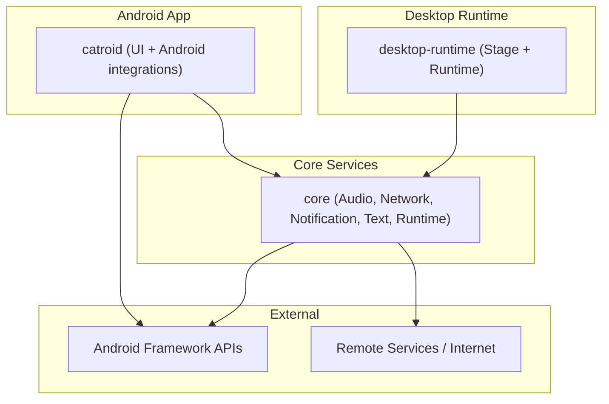

**Diagram sources**
- [build.gradle](file://build.gradle)
- [settings.gradle](file://settings.gradle)
- [catroid/src/main/java/org/catrobat/catroid/common/FlavoredConstants.java](file://catroid/src/main/java/org/catrobat/catroid/common/FlavoredConstants.java)

**Section sources**
- [README.md](file://README.md)
- [build.gradle](file://build.gradle)
- [settings.gradle](file://settings.gradle)

## Core Components
The business logic layer is organized around cohesive services exposed via holder classes that act as simple service locators. Each service encapsulates a specific domain capability:
- AudioService: audio playback and synthesis
- NetworkService: HTTP networking and API calls
- NotificationService: system notifications
- TextService: text rendering and rasterization
- RuntimeServices: runtime orchestration and string provider access

These services are accessed through corresponding Holder classes, which centralize lifecycle and dependency resolution.

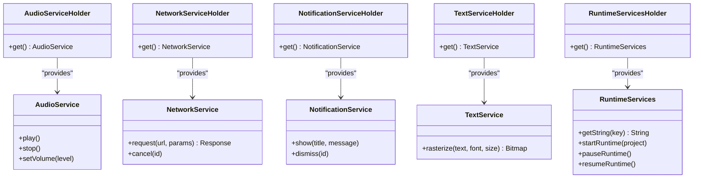

**Diagram sources**
- [core/src/main/java/org/catrobat/catroid/audio/AudioService.kt](file://core/src/main/java/org/catrobat/catroid/audio/AudioService.kt)
- [core/src/main/java/org/catrobat/catroid/audio/AudioServiceHolder.kt](file://core/src/main/java/org/catrobat/catroid/audio/AudioServiceHolder.kt)
- [core/src/main/java/org/catrobat/catroid/network/NetworkService.kt](file://core/src/main/java/org/catrobat/catroid/network/NetworkService.kt)
- [core/src/main/java/org/catrobat/catroid/network/NetworkServiceHolder.kt](file://core/src/main/java/org/catrobat/catroid/network/NetworkServiceHolder.kt)
- [core/src/main/java/org/catrobat/catroid/notification/NotificationService.kt](file://core/src/main/java/org/catrobat/catroid/notification/NotificationService.kt)
- [core/src/main/java/org/catrobat/catroid/notification/NotificationServiceHolder.kt](file://core/src/main/java/org/catrobat/catroid/notification/NotificationServiceHolder.kt)
- [core/src/main/java/org/catrobat/catroid/text/TextService.kt](file://core/src/main/java/org/catrobat/catroid/text/TextService.kt)
- [core/src/main/java/org/catrobat/catroid/text/TextServiceHolder.kt](file://core/src/main/java/org/catrobat/catroid/text/TextServiceHolder.kt)
- [core/src/main/java/org/catrobat/catroid/runtime/RuntimeServices.kt](file://core/src/main/java/org/catrobat/catroid/runtime/RuntimeServices.kt)
- [core/src/main/java/org/catrobat/catroid/runtime/RuntimeServicesHolder.kt](file://core/src/main/java/org/catrobat/catroid/runtime/RuntimeServicesHolder.kt)

**Section sources**
- [core/src/main/java/org/catrobat/catroid/audio/AudioService.kt](file://core/src/main/java/org/catrobat/catroid/audio/AudioService.kt)
- [core/src/main/java/org/catrobat/catroid/audio/AudioServiceHolder.kt](file://core/src/main/java/org/catrobat/catroid/audio/AudioServiceHolder.kt)
- [core/src/main/java/org/catrobat/catroid/network/NetworkService.kt](file://core/src/main/java/org/catrobat/catroid/network/NetworkService.kt)
- [core/src/main/java/org/catrobat/catroid/network/NetworkServiceHolder.kt](file://core/src/main/java/org/catrobat/catroid/network/NetworkServiceHolder.kt)
- [core/src/main/java/org/catrobat/catroid/notification/NotificationService.kt](file://core/src/main/java/org/catrobat/catroid/notification/NotificationService.kt)
- [core/src/main/java/org/catrobat/catroid/notification/NotificationServiceHolder.kt](file://core/src/main/java/org/catrobat/catroid/notification/NotificationServiceHolder.kt)
- [core/src/main/java/org/catrobat/catroid/text/TextService.kt](file://core/src/main/java/org/catrobat/catroid/text/TextService.kt)
- [core/src/main/java/org/catrobat/catroid/text/TextServiceHolder.kt](file://core/src/main/java/org/catrobat/catroid/text/TextServiceHolder.kt)
- [core/src/main/java/org/catrobat/catroid/runtime/RuntimeServices.kt](file://core/src/main/java/org/catrobat/catroid/runtime/RuntimeServices.kt)
- [core/src/main/java/org/catrobat/catroid/runtime/RuntimeServicesHolder.kt](file://core/src/main/java/org/catrobat/catroid/runtime/RuntimeServicesHolder.kt)

## Architecture Overview
High-level design separates responsibilities into three layers:
- Presentation layer (UI): Activities, fragments, views, and adapters in the catroid module
- Business logic layer (services): Platform-agnostic services in the core module
- Execution layer (runtime engines): Stage and runtime orchestration in core and desktop-runtime

Communication flows from UI to services via holders, then to hardware APIs or external services. Cross-cutting concerns like logging and error handling are centralized where possible.

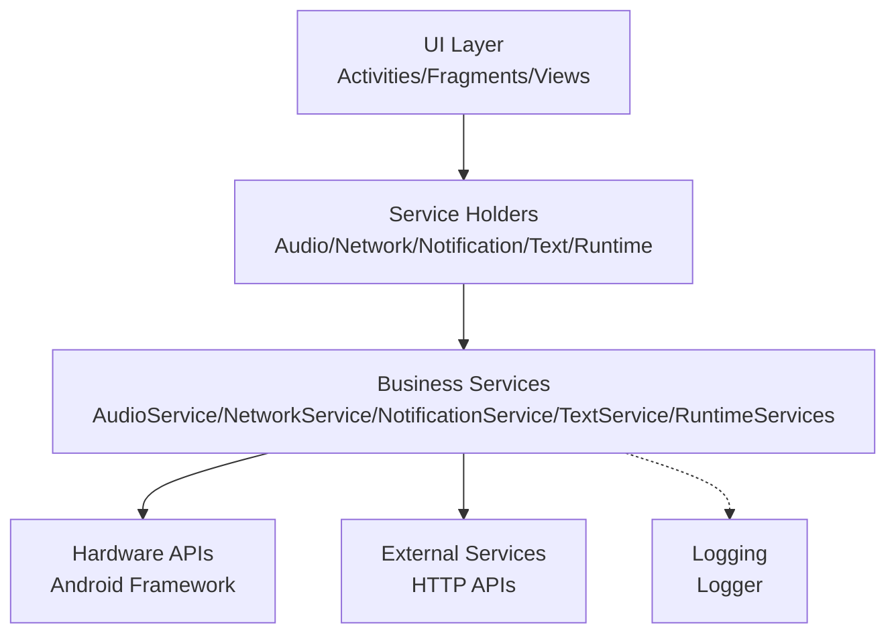

**Diagram sources**
- [core/src/main/java/org/catrobat/catroid/util/Logger.kt](file://core/src/main/java/org/catrobat/catroid/util/Logger.kt)
- [core/src/main/java/org/catrobat/catroid/audio/AudioService.kt](file://core/src/main/java/org/catrobat/catroid/audio/AudioService.kt)
- [core/src/main/java/org/catrobat/catroid/network/NetworkService.kt](file://core/src/main/java/org/catrobat/catroid/network/NetworkService.kt)
- [core/src/main/java/org/catrobat/catroid/notification/NotificationService.kt](file://core/src/main/java/org/catrobat/catroid/notification/NotificationService.kt)
- [core/src/main/java/org/catrobat/catroid/text/TextService.kt](file://core/src/main/java/org/catrobat/catroid/text/TextService.kt)
- [core/src/main/java/org/catrobat/catroid/runtime/RuntimeServices.kt](file://core/src/main/java/org/catrobat/catroid/runtime/RuntimeServices.kt)

## Detailed Component Analysis

### Service Locator Pattern (Holders)
Each service has a corresponding Holder that exposes a static accessor to retrieve the service instance. This pattern simplifies dependency injection and reduces coupling between UI and services.

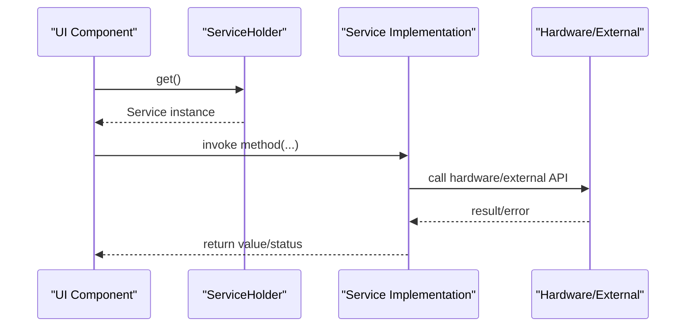

**Diagram sources**
- [core/src/main/java/org/catrobat/catroid/audio/AudioServiceHolder.kt](file://core/src/main/java/org/catrobat/catroid/audio/AudioServiceHolder.kt)
- [core/src/main/java/org/catrobat/catroid/network/NetworkServiceHolder.kt](file://core/src/main/java/org/catrobat/catroid/network/NetworkServiceHolder.kt)
- [core/src/main/java/org/catrobat/catroid/notification/NotificationServiceHolder.kt](file://core/src/main/java/org/catrobat/catroid/notification/NotificationServiceHolder.kt)
- [core/src/main/java/org/catrobat/catroid/text/TextServiceHolder.kt](file://core/src/main/java/org/catrobat/catroid/text/TextServiceHolder.kt)
- [core/src/main/java/org/catrobat/catroid/runtime/RuntimeServicesHolder.kt](file://core/src/main/java/org/catrobat/catroid/runtime/RuntimeServicesHolder.kt)

**Section sources**
- [core/src/main/java/org/catrobat/catroid/audio/AudioServiceHolder.kt](file://core/src/main/java/org/catrobat/catroid/audio/AudioServiceHolder.kt)
- [core/src/main/java/org/catrobat/catroid/network/NetworkServiceHolder.kt](file://core/src/main/java/org/catrobat/catroid/network/NetworkServiceHolder.kt)
- [core/src/main/java/org/catrobat/catroid/notification/NotificationServiceHolder.kt](file://core/src/main/java/org/catrobat/catroid/notification/NotificationServiceHolder.kt)
- [core/src/main/java/org/catrobat/catroid/text/TextServiceHolder.kt](file://core/src/main/java/org/catrobat/catroid/text/TextServiceHolder.kt)
- [core/src/main/java/org/catrobat/catroid/runtime/RuntimeServicesHolder.kt](file://core/src/main/java/org/catrobat/catroid/runtime/RuntimeServicesHolder.kt)

### Audio Service Interaction
The audio subsystem provides playback and synthesis capabilities. UI components request audio actions via the holder, which delegates to the service implementation.

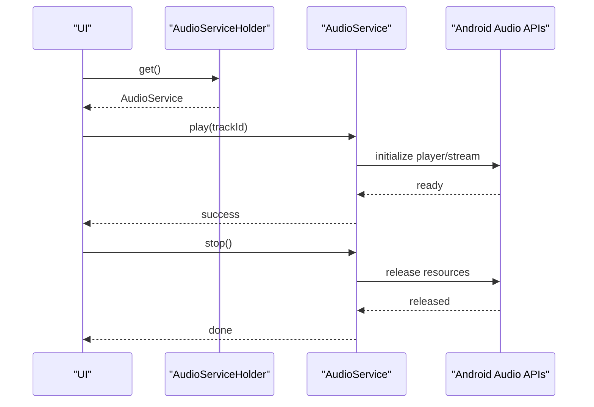

**Diagram sources**
- [core/src/main/java/org/catrobat/catroid/audio/AudioService.kt](file://core/src/main/java/org/catrobat/catroid/audio/AudioService.kt)
- [core/src/main/java/org/catrobat/catroid/audio/AudioServiceHolder.kt](file://core/src/main/java/org/catrobat/catroid/audio/AudioServiceHolder.kt)

**Section sources**
- [core/src/main/java/org/catrobat/catroid/audio/AudioService.kt](file://core/src/main/java/org/catrobat/catroid/audio/AudioService.kt)
- [core/src/main/java/org/catrobat/catroid/audio/AudioServiceHolder.kt](file://core/src/main/java/org/catrobat/catroid/audio/AudioServiceHolder.kt)

### Network Service Interaction
Networking operations are abstracted behind NetworkService. UI triggers requests via the holder; the service performs I/O and returns results or errors.

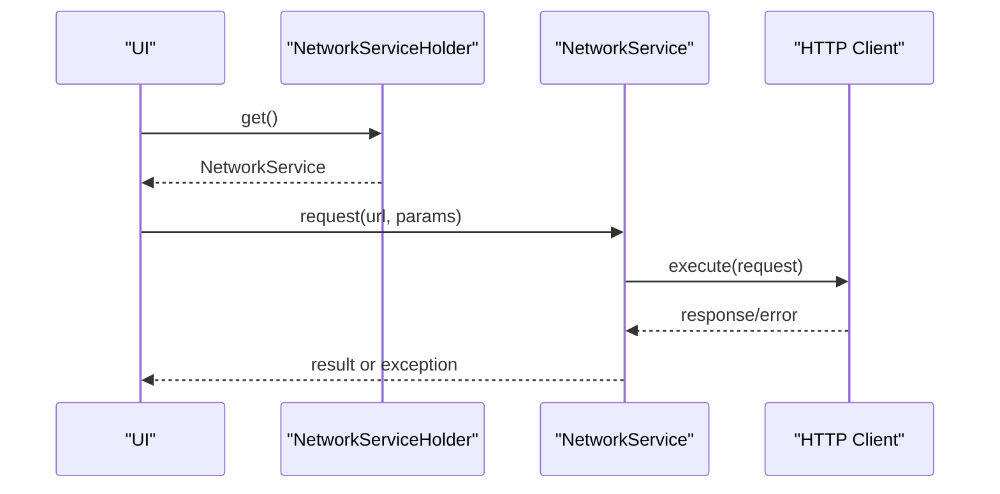

**Diagram sources**
- [core/src/main/java/org/catrobat/catroid/network/NetworkService.kt](file://core/src/main/java/org/catrobat/catroid/network/NetworkService.kt)
- [core/src/main/java/org/catrobat/catroid/network/NetworkServiceHolder.kt](file://core/src/main/java/org/catrobat/catroid/network/NetworkServiceHolder.kt)

**Section sources**
- [core/src/main/java/org/catrobat/catroid/network/NetworkService.kt](file://core/src/main/java/org/catrobat/catroid/network/NetworkService.kt)
- [core/src/main/java/org/catrobat/catroid/network/NetworkServiceHolder.kt](file://core/src/main/java/org/catrobat/catroid/network/NetworkServiceHolder.kt)

### Notification Service Interaction
Notifications are managed via NotificationService. UI components post notifications using the holder, which interacts with the system notification manager.

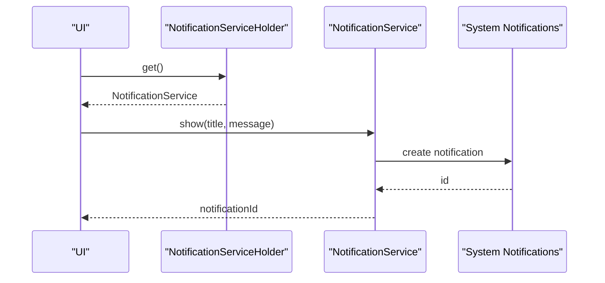

**Diagram sources**
- [core/src/main/java/org/catrobat/catroid/notification/NotificationService.kt](file://core/src/main/java/org/catrobat/catroid/notification/NotificationService.kt)
- [core/src/main/java/org/catrobat/catroid/notification/NotificationServiceHolder.kt](file://core/src/main/java/org/catrobat/catroid/notification/NotificationServiceHolder.kt)

**Section sources**
- [core/src/main/java/org/catrobat/catroid/notification/NotificationService.kt](file://core/src/main/java/org/catrobat/catroid/notification/NotificationService.kt)
- [core/src/main/java/org/catrobat/catroid/notification/NotificationServiceHolder.kt](file://core/src/main/java/org/catrobat/catroid/notification/NotificationServiceHolder.kt)

### Text Service Interaction
TextService handles text rasterization and related operations. UI uses it to render text content efficiently.

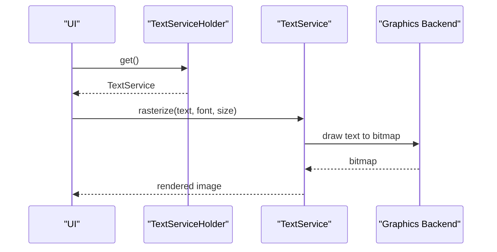

**Diagram sources**
- [core/src/main/java/org/catrobat/catroid/text/TextService.kt](file://core/src/main/java/org/catrobat/catroid/text/TextService.kt)
- [core/src/main/java/org/catrobat/catroid/text/TextServiceHolder.kt](file://core/src/main/java/org/catrobat/catroid/text/TextServiceHolder.kt)

**Section sources**
- [core/src/main/java/org/catrobat/catroid/text/TextService.kt](file://core/src/main/java/org/catrobat/catroid/text/TextService.kt)
- [core/src/main/java/org/catrobat/catroid/text/TextServiceHolder.kt](file://core/src/main/java/org/catrobat/catroid/text/TextServiceHolder.kt)

### Runtime Orchestration
RuntimeServices coordinates runtime lifecycle and provides localized strings via a string provider. It acts as a bridge between UI and the execution engine.

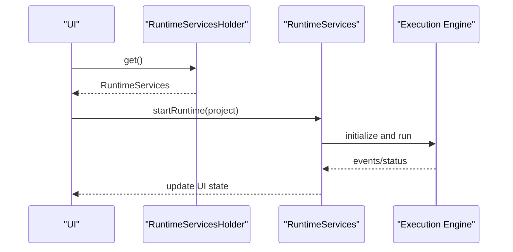

**Diagram sources**
- [core/src/main/java/org/catrobat/catroid/runtime/RuntimeServices.kt](file://core/src/main/java/org/catrobat/catroid/runtime/RuntimeServices.kt)
- [core/src/main/java/org/catrobat/catroid/runtime/RuntimeServicesHolder.kt](file://core/src/main/java/org/catrobat/catroid/runtime/RuntimeServicesHolder.kt)

**Section sources**
- [core/src/main/java/org/catrobat/catroid/runtime/RuntimeServices.kt](file://core/src/main/java/org/catrobat/catroid/runtime/RuntimeServices.kt)
- [core/src/main/java/org/catrobat/catroid/runtime/RuntimeServicesHolder.kt](file://core/src/main/java/org/catrobat/catroid/runtime/RuntimeServicesHolder.kt)

### Stage Listener Integration
StageListenerHolder centralizes stage event listeners, enabling decoupled communication between the stage and other components.

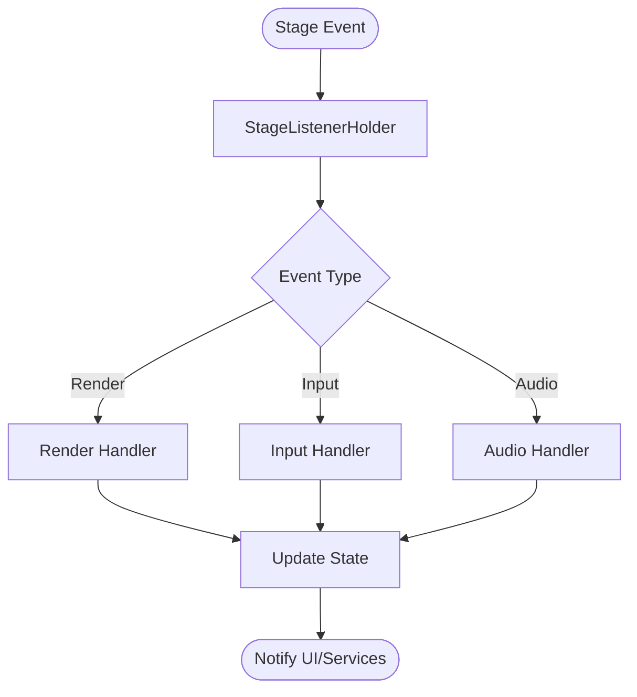

**Diagram sources**
- [core/src/main/java/org/catrobat/catroid/stage/StageListenerHolder.kt](file://core/src/main/java/org/catrobat/catroid/stage/StageListenerHolder.kt)

**Section sources**
- [core/src/main/java/org/catrobat/catroid/stage/StageListenerHolder.kt](file://core/src/main/java/org/catrobat/catroid/stage/StageListenerHolder.kt)

### Flavors and Build-Time Configuration
Flavored constants allow different app variants to customize behavior without changing core logic. UI and services can read these constants to adapt functionality per flavor.

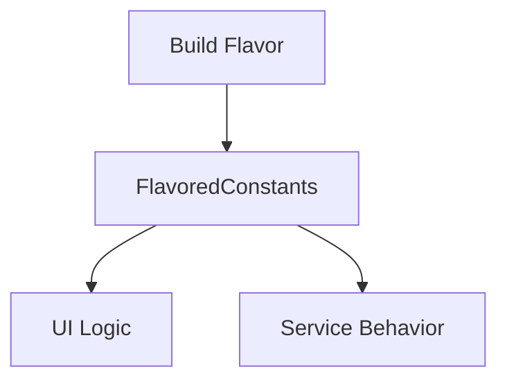

**Diagram sources**
- [catroid/src/main/java/org/catrobat/catroid/common/FlavoredConstants.java](file://catroid/src/main/java/org/catrobat/catroid/common/FlavoredConstants.java)

**Section sources**
- [catroid/src/main/java/org/catrobat/catroid/common/FlavoredConstants.java](file://catroid/src/main/java/org/catrobat/catroid/common/FlavoredConstants.java)

## Dependency Analysis
The following diagram shows dependencies among key components and their roles:

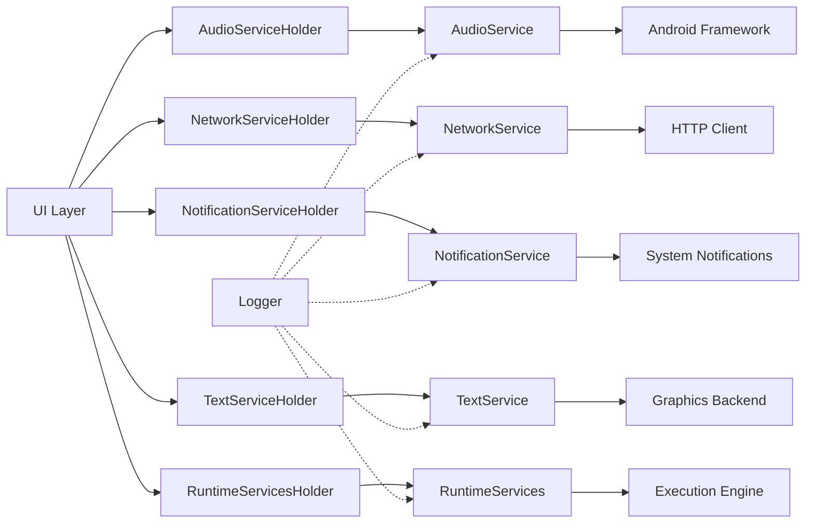

**Diagram sources**
- [core/src/main/java/org/catrobat/catroid/audio/AudioService.kt](file://core/src/main/java/org/catrobat/catroid/audio/AudioService.kt)
- [core/src/main/java/org/catrobat/catroid/audio/AudioServiceHolder.kt](file://core/src/main/java/org/catrobat/catroid/audio/AudioServiceHolder.kt)
- [core/src/main/java/org/catrobat/catroid/network/NetworkService.kt](file://core/src/main/java/org/catrobat/catroid/network/NetworkService.kt)
- [core/src/main/java/org/catrobat/catroid/network/NetworkServiceHolder.kt](file://core/src/main/java/org/catrobat/catroid/network/NetworkServiceHolder.kt)
- [core/src/main/java/org/catrobat/catroid/notification/NotificationService.kt](file://core/src/main/java/org/catrobat/catroid/notification/NotificationService.kt)
- [core/src/main/java/org/catrobat/catroid/notification/NotificationServiceHolder.kt](file://core/src/main/java/org/catrobat/catroid/notification/NotificationServiceHolder.kt)
- [core/src/main/java/org/catrobat/catroid/text/TextService.kt](file://core/src/main/java/org/catrobat/catroid/text/TextService.kt)
- [core/src/main/java/org/catrobat/catroid/text/TextServiceHolder.kt](file://core/src/main/java/org/catrobat/catroid/text/TextServiceHolder.kt)
- [core/src/main/java/org/catrobat/catroid/runtime/RuntimeServices.kt](file://core/src/main/java/org/catrobat/catroid/runtime/RuntimeServices.kt)
- [core/src/main/java/org/catrobat/catroid/runtime/RuntimeServicesHolder.kt](file://core/src/main/java/org/catrobat/catroid/runtime/RuntimeServicesHolder.kt)
- [core/src/main/java/org/catrobat/catroid/util/Logger.kt](file://core/src/main/java/org/catrobat/catroid/util/Logger.kt)

**Section sources**
- [core/src/main/java/org/catrobat/catroid/util/Logger.kt](file://core/src/main/java/org/catrobat/catroid/util/Logger.kt)

## Performance Considerations
- Prefer asynchronous operations for network and heavy tasks to keep UI responsive
- Reuse service instances via holders to avoid redundant initialization
- Batch UI updates when receiving frequent runtime events
- Minimize object allocations in hot paths (e.g., text rasterization loops)
- Use efficient data structures for large datasets (e.g., lists of sprites or assets)
- Profile memory usage during long-running sessions and release resources promptly

[No sources needed since this section provides general guidance]

## Troubleshooting Guide
Common issues and strategies:
- Logging: Centralized logging should be enabled at appropriate levels to capture context around failures
- Error propagation: Ensure exceptions from services bubble up with meaningful messages and stack traces
- Resource leaks: Verify that audio players, network clients, and graphics resources are properly closed
- Concurrency: Guard against race conditions when multiple UI threads trigger service methods
- Network reliability: Implement retries and timeouts for external service calls
- Notifications: Validate permission checks and notification channel configuration

**Section sources**
- [core/src/main/java/org/catrobat/catroid/util/Logger.kt](file://core/src/main/java/org/catrobat/catroid/util/Logger.kt)

## Conclusion
NewCatroid’s architecture cleanly separates presentation, business logic, and execution concerns. Services encapsulate domain capabilities and are accessed through holder-based service locators, reducing coupling and improving testability. Clear interaction patterns and centralized logging support maintainability and observability across component boundaries.

[No sources needed since this section summarizes without analyzing specific files]