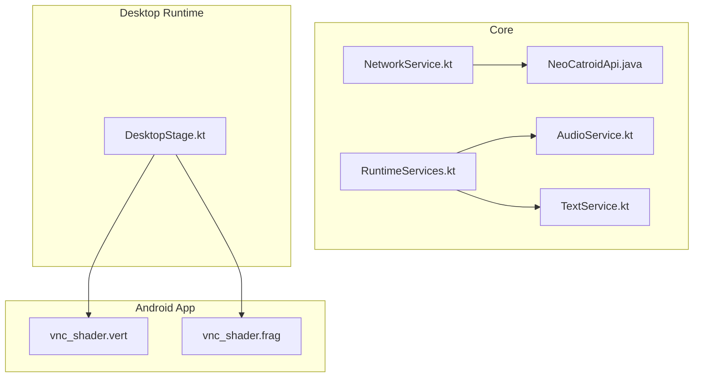
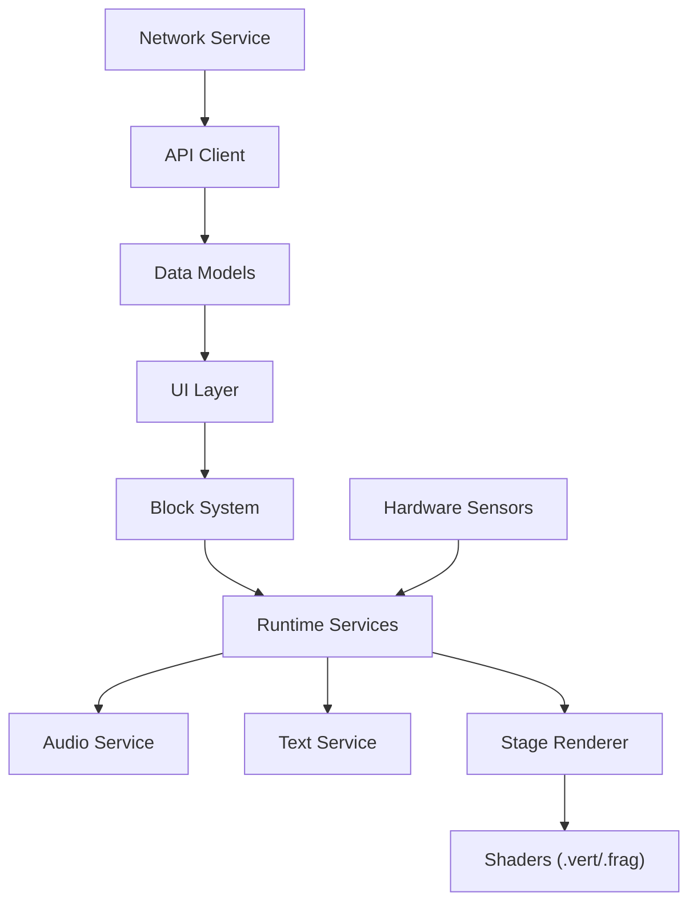
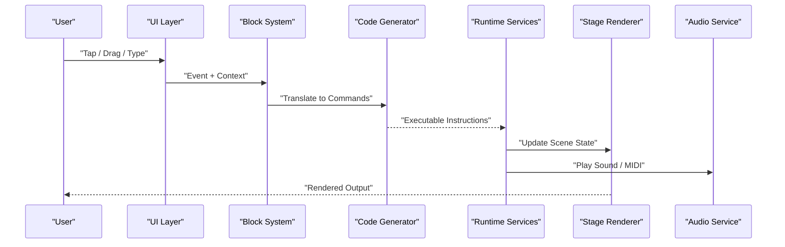
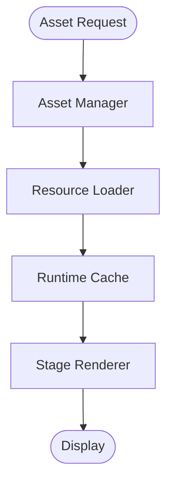
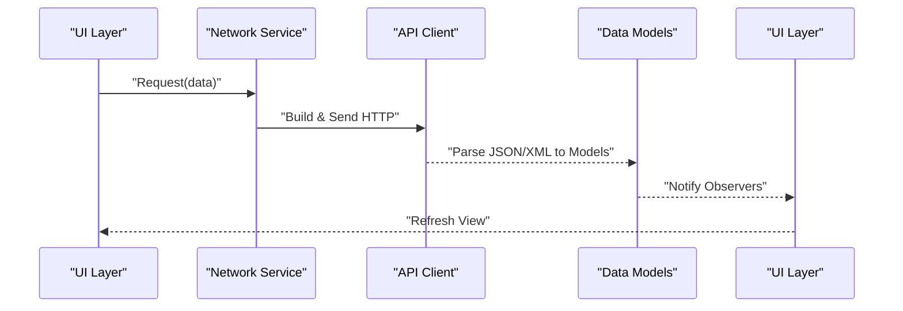
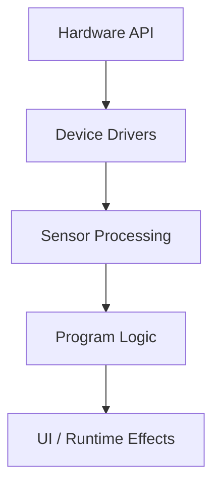
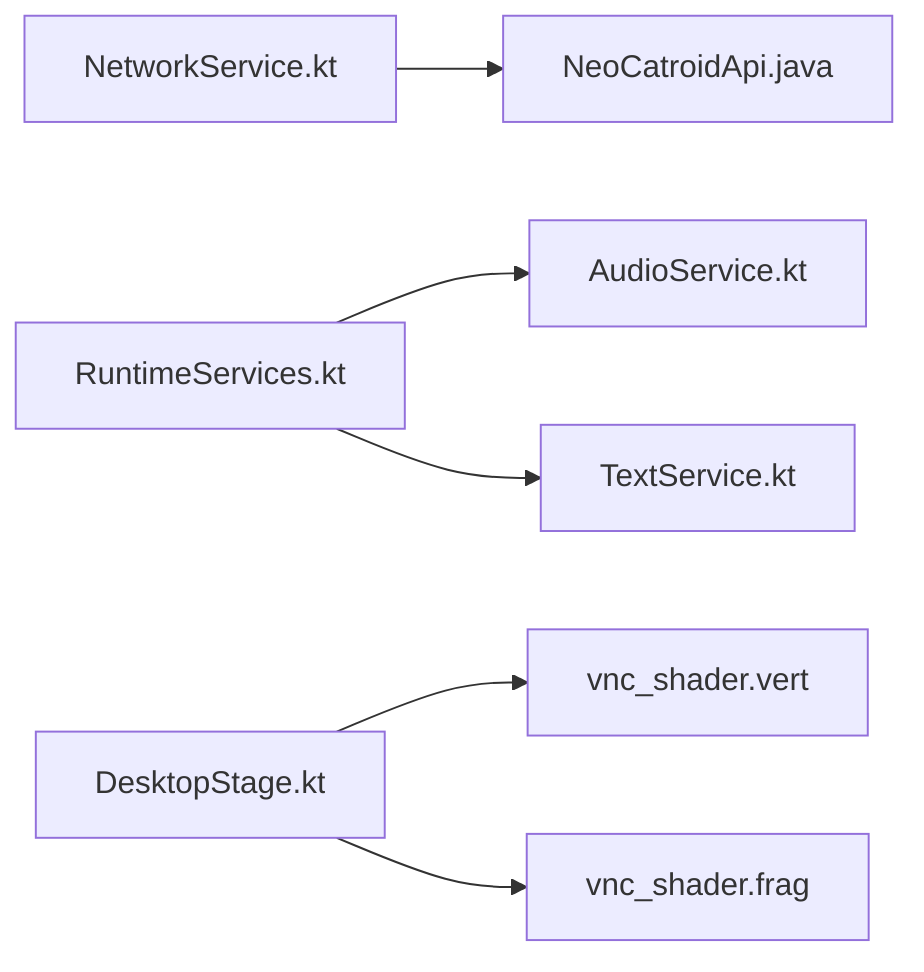

# Data Flow

<cite>
**Referenced Files in This Document**
- [README.md](file://README.md)
- [build.gradle](file://build.gradle)
- [settings.gradle](file://settings.gradle)
- [core/src/main/java/org/catrobat/catroid/network/NetworkService.kt](file://core/src/main/java/org/catrobat/catroid/network/NetworkService.kt)
- [core/src/main/java/org/catrobat/catroid/network/NeoCatroidApi.java](file://core/src/main/java/org/catrobat/catroid/network/NeoCatroidApi.java)
- [core/src/main/java/org/catrobat/catroid/runtime/RuntimeServices.kt](file://core/src/main/java/org/catrobat/catroid/runtime/RuntimeServices.kt)
- [core/src/main/java/org/catrobat/catroid/audio/AudioService.kt](file://core/src/main/java/org/catrobat/catroid/audio/AudioService.kt)
- [core/src/main/java/org/catrobat/catroid/text/TextService.kt](file://core/src/main/java/org/catrobat/catroid/text/TextService.kt)
- [catroid/src/main/assets/shaders/vnc_shader.vert](file://catroid/src/main/assets/shaders/vnc_shader.vert)
- [catroid/src/main/assets/shaders/vnc_shader.frag](file://catroid/src/main/assets/shaders/vnc_shader.frag)
- [desktop-runtime/src/main/java/org/catrobat/catroid/stage/DesktopStage.kt](file://desktop-runtime/src/main/java/org/catrobat/catroid/stage/DesktopStage.kt)
</cite>

## Table of Contents
1. Introduction
2. Project Structure
3. Core Components
4. Architecture Overview
5. Detailed Component Analysis
6. Dependency Analysis
7. Performance Considerations
8. Troubleshooting Guide
9. Conclusion

## Introduction
This document explains the primary data flow patterns in NewCatroid, focusing on:
- User input from UI events through the block system to code generation and runtime execution
- Asset loading from asset management to resource loading and runtime cache/display
- Network communication from network services through API clients to data models and UI updates
- Hardware interaction from hardware APIs through device drivers to sensor processing and program logic

It also provides concrete examples by referencing actual source files and highlights performance considerations and optimization strategies for each pathway.

## Project Structure
NewCatroid is a multi-module Android project with shared core logic, platform-specific modules (Android and desktop), and supporting tooling. The main areas relevant to data flows are:
- core: Shared services and utilities (network, runtime, audio, text)
- catroid: Android app module containing assets, resources, and Android-specific integrations
- desktop-runtime: Desktop runtime implementation for stage and related components
- build configuration at repository root

**Diagram sources**
- [core/src/main/java/org/catrobat/catroid/network/NetworkService.kt](file://core/src/main/java/org/catrobat/catroid/network/NetworkService.kt)
- [core/src/main/java/org/catrobat/catroid/network/NeoCatroidApi.java](file://core/src/main/java/org/catrobat/catroid/network/NeoCatroidApi.java)
- [core/src/main/java/org/catrobat/catroid/runtime/RuntimeServices.kt](file://core/src/main/java/org/catrobat/catroid/runtime/RuntimeServices.kt)
- [core/src/main/java/org/catrobat/catroid/audio/AudioService.kt](file://core/src/main/java/org/catrobat/catroid/audio/AudioService.kt)
- [core/src/main/java/org/catrobat/catroid/text/TextService.kt](file://core/src/main/java/org/catrobat/catroid/text/TextService.kt)
- [catroid/src/main/assets/shaders/vnc_shader.vert](file://catroid/src/main/assets/shaders/vnc_shader.vert)
- [catroid/src/main/assets/shaders/vnc_shader.frag](file://catroid/src/main/assets/shaders/vnc_shader.frag)
- [desktop-runtime/src/main/java/org/catrobat/catroid/stage/DesktopStage.kt](file://desktop-runtime/src/main/java/org/catrobat/catroid/stage/DesktopStage.kt)

**Section sources**
- [README.md](file://README.md)
- [build.gradle](file://build.gradle)
- [settings.gradle](file://settings.gradle)

## Core Components
The following components orchestrate major data flows across the application:
- Network service and API client: encapsulate HTTP calls and response mapping
- Runtime services: coordinate subsystems like audio and text during execution
- Stage rendering: consumes shaders and other assets for display
- Text rasterization: converts text into renderable glyphs

These components are referenced throughout the data flow sections below.

**Section sources**
- [core/src/main/java/org/catrobat/catroid/network/NetworkService.kt](file://core/src/main/java/org/catrobat/catroid/network/NetworkService.kt)
- [core/src/main/java/org/catrobat/catroid/network/NeoCatroidApi.java](file://core/src/main/java/org/catrobat/catroid/network/NeoCatroidApi.java)
- [core/src/main/java/org/catrobat/catroid/runtime/RuntimeServices.kt](file://core/src/main/java/org/catrobat/catroid/runtime/RuntimeServices.kt)
- [core/src/main/java/org/catrobat/catroid/audio/AudioService.kt](file://core/src/main/java/org/catrobat/catroid/audio/AudioService.kt)
- [core/src/main/java/org/catrobat/catroid/text/TextService.kt](file://core/src/main/java/org/catrobat/catroid/text/TextService.kt)

## Architecture Overview
High-level architecture for data flows:
- UI events trigger block actions that update runtime state and eventually produce visual or audio output
- Assets are loaded via Android assets and consumed by the stage renderer
- Network requests go through a centralized service and API client, then update models and UI
- Hardware sensors feed into runtime logic via platform abstractions

[No sources needed since this diagram shows conceptual workflow, not actual code structure]

## Detailed Component Analysis

### User Input Flow: UI Events → Block System → Code Generation → Runtime Execution
Conceptual flow:
- UI captures user interactions (e.g., dragging blocks, pressing buttons)
- Block system interprets these interactions as executable instructions
- Code generator translates blocks into runnable code or internal commands
- Runtime executes commands, updating state and triggering side effects (audio, visuals)

[No sources needed since this diagram shows conceptual workflow, not actual code structure]

Performance considerations:
- Batch UI event handling to reduce reflows
- Defer heavy code generation off the main thread when possible
- Use immutable snapshots of scene state to minimize recomputation
- Coalesce rapid input events (throttling/debouncing)

Optimization strategies:
- Precompute frequently used transformations
- Cache generated code snippets where applicable
- Use object pooling for transient objects created during execution

[No sources needed since this section provides general guidance]

### Asset Loading Flow: Asset Manager → Resource Loader → Runtime Cache → Display
Conceptual flow:
- Application requests an asset (image, shader, font)
- Asset manager locates and loads raw bytes
- Resource loader decodes and prepares GPU-ready resources
- Runtime cache stores decoded resources for reuse
- Stage renderer consumes cached resources for drawing

Concrete example references:
- Shader assets consumed by the stage renderer:
  - [catroid/src/main/assets/shaders/vnc_shader.vert](file://catroid/src/main/assets/shaders/vnc_shader.vert)
  - [catroid/src/main/assets/shaders/vnc_shader.frag](file://catroid/src/main/assets/shaders/vnc_shader.frag)
- Desktop stage integration point:
  - [desktop-runtime/src/main/java/org/catrobat/catroid/stage/DesktopStage.kt](file://desktop-runtime/src/main/java/org/catrobat/catroid/stage/DesktopStage.kt)

**Section sources**
- [catroid/src/main/assets/shaders/vnc_shader.vert](file://catroid/src/main/assets/shaders/vnc_shader.vert)
- [catroid/src/main/assets/shaders/vnc_shader.frag](file://catroid/src/main/assets/shaders/vnc_shader.frag)
- [desktop-runtime/src/main/java/org/catrobat/catroid/stage/DesktopStage.kt](file://desktop-runtime/src/main/java/org/catrobat/catroid/stage/DesktopStage.kt)

Performance considerations:
- Avoid redundant decoding by caching textures and compiled shaders
- Load large assets asynchronously and stream where possible
- Use appropriate image formats and mipmaps for memory efficiency

Optimization strategies:
- Implement LRU cache with size limits
- Preload critical assets during startup
- Reuse GL contexts and compiled programs across frames

[No sources needed since this section provides general guidance]

### Network Communication Flow: Network Service → API Clients → Data Models → UI Updates
Conceptual flow:
- UI triggers a network action (e.g., fetch projects)
- Network service constructs and sends HTTP requests
- API client maps responses to typed data models
- Models propagate changes to UI via observers or reactive streams

Concrete example references:
- Centralized network service:
  - [core/src/main/java/org/catrobat/catroid/network/NetworkService.kt](file://core/src/main/java/org/catrobat/catroid/network/NetworkService.kt)
- API client interface:
  - [core/src/main/java/org/catrobat/catroid/network/NeoCatroidApi.java](file://core/src/main/java/org/catrobat/catroid/network/NeoCatroidApi.java)

**Section sources**
- [core/src/main/java/org/catrobat/catroid/network/NetworkService.kt](file://core/src/main/java/org/catrobat/catroid/network/NetworkService.kt)
- [core/src/main/java/org/catrobat/catroid/network/NeoCatroidApi.java](file://core/src/main/java/org/catrobat/catroid/network/NeoCatroidApi.java)

Performance considerations:
- Use connection pooling and request coalescing
- Apply pagination and lazy loading for large datasets
- Compress payloads and leverage caching headers

Optimization strategies:
- Deduplicate identical requests within a time window
- Prefetch likely-needed resources based on user context
- Handle retries with exponential backoff and circuit breakers

[No sources needed since this section provides general guidance]

### Hardware Interaction Flow: Hardware API → Device Drivers → Sensor Processing → Program Logic
Conceptual flow:
- Platform hardware APIs expose sensors and devices
- Device drivers translate low-level signals into structured events
- Sensor processing filters and aggregates data
- Program logic consumes processed signals to drive behavior

Concrete example references:
- Runtime services coordinating subsystems:
  - [core/src/main/java/org/catrobat/catroid/runtime/RuntimeServices.kt](file://core/src/main/java/org/catrobat/catroid/runtime/RuntimeServices.kt)
- Audio subsystem integration:
  - [core/src/main/java/org/catrobat/catroid/audio/AudioService.kt](file://core/src/main/java/org/catrobat/catroid/audio/AudioService.kt)
- Text processing pipeline:
  - [core/src/main/java/org/catrobat/catroid/text/TextService.kt](file://core/src/main/java/org/catrobat/catroid/text/TextService.kt)

**Section sources**
- [core/src/main/java/org/catrobat/catroid/runtime/RuntimeServices.kt](file://core/src/main/java/org/catrobat/catroid/runtime/RuntimeServices.kt)
- [core/src/main/java/org/catrobat/catroid/audio/AudioService.kt](file://core/src/main/java/org/catrobat/catroid/audio/AudioService.kt)
- [core/src/main/java/org/catrobat/catroid/text/TextService.kt](file://core/src/main/java/org/catrobat/catroid/text/TextService.kt)

Performance considerations:
- Sample sensors at appropriate rates; avoid over-sampling
- Apply smoothing and thresholding to reduce noise
- Offload heavy computations to background threads

Optimization strategies:
- Use event-driven updates instead of polling
- Maintain fixed-size buffers for streaming data
- Throttle UI updates to frame boundaries

[No sources needed since this section provides general guidance]

## Dependency Analysis
Key dependencies among core components:
- Network service depends on API client for endpoint definitions
- Runtime services depend on audio and text services
- Stage renderer depends on shader assets

**Diagram sources**
- [core/src/main/java/org/catrobat/catroid/network/NetworkService.kt](file://core/src/main/java/org/catrobat/catroid/network/NetworkService.kt)
- [core/src/main/java/org/catrobat/catroid/network/NeoCatroidApi.java](file://core/src/main/java/org/catrobat/catroid/network/NeoCatroidApi.java)
- [core/src/main/java/org/catrobat/catroid/runtime/RuntimeServices.kt](file://core/src/main/java/org/catrobat/catroid/runtime/RuntimeServices.kt)
- [core/src/main/java/org/catrobat/catroid/audio/AudioService.kt](file://core/src/main/java/org/catrobat/catroid/audio/AudioService.kt)
- [core/src/main/java/org/catrobat/catroid/text/TextService.kt](file://core/src/main/java/org/catrobat/catroid/text/TextService.kt)
- [desktop-runtime/src/main/java/org/catrobat/catroid/stage/DesktopStage.kt](file://desktop-runtime/src/main/java/org/catrobat/catroid/stage/DesktopStage.kt)
- [catroid/src/main/assets/shaders/vnc_shader.vert](file://catroid/src/main/assets/shaders/vnc_shader.vert)
- [catroid/src/main/assets/shaders/vnc_shader.frag](file://catroid/src/main/assets/shaders/vnc_shader.frag)

**Section sources**
- [core/src/main/java/org/catrobat/catroid/network/NetworkService.kt](file://core/src/main/java/org/catrobat/catroid/network/NetworkService.kt)
- [core/src/main/java/org/catrobat/catroid/network/NeoCatroidApi.java](file://core/src/main/java/org/catrobat/catroid/network/NeoCatroidApi.java)
- [core/src/main/java/org/catrobat/catroid/runtime/RuntimeServices.kt](file://core/src/main/java/org/catrobat/catroid/runtime/RuntimeServices.kt)
- [core/src/main/java/org/catrobat/catroid/audio/AudioService.kt](file://core/src/main/java/org/catrobat/catroid/audio/AudioService.kt)
- [core/src/main/java/org/catrobat/catroid/text/TextService.kt](file://core/src/main/java/org/catrobat/catroid/text/TextService.kt)
- [desktop-runtime/src/main/java/org/catrobat/catroid/stage/DesktopStage.kt](file://desktop-runtime/src/main/java/org/catrobat/catroid/stage/DesktopStage.kt)
- [catroid/src/main/assets/shaders/vnc_shader.vert](file://catroid/src/main/assets/shaders/vnc_shader.vert)
- [catroid/src/main/assets/shaders/vnc_shader.frag](file://catroid/src/main/assets/shaders/vnc_shader.frag)

## Performance Considerations
- UI-to-block-to-runtime path:
  - Minimize allocations in hot paths
  - Use immutable state snapshots to reduce diffing cost
  - Batch updates to avoid excessive redraws
- Asset loading path:
  - Cache decoded textures and compiled shaders
  - Stream large assets and use progressive loading
  - Choose efficient formats (e.g., compressed textures)
- Network path:
  - Enable compression and caching
  - Implement retry/backoff and request deduplication
  - Paginate and lazy-load lists
- Hardware path:
  - Tune sampling rates and apply filtering
  - Use ring buffers and lock-free queues where feasible
  - Align UI updates to frame boundaries

[No sources needed since this section provides general guidance]

## Troubleshooting Guide
Common issues and diagnostics:
- Network failures:
  - Check connectivity and server availability
  - Inspect error codes and implement retry policies
  - Validate API contract mismatches between client and server
- Asset loading errors:
  - Verify asset paths and formats
  - Ensure shaders compile without errors
  - Monitor memory usage and cache eviction
- Runtime anomalies:
  - Log state transitions around block execution
  - Isolate audio/text subsystems for targeted debugging
  - Profile CPU/GPU usage to identify bottlenecks

Concrete example references:
- Network service and API client:
  - [core/src/main/java/org/catrobat/catroid/network/NetworkService.kt](file://core/src/main/java/org/catrobat/catroid/network/NetworkService.kt)
  - [core/src/main/java/org/catrobat/catroid/network/NeoCatroidApi.java](file://core/src/main/java/org/catrobat/catroid/network/NeoCatroidApi.java)
- Stage and shaders:
  - [desktop-runtime/src/main/java/org/catrobat/catroid/stage/DesktopStage.kt](file://desktop-runtime/src/main/java/org/catrobat/catroid/stage/DesktopStage.kt)
  - [catroid/src/main/assets/shaders/vnc_shader.vert](file://catroid/src/main/assets/shaders/vnc_shader.vert)
  - [catroid/src/main/assets/shaders/vnc_shader.frag](file://catroid/src/main/assets/shaders/vnc_shader.frag)

**Section sources**
- [core/src/main/java/org/catrobat/catroid/network/NetworkService.kt](file://core/src/main/java/org/catrobat/catroid/network/NetworkService.kt)
- [core/src/main/java/org/catrobat/catroid/network/NeoCatroidApi.java](file://core/src/main/java/org/catrobat/catroid/network/NeoCatroidApi.java)
- [desktop-runtime/src/main/java/org/catrobat/catroid/stage/DesktopStage.kt](file://desktop-runtime/src/main/java/org/catrobat/catroid/stage/DesktopStage.kt)
- [catroid/src/main/assets/shaders/vnc_shader.vert](file://catroid/src/main/assets/shaders/vnc_shader.vert)
- [catroid/src/main/assets/shaders/vnc_shader.frag](file://catroid/src/main/assets/shaders/vnc_shader.frag)

## Conclusion
NewCatroid’s data flows span UI interactions, asset management, networking, and hardware integration. By centralizing responsibilities (network service, runtime services) and leveraging caches and efficient formats, the system achieves responsive and scalable behavior. Following the performance and troubleshooting recommendations will help maintain stability and responsiveness across diverse devices and scenarios.

[No sources needed since this section summarizes without analyzing specific files]