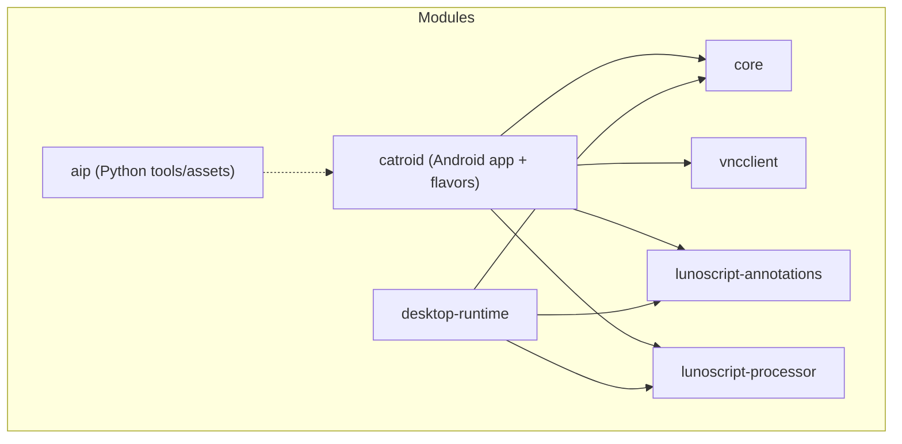
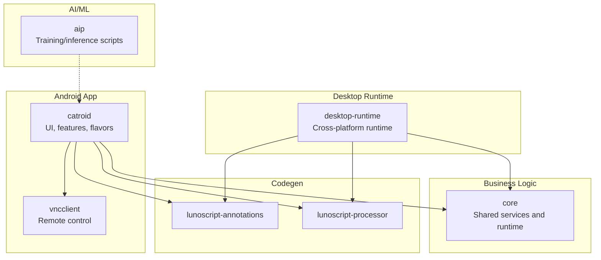
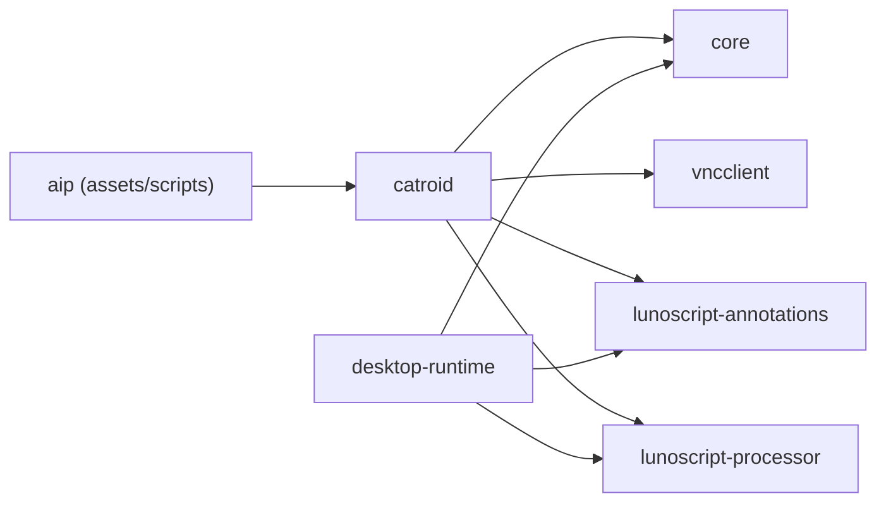

# Module Structure

<cite>
**Referenced Files in This Document**
- [settings.gradle](file://settings.gradle)
- [build.gradle](file://build.gradle)
- [core/build.gradle](file://core/build.gradle)
- [catroid/build.gradle](file://catroid/build.gradle)
- [desktop-runtime/build.gradle](file://desktop-runtime/build.gradle)
- [vncclient/build.gradle](file://vncclient/build.gradle)
- [lunoscript-annotations/build.gradle](file://lunoscript-annotations/build.gradle)
- [lunoscript-processor/build.gradle](file://lunoscript-processor/build.gradle)
- [core/src/main/java/org/catrobat/catroid/runtime/RuntimeServices.kt](file://core/src/main/java/org/catrobat/catroid/runtime/RuntimeServices.kt)
- [core/src/main/java/org/catrobat/catroid/audio/AudioService.kt](file://core/src/main/java/org/catrobat/catroid/audio/AudioService.kt)
- [core/src/main/java/org/catrobat/catroid/network/NetworkService.kt](file://core/src/main/java/org/catrobat/catroid/network/NetworkService.kt)
- [core/src/main/java/org/catrobat/catroid/notification/NotificationService.kt](file://core/src/main/java/org/catrobat/catroid/notification/NotificationService.kt)
- [core/src/main/java/org/catrobat/catroid/text/TextService.kt](file://core/src/main/java/org/catrobat/catroid/text/TextService.kt)
- [desktop-runtime/src/main/java/org/catrobat/catroid/audio/DesktopAudioService.kt](file://desktop-runtime/src/main/java/org/catrobat/catroid/audio/DesktopAudioService.kt)
- [desktop-runtime/src/main/java/org/catrobat/catroid/network/DesktopNetworkService.kt](file://desktop-runtime/src/main/java/org/catrobat/catroid/network/DesktopNetworkService.kt)
- [desktop-runtime/src/main/java/org/catrobat/catroid/notification/DesktopNotificationService.kt](file://desktop-runtime/src/main/java/org/catrobat/catroid/notification/DesktopNotificationService.kt)
- [desktop-runtime/src/main/java/org/catrobat/catroid/text/DesktopTextService.kt](file://desktop-runtime/src/main/java/org/catrobat/catroid/text/DesktopTextService.kt)
- [catroid/src/main/java/org/catrobat/catroid/common/FlavoredConstants.java](file://catroid/src/main/java/org/catrobat/catroid/common/FlavoredConstants.java)
- [catroid/src/apktemplate/java/org/catrobat/catroid/common/FlavoredConstants.java](file://catroid/src/apktemplate/java/org/catrobat/catroid/common/FlavoredConstants.java)
- [catroid/src/danvex/java/org/catrobat/catroid/common/FlavoredConstants.java](file://catroid/src/danvex/java/org/catrobat/catroid/common/FlavoredConstants.java)
- [catroid/src/createAtSchool/java/org/catrobat/catroid/common/FlavoredConstants.java](file://catroid/src/createAtSchool/java/org/catrobat/catroid/common/FlavoredConstants.java)
- [catroid/src/embroideryDesigner/java/org/catrobat/catroid/common/FlavoredConstants.java](file://catroid/src/embroideryDesigner/java/org/catrobat/catroid/common/FlavoredConstants.java)
- [catroid/src/lunaAndCat/java/org/catrobat/catroid/common/FlavoredConstants.java](file://catroid/src/lunaAndCat/java/org/catrobat/catroid/common/FlavoredConstants.java)
- [catroid/src/mindstorms/java/org/catrobat/catroid/common/FlavoredConstants.java](file://catroid/src/mindstorms/java/org/catrobat/catroid/common/FlavoredConstants.java)
- [catroid/src/phiro/java/org/catrobat/catroid/common/FlavoredConstants.java](file://catroid/src/phiro/java/org/catrobat/catroid/common/FlavoredConstants.java)
- [catroid/src/pocketCodeBeta/java/org/catrobat/catroid/common/FlavoredConstants.java](file://catroid/src/pocketCodeBeta/java/org/catrobat/catroid/common/FlavoredConstants.java)
- [catroid/src/runtime/java/org/catrobat/catroid/common/FlavoredConstants.java](file://catroid/src/runtime/java/org/catrobat/catroid/common/FlavoredConstants.java)
- [catroid/src/standalone/java/org/catrobat/catroid/common/FlavoredConstants.java](file://catroid/src/standalone/java/org/catrobat/catroid/common/FlavoredConstants.java)
</cite>

## Table of Contents
1. [Introduction](#introduction)
2. [Project Structure](#project-structure)
3. [Core Components](#core-components)
4. [Architecture Overview](#architecture-overview)
5. [Detailed Component Analysis](#detailed-component-analysis)
6. [Dependency Analysis](#dependency-analysis)
7. [Performance Considerations](#performance-considerations)
8. [Troubleshooting Guide](#troubleshooting-guide)
9. [Conclusion](#conclusion)

## Introduction
This document explains NewCatroid’s multi-module architecture and how it enables code reuse, platform abstraction, and flexible product flavors. It covers the core library (shared business logic), catroid (main Android application with multiple flavors), desktop-runtime (cross-platform desktop implementation), aip (AI/ML components), vncclient (VNC client for remote control), and supporting modules lunoscript-annotations and lunoscript-processor. It also documents dependency relationships, Gradle build configuration, and practical examples of module interactions.

## Project Structure
NewCatroid is organized as a Gradle multi-project with several independent modules:
- core: Shared Kotlin/Java business logic and service interfaces used by both Android and Desktop runtimes.
- catroid: Android application module with many product flavors (e.g., runtime, standalone, danvex, phiro, mindstorms, etc.).
- desktop-runtime: Cross-platform desktop runtime that reuses core and provides platform-specific implementations.
- vncclient: VNC client library for remote control features.
- aip: AI/ML training and inference scripts and assets (Python-based).
- lunoscript-annotations: KSP annotations for LunoScript.
- lunoscript-processor: KSP processor generating code from annotations.

**Diagram sources**
- [settings.gradle](file://settings.gradle)
- [build.gradle](file://build.gradle)
- [core/build.gradle](file://core/build.gradle)
- [catroid/build.gradle](file://catroid/build.gradle)
- [desktop-runtime/build.gradle](file://desktop-runtime/build.gradle)
- [vncclient/build.gradle](file://vncclient/build.gradle)
- [lunoscript-annotations/build.gradle](file://lunoscript-annotations/build.gradle)
- [lunoscript-processor/build.gradle](file://lunoscript-processor/build.gradle)

**Section sources**
- [settings.gradle](file://settings.gradle)
- [build.gradle](file://build.gradle)

## Core Components
The core module defines shared services and abstractions consumed by both Android and Desktop runtimes. Key responsibilities include:
- Runtime orchestration and string localization provider.
- Platform-agnostic audio, network, notification, and text rendering services.
- Utility logging and exception types for project handling.

Examples of core services:
- Runtime orchestration and localization: [RuntimeServices.kt](file://core/src/main/java/org/catrobat/catroid/runtime/RuntimeServices.kt)
- Audio service interface: [AudioService.kt](file://core/src/main/java/org/catrobat/catroid/audio/AudioService.kt)
- Network service interface: [NetworkService.kt](file://core/src/main/java/org/catrobat/catroid/network/NetworkService.kt)
- Notification service interface: [NotificationService.kt](file://core/src/main/java/org/catrobat/catroid/notification/NotificationService.kt)
- Text service interface: [TextService.kt](file://core/src/main/java/org/catrobat/catroid/text/TextService.kt)

These interfaces enable platform abstraction: Android and Desktop provide their own implementations while sharing common business logic.

**Section sources**
- [core/build.gradle](file://core/build.gradle)
- [core/src/main/java/org/catrobat/catroid/runtime/RuntimeServices.kt](file://core/src/main/java/org/catrobat/catroid/runtime/RuntimeServices.kt)
- [core/src/main/java/org/catrobat/catroid/audio/AudioService.kt](file://core/src/main/java/org/catrobat/catroid/audio/AudioService.kt)
- [core/src/main/java/org/catrobat/catroid/network/NetworkService.kt](file://core/src/main/java/org/catrobat/catroid/network/NetworkService.kt)
- [core/src/main/java/org/catrobat/catroid/notification/NotificationService.kt](file://core/src/main/java/org/catrobat/catroid/notification/NotificationService.kt)
- [core/src/main/java/org/catrobat/catroid/text/TextService.kt](file://core/src/main/java/org/catrobat/catroid/text/TextService.kt)

## Architecture Overview
The modular design separates concerns across layers:
- Business logic resides in core.
- UI and platform integration live in catroid (Android) and desktop-runtime (Desktop).
- Optional capabilities are provided via additional modules like vncclient and aip.
- Code generation support is provided by lunoscript-annotations and lunoscript-processor.

**Diagram sources**
- [settings.gradle](file://settings.gradle)
- [build.gradle](file://build.gradle)
- [core/build.gradle](file://core/build.gradle)
- [catroid/build.gradle](file://catroid/build.gradle)
- [desktop-runtime/build.gradle](file://desktop-runtime/build.gradle)
- [vncclient/build.gradle](file://vncclient/build.gradle)
- [lunoscript-annotations/build.gradle](file://lunoscript-annotations/build.gradle)
- [lunoscript-processor/build.gradle](file://lunoscript-processor/build.gradle)

## Detailed Component Analysis

### Core Library (core)
Purpose:
- Provide shared business logic and service interfaces for audio, network, notifications, text, and runtime orchestration.
- Enable platform abstraction so Android and Desktop can implement platform-specific behavior without duplicating business logic.

Key responsibilities:
- Define service contracts and holders to access platform services.
- Centralize cross-cutting concerns such as logging and error types.

Example entry points:
- Runtime orchestration and localization: [RuntimeServices.kt](file://core/src/main/java/org/catrobat/catroid/runtime/RuntimeServices.kt)
- Audio service contract: [AudioService.kt](file://core/src/main/java/org/catrobat/catroid/audio/AudioService.kt)
- Network service contract: [NetworkService.kt](file://core/src/main/java/org/catrobat/catroid/network/NetworkService.kt)
- Notification service contract: [NotificationService.kt](file://core/src/main/java/org/catrobat/catroid/notification/NotificationService.kt)
- Text service contract: [TextService.kt](file://core/src/main/java/org/catrobat/catroid/text/TextService.kt)

Benefits:
- Single source of truth for business rules.
- Easier testing and maintenance due to clear separation between logic and platform details.

**Section sources**
- [core/build.gradle](file://core/build.gradle)
- [core/src/main/java/org/catrobat/catroid/runtime/RuntimeServices.kt](file://core/src/main/java/org/catrobat/catroid/runtime/RuntimeServices.kt)
- [core/src/main/java/org/catrobat/catroid/audio/AudioService.kt](file://core/src/main/java/org/catrobat/catroid/audio/AudioService.kt)
- [core/src/main/java/org/catrobat/catroid/network/NetworkService.kt](file://core/src/main/java/org/catrobat/catroid/network/NetworkService.kt)
- [core/src/main/java/org/catrobat/catroid/notification/NotificationService.kt](file://core/src/main/java/org/catrobat/catroid/notification/NotificationService.kt)
- [core/src/main/java/org/catrobat/catroid/text/TextService.kt](file://core/src/main/java/org/catrobat/catroid/text/TextService.kt)

### Catroid (Android Application with Flavors)
Purpose:
- Main Android application providing UI, editor, stage, and runtime integration.
- Supports multiple product flavors to produce different branded or feature-set variants.

Flavor structure:
- Flavor-specific resources and constants are provided under src/<flavor>/java and res directories.
- Example flavor constant overrides: [FlavoredConstants.java](file://catroid/src/main/java/org/catrobat/catroid/common/FlavoredConstants.java) and per-flavor overrides such as:
  - [apktemplate](file://catroid/src/apktemplate/java/org/catrobat/catroid/common/FlavoredConstants.java)
  - [danvex](file://catroid/src/danvex/java/org/catrobat/catroid/common/FlavoredConstants.java)
  - [createAtSchool](file://catroid/src/createAtSchool/java/org/catrobat/catroid/common/FlavoredConstants.java)
  - [embroideryDesigner](file://catroid/src/embroideryDesigner/java/org/catrobat/catroid/common/FlavoredConstants.java)
  - [lunaAndCat](file://catroid/src/lunaAndCat/java/org/catrobat/catroid/common/FlavoredConstants.java)
  - [mindstorms](file://catroid/src/mindstorms/java/org/catrobat/catroid/common/FlavoredConstants.java)
  - [phiro](file://catroid/src/phiro/java/org/catrobat/catroid/common/FlavoredConstants.java)
  - [pocketCodeBeta](file://catroid/src/pocketCodeBeta/java/org/catrobat/catroid/common/FlavoredConstants.java)
  - [runtime](file://catroid/src/runtime/java/org/catrobat/catroid/common/FlavoredConstants.java)
  - [standalone](file://catroid/src/standalone/java/org/catrobat/catroid/common/FlavoredConstants.java)

Dependencies:
- Uses core for shared logic.
- Integrates vncclient for remote control.
- Consumes lunoscript-annotations and lunoscript-processor for code generation.

Build configuration:
- Product flavors defined in the module’s Gradle script allow building distinct APKs from the same source base.

Practical example:
- Building a specific flavor produces an APK tailored to a target audience or hardware ecosystem (e.g., educational, robotics, or lite runtime).

**Section sources**
- [catroid/build.gradle](file://catroid/build.gradle)
- [catroid/src/main/java/org/catrobat/catroid/common/FlavoredConstants.java](file://catroid/src/main/java/org/catrobat/catroid/common/FlavoredConstants.java)
- [catroid/src/apktemplate/java/org/catrobat/catroid/common/FlavoredConstants.java](file://catroid/src/apktemplate/java/org/catrobat/catroid/common/FlavoredConstants.java)
- [catroid/src/danvex/java/org/catrobat/catroid/common/FlavoredConstants.java](file://catroid/src/danvex/java/org/catrobat/catroid/common/FlavoredConstants.java)
- [catroid/src/createAtSchool/java/org/catrobat/catroid/common/FlavoredConstants.java](file://catroid/src/createAtSchool/java/org/catrobat/catroid/common/FlavoredConstants.java)
- [catroid/src/embroideryDesigner/java/org/catrobat/catroid/common/FlavoredConstants.java](file://catroid/src/embroideryDesigner/java/org/catrobat/catroid/common/FlavoredConstants.java)
- [catroid/src/lunaAndCat/java/org/catrobat/catroid/common/FlavoredConstants.java](file://catroid/src/lunaAndCat/java/org/catrobat/catroid/common/FlavoredConstants.java)
- [catroid/src/mindstorms/java/org/catrobat/catroid/common/FlavoredConstants.java](file://catroid/src/mindstorms/java/org/catrobat/catroid/common/FlavoredConstants.java)
- [catroid/src/phiro/java/org/catrobat/catroid/common/FlavoredConstants.java](file://catroid/src/phiro/java/org/catrobat/catroid/common/FlavoredConstants.java)
- [catroid/src/pocketCodeBeta/java/org/catrobat/catroid/common/FlavoredConstants.java](file://catroid/src/pocketCodeBeta/java/org/catrobat/catroid/common/FlavoredConstants.java)
- [catroid/src/runtime/java/org/catrobat/catroid/common/FlavoredConstants.java](file://catroid/src/runtime/java/org/catrobat/catroid/common/FlavoredConstants.java)
- [catroid/src/standalone/java/org/catrobat/catroid/common/FlavoredConstants.java](file://catroid/src/standalone/java/org/catrobat/catroid/common/FlavoredConstants.java)

### Desktop Runtime (desktop-runtime)
Purpose:
- Provide a cross-platform desktop implementation of the runtime using core services.
- Replace Android-specific services with desktop equivalents.

Platform-specific implementations:
- Audio: [DesktopAudioService.kt](file://desktop-runtime/src/main/java/org/catrobat/catroid/audio/DesktopAudioService.kt)
- Network: [DesktopNetworkService.kt](file://desktop-runtime/src/main/java/org/catrobat/catroid/network/DesktopNetworkService.kt)
- Notifications: [DesktopNotificationService.kt](file://desktop-runtime/src/main/java/org/catrobat/catroid/notification/DesktopNotificationService.kt)
- Text: [DesktopTextService.kt](file://desktop-runtime/src/main/java/org/catrobat/catroid/text/DesktopTextService.kt)

Benefits:
- Enables running projects on desktop for faster iteration and debugging.
- Keeps business logic in core while isolating platform differences.

**Section sources**
- [desktop-runtime/build.gradle](file://desktop-runtime/build.gradle)
- [desktop-runtime/src/main/java/org/catrobat/catroid/audio/DesktopAudioService.kt](file://desktop-runtime/src/main/java/org/catrobat/catroid/audio/DesktopAudioService.kt)
- [desktop-runtime/src/main/java/org/catrobat/catroid/network/DesktopNetworkService.kt](file://desktop-runtime/src/main/java/org/catrobat/catroid/network/DesktopNetworkService.kt)
- [desktop-runtime/src/main/java/org/catrobat/catroid/notification/DesktopNotificationService.kt](file://desktop-runtime/src/main/java/org/catrobat/catroid/notification/DesktopNotificationService.kt)
- [desktop-runtime/src/main/java/org/catrobat/catroid/text/DesktopTextService.kt](file://desktop-runtime/src/main/java/org/catrobat/catroid/text/DesktopTextService.kt)

### VNC Client (vncclient)
Purpose:
- Provide VNC client functionality for remote control scenarios within the Android app.

Integration:
- Used by catroid to enable remote control features.

**Section sources**
- [vncclient/build.gradle](file://vncclient/build.gradle)

### AI/ML Components (aip)
Purpose:
- Python-based scripts and assets for model training, tokenization, and suggestion pipelines.
- Provides model metadata and vocabulary files used by the runtime.

Integration:
- Assets referenced by catroid (e.g., model metadata and vocab files).
- Training and inference workflows are separate from the Android build but feed into the app’s AI features.

**Section sources**
- [catroid/src/main/assets/model_metadata.json](file://catroid/src/main/assets/model_metadata.json)
- [catroid/src/main/assets/vocab.json](file://catroid/src/main/assets/vocab.json)

### Supporting Modules: lunoscript-annotations and lunoscript-processor
Purpose:
- lunoscript-annotations: Declares KSP annotations used by LunoScript.
- lunoscript-processor: Implements the KSP processor to generate code based on annotations.

Usage:
- Both catroid and desktop-runtime consume these modules to enable compile-time code generation for scripting features.

**Section sources**
- [lunoscript-annotations/build.gradle](file://lunoscript-annotations/build.gradle)
- [lunoscript-processor/build.gradle](file://lunoscript-processor/build.gradle)

## Dependency Analysis
High-level dependencies:
- catroid depends on core, vncclient, lunoscript-annotations, and lunoscript-processor.
- desktop-runtime depends on core, lunoscript-annotations, and lunoscript-processor.
- aip is not a Gradle dependency but contributes assets consumed by catroid.

**Diagram sources**
- [settings.gradle](file://settings.gradle)
- [build.gradle](file://build.gradle)
- [core/build.gradle](file://core/build.gradle)
- [catroid/build.gradle](file://catroid/build.gradle)
- [desktop-runtime/build.gradle](file://desktop-runtime/build.gradle)
- [vncclient/build.gradle](file://vncclient/build.gradle)
- [lunoscript-annotations/build.gradle](file://lunoscript-annotations/build.gradle)
- [lunoscript-processor/build.gradle](file://lunoscript-processor/build.gradle)

**Section sources**
- [settings.gradle](file://settings.gradle)
- [build.gradle](file://build.gradle)
- [core/build.gradle](file://core/build.gradle)
- [catroid/build.gradle](file://catroid/build.gradle)
- [desktop-runtime/build.gradle](file://desktop-runtime/build.gradle)
- [vncclient/build.gradle](file://vncclient/build.gradle)
- [lunoscript-annotations/build.gradle](file://lunoscript-annotations/build.gradle)
- [lunoscript-processor/build.gradle](file://lunoscript-processor/build.gradle)

## Performance Considerations
- Keep core lean: Avoid heavy platform-specific logic in core to maintain fast builds and small binaries.
- Use interfaces and lazy initialization for services to reduce startup overhead.
- Prefer incremental compilation by minimizing cross-module changes.
- For AI features, load models lazily and cache them to avoid repeated disk I/O.
- For VNC, consider connection pooling and efficient frame decoding strategies.

[No sources needed since this section provides general guidance]

## Troubleshooting Guide
Common issues and checks:
- Missing service implementations: Ensure each platform (Android, Desktop) provides concrete implementations for core services (audio, network, notifications, text).
- Flavor conflicts: Verify that flavor-specific constants override expected values and do not conflict with main sources.
- Code generation failures: Confirm that lunoscript-annotations and lunoscript-processor are correctly configured and available at compile time.
- Asset availability: Validate that AI assets (model metadata, vocab) are packaged into the correct variant.

Where to look:
- Service interfaces and holders: [RuntimeServices.kt](file://core/src/main/java/org/catrobat/catroid/runtime/RuntimeServices.kt), [AudioService.kt](file://core/src/main/java/org/catrobat/catroid/audio/AudioService.kt), [NetworkService.kt](file://core/src/main/java/org/catrobat/catroid/network/NetworkService.kt), [NotificationService.kt](file://core/src/main/java/org/catrobat/catroid/notification/NotificationService.kt), [TextService.kt](file://core/src/main/java/org/catrobat/catroid/text/TextService.kt)
- Desktop implementations: [DesktopAudioService.kt](file://desktop-runtime/src/main/java/org/catrobat/catroid/audio/DesktopAudioService.kt), [DesktopNetworkService.kt](file://desktop-runtime/src/main/java/org/catrobat/catroid/network/DesktopNetworkService.kt), [DesktopNotificationService.kt](file://desktop-runtime/src/main/java/org/catrobat/catroid/notification/DesktopNotificationService.kt), [DesktopTextService.kt](file://desktop-runtime/src/main/java/org/catrobat/catroid/text/DesktopTextService.kt)
- Flavor constants: [FlavoredConstants.java](file://catroid/src/main/java/org/catrobat/catroid/common/FlavoredConstants.java) and per-flavor overrides listed above.

**Section sources**
- [core/src/main/java/org/catrobat/catroid/runtime/RuntimeServices.kt](file://core/src/main/java/org/catrobat/catroid/runtime/RuntimeServices.kt)
- [core/src/main/java/org/catrobat/catroid/audio/AudioService.kt](file://core/src/main/java/org/catrobat/catroid/audio/AudioService.kt)
- [core/src/main/java/org/catrobat/catroid/network/NetworkService.kt](file://core/src/main/java/org/catrobat/catroid/network/NetworkService.kt)
- [core/src/main/java/org/catrobat/catroid/notification/NotificationService.kt](file://core/src/main/java/org/catrobat/catroid/notification/NotificationService.kt)
- [core/src/main/java/org/catrobat/catroid/text/TextService.kt](file://core/src/main/java/org/catrobat/catroid/text/TextService.kt)
- [desktop-runtime/src/main/java/org/catrobat/catroid/audio/DesktopAudioService.kt](file://desktop-runtime/src/main/java/org/catrobat/catroid/audio/DesktopAudioService.kt)
- [desktop-runtime/src/main/java/org/catrobat/catroid/network/DesktopNetworkService.kt](file://desktop-runtime/src/main/java/org/catrobat/catroid/network/DesktopNetworkService.kt)
- [desktop-runtime/src/main/java/org/catrobat/catroid/notification/DesktopNotificationService.kt](file://desktop-runtime/src/main/java/org/catrobat/catroid/notification/DesktopNotificationService.kt)
- [desktop-runtime/src/main/java/org/catrobat/catroid/text/DesktopTextService.kt](file://desktop-runtime/src/main/java/org/catrobat/catroid/text/DesktopTextService.kt)
- [catroid/src/main/java/org/catrobat/catroid/common/FlavoredConstants.java](file://catroid/src/main/java/org/catrobat/catroid/common/FlavoredConstants.java)

## Conclusion
NewCatroid’s modular architecture cleanly separates shared business logic from platform-specific integrations. The core module centralizes critical services, enabling both Android and Desktop runtimes to share code while implementing platform details independently. The catroid module leverages product flavors to deliver diverse app variants, while optional modules like vncclient and aip extend capabilities without bloating the core. Supporting modules lunoscript-annotations and lunoscript-processor enable powerful compile-time code generation. Together, these design choices improve maintainability, testability, and performance across platforms.