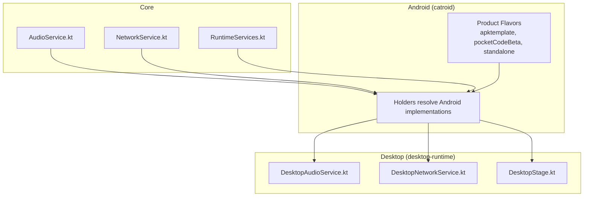
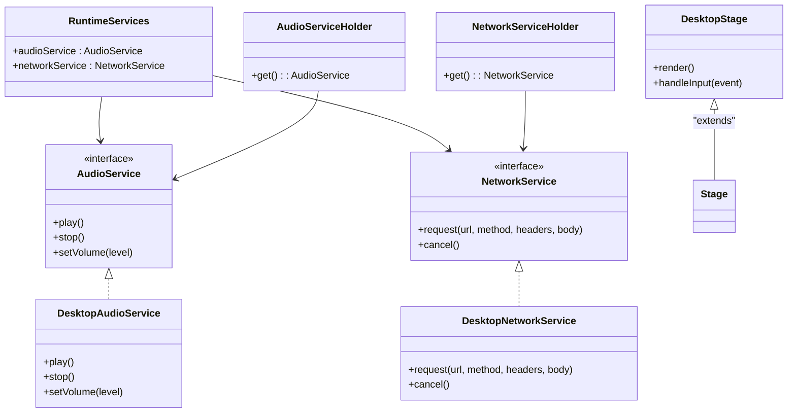
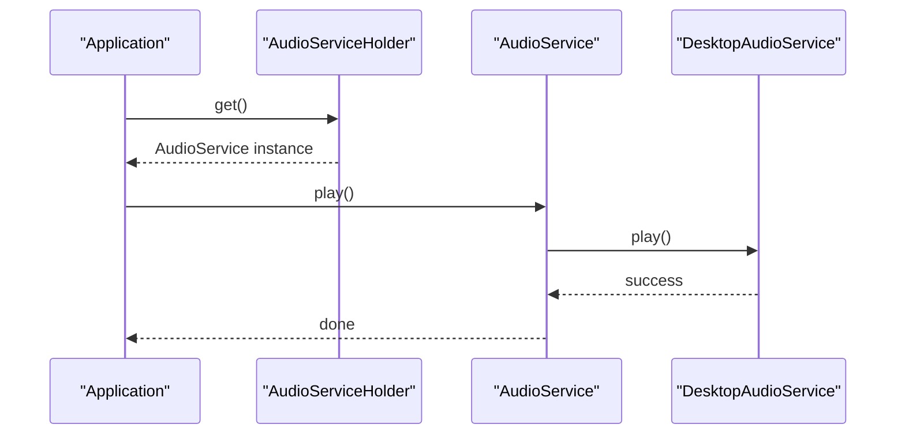
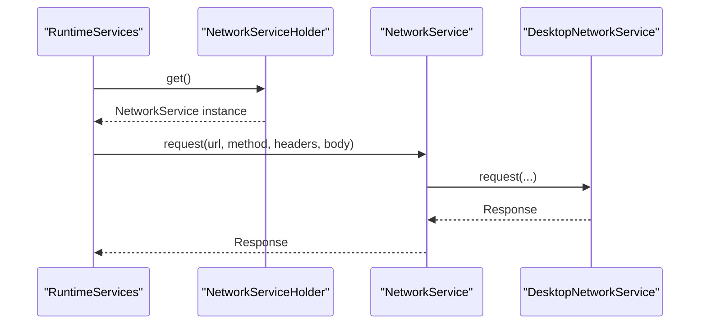
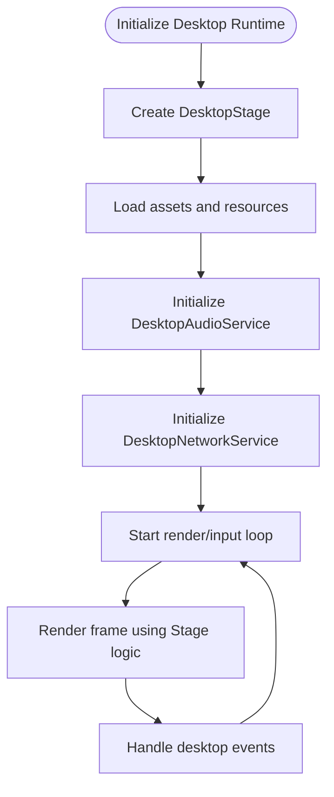
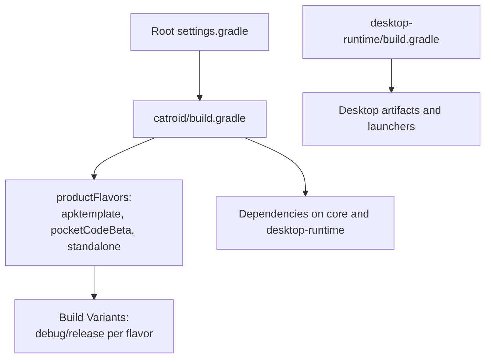
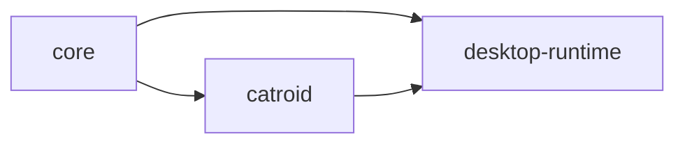

# Platform-Specific Implementations

<cite>
**Referenced Files in This Document**
- [build.gradle](file://catroid/build.gradle)
- [settings.gradle](file://settings.gradle)
- [AudioService.kt](file://core/src/main/java/org/catrobat/catroid/audio/AudioService.kt)
- [AudioServiceHolder.kt](file://core/src/main/java/org/catrobat/catroid/audio/AudioServiceHolder.kt)
- [NetworkService.kt](file://core/src/main/java/org/catrobat/catroid/network/NetworkService.kt)
- [NetworkServiceHolder.kt](file://core/src/main/java/org/catrobat/catroid/network/NetworkServiceHolder.kt)
- [RuntimeServices.kt](file://core/src/main/java/org/catrobat/catroid/runtime/RuntimeServices.kt)
- [RuntimeServicesHolder.kt](file://core/src/main/java/org/catrobat/catroid/runtime/RuntimeServicesHolder.kt)
- [DesktopAudioService.kt](file://desktop-runtime/src/main/java/org/catrobat/catroid/audio/DesktopAudioService.kt)
- [DesktopNetworkService.kt](file://desktop-runtime/src/main/java/org/catrobat/catroid/network/DesktopNetworkService.kt)
- [DesktopStage.kt](file://desktop-runtime/src/main/java/org/catrobat/catroid/stage/DesktopStage.kt)
- [FlavoredConstants.java](file://catroid/src/apktemplate/java/org/catrobat/catroid/common/FlavoredConstants.java)
</cite>

## Table of Contents
1. [Introduction](#introduction)
2. [Project Structure](#project-structure)
3. [Core Components](#core-components)
4. [Architecture Overview](#architecture-overview)
5. [Detailed Component Analysis](#detailed-component-analysis)
6. [Dependency Analysis](#dependency-analysis)
7. [Performance Considerations](#performance-considerations)
8. [Troubleshooting Guide](#troubleshooting-guide)
9. [Conclusion](#conclusion)
10. [Appendices](#appendices)

## Introduction
This document explains how NewCatroid abstracts platform differences through interface-based design, enabling shared business logic in the core module while providing platform-specific implementations for Android and desktop environments. It focuses on the strategy pattern usage where:
- DesktopStage extends Stage functionality for desktop rendering and input handling
- DesktopAudioService implements AudioService for desktop audio playback
- DesktopNetworkService provides desktop networking capabilities via NetworkService

It also documents the build configuration that enables multi-flavor builds for different Android variants and desktop deployment, and provides practical examples for adding support for new platforms while maintaining code reuse.

## Project Structure
NewCatroid is organized into modules that separate platform-agnostic logic from platform-specific implementations:
- core: Defines interfaces and shared runtime services used across platforms
- catroid: Android application with multiple product flavors (e.g., apktemplate, pocketCodeBeta, standalone)
- desktop-runtime: Desktop-specific implementations and packaging utilities

**Diagram sources**
- [AudioService.kt](file://core/src/main/java/org/catrobat/catroid/audio/AudioService.kt)
- [NetworkService.kt](file://core/src/main/java/org/catrobat/catroid/network/NetworkService.kt)
- [RuntimeServices.kt](file://core/src/main/java/org/catrobat/catroid/runtime/RuntimeServices.kt)
- [DesktopAudioService.kt](file://desktop-runtime/src/main/java/org/catrobat/catroid/audio/DesktopAudioService.kt)
- [DesktopNetworkService.kt](file://desktop-runtime/src/main/java/org/catrobat/catroid/network/DesktopNetworkService.kt)
- [DesktopStage.kt](file://desktop-runtime/src/main/java/org/catrobat/catroid/stage/DesktopStage.kt)
- [build.gradle](file://catroid/build.gradle)

**Section sources**
- [build.gradle](file://catroid/build.gradle)
- [settings.gradle](file://settings.gradle)

## Core Components
The core module defines platform-agnostic interfaces and holders that decouple business logic from platform specifics:
- AudioService: Interface for audio operations used by the stage and runtime
- NetworkService: Interface for network requests and responses
- RuntimeServices: Aggregates platform services exposed to the runtime
- Holders: Resolve concrete implementations at runtime based on the active platform

These components enable the same business logic to run on Android and desktop without conditional branching in core code.

**Section sources**
- [AudioService.kt](file://core/src/main/java/org/catrobat/catroid/audio/AudioService.kt)
- [AudioServiceHolder.kt](file://core/src/main/java/org/catrobat/catroid/audio/AudioServiceHolder.kt)
- [NetworkService.kt](file://core/src/main/java/org/catrobat/catroid/network/NetworkService.kt)
- [NetworkServiceHolder.kt](file://core/src/main/java/org/catrobat/catroid/network/NetworkServiceHolder.kt)
- [RuntimeServices.kt](file://core/src/main/java/org/catrobat/catroid/runtime/RuntimeServices.kt)
- [RuntimeServicesHolder.kt](file://core/src/main/java/org/catrobat/catroid/runtime/RuntimeServicesHolder.kt)

## Architecture Overview
NewCatroid uses an interface-based architecture combined with a strategy pattern to isolate platform differences:
- Interfaces are defined in core
- Android-specific implementations are provided within the Android app module
- Desktop-specific implementations are provided in desktop-runtime
- Holders select the correct implementation at startup depending on the runtime environment

**Diagram sources**
- [AudioService.kt](file://core/src/main/java/org/catrobat/catroid/audio/AudioService.kt)
- [NetworkService.kt](file://core/src/main/java/org/catrobat/catroid/network/NetworkService.kt)
- [RuntimeServices.kt](file://core/src/main/java/org/catrobat/catroid/runtime/RuntimeServices.kt)
- [AudioServiceHolder.kt](file://core/src/main/java/org/catrobat/catroid/audio/AudioServiceHolder.kt)
- [NetworkServiceHolder.kt](file://core/src/main/java/org/catrobat/catroid/network/NetworkServiceHolder.kt)
- [DesktopAudioService.kt](file://desktop-runtime/src/main/java/org/catrobat/catroid/audio/DesktopAudioService.kt)
- [DesktopNetworkService.kt](file://desktop-runtime/src/main/java/org/catrobat/catroid/network/DesktopNetworkService.kt)
- [DesktopStage.kt](file://desktop-runtime/src/main/java/org/catrobat/catroid/stage/DesktopStage.kt)

## Detailed Component Analysis

### Strategy Pattern: Audio Service
The audio subsystem demonstrates the strategy pattern:
- Core defines AudioService as an abstraction
- DesktopAudioService provides a desktop implementation
- Holders resolve the appropriate implementation at runtime

**Diagram sources**
- [AudioService.kt](file://core/src/main/java/org/catrobat/catroid/audio/AudioService.kt)
- [AudioServiceHolder.kt](file://core/src/main/java/org/catrobat/catroid/audio/AudioServiceHolder.kt)
- [DesktopAudioService.kt](file://desktop-runtime/src/main/java/org/catrobat/catroid/audio/DesktopAudioService.kt)

**Section sources**
- [AudioService.kt](file://core/src/main/java/org/catrobat/catroid/audio/AudioService.kt)
- [AudioServiceHolder.kt](file://core/src/main/java/org/catrobat/catroid/audio/AudioServiceHolder.kt)
- [DesktopAudioService.kt](file://desktop-runtime/src/main/java/org/catrobat/catroid/audio/DesktopAudioService.kt)

### Strategy Pattern: Network Service
Networking is abstracted similarly:
- Core defines NetworkService
- DesktopNetworkService implements HTTP calls suitable for desktop
- Holders provide the selected implementation

**Diagram sources**
- [NetworkService.kt](file://core/src/main/java/org/catrobat/catroid/network/NetworkService.kt)
- [NetworkServiceHolder.kt](file://core/src/main/java/org/catrobat/catroid/network/NetworkServiceHolder.kt)
- [DesktopNetworkService.kt](file://desktop-runtime/src/main/java/org/catrobat/catroid/network/DesktopNetworkService.kt)
- [RuntimeServices.kt](file://core/src/main/java/org/catrobat/catroid/runtime/RuntimeServices.kt)

**Section sources**
- [NetworkService.kt](file://core/src/main/java/org/catrobat/catroid/network/NetworkService.kt)
- [NetworkServiceHolder.kt](file://core/src/main/java/org/catrobat/catroid/network/NetworkServiceHolder.kt)
- [DesktopNetworkService.kt](file://desktop-runtime/src/main/java/org/catrobat/catroid/network/DesktopNetworkService.kt)
- [RuntimeServices.kt](file://core/src/main/java/org/catrobat/catroid/runtime/RuntimeServices.kt)

### Desktop Stage Extension
DesktopStage extends Stage to adapt rendering and input handling for desktop:
- Reuses core stage logic
- Provides desktop-specific windowing and event loop integration

**Diagram sources**
- [DesktopStage.kt](file://desktop-runtime/src/main/java/org/catrobat/catroid/stage/DesktopStage.kt)
- [DesktopAudioService.kt](file://desktop-runtime/src/main/java/org/catrobat/catroid/audio/DesktopAudioService.kt)
- [DesktopNetworkService.kt](file://desktop-runtime/src/main/java/org/catrobat/catroid/network/DesktopNetworkService.kt)

**Section sources**
- [DesktopStage.kt](file://desktop-runtime/src/main/java/org/catrobat/catroid/stage/DesktopStage.kt)

### Build Configuration: Multi-Flavor Android and Desktop
Multi-flavor builds are configured in the Android module’s Gradle script, enabling distinct variants such as apktemplate, pocketCodeBeta, and standalone. Each flavor can override resources and constants (e.g., FlavoredConstants) while sharing common code. The desktop-runtime module provides desktop-specific implementations and packaging scripts.

**Diagram sources**
- [build.gradle](file://catroid/build.gradle)
- [settings.gradle](file://settings.gradle)

**Section sources**
- [build.gradle](file://catroid/build.gradle)
- [settings.gradle](file://settings.gradle)
- [FlavoredConstants.java](file://catroid/src/apktemplate/java/org/catrobat/catroid/common/FlavoredConstants.java)

## Dependency Analysis
The dependency graph shows clear separation between core abstractions and platform implementations:
- core depends only on language/framework primitives
- catroid depends on core and optionally on desktop-runtime for testing or shared utilities
- desktop-runtime depends on core and provides concrete strategies

**Diagram sources**
- [build.gradle](file://catroid/build.gradle)
- [settings.gradle](file://settings.gradle)

**Section sources**
- [build.gradle](file://catroid/build.gradle)
- [settings.gradle](file://settings.gradle)

## Performance Considerations
- Prefer lazy initialization in holders to avoid unnecessary setup costs on platforms that do not use certain features
- Cache frequently accessed resources (textures, sounds) within platform implementations to reduce overhead
- Use connection pooling and timeouts in DesktopNetworkService to handle desktop network variability
- Avoid heavy work on the main thread; offload I/O and decoding to background threads in both Android and desktop implementations

[No sources needed since this section provides general guidance]

## Troubleshooting Guide
Common issues and resolutions:
- Missing implementation resolution: Ensure holders return the correct platform-specific service during initialization
- Resource loading failures: Verify assets paths differ between Android and desktop and are correctly resolved in each implementation
- Networking errors: Validate proxy and TLS settings in DesktopNetworkService when running behind corporate firewalls
- Build variant confusion: Confirm the active flavor and build type in your IDE or CLI to ensure the expected resources and constants are included

**Section sources**
- [AudioServiceHolder.kt](file://core/src/main/java/org/catrobat/catroid/audio/AudioServiceHolder.kt)
- [NetworkServiceHolder.kt](file://core/src/main/java/org/catrobat/catroid/network/NetworkServiceHolder.kt)
- [FlavoredConstants.java](file://catroid/src/apktemplate/java/org/catrobat/catroid/common/FlavoredConstants.java)

## Conclusion
NewCatroid’s platform abstraction relies on well-defined interfaces in core and concrete implementations in platform modules. The strategy pattern cleanly separates concerns, allowing shared business logic to remain unchanged while adapting to Android and desktop environments. Gradle multi-flavor configuration supports diverse Android variants, and desktop-runtime provides a cohesive desktop experience. Following the patterns outlined here makes it straightforward to add new platforms and feature flags while preserving code reuse and testability.

[No sources needed since this section summarizes without analyzing specific files]

## Appendices

### How to Add Support for a New Platform
- Define any new platform-specific interfaces in core if needed
- Implement the interface in a new platform module (e.g., ios-runtime)
- Provide a holder that resolves the new implementation for the target platform
- Update build configuration to include the new module and set up resource overrides
- Test the new implementation alongside existing Android and desktop builds

[No sources needed since this section provides general guidance]