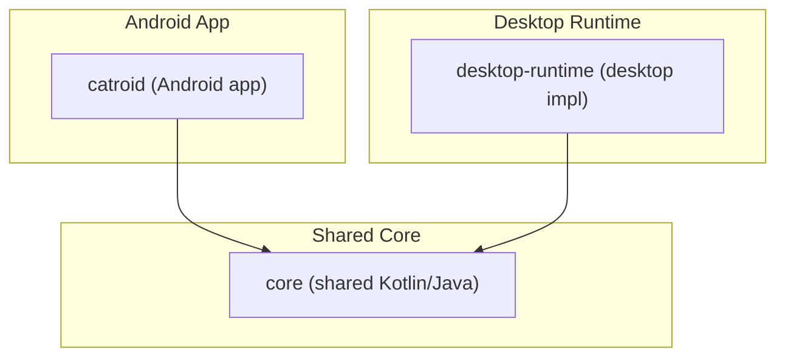
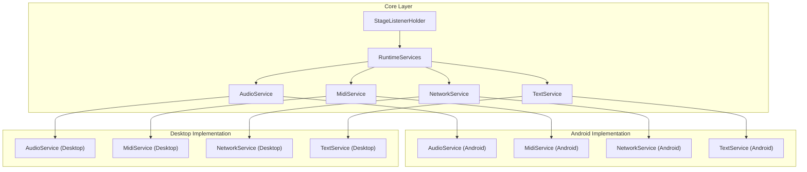
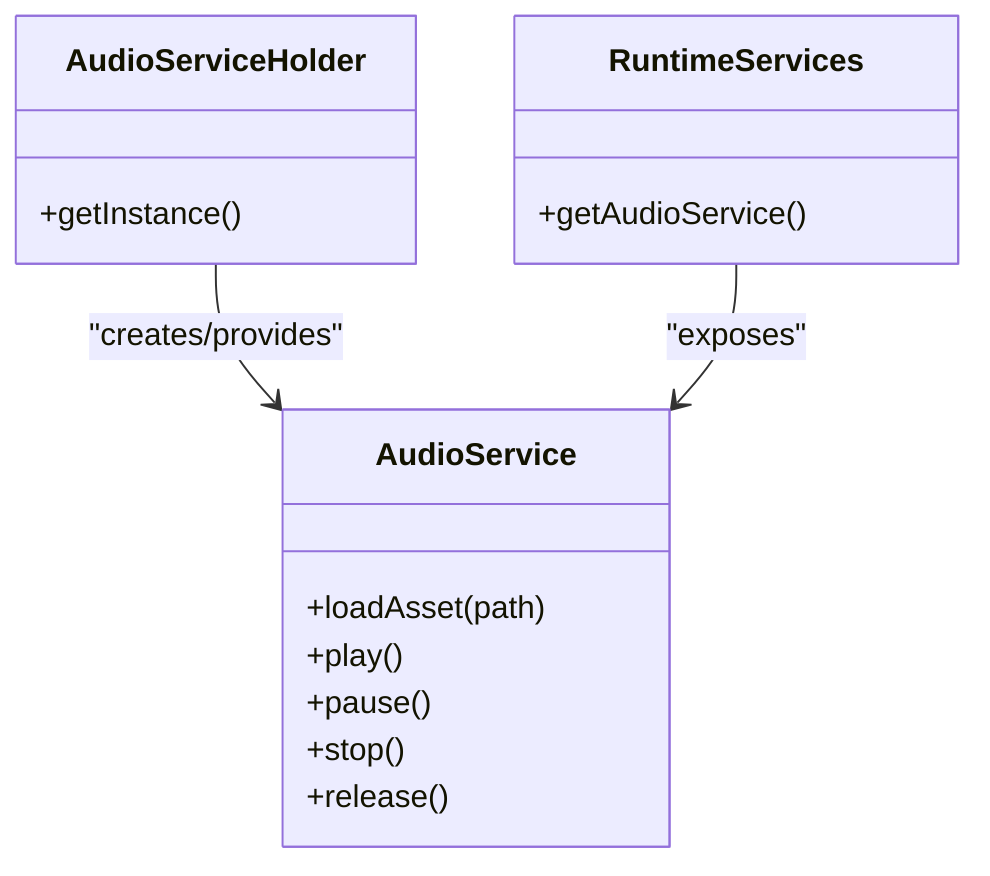
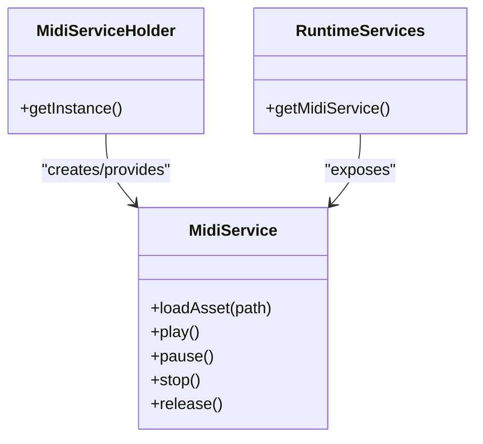
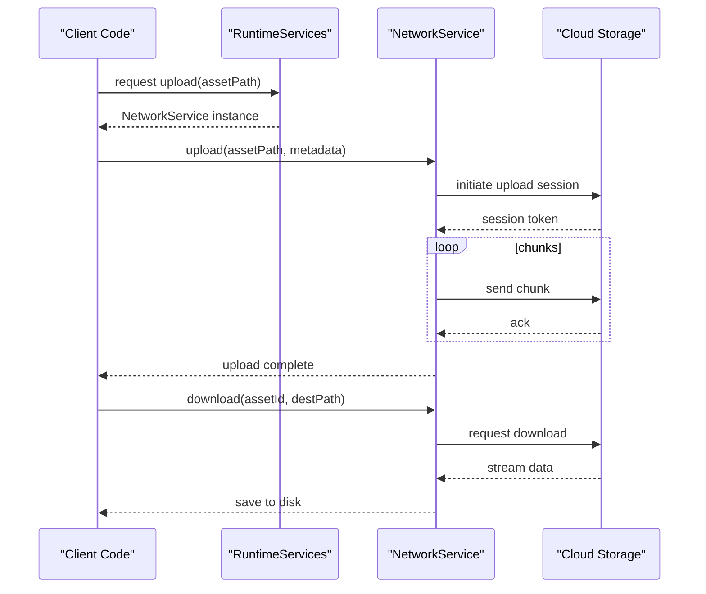
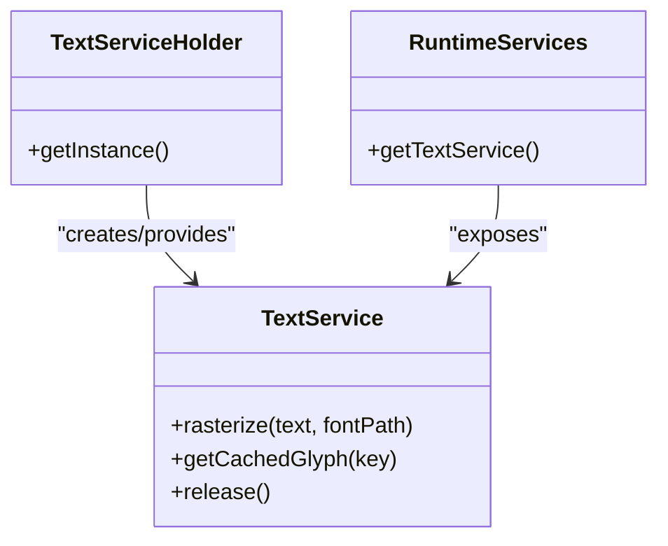
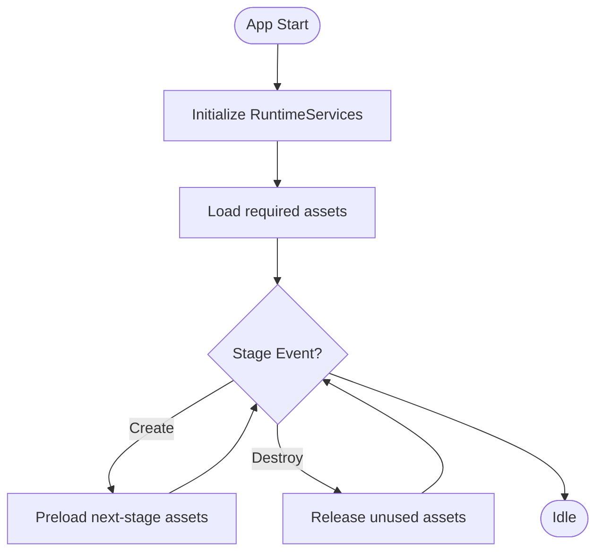
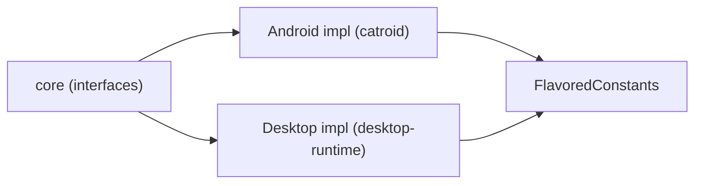

# Asset Management System

<cite>
**Referenced Files in This Document**
- [README.md](file://README.md)
- [build.gradle](file://build.gradle)
- [settings.gradle](file://settings.gradle)
- [gradle.properties](file://gradle.properties)
- [catroid/src/main/java/org/catrobat/catroid/common/FlavoredConstants.java](file://catroid/src/main/java/org/catrobat/catroid/common/FlavoredConstants.java)
- [core/src/main/java/org/catrobat/catroid/audio/AudioService.kt](file://core/src/main/java/org/catrobat/catroid/audio/AudioService.kt)
- [core/src/main/java/org/catrobat/catroid/audio/AudioServiceHolder.kt](file://core/src/main/java/org/catrobat/catroid/audio/AudioServiceHolder.kt)
- [core/src/main/java/org/catrobat/catroid/audio/MidiService.kt](file://core/src/main/java/org/catrobat/catroid/audio/MidiService.kt)
- [core/src/main/java/org/catrobat/catroid/audio/MidiServiceHolder.kt](file://core/src/main/java/org/catrobat/catroid/audio/MidiServiceHolder.kt)
- [core/src/main/java/org/catrobat/catroid/network/NetworkService.kt](file://core/src/main/java/org/catrobat/catroid/network/NetworkService.kt)
- [core/src/main/java/org/catrobat/catroid/network/NetworkServiceHolder.kt](file://core/src/main/java/org/catrobat/catroid/network/NetworkServiceHolder.kt)
- [core/src/main/java/org/catrobat/catroid/runtime/RuntimeServices.kt](file://core/src/main/java/org/catrobat/catroid/runtime/RuntimeServices.kt)
- [core/src/main/java/org/catrobat/catroid/runtime/RuntimeServicesHolder.kt](file://core/src/main/java/org/catrobat/catroid/runtime/RuntimeServicesHolder.kt)
- [core/src/main/java/org/catrobat/catroid/text/TextService.kt](file://core/src/main/java/org/catrobat/catroid/text/TextService.kt)
- [core/src/main/java/org/catrobat/catroid/text/TextServiceHolder.kt](file://core/src/main/java/org/catrobat/catroid/text/TextServiceHolder.kt)
- [core/src/main/java/org/catrobat/catroid/stage/StageListenerHolder.kt](file://core/src/main/java/org/catrobat/catroid/stage/StageListenerHolder.kt)
- [core/build.gradle](file://core/build.gradle)
- [desktop-runtime/src/main/java/org/catrobat/catroid/audio/AudioService.kt](file://desktop-runtime/src/main/java/org/catrobat/catroid/audio/AudioService.kt)
- [desktop-runtime/src/main/java/org/catrobat/catroid/network/NetworkService.kt](file://desktop-runtime/src/main/java/org/catrobat/catroid/network/NetworkService.kt)
- [desktop-runtime/src/main/java/org/catrobat/catroid/runtime/RuntimeServices.kt](file://desktop-runtime/src/main/java/org/catrobat/catroid/runtime/RuntimeServices.kt)
- [desktop-runtime/src/main/java/org/catrobat/catroid/text/TextService.kt](file://desktop-runtime/src/main/java/org/catrobat/catroid/text/TextService.kt)
- [desktop-runtime/src/main/java/org/catrobat/catroid/stage/StageListenerHolder.kt](file://desktop-runtime/src/main/java/org/catrobat/catroid/stage/StageListenerHolder.kt)
</cite>

## Table of Contents
1. [Introduction](#introduction)
2. [Project Structure](#project-structure)
3. [Core Components](#core-components)
4. [Architecture Overview](#architecture-overview)
5. [Detailed Component Analysis](#detailed-component-analysis)
6. [Dependency Analysis](#dependency-analysis)
7. [Performance Considerations](#performance-considerations)
8. [Troubleshooting Guide](#troubleshooting-guide)
9. [Conclusion](#conclusion)
10. [Appendices](#appendices)

## Introduction
This document explains the asset management system as implemented across NewCatroid’s core and runtime modules. It focuses on how media assets (images, audio, video, and custom types) are organized, loaded, cached, and synchronized, with attention to platform-specific optimizations and memory considerations. The documentation is structured for both technical and non-technical readers, providing progressive detail from high-level architecture to code-level relationships.

## Project Structure
NewCatroid uses a multi-module Gradle project. The primary Android application module resides under catroid, while shared logic is centralized in core. A desktop runtime module provides platform-specific implementations for services used by the core. Assets are typically stored within each module’s resources or application data directories, and services abstract access to these locations.

**Diagram sources**
- [settings.gradle](file://settings.gradle)
- [build.gradle](file://build.gradle)
- [core/build.gradle](file://core/build.gradle)

**Section sources**
- [README.md](file://README.md)
- [build.gradle](file://build.gradle)
- [settings.gradle](file://settings.gradle)
- [gradle.properties](file://gradle.properties)

## Core Components
The asset management system is centered around service abstractions that encapsulate loading, caching, and lifecycle management for different asset types:

- AudioService: Manages audio asset playback, buffering, and resource cleanup.
- MidiService: Handles MIDI asset loading and playback control.
- NetworkService: Provides network operations for cloud synchronization (upload/download), including progress tracking and error handling.
- TextService: Manages text-based assets such as rasterized fonts and localized strings.
- RuntimeServices: Aggregates and exposes services to the runtime environment.
- StageListenerHolder: Coordinates stage-related events that may trigger asset loading/unloading.

These components are designed to be platform-agnostic at the core layer, with concrete implementations provided per target (Android vs Desktop).

**Section sources**
- [core/src/main/java/org/catrobat/catroid/audio/AudioService.kt](file://core/src/main/java/org/catrobat/catroid/audio/AudioService.kt)
- [core/src/main/java/org/catrobat/catroid/audio/AudioServiceHolder.kt](file://core/src/main/java/org/catrobat/catroid/audio/AudioServiceHolder.kt)
- [core/src/main/java/org/catrobat/catroid/audio/MidiService.kt](file://core/src/main/java/org/catrobat/catroid/audio/MidiService.kt)
- [core/src/main/java/org/catrobat/catroid/audio/MidiServiceHolder.kt](file://core/src/main/java/org/catrobat/catroid/audio/MidiServiceHolder.kt)
- [core/src/main/java/org/catrobat/catroid/network/NetworkService.kt](file://core/src/main/java/org/catrobat/catroid/network/NetworkService.kt)
- [core/src/main/java/org/catrobat/catroid/network/NetworkServiceHolder.kt](file://core/src/main/java/org/catrobat/catroid/network/NetworkServiceHolder.kt)
- [core/src/main/java/org/catrobat/catroid/text/TextService.kt](file://core/src/main/java/org/catrobat/catroid/text/TextService.kt)
- [core/src/main/java/org/catrobat/catroid/text/TextServiceHolder.kt](file://core/src/main/java/org/catrobat/catroid/text/TextServiceHolder.kt)
- [core/src/main/java/org/catrobat/catroid/runtime/RuntimeServices.kt](file://core/src/main/java/org/catrobat/catroid/runtime/RuntimeServices.kt)
- [core/src/main/java/org/catrobat/catroid/runtime/RuntimeServicesHolder.kt](file://core/src/main/java/org/catrobat/catroid/runtime/RuntimeServicesHolder.kt)
- [core/src/main/java/org/catrobat/catroid/stage/StageListenerHolder.kt](file://core/src/main/java/org/catrobat/catroid/stage/StageListenerHolder.kt)

## Architecture Overview
The asset management architecture separates concerns into service interfaces (core) and platform-specific implementations (Android/Desktop). Services coordinate with storage backends (local files, caches) and optional network backends for cloud sync.

**Diagram sources**
- [core/src/main/java/org/catrobat/catroid/runtime/RuntimeServices.kt](file://core/src/main/java/org/catrobat/catroid/runtime/RuntimeServices.kt)
- [core/src/main/java/org/catrobat/catroid/audio/AudioService.kt](file://core/src/main/java/org/catrobat/catroid/audio/AudioService.kt)
- [core/src/main/java/org/catrobat/catroid/audio/MidiService.kt](file://core/src/main/java/org/catrobat/catroid/audio/MidiService.kt)
- [core/src/main/java/org/catrobat/catroid/network/NetworkService.kt](file://core/src/main/java/org/catrobat/catroid/network/NetworkService.kt)
- [core/src/main/java/org/catrobat/catroid/text/TextService.kt](file://core/src/main/java/org/catrobat/catroid/text/TextService.kt)
- [desktop-runtime/src/main/java/org/catrobat/catroid/audio/AudioService.kt](file://desktop-runtime/src/main/java/org/catrobat/catroid/audio/AudioService.kt)
- [desktop-runtime/src/main/java/org/catrobat/catroid/network/NetworkService.kt](file://desktop-runtime/src/main/java/org/catrobat/catroid/network/NetworkService.kt)
- [desktop-runtime/src/main/java/org/catrobat/catroid/text/TextService.kt](file://desktop-runtime/src/main/java/org/catrobat/catroid/text/TextService.kt)

## Detailed Component Analysis

### Audio Service
Responsibilities:
- Load audio assets from local storage or cache.
- Manage playback state, buffering, and resource disposal.
- Integrate with platform audio subsystems via implementation classes.

**Diagram sources**
- [core/src/main/java/org/catrobat/catroid/audio/AudioService.kt](file://core/src/main/java/org/catrobat/catroid/audio/AudioService.kt)
- [core/src/main/java/org/catrobat/catroid/audio/AudioServiceHolder.kt](file://core/src/main/java/org/catrobat/catroid/audio/AudioServiceHolder.kt)
- [core/src/main/java/org/catrobat/catroid/runtime/RuntimeServices.kt](file://core/src/main/java/org/catrobat/catroid/runtime/RuntimeServices.kt)

**Section sources**
- [core/src/main/java/org/catrobat/catroid/audio/AudioService.kt](file://core/src/main/java/org/catrobat/catroid/audio/AudioService.kt)
- [core/src/main/java/org/catrobat/catroid/audio/AudioServiceHolder.kt](file://core/src/main/java/org/catrobat/catroid/audio/AudioServiceHolder.kt)
- [desktop-runtime/src/main/java/org/catrobat/catroid/audio/AudioService.kt](file://desktop-runtime/src/main/java/org/catrobat/catroid/audio/AudioService.kt)

### Midi Service
Responsibilities:
- Load and manage MIDI assets.
- Control playback, tempo, and instrument mapping.
- Provide lifecycle hooks for resource cleanup.

**Diagram sources**
- [core/src/main/java/org/catrobat/catroid/audio/MidiService.kt](file://core/src/main/java/org/catrobat/catroid/audio/MidiService.kt)
- [core/src/main/java/org/catrobat/catroid/audio/MidiServiceHolder.kt](file://core/src/main/java/org/catrobat/catroid/audio/MidiServiceHolder.kt)
- [core/src/main/java/org/catrobat/catroid/runtime/RuntimeServices.kt](file://core/src/main/java/org/catrobat/catroid/runtime/RuntimeServices.kt)

**Section sources**
- [core/src/main/java/org/catrobat/catroid/audio/MidiService.kt](file://core/src/main/java/org/catrobat/catroid/audio/MidiService.kt)
- [core/src/main/java/org/catrobat/catroid/audio/MidiServiceHolder.kt](file://core/src/main/java/org/catrobat/catroid/audio/MidiServiceHolder.kt)

### Network Service (Cloud Sync)
Responsibilities:
- Upload and download assets to/from cloud storage.
- Track transfer progress and handle retries/backoff.
- Resolve conflicts by versioning or merge strategies.
- Optimize bandwidth using chunked transfers and compression where applicable.

**Diagram sources**
- [core/src/main/java/org/catrobat/catroid/network/NetworkService.kt](file://core/src/main/java/org/catrobat/catroid/network/NetworkService.kt)
- [core/src/main/java/org/catrobat/catroid/network/NetworkServiceHolder.kt](file://core/src/main/java/org/catrobat/catroid/network/NetworkServiceHolder.kt)
- [core/src/main/java/org/catrobat/catroid/runtime/RuntimeServices.kt](file://core/src/main/java/org/catrobat/catroid/runtime/RuntimeServices.kt)
- [desktop-runtime/src/main/java/org/catrobat/catroid/network/NetworkService.kt](file://desktop-runtime/src/main/java/org/catrobat/catroid/network/NetworkService.kt)

**Section sources**
- [core/src/main/java/org/catrobat/catroid/network/NetworkService.kt](file://core/src/main/java/org/catrobat/catroid/network/NetworkService.kt)
- [core/src/main/java/org/catrobat/catroid/network/NetworkServiceHolder.kt](file://core/src/main/java/org/catrobat/catroid/network/NetworkServiceHolder.kt)
- [desktop-runtime/src/main/java/org/catrobat/catroid/network/NetworkService.kt](file://desktop-runtime/src/main/java/org/catrobat/catroid/network/NetworkService.kt)

### Text Service
Responsibilities:
- Manage rasterized text assets and font resources.
- Provide localization-aware text rendering support.
- Cache glyph bitmaps and optimize memory usage.

**Diagram sources**
- [core/src/main/java/org/catrobat/catroid/text/TextService.kt](file://core/src/main/java/org/catrobat/catroid/text/TextService.kt)
- [core/src/main/java/org/catrobat/catroid/text/TextServiceHolder.kt](file://core/src/main/java/org/catrobat/catroid/text/TextServiceHolder.kt)
- [core/src/main/java/org/catrobat/catroid/runtime/RuntimeServices.kt](file://core/src/main/java/org/catrobat/catroid/runtime/RuntimeServices.kt)
- [desktop-runtime/src/main/java/org/catrobat/catroid/text/TextService.kt](file://desktop-runtime/src/main/java/org/catrobat/catroid/text/TextService.kt)

**Section sources**
- [core/src/main/java/org/catrobat/catroid/text/TextService.kt](file://core/src/main/java/org/catrobat/catroid/text/TextService.kt)
- [core/src/main/java/org/catrobat/catroid/text/TextServiceHolder.kt](file://core/src/main/java/org/catrobat/catroid/text/TextServiceHolder.kt)
- [desktop-runtime/src/main/java/org/catrobat/catroid/text/TextService.kt](file://desktop-runtime/src/main/java/org/catrobat/catroid/text/TextService.kt)

### Runtime Services and Stage Coordination
RuntimeServices aggregates all asset services and exposes them to the runtime. StageListenerHolder coordinates stage lifecycle events that can trigger asset loading/unloading to conserve memory.

**Diagram sources**
- [core/src/main/java/org/catrobat/catroid/runtime/RuntimeServices.kt](file://core/src/main/java/org/catrobat/catroid/runtime/RuntimeServices.kt)
- [core/src/main/java/org/catrobat/catroid/stage/StageListenerHolder.kt](file://core/src/main/java/org/catrobat/catroid/stage/StageListenerHolder.kt)
- [desktop-runtime/src/main/java/org/catrobat/catroid/runtime/RuntimeServices.kt](file://desktop-runtime/src/main/java/org/catrobat/catroid/runtime/RuntimeServices.kt)
- [desktop-runtime/src/main/java/org/catrobat/catroid/stage/StageListenerHolder.kt](file://desktop-runtime/src/main/java/org/catrobat/catroid/stage/StageListenerHolder.kt)

**Section sources**
- [core/src/main/java/org/catrobat/catroid/runtime/RuntimeServices.kt](file://core/src/main/java/org/catrobat/catroid/runtime/RuntimeServices.kt)
- [core/src/main/java/org/catrobat/catroid/runtime/RuntimeServicesHolder.kt](file://core/src/main/java/org/catrobat/catroid/runtime/RuntimeServicesHolder.kt)
- [core/src/main/java/org/catrobat/catroid/stage/StageListenerHolder.kt](file://core/src/main/java/org/catrobat/catroid/stage/StageListenerHolder.kt)
- [desktop-runtime/src/main/java/org/catrobat/catroid/runtime/RuntimeServices.kt](file://desktop-runtime/src/main/java/org/catrobat/catroid/runtime/RuntimeServices.kt)
- [desktop-runtime/src/main/java/org/catrobat/catroid/stage/StageListenerHolder.kt](file://desktop-runtime/src/main/java/org/catrobat/catroid/stage/StageListenerHolder.kt)

## Dependency Analysis
The core module defines service interfaces and holders; platform modules provide concrete implementations. Flavored constants allow feature toggles and configuration differences across builds.

**Diagram sources**
- [catroid/src/main/java/org/catrobat/catroid/common/FlavoredConstants.java](file://catroid/src/main/java/org/catrobat/catroid/common/FlavoredConstants.java)
- [core/build.gradle](file://core/build.gradle)
- [build.gradle](file://build.gradle)
- [settings.gradle](file://settings.gradle)

**Section sources**
- [catroid/src/main/java/org/catrobat/catroid/common/FlavoredConstants.java](file://catroid/src/main/java/org/catrobat/catroid/common/FlavoredConstants.java)
- [core/build.gradle](file://core/build.gradle)
- [build.gradle](file://build.gradle)
- [settings.gradle](file://settings.gradle)

## Performance Considerations
- Caching: Prefer in-memory caches for frequently accessed assets; use disk-backed caches for large media to avoid excessive RAM usage.
- Memory Management: Implement explicit release/releaseAll patterns tied to stage transitions to prevent leaks.
- Bandwidth Optimization: Use resumable uploads, chunked downloads, and compression when appropriate.
- Format Detection: Detect formats early and choose optimal decoders/transcoders to reduce CPU overhead.
- Platform Density: For images, generate density-appropriate variants to minimize scaling costs.

[No sources needed since this section provides general guidance]

## Troubleshooting Guide
Common issues and diagnostics:
- Asset Loading Failures: Verify file paths, permissions, and format compatibility. Check service logs for decode errors.
- Playback Issues: Ensure proper initialization and release order; confirm platform audio subsystem availability.
- Network Errors: Inspect retry policies, timeouts, and server responses; validate credentials and endpoints.
- Memory Pressure: Monitor cache sizes and implement eviction policies; profile allocations during heavy asset loads.

**Section sources**
- [core/src/main/java/org/catrobat/catroid/audio/AudioService.kt](file://core/src/main/java/org/catrobat/catroid/audio/AudioService.kt)
- [core/src/main/java/org/catrobat/catroid/network/NetworkService.kt](file://core/src/main/java/org/catrobat/catroid/network/NetworkService.kt)
- [core/src/main/java/org/catrobat/catroid/text/TextService.kt](file://core/src/main/java/org/catrobat/catroid/text/TextService.kt)

## Conclusion
NewCatroid’s asset management system leverages a layered architecture with clear separation between core service abstractions and platform-specific implementations. This design enables consistent behavior across Android and desktop targets while allowing targeted optimizations. By combining robust caching, lifecycle-aware resource management, and efficient network operations, the system supports rich media experiences with predictable performance and reliability.

[No sources needed since this section summarizes without analyzing specific files]

## Appendices

### Practical Examples

- Importing External Assets
  - Steps:
    - Place external files into the designated asset directory for the current project/module.
    - Register assets via the relevant service (e.g., AudioService.loadAsset).
    - Validate format detection and decode successfully before use.
  - References:
    - [core/src/main/java/org/catrobat/catroid/audio/AudioService.kt](file://core/src/main/java/org/catrobat/catroid/audio/AudioService.kt)
    - [core/src/main/java/org/catrobat/catroid/text/TextService.kt](file://core/src/main/java/org/catrobat/catroid/text/TextService.kt)

- Creating Custom Asset Types
  - Steps:
    - Define a new service interface in core if it requires unique lifecycle semantics.
    - Implement platform-specific loaders in Android and Desktop modules.
    - Expose through RuntimeServices and integrate with StageListenerHolder for lifecycle coordination.
  - References:
    - [core/src/main/java/org/catrobat/catroid/runtime/RuntimeServices.kt](file://core/src/main/java/org/catrobat/catroid/runtime/RuntimeServices.kt)
    - [core/src/main/java/org/catrobat/catroid/stage/StageListenerHolder.kt](file://core/src/main/java/org/catrobat/catroid/stage/StageListenerHolder.kt)

- Optimizing Assets for Platforms and Screen Densities
  - Steps:
    - Generate multiple image densities (mdpi, hdpi, xhdpi, xxhdpi, xxxhdpi) and store in corresponding resource folders.
    - Choose appropriate audio codecs per platform (e.g., AAC/OGG for Android, PCM/WAV for desktop).
    - Use NetworkService to fetch optimized variants based on device capabilities.
  - References:
    - [core/src/main/java/org/catrobat/catroid/network/NetworkService.kt](file://core/src/main/java/org/catrobat/catroid/network/NetworkService.kt)
    - [catroid/src/main/java/org/catrobat/catroid/common/FlavoredConstants.java](file://catroid/src/main/java/org/catrobat/catroid/common/FlavoredConstants.java)