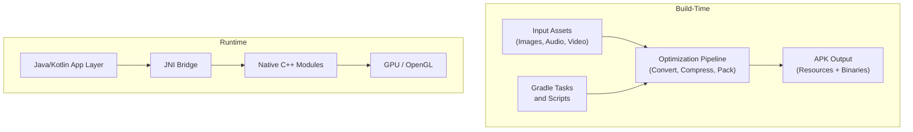
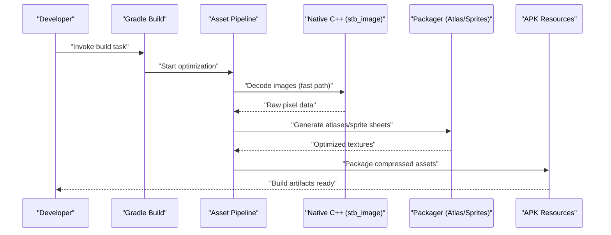
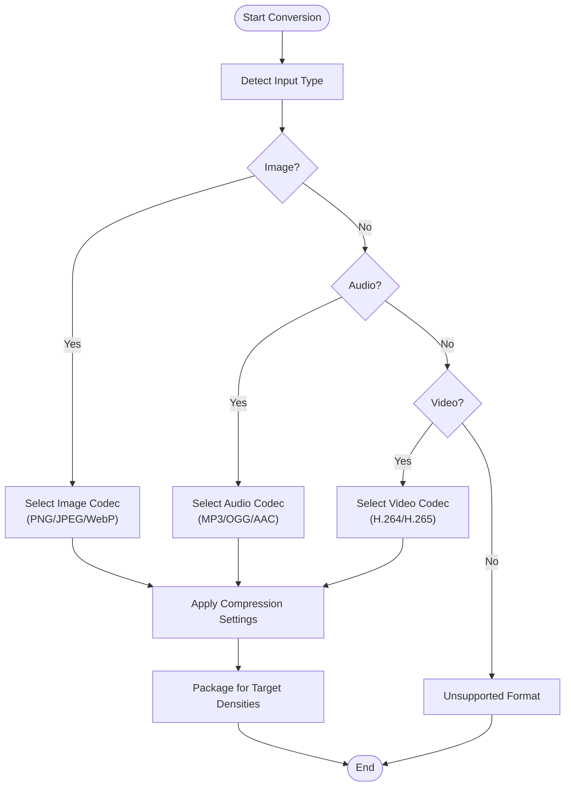
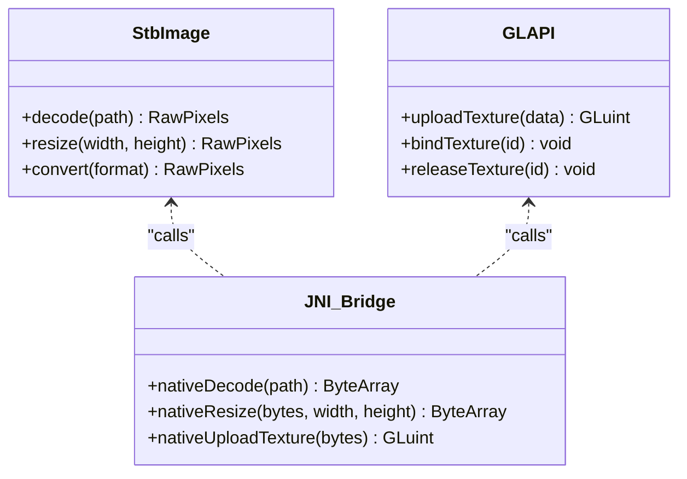
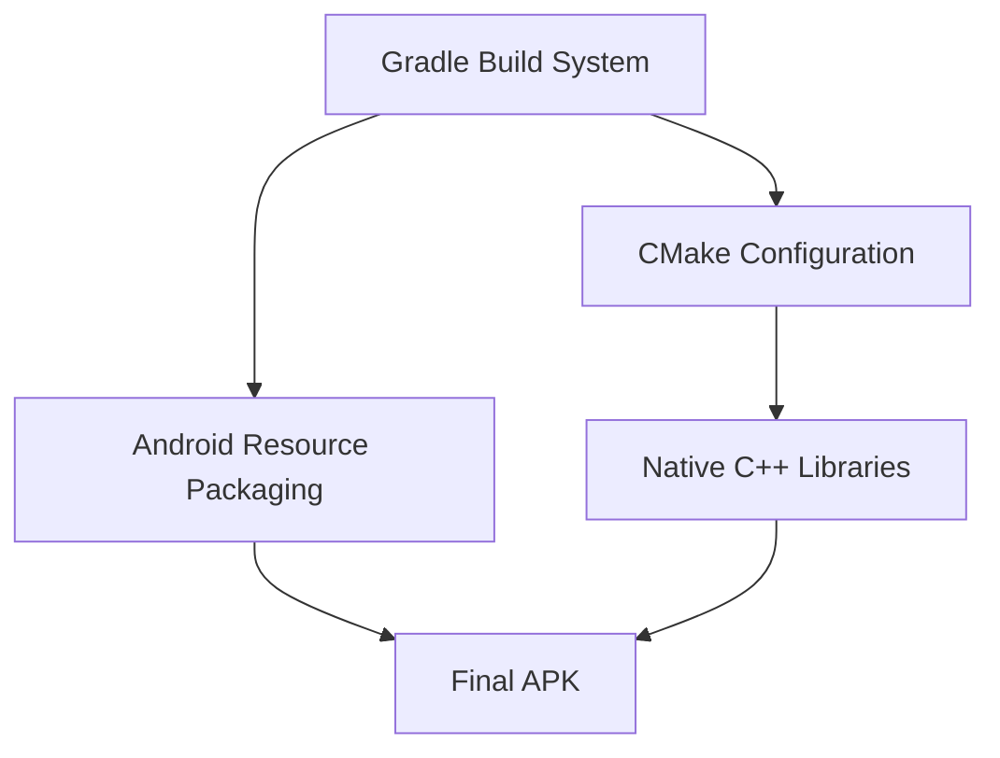
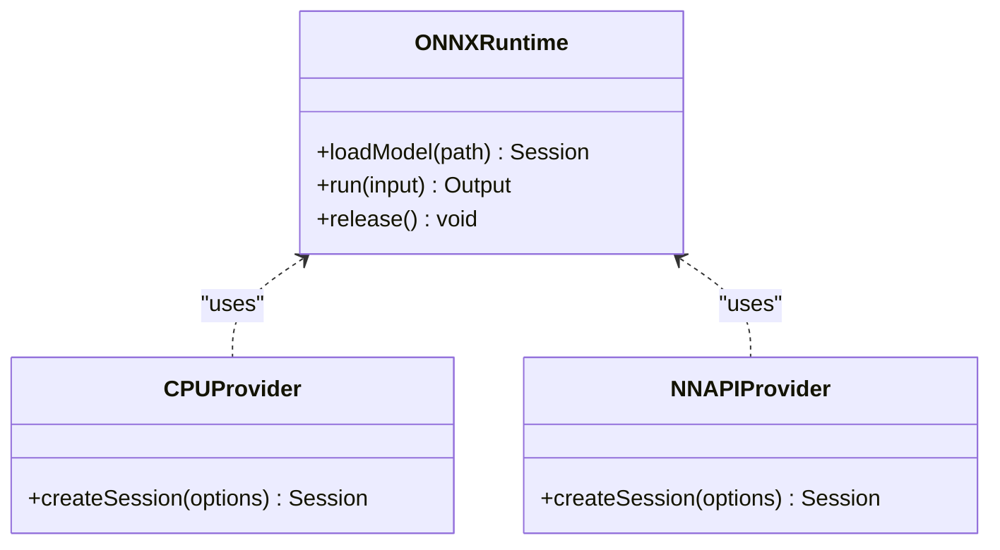

# Asset Optimization

<cite>
**Referenced Files in This Document**
- [CMakeLists.txt](file://catroid/src/main/cpp/CMakeLists.txt)
- [stb_image.h](file://catroid/src/main/cpp/stb_image.h)
- [newcatroid_gl_api.h](file://catroid/src/main/cpp/newcatroid_gl_api.h)
- [catroid.cpp](file://catroid/src/main/cpp/catroid.cpp)
- [ai_agent_jni.cpp](file://catroid/src/main/cpp/ai_agent_jni.cpp)
- [onnxruntime_c_api.h](file://catroid/src/main/cpp/onnxruntime_c_api.h)
- [onnxruntime_cxx_api.h](file://catroid/src/main/cpp/onnxruntime_cxx_api.h)
- [cpu_provider_factory.h](file://catroid/src/main/cpp/cpu_provider_factory.h)
- [nnapi_provider_factory.h](file://catroid/src/main/cpp/nnapi_provider_factory.h)
- [build.gradle](file://catroid/build.gradle)
- [gradle.properties](file://gradle.properties)
- [settings.gradle](file://settings.gradle)
</cite>

## Table of Contents
1. [Introduction](#introduction)
2. [Project Structure](#project-structure)
3. [Core Components](#core-components)
4. [Architecture Overview](#architecture-overview)
5. [Detailed Component Analysis](#detailed-component-analysis)
6. [Dependency Analysis](#dependency-analysis)
7. [Performance Considerations](#performance-considerations)
8. [Troubleshooting Guide](#troubleshooting-guide)
9. [Conclusion](#conclusion)
10. [Appendices](#appendices)

## Introduction
This document explains the asset optimization engine used by NewCatroid, focusing on how assets are converted, compressed, and optimized for Android devices. It covers:
- Automatic format conversion pipeline supporting multiple input formats
- Platform-specific optimizations (Android screen densities)
- Compression strategies for images, audio, and video
- Memory management techniques such as texture atlasing, sprite sheet generation, and resource pooling
- Native C++ integration for high-performance image processing
- Practical configuration examples, custom compressor creation, and performance monitoring

The goal is to provide both a conceptual overview and code-level insights so that developers can configure, extend, and monitor the optimization pipeline effectively.

## Project Structure
NewCatroid’s asset optimization spans build-time and runtime layers:
- Build-time: Gradle tasks and scripts orchestrate asset processing, compression, and packaging into APKs.
- Runtime: Native C++ modules handle high-performance image decoding and GPU-related operations; Java/Kotlin components coordinate with Android resources and platform features.

[No sources needed since this diagram shows conceptual workflow, not actual code structure]

**Section sources**
- [build.gradle](file://catroid/build.gradle)
- [gradle.properties](file://gradle.properties)
- [settings.gradle](file://settings.gradle)

## Core Components
Key building blocks of the asset optimization engine:
- Format Conversion Pipeline: Detects input types and routes them through appropriate converters (e.g., PNG/JPEG/WebP for images; MP3/OGG/AAC for audio; H.264/H.265 for video).
- Compression Engine: Applies lossy or lossless compression based on content type and target platform constraints.
- Texture Atlas and Sprite Sheet Generator: Packs textures to reduce draw calls and memory overhead.
- Resource Pooling: Reuses decoded buffers and textures at runtime to minimize allocations.
- Native Image Processing: Uses C++ libraries (e.g., stb_image) for fast decoding and manipulation before packing/compression.
- Android Density Handling: Generates density-specific variants (mdpi, hdpi, xhdpi, xxhdpi, xxxhdpi) to optimize memory and storage.

Practical configuration points:
- Gradle properties for enabling/disabling specific compressors and setting quality thresholds.
- Task parameters for atlas size limits, padding, and output formats.
- Runtime flags for resource pooling and cache sizes.

**Section sources**
- [build.gradle](file://catroid/build.gradle)
- [gradle.properties](file://gradle.properties)

## Architecture Overview
The optimization architecture integrates build-time automation with runtime native acceleration:

**Diagram sources**
- [CMakeLists.txt](file://catroid/src/main/cpp/CMakeLists.txt)
- [stb_image.h](file://catroid/src/main/cpp/stb_image.h)
- [newcatroid_gl_api.h](file://catroid/src/main/cpp/newcatroid_gl_api.h)
- [catroid.cpp](file://catroid/src/main/cpp/catroid.cpp)

**Section sources**
- [CMakeLists.txt](file://catroid/src/main/cpp/CMakeLists.txt)
- [stb_image.h](file://catroid/src/main/cpp/stb_image.h)
- [newcatroid_gl_api.h](file://catroid/src/main/cpp/newcatroid_gl_api.h)
- [catroid.cpp](file://catroid/src/main/cpp/catroid.cpp)

## Detailed Component Analysis

### Automatic Format Conversion Pipeline
The pipeline detects input file types and applies suitable conversions:
- Images: Supports PNG, JPEG, WebP. Converts to optimal formats per platform and density.
- Audio: Supports MP3, OGG, AAC. Chooses codecs based on device capabilities and app settings.
- Video: Encodes to H.264/H.265 where supported; falls back to compatible formats.

Processing steps:
- Input validation and metadata extraction
- Format selection based on target platform and quality targets
- Conversion and compression with configurable parameters
- Packaging into density-aware resources

[No sources needed since this diagram shows conceptual workflow, not actual code structure]

**Section sources**
- [build.gradle](file://catroid/build.gradle)
- [gradle.properties](file://gradle.properties)

### Compression Algorithms
- Images:
  - JPEG: Lossy compression tuned for photographic content; adjustable quality factor.
  - PNG: Lossless compression for transparency and crisp graphics; optional palette optimization.
  - WebP: Modern format balancing quality and size; supports alpha and animation.
- Audio:
  - MP3: Widely supported; bitrate-based trade-offs between size and fidelity.
  - OGG: Open codec with good compression efficiency; preferred for streaming.
  - AAC: Efficient for mobile platforms; adaptive bitrate options.
- Video:
  - H.264: Broad compatibility; balanced compression and quality.
  - H.265: Higher compression efficiency; requires device support checks.

Configuration guidance:
- Set quality/bitrate thresholds via Gradle properties.
- Enable/disable specific codecs per flavor or build variant.
- Use preflight checks to ensure target device support.

**Section sources**
- [build.gradle](file://catroid/build.gradle)
- [gradle.properties](file://gradle.properties)

### Memory Management Strategies
- Texture Atlasing:
  - Packs multiple textures into a single large texture to reduce state changes and draw calls.
  - Configurable atlas dimensions and padding to avoid bleeding.
- Sprite Sheet Generation:
  - Creates animated sequences from frames; optimizes UV coordinates and frame ordering.
- Resource Pooling:
  - Reuses decoded buffers and GPU textures to minimize allocations during runtime.
  - Implements LRU eviction policies for large assets.

Implementation notes:
- Atlas packing algorithms prioritize minimizing wasted space while respecting aspect ratios.
- Pool sizes are tunable via runtime flags; monitor memory pressure and adjust accordingly.

**Section sources**
- [newcatroid_gl_api.h](file://catroid/src/main/cpp/newcatroid_gl_api.h)
- [catroid.cpp](file://catroid/src/main/cpp/catroid.cpp)

### Native C++ Integration for High-Performance Image Processing
Native modules accelerate image decoding and manipulation:
- stb_image: Lightweight, header-only library for fast image loading and decoding.
- OpenGL API bindings: Provide efficient texture upload and GPU-side operations.
- JNI bridge: Exposes native functions to Java/Kotlin for seamless integration.

Integration points:
- CMake configuration compiles native modules for multiple ABIs (arm64-v8a, armeabi-v7a, x86, x86_64).
- JNI methods expose decode, resize, and pack operations to higher layers.

**Diagram sources**
- [stb_image.h](file://catroid/src/main/cpp/stb_image.h)
- [newcatroid_gl_api.h](file://catroid/src/main/cpp/newcatroid_gl_api.h)
- [catroid.cpp](file://catroid/src/main/cpp/catroid.cpp)

**Section sources**
- [CMakeLists.txt](file://catroid/src/main/cpp/CMakeLists.txt)
- [stb_image.h](file://catroid/src/main/cpp/stb_image.h)
- [newcatroid_gl_api.h](file://catroid/src/main/cpp/newcatroid_gl_api.h)
- [catroid.cpp](file://catroid/src/main/cpp/catroid.cpp)

### Android-Specific Optimizations for Screen Densities
NewCatroid generates density-specific resources to balance quality and memory usage:
- Supported densities: mdpi, hdpi, xhdpi, xxhdpi, xxxhdpi.
- Scaling factors applied during asset generation to match device pixel density.
- Fallback mechanisms for unsupported densities or missing resources.

Best practices:
- Pre-scale assets to target densities to avoid runtime scaling costs.
- Use vector drawables where possible for scalable UI elements.
- Monitor memory footprint across densities during testing.

**Section sources**
- [build.gradle](file://catroid/build.gradle)
- [gradle.properties](file://gradle.properties)

### Custom Compressor Creation
To add a custom compressor:
- Implement a new codec handler adhering to the pipeline’s interface contract.
- Register the handler in the build script to enable it for relevant asset types.
- Configure quality/bitrate parameters via Gradle properties.
- Test with representative assets to validate output size and quality.

Example steps:
- Define a new task in Gradle to invoke your compressor.
- Integrate with the pipeline by updating format detection logic.
- Add unit tests to ensure consistent behavior across builds.

**Section sources**
- [build.gradle](file://catroid/build.gradle)
- [gradle.properties](file://gradle.properties)

### Performance Monitoring
Track optimization impact using:
- Build logs: Inspect task durations and compression ratios.
- APK analysis: Measure resource sizes and distribution across densities.
- Runtime metrics: Monitor memory usage and GC events during asset loading.
- Profiling tools: Use Android Studio Profiler to identify bottlenecks.

Recommendations:
- Enable incremental builds to speed up iterative development.
- Cache intermediate results to avoid redundant work.
- Profile on real devices to capture accurate performance characteristics.

**Section sources**
- [build.gradle](file://catroid/build.gradle)
- [gradle.properties](file://gradle.properties)

## Dependency Analysis
The optimization system depends on:
- Gradle build system for task orchestration and property configuration.
- Native C++ modules compiled via CMake for high-performance operations.
- Android resource packaging for density-aware outputs.

**Diagram sources**
- [CMakeLists.txt](file://catroid/src/main/cpp/CMakeLists.txt)
- [build.gradle](file://catroid/build.gradle)

**Section sources**
- [CMakeLists.txt](file://catroid/src/main/cpp/CMakeLists.txt)
- [build.gradle](file://catroid/build.gradle)
- [gradle.properties](file://gradle.properties)
- [settings.gradle](file://settings.gradle)

## Performance Considerations
- Prefer lossless formats for UI assets requiring sharp edges and transparency.
- Use lossy formats for photographic content to reduce APK size significantly.
- Limit atlas sizes to fit within GPU texture limits; split large scenes into multiple atlases.
- Avoid excessive runtime scaling; pre-generate density-specific assets.
- Monitor memory pressure and adjust pool sizes dynamically based on device capabilities.

[No sources needed since this section provides general guidance]

## Troubleshooting Guide
Common issues and resolutions:
- Build failures due to unsupported codecs: Verify Gradle properties and device capability checks.
- Large APK sizes: Review compression settings and remove unused assets.
- Runtime crashes during texture upload: Check native module compilation and ABI compatibility.
- Inconsistent visual quality: Adjust quality/bitrate thresholds and test across devices.

Debugging tips:
- Enable verbose logging in Gradle tasks to trace asset processing steps.
- Use Android Studio’s APK Analyzer to inspect resource sizes and distributions.
- Validate native libraries with ndk-stack for crash diagnostics.

**Section sources**
- [build.gradle](file://catroid/build.gradle)
- [gradle.properties](file://gradle.properties)

## Conclusion
NewCatroid’s asset optimization engine combines build-time automation with runtime native acceleration to deliver efficient, high-quality assets across Android devices. By leveraging modern compression formats, texture atlasing, and density-aware packaging, it ensures optimal performance and user experience. Developers can customize the pipeline through Gradle configurations, extend it with custom compressors, and monitor performance using built-in tools and profiling utilities.

[No sources needed since this section summarizes without analyzing specific files]

## Appendices

### Configuration Examples
- Enable WebP compression for images:
  - Set property in gradle.properties to activate WebP encoder.
  - Configure quality threshold to balance size and fidelity.
- Disable MP3 support for stricter licensing compliance:
  - Toggle codec availability via build variants.
- Adjust atlas dimensions:
  - Set maximum atlas size in Gradle task parameters.

**Section sources**
- [gradle.properties](file://gradle.properties)
- [build.gradle](file://catroid/build.gradle)

### Native Module Compilation
- CMake configuration defines targets for multiple ABIs.
- Ensure toolchain paths and dependencies are correctly set for cross-compilation.
- Link against required libraries (e.g., OpenGL ES) for GPU operations.

**Section sources**
- [CMakeLists.txt](file://catroid/src/main/cpp/CMakeLists.txt)

### AI and ONNX Runtime Integration
While primarily focused on asset optimization, NewCatroid also integrates AI capabilities via ONNX Runtime:
- CPU and NNAPI providers for inference acceleration.
- JNI bridge exposes model execution to higher layers.

**Diagram sources**
- [onnxruntime_c_api.h](file://catroid/src/main/cpp/onnxruntime_c_api.h)
- [onnxruntime_cxx_api.h](file://catroid/src/main/cpp/onnxruntime_cxx_api.h)
- [cpu_provider_factory.h](file://catroid/src/main/cpp/cpu_provider_factory.h)
- [nnapi_provider_factory.h](file://catroid/src/main/cpp/nnapi_provider_factory.h)
- [ai_agent_jni.cpp](file://catroid/src/main/cpp/ai_agent_jni.cpp)

**Section sources**
- [onnxruntime_c_api.h](file://catroid/src/main/cpp/onnxruntime_c_api.h)
- [onnxruntime_cxx_api.h](file://catroid/src/main/cpp/onnxruntime_cxx_api.h)
- [cpu_provider_factory.h](file://catroid/src/main/cpp/cpu_provider_factory.h)
- [nnapi_provider_factory.h](file://catroid/src/main/cpp/nnapi_provider_factory.h)
- [ai_agent_jni.cpp](file://catroid/src/main/cpp/ai_agent_jni.cpp)