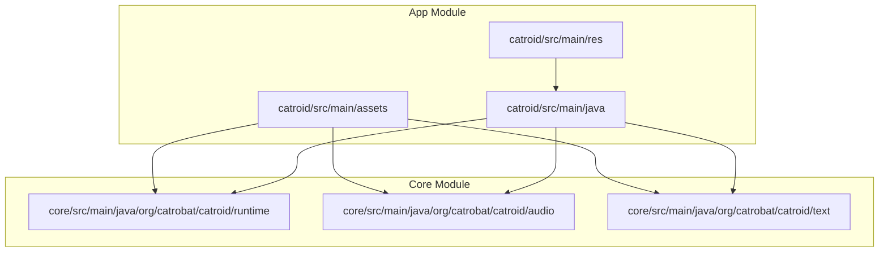
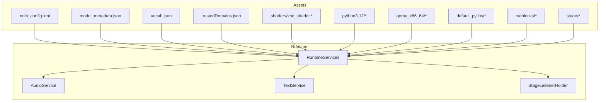
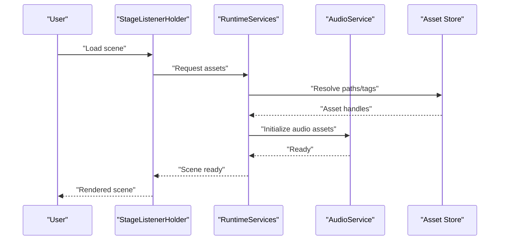
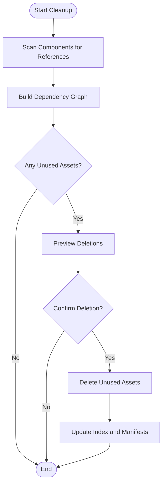
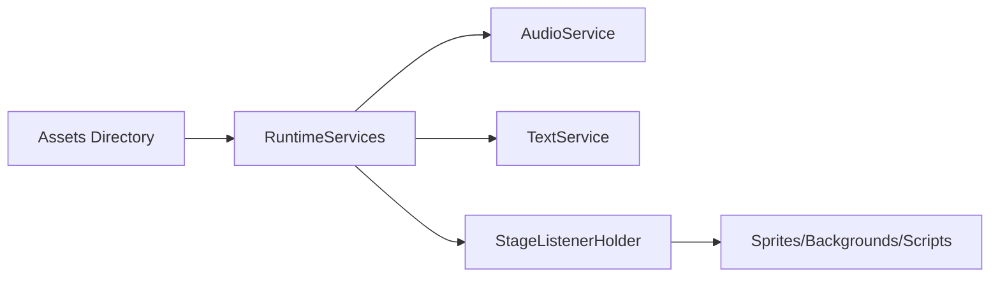

# Asset Organization

<cite>
**Referenced Files in This Document**
- [README.md](file://README.md)
- [build.gradle](file://build.gradle)
- [settings.gradle](file://settings.gradle)
- [catroid/src/main/java/org/catrobat/catroid/stage/StageListenerHolder.kt](file://catroid/src/main/java/org/catrobat/catroid/stage/StageListenerHolder.kt)
- [core/src/main/java/org/catrobat/catroid/runtime/RuntimeServices.kt](file://core/src/main/java/org/catrobat/catroid/runtime/RuntimeServices.kt)
- [core/src/main/java/org/catrobat/catroid/audio/AudioService.kt](file://core/src/main/java/org/catrobat/catroid/audio/AudioService.kt)
- [core/src/main/java/org/catrobat/catroid/text/TextService.kt](file://core/src/main/java/org/catrobat/catroid/text/TextService.kt)
- [catroid/src/main/assets/nolb_config.xml](file://catroid/src/main/assets/nolb_config.xml)
- [catroid/src/main/assets/model_metadata.json](file://catroid/src/main/assets/model_metadata.json)
- [catroid/src/main/assets/vocab.json](file://catroid/src/main/assets/vocab.json)
- [catroid/src/main/assets/trustedDomains.json](file://catroid/src/main/assets/trustedDomains.json)
- [catroid/src/main/assets/build_exe.bat](file://catroid/src/main/assets/build_exe.bat)
- [catroid/src/main/assets/veryimportant.txt](file://catroid/src/main/assets/veryimportant.txt)
- [catroid/src/main/assets/shaders/vnc_shader.vert](file://catroid/src/main/assets/shaders/vnc_shader.vert)
- [catroid/src/main/assets/shaders/vnc_shader.frag](file://catroid/src/main/assets/shaders/vnc_shader.frag)
- [catroid/src/main/assets/python3.12/...](file://catroid/src/main/assets/python3.12/)
- [catroid/src/main/assets/default_pylibs/...](file://catroid/src/main/assets/default_pylibs/)
- [catroid/src/main/assets/qemu_x86_64/...](file://catroid/src/main/assets/qemu_x86_64/)
- [catroid/src/main/assets/catblocks/...](file://catroid/src/main/assets/catblocks/)
- [catroid/src/main/assets/stage/...](file://catroid/src/main/assets/stage/)
</cite>

## Table of Contents
1. [Introduction](#introduction)
2. [Project Structure](#project-structure)
3. [Core Components](#core-components)
4. [Architecture Overview](#architecture-overview)
5. [Detailed Component Analysis](#detailed-component-analysis)
6. [Dependency Analysis](#dependency-analysis)
7. [Performance Considerations](#performance-considerations)
8. [Troubleshooting Guide](#troubleshooting-guide)
9. [Conclusion](#conclusion)
10. [Appendices](#appendices)

## Introduction
This document explains how NewCatroid organizes assets and how those assets relate to project components such as sprites, backgrounds, and scripts. It covers the hierarchical folder structure, tagging and search capabilities for locating assets within projects, version control integration for tracking changes and rollback, practical examples for organizing large asset libraries, bulk operations on collections, dependency tracking, and automatic cleanup of unused resources. The goal is to provide both a conceptual overview and concrete guidance grounded in the repository’s structure and services.

## Project Structure
NewCatroid follows a multi-module Android project layout with shared core logic and platform-specific implementations. Assets are primarily packaged under the main module’s assets directory and consumed by runtime services and stage components.

**Diagram sources**
- [catroid/src/main/assets/nolb_config.xml](file://catroid/src/main/assets/nolb_config.xml)
- [core/src/main/java/org/catrobat/catroid/runtime/RuntimeServices.kt](file://core/src/main/java/org/catrobat/catroid/runtime/RuntimeServices.kt)
- [core/src/main/java/org/catrobat/catroid/audio/AudioService.kt](file://core/src/main/java/org/catrobat/catroid/audio/AudioService.kt)
- [core/src/main/java/org/catrobat/catroid/text/TextService.kt](file://core/src/main/java/org/catrobat/catroid/text/TextService.kt)

**Section sources**
- [build.gradle](file://build.gradle)
- [settings.gradle](file://settings.gradle)
- [README.md](file://README.md)

## Core Components
The following runtime services coordinate access to assets and their usage across the application:

- Runtime Services: Centralized accessors for runtime features and resource coordination.
- Audio Service: Manages audio assets and playback lifecycle.
- Text Service: Handles text-related assets and rendering utilities.
- Stage Listener Holder: Coordinates stage-level events that may trigger asset loading or updates.

These components collectively enable efficient discovery, caching, and consumption of assets during project execution.

**Section sources**
- [core/src/main/java/org/catrobat/catroid/runtime/RuntimeServices.kt](file://core/src/main/java/org/catrobat/catroid/runtime/RuntimeServices.kt)
- [core/src/main/java/org/catrobat/catroid/audio/AudioService.kt](file://core/src/main/java/org/catrobat/catroid/audio/AudioService.kt)
- [core/src/main/java/org/catrobat/catroid/text/TextService.kt](file://core/src/main/java/org/catrobat/catroid/text/TextService.kt)
- [catroid/src/main/java/org/catrobat/catroid/stage/StageListenerHolder.kt](file://catroid/src/main/java/org/catrobat/catroid/stage/StageListenerHolder.kt)

## Architecture Overview
At a high level, assets reside in the app module’s assets directory and are accessed through runtime services. The stage layer orchestrates component lifecycles (sprites, backgrounds, scripts), which request assets via these services. Configuration and metadata files under assets inform behavior at startup and runtime.

**Diagram sources**
- [catroid/src/main/assets/nolb_config.xml](file://catroid/src/main/assets/nolb_config.xml)
- [catroid/src/main/assets/model_metadata.json](file://catroid/src/main/assets/model_metadata.json)
- [catroid/src/main/assets/vocab.json](file://catroid/src/main/assets/vocab.json)
- [catroid/src/main/assets/trustedDomains.json](file://catroid/src/main/assets/trustedDomains.json)
- [catroid/src/main/assets/shaders/vnc_shader.vert](file://catroid/src/main/assets/shaders/vnc_shader.vert)
- [catroid/src/main/assets/shaders/vnc_shader.frag](file://catroid/src/main/assets/shaders/vnc_shader.frag)
- [catroid/src/main/assets/python3.12/...](file://catroid/src/main/assets/python3.12/)
- [catroid/src/main/assets/qemu_x86_64/...](file://catroid/src/main/assets/qemu_x86_64/)
- [catroid/src/main/assets/default_pylibs/...](file://catroid/src/main/assets/default_pylibs/)
- [catroid/src/main/assets/catblocks/...](file://catroid/src/main/assets/catblocks/)
- [catroid/src/main/assets/stage/...](file://catroid/src/main/assets/stage/)
- [core/src/main/java/org/catrobat/catroid/runtime/RuntimeServices.kt](file://core/src/main/java/org/catrobat/catroid/runtime/RuntimeServices.kt)
- [core/src/main/java/org/catrobat/catroid/audio/AudioService.kt](file://core/src/main/java/org/catrobat/catroid/audio/AudioService.kt)
- [core/src/main/java/org/catrobat/catroid/text/TextService.kt](file://core/src/main/java/org/catrobat/catroid/text/TextService.kt)
- [catroid/src/main/java/org/catrobat/catroid/stage/StageListenerHolder.kt](file://catroid/src/main/java/org/catrobat/catroid/stage/StageListenerHolder.kt)

## Detailed Component Analysis

### Asset Hierarchy and Tagging
- Hierarchical organization:
  - Top-level assets include configuration, AI model metadata, vocabulary, trusted domains, build helpers, and shader programs.
  - Subdirectories group related content: Python runtime, QEMU binaries, default Python libraries, Catblocks definitions, and stage assets.
- Tagging and categorization:
  - Metadata-driven tags can be inferred from JSON/XML descriptors (e.g., model metadata, vocab lists).
  - Custom categorization schemes can be implemented by extending metadata structures and indexing them into a searchable catalog.
- Search capabilities:
  - Indexing strategies should scan asset directories and construct an inverted index keyed by names, types, and tags.
  - Queries can filter by type (sprite/background/script), tag sets, and name patterns.

Practical example: Organizing a large library
- Group assets by domain (e.g., characters, environments, UI elements).
- Maintain a manifest file per category listing assets and their tags.
- Use consistent naming conventions to improve search recall.

Bulk operations on collections
- Implement batch APIs to add/remove/rename assets across categories.
- Ensure atomic updates to manifests and indexes to maintain consistency.

**Section sources**
- [catroid/src/main/assets/nolb_config.xml](file://catroid/src/main/assets/nolb_config.xml)
- [catroid/src/main/assets/model_metadata.json](file://catroid/src/main/assets/model_metadata.json)
- [catroid/src/main/assets/vocab.json](file://catroid/src/main/assets/vocab.json)
- [catroid/src/main/assets/trustedDomains.json](file://catroid/src/main/assets/trustedDomains.json)
- [catroid/src/main/assets/catblocks/...](file://catroid/src/main/assets/catblocks/)
- [catroid/src/main/assets/stage/...](file://catroid/src/main/assets/stage/)

### Relationship Between Assets and Project Components
- Sprites and backgrounds:
  - Visual assets are loaded by the stage layer and referenced by sprite/background components.
  - Texture and shader assets (e.g., vnc shaders) enhance rendering pipelines.
- Scripts:
  - Scripting engines rely on Python runtime assets and default libraries.
  - Catblocks definitions drive block-based scripting behavior.
- Audio:
  - AudioService manages sound effects and music assets used by scenes and components.

**Diagram sources**
- [catroid/src/main/java/org/catrobat/catroid/stage/StageListenerHolder.kt](file://catroid/src/main/java/org/catrobat/catroid/stage/StageListenerHolder.kt)
- [core/src/main/java/org/catrobat/catroid/runtime/RuntimeServices.kt](file://core/src/main/java/org/catrobat/catroid/runtime/RuntimeServices.kt)
- [core/src/main/java/org/catrobat/catroid/audio/AudioService.kt](file://core/src/main/java/org/catrobat/catroid/audio/AudioService.kt)
- [catroid/src/main/assets/shaders/vnc_shader.vert](file://catroid/src/main/assets/shaders/vnc_shader.vert)
- [catroid/src/main/assets/shaders/vnc_shader.frag](file://catroid/src/main/assets/shaders/vnc_shader.frag)
- [catroid/src/main/assets/python3.12/...](file://catroid/src/main/assets/python3.12/)
- [catroid/src/main/assets/default_pylibs/...](file://catroid/src/main/assets/default_pylibs/)
- [catroid/src/main/assets/catblocks/...](file://catroid/src/main/assets/catblocks/)

**Section sources**
- [catroid/src/main/assets/shaders/vnc_shader.vert](file://catroid/src/main/assets/shaders/vnc_shader.vert)
- [catroid/src/main/assets/shaders/vnc_shader.frag](file://catroid/src/main/assets/shaders/vnc_shader.frag)
- [catroid/src/main/assets/python3.12/...](file://catroid/src/main/assets/python3.12/)
- [catroid/src/main/assets/default_pylibs/...](file://catroid/src/main/assets/default_pylibs/)
- [catroid/src/main/assets/catblocks/...](file://catroid/src/main/assets/catblocks/)
- [core/src/main/java/org/catrobat/catroid/audio/AudioService.kt](file://core/src/main/java/org/catrobat/catroid/audio/AudioService.kt)
- [core/src/main/java/org/catrobat/catroid/text/TextService.kt](file://core/src/main/java/org/catrobat/catroid/text/TextService.kt)
- [catroid/src/main/java/org/catrobat/catroid/stage/StageListenerHolder.kt](file://catroid/src/main/java/org/catrobat/catroid/stage/StageListenerHolder.kt)

### Version Control Integration and Rollback
- Git integration:
  - Track changes to asset files and manifests using standard version control workflows.
  - Commit messages should describe asset additions, renames, and deletions for clarity.
- Rollback capabilities:
  - Revert specific asset versions via checkout or restore commands.
  - For large libraries, use selective restores to minimize disruption.
- Best practices:
  - Keep manifests and indexes synchronized with asset changes.
  - Use branching strategies to isolate experimental asset sets.

**Section sources**
- [.gitignore](file://.gitignore)
- [.gitattributes](file://.gitattributes)

### Dependency Tracking and Automatic Cleanup
- Dependency tracking:
  - Build a graph linking components (sprites, backgrounds, scripts) to assets they reference.
  - Update the graph when assets are added, removed, or renamed.
- Automatic cleanup:
  - Periodically scan the dependency graph to identify unreferenced assets.
  - Provide safe deletion workflows with previews and confirmations.

[No sources needed since this diagram shows conceptual workflow, not actual code structure]

## Dependency Analysis
The runtime services depend on assets and coordinate their availability. The stage layer depends on runtime services to load and manage assets for components.

**Diagram sources**
- [core/src/main/java/org/catrobat/catroid/runtime/RuntimeServices.kt](file://core/src/main/java/org/catrobat/catroid/runtime/RuntimeServices.kt)
- [core/src/main/java/org/catrobat/catroid/audio/AudioService.kt](file://core/src/main/java/org/catrobat/catroid/audio/AudioService.kt)
- [core/src/main/java/org/catrobat/catroid/text/TextService.kt](file://core/src/main/java/org/catrobat/catroid/text/TextService.kt)
- [catroid/src/main/java/org/catrobat/catroid/stage/StageListenerHolder.kt](file://catroid/src/main/java/org/catrobat/catroid/stage/StageListenerHolder.kt)

**Section sources**
- [core/src/main/java/org/catrobat/catroid/runtime/RuntimeServices.kt](file://core/src/main/java/org/catrobat/catroid/runtime/RuntimeServices.kt)
- [core/src/main/java/org/catrobat/catroid/audio/AudioService.kt](file://core/src/main/java/org/catrobat/catroid/audio/AudioService.kt)
- [core/src/main/java/org/catrobat/catroid/text/TextService.kt](file://core/src/main/java/org/catrobat/catroid/text/TextService.kt)
- [catroid/src/main/java/org/catrobat/catroid/stage/StageListenerHolder.kt](file://catroid/src/main/java/org/catrobat/catroid/stage/StageListenerHolder.kt)

## Performance Considerations
- Asset indexing:
  - Precompute indexes at build time or early runtime to accelerate searches.
- Caching:
  - Cache frequently used assets in memory with eviction policies based on usage frequency.
- Batch operations:
  - Minimize I/O overhead by batching reads/writes during bulk operations.
- Shaders and textures:
  - Load and compile shaders lazily to reduce startup time.

[No sources needed since this section provides general guidance]

## Troubleshooting Guide
Common issues and resolutions:
- Missing assets:
  - Verify asset paths and ensure manifests reflect current file locations.
- Broken references:
  - Run dependency analysis to detect dangling references and fix them.
- Slow searches:
  - Rebuild indexes and ensure proper filtering by tags and types.
- Version conflicts:
  - Use targeted rollbacks and re-sync manifests after reverting assets.

**Section sources**
- [catroid/src/main/assets/nolb_config.xml](file://catroid/src/main/assets/nolb_config.xml)
- [catroid/src/main/assets/model_metadata.json](file://catroid/src/main/assets/model_metadata.json)
- [catroid/src/main/assets/vocab.json](file://catroid/src/main/assets/vocab.json)
- [catroid/src/main/assets/trustedDomains.json](file://catroid/src/main/assets/trustedDomains.json)

## Conclusion
NewCatroid’s asset organization centers around a well-structured assets directory, supported by runtime services and stage components. By leveraging metadata-driven tagging, robust search, and disciplined version control practices, teams can efficiently manage large asset libraries. Implementing dependency tracking and automated cleanup ensures lean projects and reduces maintenance overhead.

[No sources needed since this section summarizes without analyzing specific files]

## Appendices
- Practical examples:
  - Organize assets by domain and maintain per-category manifests.
  - Implement custom categorization by extending metadata schemas.
  - Use batch APIs for bulk rename/move/delete operations.
- Additional assets:
  - Build helper scripts and auxiliary files under assets support tooling and packaging workflows.

**Section sources**
- [catroid/src/main/assets/build_exe.bat](file://catroid/src/main/assets/build_exe.bat)
- [catroid/src/main/assets/veryimportant.txt](file://catroid/src/main/assets/veryimportant.txt)