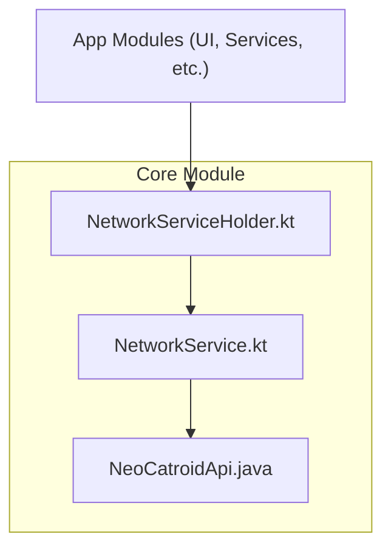
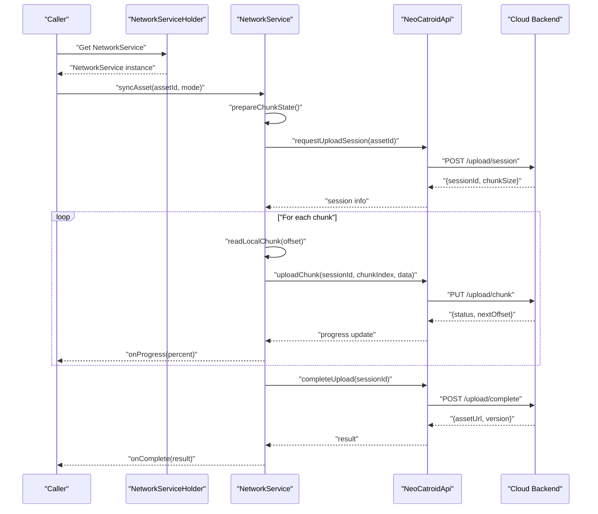
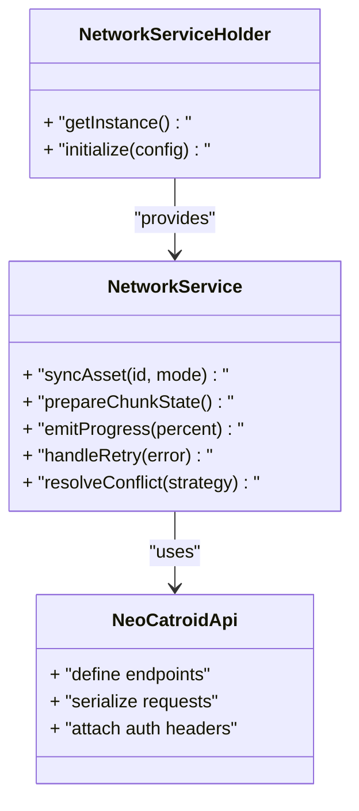
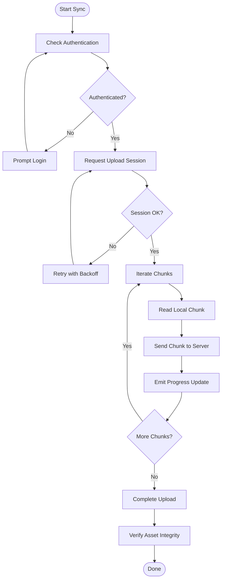
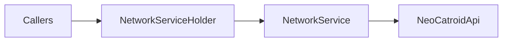

# Cloud Synchronization

<cite>
**Referenced Files in This Document**
- [NeoCatroidApi.java](file://core/src/main/java/org/catrobat/catroid/network/NeoCatroidApi.java)
- [NetworkService.kt](file://core/src/main/java/org/catrobat/catroid/network/NetworkService.kt)
- [NetworkServiceHolder.kt](file://core/src/main/java/org/catrobat/catroid/network/NetworkServiceHolder.kt)
</cite>

## Table of Contents
1. [Introduction](#introduction)
2. [Project Structure](#project-structure)
3. [Core Components](#core-components)
4. [Architecture Overview](#architecture-overview)
5. [Detailed Component Analysis](#detailed-component-analysis)
6. [Dependency Analysis](#dependency-analysis)
7. [Performance Considerations](#performance-considerations)
8. [Troubleshooting Guide](#troubleshooting-guide)
9. [Conclusion](#conclusion)
10. [Appendices](#appendices)

## Introduction
This document explains the cloud synchronization system in NewCatroid with a focus on how assets are uploaded and downloaded, including chunked transfers, resume capabilities, progress tracking, conflict resolution strategies, bandwidth optimization techniques, custom sync provider implementation, network failure handling, offline scenarios, the synchronization API surface, authentication methods, and security considerations. The content is derived from the repository’s network layer components and related modules.

## Project Structure
The cloud synchronization functionality is primarily implemented within the core module under the network package. Key files include:
- An API definition for cloud endpoints and request/response contracts
- A service that orchestrates network operations and integrates with the API
- A holder that exposes the service to other parts of the application

**Diagram sources**
- [NeoCatroidApi.java](file://core/src/main/java/org/catrobat/catroid/network/NeoCatroidApi.java)
- [NetworkService.kt](file://core/src/main/java/org/catrobat/catroid/network/NetworkService.kt)
- [NetworkServiceHolder.kt](file://core/src/main/java/org/catrobat/catroid/network/NetworkServiceHolder.kt)

**Section sources**
- [NeoCatroidApi.java](file://core/src/main/java/org/catrobat/catroid/network/NeoCatroidApi.java)
- [NetworkService.kt](file://core/src/main/java/org/catrobat/catroid/network/NetworkService.kt)
- [NetworkServiceHolder.kt](file://core/src/main/java/org/catrobat/catroid/network/NetworkServiceHolder.kt)

## Core Components
- NeoCatroidApi: Defines the synchronization API endpoints and data contracts used by the client to interact with the cloud backend. It encapsulates HTTP method signatures, path parameters, query parameters, and payload structures for asset upload/download and metadata operations.
- NetworkService: Implements the orchestration logic for synchronization tasks. It coordinates requests to the API, manages retries, handles progress callbacks, and integrates with local storage for resumable transfers.
- NetworkServiceHolder: Provides a centralized access point to the NetworkService instance across the app, ensuring consistent configuration and lifecycle management.

Key responsibilities:
- Upload and download assets with support for chunking and resuming
- Track and report transfer progress
- Handle authentication and authorization headers
- Manage error conditions and retry policies
- Provide hooks for custom sync providers

**Section sources**
- [NeoCatroidApi.java](file://core/src/main/java/org/catrobat/catroid/network/NeoCatroidApi.java)
- [NetworkService.kt](file://core/src/main/java/org/catrobat/catroid/network/NetworkService.kt)
- [NetworkServiceHolder.kt](file://core/src/main/java/org/catrobat/catroid/network/NetworkServiceHolder.kt)

## Architecture Overview
The synchronization architecture follows a layered approach:
- UI or business layers call into NetworkService via NetworkServiceHolder
- NetworkService composes calls to NeoCatroidApi
- NeoCatroidApi performs HTTP interactions with the cloud backend
- Local storage is used for caching, chunk persistence, and resume state

**Diagram sources**
- [NeoCatroidApi.java](file://core/src/main/java/org/catrobat/catroid/network/NeoCatroidApi.java)
- [NetworkService.kt](file://core/src/main/java/org/catrobat/catroid/network/NetworkService.kt)
- [NetworkServiceHolder.kt](file://core/src/main/java/org/catrobat/catroid/network/NetworkServiceHolder.kt)

## Detailed Component Analysis

### NeoCatroidApi
Responsibilities:
- Define REST endpoints for asset synchronization (sessions, chunks, completion)
- Serialize/deserialize request and response payloads
- Attach authentication tokens and required headers
- Expose methods for listing, downloading, and uploading assets

Design patterns:
- Endpoint-centric API abstraction
- Callback-based progress reporting integration points
- Error mapping to domain-specific exceptions

Security considerations:
- Enforce HTTPS endpoints
- Validate server responses and signatures where applicable
- Avoid logging sensitive tokens or file contents

**Section sources**
- [NeoCatroidApi.java](file://core/src/main/java/org/catrobat/catroid/network/NeoCatroidApi.java)

### NetworkService
Responsibilities:
- Orchestrate chunked uploads and downloads
- Maintain local state for resume (offsets, chunk checksums)
- Emit progress updates to callers
- Implement retry/backoff for transient failures
- Coordinate conflict detection and resolution workflows

Data flow:
- Prepare local chunk cache and resume metadata
- Request upload session from API
- Stream chunks with progress callbacks
- Complete upload and persist final metadata
- For downloads, stream chunks to disk and verify integrity

Error handling:
- Map network errors to user-friendly messages
- Persist partial state to allow resume after interruption
- Surface conflicts to the caller for resolution strategy selection

**Section sources**
- [NetworkService.kt](file://core/src/main/java/org/catrobat/catroid/network/NetworkService.kt)

### NetworkServiceHolder
Responsibilities:
- Provide singleton access to NetworkService
- Initialize service with base URL, timeouts, and interceptors
- Ensure thread-safe access across components

Lifecycle:
- Create once at app startup
- Dispose resources on shutdown if needed

**Section sources**
- [NetworkServiceHolder.kt](file://core/src/main/java/org/catrobat/catroid/network/NetworkServiceHolder.kt)

### Class Diagram

**Diagram sources**
- [NeoCatroidApi.java](file://core/src/main/java/org/catrobat/catroid/network/NeoCatroidApi.java)
- [NetworkService.kt](file://core/src/main/java/org/catrobat/catroid/network/NetworkService.kt)
- [NetworkServiceHolder.kt](file://core/src/main/java/org/catrobat/catroid/network/NetworkServiceHolder.kt)

### Chunked Transfer Flowchart

**Diagram sources**
- [NeoCatroidApi.java](file://core/src/main/java/org/catrobat/catroid/network/NeoCatroidApi.java)
- [NetworkService.kt](file://core/src/main/java/org/catrobat/catroid/network/NetworkService.kt)

## Dependency Analysis
- NetworkService depends on NeoCatroidApi for all cloud interactions
- NetworkServiceHolder provides NetworkService to callers
- Callers depend on NetworkServiceHolder to obtain the service without direct coupling to implementation details

**Diagram sources**
- [NeoCatroidApi.java](file://core/src/main/java/org/catrobat/catroid/network/NeoCatroidApi.java)
- [NetworkService.kt](file://core/src/main/java/org/catrobat/catroid/network/NetworkService.kt)
- [NetworkServiceHolder.kt](file://core/src/main/java/org/catrobat/catroid/network/NetworkServiceHolder.kt)

**Section sources**
- [NeoCatroidApi.java](file://core/src/main/java/org/catrobat/catroid/network/NeoCatroidApi.java)
- [NetworkService.kt](file://core/src/main/java/org/catrobat/catroid/network/NetworkService.kt)
- [NetworkServiceHolder.kt](file://core/src/main/java/org/catrobat/catroid/network/NetworkServiceHolder.kt)

## Performance Considerations
- Chunk size tuning: Adjust chunk sizes based on network conditions and device capabilities to balance throughput and memory usage
- Parallelism: Use controlled concurrency for independent chunks when supported by the backend
- Compression: Enable compression for text-heavy assets; avoid compressing already-compressed media
- Caching: Cache frequently accessed assets locally with invalidation strategies based on version or ETag
- Delta updates: Prefer delta patches when available to reduce bandwidth consumption
- Resume: Persist transfer state to survive process restarts and network interruptions
- Backoff: Implement exponential backoff with jitter for retries to avoid thundering herds

[No sources needed since this section provides general guidance]

## Troubleshooting Guide
Common issues and resolutions:
- Authentication failures: Ensure tokens are refreshed and valid; re-authenticate if expired
- Partial uploads: Check local chunk state and resume offsets; clear corrupted chunk caches if necessary
- Slow transfers: Reduce chunk size, enable compression, or switch to Wi-Fi-only mode
- Conflicts: Detect server-side version mismatches and apply merge strategies or prompt users
- Timeouts: Increase timeout thresholds for large assets and implement graceful degradation

Operational checks:
- Verify HTTPS endpoints and certificate validation
- Inspect logs for retry attempts and error codes
- Monitor progress callbacks to detect stalls

**Section sources**
- [NetworkService.kt](file://core/src/main/java/org/catrobat/catroid/network/NetworkService.kt)
- [NeoCatroidApi.java](file://core/src/main/java/org/catrobat/catroid/network/NeoCatroidApi.java)

## Conclusion
NewCatroid’s cloud synchronization system centers around a clean separation between API definitions and orchestration logic. The NetworkService implements robust chunked transfers with resume and progress tracking, while the API layer abstracts cloud interactions. By applying performance optimizations like compression, caching, and delta updates, and by implementing strong error handling and conflict resolution, the system delivers reliable asset synchronization across diverse network conditions.

[No sources needed since this section summarizes without analyzing specific files]

## Appendices

### Custom Sync Provider Implementation
To implement a custom sync provider:
- Extend the provider interface exposed by NetworkService
- Implement chunked upload/download with resume support
- Integrate progress callbacks and error handling
- Register the provider through NetworkServiceHolder configuration

Example steps:
- Define provider configuration (base URLs, chunk size, retry policy)
- Implement upload session creation and chunk streaming
- Handle completion and verification
- Provide conflict resolution hooks

**Section sources**
- [NetworkService.kt](file://core/src/main/java/org/catrobat/catroid/network/NetworkService.kt)
- [NetworkServiceHolder.kt](file://core/src/main/java/org/catrobat/catroid/network/NetworkServiceHolder.kt)

### Handling Network Failures
Strategies:
- Retry with exponential backoff and jitter
- Persist partial state for resume
- Fallback to lower quality or smaller chunks
- Notify users with actionable messages

**Section sources**
- [NetworkService.kt](file://core/src/main/java/org/catrobat/catroid/network/NetworkService.kt)

### Managing Offline Scenarios
Approaches:
- Queue sync operations when offline
- Store pending changes locally with versioning
- Reconcile changes upon reconnection
- Provide UI indicators for sync status

**Section sources**
- [NetworkService.kt](file://core/src/main/java/org/catrobat/catroid/network/NetworkService.kt)

### Synchronization API Summary
Endpoints typically include:
- Create upload session
- Upload chunk
- Complete upload
- Download asset metadata
- Download asset chunks

Authentication:
- Bearer token or session cookie
- Token refresh mechanism
- Scope-based permissions per endpoint

Security considerations:
- Enforce HTTPS
- Validate server responses
- Sanitize inputs and outputs
- Limit exposure of internal paths and identifiers

**Section sources**
- [NeoCatroidApi.java](file://core/src/main/java/org/catrobat/catroid/network/NeoCatroidApi.java)