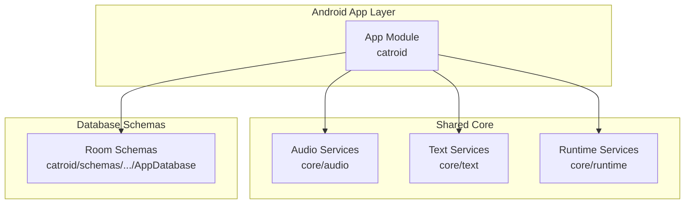
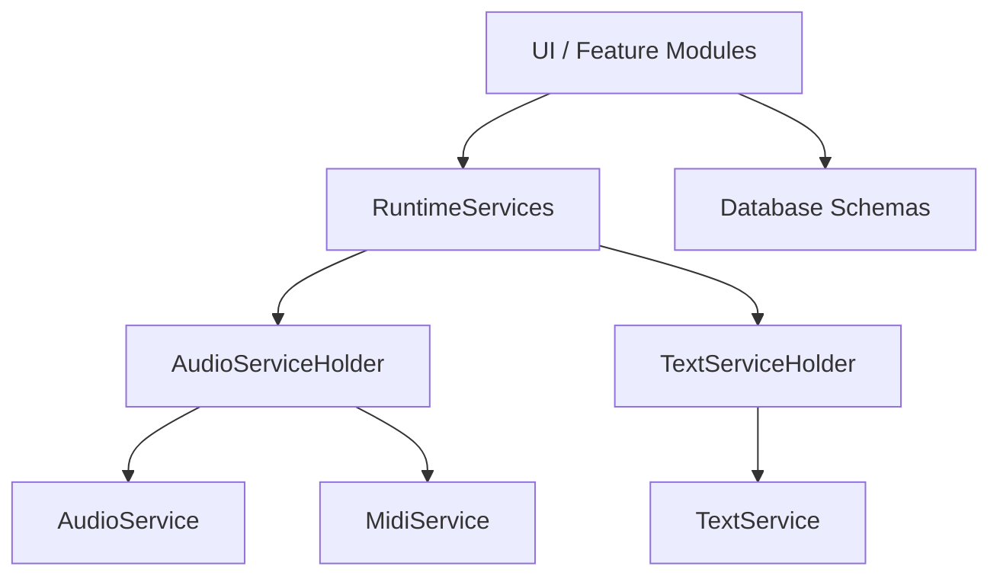
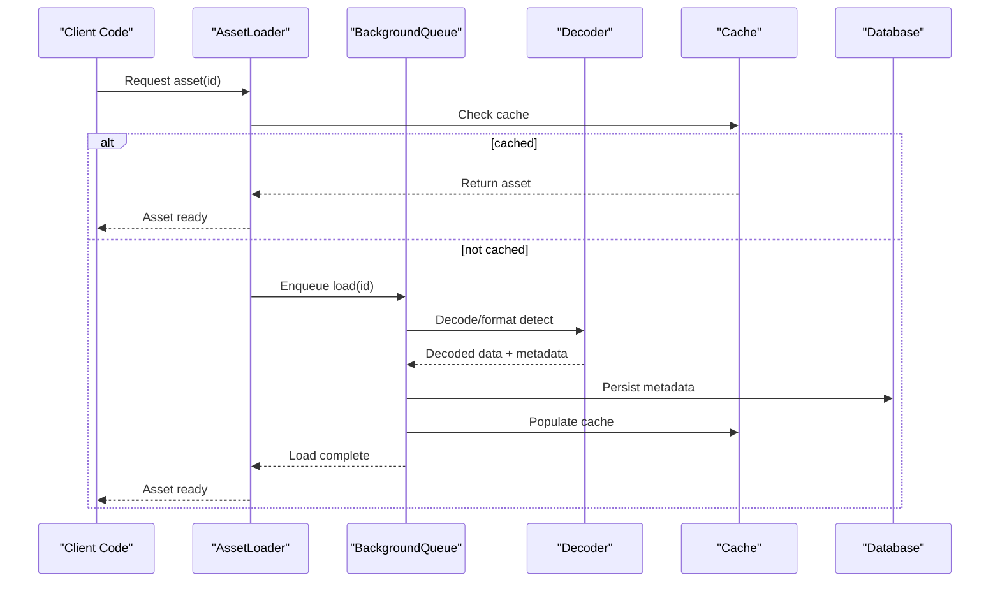
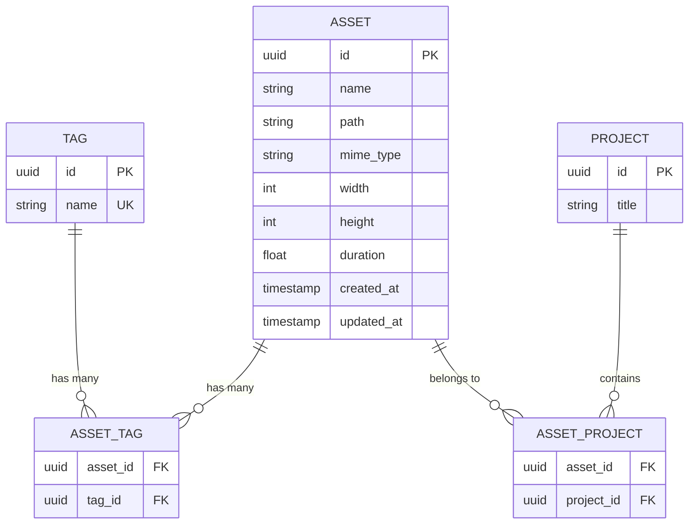
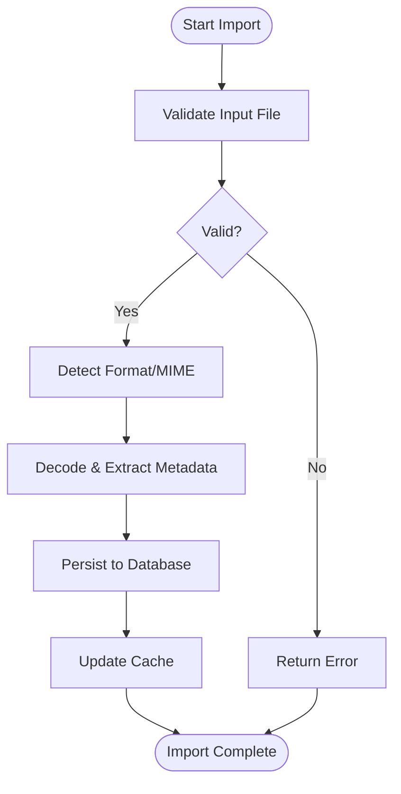
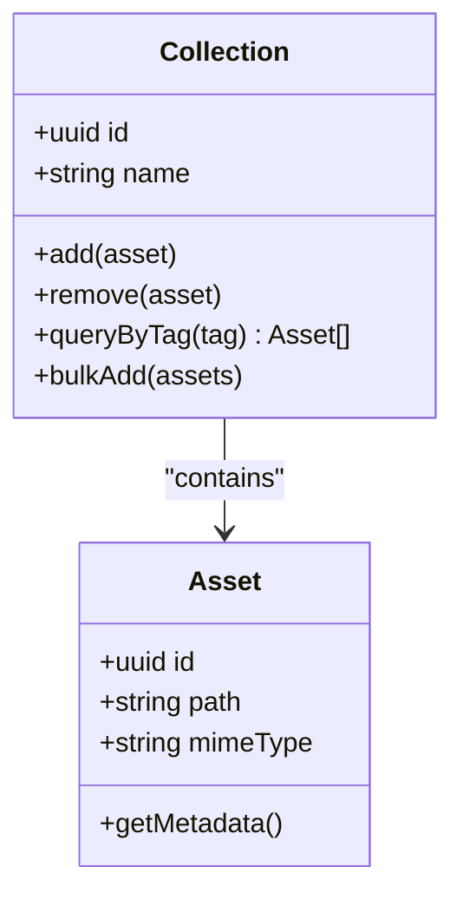
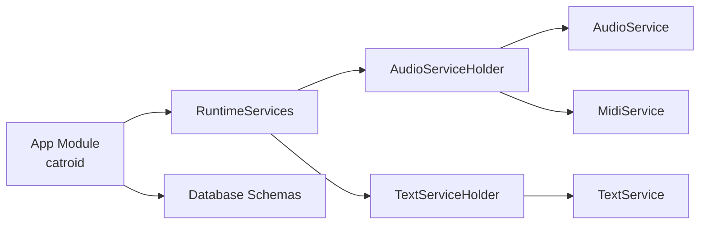

# Media Library

<cite>
**Referenced Files in This Document**
- [README.md](file://README.md)
- [build.gradle](file://build.gradle)
- [settings.gradle](file://settings.gradle)
- [catroid/src/main/java/org/catrobat/catroid/common/FlavoredConstants.java](file://catroid/src/main/java/org/catrobat/catroid/common/FlavoredConstants.java)
- [core/src/main/java/org/catrobat/catroid/audio/AudioService.kt](file://core/src/main/java/org/catrobat/catroid/audio/AudioService.kt)
- [core/src/main/java/org/catrobat/catroid/audio/AudioServiceHolder.kt](file://core/src/main/java/org/catrobat/catroid/audio/AudioServiceHolder.kt)
- [core/src/main/java/org/catrobat/catroid/audio/MidiService.kt](file://core/src/main/java/org/catrobat/catroid/audio/MidiService.kt)
- [core/src/main/java/org/catrobat/catroid/audio/MidiServiceHolder.kt](file://core/src/main/java/org/catrobat/catroid/audio/MidiServiceHolder.kt)
- [core/src/main/java/org/catrobat/catroid/text/TextService.kt](file://core/src/main/java/org/catrobat/catroid/text/TextService.kt)
- [core/src/main/java/org/catrobat/catroid/text/TextServiceHolder.kt](file://core/src/main/java/org/catrobat/catroid/text/TextServiceHolder.kt)
- [core/src/main/java/org/catrobat/catroid/runtime/RuntimeServices.kt](file://core/src/main/java/org/catrobat/catroid/runtime/RuntimeServices.kt)
- [core/src/main/java/org/catrobat/catroid/runtime/RuntimeServicesHolder.kt](file://core/src/main/java/org/catrobat/catroid/runtime/RuntimeServicesHolder.kt)
- [catroid/schemas/org.catrobat.catroid.db.AppDatabase/1.json](file://catroid/schemas/org.catrobat.catroid.db.AppDatabase/1.json)
- [catroid/schemas/org.catrobat.catroid.db.AppDatabase/2.json](file://catroid/schemas/org.catrobat.catroid.db.AppDatabase/2.json)
</cite>

## Table of Contents
1. [Introduction](#introduction)
2. [Project Structure](#project-structure)
3. [Core Components](#core-components)
4. [Architecture Overview](#architecture-overview)
5. [Detailed Component Analysis](#detailed-component-analysis)
6. [Dependency Analysis](#dependency-analysis)
7. [Performance Considerations](#performance-considerations)
8. [Troubleshooting Guide](#troubleshooting-guide)
9. [Conclusion](#conclusion)
10. [Appendices](#appendices)

## Introduction
This document explains the media library system in NewCatroid, focusing on how images, audio, video, and custom asset types are supported with automatic format detection and validation. It covers asset loading mechanisms (lazy loading, background processing, error handling), metadata management for properties/tags/relationships, practical examples for importing external media and creating custom asset types, and guidance on managing asset collections. It also outlines the asset database schema, indexing strategies, and query optimization techniques.

The goal is to provide a clear, progressive guide for both new contributors and experienced developers integrating or extending media capabilities within NewCatroid.

## Project Structure
NewCatroid organizes platform-specific Android code under catroid and shared core logic under core. The media-related services are primarily implemented in core and consumed by the Android app layer. Database schemas are defined under catroid/schemas.

**Diagram sources**
- [catroid/src/main/java/org/catrobat/catroid/common/FlavoredConstants.java](file://catroid/src/main/java/org/catrobat/catroid/common/FlavoredConstants.java)
- [core/src/main/java/org/catrobat/catroid/audio/AudioService.kt](file://core/src/main/java/org/catrobat/catroid/audio/AudioService.kt)
- [core/src/main/java/org/catrobat/catroid/text/TextService.kt](file://core/src/main/java/org/catrobat/catroid/text/TextService.kt)
- [core/src/main/java/org/catrobat/catroid/runtime/RuntimeServices.kt](file://core/src/main/java/org/catrobat/catroid/runtime/RuntimeServices.kt)
- [catroid/schemas/org.catrobat.catroid.db.AppDatabase/1.json](file://catroid/schemas/org.catrobat.catroid.db.AppDatabase/1.json)
- [catroid/schemas/org.catrobat.catroid.db.AppDatabase/2.json](file://catroid/schemas/org.catrobat.catroid.db.AppDatabase/2.json)

**Section sources**
- [README.md](file://README.md)
- [build.gradle](file://build.gradle)
- [settings.gradle](file://settings.gradle)
- [catroid/src/main/java/org/catrobat/catroid/common/FlavoredConstants.java](file://catroid/src/main/java/org/catrobat/catroid/common/FlavoredConstants.java)

## Core Components
- Audio subsystem: Provides playback, MIDI support, and lifecycle management via service holders.
- Text subsystem: Offers text rasterization and rendering utilities used by media pipelines.
- Runtime services: Centralizes runtime configuration and accessors for services across modules.
- Database schemas: Define persistent structures for assets and related metadata.

These components collectively enable media ingestion, processing, and consumption throughout the application.

**Section sources**
- [core/src/main/java/org/catrobat/catroid/audio/AudioService.kt](file://core/src/main/java/org/catrobat/catroid/audio/AudioService.kt)
- [core/src/main/java/org/catrobat/catroid/audio/AudioServiceHolder.kt](file://core/src/main/java/org/catrobat/catroid/audio/AudioServiceHolder.kt)
- [core/src/main/java/org/catrobat/catroid/audio/MidiService.kt](file://core/src/main/java/org/catrobat/catroid/audio/MidiService.kt)
- [core/src/main/java/org/catrobat/catroid/audio/MidiServiceHolder.kt](file://core/src/main/java/org/catrobat/catroid/audio/MidiServiceHolder.kt)
- [core/src/main/java/org/catrobat/catroid/text/TextService.kt](file://core/src/main/java/org/catrobat/catroid/text/TextService.kt)
- [core/src/main/java/org/catrobat/catroid/text/TextServiceHolder.kt](file://core/src/main/java/org/catrobat/catroid/text/TextServiceHolder.kt)
- [core/src/main/java/org/catrobat/catroid/runtime/RuntimeServices.kt](file://core/src/main/java/org/catrobat/catroid/runtime/RuntimeServices.kt)
- [core/src/main/java/org/catrobat/catroid/runtime/RuntimeServicesHolder.kt](file://core/src/main/java/org/catrobat/catroid/runtime/RuntimeServicesHolder.kt)

## Architecture Overview
The media library architecture separates concerns into services (audio, text), runtime orchestration, and persistence (database schemas). The Android app layer consumes these services through well-defined interfaces and holders.

**Diagram sources**
- [core/src/main/java/org/catrobat/catroid/runtime/RuntimeServices.kt](file://core/src/main/java/org/catrobat/catroid/runtime/RuntimeServices.kt)
- [core/src/main/java/org/catrobat/catroid/runtime/RuntimeServicesHolder.kt](file://core/src/main/java/org/catrobat/catroid/runtime/RuntimeServicesHolder.kt)
- [core/src/main/java/org/catrobat/catroid/audio/AudioServiceHolder.kt](file://core/src/main/java/org/catrobat/catroid/audio/AudioServiceHolder.kt)
- [core/src/main/java/org/catrobat/catroid/audio/AudioService.kt](file://core/src/main/java/org/catrobat/catroid/audio/AudioService.kt)
- [core/src/main/java/org/catrobat/catroid/audio/MidiServiceHolder.kt](file://core/src/main/java/org/catrobat/catroid/audio/MidiServiceHolder.kt)
- [core/src/main/java/org/catrobat/catroid/audio/MidiService.kt](file://core/src/main/java/org/catrobat/catroid/audio/MidiService.kt)
- [core/src/main/java/org/catrobat/catroid/text/TextServiceHolder.kt](file://core/src/main/java/org/catrobat/catroid/text/TextServiceHolder.kt)
- [core/src/main/java/org/catrobat/catroid/text/TextService.kt](file://core/src/main/java/org/catrobat/catroid/text/TextService.kt)
- [catroid/schemas/org.catrobat.catroid.db.AppDatabase/1.json](file://catroid/schemas/org.catrobat.catroid.db.AppDatabase/1.json)
- [catroid/schemas/org.catrobat.catroid.db.AppDatabase/2.json](file://catroid/schemas/org.catrobat.catroid.db.AppDatabase/2.json)

## Detailed Component Analysis

### Asset Loading Pipeline
This pipeline handles lazy loading, background processing, and error handling for media assets.

[No sources needed since this diagram shows conceptual workflow, not actual code structure]

### Metadata Management
Metadata includes properties, tags, and relationships. Typical fields include identifiers, file paths, MIME types, dimensions/duration, creation timestamps, and user-defined tags. Relationships link assets to projects, scenes, or sprites.

[No sources needed since this diagram shows conceptual model, not actual code structure]

### Importing External Media
A typical import flow validates input, detects format, decodes, extracts metadata, persists records, and updates caches.

[No sources needed since this diagram shows conceptual workflow, not actual code structure]

### Creating Custom Asset Types
To add a new asset type:
- Define a new entry in the asset registry or enum.
- Implement a decoder that supports format detection and decoding.
- Extend metadata schema if additional fields are required.
- Update caching and indexing to include new fields.
- Add tests covering decode, metadata extraction, and error cases.

[No sources needed since this section provides general guidance]

### Managing Asset Collections
Collections group assets by context (e.g., project, scene, sprite). Operations include adding/removing assets, querying by tags, and bulk operations for performance.

[No sources needed since this diagram shows conceptual model, not actual code structure]

**Section sources**
- [core/src/main/java/org/catrobat/catroid/audio/AudioService.kt](file://core/src/main/java/org/catrobat/catroid/audio/AudioService.kt)
- [core/src/main/java/org/catrobat/catroid/audio/AudioServiceHolder.kt](file://core/src/main/java/org/catrobat/catroid/audio/AudioServiceHolder.kt)
- [core/src/main/java/org/catrobat/catroid/audio/MidiService.kt](file://core/src/main/java/org/catrobat/catroid/audio/MidiService.kt)
- [core/src/main/java/org/catrobat/catroid/audio/MidiServiceHolder.kt](file://core/src/main/java/org/catrobat/catroid/audio/MidiServiceHolder.kt)
- [core/src/main/java/org/catrobat/catroid/text/TextService.kt](file://core/src/main/java/org/catrobat/catroid/text/TextService.kt)
- [core/src/main/java/org/catrobat/catroid/text/TextServiceHolder.kt](file://core/src/main/java/org/catrobat/catroid/text/TextServiceHolder.kt)
- [core/src/main/java/org/catrobat/catroid/runtime/RuntimeServices.kt](file://core/src/main/java/org/catrobat/catroid/runtime/RuntimeServices.kt)
- [core/src/main/java/org/catrobat/catroid/runtime/RuntimeServicesHolder.kt](file://core/src/main/java/org/catrobat/catroid/runtime/RuntimeServicesHolder.kt)
- [catroid/schemas/org.catrobat.catroid.db.AppDatabase/1.json](file://catroid/schemas/org.catrobat.catroid.db.AppDatabase/1.json)
- [catroid/schemas/org.catrobat.catroid.db.AppDatabase/2.json](file://catroid/schemas/org.catrobat.catroid.db.AppDatabase/2.json)

## Dependency Analysis
The following diagram highlights key dependencies between services and holders, and their relationship to the app module and database schemas.

**Diagram sources**
- [catroid/src/main/java/org/catrobat/catroid/common/FlavoredConstants.java](file://catroid/src/main/java/org/catrobat/catroid/common/FlavoredConstants.java)
- [core/src/main/java/org/catrobat/catroid/runtime/RuntimeServices.kt](file://core/src/main/java/org/catrobat/catroid/runtime/RuntimeServices.kt)
- [core/src/main/java/org/catrobat/catroid/runtime/RuntimeServicesHolder.kt](file://core/src/main/java/org/catrobat/catroid/runtime/RuntimeServicesHolder.kt)
- [core/src/main/java/org/catrobat/catroid/audio/AudioServiceHolder.kt](file://core/src/main/java/org/catrobat/catroid/audio/AudioServiceHolder.kt)
- [core/src/main/java/org/catrobat/catroid/audio/AudioService.kt](file://core/src/main/java/org/catrobat/catroid/audio/AudioService.kt)
- [core/src/main/java/org/catrobat/catroid/audio/MidiServiceHolder.kt](file://core/src/main/java/org/catrobat/catroid/audio/MidiServiceHolder.kt)
- [core/src/main/java/org/catrobat/catroid/audio/MidiService.kt](file://core/src/main/java/org/catrobat/catroid/audio/MidiService.kt)
- [core/src/main/java/org/catrobat/catroid/text/TextServiceHolder.kt](file://core/src/main/java/org/catrobat/catroid/text/TextServiceHolder.kt)
- [core/src/main/java/org/catrobat/catroid/text/TextService.kt](file://core/src/main/java/org/catrobat/catroid/text/TextService.kt)
- [catroid/schemas/org.catrobat.catroid.db.AppDatabase/1.json](file://catroid/schemas/org.catrobat.catroid.db.AppDatabase/1.json)
- [catroid/schemas/org.catrobat.catroid.db.AppDatabase/2.json](file://catroid/schemas/org.catrobat.catroid.db.AppDatabase/2.json)

**Section sources**
- [build.gradle](file://build.gradle)
- [settings.gradle](file://settings.gradle)
- [catroid/src/main/java/org/catrobat/catroid/common/FlavoredConstants.java](file://catroid/src/main/java/org/catrobat/catroid/common/FlavoredConstants.java)

## Performance Considerations
- Lazy loading: Defer heavy decoding until assets are actually needed.
- Background processing: Use queues or workers to avoid blocking the UI thread.
- Caching: Keep frequently accessed assets in memory; evict based on size and usage patterns.
- Indexing: Create indexes on commonly queried fields such as tags, project associations, and MIME types.
- Batch operations: Prefer bulk inserts/updates for large imports.
- Resource limits: Respect device constraints for memory and disk I/O.

[No sources needed since this section provides general guidance]

## Troubleshooting Guide
Common issues and resolutions:
- Format detection failures: Ensure MIME/type mapping is up-to-date and fallbacks are handled.
- Decoding errors: Validate inputs early and log detailed diagnostics.
- Metadata inconsistencies: Re-run extraction and reconcile with persisted records.
- Cache misses: Verify cache keys and eviction policies.
- Database migrations: Confirm schema versions align with runtime expectations.

[No sources needed since this section provides general guidance]

## Conclusion
NewCatroid’s media library integrates audio, text, and runtime services with a robust asset loading pipeline, metadata management, and database-backed persistence. By adopting lazy loading, background processing, and strong indexing strategies, the system delivers responsive media experiences while remaining extensible for custom asset types and collections.

[No sources needed since this section summarizes without analyzing specific files]

## Appendices

### Practical Examples

#### Importing an External Image
- Validate file extension and MIME type.
- Decode image to obtain dimensions and color space.
- Persist asset record with metadata and tags.
- Populate cache and return reference.

[No sources needed since this section provides general guidance]

#### Importing an External Audio File
- Validate audio container and codec support.
- Decode to extract duration, sample rate, channels.
- Persist metadata and create waveform thumbnails if applicable.
- Register with audio service for playback.

[No sources needed since this section provides general guidance]

#### Creating a Custom Asset Type
- Add a new asset kind identifier.
- Implement a decoder with format detection and metadata extraction.
- Extend database schema if necessary and migrate safely.
- Integrate with caching and indexing layers.
- Provide unit and integration tests.

[No sources needed since this section provides general guidance]

#### Managing Asset Collections
- Group assets by project or scene using association tables.
- Query by tags efficiently using indexed columns.
- Perform bulk operations for import/export workflows.

[No sources needed since this section provides general guidance]

### Database Schema Notes
- Review Room schema definitions for current table structures and indices.
- Align migrations with feature changes and ensure backward compatibility.
- Optimize queries by selecting only needed columns and leveraging indexes.

**Section sources**
- [catroid/schemas/org.catrobat.catroid.db.AppDatabase/1.json](file://catroid/schemas/org.catrobat.catroid.db.AppDatabase/1.json)
- [catroid/schemas/org.catrobat.catroid.db.AppDatabase/2.json](file://catroid/schemas/org.catrobat.catroid.db.AppDatabase/2.json)