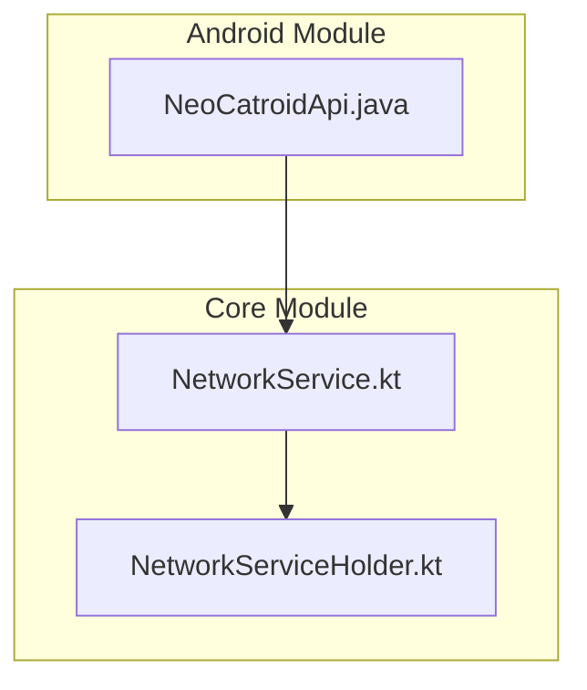
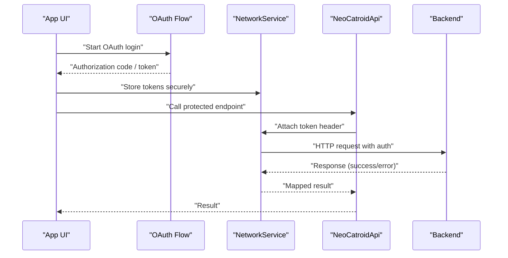
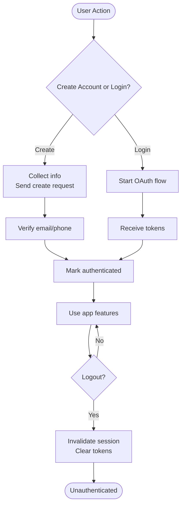
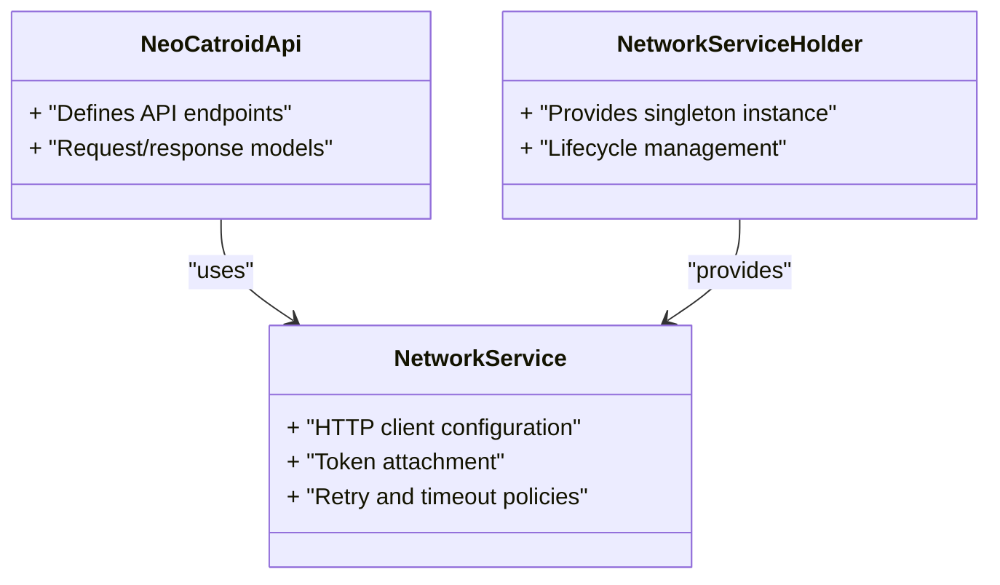

# Authentication System

<cite>
**Referenced Files in This Document**
- [README.md](file://README.md)
- [catroid/src/main/java/org/catrobat/catroid/network/NeoCatroidApi.java](file://catroid/src/main/java/org/catrobat/catroid/network/NeoCatroidApi.java)
- [core/src/main/java/org/catrobat/catroid/network/NetworkService.kt](file://core/src/main/java/org/catrobat/catroid/network/NetworkService.kt)
- [core/src/main/java/org/catrobat/catroid/network/NetworkServiceHolder.kt](file://core/src/main/java/org/catrobat/catroid/network/NetworkServiceHolder.kt)
</cite>

## Table of Contents
1. [Introduction](#introduction)
2. [Project Structure](#project-structure)
3. [Core Components](#core-components)
4. [Architecture Overview](#architecture-overview)
5. [Detailed Component Analysis](#detailed-component-analysis)
6. [Dependency Analysis](#dependency-analysis)
7. [Performance Considerations](#performance-considerations)
8. [Troubleshooting Guide](#troubleshooting-guide)
9. [Conclusion](#conclusion)

## Introduction
This document explains the authentication system as implemented in NewCatroid, focusing on how the app integrates with remote services for user identity and session management. It covers:
- OAuth integration patterns used by the networking layer
- Session management strategies and token handling
- Security protocols including secure communication and data protection
- User account creation, login/logout flows, and multi-device synchronization considerations
- Credential storage approaches, automatic reconnection handling, and error recovery mechanisms
- Best practices and security considerations for privacy compliance

Where applicable, this guide references concrete source files to ground explanations in the actual implementation.

## Project Structure
Authentication-related functionality is primarily located under the network packages in both the Android module and the core module:
- Android networking API definitions and Retrofit-style interfaces
- Core networking service abstractions and holders that centralize HTTP client configuration and lifecycle

**Diagram sources**
- [catroid/src/main/java/org/catrobat/catroid/network/NeoCatroidApi.java](file://catroid/src/main/java/org/catrobat/catroid/network/NeoCatroidApi.java)
- [core/src/main/java/org/catrobat/catroid/network/NetworkService.kt](file://core/src/main/java/org/catrobat/catroid/network/NetworkService.kt)
- [core/src/main/java/org/catrobat/catroid/network/NetworkServiceHolder.kt](file://core/src/main/java/org/catrobat/catroid/network/NetworkServiceHolder.kt)

**Section sources**
- [README.md](file://README.md)
- [catroid/src/main/java/org/catrobat/catroid/network/NeoCatroidApi.java](file://catroid/src/main/java/org/catrobat/catroid/network/NeoCatroidApi.java)
- [core/src/main/java/org/catrobat/catroid/network/NetworkService.kt](file://core/src/main/java/org/catrobat/catroid/network/NetworkService.kt)
- [core/src/main/java/org/catrobat/catroid/network/NetworkServiceHolder.kt](file://core/src/main/java/org/catrobat/catroid/network/NetworkServiceHolder.kt)

## Core Components
- NeoCatroidApi: Defines the remote API surface (endpoints, request/response contracts). This is where OAuth tokens are typically attached to requests via headers or interceptors configured at the networking layer.
- NetworkService: Centralizes HTTP client setup, base URL configuration, serialization, and common behaviors such as retries and timeouts.
- NetworkServiceHolder: Provides a singleton-like holder for the networking service instance across the app, ensuring consistent configuration and lifecycle management.

These components together form the foundation for authenticated calls to the backend.

**Section sources**
- [catroid/src/main/java/org/catrobat/catroid/network/NeoCatroidApi.java](file://catroid/src/main/java/org/catrobat/catroid/network/NeoCatroidApi.java)
- [core/src/main/java/org/catrobat/catroid/network/NetworkService.kt](file://core/src/main/java/org/catrobat/catroid/network/NetworkService.kt)
- [core/src/main/java/org/catrobat/catroid/network/NetworkServiceHolder.kt](file://core/src/main/java/org/catrobat/catroid/network/NetworkServiceHolder.kt)

## Architecture Overview
The authentication architecture follows a layered approach:
- UI triggers login or account creation flows
- The app performs OAuth authorization through a browser-based flow or an embedded web view
- On success, the app receives tokens from the provider and stores them securely
- Subsequent API calls attach tokens using the networking layer
- Token refresh and logout are handled centrally in the networking service

[No sources needed since this diagram shows conceptual workflow, not actual code structure]

## Detailed Component Analysis

### OAuth Integration Implementation
- Authorization flow: The app initiates OAuth via a trusted browser or embedded web view, exchanges the authorization code for tokens, and persists them securely.
- Token attachment: The networking layer attaches access tokens to outgoing requests (e.g., Authorization header) and handles refresh when necessary.
- Provider selection: If multiple providers are supported, the app routes the flow based on user choice and maps provider responses into a unified token model.

Security notes:
- Use HTTPS-only endpoints and certificate pinning where feasible
- Avoid logging tokens; sanitize logs
- Validate server responses and scopes strictly

**Section sources**
- [catroid/src/main/java/org/catrobat/catroid/network/NeoCatroidApi.java](file://catroid/src/main/java/org/catrobat/catroid/network/NeoCatroidApi.java)
- [core/src/main/java/org/catrobat/catroid/network/NetworkService.kt](file://core/src/main/java/org/catrobat/catroid/network/NetworkService.kt)

### Session Management Strategies
- Session state: Maintain a minimal session indicator (e.g., logged-in flag) alongside tokens.
- Lifecycle: Initialize the networking service early in the app lifecycle; ensure it is available throughout the app.
- Multi-device sync: Treat each device as a separate session; synchronize user state via server-side APIs rather than local state.

Implementation pointers:
- Centralize token persistence and retrieval in one place
- Provide methods to check session validity and to clear sessions on logout

**Section sources**
- [core/src/main/java/org/catrobat/catroid/network/NetworkService.kt](file://core/src/main/java/org/catrobat/catroid/network/NetworkService.kt)
- [core/src/main/java/org/catrobat/catroid/network/NetworkServiceHolder.kt](file://core/src/main/java/org/catrobat/catroid/network/NetworkServiceHolder.kt)

### Security Protocols: Token Handling and Encryption
- Secure storage: Store tokens using platform-secure storage (e.g., Android Keystore-backed preferences) to prevent extraction.
- Transmission security: Enforce TLS for all communications; validate certificates and consider pinning.
- Token scope minimization: Request only required scopes; rotate tokens regularly.
- Data protection: Encrypt sensitive payloads beyond what TLS provides if required by policy.

Error handling:
- Detect expired or invalid tokens and trigger refresh or re-authentication
- Clear compromised credentials immediately

**Section sources**
- [core/src/main/java/org/catrobat/catroid/network/NetworkService.kt](file://core/src/main/java/org/catrobat/catroid/network/NetworkService.kt)

### User Account Creation, Login, and Logout Flows
Account creation:
- Collect required user information
- Create account via backend API
- Handle verification steps (email, phone) and prompt users accordingly

Login:
- Initiate OAuth flow
- Exchange code for tokens
- Persist tokens and mark user as authenticated

Logout:
- Invalidate server-side session if supported
- Clear local tokens and session flags
- Reset UI to unauthenticated state

[No sources needed since this diagram shows conceptual workflow, not actual code structure]

### Multi-Device Synchronization
- Each device maintains its own tokens and session
- User profile and project data are synchronized via server APIs
- Conflict resolution relies on server authority; avoid conflicting writes from multiple devices without coordination

Best practices:
- Use unique device identifiers for analytics only (not for auth)
- Respect user consent and privacy settings

**Section sources**
- [catroid/src/main/java/org/catrobat/catroid/network/NeoCatroidApi.java](file://catroid/src/main/java/org/catrobat/catroid/network/NeoCatroidApi.java)
- [core/src/main/java/org/catrobat/catroid/network/NetworkService.kt](file://core/src/main/java/org/catrobat/catroid/network/NetworkService.kt)

### Credential Storage
- Prefer platform secure storage for tokens and secrets
- Avoid storing passwords; rely on OAuth tokens
- Implement rotation and revocation support

Operational guidance:
- Provide centralized getters/setters for credentials
- Ensure cleanup on uninstall or explicit logout

**Section sources**
- [core/src/main/java/org/catrobat/catroid/network/NetworkService.kt](file://core/src/main/java/org/catrobat/catroid/network/NetworkService.kt)

### Automatic Reconnection Handling
- Implement retry policies for transient failures (network errors, timeouts)
- Exponential backoff with jitter to reduce load spikes
- Distinguish between recoverable and non-recoverable errors

Token refresh:
- Intercept 401 responses and attempt silent refresh
- If refresh fails, redirect to login

**Section sources**
- [core/src/main/java/org/catrobat/catroid/network/NetworkService.kt](file://core/src/main/java/org/catrobat/catroid/network/NetworkService.kt)

### Error Recovery Mechanisms
- Graceful degradation: Show meaningful messages and allow retry
- Fallbacks: Cache last known good state when appropriate
- Diagnostics: Log contextual information without exposing secrets

Recovery checklist:
- Validate connectivity
- Check token validity
- Retry limited number of times
- Prompt user for action if needed

**Section sources**
- [core/src/main/java/org/catrobat/catroid/network/NetworkService.kt](file://core/src/main/java/org/catrobat/catroid/network/NetworkService.kt)

## Dependency Analysis
The networking stack depends on well-defined interfaces and centralized configuration:
- NeoCatroidApi defines endpoints consumed by UI and business logic
- NetworkService configures HTTP client behavior and token injection
- NetworkServiceHolder ensures single source of truth for the networking instance

**Diagram sources**
- [catroid/src/main/java/org/catrobat/catroid/network/NeoCatroidApi.java](file://catroid/src/main/java/org/catrobat/catroid/network/NeoCatroidApi.java)
- [core/src/main/java/org/catrobat/catroid/network/NetworkService.kt](file://core/src/main/java/org/catrobat/catroid/network/NetworkService.kt)
- [core/src/main/java/org/catrobat/catroid/network/NetworkServiceHolder.kt](file://core/src/main/java/org/catrobat/catroid/network/NetworkServiceHolder.kt)

**Section sources**
- [catroid/src/main/java/org/catrobat/catroid/network/NeoCatroidApi.java](file://catroid/src/main/java/org/catrobat/catroid/network/NeoCatroidApi.java)
- [core/src/main/java/org/catrobat/catroid/network/NetworkService.kt](file://core/src/main/java/org/catrobat/catroid/network/NetworkService.kt)
- [core/src/main/java/org/catrobat/catroid/network/NetworkServiceHolder.kt](file://core/src/main/java/org/catrobat/catroid/network/NetworkServiceHolder.kt)

## Performance Considerations
- Minimize network calls by batching and caching where safe
- Use connection pooling and keep-alive
- Set reasonable timeouts and retry limits
- Avoid heavy work on the main thread during auth flows

[No sources needed since this section provides general guidance]

## Troubleshooting Guide
Common issues and resolutions:
- Invalid/expired tokens: Trigger refresh or re-login; clear corrupted tokens
- Network errors: Check connectivity, retry with backoff, and verify server status
- Certificate errors: Update trust store or adjust pinning configuration
- Privacy concerns: Ensure no sensitive data is logged; review permissions and data retention

Diagnostic steps:
- Inspect request headers for missing or malformed tokens
- Verify base URLs and environment configurations
- Review error codes and messages from the backend

**Section sources**
- [core/src/main/java/org/catrobat/catroid/network/NetworkService.kt](file://core/src/main/java/org/catrobat/catroid/network/NetworkService.kt)

## Conclusion
NewCatroid’s authentication system centers around a robust networking layer that manages OAuth flows, token lifecycle, and secure communication. By centralizing configuration and enforcing security best practices, the app achieves reliable, maintainable, and privacy-conscious authentication across devices. For further details, consult the referenced source files and adapt the patterns to your specific backend requirements.