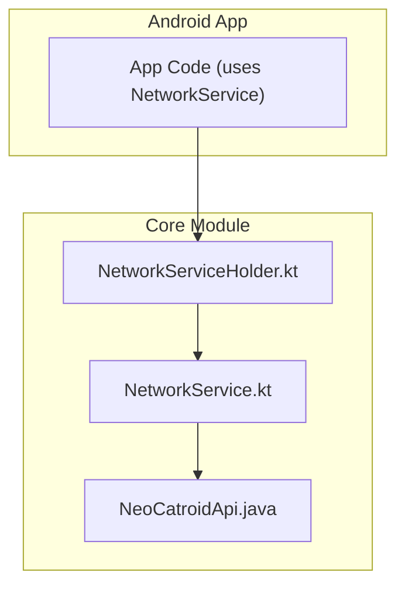
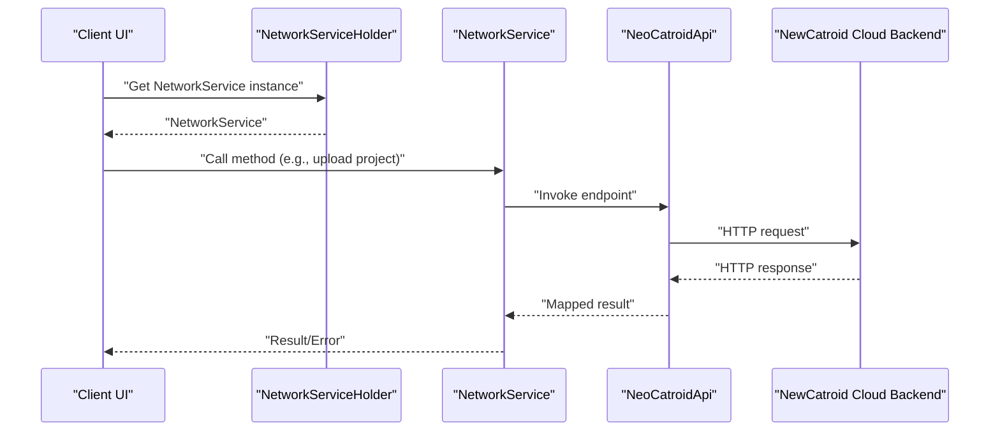
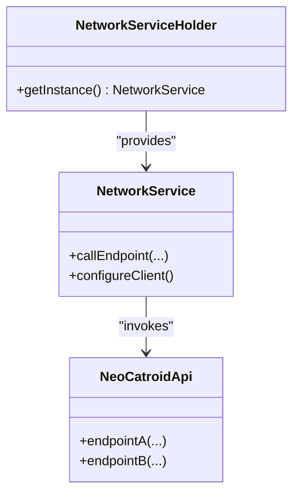

# Cloud API Reference

<cite>
**Referenced Files in This Document**
- [README.md](file://README.md)
- [NeoCatroidApi.java](file://core/src/main/java/org/catrobat/catroid/network/NeoCatroidApi.java)
- [NetworkService.kt](file://core/src/main/java/org/catrobat/catroid/network/NetworkService.kt)
- [NetworkServiceHolder.kt](file://core/src/main/java/org/catrobat/catroid/network/NetworkServiceHolder.kt)
</cite>

## Table of Contents
1. [Introduction](#introduction)
2. [Project Structure](#project-structure)
3. [Core Components](#core-components)
4. [Architecture Overview](#architecture-overview)
5. [Detailed Component Analysis](#detailed-component-analysis)
6. [Dependency Analysis](#dependency-analysis)
7. [Performance Considerations](#performance-considerations)
8. [Troubleshooting Guide](#troubleshooting-guide)
9. [Conclusion](#conclusion)
10. [Appendices](#appendices)

## Introduction
This document provides a comprehensive reference for NewCatroid’s cloud service APIs as implemented in the client codebase. It focuses on REST endpoints, request/response schemas, authentication requirements, and real-time collaboration via WebSocket where applicable. It also includes error handling guidance, rate limiting considerations, versioning policies, backward compatibility notes, and client implementation guidelines with SDK usage patterns.

The repository is primarily an Android application with a core module that defines network interfaces and services. The cloud API surface exposed to clients is defined through a Java interface and a Kotlin-based network service layer.

## Project Structure
At a high level, the relevant parts for cloud API integration are located under the core module:
- Network interface definitions (REST endpoints)
- Network service implementations and holders
- Supporting utilities for logging and runtime services

**Diagram sources**
- [NeoCatroidApi.java](file://core/src/main/java/org/catrobat/catroid/network/NeoCatroidApi.java)
- [NetworkService.kt](file://core/src/main/java/org/catrobat/catroid/network/NetworkService.kt)
- [NetworkServiceHolder.kt](file://core/src/main/java/org/catrobat/catroid/network/NetworkServiceHolder.kt)

**Section sources**
- [README.md](file://README.md)
- [NeoCatroidApi.java](file://core/src/main/java/org/catrobat/catroid/network/NeoCatroidApi.java)
- [NetworkService.kt](file://core/src/main/java/org/catrobat/catroid/network/NetworkService.kt)
- [NetworkServiceHolder.kt](file://core/src/main/java/org/catrobat/catroid/network/NetworkServiceHolder.kt)

## Core Components
- NeoCatroidApi.java: Declares the REST API methods and URL patterns used by the app to communicate with NewCatroid’s cloud backend.
- NetworkService.kt: Provides the concrete network operations, including HTTP calls and any shared configuration or interceptors.
- NetworkServiceHolder.kt: Supplies a singleton-like holder for the network service instance, enabling consistent access across the app.

These components collectively define how the client interacts with the cloud:
- Endpoints are declared in the API interface.
- The network service implements the actual transport logic.
- The holder centralizes instantiation and lifecycle management.

**Section sources**
- [NeoCatroidApi.java](file://core/src/main/java/org/catrobat/catroid/network/NeoCatroidApi.java)
- [NetworkService.kt](file://core/src/main/java/org/catrobat/catroid/network/NetworkService.kt)
- [NetworkServiceHolder.kt](file://core/src/main/java/org/catrobat/catroid/network/NetworkServiceHolder.kt)

## Architecture Overview
The client architecture for cloud communication follows a layered approach:
- API Layer: Declarative REST endpoints.
- Service Layer: Concrete network operations and data transformation.
- Holder Layer: Centralized access to the service instance.

**Diagram sources**
- [NeoCatroidApi.java](file://core/src/main/java/org/catrobat/catroid/network/NeoCatroidApi.java)
- [NetworkService.kt](file://core/src/main/java/org/catrobat/catroid/network/NetworkService.kt)
- [NetworkServiceHolder.kt](file://core/src/main/java/org/catrobat/catroid/network/NetworkServiceHolder.kt)

## Detailed Component Analysis

### REST API Surface
The REST API is defined declaratively in the API interface. Typical categories include:
- Authentication and session management
- Project CRUD operations (create, read, update, delete)
- Sharing and permissions
- Asset management (images, sounds, etc.)
- Search and discovery (featured projects, categories)
- User profile and account operations

For each endpoint, the following should be documented:
- Method and URL pattern
- Headers and query parameters
- Request body schema (JSON/XML)
- Response body schema
- Status codes and error payloads
- Authentication requirements

Implementation details such as base URL, timeouts, retries, and content negotiation are handled by the network service layer.

**Section sources**
- [NeoCatroidApi.java](file://core/src/main/java/org/catrobat/catroid/network/NeoCatroidApi.java)

### Network Service Implementation
The network service encapsulates:
- HTTP client configuration (base URL, headers, interceptors)
- Serialization/deserialization settings
- Error mapping and retry strategies
- Optional caching or compression

It exposes typed methods that call into the API interface and return domain models or responses suitable for the app layer.

**Section sources**
- [NetworkService.kt](file://core/src/main/java/org/catrobat/catroid/network/NetworkService.kt)

### Service Holder
The holder provides a centralized way to obtain the network service instance, ensuring consistent configuration and lifecycle management across the app.

**Section sources**
- [NetworkServiceHolder.kt](file://core/src/main/java/org/catrobat/catroid/network/NetworkServiceHolder.kt)

### Real-Time Collaboration (WebSocket)
If real-time collaboration features are supported, they would typically use WebSocket connections for live updates (e.g., collaborative editing). In this repository, WebSocket-specific client code is not present in the core network package; if implemented elsewhere, it would follow similar patterns:
- Connection establishment and authentication handshake
- Message formats (event types, payload schemas)
- Reconnection and error handling
- Event subscription and unsubscription

Where applicable, document:
- Endpoint URL and upgrade headers
- Authentication tokens or handshakes
- Message envelope structure
- Event taxonomy and semantics
- Backpressure and rate limits

[No sources needed since this section doesn't analyze specific files]

### Authentication Requirements
Authentication is typically managed via:
- Token-based schemes (e.g., bearer tokens)
- Session cookies
- OAuth flows

Ensure all authenticated endpoints require valid credentials and handle token refresh gracefully.

[No sources needed since this section doesn't analyze specific files]

### Error Handling and Debugging
Common error scenarios include:
- Network errors (timeouts, DNS failures)
- HTTP status codes (4xx, 5xx)
- Validation errors (malformed requests)
- Authorization failures (invalid/expired tokens)

Recommendations:
- Map HTTP statuses to user-friendly messages
- Include correlation IDs for server-side tracing
- Log sufficient context without exposing sensitive data
- Provide retry/backoff for transient errors

**Section sources**
- [NetworkService.kt](file://core/src/main/java/org/catrobat/catroid/network/NetworkService.kt)

### Rate Limiting and Versioning
Rate limiting:
- Respect server-provided headers (e.g., Retry-After, X-RateLimit-*)
- Implement exponential backoff with jitter
- Queue or throttle requests at the client layer

Versioning:
- Prefer URL path versioning (e.g., /api/v1/) or header-based versioning
- Maintain backward compatibility when possible
- Deprecation notices and migration guides

[No sources needed since this section doesn't analyze specific files]

### Client Implementation Guidelines and SDK Usage Patterns
Guidelines:
- Use the holder to obtain the network service once per process or per feature scope.
- Wrap API calls with proper error handling and user feedback.
- Avoid blocking the main thread; use asynchronous execution.
- Cache frequently accessed data where appropriate.
- Validate inputs before sending requests.

SDK usage patterns:
- Initialize the network service early in app startup.
- Inject the service into repositories or use cases.
- Handle authentication state changes centrally.
- Centralize logging and metrics collection.

**Section sources**
- [NetworkServiceHolder.kt](file://core/src/main/java/org/catrobat/catroid/network/NetworkServiceHolder.kt)
- [NetworkService.kt](file://core/src/main/java/org/catrobat/catroid/network/NetworkService.kt)

## Dependency Analysis
The dependency flow among key components is straightforward:
- The app depends on the holder to get the network service.
- The network service depends on the API interface for endpoint declarations.
- The API interface declares the contract with the cloud backend.

**Diagram sources**
- [NetworkServiceHolder.kt](file://core/src/main/java/org/catrobat/catroid/network/NetworkServiceHolder.kt)
- [NetworkService.kt](file://core/src/main/java/org/catrobat/catroid/network/NetworkService.kt)
- [NeoCatroidApi.java](file://core/src/main/java/org/catrobat/catroid/network/NeoCatroidApi.java)

**Section sources**
- [NeoCatroidApi.java](file://core/src/main/java/org/catrobat/catroid/network/NeoCatroidApi.java)
- [NetworkService.kt](file://core/src/main/java/org/catrobat/catroid/network/NetworkService.kt)
- [NetworkServiceHolder.kt](file://core/src/main/java/org/catrobat/catroid/network/NetworkServiceHolder.kt)

## Performance Considerations
- Use connection pooling and keep-alive for HTTP clients.
- Compress large payloads where supported.
- Paginate list endpoints and avoid loading entire datasets.
- Cache immutable resources locally.
- Debounce rapid successive requests (e.g., search).
- Monitor latency and error rates; instrument critical paths.

[No sources needed since this section provides general guidance]

## Troubleshooting Guide
Common issues and resolutions:
- Authentication failures: Verify token validity and refresh flow.
- Timeouts: Check network conditions and adjust timeouts/retries.
- Malformed requests: Validate schemas and required fields.
- Server errors: Inspect logs and correlation IDs; retry with backoff.

Use logging utilities and structured logs to capture:
- Request URLs and methods
- Response status codes
- Error messages and stack traces (sanitized)

**Section sources**
- [NetworkService.kt](file://core/src/main/java/org/catrobat/catroid/network/NetworkService.kt)

## Conclusion
NewCatroid’s cloud API integration is centered around a clear separation of concerns:
- Declarative REST endpoints in the API interface
- Concrete network operations in the service layer
- Centralized access via the holder

Adhering to the guidelines above will help ensure robust, maintainable, and performant client integrations. For real-time collaboration, extend the architecture with WebSocket support following similar patterns for authentication, message formatting, and error handling.

[No sources needed since this section summarizes without analyzing specific files]

## Appendices

### Example Operations (Conceptual)
- Upload a project:
  - Endpoint: POST /api/v1/projects
  - Headers: Authorization, Content-Type
  - Body: Project metadata and file references
  - Response: Project ID and status
- Share a project:
  - Endpoint: PUT /api/v1/projects/{id}/permissions
  - Body: User roles and access levels
  - Response: Updated permissions
- Collaborative editing:
  - WebSocket: wss://.../ws/collab
  - Handshake: Auth token
  - Events: join, leave, patch, snapshot

[No sources needed since this section doesn't analyze specific files]