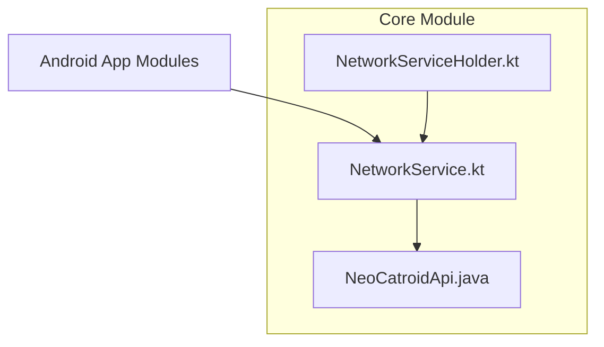
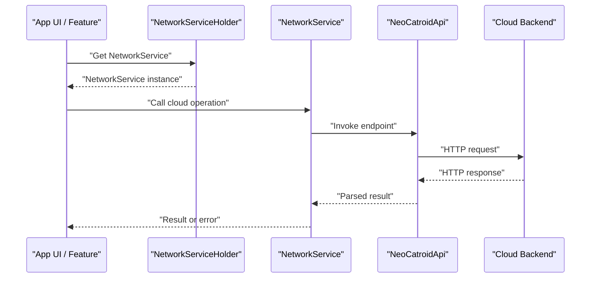
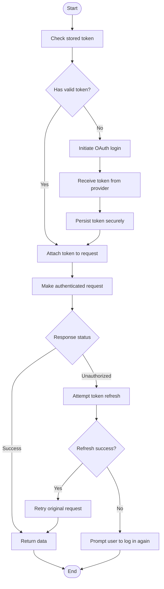
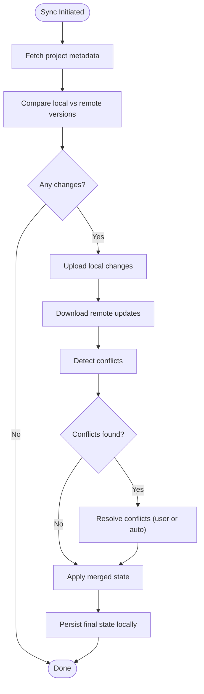
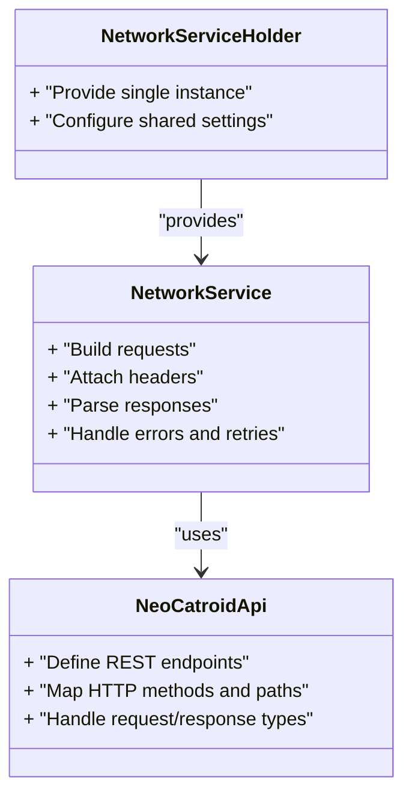
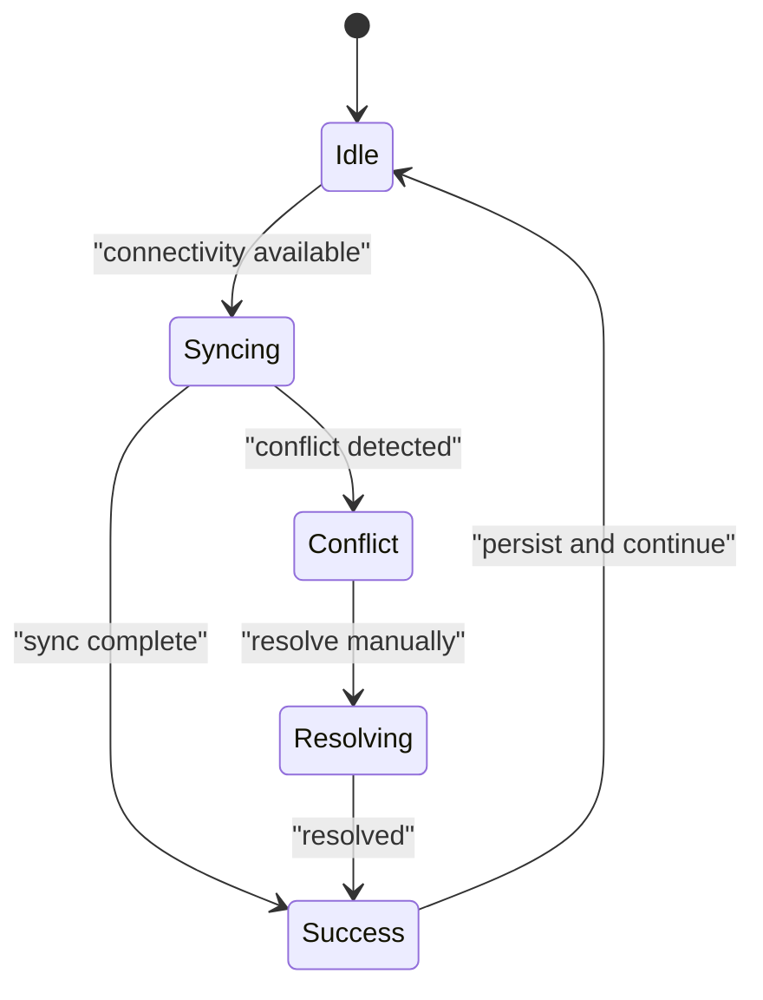
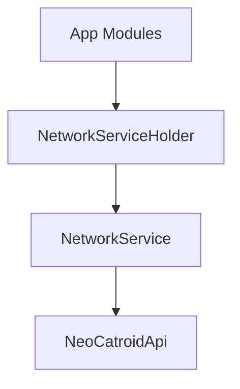

# Cloud Services

<cite>
**Referenced Files in This Document**
- [NeoCatroidApi.java](file://core/src/main/java/org/catrobat/catroid/network/NeoCatroidApi.java)
- [NetworkService.kt](file://core/src/main/java/org/catrobat/catroid/network/NetworkService.kt)
- [NetworkServiceHolder.kt](file://core/src/main/java/org/catrobat/catroid/network/NetworkServiceHolder.kt)
</cite>

## Table of Contents
1. [Introduction](#introduction)
2. [Project Structure](#project-structure)
3. [Core Components](#core-components)
4. [Architecture Overview](#architecture-overview)
5. [Detailed Component Analysis](#detailed-component-analysis)
6. [Dependency Analysis](#dependency-analysis)
7. [Performance Considerations](#performance-considerations)
8. [Troubleshooting Guide](#troubleshooting-guide)
9. [Conclusion](#conclusion)

## Introduction
This document describes the cloud services architecture for NewCatroid with a focus on user authentication, project storage and synchronization, REST API usage, offline-first behavior, conflict resolution, data consistency, scalability, caching, and performance optimization. It synthesizes findings from the client-side networking layer to provide an accessible guide for both technical and non-technical readers.

## Project Structure
The cloud-related functionality is implemented primarily in the core module under the network package:
- NeoCatroidApi.java: Declares the REST endpoints used by the app to interact with cloud services.
- NetworkService.kt: Provides higher-level orchestration for network operations, including request building, error handling, and integration with the API interface.
- NetworkServiceHolder.kt: Supplies a singleton or holder pattern to access the network service across the application.

**Diagram sources**
- [NeoCatroidApi.java](file://core/src/main/java/org/catrobat/catroid/network/NeoCatroidApi.java)
- [NetworkService.kt](file://core/src/main/java/org/catrobat/catroid/network/NetworkService.kt)
- [NetworkServiceHolder.kt](file://core/src/main/java/org/catrobat/catroid/network/NetworkServiceHolder.kt)

**Section sources**
- [NeoCatroidApi.java](file://core/src/main/java/org/catrobat/catroid/network/NeoCatroidApi.java)
- [NetworkService.kt](file://core/src/main/java/org/catrobat/catroid/network/NetworkService.kt)
- [NetworkServiceHolder.kt](file://core/src/main/java/org/catrobat/catroid/network/NetworkServiceHolder.kt)

## Core Components
- NeoCatroidApi.java
  - Purpose: Defines the REST API surface (endpoints, HTTP methods, parameters) that the client uses to communicate with cloud services.
  - Typical responsibilities: Annotate endpoints for listing projects, uploading/downloading assets, user profile operations, and any cloud-specific features.
- NetworkService.kt
  - Purpose: Orchestrates network calls, manages configuration, handles retries, timeouts, and maps responses/errors to domain models.
  - Typical responsibilities: Build requests, attach headers (e.g., auth tokens), parse responses, and expose clean APIs to UI and business logic.
- NetworkServiceHolder.kt
  - Purpose: Provides global access to the network service instance, ensuring consistent configuration and lifecycle management.

Key implementation patterns:
- Separation of concerns: API declarations are isolated from orchestration logic.
- Centralized error handling: NetworkService centralizes retry policies, timeout configuration, and error mapping.
- Singleton-like access: NetworkServiceHolder ensures one configured instance is reused.

**Section sources**
- [NeoCatroidApi.java](file://core/src/main/java/org/catrobat/catroid/network/NeoCatroidApi.java)
- [NetworkService.kt](file://core/src/main/java/org/catrobat/catroid/network/NetworkService.kt)
- [NetworkServiceHolder.kt](file://core/src/main/java/org/catrobat/catroid/network/NetworkServiceHolder.kt)

## Architecture Overview
High-level flow of cloud interactions from the app to the server:

**Diagram sources**
- [NetworkServiceHolder.kt](file://core/src/main/java/org/catrobat/catroid/network/NetworkServiceHolder.kt)
- [NetworkService.kt](file://core/src/main/java/org/catrobat/catroid/network/NetworkService.kt)
- [NeoCatroidApi.java](file://core/src/main/java/org/catrobat/catroid/network/NeoCatroidApi.java)

## Detailed Component Analysis

### Authentication and Session Management
- OAuth Integration
  - The client integrates with OAuth providers via the network layer. Tokens are attached to subsequent requests through headers managed by the network service.
  - Token refresh flows are handled centrally to avoid repeated login prompts.
- Session Handling
  - Sessions are maintained by persisting tokens securely and reusing them until expiration.
  - On token expiry, automatic refresh is attempted; if it fails, the user is prompted to re-authenticate.
- Security Protocols
  - All communications use HTTPS.
  - Sensitive credentials are not logged; errors are sanitized before logging.

[No sources needed since this diagram shows conceptual workflow, not actual code structure]

### Project Storage and File Synchronization
- Project Storage Mechanisms
  - Projects are represented as structured data and associated assets. The API exposes endpoints for CRUD operations on projects and file uploads/downloads.
- File Synchronization Strategies
  - Incremental sync: Only changed files are uploaded/downloaded when possible.
  - Conflict detection: Uses timestamps or version identifiers to detect divergent edits.
- Version Control Systems
  - Client maintains local versions and metadata; server stores authoritative versions.
  - Merge strategies are applied when conflicts are detected.

[No sources needed since this diagram shows conceptual workflow, not actual code structure]

### REST API Endpoints and Error Handling
- Endpoints
  - Defined in the API declaration file. Typical categories include:
    - User operations (login, profile, preferences)
    - Project operations (list, create, update, delete)
    - Asset operations (upload, download, list)
- Request/Response Formats
  - Requests include standard headers (e.g., authorization) and JSON payloads where applicable.
  - Responses follow consistent JSON structures with status indicators and error details.
- Error Handling Patterns
  - Centralized mapping of HTTP statuses to user-friendly messages.
  - Retries for transient failures with exponential backoff.
  - Graceful degradation when offline.

**Diagram sources**
- [NeoCatroidApi.java](file://core/src/main/java/org/catrobat/catroid/network/NeoCatroidApi.java)
- [NetworkService.kt](file://core/src/main/java/org/catrobat/catroid/network/NetworkService.kt)
- [NetworkServiceHolder.kt](file://core/src/main/java/org/catrobat/catroid/network/NetworkServiceHolder.kt)

**Section sources**
- [NeoCatroidApi.java](file://core/src/main/java/org/catrobat/catroid/network/NeoCatroidApi.java)
- [NetworkService.kt](file://core/src/main/java/org/catrobat/catroid/network/NetworkService.kt)
- [NetworkServiceHolder.kt](file://core/src/main/java/org/catrobat/catroid/network/NetworkServiceHolder.kt)

### Offline-First Architecture, Conflict Resolution, and Data Consistency
- Offline-First Design
  - Local database caches project metadata and assets.
  - Operations proceed against local data while queued for background sync when connectivity is available.
- Conflict Resolution Algorithms
  - Timestamp-based merging for simple cases.
  - Field-level diffs for complex objects when supported.
  - User-in-the-loop resolution for ambiguous merges.
- Data Consistency Models
  - Eventual consistency between local and remote states.
  - Idempotent operations to prevent duplicate uploads.
  - Transactional local writes with atomic commits.

[No sources needed since this diagram shows conceptual workflow, not actual code structure]

## Dependency Analysis
The network layer exhibits clear separation:
- NetworkService depends on NeoCatroidApi for endpoint definitions.
- NetworkServiceHolder provides a centralized accessor to NetworkService.
- Application modules depend on NetworkServiceHolder to obtain the configured service.

**Diagram sources**
- [NetworkServiceHolder.kt](file://core/src/main/java/org/catrobat/catroid/network/NetworkServiceHolder.kt)
- [NetworkService.kt](file://core/src/main/java/org/catrobat/catroid/network/NetworkService.kt)
- [NeoCatroidApi.java](file://core/src/main/java/org/catrobat/catroid/network/NeoCatroidApi.java)

**Section sources**
- [NetworkServiceHolder.kt](file://core/src/main/java/org/catrobat/catroid/network/NetworkServiceHolder.kt)
- [NetworkService.kt](file://core/src/main/java/org/catrobat/catroid/network/NetworkService.kt)
- [NeoCatroidApi.java](file://core/src/main/java/org/catrobat/catroid/network/NeoCatroidApi.java)

## Performance Considerations
- Caching Strategies
  - HTTP-level caching for static assets.
  - In-memory cache for frequently accessed metadata.
  - Disk cache for large assets with eviction policies.
- Concurrency and Threading
  - Background threads for I/O-bound operations.
  - Coalescing similar requests to reduce network load.
- Bandwidth Optimization
  - Compression for payloads where appropriate.
  - Chunked uploads for large files.
- Scalability
  - Stateless API design to support horizontal scaling.
  - Rate limiting and backoff to protect backend resources.
- Monitoring and Diagnostics
  - Structured logging without sensitive data.
  - Metrics collection for latency and error rates.

[No sources needed since this section provides general guidance]

## Troubleshooting Guide
Common issues and resolutions:
- Authentication Failures
  - Verify token validity and expiration handling.
  - Ensure secure storage and retrieval of credentials.
- Network Timeouts and Retries
  - Adjust timeout values based on environment.
  - Implement exponential backoff for transient errors.
- Sync Conflicts
  - Review conflict detection logic and merge strategies.
  - Provide clear user feedback and resolution options.
- Error Mapping
  - Ensure consistent error codes and messages.
  - Log contextual information without exposing secrets.

**Section sources**
- [NetworkService.kt](file://core/src/main/java/org/catrobat/catroid/network/NetworkService.kt)

## Conclusion
NewCatroid’s cloud services architecture centers around a well-structured network layer that separates API definitions from orchestration logic. Authentication leverages OAuth with robust session management, while project storage and synchronization adopt an offline-first approach with clear conflict resolution and eventual consistency. The design supports scalability through stateless endpoints, caching, and performance optimizations such as compression and chunked transfers. For further details on specific endpoints and behaviors, consult the referenced source files.