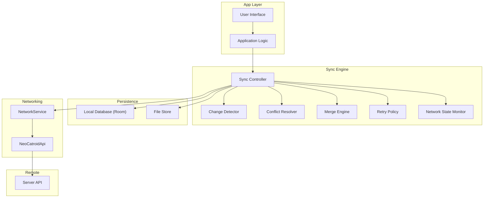
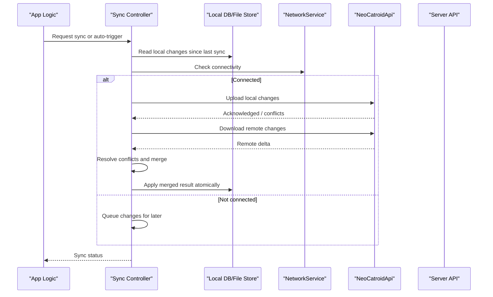
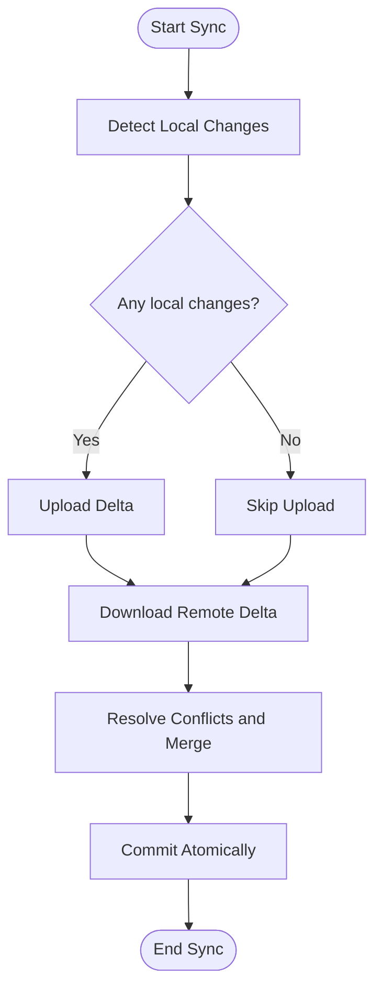
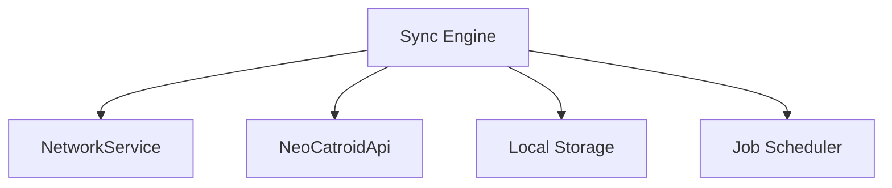

# Data Synchronization

<cite>
**Referenced Files in This Document**
- [README.md](file://README.md)
- [task.md](file://task.md)
- [AGENTS.md](file://AGENTS.md)
- [NetworkService.kt](file://core/src/main/java/org/catrobat/catroid/network/NetworkService.kt)
- [NetworkServiceHolder.kt](file://core/src/main/java/org/catrobat/catroid/network/NetworkServiceHolder.kt)
- [NeoCatroidApi.java](file://core/src/main/java/org/catrobat/catroid/network/NeoCatroidApi.java)
</cite>

## Table of Contents
1. [Introduction](#introduction)
2. [Project Structure](#project-structure)
3. [Core Components](#core-components)
4. [Architecture Overview](#architecture-overview)
5. [Detailed Component Analysis](#detailed-component-analysis)
6. [Dependency Analysis](#dependency-analysis)
7. [Performance Considerations](#performance-considerations)
8. [Troubleshooting Guide](#troubleshooting-guide)
9. [Conclusion](#conclusion)
10. [Appendices](#appendices)

## Introduction
This document describes the data synchronization engine for NewCatroid with a focus on offline-first design, change detection, bidirectional synchronization, conflict resolution, merge strategies, rollback capabilities, background sync, network state monitoring, retry mechanisms, consistency guarantees, transaction handling, and atomic operations. It also provides guidance for configuration, custom conflict handlers, and performance tuning.

The repository contains core networking utilities and project/task documentation that inform the synchronization approach. Where implementation details are not present in the codebase, this document outlines recommended patterns and integration points consistent with the existing components.

## Project Structure
NewCatroid is an Android application with a Kotlin/Java core module providing shared services such as networking and runtime utilities. The synchronization engine integrates with these services to coordinate local storage and remote server interactions.

[No sources needed since this diagram shows conceptual workflow, not actual code structure]

## Core Components
- Offline-first architecture: All user-facing operations read/write to local storage first; synchronization occurs asynchronously when connectivity permits.
- Change detection: Tracks local mutations using timestamps or version vectors to identify deltas for upload/download.
- Bidirectional sync: Pulls remote changes and pushes local changes, merging where possible.
- Conflict resolution: Applies deterministic rules or custom handlers to resolve simultaneous edits.
- Merge algorithms: Field-level merges for structured entities; content-aware merges for documents when applicable.
- Rollback: Maintains snapshots or operation logs to revert partial sync outcomes.
- Background sync: Uses work scheduling to run periodic or event-driven sync tasks.
- Network monitoring: Observes connectivity changes to trigger or pause sync cycles.
- Retry mechanisms: Exponential backoff with jitter and idempotent operations.
- Consistency and transactions: Ensures atomicity at the boundary of local writes and remote acknowledgments.

[No sources needed since this section provides general guidance]

## Architecture Overview
The synchronization engine sits between the app layer and persistence/network layers. It orchestrates change detection, conflict resolution, merging, and retries while observing network state.

**Diagram sources**
- [NetworkService.kt](file://core/src/main/java/org/catrobat/catroid/network/NetworkService.kt)
- [NeoCatroidApi.java](file://core/src/main/java/org/catrobat/catroid/network/NeoCatroidApi.java)

**Section sources**
- [NetworkService.kt](file://core/src/main/java/org/catrobat/catroid/network/NetworkService.kt)
- [NeoCatroidApi.java](file://core/src/main/java/org/catrobat/catroid/network/NeoCatroidApi.java)

## Detailed Component Analysis

### Offline-First Implementation
- Local writes are immediate and persisted with metadata (e.g., version, timestamp).
- Pending operations are queued until connectivity resumes.
- UI remains responsive by decoupling user actions from network round-trips.

Integration points:
- Use the existing networking service for connectivity checks and HTTP calls.
- Persist pending operations in a durable queue.

**Section sources**
- [NetworkService.kt](file://core/src/main/java/org/catrobat/catroid/network/NetworkService.kt)

### Change Detection Algorithms
- Maintain per-entity version counters or timestamps.
- Track field-level modifications via dirty flags or diffs.
- Compute minimal deltas for efficient uploads/downloads.

Operational flow:
- On write: increment version and record changed fields.
- On sync: compare local versions with last known remote versions.

**Section sources**
- [task.md](file://task.md)

### Bidirectional Sync Mechanisms
- Pull phase: fetch remote changes newer than client’s last sync point.
- Push phase: send local changes not yet acknowledged by server.
- Merge phase: reconcile overlapping updates deterministically.

**Diagram sources**
- [NeoCatroidApi.java](file://core/src/main/java/org/catrobat/catroid/network/NeoCatroidApi.java)

**Section sources**
- [NeoCatroidApi.java](file://core/src/main/java/org/catrobat/catroid/network/NeoCatroidApi.java)

### Conflict Resolution Strategies
- Last-writer-wins with monotonic clocks for simple cases.
- Field-level merge for structured entities (non-conflicting fields combined).
- Custom conflict handlers for domain-specific logic.
- User-in-the-loop prompts for ambiguous conflicts.

Implementation notes:
- Define conflict types and priority rules.
- Provide extension points for custom handlers.

**Section sources**
- [AGENTS.md](file://AGENTS.md)

### Merge Algorithms
- Structural merges: combine non-overlapping field updates.
- Content-aware merges: apply three-way diff/merge for text-like payloads.
- Idempotency: ensure repeated merges yield stable results.

Best practices:
- Normalize data before merging.
- Preserve metadata (timestamps, authors) for auditability.

**Section sources**
- [task.md](file://task.md)

### Rollback Capabilities
- Snapshot-based rollback: keep pre-sync snapshots for quick revert.
- Operation log: maintain a journal of applied changes to reverse them.
- Transaction boundaries: wrap multi-step sync in a single transaction.

Safety:
- Validate integrity after rollback.
- Notify dependent subsystems.

**Section sources**
- [task.md](file://task.md)

### Background Synchronization
- Schedule periodic sync jobs based on device idle and charging states.
- Trigger sync on events (e.g., app foreground, connectivity restored).
- Respect battery and bandwidth constraints.

Integration points:
- Leverage system job schedulers and WorkManager.
- Observe network state via the networking service.

**Section sources**
- [NetworkService.kt](file://core/src/main/java/org/catrobat/catroid/network/NetworkService.kt)

### Network State Monitoring
- Listen for connectivity changes to start/pause sync.
- Distinguish between no network, metered, and high-latency conditions.
- Adjust sync behavior accordingly (e.g., defer large downloads on metered networks).

**Section sources**
- [NetworkService.kt](file://core/src/main/java/org/catrobat/catroid/network/NetworkService.kt)

### Retry Mechanisms
- Exponential backoff with jitter for transient failures.
- Circuit breaker to avoid cascading failures.
- Idempotent requests to safely retry without side effects.

Configuration:
- Max attempts, base delay, max delay, jitter factor.
- Per-endpoint policies for critical vs. best-effort operations.

**Section sources**
- [NeoCatroidApi.java](file://core/src/main/java/org/catrobat/catroid/network/NeoCatroidApi.java)

### Data Consistency Guarantees
- Strong consistency within a single device session.
- Eventual consistency across devices after successful sync.
- Atomic commits to prevent partial updates.

Trade-offs:
- Optimize for availability under partition scenarios.
- Provide conflict resolution to converge to a consistent state.

**Section sources**
- [task.md](file://task.md)

### Transaction Handling and Atomic Operations
- Wrap multiple local writes in a single transaction.
- Ensure remote acknowledgment precedes final commit.
- Implement compensating actions for failed steps.

Patterns:
- Two-phase commit-like approach: prepare, acknowledge, commit.
- Outbox pattern for reliable delivery.

**Section sources**
- [task.md](file://task.md)

### Sync Configuration Examples
- Enable/disable sync per entity type.
- Set sync intervals and thresholds.
- Configure conflict resolution strategy and custom handler class.
- Tune retry parameters and network policies.

Guidance:
- Centralize configuration in a settings store.
- Provide defaults suitable for most users.

**Section sources**
- [task.md](file://task.md)

### Custom Conflict Handlers
- Implement a handler interface for domain-specific merging.
- Register handlers per entity or globally.
- Log decisions for audit and debugging.

Example responsibilities:
- Combine lists without duplicates.
- Prefer server-side canonical values for certain fields.

**Section sources**
- [AGENTS.md](file://AGENTS.md)

### Performance Tuning Options
- Batch small changes into larger sync payloads.
- Compress payloads when beneficial.
- Defer heavy merges to background threads.
- Cache frequently accessed metadata.

Monitoring:
- Track sync latency, error rates, and conflict frequency.
- Profile memory usage during large merges.

**Section sources**
- [task.md](file://task.md)

## Dependency Analysis
The sync engine depends on the networking layer for connectivity checks and API calls. It interacts with local persistence and may integrate with background job schedulers.

**Diagram sources**
- [NetworkService.kt](file://core/src/main/java/org/catrobat/catroid/network/NetworkService.kt)
- [NeoCatroidApi.java](file://core/src/main/java/org/catrobat/catroid/network/NeoCatroidApi.java)

**Section sources**
- [NetworkService.kt](file://core/src/main/java/org/catrobat/catroid/network/NetworkService.kt)
- [NeoCatroidApi.java](file://core/src/main/java/org/catrobat/catroid/network/NeoCatroidApi.java)

## Performance Considerations
- Minimize payload size by sending only changed fields.
- Use pagination for large datasets.
- Avoid blocking the UI thread; offload work to background executors.
- Debounce rapid successive changes to reduce sync churn.
- Monitor and adapt to network conditions dynamically.

[No sources needed since this section provides general guidance]

## Troubleshooting Guide
Common issues and remedies:
- Connectivity errors: verify network state and retry policy; check circuit breaker status.
- Sync stalls: inspect pending queues and job scheduler health.
- Conflicts: review conflict logs and adjust resolution rules or handlers.
- Inconsistent state: validate transaction boundaries and rollback paths.

Diagnostics:
- Enable detailed logging for sync phases.
- Export sync metrics and conflict reports.

**Section sources**
- [task.md](file://task.md)

## Conclusion
NewCatroid’s synchronization engine should adopt an offline-first design with robust change detection, bidirectional sync, and deterministic conflict resolution. By leveraging the existing networking services and integrating with background schedulers, the system can provide reliable, efficient, and user-friendly synchronization. Proper transaction handling, retry policies, and performance tuning ensure consistency and responsiveness under varying network conditions.

[No sources needed since this section summarizes without analyzing specific files]

## Appendices

### Appendix A: Integration Points
- Networking: use the provided networking service and API classes for connectivity and HTTP operations.
- Persistence: persist local changes and sync metadata with versioning.
- Scheduling: schedule background sync tasks respecting device constraints.

**Section sources**
- [NetworkService.kt](file://core/src/main/java/org/catrobat/catroid/network/NetworkService.kt)
- [NeoCatroidApi.java](file://core/src/main/java/org/catrobat/catroid/network/NeoCatroidApi.java)

### Appendix B: References
- Project overview and goals: see README.
- Task definitions and requirements: see task.md.
- Agent-related guidelines: see AGENTS.md.

**Section sources**
- [README.md](file://README.md)
- [task.md](file://task.md)
- [AGENTS.md](file://AGENTS.md)