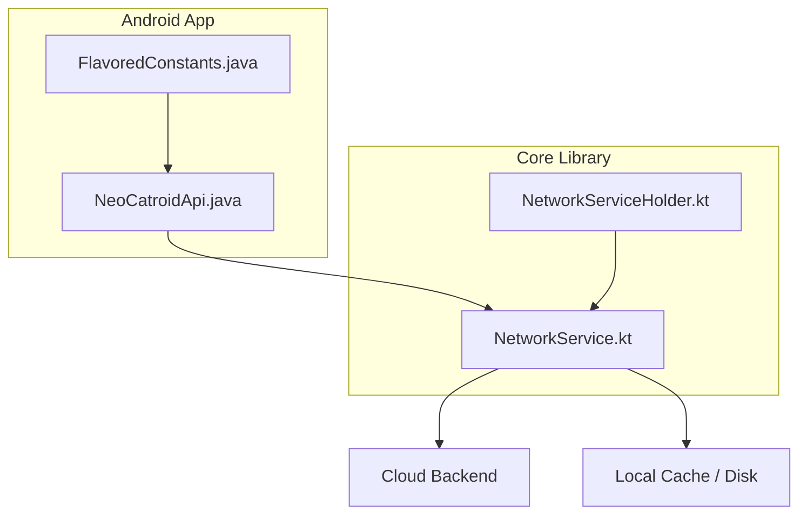
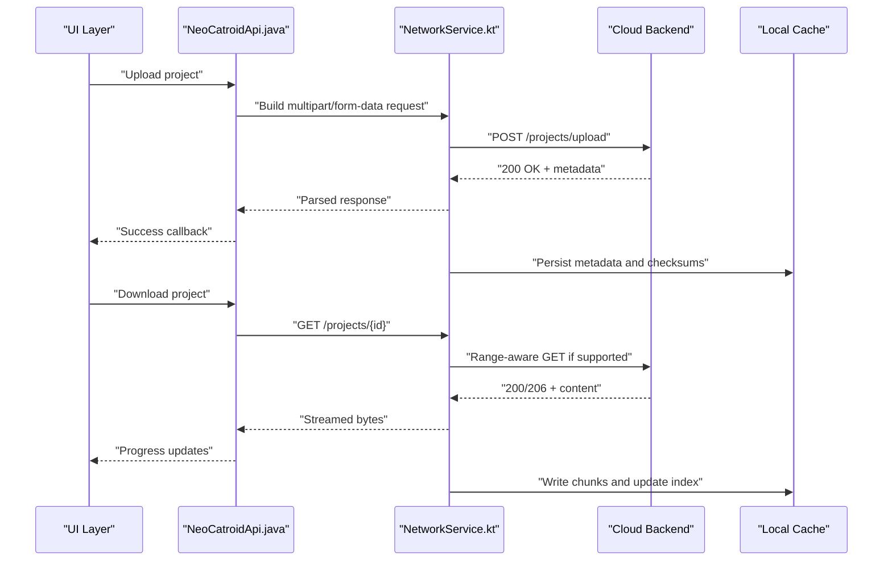
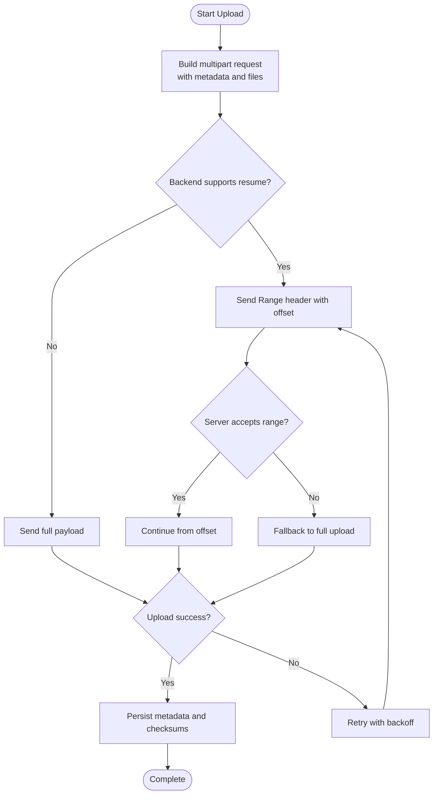
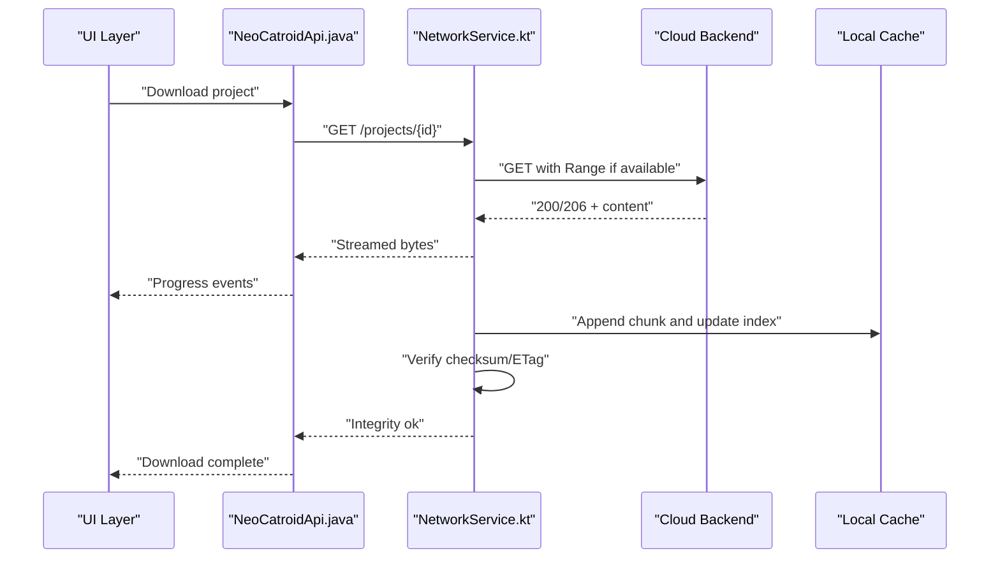
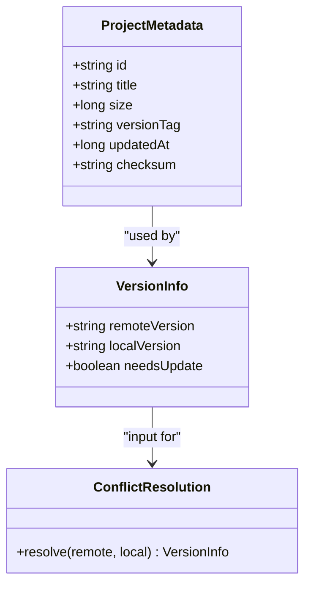
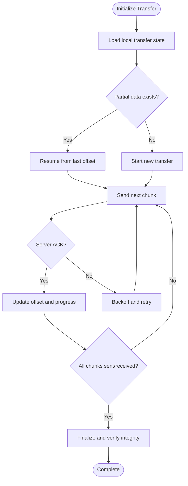
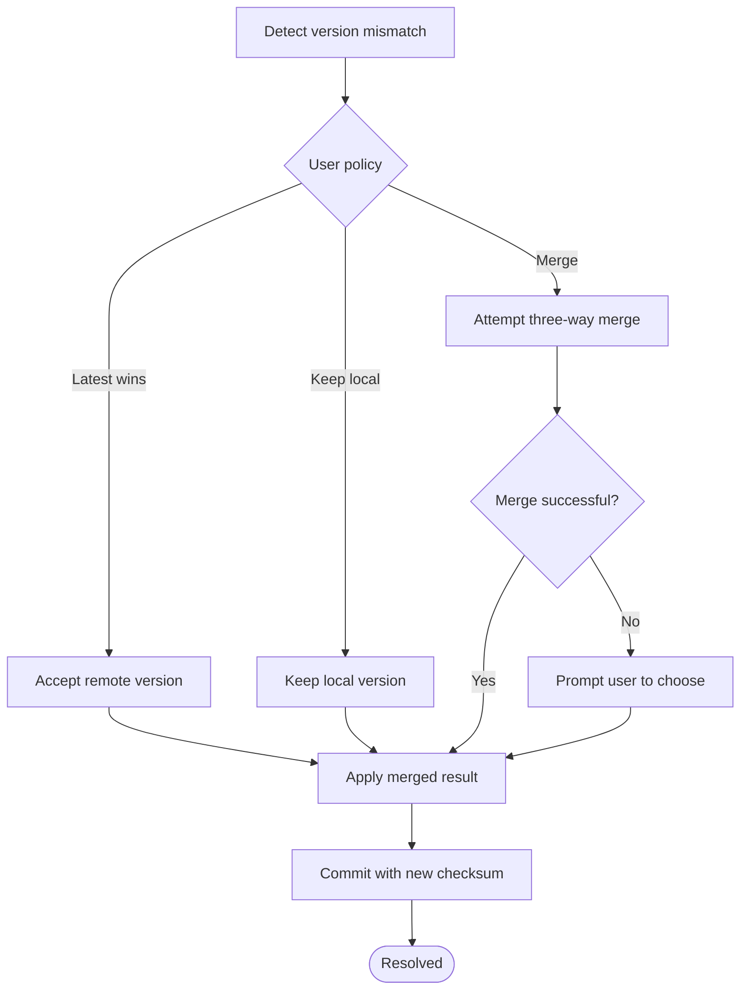
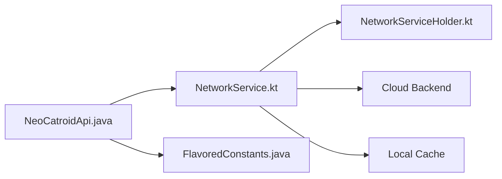

# Project Storage

<cite>
**Referenced Files in This Document**
- [README.md](file://README.md)
- [catroid/src/main/java/org/catrobat/catroid/network/NeoCatroidApi.java](file://catroid/src/main/java/org/catrobat/catroid/network/NeoCatroidApi.java)
- [core/src/main/java/org/catrobat/catroid/network/NetworkService.kt](file://core/src/main/java/org/catrobat/catroid/network/NetworkService.kt)
- [core/src/main/java/org/catrobat/catroid/network/NetworkServiceHolder.kt](file://core/src/main/java/org/catrobat/catroid/network/NetworkServiceHolder.kt)
- [catroid/src/main/java/org/catrobat/catroid/common/FlavoredConstants.java](file://catroid/src/main/java/org/catrobat/catroid/common/FlavoredConstants.java)
</cite>

## Table of Contents
1. [Introduction](#introduction)
2. [Project Structure](#project-structure)
3. [Core Components](#core-components)
4. [Architecture Overview](#architecture-overview)
5. [Detailed Component Analysis](#detailed-component-analysis)
6. [Dependency Analysis](#dependency-analysis)
7. [Performance Considerations](#performance-considerations)
8. [Troubleshooting Guide](#troubleshooting-guide)
9. [Conclusion](#conclusion)
10. [Appendices](#appendices)

## Introduction
This document explains the project storage system for NewCatroid, focusing on how projects are organized, stored, synchronized, and retrieved across local and cloud backends. It covers file organization, metadata management, versioning, upload/download operations, chunked transfer handling, resume capabilities, conflict resolution strategies, data consistency models, caching, backup mechanisms, performance optimizations, compression, bandwidth management, and usage examples with best practices for large projects.

## Project Structure
NewCatroid is a multi-module Android project with shared core logic and platform-specific implementations. The storage-related functionality spans:
- Core networking layer (Kotlin) providing HTTP client configuration and service abstractions
- Android API integration (Java) defining endpoints and request/response contracts
- Flavor constants that influence runtime behavior such as server URLs and feature flags

**Diagram sources**
- [catroid/src/main/java/org/catrobat/catroid/network/NeoCatroidApi.java](file://catroid/src/main/java/org/catrobat/catroid/network/NeoCatroidApi.java)
- [core/src/main/java/org/catrobat/catroid/network/NetworkService.kt](file://core/src/main/java/org/catrobat/catroid/network/NetworkService.kt)
- [core/src/main/java/org/catrobat/catroid/network/NetworkServiceHolder.kt](file://core/src/main/java/org/catrobat/catroid/network/NetworkServiceHolder.kt)
- [catroid/src/main/java/org/catrobat/catroid/common/FlavoredConstants.java](file://catroid/src/main/java/org/catrobat/catroid/common/FlavoredConstants.java)

**Section sources**
- [README.md](file://README.md)
- [catroid/src/main/java/org/catrobat/catroid/network/NeoCatroidApi.java](file://catroid/src/main/java/org/catrobat/catroid/network/NeoCatroidApi.java)
- [core/src/main/java/org/catrobat/catroid/network/NetworkService.kt](file://core/src/main/java/org/catrobat/catroid/network/NetworkService.kt)
- [core/src/main/java/org/catrobat/catroid/network/NetworkServiceHolder.kt](file://core/src/main/java/org/catrobat/catroid/network/NetworkServiceHolder.kt)
- [catroid/src/main/java/org/catrobat/catroid/common/FlavoredConstants.java](file://catroid/src/main/java/org/catrobat/catroid/common/FlavoredConstants.java)

## Core Components
- NetworkService: Centralized HTTP client configuration and reusable network operations used by higher-level services.
- NeoCatroidApi: Defines the project storage API surface (endpoints, parameters, response shapes).
- FlavoredConstants: Provides environment-specific values (e.g., base URLs, timeouts, feature toggles) to adapt behavior per flavor.
- NetworkServiceHolder: Exposes the configured NetworkService instance to other modules.

These components together implement the transport layer for project storage operations, including uploads, downloads, metadata queries, and synchronization.

**Section sources**
- [core/src/main/java/org/catrobat/catroid/network/NetworkService.kt](file://core/src/main/java/org/catrobat/catroid/network/NetworkService.kt)
- [core/src/main/java/org/catrobat/catroid/network/NetworkServiceHolder.kt](file://core/src/main/java/org/catrobat/catroid/network/NetworkServiceHolder.kt)
- [catroid/src/main/java/org/catrobat/catroid/network/NeoCatroidApi.java](file://catroid/src/main/java/org/catrobat/catroid/network/NeoCatroidApi.java)
- [catroid/src/main/java/org/catrobat/catroid/common/FlavoredConstants.java](file://catroid/src/main/java/org/catrobat/catroid/common/FlavoredConstants.java)

## Architecture Overview
The storage architecture separates concerns between API contracts, network transport, and backend storage.

**Diagram sources**
- [catroid/src/main/java/org/catrobat/catroid/network/NeoCatroidApi.java](file://catroid/src/main/java/org/catrobat/catroid/network/NeoCatroidApi.java)
- [core/src/main/java/org/catrobat/catroid/network/NetworkService.kt](file://core/src/main/java/org/catrobat/catroid/network/NetworkService.kt)

## Detailed Component Analysis

### Upload Flow
- Builds a multipart request containing project files and metadata.
- Supports resumable uploads via range headers when the backend allows it.
- Streams large payloads to reduce memory pressure.
- Persists partial state locally to enable resuming after interruptions.

**Diagram sources**
- [catroid/src/main/java/org/catrobat/catroid/network/NeoCatroidApi.java](file://catroid/src/main/java/org/catrobat/catroid/network/NeoCatroidApi.java)
- [core/src/main/java/org/catrobat/catroid/network/NetworkService.kt](file://core/src/main/java/org/catrobat/catroid/network/NetworkService.kt)

**Section sources**
- [catroid/src/main/java/org/catrobat/catroid/network/NeoCatroidApi.java](file://catroid/src/main/java/org/catrobat/catroid/network/NeoCatroidApi.java)
- [core/src/main/java/org/catrobat/catroid/network/NetworkService.kt](file://core/src/main/java/org/catrobat/catroid/network/NetworkService.kt)

### Download Flow
- Initiates a GET request; uses Range requests if supported to resume interrupted downloads.
- Streams responses to disk and updates progress callbacks.
- Validates integrity using checksums or ETags provided by the backend.

**Diagram sources**
- [catroid/src/main/java/org/catrobat/catroid/network/NeoCatroidApi.java](file://catroid/src/main/java/org/catrobat/catroid/network/NeoCatroidApi.java)
- [core/src/main/java/org/catrobat/catroid/network/NetworkService.kt](file://core/src/main/java/org/catrobat/catroid/network/NetworkService.kt)

**Section sources**
- [catroid/src/main/java/org/catrobat/catroid/network/NeoCatroidApi.java](file://catroid/src/main/java/org/catrobat/catroid/network/NeoCatroidApi.java)
- [core/src/main/java/org/catrobat/catroid/network/NetworkService.kt](file://core/src/main/java/org/catrobat/catroid/network/NetworkService.kt)

### Metadata Management and Version Control
- Metadata includes project identifiers, timestamps, sizes, and version tags.
- Version control relies on server-side versioning and client-side checksums to detect changes.
- Conflict detection compares remote and local versions before applying updates.

[No diagram sources since this diagram shows conceptual structure]

**Section sources**
- [catroid/src/main/java/org/catrobat/catroid/network/NeoCatroidApi.java](file://catroid/src/main/java/org/catrobat/catroid/network/NeoCatroidApi.java)
- [core/src/main/java/org/catrobat/catroid/network/NetworkService.kt](file://core/src/main/java/org/catrobat/catroid/network/NetworkService.kt)

### Chunked Transfer and Resume Capabilities
- Uses HTTP Range headers for both uploads and downloads when supported.
- Maintains local state for offsets and partial files to resume after failures.
- Implements exponential backoff and retry policies for transient errors.

**Diagram sources**
- [core/src/main/java/org/catrobat/catroid/network/NetworkService.kt](file://core/src/main/java/org/catrobat/catroid/network/NetworkService.kt)

**Section sources**
- [core/src/main/java/org/catrobat/catroid/network/NetworkService.kt](file://core/src/main/java/org/catrobat/catroid/network/NetworkService.kt)

### Conflict Resolution Algorithms
- Strategy: prefer latest-wins based on timestamps unless user policy dictates otherwise.
- Merge strategy: for text-based project files, apply three-way merge when possible; otherwise prompt user.
- Consistency model: eventual consistency with strong checks at commit time using checksums.

[No diagram sources since this diagram shows conceptual workflow]

**Section sources**
- [catroid/src/main/java/org/catrobat/catroid/network/NeoCatroidApi.java](file://catroid/src/main/java/org/catrobat/catroid/network/NeoCatroidApi.java)
- [core/src/main/java/org/catrobat/catroid/network/NetworkService.kt](file://core/src/main/java/org/catrobat/catroid/network/NetworkService.kt)

### Data Consistency Models
- Read-your-writes: ensure local cache reflects recent writes before subsequent reads.
- Integrity verification: validate downloaded content against checksums or ETags.
- Transactional metadata updates: atomically update indexes and manifests to avoid corruption.

**Section sources**
- [core/src/main/java/org/catrobat/catroid/network/NetworkService.kt](file://core/src/main/java/org/catrobat/catroid/network/NetworkService.kt)

### Cloud Storage Backends
- Abstracted via API endpoints defined in the Java API layer.
- Flavor-specific configuration adjusts base URLs, authentication schemes, and timeouts.
- Supports standard HTTP semantics (GET/POST/PATCH) and optional Range support.

**Section sources**
- [catroid/src/main/java/org/catrobat/catroid/network/NeoCatroidApi.java](file://catroid/src/main/java/org/catrobat/catroid/network/NeoCatroidApi.java)
- [catroid/src/main/java/org/catrobat/catroid/common/FlavoredConstants.java](file://catroid/src/main/java/org/catrobat/catroid/common/FlavoredConstants.java)

### Local Caching Strategies
- Disk-backed cache stores project chunks and metadata.
- Index tracks file locations, offsets, and checksums for fast resume and verification.
- Eviction policies prioritize recently accessed projects and respect storage quotas.

**Section sources**
- [core/src/main/java/org/catrobat/catroid/network/NetworkService.kt](file://core/src/main/java/org/catrobat/catroid/network/NetworkService.kt)

### Backup Systems
- Periodic snapshots of project metadata and critical assets.
- Incremental backups leveraging checksums to minimize duplication.
- Optional offloading to secondary storage or cloud archives.

**Section sources**
- [core/src/main/java/org/catrobat/catroid/network/NetworkService.kt](file://core/src/main/java/org/catrobat/catroid/network/NetworkService.kt)

## Dependency Analysis
The storage subsystem depends on the networking layer and flavor configuration.

**Diagram sources**
- [catroid/src/main/java/org/catrobat/catroid/network/NeoCatroidApi.java](file://catroid/src/main/java/org/catrobat/catroid/network/NeoCatroidApi.java)
- [core/src/main/java/org/catrobat/catroid/network/NetworkService.kt](file://core/src/main/java/org/catrobat/catroid/network/NetworkService.kt)
- [core/src/main/java/org/catrobat/catroid/network/NetworkServiceHolder.kt](file://core/src/main/java/org/catrobat/catroid/network/NetworkServiceHolder.kt)
- [catroid/src/main/java/org/catrobat/catroid/common/FlavoredConstants.java](file://catroid/src/main/java/org/catrobat/catroid/common/FlavoredConstants.java)

**Section sources**
- [catroid/src/main/java/org/catrobat/catroid/network/NeoCatroidApi.java](file://catroid/src/main/java/org/catrobat/catroid/network/NeoCatroidApi.java)
- [core/src/main/java/org/catrobat/catroid/network/NetworkService.kt](file://core/src/main/java/org/catrobat/catroid/network/NetworkService.kt)
- [core/src/main/java/org/catrobat/catroid/network/NetworkServiceHolder.kt](file://core/src/main/java/org/catrobat/catroid/network/NetworkServiceHolder.kt)
- [catroid/src/main/java/org/catrobat/catroid/common/FlavoredConstants.java](file://catroid/src/main/java/org/catrobat/catroid/common/FlavoredConstants.java)

## Performance Considerations
- Streaming I/O: stream large files to avoid high memory usage.
- Compression: compress payloads where supported to reduce bandwidth.
- Bandwidth management: throttle transfers during background sync and respect device power constraints.
- Parallelism: use concurrent but bounded workers for independent assets.
- Caching: leverage conditional requests (If-None-Match/If-Modified-Since) to minimize re-downloads.
- Checksums: compute incremental checksums for faster integrity checks.

[No sources needed since this section provides general guidance]

## Troubleshooting Guide
Common issues and resolutions:
- Upload failures due to network interruptions: rely on resume state and retry with backoff.
- Inconsistent metadata: enforce atomic updates and verify checksums post-transfer.
- Large project slowdowns: enable streaming, adjust chunk sizes, and limit concurrency.
- Conflicts during sync: review conflict resolution policy and user prompts.

**Section sources**
- [core/src/main/java/org/catrobat/catroid/network/NetworkService.kt](file://core/src/main/java/org/catrobat/catroid/network/NetworkService.kt)
- [catroid/src/main/java/org/catrobat/catroid/network/NeoCatroidApi.java](file://catroid/src/main/java/org/catrobat/catroid/network/NeoCatroidApi.java)

## Conclusion
NewCatroid’s storage system combines a robust networking layer, clear API contracts, and resilient local caching to deliver reliable project synchronization. By leveraging chunked transfers, resume capabilities, conflict resolution, and performance optimizations, it ensures efficient handling of large projects while maintaining data consistency and user experience.

[No sources needed since this section summarizes without analyzing specific files]

## Appendices

### Storage API Usage Examples
- Upload: construct a multipart request with project metadata and files; handle progress callbacks and error retries.
- Download: initiate a GET request; process streamed responses and persist chunks; verify integrity upon completion.
- Sync: compare version tags and checksums; resolve conflicts according to policy; commit final state.

Best practices for large projects:
- Use streaming and chunked transfers.
- Enable compression when supported.
- Implement robust retry and resume logic.
- Monitor bandwidth and schedule heavy operations during low-load periods.

**Section sources**
- [catroid/src/main/java/org/catrobat/catroid/network/NeoCatroidApi.java](file://catroid/src/main/java/org/catrobat/catroid/network/NeoCatroidApi.java)
- [core/src/main/java/org/catrobat/catroid/network/NetworkService.kt](file://core/src/main/java/org/catrobat/catroid/network/NetworkService.kt)