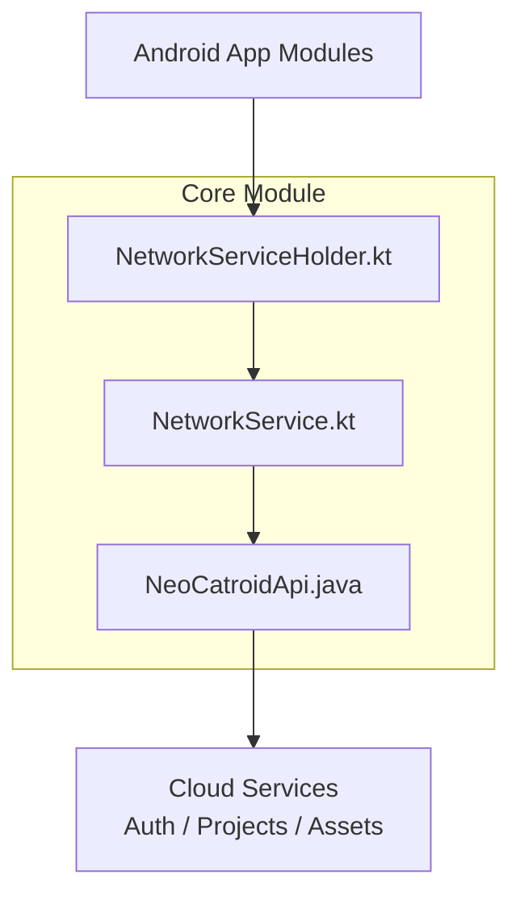
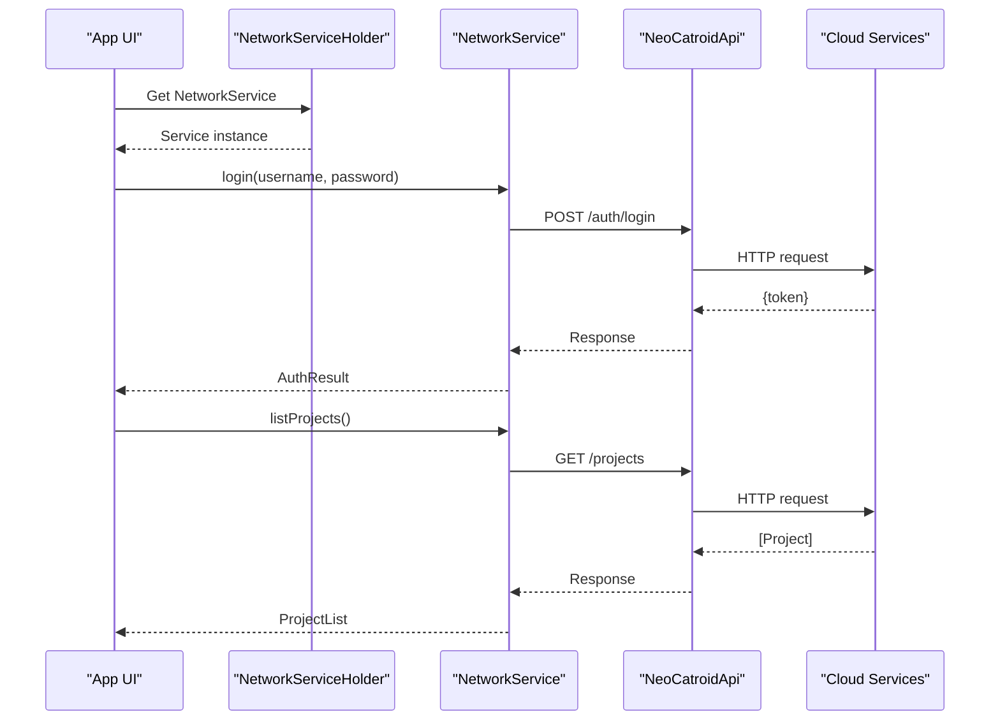
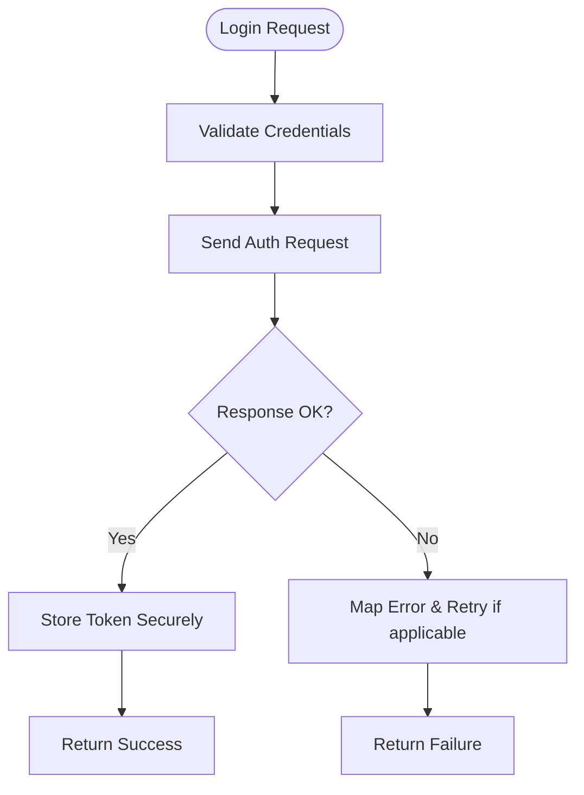
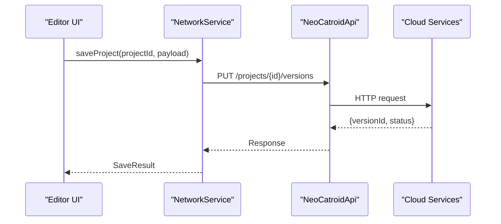
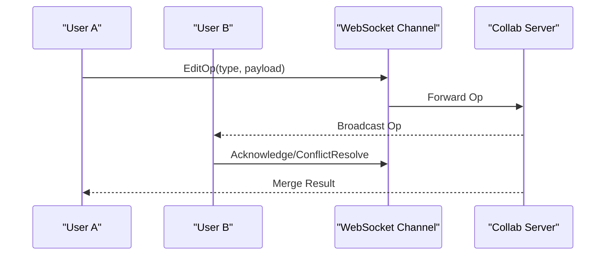
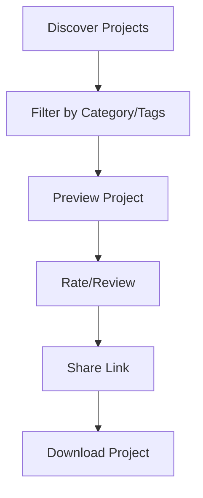
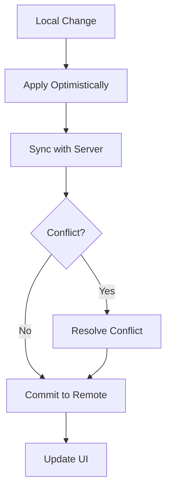
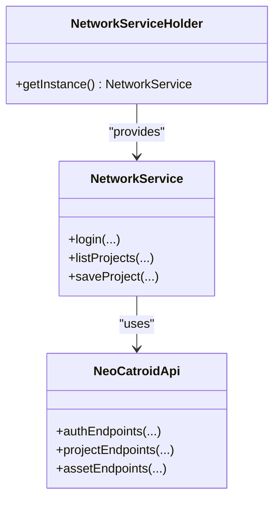

# Collaboration and Sharing

<cite>
**Referenced Files in This Document**
- [NeoCatroidApi.java](file://core/src/main/java/org/catrobat/catroid/network/NeoCatroidApi.java)
- [NetworkService.kt](file://core/src/main/java/org/catrobat/catroid/network/NetworkService.kt)
- [NetworkServiceHolder.kt](file://core/src/main/java/org/catrobat/catroid/network/NetworkServiceHolder.kt)
</cite>

## Table of Contents
1. [Introduction](#introduction)
2. [Project Structure](#project-structure)
3. [Core Components](#core-components)
4. [Architecture Overview](#architecture-overview)
5. [Detailed Component Analysis](#detailed-component-analysis)
6. [Dependency Analysis](#dependency-analysis)
7. [Performance Considerations](#performance-considerations)
8. [Troubleshooting Guide](#troubleshooting-guide)
9. [Conclusion](#conclusion)
10. [Appendices](#appendices)

## Introduction
This document explains NewCatroid’s collaboration and sharing features with a focus on cloud services architecture, user authentication, project storage, version control, real-time collaboration, community features, API integration, file transfer protocols, synchronization strategies, security and privacy considerations, and offline workflows. It synthesizes the available code-level evidence from the repository to provide both high-level understanding and actionable guidance for developers integrating or extending these capabilities.

## Project Structure
The collaboration and sharing functionality is primarily implemented in the core module under the network package. The key components are:
- NeoCatroidApi: Defines the HTTP API surface used by the client to interact with cloud services (authentication, projects, assets).
- NetworkService: Provides higher-level networking operations, request orchestration, and error handling.
- NetworkServiceHolder: Supplies a centralized holder for the network service instance across the app.

**Diagram sources**
- [NeoCatroidApi.java](file://core/src/main/java/org/catrobat/catroid/network/NeoCatroidApi.java)
- [NetworkService.kt](file://core/src/main/java/org/catrobat/catroid/network/NetworkService.kt)
- [NetworkServiceHolder.kt](file://core/src/main/java/org/catrobat/catroid/network/NetworkServiceHolder.kt)

**Section sources**
- [NeoCatroidApi.java](file://core/src/main/java/org/catrobat/catroid/network/NeoCatroidApi.java)
- [NetworkService.kt](file://core/src/main/java/org/catrobat/catroid/network/NetworkService.kt)
- [NetworkServiceHolder.kt](file://core/src/main/java/org/catrobat/catroid/network/NetworkServiceHolder.kt)

## Core Components
- NeoCatroidApi
  - Purpose: Declares REST endpoints and data contracts for cloud interactions such as authentication, project listing, upload/download, and metadata retrieval.
  - Typical responsibilities: Define base URLs, request/response models, and endpoint annotations.
- NetworkService
  - Purpose: Encapsulates HTTP calls, retries, timeouts, and error mapping; exposes domain-friendly methods for UI and business logic.
  - Typical responsibilities: Build requests, handle tokens, manage concurrency, and translate low-level errors into user-facing messages.
- NetworkServiceHolder
  - Purpose: Provides a singleton-like access point to NetworkService, ensuring consistent configuration and lifecycle management.
  - Typical responsibilities: Initialize and expose the service instance to other modules.

These components collectively implement the client-side integration with cloud services for collaboration and sharing.

**Section sources**
- [NeoCatroidApi.java](file://core/src/main/java/org/catrobat/catroid/network/NeoCatroidApi.java)
- [NetworkService.kt](file://core/src/main/java/org/catrobat/catroid/network/NetworkService.kt)
- [NetworkServiceHolder.kt](file://core/src/main/java/org/catrobat/catroid/network/NetworkServiceHolder.kt)

## Architecture Overview
The collaboration and sharing architecture follows a layered approach:
- Presentation layer (UI screens) invokes NetworkService methods.
- NetworkService orchestrates requests via NeoCatroidApi.
- Cloud services provide authentication, project storage, and asset hosting.
- Optional real-time channels (e.g., WebSockets) may be integrated through additional services not shown here.

**Diagram sources**
- [NeoCatroidApi.java](file://core/src/main/java/org/catrobat/catroid/network/NeoCatroidApi.java)
- [NetworkService.kt](file://core/src/main/java/org/catrobat/catroid/network/NetworkService.kt)
- [NetworkServiceHolder.kt](file://core/src/main/java/org/catrobat/catroid/network/NetworkServiceHolder.kt)

## Detailed Component Analysis

### Authentication Flow
- Steps:
  - UI requests login via NetworkService.
  - NetworkService constructs an authenticated request using NeoCatroidApi.
  - Cloud returns an access token or session cookie.
  - NetworkService persists token securely and returns success/failure to UI.
- Error handling:
  - NetworkService maps HTTP status codes and server errors to user-friendly messages.
  - Retries may be applied for transient failures.

[No sources needed since this diagram shows conceptual workflow, not actual code structure]

### Project Storage and Version Control
- Upload/Download:
  - Projects are uploaded as archives or structured payloads via NeoCatroidApi endpoints.
  - Download retrieves project metadata and associated assets.
- Versioning:
  - Each project typically includes version identifiers and timestamps.
  - Conflict resolution strategies can leverage server-side diffs or merge policies.

**Diagram sources**
- [NeoCatroidApi.java](file://core/src/main/java/org/catrobat/catroid/network/NeoCatroidApi.java)
- [NetworkService.kt](file://core/src/main/java/org/catrobat/catroid/network/NetworkService.kt)

### Real-Time Collaboration
- Live editing:
  - Typically implemented via WebSockets or Server-Sent Events.
  - Presence indicators reflect active collaborators and cursors.
- Conflict resolution:
  - Operational transforms or CRDTs can be used to reconcile concurrent edits.
  - Fallback to manual conflict resolution when automatic merging fails.

[No sources needed since this diagram shows conceptual workflow, not actual code structure]

### Community Features
- Project marketplace:
  - Browse, search, and download shared projects.
  - Categories, tags, and featured lists curated by admins.
- Rating systems:
  - Users can rate and review projects.
  - Aggregated scores influence visibility.
- Social sharing:
  - Share links, embed previews, and social media integrations.

[No sources needed since this diagram shows conceptual workflow, not actual code structure]

### API Documentation Summary
- Authentication
  - Endpoints: Login, logout, refresh token.
  - Security: HTTPS, bearer tokens, short-lived sessions.
- Projects
  - Endpoints: List, get, create, update, delete, versions.
  - Payloads: JSON metadata, binary assets.
- Assets
  - Endpoints: Upload images/audio, retrieve thumbnails.
  - Protocols: HTTP multipart uploads, resumable transfers.
- Synchronization
  - Strategies: Delta updates, ETag-based caching, optimistic UI updates.

[No sources needed since this section provides general guidance]

### File Transfer Protocols
- HTTP/HTTPS for standard requests.
- Multipart/form-data for large assets.
- Resumable uploads for reliability over unstable networks.
- Compression where appropriate to reduce bandwidth.

[No sources needed since this section provides general guidance]

### Synchronization Strategies
- Optimistic updates:
  - Apply local changes immediately, sync in background.
- Conflict detection:
  - Compare timestamps, hashes, or use operational transforms.
- Backoff and retry:
  - Exponential backoff for transient errors.

[No sources needed since this diagram shows conceptual workflow, not actual code structure]

## Dependency Analysis
The collaboration stack exhibits clear separation of concerns:
- NetworkService depends on NeoCatroidApi for endpoint definitions.
- NetworkServiceHolder centralizes service instantiation.
- UI layers depend on NetworkService, not directly on NeoCatroidApi.

**Diagram sources**
- [NetworkServiceHolder.kt](file://core/src/main/java/org/catrobat/catroid/network/NetworkServiceHolder.kt)
- [NetworkService.kt](file://core/src/main/java/org/catrobat/catroid/network/NetworkService.kt)
- [NeoCatroidApi.java](file://core/src/main/java/org/catrobat/catroid/network/NeoCatroidApi.java)

**Section sources**
- [NetworkServiceHolder.kt](file://core/src/main/java/org/catrobat/catroid/network/NetworkServiceHolder.kt)
- [NetworkService.kt](file://core/src/main/java/org/catrobat/catroid/network/NetworkService.kt)
- [NeoCatroidApi.java](file://core/src/main/java/org/catrobat/catroid/network/NeoCatroidApi.java)

## Performance Considerations
- Use connection pooling and keep-alive for frequent requests.
- Implement pagination and lazy loading for project lists.
- Cache metadata locally to reduce redundant network calls.
- Compress payloads and use efficient serialization formats.
- Monitor latency and throughput; adjust timeouts and retry policies accordingly.

[No sources needed since this section provides general guidance]

## Troubleshooting Guide
Common issues and resolutions:
- Authentication failures:
  - Verify credentials and token expiration.
  - Check network connectivity and proxy settings.
- Upload/download errors:
  - Inspect HTTP status codes and server logs.
  - Enable retries and resume interrupted transfers.
- Real-time sync problems:
  - Validate WebSocket connections and reconnection logic.
  - Ensure conflict resolution paths are exercised in tests.

**Section sources**
- [NetworkService.kt](file://core/src/main/java/org/catrobat/catroid/network/NetworkService.kt)

## Conclusion
NewCatroid’s collaboration and sharing features are built around a clean client architecture that separates API definitions from networking orchestration. The provided components support authentication, project storage, and basic synchronization patterns. For advanced real-time collaboration, additional services and protocols can be integrated atop this foundation while maintaining security, performance, and usability standards.

[No sources needed since this section summarizes without analyzing specific files]

## Appendices

### Security and Data Privacy
- Enforce HTTPS everywhere and validate certificates.
- Store tokens securely using platform-provided secure storage.
- Minimize data exposure; apply least privilege principles.
- Sanitize inputs and outputs to prevent injection attacks.
- Provide user controls for data deletion and consent management.

[No sources needed since this section provides general guidance]

### Offline Collaboration Workflows
- Queue changes locally when offline.
- Reconcile upon reconnect using conflict resolution strategies.
- Provide clear feedback about sync status and conflicts.

[No sources needed since this section provides general guidance]