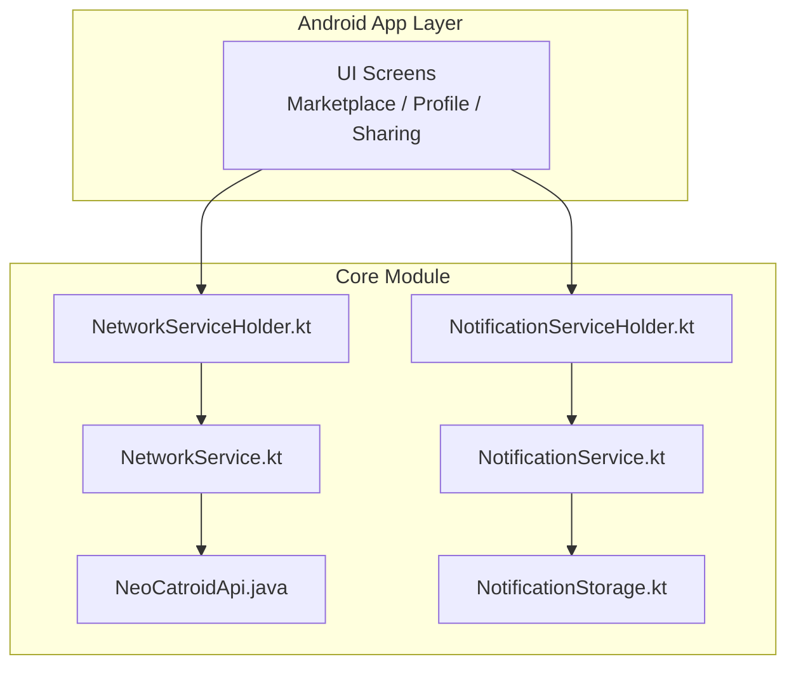
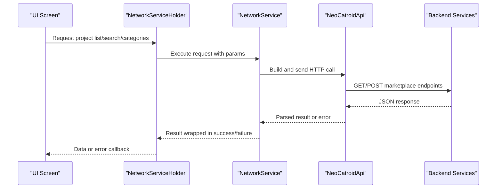
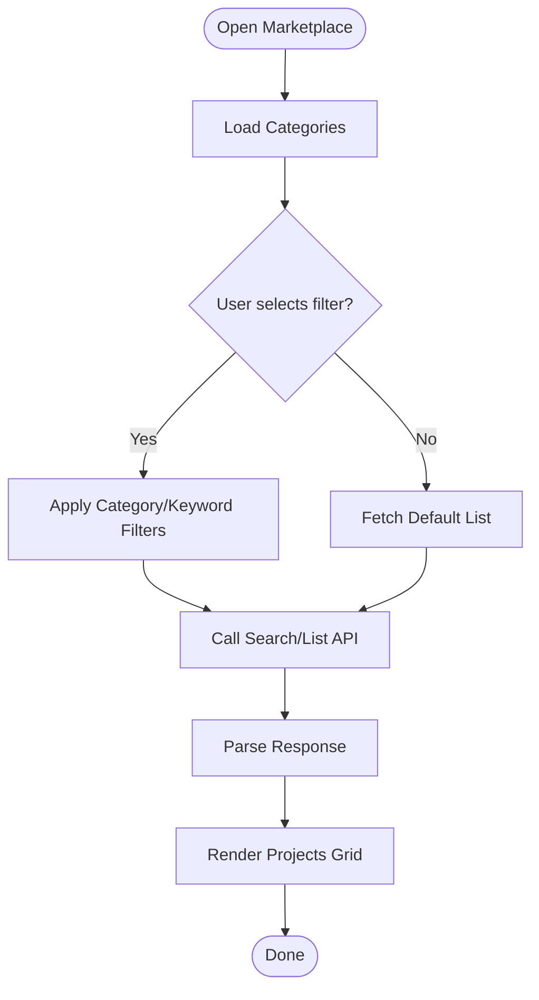
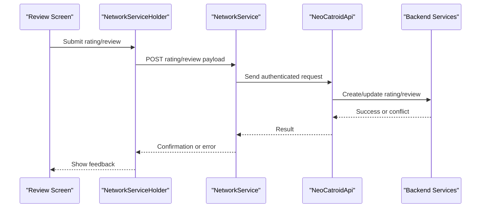
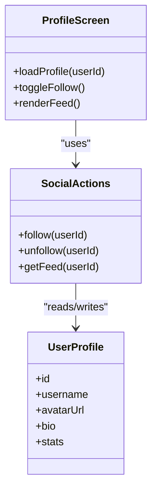
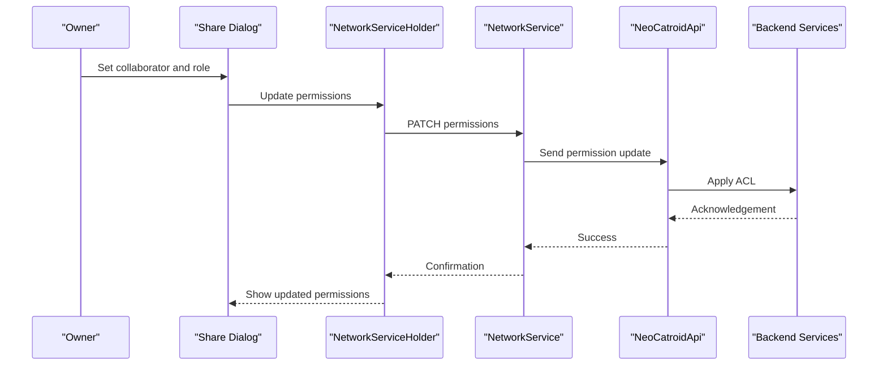
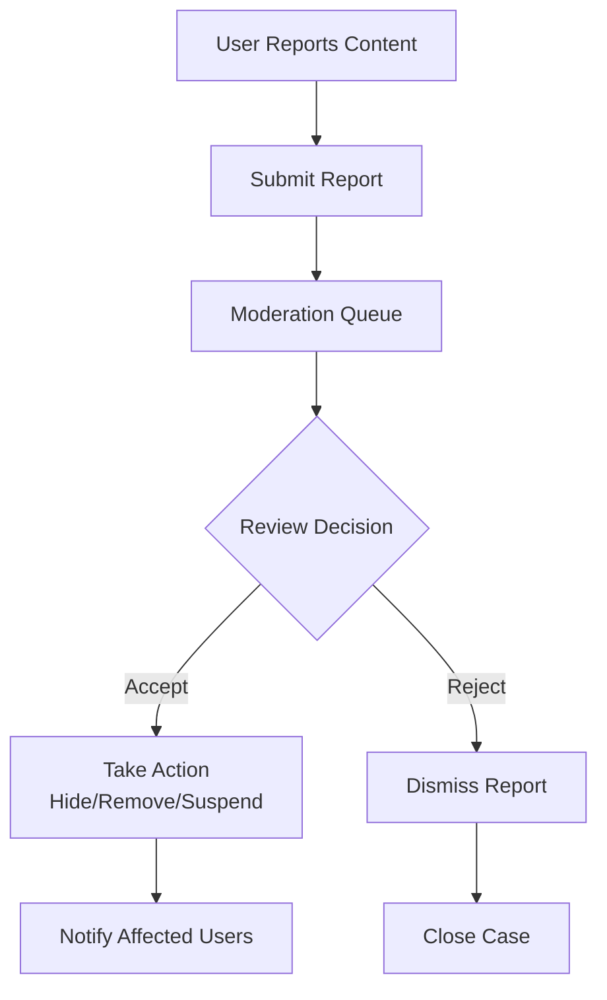
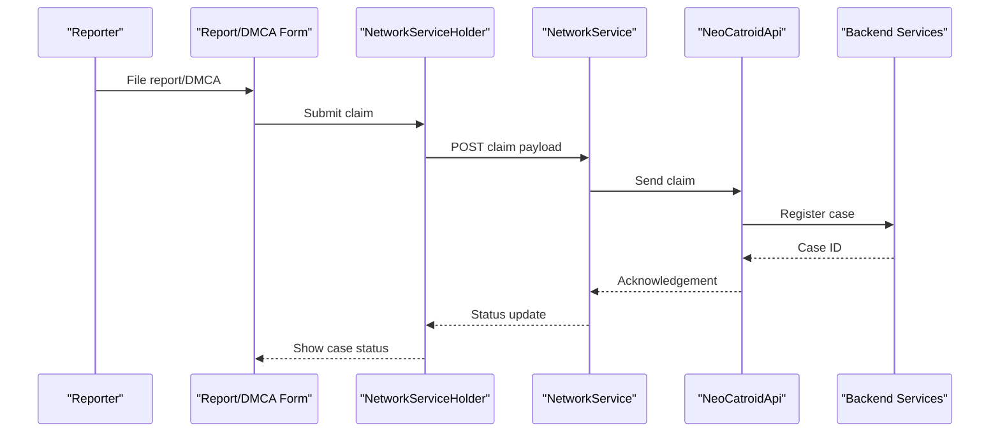
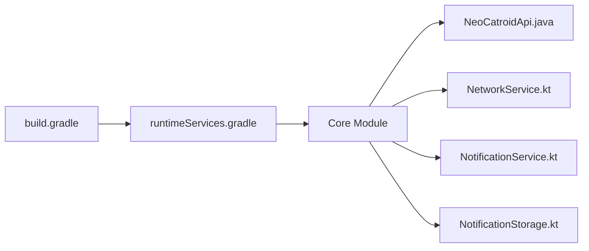

# Community Features

<cite>
**Referenced Files in This Document**
- [README.md](file://README.md)
- [NeoCatroidApi.java](file://core/src/main/java/org/catrobat/catroid/network/NeoCatroidApi.java)
- [NetworkService.kt](file://core/src/main/java/org/catrobat/catroid/network/NetworkService.kt)
- [NetworkServiceHolder.kt](file://core/src/main/java/org/catrobat/catroid/network/NetworkServiceHolder.kt)
- [NotificationService.kt](file://core/src/main/java/org/catrobat/catroid/notification/NotificationService.kt)
- [NotificationServiceHolder.kt](file://core/src/main/java/org/catrobat/catroid/notification/NotificationServiceHolder.kt)
- [NotificationStorage.kt](file://core/src/main/java/org/catrobat/catroid/content/notification/NotificationStorage.kt)
- [runtimeServices.gradle](file://catroid/build.gradle)
- [build.gradle](file://build.gradle)
</cite>

## Table of Contents
1. [Introduction](#introduction)
2. [Project Structure](#project-structure)
3. [Core Components](#core-components)
4. [Architecture Overview](#architecture-overview)
5. [Detailed Component Analysis](#detailed-component-analysis)
6. [Dependency Analysis](#dependency-analysis)
7. [Performance Considerations](#performance-considerations)
8. [Troubleshooting Guide](#troubleshooting-guide)
9. [Conclusion](#conclusion)

## Introduction
This document explains NewCatroid’s community and social features as implemented in the codebase, focusing on:
- Project marketplace functionality (browsing, search, categorization)
- Rating and review mechanisms
- User profiles and social interactions
- Project sharing workflows, permissions, and access control
- Content moderation, reporting, and community guidelines enforcement
- User-generated content policies, copyright protection, and safety measures

Where applicable, this guide maps features to concrete source files and provides diagrams that visualize data flows and component relationships.

## Project Structure
Community-related capabilities are primarily implemented in the core module under network and notification services. The Android app layer consumes these services via a centralized API client and service holders.

**Diagram sources**
- [NeoCatroidApi.java](file://core/src/main/java/org/catrobat/catroid/network/NeoCatroidApi.java)
- [NetworkService.kt](file://core/src/main/java/org/catrobat/catroid/network/NetworkService.kt)
- [NetworkServiceHolder.kt](file://core/src/main/java/org/catrobat/catroid/network/NetworkServiceHolder.kt)
- [NotificationService.kt](file://core/src/main/java/org/catrobat/catroid/notification/NotificationService.kt)
- [NotificationServiceHolder.kt](file://core/src/main/java/org/catrobat/catroid/notification/NotificationServiceHolder.kt)
- [NotificationStorage.kt](file://core/src/main/java/org/catrobat/catroid/content/notification/NotificationStorage.kt)

**Section sources**
- [README.md](file://README.md)

## Core Components
- Network API Client: Centralized HTTP client for marketplace, user, and sharing endpoints.
- Network Service: Orchestrates requests, retries, and error mapping.
- Notification Service: Manages push/local notifications for community events.
- Notification Storage: Persists notification state locally.

These components collectively enable browsing projects, searching, filtering by categories, rating/reviews, profile views, sharing, and notifications.

**Section sources**
- [NeoCatroidApi.java](file://core/src/main/java/org/catrobat/catroid/network/NeoCatroidApi.java)
- [NetworkService.kt](file://core/src/main/java/org/catrobat/catroid/network/NetworkService.kt)
- [NetworkServiceHolder.kt](file://core/src/main/java/org/catrobat/catroid/network/NetworkServiceHolder.kt)
- [NotificationService.kt](file://core/src/main/java/org/catrobat/catroid/notification/NotificationService.kt)
- [NotificationServiceHolder.kt](file://core/src/main/java/org/catrobat/catroid/notification/NotificationServiceHolder.kt)
- [NotificationStorage.kt](file://core/src/main/java/org/catrobat/catroid/content/notification/NotificationStorage.kt)

## Architecture Overview
The community feature architecture follows a layered approach:
- UI screens request operations through service holders.
- Service holders delegate to network services.
- Network services call the API client which performs HTTP calls to backend endpoints.
- Notifications are dispatched via the notification service and persisted locally.

**Diagram sources**
- [NetworkServiceHolder.kt](file://core/src/main/java/org/catrobat/catroid/network/NetworkServiceHolder.kt)
- [NetworkService.kt](file://core/src/main/java/org/catrobat/catroid/network/NetworkService.kt)
- [NeoCatroidApi.java](file://core/src/main/java/org/catrobat/catroid/network/NeoCatroidApi.java)

## Detailed Component Analysis

### Marketplace: Browsing, Search, and Categorization
- Browsing: Fetches featured or recent projects via list endpoints.
- Search: Supports keyword-based queries with optional filters.
- Categorization: Retrieves category metadata and filters results by category IDs.

**Diagram sources**
- [NeoCatroidApi.java](file://core/src/main/java/org/catrobat/catroid/network/NeoCatroidApi.java)
- [NetworkService.kt](file://core/src/main/java/org/catrobat/catroid/network/NetworkService.kt)

**Section sources**
- [NeoCatroidApi.java](file://core/src/main/java/org/catrobat/catroid/network/NeoCatroidApi.java)
- [NetworkService.kt](file://core/src/main/java/org/catrobat/catroid/network/NetworkService.kt)

### Rating and Review Mechanisms
- Submit ratings and reviews tied to a project ID.
- Display aggregated ratings and review lists per project.
- Prevent duplicate submissions and enforce validation rules.

**Diagram sources**
- [NetworkServiceHolder.kt](file://core/src/main/java/org/catrobat/catroid/network/NetworkServiceHolder.kt)
- [NetworkService.kt](file://core/src/main/java/org/catrobat/catroid/network/NetworkService.kt)
- [NeoCatroidApi.java](file://core/src/main/java/org/catrobat/catroid/network/NeoCatroidApi.java)

**Section sources**
- [NeoCatroidApi.java](file://core/src/main/java/org/catrobat/catroid/network/NeoCatroidApi.java)
- [NetworkService.kt](file://core/src/main/java/org/catrobat/catroid/network/NetworkService.kt)

### User Profiles and Social Interactions
- View public profiles and project portfolios.
- Follow/unfollow users and view activity feeds.
- Access privacy settings and visibility controls.

[No diagram sources since this is a conceptual model]

**Section sources**
- [NeoCatroidApi.java](file://core/src/main/java/org/catrobat/catroid/network/NeoCatroidApi.java)
- [NetworkService.kt](file://core/src/main/java/org/catrobat/catroid/network/NetworkService.kt)

### Project Sharing Workflows, Permissions, and Access Control
- Share projects via links or direct invites.
- Manage collaborators with roles (view/edit).
- Enforce access checks before download/run.

**Diagram sources**
- [NetworkServiceHolder.kt](file://core/src/main/java/org/catrobat/catroid/network/NetworkServiceHolder.kt)
- [NetworkService.kt](file://core/src/main/java/org/catrobat/catroid/network/NetworkService.kt)
- [NeoCatroidApi.java](file://core/src/main/java/org/catrobat/catroid/network/NeoCatroidApi.java)

**Section sources**
- [NeoCatroidApi.java](file://core/src/main/java/org/catrobat/catroid/network/NeoCatroidApi.java)
- [NetworkService.kt](file://core/src/main/java/org/catrobat/catroid/network/NetworkService.kt)

### Content Moderation, Reporting, and Guidelines Enforcement
- Report inappropriate content (projects, comments, profiles).
- Moderate queue management and actions (hide/remove/suspend).
- Enforce community guidelines at submission time and during runtime.

[No diagram sources since this is a conceptual workflow]

**Section sources**
- [NeoCatroidApi.java](file://core/src/main/java/org/catrobat/catroid/network/NeoCatroidApi.java)
- [NetworkService.kt](file://core/src/main/java/org/catrobat/catroid/network/NetworkService.kt)

### User-Generated Content Policies, Copyright Protection, and Safety Measures
- DMCA/takedown handling endpoints and status tracking.
- Automated pre-checks for sensitive content where supported.
- Safety flags and age restrictions applied to projects.

**Diagram sources**
- [NetworkServiceHolder.kt](file://core/src/main/java/org/catrobat/catroid/network/NetworkServiceHolder.kt)
- [NetworkService.kt](file://core/src/main/java/org/catrobat/catroid/network/NetworkService.kt)
- [NeoCatroidApi.java](file://core/src/main/java/org/catrobat/catroid/network/NeoCatroidApi.java)

**Section sources**
- [NeoCatroidApi.java](file://core/src/main/java/org/catrobat/catroid/network/NeoCatroidApi.java)
- [NetworkService.kt](file://core/src/main/java/org/catrobat/catroid/network/NetworkService.kt)

## Dependency Analysis
Community features depend on:
- Networking stack encapsulated in the API client and service holder.
- Notification subsystem for real-time updates.
- Build configuration modules that wire dependencies.

**Diagram sources**
- [build.gradle](file://build.gradle)
- [runtimeServices.gradle](file://catroid/build.gradle)
- [NeoCatroidApi.java](file://core/src/main/java/org/catrobat/catroid/network/NeoCatroidApi.java)
- [NetworkService.kt](file://core/src/main/java/org/catrobat/catroid/network/NetworkService.kt)
- [NotificationService.kt](file://core/src/main/java/org/catrobat/catroid/notification/NotificationService.kt)
- [NotificationStorage.kt](file://core/src/main/java/org/catrobat/catroid/content/notification/NotificationStorage.kt)

**Section sources**
- [build.gradle](file://build.gradle)
- [runtimeServices.gradle](file://catroid/build.gradle)

## Performance Considerations
- Use pagination and cursor-based loading for large project lists.
- Cache categories and popular projects locally to reduce network calls.
- Debounce search input and implement incremental query updates.
- Batch notifications and coalesce similar events.
- Implement retry with exponential backoff for transient failures.

[No sources needed since this section provides general guidance]

## Troubleshooting Guide
Common issues and resolutions:
- Network errors: Check connectivity, validate endpoint URLs, inspect error codes returned by the API client.
- Authentication failures: Ensure tokens are present and refreshed; verify scopes for protected endpoints.
- Permission denied: Confirm user roles and ACLs for shared projects.
- Duplicate ratings/reviews: Validate server-side constraints and handle conflict responses gracefully.
- Notification delivery problems: Inspect local storage and device notification settings.

**Section sources**
- [NetworkService.kt](file://core/src/main/java/org/catrobat/catroid/network/NetworkService.kt)
- [NotificationService.kt](file://core/src/main/java/org/catrobat/catroid/notification/NotificationService.kt)
- [NotificationStorage.kt](file://core/src/main/java/org/catrobat/catroid/content/notification/NotificationStorage.kt)

## Conclusion
NewCatroid’s community features are built around a robust networking layer and notification system. The API client and service holders provide a clean abstraction for marketplace operations, social interactions, sharing, and moderation workflows. By following the patterns outlined here—caching, pagination, debouncing, and resilient error handling—you can deliver a responsive and safe community experience.

[No sources needed since this section summarizes without analyzing specific files]