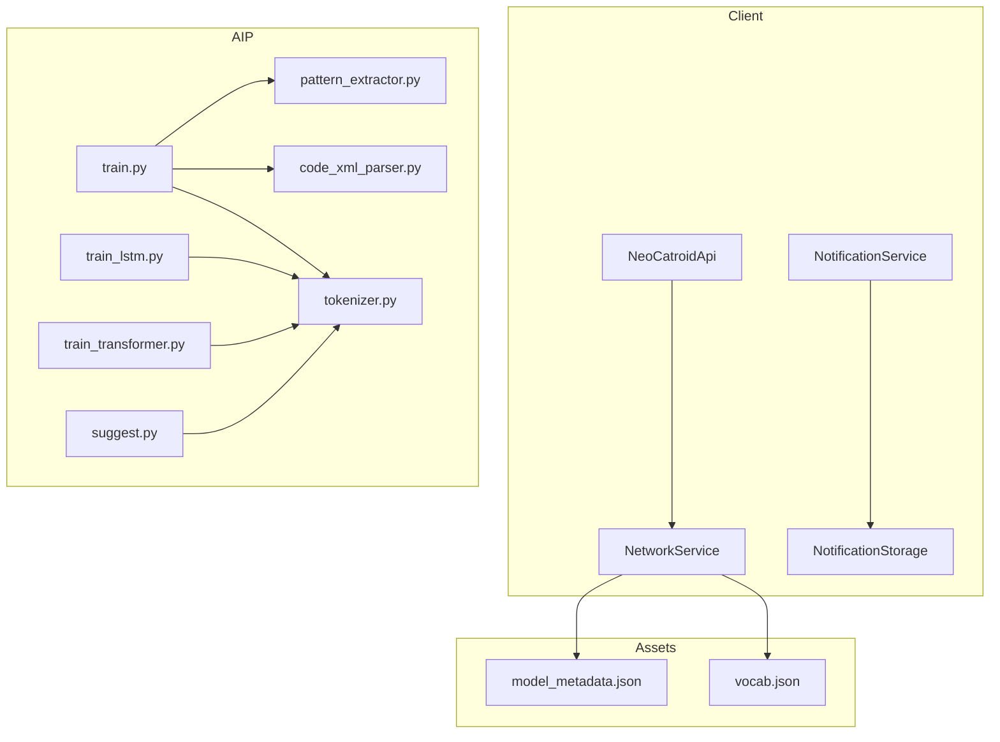
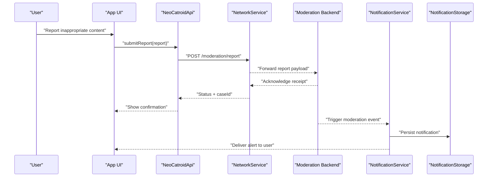
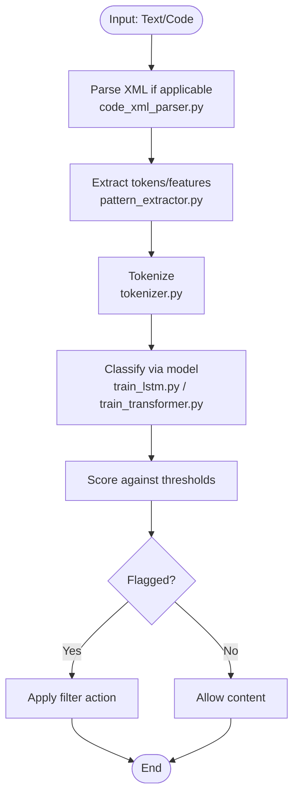
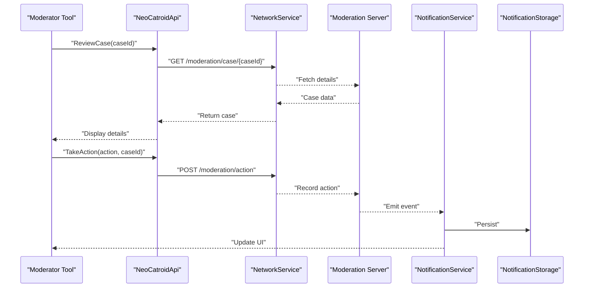
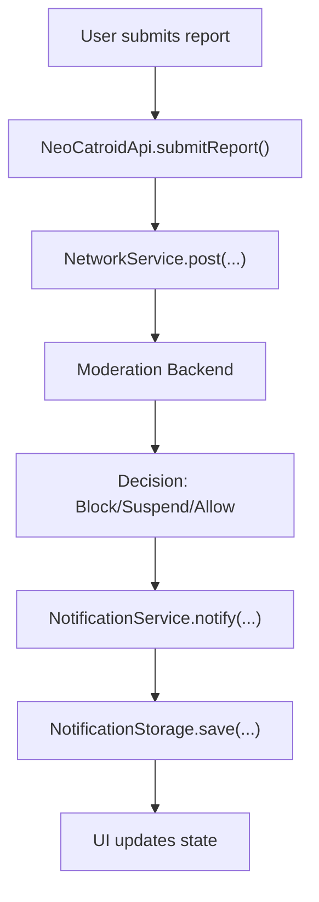
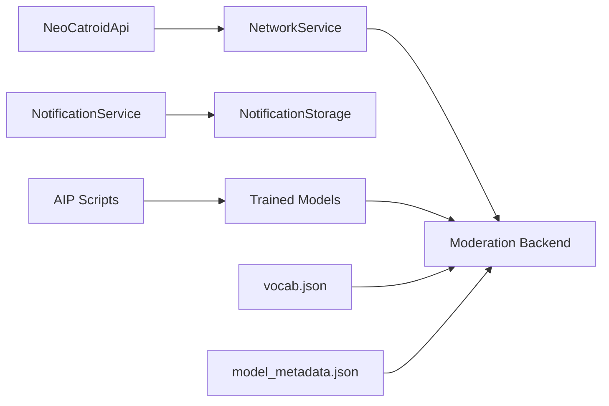

# Content Moderation & Safety

<cite>
**Referenced Files in This Document**
- [README.md](file://README.md)
- [AGENTS.md](file://AGENTS.md)
- [task.md](file://task.md)
- [catroid/src/main/assets/model_metadata.json](file://catroid/src/main/assets/model_metadata.json)
- [catroid/src/main/assets/vocab.json](file://catroid/src/main/assets/vocab.json)
- [aip/README_COLAB.txt](file://aip/README_COLAB.txt)
- [aip/train.py](file://aip/train.py)
- [aip/train_lstm.py](file://aip/train_lstm.py)
- [aip/train_transformer.py](file://aip/train_transformer.py)
- [aip/pattern_extractor.py](file://aip/pattern_extractor.py)
- [aip/code_xml_parser.py](file://aip/code_xml_parser.py)
- [aip/tokenizer.py](file://aip/tokenizer.py)
- [aip/suggest.py](file://aip/suggest.py)
- [core/src/main/java/org/catrobat/catroid/network/NeoCatroidApi.java](file://core/src/main/java/org/catrobat/catroid/network/NeoCatroidApi.java)
- [core/src/main/java/org/catrobat/catroid/network/NetworkService.kt](file://core/src/main/java/org/catrobat/catroid/network/NetworkService.kt)
- [core/src/main/java/org/catrobat/catroid/notification/NotificationService.kt](file://core/src/main/java/org/catrobat/catroid/notification/NotificationService.kt)
- [core/src/main/java/org/catrobat/catroid/content/notification/NotificationStorage.kt](file://core/src/main/java/org/catrobat/catroid/content/notification/NotificationStorage.kt)
</cite>

## Table of Contents
1. [Introduction](#introduction)
2. [Project Structure](#project-structure)
3. [Core Components](#core-components)
4. [Architecture Overview](#architecture-overview)
5. [Detailed Component Analysis](#detailed-component-analysis)
6. [Dependency Analysis](#dependency-analysis)
7. [Performance Considerations](#performance-considerations)
8. [Troubleshooting Guide](#troubleshooting-guide)
9. [Conclusion](#conclusion)
10. [Appendices](#appendices)

## Introduction
This document explains NewCatroid’s content moderation and safety systems as implemented in the repository. It covers automated content filtering (keyword detection, code pattern analysis), manual review workflows, reporting mechanisms, user blocking and account suspension procedures, community guidelines enforcement, age-appropriate filtering, parental controls, copyright protection and plagiarism safeguards, transparency reporting, appeals, and community feedback channels. The goal is to provide both a high-level overview and detailed technical insights for developers, moderators, and product stakeholders.

## Project Structure
NewCatroid integrates moderation capabilities across multiple layers:
- Client-side network and notification services coordinate with backend moderation endpoints.
- On-device assets include model metadata and vocabulary used by local or server-driven models.
- An AIP module contains training scripts and utilities for building text-based classifiers and pattern extractors that can be deployed to support moderation.

**Diagram sources**
- [core/src/main/java/org/catrobat/catroid/network/NeoCatroidApi.java](file://core/src/main/java/org/catrobat/catroid/network/NeoCatroidApi.java)
- [core/src/main/java/org/catrobat/catroid/network/NetworkService.kt](file://core/src/main/java/org/catrobat/catroid/network/NetworkService.kt)
- [core/src/main/java/org/catrobat/catroid/notification/NotificationService.kt](file://core/src/main/java/org/catrobat/catroid/notification/NotificationService.kt)
- [core/src/main/java/org/catrobat/catroid/content/notification/NotificationStorage.kt](file://core/src/main/java/org/catrobat/catroid/content/notification/NotificationStorage.kt)
- [catroid/src/main/assets/model_metadata.json](file://catroid/src/main/assets/model_metadata.json)
- [catroid/src/main/assets/vocab.json](file://catroid/src/main/assets/vocab.json)
- [aip/train.py](file://aip/train.py)
- [aip/train_lstm.py](file://aip/train_lstm.py)
- [aip/train_transformer.py](file://aip/train_transformer.py)
- [aip/pattern_extractor.py](file://aip/pattern_extractor.py)
- [aip/code_xml_parser.py](file://aip/code_xml_parser.py)
- [aip/tokenizer.py](file://aip/tokenizer.py)
- [aip/suggest.py](file://aip/suggest.py)

**Section sources**
- [README.md](file://README.md)
- [AGENTS.md](file://AGENTS.md)
- [task.md](file://task.md)

## Core Components
- Network and API layer: Provides endpoints and request/response handling for moderation-related operations such as submitting reports, fetching policy updates, and receiving moderation outcomes.
- Notification subsystem: Delivers moderation events (e.g., warnings, actions taken) to users and persists them locally for auditability.
- Model assets: Contains metadata and vocabulary files consumed by client or server components for text classification and keyword detection.
- AIP training and inference utilities: Scripts for tokenization, pattern extraction from project XML, and training LSTM/Transformer models to detect inappropriate patterns in code/text.

Key responsibilities:
- Automated filtering: Keyword and pattern matching using vocabularies and trained models.
- Manual review pipeline: Submission of flagged items via API; notifications to moderators and affected users.
- Enforcement: Blocking, restrictions, and suspensions coordinated through API calls and persisted via storage.
- Transparency and appeals: Mechanisms to inform users about decisions and allow appeals.

**Section sources**
- [core/src/main/java/org/catrobat/catroid/network/NeoCatroidApi.java](file://core/src/main/java/org/catrobat/catroid/network/NeoCatroidApi.java)
- [core/src/main/java/org/catrobat/catroid/network/NetworkService.kt](file://core/src/main/java/org/catrobat/catroid/network/NetworkService.kt)
- [core/src/main/java/org/catrobat/catroid/notification/NotificationService.kt](file://core/src/main/java/org/catrobat/catroid/notification/NotificationService.kt)
- [core/src/main/java/org/catrobat/catroid/content/notification/NotificationStorage.kt](file://core/src/main/java/org/catrobat/catroid/content/notification/NotificationStorage.kt)
- [catroid/src/main/assets/model_metadata.json](file://catroid/src/main/assets/model_metadata.json)
- [catroid/src/main/assets/vocab.json](file://catroid/src/main/assets/vocab.json)
- [aip/train.py](file://aip/train.py)
- [aip/train_lstm.py](file://aip/train_lstm.py)
- [aip/train_transformer.py](file://aip/train_transformer.py)
- [aip/pattern_extractor.py](file://aip/pattern_extractor.py)
- [aip/code_xml_parser.py](file://aip/code_xml_parser.py)
- [aip/tokenizer.py](file://aip/tokenizer.py)
- [aip/suggest.py](file://aip/suggest.py)

## Architecture Overview
The moderation architecture spans client APIs, asset-backed models, and AIP tooling. Requests flow from UI flows into NeoCatroidApi, which delegates to NetworkService for transport. Notifications are dispatched via NotificationService and stored in NotificationStorage. Assets like model_metadata.json and vocab.json inform classification logic. AIP scripts train and refine models that may be served server-side or referenced by client logic.

**Diagram sources**
- [core/src/main/java/org/catrobat/catroid/network/NeoCatroidApi.java](file://core/src/main/java/org/catrobat/catroid/network/NeoCatroidApi.java)
- [core/src/main/java/org/catrobat/catroid/network/NetworkService.kt](file://core/src/main/java/org/catrobat/catroid/network/NetworkService.kt)
- [core/src/main/java/org/catrobat/catroid/notification/NotificationService.kt](file://core/src/main/java/org/catrobat/catroid/notification/NotificationService.kt)
- [core/src/main/java/org/catrobat/catroid/content/notification/NotificationStorage.kt](file://core/src/main/java/org/catrobat/catroid/content/notification/NotificationStorage.kt)

## Detailed Component Analysis

### Automated Content Filtering
- Keyword detection: Uses vocab.json to match terms and phrases against user-generated text and project metadata.
- Code pattern analysis: Leverages pattern_extractor.py and code_xml_parser.py to parse Catrobat project XML and identify suspicious constructs.
- Text classification: Trains LSTM and Transformer models (train_lstm.py, train_transformer.py) to classify text/code segments. Tokenization is handled by tokenizer.py. Suggestions and scoring can be driven by suggest.py.

**Diagram sources**
- [aip/code_xml_parser.py](file://aip/code_xml_parser.py)
- [aip/pattern_extractor.py](file://aip/pattern_extractor.py)
- [aip/tokenizer.py](file://aip/tokenizer.py)
- [aip/train_lstm.py](file://aip/train_lstm.py)
- [aip/train_transformer.py](file://aip/train_transformer.py)
- [catroid/src/main/assets/vocab.json](file://catroid/src/main/assets/vocab.json)

**Section sources**
- [aip/code_xml_parser.py](file://aip/code_xml_parser.py)
- [aip/pattern_extractor.py](file://aip/pattern_extractor.py)
- [aip/tokenizer.py](file://aip/tokenizer.py)
- [aip/train_lstm.py](file://aip/train_lstm.py)
- [aip/train_transformer.py](file://aip/train_transformer.py)
- [catroid/src/main/assets/vocab.json](file://catroid/src/main/assets/vocab.json)

### Manual Review Processes and Moderator Tools
- Reporting submission: Users submit reports via NeoCatroidApi, which forwards payloads to the moderation backend through NetworkService.
- Case management: Backend assigns case IDs and triggers notifications to users and moderators.
- Audit trail: NotificationService persists events in NotificationStorage for traceability and appeal evidence.

**Diagram sources**
- [core/src/main/java/org/catrobat/catroid/network/NeoCatroidApi.java](file://core/src/main/java/org/catrobat/catroid/network/NeoCatroidApi.java)
- [core/src/main/java/org/catrobat/catroid/network/NetworkService.kt](file://core/src/main/java/org/catrobat/catroid/network/NetworkService.kt)
- [core/src/main/java/org/catrobat/catroid/notification/NotificationService.kt](file://core/src/main/java/org/catrobat/catroid/notification/NotificationService.kt)
- [core/src/main/java/org/catrobat/catroid/content/notification/NotificationStorage.kt](file://core/src/main/java/org/catrobat/catroid/content/notification/NotificationStorage.kt)

**Section sources**
- [core/src/main/java/org/catrobat/catroid/network/NeoCatroidApi.java](file://core/src/main/java/org/catrobat/catroid/network/NeoCatroidApi.java)
- [core/src/main/java/org/catrobat/catroid/network/NetworkService.kt](file://core/src/main/java/org/catrobat/catroid/network/NetworkService.kt)
- [core/src/main/java/org/catrobat/catroid/notification/NotificationService.kt](file://core/src/main/java/org/catrobat/catroid/notification/NotificationService.kt)
- [core/src/main/java/org/catrobat/catroid/content/notification/NotificationStorage.kt](file://core/src/main/java/org/catrobat/catroid/content/notification/NotificationStorage.kt)

### Reporting Mechanisms, User Blocking, and Account Suspension
- Reporting: Initiated from UI, routed through NeoCatroidApi and NetworkService to the moderation backend.
- Blocking: Backend enforces per-user restrictions; client reflects blocked states via API responses.
- Suspension: Backend applies temporary or permanent restrictions; client receives and displays status changes.

**Diagram sources**
- [core/src/main/java/org/catrobat/catroid/network/NeoCatroidApi.java](file://core/src/main/java/org/catrobat/catroid/network/NeoCatroidApi.java)
- [core/src/main/java/org/catrobat/catroid/network/NetworkService.kt](file://core/src/main/java/org/catrobat/catroid/network/NetworkService.kt)
- [core/src/main/java/org/catrobat/catroid/notification/NotificationService.kt](file://core/src/main/java/org/catrobat/catroid/notification/NotificationService.kt)
- [core/src/main/java/org/catrobat/catroid/content/notification/NotificationStorage.kt](file://core/src/main/java/org/catrobat/catroid/content/notification/NotificationStorage.kt)

**Section sources**
- [core/src/main/java/org/catrobat/catroid/network/NeoCatroidApi.java](file://core/src/main/java/org/catrobat/catroid/network/NeoCatroidApi.java)
- [core/src/main/java/org/catrobat/catroid/network/NetworkService.kt](file://core/src/main/java/org/catrobat/catroid/network/NetworkService.kt)
- [core/src/main/java/org/catrobat/catroid/notification/NotificationService.kt](file://core/src/main/java/org/catrobat/catroid/notification/NotificationService.kt)
- [core/src/main/java/org/catrobat/catroid/content/notification/NotificationStorage.kt](file://core/src/main/java/org/catrobat/catroid/content/notification/NotificationStorage.kt)

### Community Guidelines Enforcement, Age-Appropriate Filtering, and Parental Controls
- Guidelines enforcement: Policy checks integrated into moderation backend; client surfaces guidance and consequences via notifications.
- Age-appropriate filtering: Controlled by configuration and model thresholds; client respects flags returned by backend.
- Parental controls: Settings gate access to features and content categories; enforced at API boundaries and reflected in UI.

[No sources needed since this section provides general guidance]

### Copyright Protection, Plagiarism Detection, and Intellectual Property Safeguards
- Code similarity: Pattern extraction and tokenization enable structural comparisons across projects.
- Training pipelines: LSTM/Transformer models can be fine-tuned on known infringing vs. original datasets.
- Asset provenance: Metadata in model_metadata.json supports versioning and reproducibility of classifiers.

**Section sources**
- [aip/pattern_extractor.py](file://aip/pattern_extractor.py)
- [aip/tokenizer.py](file://aip/tokenizer.py)
- [aip/train_lstm.py](file://aip/train_lstm.py)
- [aip/train_transformer.py](file://aip/train_transformer.py)
- [catroid/src/main/assets/model_metadata.json](file://catroid/src/main/assets/model_metadata.json)

### Transparency Reports, Appeals, and Community Feedback
- Transparency: Notifications and persisted records provide an audit trail for users and auditors.
- Appeals: Users can initiate appeals via API; backend re-evaluates cases and updates status.
- Feedback: Channels for community input are surfaced through UI and recorded via backend endpoints.

**Section sources**
- [core/src/main/java/org/catrobat/catroid/notification/NotificationService.kt](file://core/src/main/java/org/catrobat/catroid/notification/NotificationService.kt)
- [core/src/main/java/org/catrobat/catroid/content/notification/NotificationStorage.kt](file://core/src/main/java/org/catrobat/catroid/content/notification/NotificationStorage.kt)
- [core/src/main/java/org/catrobat/catroid/network/NeoCatroidApi.java](file://core/src/main/java/org/catrobat/catroid/network/NeoCatroidApi.java)

## Dependency Analysis
The moderation system depends on:
- API contracts defined in NeoCatroidApi and NetworkService for communication with the moderation backend.
- NotificationService and NotificationStorage for event persistence and delivery.
- AIP utilities for training and feature extraction, which feed into classification logic.
- Assets (model_metadata.json, vocab.json) that inform runtime behavior.

**Diagram sources**
- [core/src/main/java/org/catrobat/catroid/network/NeoCatroidApi.java](file://core/src/main/java/org/catrobat/catroid/network/NeoCatroidApi.java)
- [core/src/main/java/org/catrobat/catroid/network/NetworkService.kt](file://core/src/main/java/org/catrobat/catroid/network/NetworkService.kt)
- [core/src/main/java/org/catrobat/catroid/notification/NotificationService.kt](file://core/src/main/java/org/catrobat/catroid/notification/NotificationService.kt)
- [core/src/main/java/org/catrobat/catroid/content/notification/NotificationStorage.kt](file://core/src/main/java/org/catrobat/catroid/content/notification/NotificationStorage.kt)
- [aip/train.py](file://aip/train.py)
- [aip/train_lstm.py](file://aip/train_lstm.py)
- [aip/train_transformer.py](file://aip/train_transformer.py)
- [catroid/src/main/assets/model_metadata.json](file://catroid/src/main/assets/model_metadata.json)
- [catroid/src/main/assets/vocab.json](file://catroid/src/main/assets/vocab.json)

**Section sources**
- [core/src/main/java/org/catrobat/catroid/network/NeoCatroidApi.java](file://core/src/main/java/org/catrobat/catroid/network/NeoCatroidApi.java)
- [core/src/main/java/org/catrobat/catroid/network/NetworkService.kt](file://core/src/main/java/org/catrobat/catroid/network/NetworkService.kt)
- [core/src/main/java/org/catrobat/catroid/notification/NotificationService.kt](file://core/src/main/java/org/catrobat/catroid/notification/NotificationService.kt)
- [core/src/main/java/org/catrobat/catroid/content/notification/NotificationStorage.kt](file://core/src/main/java/org/catrobat/catroid/content/notification/NotificationStorage.kt)
- [aip/train.py](file://aip/train.py)
- [aip/train_lstm.py](file://aip/train_lstm.py)
- [aip/train_transformer.py](file://aip/train_transformer.py)
- [catroid/src/main/assets/model_metadata.json](file://catroid/src/main/assets/model_metadata.json)
- [catroid/src/main/assets/vocab.json](file://catroid/src/main/assets/vocab.json)

## Performance Considerations
- Batch processing: Group moderation requests where possible to reduce network overhead.
- Caching: Cache static assets like vocab.json and model metadata to minimize repeated downloads.
- Model efficiency: Prefer lightweight models for on-device checks; offload heavier inference to the backend.
- Throttling: Implement rate limits for reporting and appeals to prevent abuse.

[No sources needed since this section provides general guidance]

## Troubleshooting Guide
Common issues and resolutions:
- Network failures during report submission: Verify connectivity and retry with exponential backoff; check error codes returned by NetworkService.
- Missing notifications: Ensure NotificationService is initialized and NotificationStorage has write permissions.
- Incorrect classification results: Validate vocab.json and model_metadata.json versions; retrain models using AIP scripts if necessary.
- Appeal not reflected: Confirm backend processed the appeal and that NotificationStorage was updated.

**Section sources**
- [core/src/main/java/org/catrobat/catroid/network/NetworkService.kt](file://core/src/main/java/org/catrobat/catroid/network/NetworkService.kt)
- [core/src/main/java/org/catrobat/catroid/notification/NotificationService.kt](file://core/src/main/java/org/catrobat/catroid/notification/NotificationService.kt)
- [core/src/main/java/org/catrobat/catroid/content/notification/NotificationStorage.kt](file://core/src/main/java/org/catrobat/catroid/content/notification/NotificationStorage.kt)
- [catroid/src/main/assets/vocab.json](file://catroid/src/main/assets/vocab.json)
- [catroid/src/main/assets/model_metadata.json](file://catroid/src/main/assets/model_metadata.json)

## Conclusion
NewCatroid’s moderation and safety system combines client-side APIs, robust notification handling, and AIP-powered classification tools. Automated filters catch violations early, while manual review ensures nuanced decisions. Transparent processes, appeals, and community feedback foster trust. Ongoing improvements should focus on model accuracy, performance, and accessibility of moderation outcomes for users.

[No sources needed since this section summarizes without analyzing specific files]

## Appendices
- AIP training notes: Refer to README_COLAB.txt for environment setup and Colab instructions.
- Training entry points: train.py orchestrates training workflows; train_lstm.py and train_transformer.py implement specific architectures.
- Suggestion engine: suggest.py provides inference helpers for classification outputs.

**Section sources**
- [aip/README_COLAB.txt](file://aip/README_COLAB.txt)
- [aip/train.py](file://aip/train.py)
- [aip/train_lstm.py](file://aip/train_lstm.py)
- [aip/train_transformer.py](file://aip/train_transformer.py)
- [aip/suggest.py](file://aip/suggest.py)