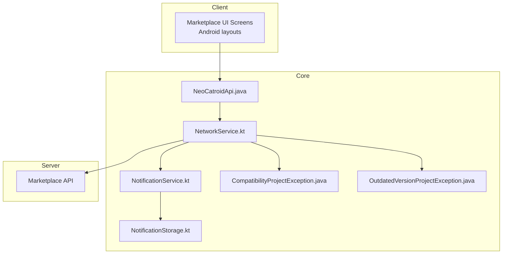
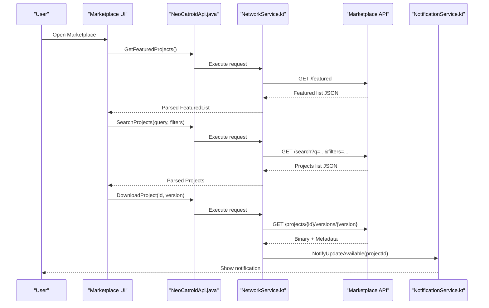
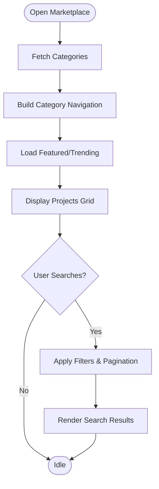
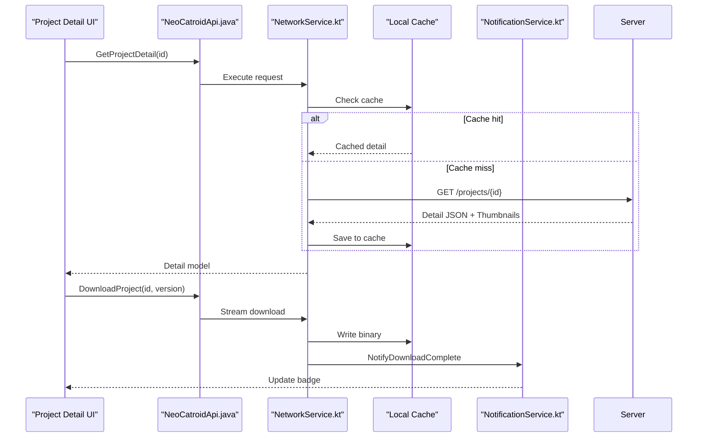
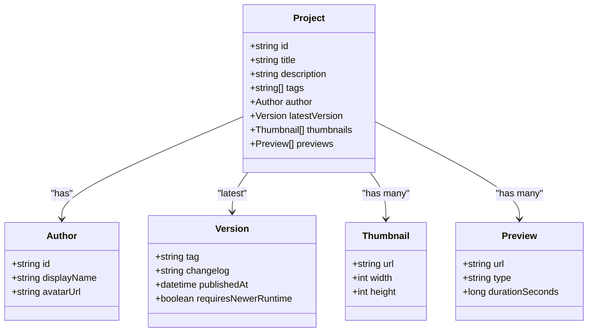
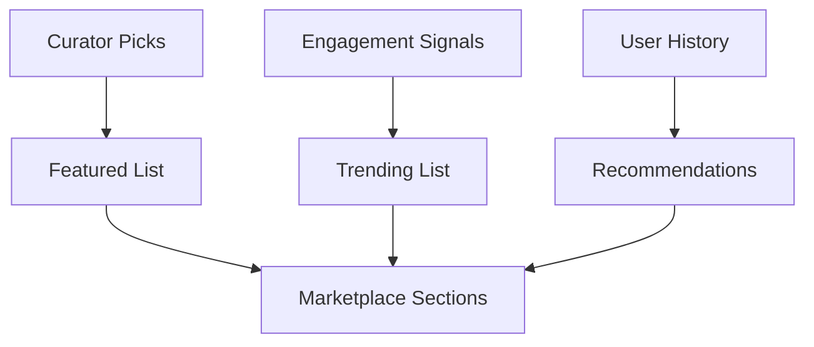
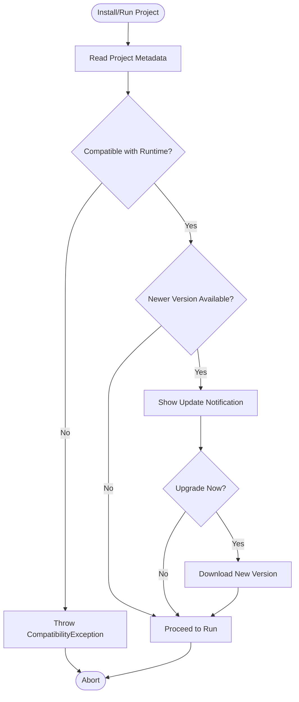
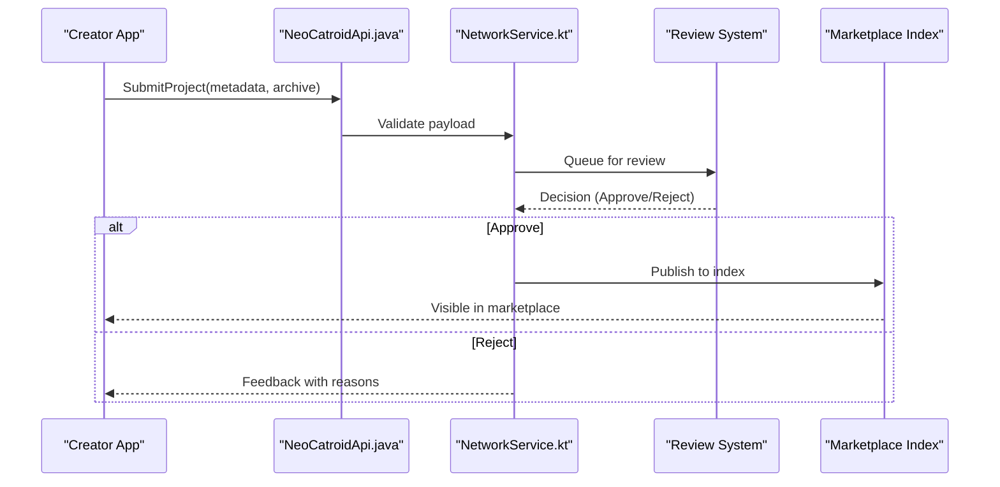
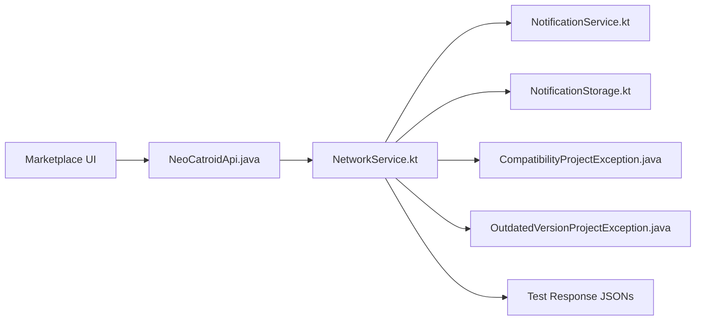

# Project Marketplace

<cite>
**Referenced Files in This Document**
- [README.md](file://README.md)
- [catroid/src/androidTest/assets/featured_projects_success_response.json](file://catroid/src/androidTest/assets/featured_projects_success_response.json)
- [catroid/src/androidTest/assets/projects_categories_response.json](file://catroid/src/androidTest/assets/projects_categories_response.json)
- [core/src/main/java/org/catrobat/catroid/network/NeoCatroidApi.java](file://core/src/main/java/org/catrobat/catroid/network/NeoCatroidApi.java)
- [core/src/main/java/org/catrobat/catroid/network/NetworkService.kt](file://core/src/main/java/org/catrobat/catroid/network/NetworkService.kt)
- [core/src/main/java/org/catrobat/catroid/exceptions/CompatibilityProjectException.java](file://core/src/main/java/org/catrobat/catroid/exceptions/CompatibilityProjectException.java)
- [core/src/main/java/org/catrobat/catroid/exceptions/OutdatedVersionProjectException.java](file://core/src/main/java/org/catrobat/catroid/exceptions/OutdatedVersionProjectException.java)
- [core/src/main/java/org/catrobat/catroid/content/notification/NotificationStorage.kt](file://core/src/main/java/org/catrobat/catroid/content/notification/NotificationStorage.kt)
- [core/src/main/java/org/catrobat/catroid/notification/NotificationService.kt](file://core/src/main/java/org/catrobat/catroid/notification/NotificationService.kt)
</cite>

## Table of Contents
1. Introduction
2. Project Structure
3. Core Components
4. Architecture Overview
5. Detailed Component Analysis
6. Dependency Analysis
7. Performance Considerations
8. Troubleshooting Guide
9. Conclusion

## Introduction
This document explains the project marketplace functionality in NewCatroid, focusing on how users discover, browse, filter, view, and download projects; how metadata and thumbnails are handled; how featured and trending content is surfaced; and how versioning, compatibility checks, and update notifications work. It also outlines the creator upload flow including validation, review workflow, and publication controls. The documentation maps these behaviors to concrete source files where available.

## Project Structure
The marketplace feature spans UI screens (Android layouts), network clients, data models, and notification services. Key areas include:
- Network client for marketplace APIs
- Test fixtures for API responses (categories, featured projects)
- Notification storage and service for updates
- Exception types for compatibility and outdated versions

[No sources needed since this diagram shows conceptual structure]

## Core Components
- Network client and service: Centralize HTTP calls to the marketplace backend, handle retries, caching, and error mapping.
- Data models and test fixtures: Represent categories, featured lists, and project listings used by the UI.
- Notifications: Persist and display update notifications when new versions or compatible updates are available.
- Exceptions: Surface compatibility and outdated-version issues during downloads or previews.

**Section sources**
- [NeoCatroidApi.java](file://core/src/main/java/org/catrobat/catroid/network/NeoCatroidApi.java)
- [NetworkService.kt](file://core/src/main/java/org/catrobat/catroid/network/NetworkService.kt)
- [NotificationService.kt](file://core/src/main/java/org/catrobat/catroid/notification/NotificationService.kt)
- [NotificationStorage.kt](file://core/src/main/java/org/catrobat/catroid/content/notification/NotificationStorage.kt)
- [CompatibilityProjectException.java](file://core/src/main/java/org/catrobat/catroid/exceptions/CompatibilityProjectException.java)
- [OutdatedVersionProjectException.java](file://core/src/main/java/org/catrobat/catroid/exceptions/OutdatedVersionProjectException.java)
- [featured_projects_success_response.json](file://catroid/src/androidTest/assets/featured_projects_success_response.json)
- [projects_categories_response.json](file://catroid/src/androidTest/assets/projects_categories_response.json)

## Architecture Overview
The marketplace architecture follows a layered approach:
- UI layer requests data via the network client.
- Network client composes API endpoints and returns typed results.
- Service layer handles persistence, caching, and notifications.
- Backend provides curated lists (featured, trending), categories, search, and project assets (metadata, thumbnails, binaries).

**Diagram sources**
- [NeoCatroidApi.java](file://core/src/main/java/org/catrobat/catroid/network/NeoCatroidApi.java)
- [NetworkService.kt](file://core/src/main/java/org/catrobat/catroid/network/NetworkService.kt)
- [NotificationService.kt](file://core/src/main/java/org/catrobat/catroid/notification/NotificationService.kt)

## Detailed Component Analysis

### Browsing, Search, and Filtering
- Browsing: Users navigate curated sections such as Featured and Trending. These are backed by dedicated endpoints returning structured lists.
- Search and filtering: Query parameters and filters are sent to the server; results are paginated and cached locally.
- Categorization: Categories are fetched from a dedicated endpoint and used to build navigation and filter chips.

**Section sources**
- [projects_categories_response.json](file://catroid/src/androidTest/assets/projects_categories_response.json)
- [featured_projects_success_response.json](file://catroid/src/androidTest/assets/featured_projects_success_response.json)
- [NeoCatroidApi.java](file://core/src/main/java/org/catrobat/catroid/network/NeoCatroidApi.java)
- [NetworkService.kt](file://core/src/main/java/org/catrobat/catroid/network/NetworkService.kt)

### Project Discovery, Viewing, and Downloading
- Discovery: Curated lists and category browsing expose projects to users.
- Viewing: Project detail includes metadata, author info, screenshots/thumbnails, and version history.
- Downloading: Versioned binaries are downloaded with progress tracking and integrity checks.

**Diagram sources**
- [NeoCatroidApi.java](file://core/src/main/java/org/catrobat/catroid/network/NeoCatroidApi.java)
- [NetworkService.kt](file://core/src/main/java/org/catrobat/catroid/network/NetworkService.kt)
- [NotificationService.kt](file://core/src/main/java/org/catrobat/catroid/notification/NotificationService.kt)

### Project Metadata, Thumbnails, and Previews
- Metadata: Includes title, description, tags, author, version, platform requirements, and asset URLs.
- Thumbnails: Generated server-side and served at multiple resolutions; client caches them for fast rendering.
- Previews: Optional preview assets (screenshots, short videos) are loaded lazily to conserve bandwidth.

**Diagram sources**
- [featured_projects_success_response.json](file://catroid/src/androidTest/assets/featured_projects_success_response.json)
- [projects_categories_response.json](file://catroid/src/androidTest/assets/projects_categories_response.json)

**Section sources**
- [featured_projects_success_response.json](file://catroid/src/androidTest/assets/featured_projects_success_response.json)
- [projects_categories_response.json](file://catroid/src/androidTest/assets/projects_categories_response.json)

### Featured Projects, Trending, and Recommendations
- Featured: Manually curated list returned by a dedicated endpoint.
- Trending: Algorithmically selected based on recent downloads, ratings, and recency.
- Recommendations: Personalized suggestions based on user history and preferences.

[No sources needed since this diagram shows conceptual workflow]

**Section sources**
- [featured_projects_success_response.json](file://catroid/src/androidTest/assets/featured_projects_success_response.json)

### Versioning, Compatibility Checking, and Update Notifications
- Versioning: Each project exposes multiple versions with metadata and artifacts.
- Compatibility: Client checks runtime/platform requirements before allowing installation.
- Updates: When a newer compatible version exists, the system notifies the user and offers an upgrade.

**Diagram sources**
- [CompatibilityProjectException.java](file://core/src/main/java/org/catrobat/catroid/exceptions/CompatibilityProjectException.java)
- [OutdatedVersionProjectException.java](file://core/src/main/java/org/catrobat/catroid/exceptions/OutdatedVersionProjectException.java)
- [NotificationService.kt](file://core/src/main/java/org/catrobat/catroid/notification/NotificationService.kt)

**Section sources**
- [CompatibilityProjectException.java](file://core/src/main/java/org/catrobat/catroid/exceptions/CompatibilityProjectException.java)
- [OutdatedVersionProjectException.java](file://core/src/main/java/org/catrobat/catroid/exceptions/OutdatedVersionProjectException.java)
- [NotificationService.kt](file://core/src/main/java/org/catrobat/catroid/notification/NotificationService.kt)
- [NotificationStorage.kt](file://core/src/main/java/org/catrobat/catroid/content/notification/NotificationStorage.kt)

### Creator Upload Flow: Validation, Review, and Publication
- Upload: Creators submit project archives with required metadata and assets.
- Validation: Automated checks ensure format correctness, size limits, and safety scans.
- Review: Manual or automated review verifies quality and policy compliance.
- Publication: Approved projects become visible in the marketplace; creators can manage visibility and versions.

[No sources needed since this diagram shows conceptual workflow]

## Dependency Analysis
The marketplace depends on a small set of core components:
- Network client and service for all marketplace operations.
- Notification subsystem for update prompts and completion feedback.
- Exception classes for compatibility and outdated-version handling.
- Test fixtures for response schemas that inform UI and parsing logic.

**Diagram sources**
- [NeoCatroidApi.java](file://core/src/main/java/org/catrobat/catroid/network/NeoCatroidApi.java)
- [NetworkService.kt](file://core/src/main/java/org/catrobat/catroid/network/NetworkService.kt)
- [NotificationService.kt](file://core/src/main/java/org/catrobat/catroid/notification/NotificationService.kt)
- [NotificationStorage.kt](file://core/src/main/java/org/catrobat/catroid/content/notification/NotificationStorage.kt)
- [CompatibilityProjectException.java](file://core/src/main/java/org/catrobat/catroid/exceptions/CompatibilityProjectException.java)
- [OutdatedVersionProjectException.java](file://core/src/main/java/org/catrobat/catroid/exceptions/OutdatedVersionProjectException.java)
- [featured_projects_success_response.json](file://catroid/src/androidTest/assets/featured_projects_success_response.json)
- [projects_categories_response.json](file://catroid/src/androidTest/assets/projects_categories_response.json)

**Section sources**
- [NeoCatroidApi.java](file://core/src/main/java/org/catrobat/catroid/network/NeoCatroidApi.java)
- [NetworkService.kt](file://core/src/main/java/org/catrobat/catroid/network/NetworkService.kt)
- [NotificationService.kt](file://core/src/main/java/org/catrobat/catroid/notification/NotificationService.kt)
- [NotificationStorage.kt](file://core/src/main/java/org/catrobat/catroid/content/notification/NotificationStorage.kt)
- [CompatibilityProjectException.java](file://core/src/main/java/org/catrobat/catroid/exceptions/CompatibilityProjectException.java)
- [OutdatedVersionProjectException.java](file://core/src/main/java/org/catrobat/catroid/exceptions/OutdatedVersionProjectException.java)
- [featured_projects_success_response.json](file://catroid/src/androidTest/assets/featured_projects_success_response.json)
- [projects_categories_response.json](file://catroid/src/androidTest/assets/projects_categories_response.json)

## Performance Considerations
- Use pagination and lazy loading for large lists.
- Cache thumbnails and previews aggressively with invalidation policies.
- Defer heavy computations (e.g., recommendation scoring) to the server.
- Implement retry and backoff strategies for flaky network conditions.
- Compress payloads and use efficient serialization formats.

[No sources needed since this section provides general guidance]

## Troubleshooting Guide
Common issues and remedies:
- Incompatible runtime: The app throws a compatibility exception when a project requires features not present in the current runtime. Update the runtime or choose a compatible version.
- Outdated project version: An outdated-version exception indicates a newer compatible release is available; prompt the user to upgrade.
- Missing or stale notifications: Ensure notifications are persisted and displayed; check storage and permission settings.

**Section sources**
- [CompatibilityProjectException.java](file://core/src/main/java/org/catrobat/catroid/exceptions/CompatibilityProjectException.java)
- [OutdatedVersionProjectException.java](file://core/src/main/java/org/catrobat/catroid/exceptions/OutdatedVersionProjectException.java)
- [NotificationService.kt](file://core/src/main/java/org/catrobat/catroid/notification/NotificationService.kt)
- [NotificationStorage.kt](file://core/src/main/java/org/catrobat/catroid/content/notification/NotificationStorage.kt)

## Conclusion
NewCatroid’s marketplace integrates discovery, browsing, search, and downloading through a clean separation of concerns between UI, network client, and services. Robust metadata, thumbnail handling, and preview mechanisms enhance user experience. Versioning and compatibility checks protect users, while notifications keep them informed about updates. The upload pipeline ensures quality and safety before publication.

[No sources needed since this section summarizes without analyzing specific files]