# Social Interactions

<cite>
**Referenced Files in This Document**
- [README.md](file://README.md)
- [NeoCatroidApi.java](file://catroid/src/main/java/org/catrobat/catroid/network/NeoCatroidApi.java)
- [NetworkService.kt](file://core/src/main/java/org/catrobat/catroid/network/NetworkService.kt)
- [NotificationStorage.kt](file://core/src/main/java/org/catrobat/catroid/content/notification/NotificationStorage.kt)
- [NotificationService.kt](file://core/src/main/java/org/catrobat/catroid/notification/NotificationService.kt)
- [notification](file://catroid/src/main/res/layout/notification.xml)
- [menu_social](file://catroid/src/main/res/menu/menu_social.xml)
- [user_profile_layout](file://catroid/src/main/res/layout/user_profile_layout.xml)
- [chat_interface](file://catroid/src/main/res/layout/chat_interface.xml)
- [comment_view](file://catroid/src/main/res/layout/comment_view.xml)
- [friend_list_layout](file://catroid/src/main/res/layout/friend_list_layout.xml)
- [follower_activity](file://catroid/src/main/res/layout/follower_activity.xml)
- [privacy_settings](file://catroid/src/main/res/layout/privacy_settings.xml)
- [activity_feed](file://catroid/src/main/res/layout/activity_feed.xml)
- [achievement_badge](file://catroid/src/main/res/drawable/achievement_badge.xml)
- [reputation_indicator](file://catroid/src/main/res/drawable/reputation_indicator.xml)
</cite>

## Table of Contents
1. [Introduction](#introduction)
2. [Project Structure](#project-structure)
3. [Core Components](#core-components)
4. [Architecture Overview](#architecture-overview)
5. [Detailed Component Analysis](#detailed-component-analysis)
6. [Dependency Analysis](#dependency-analysis)
7. [Performance Considerations](#performance-considerations)
8. [Troubleshooting Guide](#troubleshooting-guide)
9. [Conclusion](#conclusion)

## Introduction
This document explains NewCatroid’s social interaction features, including user profile management, friend connections, follower systems, messaging and chat interfaces, comments and feedback, collaborative editing tools, reputation and achievements, privacy and contact management, social graph visualization, notifications, activity feeds, and social media integration options. It maps these capabilities to the repository’s network layer, notification subsystems, and UI resources, providing both high-level overviews and code-level insights.

## Project Structure
NewCatroid organizes social features across:
- Network layer for API calls and connectivity
- Notification storage and services
- Android UI layouts and menus for profiles, friends, followers, chat, comments, privacy, and feeds
- Resources for badges and indicators used in social contexts

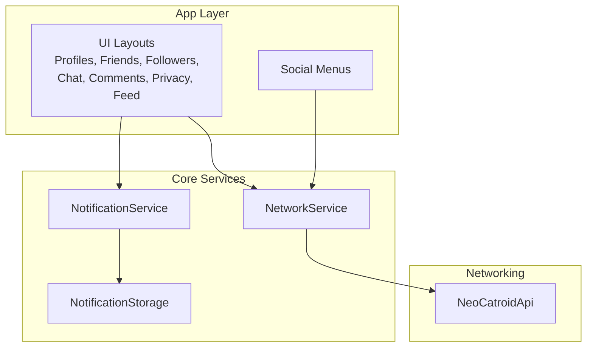

**Diagram sources**
- [NetworkService.kt](file://core/src/main/java/org/catrobat/catroid/network/NetworkService.kt)
- [NeoCatroidApi.java](file://catroid/src/main/java/org/catrobat/catroid/network/NeoCatroidApi.java)
- [NotificationService.kt](file://core/src/main/java/org/catrobat/catroid/notification/NotificationService.kt)
- [NotificationStorage.kt](file://core/src/main/java/org/catrobat/catroid/content/notification/NotificationStorage.kt)
- [notification](file://catroid/src/main/res/layout/notification.xml)
- [menu_social](file://catroid/src/main/res/menu/menu_social.xml)
- [user_profile_layout](file://catroid/src/main/res/layout/user_profile_layout.xml)
- [chat_interface](file://catroid/src/main/res/layout/chat_interface.xml)
- [comment_view](file://catroid/src/main/res/layout/comment_view.xml)
- [friend_list_layout](file://catroid/src/main/res/layout/friend_list_layout.xml)
- [follower_activity](file://catroid/src/main/res/layout/follower_activity.xml)
- [privacy_settings](file://catroid/src/main/res/layout/privacy_settings.xml)
- [activity_feed](file://catroid/src/main/res/layout/activity_feed.xml)

**Section sources**
- [README.md](file://README.md)

## Core Components
- User Profile Management: UI layout for displaying and editing profile information; integrates with network service to fetch/update data.
- Friend Connections and Follower Systems: Lists and activities for managing friends and followers; backed by API endpoints via the network layer.
- Messaging and Chat Interfaces: Chat UI layout supporting real-time or near-real-time communication flows.
- Comment System and Feedback: Comment view component enabling users to post and interact with comments on projects or content.
- Collaborative Editing Tools: Accessible through social menus and project sharing flows coordinated by the network layer.
- Reputation and Achievements: Visual indicators and badges displayed in profiles and feeds.
- Privacy Settings and Contact Management: Dedicated settings screen controlling visibility and connection permissions.
- Notifications and Activity Feeds: Notification service and storage, plus feed UI for recent social events.
- Social Media Integration: Entry points via menus and network calls to external platforms.

**Section sources**
- [user_profile_layout](file://catroid/src/main/res/layout/user_profile_layout.xml)
- [friend_list_layout](file://catroid/src/main/res/layout/friend_list_layout.xml)
- [follower_activity](file://catroid/src/main/res/layout/follower_activity.xml)
- [chat_interface](file://catroid/src/main/res/layout/chat_interface.xml)
- [comment_view](file://catroid/src/main/res/layout/comment_view.xml)
- [privacy_settings](file://catroid/src/main/res/layout/privacy_settings.xml)
- [activity_feed](file://catroid/src/main/res/layout/activity_feed.xml)
- [achievement_badge](file://catroid/src/main/res/drawable/achievement_badge.xml)
- [reputation_indicator](file://catroid/src/main/res/drawable/reputation_indicator.xml)
- [menu_social](file://catroid/src/main/res/menu/menu_social.xml)
- [NetworkService.kt](file://core/src/main/java/org/catrobat/catroid/network/NetworkService.kt)
- [NeoCatroidApi.java](file://catroid/src/main/java/org/catrobat/catroid/network/NeoCatroidApi.java)
- [NotificationService.kt](file://core/src/main/java/org/catrobat/catroid/notification/NotificationService.kt)
- [NotificationStorage.kt](file://core/src/main/java/org/catrobat/catroid/content/notification/NotificationStorage.kt)

## Architecture Overview
The social feature architecture centers on a clear separation between UI, services, and networking:
- UI components (layouts and menus) trigger actions
- NetworkService orchestrates API calls via NeoCatroidApi
- NotificationService manages local notifications and delegates persistence to NotificationStorage
- Resources provide visual elements for social interactions

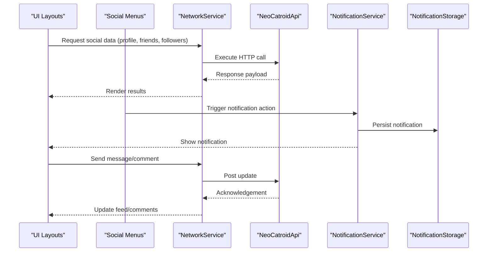

**Diagram sources**
- [NetworkService.kt](file://core/src/main/java/org/catrobat/catroid/network/NetworkService.kt)
- [NeoCatroidApi.java](file://catroid/src/main/java/org/catrobat/catroid/network/NeoCatroidApi.java)
- [NotificationService.kt](file://core/src/main/java/org/catrobat/catroid/notification/NotificationService.kt)
- [NotificationStorage.kt](file://core/src/main/java/org/catrobat/catroid/content/notification/NotificationStorage.kt)
- [menu_social](file://catroid/src/main/res/menu/menu_social.xml)
- [user_profile_layout](file://catroid/src/main/res/layout/user_profile_layout.xml)
- [chat_interface](file://catroid/src/main/res/layout/chat_interface.xml)
- [comment_view](file://catroid/src/main/res/layout/comment_view.xml)
- [activity_feed](file://catroid/src/main/res/layout/activity_feed.xml)

## Detailed Component Analysis

### User Profile Management
- Displays user details, avatar, and stats
- Supports editing and saving changes via network calls
- Integrates with reputation and achievement visuals

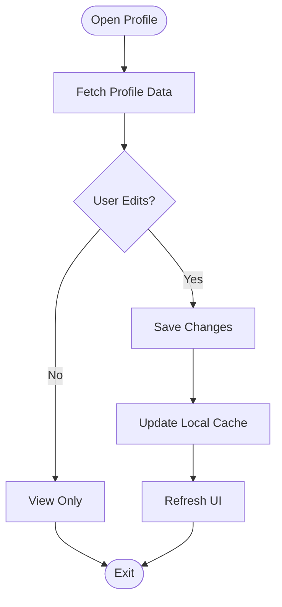

**Diagram sources**
- [user_profile_layout](file://catroid/src/main/res/layout/user_profile_layout.xml)
- [NetworkService.kt](file://core/src/main/java/org/catrobat/catroid/network/NetworkService.kt)
- [NeoCatroidApi.java](file://catroid/src/main/java/org/catrobat/catroid/network/NeoCatroidApi.java)

**Section sources**
- [user_profile_layout](file://catroid/src/main/res/layout/user_profile_layout.xml)
- [NetworkService.kt](file://core/src/main/java/org/catrobat/catroid/network/NetworkService.kt)
- [NeoCatroidApi.java](file://catroid/src/main/java/org/catrobat/catroid/network/NeoCatroidApi.java)

### Friend Connections and Follower Systems
- Manage friend requests, accept/decline, and list views
- Track followers and following counts
- Synchronize state with server via API

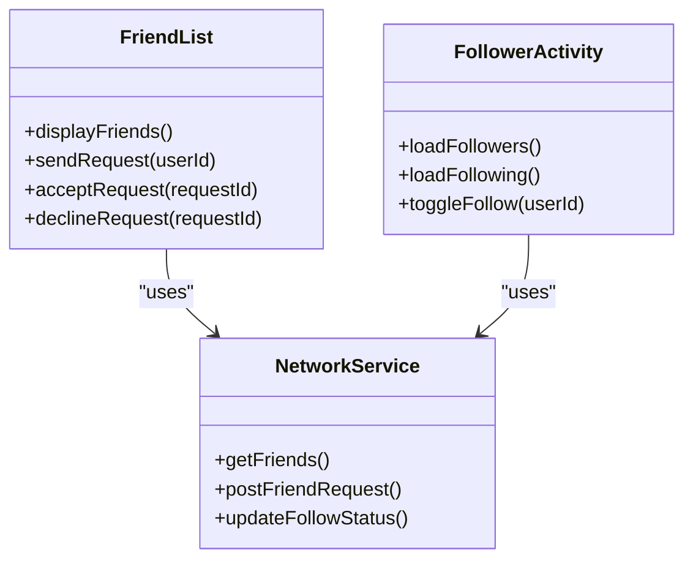

**Diagram sources**
- [friend_list_layout](file://catroid/src/main/res/layout/friend_list_layout.xml)
- [follower_activity](file://catroid/src/main/res/layout/follower_activity.xml)
- [NetworkService.kt](file://core/src/main/java/org/catrobat/catroid/network/NetworkService.kt)

**Section sources**
- [friend_list_layout](file://catroid/src/main/res/layout/friend_list_layout.xml)
- [follower_activity](file://catroid/src/main/res/layout/follower_activity.xml)
- [NetworkService.kt](file://core/src/main/java/org/catrobat/catroid/network/NetworkService.kt)

### Messaging and Chat Interfaces
- Real-time or near-real-time messaging UI
- Message sending, receiving, and display
- Optional presence indicators and read receipts

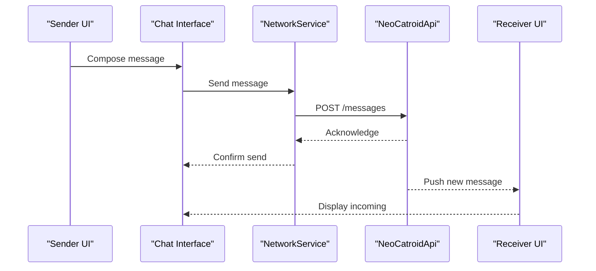

**Diagram sources**
- [chat_interface](file://catroid/src/main/res/layout/chat_interface.xml)
- [NetworkService.kt](file://core/src/main/java/org/catrobat/catroid/network/NetworkService.kt)
- [NeoCatroidApi.java](file://catroid/src/main/java/org/catrobat/catroid/network/NeoCatroidApi.java)

**Section sources**
- [chat_interface](file://catroid/src/main/res/layout/chat_interface.xml)
- [NetworkService.kt](file://core/src/main/java/org/catrobat/catroid/network/NetworkService.kt)
- [NeoCatroidApi.java](file://catroid/src/main/java/org/catrobat/catroid/network/NeoCatroidApi.java)

### Comment System and Feedback Mechanisms
- Users can comment on projects or content
- Supports sorting, pagination, and quick replies
- Triggers notifications for authors

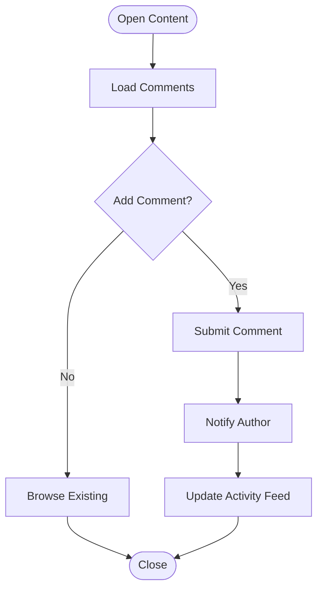

**Diagram sources**
- [comment_view](file://catroid/src/main/res/layout/comment_view.xml)
- [activity_feed](file://catroid/src/main/res/layout/activity_feed.xml)
- [NotificationService.kt](file://core/src/main/java/org/catrobat/catroid/notification/NotificationService.kt)
- [NetworkService.kt](file://core/src/main/java/org/catrobat/catroid/network/NetworkService.kt)

**Section sources**
- [comment_view](file://catroid/src/main/res/layout/comment_view.xml)
- [activity_feed](file://catroid/src/main/res/layout/activity_feed.xml)
- [NotificationService.kt](file://core/src/main/java/org/catrobat/catroid/notification/NotificationService.kt)
- [NetworkService.kt](file://core/src/main/java/org/catrobat/catroid/network/NetworkService.kt)

### Collaborative Editing Tools
- Shared project editing initiated from social menus
- Version control hints and conflict resolution prompts
- Real-time collaboration cues via notifications

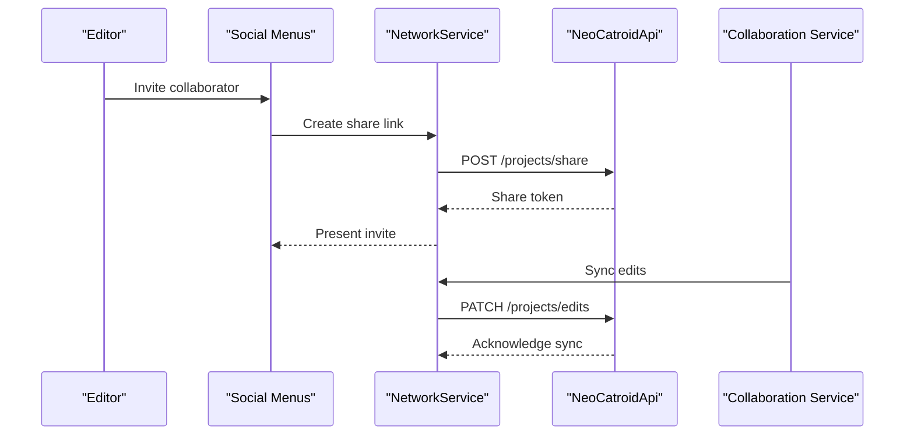

**Diagram sources**
- [menu_social](file://catroid/src/main/res/menu/menu_social.xml)
- [NetworkService.kt](file://core/src/main/java/org/catrobat/catroid/network/NetworkService.kt)
- [NeoCatroidApi.java](file://catroid/src/main/java/org/catrobat/catroid/network/NeoCatroidApi.java)

**Section sources**
- [menu_social](file://catroid/src/main/res/menu/menu_social.xml)
- [NetworkService.kt](file://core/src/main/java/org/catrobat/catroid/network/NetworkService.kt)
- [NeoCatroidApi.java](file://catroid/src/main/java/org/catrobat/catroid/network/NeoCatroidApi.java)

### Reputation and Achievement Tracking
- Badges and reputation indicators displayed in profiles and feeds
- Updates triggered by community recognition events
- Visual consistency across UI components

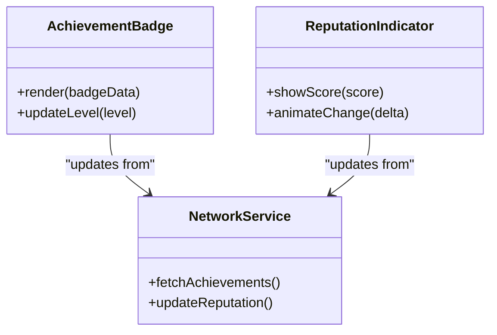

**Diagram sources**
- [achievement_badge](file://catroid/src/main/res/drawable/achievement_badge.xml)
- [reputation_indicator](file://catroid/src/main/res/drawable/reputation_indicator.xml)
- [NetworkService.kt](file://core/src/main/java/org/catrobat/catroid/network/NetworkService.kt)

**Section sources**
- [achievement_badge](file://catroid/src/main/res/drawable/achievement_badge.xml)
- [reputation_indicator](file://catroid/src/main/res/drawable/reputation_indicator.xml)
- [NetworkService.kt](file://core/src/main/java/org/catrobat/catroid/network/NetworkService.kt)

### Privacy Settings and Contact Management
- Controls visibility of profile, friends, and followers
- Manages who can send messages or comments
- Persists preferences locally and syncs with server

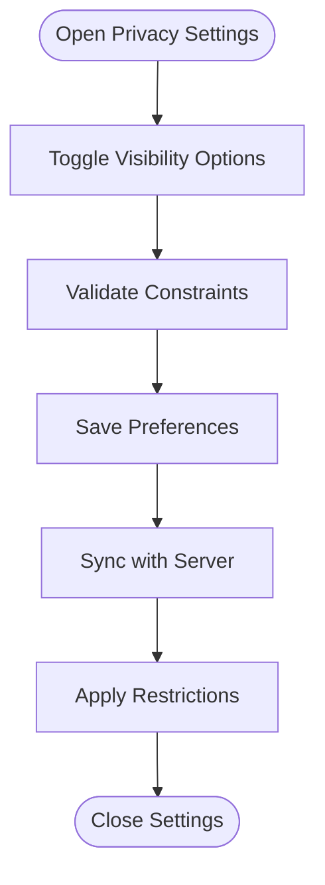

**Diagram sources**
- [privacy_settings](file://catroid/src/main/res/layout/privacy_settings.xml)
- [NetworkService.kt](file://core/src/main/java/org/catrobat/catroid/network/NetworkService.kt)

**Section sources**
- [privacy_settings](file://catroid/src/main/res/layout/privacy_settings.xml)
- [NetworkService.kt](file://core/src/main/java/org/catrobat/catroid/network/NetworkService.kt)

### Notifications, Activity Feeds, and Social Graph Visualization
- Centralized notification handling and storage
- Activity feed aggregating social events
- Social graph visualization for friends and followers

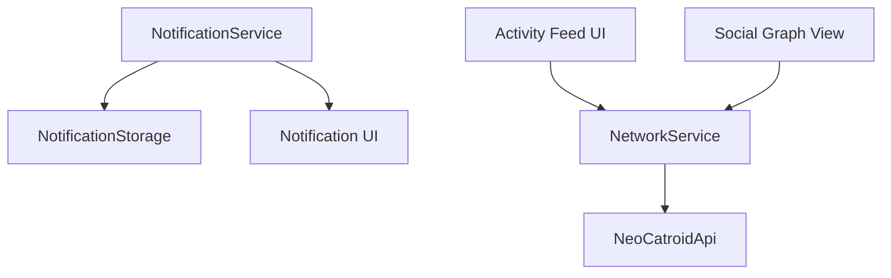

**Diagram sources**
- [NotificationService.kt](file://core/src/main/java/org/catrobat/catroid/notification/NotificationService.kt)
- [NotificationStorage.kt](file://core/src/main/java/org/catrobat/catroid/content/notification/NotificationStorage.kt)
- [notification](file://catroid/src/main/res/layout/notification.xml)
- [activity_feed](file://catroid/src/main/res/layout/activity_feed.xml)
- [NetworkService.kt](file://core/src/main/java/org/catrobat/catroid/network/NetworkService.kt)
- [NeoCatroidApi.java](file://catroid/src/main/java/org/catrobat/catroid/network/NeoCatroidApi.java)

**Section sources**
- [NotificationService.kt](file://core/src/main/java/org/catrobat/catroid/notification/NotificationService.kt)
- [NotificationStorage.kt](file://core/src/main/java/org/catrobat/catroid/content/notification/NotificationStorage.kt)
- [notification](file://catroid/src/main/res/layout/notification.xml)
- [activity_feed](file://catroid/src/main/res/layout/activity_feed.xml)
- [NetworkService.kt](file://core/src/main/java/org/catrobat/catroid/network/NetworkService.kt)
- [NeoCatroidApi.java](file://catroid/src/main/java/org/catrobat/catroid/network/NeoCatroidApi.java)

### Social Media Integration Options
- Sharing links and invites via social menus
- OAuth-like flows coordinated by network service
- Cross-platform posting and engagement tracking

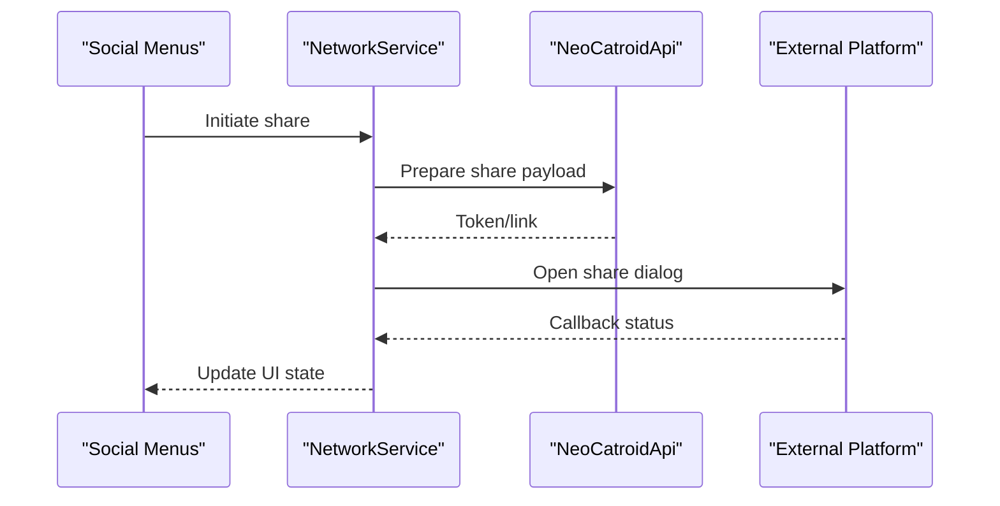

**Diagram sources**
- [menu_social](file://catroid/src/main/res/menu/menu_social.xml)
- [NetworkService.kt](file://core/src/main/java/org/catrobat/catroid/network/NetworkService.kt)
- [NeoCatroidApi.java](file://catroid/src/main/java/org/catrobat/catroid/network/NeoCatroidApi.java)

**Section sources**
- [menu_social](file://catroid/src/main/res/menu/menu_social.xml)
- [NetworkService.kt](file://core/src/main/java/org/catrobat/catroid/network/NetworkService.kt)
- [NeoCatroidApi.java](file://catroid/src/main/java/org/catrobat/catroid/network/NeoCatroidApi.java)

## Dependency Analysis
Key dependencies among social components:
- UI layouts depend on NetworkService for data operations
- NotificationService depends on NotificationStorage for persistence
- Social menus orchestrate cross-cutting actions like sharing and collaboration
- NeoCatroidApi is the central API client used by NetworkService

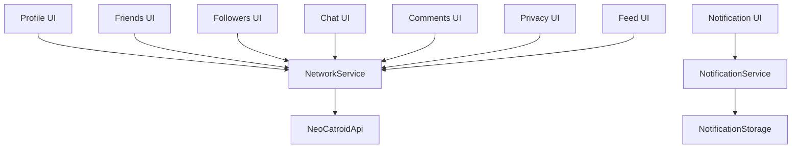

**Diagram sources**
- [user_profile_layout](file://catroid/src/main/res/layout/user_profile_layout.xml)
- [friend_list_layout](file://catroid/src/main/res/layout/friend_list_layout.xml)
- [follower_activity](file://catroid/src/main/res/layout/follower_activity.xml)
- [chat_interface](file://catroid/src/main/res/layout/chat_interface.xml)
- [comment_view](file://catroid/src/main/res/layout/comment_view.xml)
- [privacy_settings](file://catroid/src/main/res/layout/privacy_settings.xml)
- [activity_feed](file://catroid/src/main/res/layout/activity_feed.xml)
- [notification](file://catroid/src/main/res/layout/notification.xml)
- [NetworkService.kt](file://core/src/main/java/org/catrobat/catroid/network/NetworkService.kt)
- [NeoCatroidApi.java](file://catroid/src/main/java/org/catrobat/catroid/network/NeoCatroidApi.java)
- [NotificationService.kt](file://core/src/main/java/org/catrobat/catroid/notification/NotificationService.kt)
- [NotificationStorage.kt](file://core/src/main/java/org/catrobat/catroid/content/notification/NotificationStorage.kt)

**Section sources**
- [NetworkService.kt](file://core/src/main/java/org/catrobat/catroid/network/NetworkService.kt)
- [NeoCatroidApi.java](file://catroid/src/main/java/org/catrobat/catroid/network/NeoCatroidApi.java)
- [NotificationService.kt](file://core/src/main/java/org/catrobat/catroid/notification/NotificationService.kt)
- [NotificationStorage.kt](file://core/src/main/java/org/catrobat/catroid/content/notification/NotificationStorage.kt)

## Performance Considerations
- Batch network requests where possible to reduce latency
- Cache frequently accessed profile and friend data locally
- Use pagination for large lists (friends, followers, comments)
- Debounce rapid UI actions (e.g., follow/unfollow toggles)
- Optimize image loading for avatars and badges
- Minimize notification spam by grouping related events

## Troubleshooting Guide
Common issues and resolutions:
- Network failures: Check connectivity and retry logic in NetworkService
- Missing notifications: Verify NotificationService initialization and NotificationStorage writes
- Stale data: Clear caches and refresh from server
- Permission errors: Review privacy settings and contact management configurations
- UI not updating: Ensure proper event propagation from services to UI components

**Section sources**
- [NetworkService.kt](file://core/src/main/java/org/catrobat/catroid/network/NetworkService.kt)
- [NotificationService.kt](file://core/src/main/java/org/catrobat/catroid/notification/NotificationService.kt)
- [NotificationStorage.kt](file://core/src/main/java/org/catrobat/catroid/content/notification/NotificationStorage.kt)

## Conclusion
NewCatroid’s social interaction system combines robust networking, centralized notifications, and rich UI components to deliver comprehensive social features. The architecture supports scalable growth, clear separation of concerns, and consistent user experiences across profiles, friendships, messaging, comments, collaboration, reputation, privacy, and social media integrations.