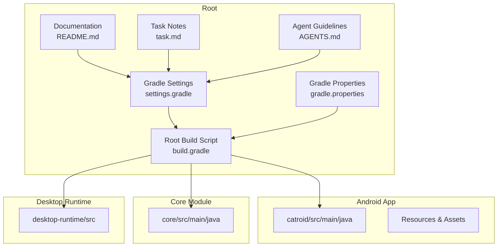
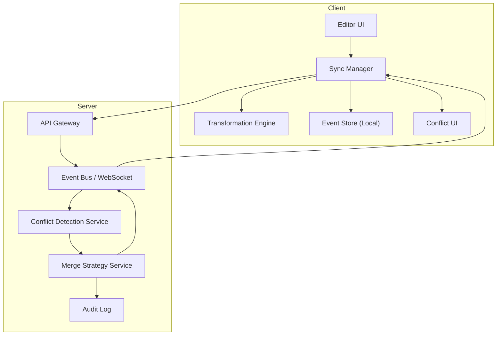
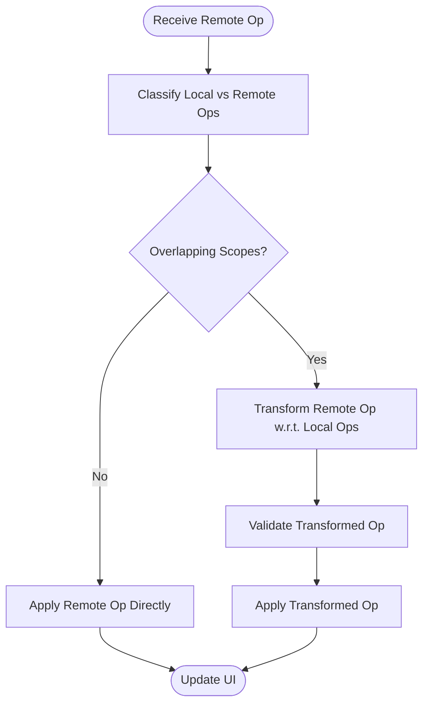
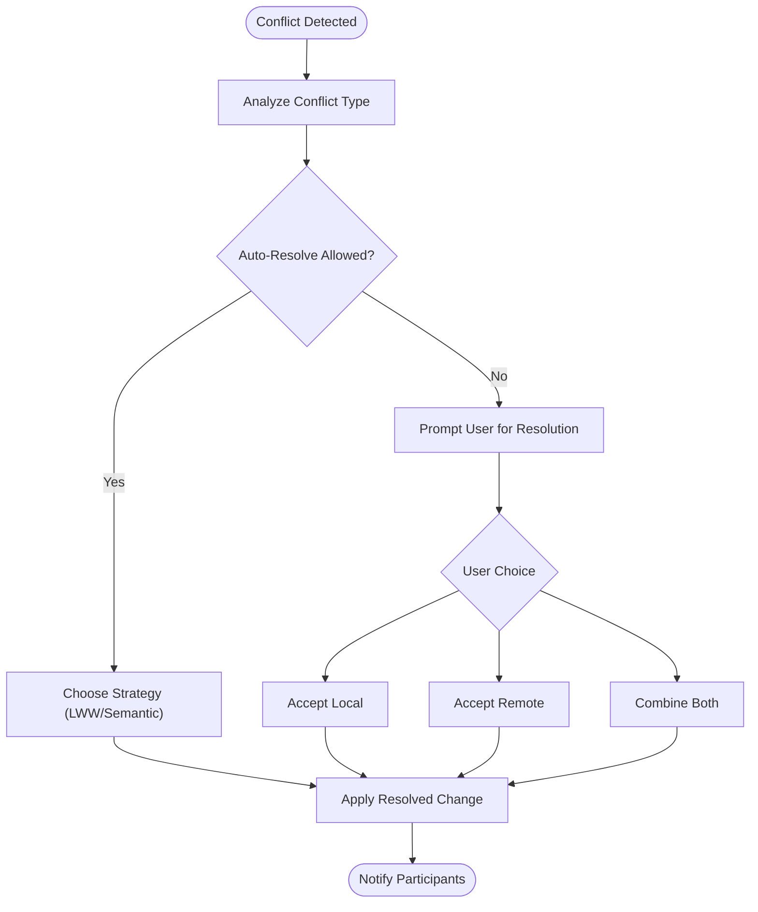
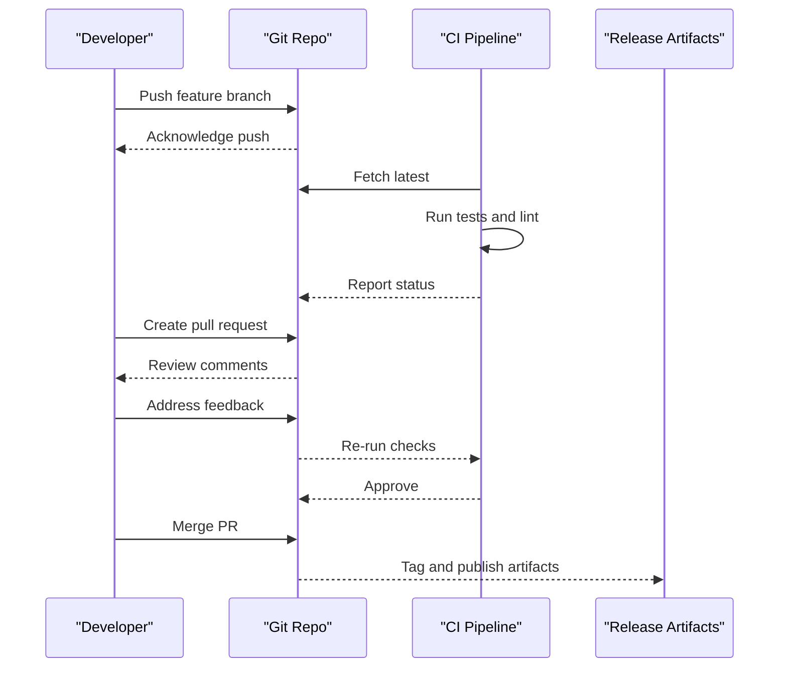
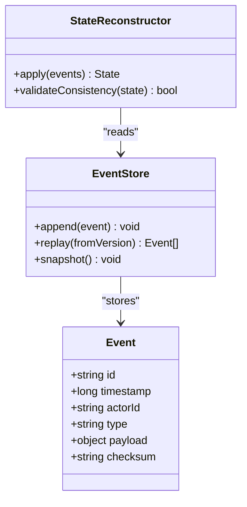
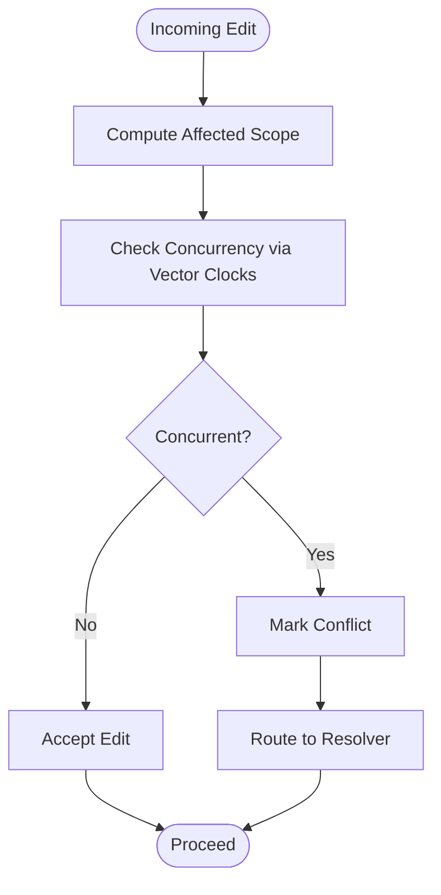
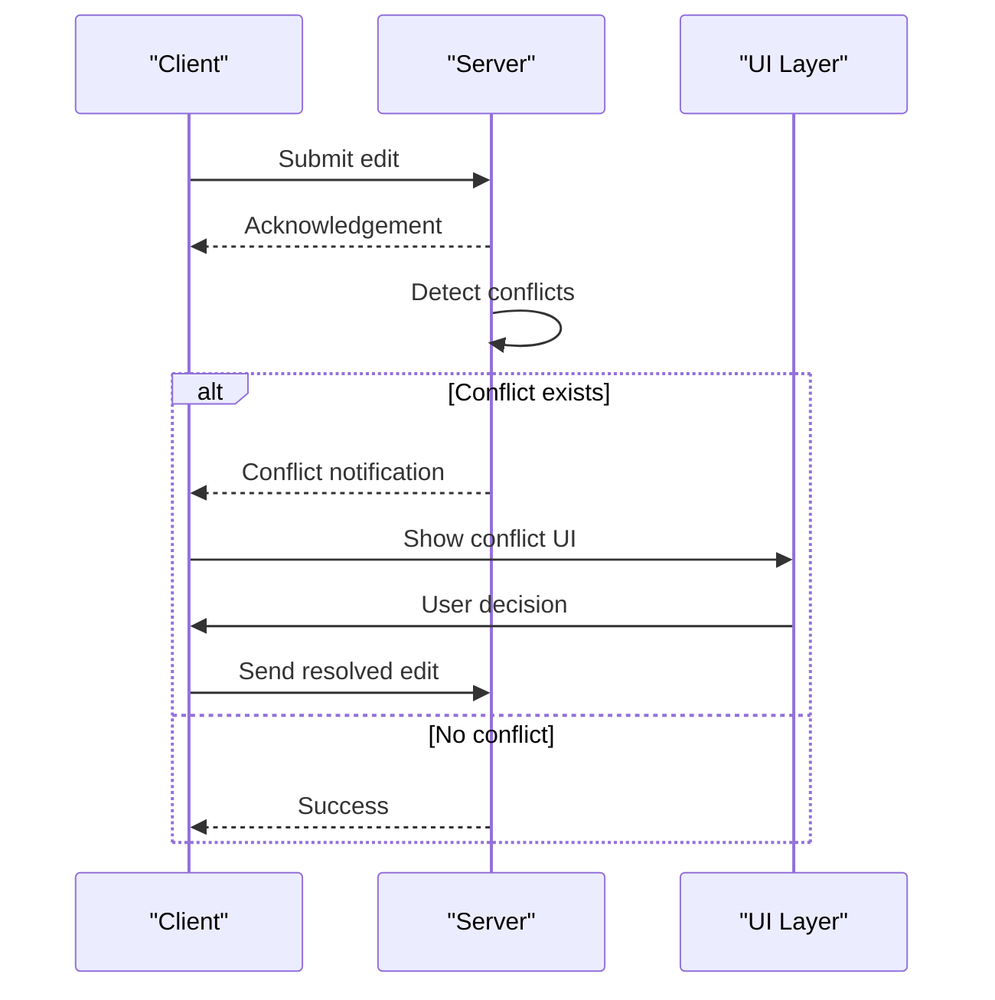
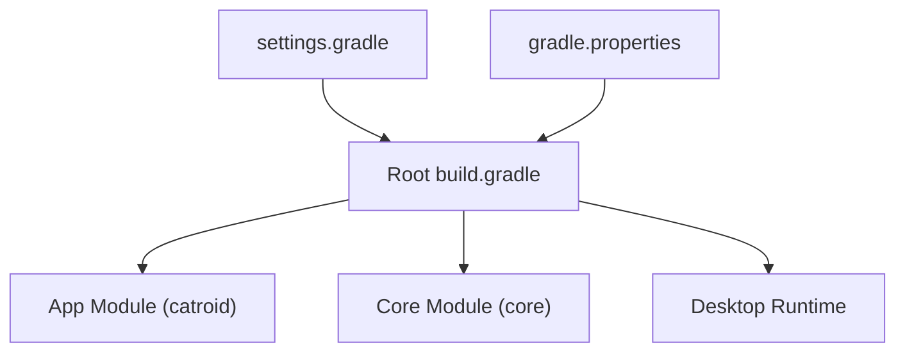

# Conflict Resolution and State Synchronization

<cite>
**Referenced Files in This Document**
- [README.md](file://README.md)
- [task.md](file://task.md)
- [AGENTS.md](file://AGENTS.md)
- [gradle.properties](file://gradle.properties)
- [settings.gradle](file://settings.gradle)
- [build.gradle](file://build.gradle)
</cite>

## Table of Contents
1. [Introduction](#introduction)
2. [Project Structure](#project-structure)
3. [Core Components](#core-components)
4. [Architecture Overview](#architecture-overview)
5. [Detailed Component Analysis](#detailed-component-analysis)
6. [Dependency Analysis](#dependency-analysis)
7. [Performance Considerations](#performance-considerations)
8. [Troubleshooting Guide](#troubleshooting-guide)
9. [Conclusion](#conclusion)
10. [Appendices](#appendices)

## Introduction
This document focuses on conflict resolution algorithms and state synchronization mechanisms for NewCatroid, with emphasis on:
- Operational transformation (OT) for concurrent block edits
- Merge strategies for conflicting changes
- Version control integration
- Event sourcing patterns for collaborative state consistency
- Conflict detection algorithms, resolution policies, and user feedback mechanisms
- Performance considerations for large projects and optimization strategies for real-time synchronization

The repository is a large Android/Java/Kotlin project with multiple modules and build configurations. The available context does not include direct source files implementing OT or event sourcing; therefore, this document synthesizes best practices and proposes concrete designs aligned with the project’s structure and build system. Where applicable, it references existing configuration and documentation files to ground recommendations in the actual codebase.

## Project Structure
NewCatroid is organized into multiple modules and platforms:
- Android app module under catroid/src/main/java
- Core shared logic under core/src/main/java
- Desktop runtime under desktop-runtime
- Additional tooling and scripts at the root level

Build and dependency management are handled by Gradle, with settings and properties defined at the root.

**Diagram sources**
- [settings.gradle](file://settings.gradle)
- [gradle.properties](file://gradle.properties)
- [build.gradle](file://build.gradle)
- [README.md](file://README.md)
- [task.md](file://task.md)
- [AGENTS.md](file://AGENTS.md)

**Section sources**
- [README.md](file://README.md)
- [task.md](file://task.md)
- [AGENTS.md](file://AGENTS.md)
- [gradle.properties](file://gradle.properties)
- [settings.gradle](file://settings.gradle)
- [build.gradle](file://build.gradle)

## Core Components
Given the absence of explicit collaborative editing implementations in the provided context, we outline the conceptual components required for robust conflict resolution and synchronization:

- Operation Log and Event Store
  - Purpose: Persist ordered events describing user actions (e.g., insert, delete, move blocks).
  - Responsibilities: Append-only storage, versioning, replayability.
  - Data model: Event ID, timestamp, actor, operation type, target scope, payload, checksum.

- Conflict Detector
  - Purpose: Identify overlapping edits across clients.
  - Responsibilities: Compare event scopes, detect overlaps, classify conflicts (insert-insert, delete-delete, insert-delete).

- Transformation Engine (OT)
  - Purpose: Transform operations to preserve intent when applied out-of-order.
  - Responsibilities: Define transform functions per operation pair, ensure commutativity and convergence.

- Merge Strategy
  - Purpose: Resolve irreconcilable conflicts deterministically.
  - Strategies: Last-writer-wins (LWW), semantic merge (block-aware), manual resolution UI.

- Client-Side Sync Manager
  - Purpose: Coordinate sending local ops, receiving remote ops, applying transformations, and updating UI.
  - Responsibilities: Queueing, batching, retry, backoff, reconciliation.

- User Feedback Layer
  - Purpose: Inform users about conflicts and resolution outcomes.
  - Responsibilities: Non-blocking notifications, undo/redo support, visual diff indicators.

[No sources needed since this section provides general guidance]

## Architecture Overview
A high-level architecture for collaborative block editing with OT and event sourcing:

[No sources needed since this diagram shows conceptual workflow, not actual code structure]

## Detailed Component Analysis

### Operational Transformation for Concurrent Block Edits
- Scope definition: Operations should be scoped to specific blocks or scenes to minimize transformation complexity.
- Transform rules:
  - Insert vs Insert: Adjust indices based on prior inserts.
  - Delete vs Insert/Delete: Shift indices and handle cascading deletions.
  - Move operations: Treat as delete+insert pairs with ordering constraints.
- Convergence guarantee: Ensure that all clients apply the same sequence of transformed operations to reach identical states.

[No sources needed since this flowchart shows conceptual algorithm implementation]

### Merge Strategies for Conflicting Changes
- Automatic strategies:
  - Last-writer-wins: Simple but may lose user intent.
  - Semantic merge: Preserve block relationships and scene integrity.
- Manual resolution:
  - Present side-by-side diffs.
  - Allow selective acceptance/rejection.
- Policy enforcement:
  - Per-project or per-user policy flags.
  - Audit trail for decisions.

[No sources needed since this flowchart shows conceptual algorithm implementation]

### Version Control Integration
- Commit boundaries: Align commits with logical milestones (scene updates, asset bundles).
- Branching strategy: Feature branches for major edits; hotfixes for urgent corrections.
- Merge workflows: Use rebase for linear history; squash for clean release notes.
- Conflict markers: Integrate with editor to highlight unresolved merges.

[No sources needed since this sequence diagram shows conceptual workflow]

### Event Sourcing Pattern for Collaborative State Consistency
- Event stream: Append-only log of immutable events.
- Snapshotting: Periodic snapshots to speed up replay.
- Replay engine: Reconstruct state from events for debugging and recovery.
- Idempotency: Ensure safe retries and deduplication.

[No sources needed since this class diagram shows conceptual design]

### Conflict Detection Algorithms
- Interval-based overlap: Represent edits as intervals over block IDs or positions.
- Vector clocks: Track causality to detect concurrent modifications.
- Hash-based change sets: Compare hashes of affected regions to quickly identify differences.

[No sources needed since this flowchart shows conceptual algorithm implementation]

### Resolution Policies and User Feedback Mechanisms
- Policies:
  - Prefer local edits during active collaboration.
  - Prefer server-authoritative state after disconnect.
  - Enable user override for critical merges.
- Feedback:
  - Inline annotations showing incoming changes.
  - Toast/snackbar notifications for non-blocking alerts.
  - Dedicated conflict review screen for complex cases.

[No sources needed since this sequence diagram shows conceptual workflow]

## Dependency Analysis
At a high level, the build system coordinates modules and dependencies. For collaborative features, external libraries (e.g., networking, serialization, concurrency) would be added through Gradle.

**Diagram sources**
- [settings.gradle](file://settings.gradle)
- [gradle.properties](file://gradle.properties)
- [build.gradle](file://build.gradle)

**Section sources**
- [settings.gradle](file://settings.gradle)
- [gradle.properties](file://gradle.properties)
- [build.gradle](file://build.gradle)

## Performance Considerations
- Batch operations: Group small edits to reduce network overhead.
- Delta compression: Transmit only changed parts of block structures.
- Throttling and debouncing: Limit update frequency during rapid edits.
- Efficient transforms: Cache transformation results and reuse common patterns.
- Snapshotting: Reduce replay time by periodically saving state snapshots.
- Backpressure: Handle bursts of remote events without blocking UI threads.
- Memory management: Stream events instead of loading entire histories.

[No sources needed since this section provides general guidance]

## Troubleshooting Guide
- Symptom: Frequent conflicts during collaboration.
  - Actions: Review scope definitions, refine transform rules, adjust auto-resolution policies.
- Symptom: Slow replay on large projects.
  - Actions: Enable snapshotting, optimize event schema, prune old events safely.
- Symptom: UI freezes during sync.
  - Actions: Offload transformations to background threads, implement backpressure, debounce UI updates.
- Symptom: Inconsistent state after reconnect.
  - Actions: Verify vector clock usage, ensure idempotent application, add reconciliation pass.

[No sources needed since this section provides general guidance]

## Conclusion
While the current repository context does not expose explicit implementations of operational transformation or event sourcing, the proposed architecture and component designs provide a robust foundation for collaborative block editing in NewCatroid. By integrating OT, clear merge strategies, event sourcing, and thoughtful performance optimizations, the system can achieve consistent, responsive, and user-friendly collaboration even in large projects.

[No sources needed since this section summarizes without analyzing specific files]

## Appendices
- References to project documentation and task notes:
  - [README.md](file://README.md)
  - [task.md](file://task.md)
  - [AGENTS.md](file://AGENTS.md)

[No sources needed since this section lists references without analyzing specific files]