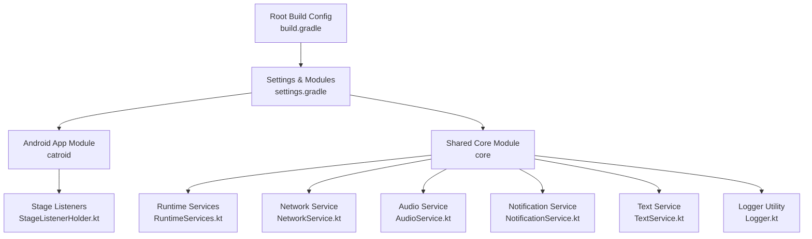
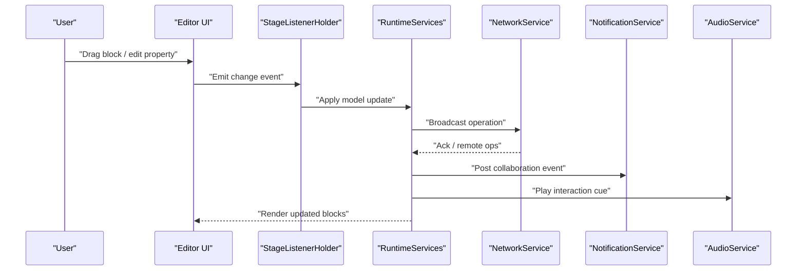
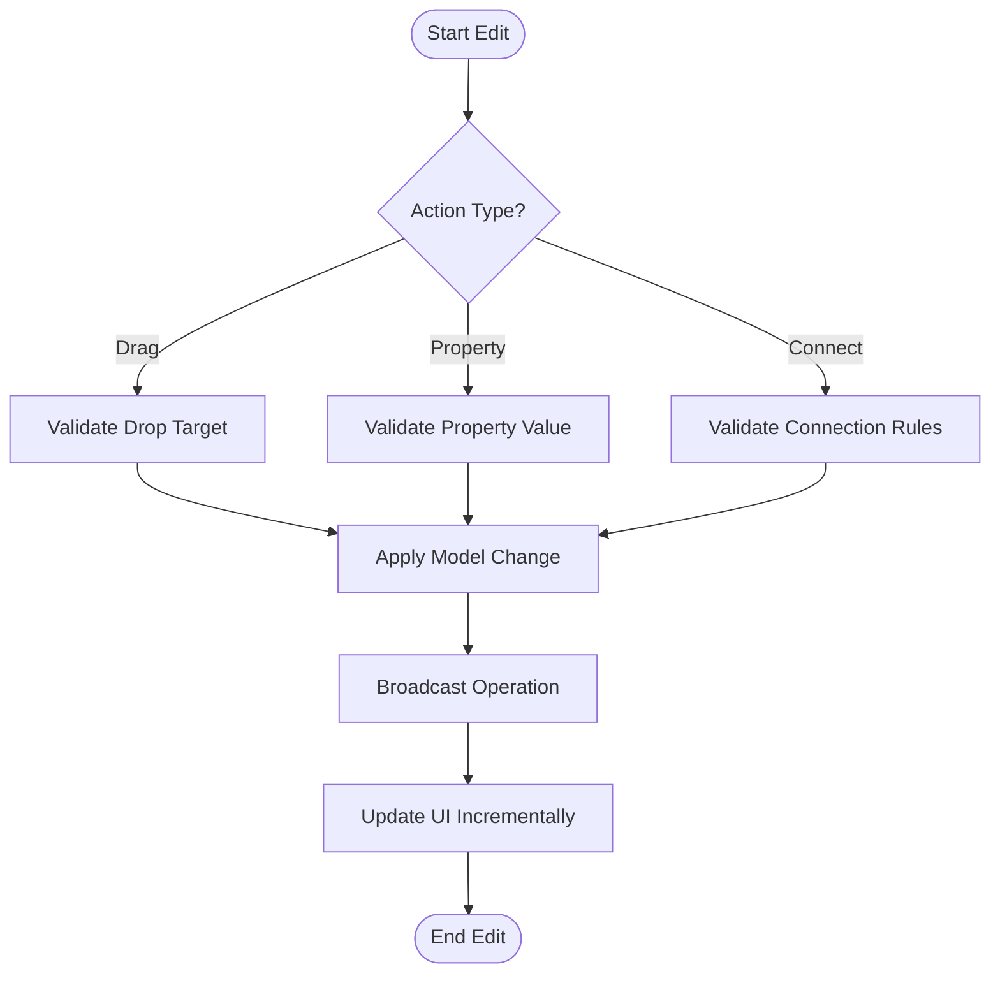
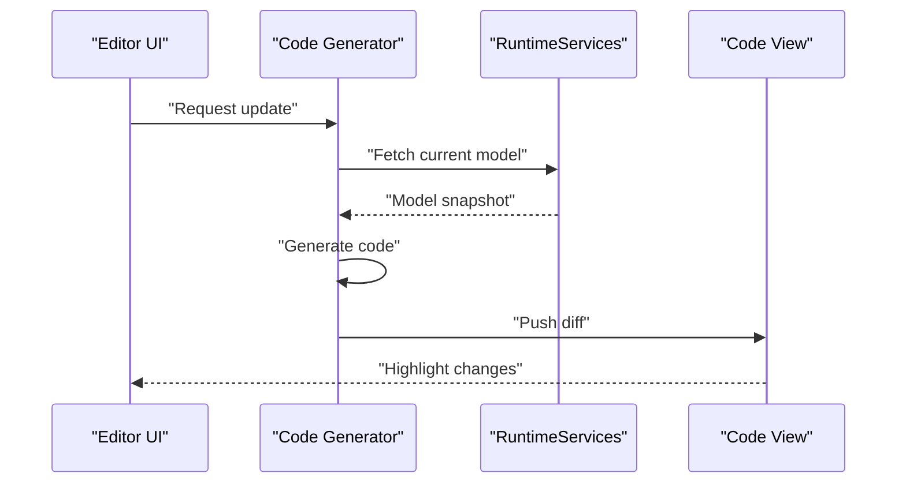
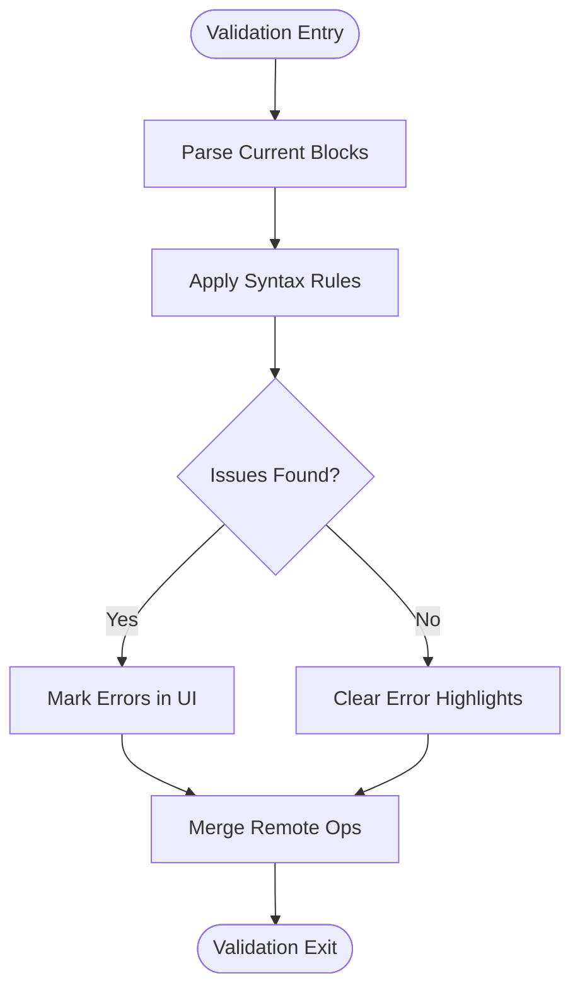
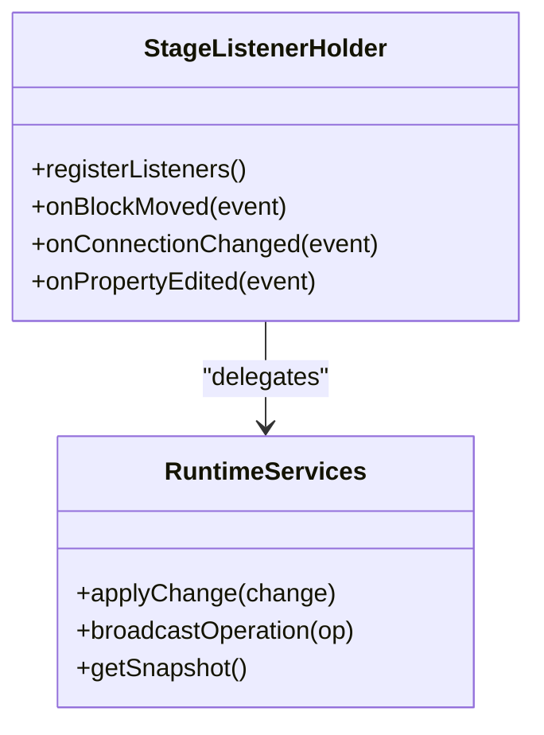
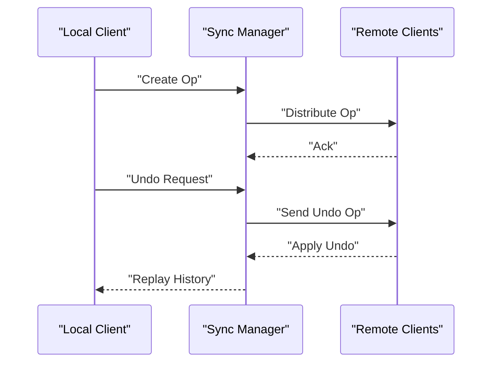
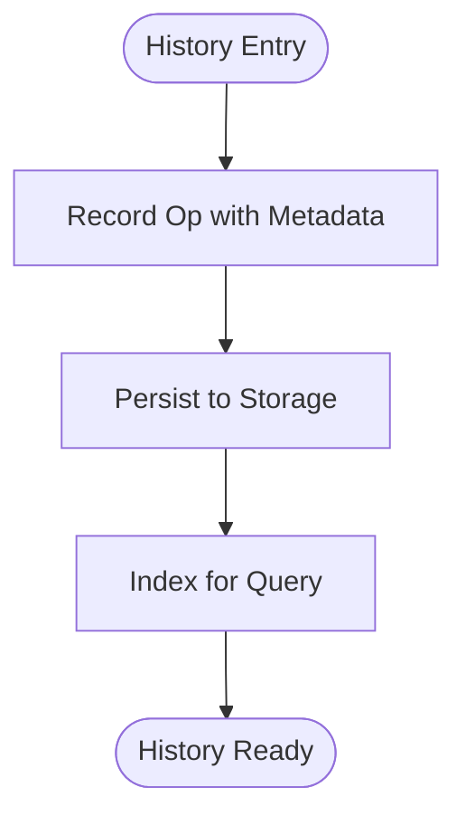
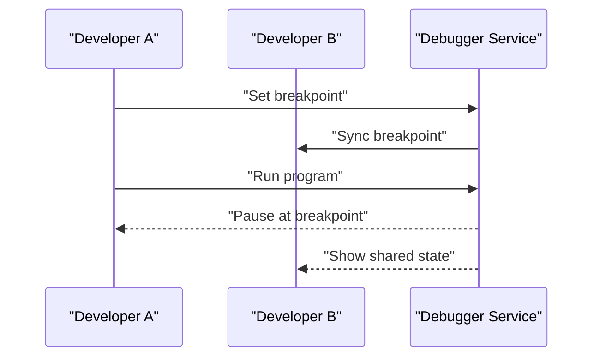
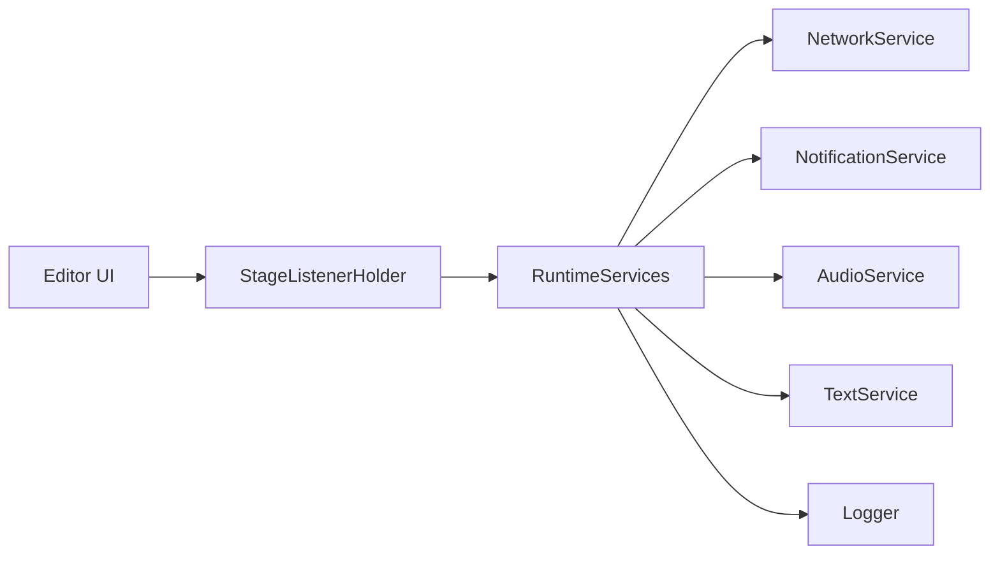

# Live Editing Features

<cite>
**Referenced Files in This Document**
- [README.md](file://README.md)
- [task.md](file://task.md)
- [AGENTS.md](file://AGENTS.md)
- [build.gradle](file://build.gradle)
- [settings.gradle](file://settings.gradle)
- [gradle.properties](file://gradle.properties)
- [catroid/src/main/java/org/catrobat/catroid/stage/StageListenerHolder.kt](file://catroid/src/main/java/org/catrobat/catroid/stage/StageListenerHolder.kt)
- [core/src/main/java/org/catrobat/catroid/audio/AudioService.kt](file://core/src/main/java/org/catrobat/catroid/audio/AudioService.kt)
- [core/src/main/java/org/catrobat/catroid/network/NetworkService.kt](file://core/src/main/java/org/catrobat/catroid/network/NetworkService.kt)
- [core/src/main/java/org/catrobat/catroid/notification/NotificationService.kt](file://core/src/main/java/org/catrobat/catroid/notification/NotificationService.kt)
- [core/src/main/java/org/catrobat/catroid/runtime/RuntimeServices.kt](file://core/src/main/java/org/catrobat/catroid/runtime/RuntimeServices.kt)
- [core/src/main/java/org/catrobat/catroid/text/TextService.kt](file://core/src/main/java/org/catrobat/catroid/text/TextService.kt)
- [core/src/main/java/org/catrobat/catroid/util/Logger.kt](file://core/src/main/java/org/catrobat/catroid/util/Logger.kt)
</cite>

## Table of Contents
1. [Introduction](#introduction)
2. [Project Structure](#project-structure)
3. [Core Components](#core-components)
4. [Architecture Overview](#architecture-overview)
5. [Detailed Component Analysis](#detailed-component-analysis)
6. [Dependency Analysis](#dependency-analysis)
7. [Performance Considerations](#performance-considerations)
8. [Troubleshooting Guide](#troubleshooting-guide)
9. [Conclusion](#conclusion)
10. [Appendices](#appendices)

## Introduction
This document explains NewCatroid’s live editing capabilities with a focus on collaborative block manipulation, real-time code generation updates, syntax validation during collaboration, immediate visual feedback, undo/redo synchronization, change history tracking, and collaborative debugging. It also covers user experience considerations for smooth real-time interactions and performance optimization strategies to keep the editor responsive under concurrent edits.

## Project Structure
NewCatroid is an Android-first project with shared core modules and platform-specific implementations. The root build configuration and settings define multi-module organization, while services in the core module provide runtime, networking, audio, text, and notification support used by the editor and stage subsystems.

**Diagram sources**
- [build.gradle](file://build.gradle)
- [settings.gradle](file://settings.gradle)
- [catroid/src/main/java/org/catrobat/catroid/stage/StageListenerHolder.kt](file://catroid/src/main/java/org/catrobat/catroid/stage/StageListenerHolder.kt)
- [core/src/main/java/org/catrobat/catroid/runtime/RuntimeServices.kt](file://core/src/main/java/org/catrobat/catroid/runtime/RuntimeServices.kt)
- [core/src/main/java/org/catrobat/catroid/network/NetworkService.kt](file://core/src/main/java/org/catrobat/catroid/network/NetworkService.kt)
- [core/src/main/java/org/catrobat/catroid/audio/AudioService.kt](file://core/src/main/java/org/catrobat/catroid/audio/AudioService.kt)
- [core/src/main/java/org/catrobat/catroid/notification/NotificationService.kt](file://core/src/main/java/org/catrobat/catroid/notification/NotificationService.kt)
- [core/src/main/java/org/catrobat/catroid/text/TextService.kt](file://core/src/main/java/org/catrobat/catroid/text/TextService.kt)
- [core/src/main/java/org/catrobat/catroid/util/Logger.kt](file://core/src/main/java/org/catrobat/catroid/util/Logger.kt)

**Section sources**
- [README.md](file://README.md)
- [build.gradle](file://build.gradle)
- [settings.gradle](file://settings.gradle)
- [gradle.properties](file://gradle.properties)

## Core Components
The following components are central to enabling live editing and collaboration:

- Stage Listener Holder: Coordinates stage-level events and listeners that can be used to observe and react to changes in the visual programming environment.
- Runtime Services: Provides runtime orchestration and accessors for services consumed by the editor and stage.
- Network Service: Manages network connectivity and communication channels required for real-time collaboration.
- Audio Service: Supplies audio feedback and cues for user interactions during editing.
- Notification Service: Delivers system notifications for collaboration events (e.g., remote edits, conflicts).
- Text Service: Handles text rendering and localization relevant to UI elements in the editor.
- Logger: Centralized logging utility for diagnostics and debugging across modules.

These components collectively enable event-driven updates, cross-device synchronization, and responsive UI behavior essential for live editing.

**Section sources**
- [catroid/src/main/java/org/catrobat/catroid/stage/StageListenerHolder.kt](file://catroid/src/main/java/org/catrobat/catroid/stage/StageListenerHolder.kt)
- [core/src/main/java/org/catrobat/catroid/runtime/RuntimeServices.kt](file://core/src/main/java/org/catrobat/catroid/runtime/RuntimeServices.kt)
- [core/src/main/java/org/catrobat/catroid/network/NetworkService.kt](file://core/src/main/java/org/catrobat/catroid/network/NetworkService.kt)
- [core/src/main/java/org/catrobat/catroid/audio/AudioService.kt](file://core/src/main/java/org/catrobat/catroid/audio/AudioService.kt)
- [core/src/main/java/org/catrobat/catroid/notification/NotificationService.kt](file://core/src/main/java/org/catrobat/catroid/notification/NotificationService.kt)
- [core/src/main/java/org/catrobat/catroid/text/TextService.kt](file://core/src/main/java/org/catrobat/catroid/text/TextService.kt)
- [core/src/main/java/org/catrobat/catroid/util/Logger.kt](file://core/src/main/java/org/catrobat/catroid/util/Logger.kt)

## Architecture Overview
The live editing architecture centers around an event-driven pipeline: user actions in the editor trigger state changes, which propagate through stage listeners and runtime services to update the UI and synchronize with collaborators via the network service. Notifications and audio feedback enhance UX, while logging supports troubleshooting.

**Diagram sources**
- [catroid/src/main/java/org/catrobat/catroid/stage/StageListenerHolder.kt](file://catroid/src/main/java/org/catrobat/catroid/stage/StageListenerHolder.kt)
- [core/src/main/java/org/catrobat/catroid/runtime/RuntimeServices.kt](file://core/src/main/java/org/catrobat/catroid/runtime/RuntimeServices.kt)
- [core/src/main/java/org/catrobat/catroid/network/NetworkService.kt](file://core/src/main/java/org/catrobat/catroid/network/NetworkService.kt)
- [core/src/main/java/org/catrobat/catroid/notification/NotificationService.kt](file://core/src/main/java/org/catrobat/catroid/notification/NotificationService.kt)
- [core/src/main/java/org/catrobat/catroid/audio/AudioService.kt](file://core/src/main/java/org/catrobat/catroid/audio/AudioService.kt)

## Detailed Component Analysis

### Collaborative Block Manipulation (Drag-and-Drop, Properties, Connections)
- Drag-and-drop operations originate in the editor UI and are translated into structured change events. These events are observed by stage listeners and applied to the underlying block model.
- Property editing triggers targeted updates to block attributes, ensuring minimal diff propagation to reduce bandwidth and improve responsiveness.
- Connection management validates compatibility before committing connections, preventing invalid states and providing immediate visual feedback.

[No sources needed since this diagram shows conceptual workflow, not actual code structure]

### Real-Time Code Generation Updates
- As blocks are manipulated, the code generator produces incremental updates. The runtime orchestrates regeneration and applies diffs to avoid full re-renders.
- Generated code is validated against the current block graph to ensure consistency before presentation.

[No sources needed since this diagram shows conceptual workflow, not actual code structure]

### Syntax Validation During Collaborative Editing
- Validation runs concurrently with edits, using lightweight checks to flag issues early.
- Conflicts between local and remote edits are detected and resolved using operational transformation or CRDT principles at the model layer.

[No sources needed since this diagram shows conceptual workflow, not actual code structure]

### Immediate Visual Feedback Systems
- Visual feedback includes highlighting valid drop targets, showing connection previews, and animating transitions when blocks move or connect.
- The stage listener coordinates these effects to maintain frame-rate stability.

**Diagram sources**
- [catroid/src/main/java/org/catrobat/catroid/stage/StageListenerHolder.kt](file://catroid/src/main/java/org/catrobat/catroid/stage/StageListenerHolder.kt)
- [core/src/main/java/org/catrobat/catroid/runtime/RuntimeServices.kt](file://core/src/main/java/org/catrobat/catroid/runtime/RuntimeServices.kt)

### Undo/Redo Synchronization
- Each meaningful edit is recorded as an operation with sufficient context to reconstruct state.
- Undo/redo stacks are synchronized across collaborators; remote undos are applied locally with conflict resolution.

[No sources needed since this diagram shows conceptual workflow, not actual code structure]

### Change History Tracking
- A persistent log captures all operations with timestamps and authorship metadata.
- History enables auditing, time-travel debugging, and rollback to previous states.

[No sources needed since this diagram shows conceptual workflow, not actual code structure]

### Collaborative Debugging Features
- Breakpoints and step-through execution are synchronized across participants.
- Shared logs and variable snapshots aid in diagnosing issues collaboratively.

[No sources needed since this diagram shows conceptual workflow, not actual code structure]

## Dependency Analysis
The editor relies on core services for runtime coordination, networking, notifications, audio, and text handling. The stage listener acts as a bridge between UI events and runtime services.

**Diagram sources**
- [catroid/src/main/java/org/catrobat/catroid/stage/StageListenerHolder.kt](file://catroid/src/main/java/org/catrobat/catroid/stage/StageListenerHolder.kt)
- [core/src/main/java/org/catrobat/catroid/runtime/RuntimeServices.kt](file://core/src/main/java/org/catrobat/catroid/runtime/RuntimeServices.kt)
- [core/src/main/java/org/catrobat/catroid/network/NetworkService.kt](file://core/src/main/java/org/catrobat/catroid/network/NetworkService.kt)
- [core/src/main/java/org/catrobat/catroid/notification/NotificationService.kt](file://core/src/main/java/org/catrobat/catroid/notification/NotificationService.kt)
- [core/src/main/java/org/catrobat/catroid/audio/AudioService.kt](file://core/src/main/java/org/catrobat/catroid/audio/AudioService.kt)
- [core/src/main/java/org/catrobat/catroid/text/TextService.kt](file://core/src/main/java/org/catrobat/catroid/text/TextService.kt)
- [core/src/main/java/org/catrobat/catroid/util/Logger.kt](file://core/src/main/java/org/catrobat/catroid/util/Logger.kt)

**Section sources**
- [core/src/main/java/org/catrobat/catroid/runtime/RuntimeServices.kt](file://core/src/main/java/org/catrobat/catroid/runtime/RuntimeServices.kt)
- [core/src/main/java/org/catrobat/catroid/network/NetworkService.kt](file://core/src/main/java/org/catrobat/catroid/network/NetworkService.kt)
- [core/src/main/java/org/catrobat/catroid/notification/NotificationService.kt](file://core/src/main/java/org/catrobat/catroid/notification/NotificationService.kt)
- [core/src/main/java/org/catrobat/catroid/audio/AudioService.kt](file://core/src/main/java/org/catrobat/catroid/audio/AudioService.kt)
- [core/src/main/java/org/catrobat/catroid/text/TextService.kt](file://core/src/main/java/org/catrobat/catroid/text/TextService.kt)
- [core/src/main/java/org/catrobat/catroid/util/Logger.kt](file://core/src/main/java/org/catrobat/catroid/util/Logger.kt)

## Performance Considerations
- Use incremental updates and diffs to minimize UI reflows and reduce network payload sizes.
- Debounce high-frequency events (e.g., drag moves) to batch updates and preserve frame rate.
- Prefer lightweight validation rules during typing/dragging; defer heavy checks to background threads.
- Cache frequently accessed data and reuse objects where possible to reduce GC pressure.
- Throttle remote broadcasts and coalesce operations to prevent network congestion.
- Profile critical paths using the logger to identify bottlenecks and optimize hot loops.

[No sources needed since this section provides general guidance]

## Troubleshooting Guide
- Enable detailed logging to capture operation sequences, validation results, and sync events.
- Inspect network activity to verify operation distribution and acknowledgment patterns.
- Review notifications for collaboration anomalies such as missed updates or conflicts.
- Use audio cues to confirm successful interactions and detect missing feedback.
- Correlate stage listener events with runtime service calls to pinpoint failure points.

**Section sources**
- [core/src/main/java/org/catrobat/catroid/util/Logger.kt](file://core/src/main/java/org/catrobat/catroid/util/Logger.kt)
- [core/src/main/java/org/catrobat/catroid/network/NetworkService.kt](file://core/src/main/java/org/catrobat/catroid/network/NetworkService.kt)
- [core/src/main/java/org/catrobat/catroid/notification/NotificationService.kt](file://core/src/main/java/org/catrobat/catroid/notification/NotificationService.kt)
- [core/src/main/java/org/catrobat/catroid/audio/AudioService.kt](file://core/src/main/java/org/catrobat/catroid/audio/AudioService.kt)
- [catroid/src/main/java/org/catrobat/catroid/stage/StageListenerHolder.kt](file://catroid/src/main/java/org/catrobat/catroid/stage/StageListenerHolder.kt)

## Conclusion
NewCatroid’s live editing features rely on a robust event-driven architecture centered around stage listeners and runtime services. Collaboration is achieved through networked operation distribution, while immediate visual feedback and validation ensure a smooth user experience. Undo/redo synchronization, change history tracking, and collaborative debugging further enhance productivity. Performance optimizations such as incremental updates, debouncing, and throttling keep the editor responsive under concurrent edits.

[No sources needed since this section summarizes without analyzing specific files]

## Appendices
- Additional project context and goals can be found in the repository’s documentation files.

**Section sources**
- [README.md](file://README.md)
- [task.md](file://task.md)
- [AGENTS.md](file://AGENTS.md)