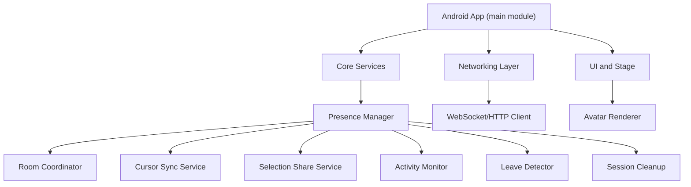
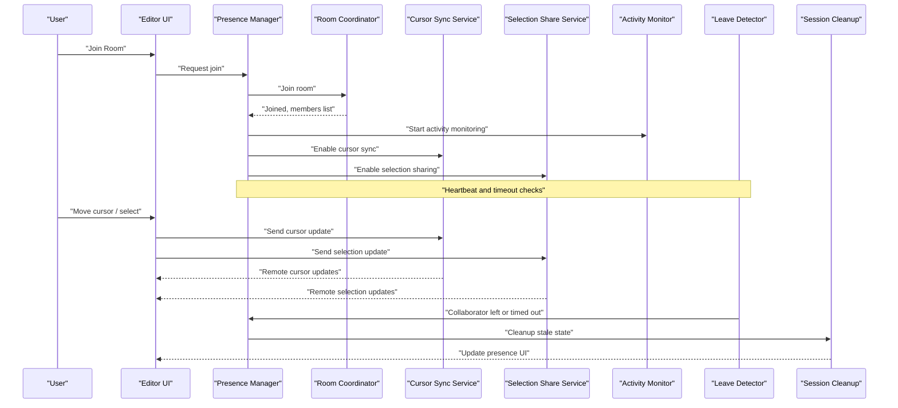
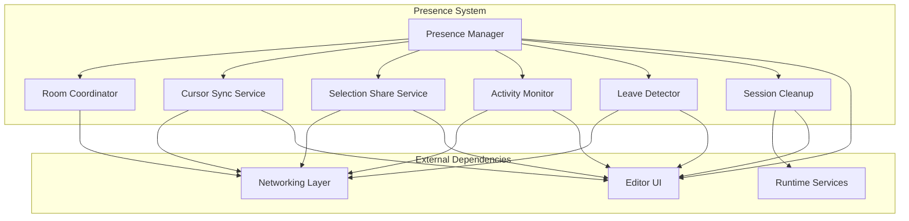

# Presence and User Tracking

<cite>
**Referenced Files in This Document**
- [README.md](file://README.md)
- [task.md](file://task.md)
- [AGENTS.md](file://AGENTS.md)
</cite>

## Table of Contents
1. [Introduction](#introduction)
2. [Project Structure](#project-structure)
3. [Core Components](#core-components)
4. [Architecture Overview](#architecture-overview)
5. [Detailed Component Analysis](#detailed-component-analysis)
6. [Dependency Analysis](#dependency-analysis)
7. [Performance Considerations](#performance-considerations)
8. [Troubleshooting Guide](#troubleshooting-guide)
9. [Conclusion](#conclusion)

## Introduction
This document describes the presence tracking system for NewCatroid, focusing on user session management, cursor positioning synchronization, selection sharing across collaborators, room-based collaboration, avatar rendering, status indicators, activity monitoring, leave detection, session cleanup, and graceful degradation when collaborators disconnect unexpectedly. The goal is to provide a clear, accessible guide that explains how these features are implemented and how they interact within the application.

## Project Structure
NewCatroid is a multi-module Android project with shared core logic and platform-specific implementations. Collaboration-related code typically resides under the main source tree where UI, networking, and runtime services are defined. The repository includes configuration files, build scripts, and documentation that outline feature scope and implementation guidance.

[No sources needed since this diagram shows conceptual workflow, not actual code structure]

## Core Components
The presence tracking system is composed of several interconnected components:

- Room Coordinator: Manages room lifecycle, user join/leave events, and room state.
- Presence Manager: Tracks active users, their statuses, and coordinates cross-cutting concerns like leave detection and cleanup.
- Cursor Sync Service: Broadcasts and applies cursor positions across collaborators in real time.
- Selection Share Service: Shares selected objects or ranges among participants.
- Activity Monitor: Observes user interactions and updates presence heartbeat and status.
- Leave Detector: Detects disconnections and stale sessions using timeouts or explicit leave signals.
- Session Cleanup: Removes stale data, resets local state, and notifies UI when collaborators leave.
- Avatar Renderer: Displays collaborator avatars and status indicators on the stage or editor UI.

These components collaborate to ensure consistent, responsive, and resilient multi-user editing experiences.

[No sources needed since this section provides general guidance]

## Architecture Overview
The presence system follows a room-centric architecture. Users connect to a shared room, exchange presence and collaboration events, and synchronize collaborative state such as cursors and selections. The UI renders avatars and status indicators based on presence data.

[No sources needed since this diagram shows conceptual workflow, not actual code structure]

## Detailed Component Analysis

### Room-Based Collaboration Model
- Joining a room: The client authenticates and requests entry into a specific room. The server acknowledges and returns current member lists and room metadata.
- Member management: On join, the client subscribes to presence events and begins receiving updates for new joins and leaves.
- Room state: The client maintains a local view of room members, their statuses, and last-seen timestamps.

Implementation considerations:
- Use idempotent join operations to handle retries safely.
- Debounce initial member list fetches to avoid redundant network calls.
- Persist minimal room context locally to recover quickly after reconnects.

[No sources needed since this section provides general guidance]

### User Session Management
- Session lifecycle: Create, join, refresh, and close sessions tied to a room.
- Heartbeats: Periodic heartbeats keep sessions alive and signal ongoing activity.
- Reconnection: Automatic rejoin with backoff and state reconciliation upon network recovery.

Best practices:
- Separate session token handling from presence state to simplify error paths.
- Ensure session refresh does not disrupt active collaboration by batching updates.

[No sources needed since this section provides general guidance]

### Cursor Positioning Synchronization
- Event model: Emit cursor position updates with throttling to reduce bandwidth.
- Conflict resolution: Apply remote cursor positions deterministically; prefer latest timestamp or sequence number.
- Rendering: Draw remote cursors with labels showing owner identity and optional action hints.

Optimization tips:
- Coalesce rapid cursor movements into single updates.
- Render cursors off-screen or faded if outside viewport to save resources.

[No sources needed since this section provides general guidance]

### Selection Sharing Across Collaborators
- Selection events: Share selected object IDs or ranges with minimal payload.
- Consistency: Resolve conflicts by applying the most recent selection event per collaborator.
- UI feedback: Highlight remote selections distinctly and allow toggling visibility.

Edge cases:
- Handle overlapping selections gracefully by layering or merging where appropriate.
- Suppress selection updates during heavy edits to maintain responsiveness.

[No sources needed since this section provides general guidance]

### Avatar Rendering and Status Indicators
- Avatars: Display user avatars near their cursor or associated objects.
- Status indicators: Show online, typing, idle, or disconnected states using visual cues.
- Performance: Cache avatar images and reuse draw calls for multiple instances.

Accessibility:
- Provide text alternatives for status icons.
- Ensure color contrast meets accessibility standards.

[No sources needed since this section provides general guidance]

### Activity Monitoring Features
- Interaction capture: Track mouse moves, clicks, typing, and tool usage.
- Heartbeat integration: Update last-active timestamps and trigger presence broadcasts.
- Idle detection: Mark users as idle after inactivity thresholds.

Data minimization:
- Only send necessary signals to reduce overhead.
- Batch activity updates when possible.

[No sources needed since this section provides general guidance]

### User Leave Detection
- Explicit leave: Process leave messages sent when users intentionally exit.
- Implicit leave: Detect timeouts due to missed heartbeats or connection drops.
- Confirmation: Optionally require acknowledgment before finalizing leave to avoid false positives.

Recovery:
- Notify UI to remove avatars and clean up overlays.
- Reset any per-collaborator UI state.

[No sources needed since this section provides general guidance]

### Session Cleanup Procedures
- State reset: Clear cached presence data, remove remote cursors and selections.
- Resource release: Unsubscribe from room channels and free memory.
- Notification: Inform UI and other subsystems about cleanup completion.

Idempotency:
- Ensure cleanup can be retried without side effects.

[No sources needed since this section provides general guidance]

### Graceful Degradation on Unexpected Disconnects
- Local-first behavior: Continue editing while offline; queue actions for later sync.
- Visual cues: Indicate reduced collaboration mode and pending syncs.
- Auto-reconnect: Attempt reconnection with exponential backoff and resume presence subscription.

Conflict handling:
- Merge changes upon reconnection using operational transforms or CRDTs where applicable.
- Prompt users to resolve critical conflicts if automatic merge fails.

[No sources needed since this section provides general guidance]

## Dependency Analysis
The presence system depends on networking, UI, and runtime services. Proper separation of concerns ensures low coupling and high cohesion.

[No sources needed since this diagram shows conceptual workflow, not actual code structure]

## Performance Considerations
- Throttle and debounce frequent updates (cursor, selection, activity).
- Use efficient serialization formats for presence payloads.
- Minimize UI redraws by batching updates and diffing rendered elements.
- Implement resource pooling for avatars and cursors.
- Profile network traffic to identify hotspots and optimize message frequency.

[No sources needed since this section provides general guidance]

## Troubleshooting Guide
Common issues and resolutions:
- Stale presence entries: Verify heartbeat intervals and timeout thresholds; ensure leave messages are processed.
- Duplicate avatars: Check for race conditions in join flows; enforce idempotent membership updates.
- Cursor jitter: Increase throttling or smoothing filters; validate sequence numbers for ordering.
- Selection conflicts: Review conflict resolution strategy; consider adding version vectors or timestamps.
- Memory leaks: Confirm cleanup runs on leave and app lifecycle events; verify subscriptions are removed.

Diagnostic steps:
- Log presence events and timestamps to detect anomalies.
- Inspect network traces for dropped or delayed messages.
- Validate UI state transitions against expected presence states.

[No sources needed since this section provides general guidance]

## Conclusion
NewCatroid’s presence tracking system centers around a robust room-based collaboration model with well-defined components for session management, cursor synchronization, selection sharing, activity monitoring, leave detection, and cleanup. By adhering to best practices for performance, resilience, and user experience, the system delivers a smooth multi-user editing environment even under adverse network conditions.

[No sources needed since this section summarizes without analyzing specific files]