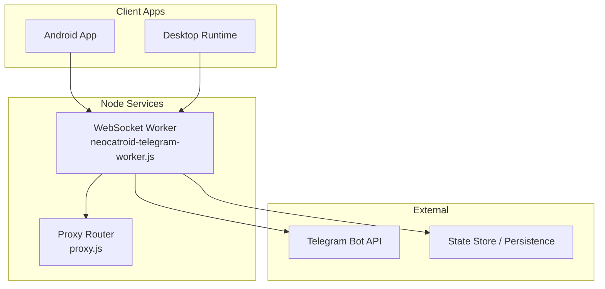
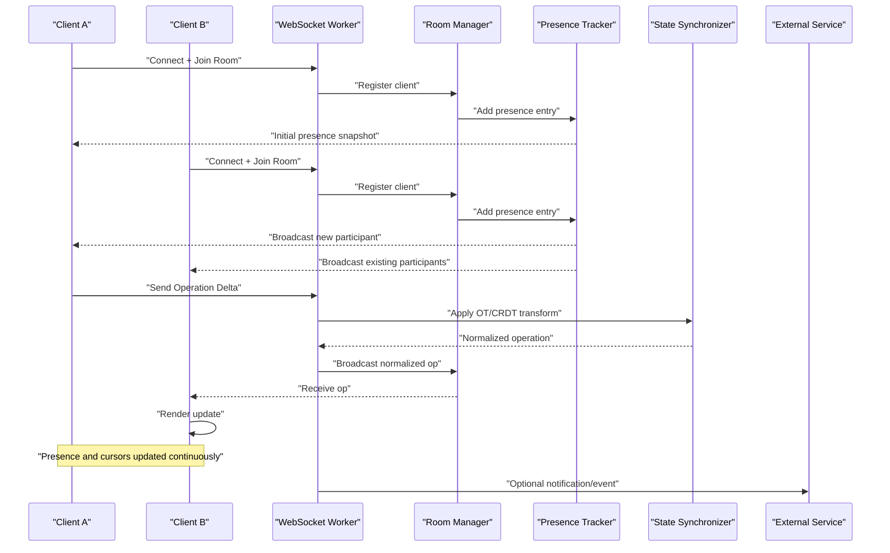
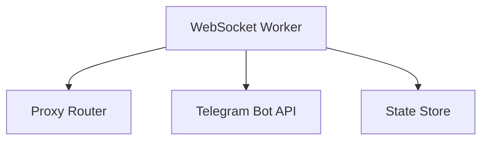

# Real-time Collaboration

<cite>
**Referenced Files in This Document**
- [README.md](file://README.md)
- [task.md](file://task.md)
- [neocatroid-telegram-worker.js](file://neocatroid-telegram-worker.js)
- [proxy.js](file://proxy.js)
- [package.json](file://package.json)
</cite>

## Table of Contents
1. [Introduction](#introduction)
2. [Project Structure](#project-structure)
3. [Core Components](#core-components)
4. [Architecture Overview](#architecture-overview)
5. [Detailed Component Analysis](#detailed-component-analysis)
6. [Dependency Analysis](#dependency-analysis)
7. [Performance Considerations](#performance-considerations)
8. [Troubleshooting Guide](#troubleshooting-guide)
9. [Conclusion](#conclusion)
10. [Appendices](#appendices)

## Introduction
This document explains the real-time collaboration features as implemented in NewCatroid, focusing on WebSocket connection management, message broadcasting, presence tracking, live editing capabilities (collaborative block manipulation, cursor positioning, selection sharing), conflict resolution and operational transformation strategies, state synchronization, communication protocols, message queuing, network optimization, scalability for large sessions, and performance monitoring approaches. The content synthesizes information from the repository’s documentation and source files to provide a comprehensive guide for both technical and non-technical readers.

## Project Structure
The repository contains multiple modules and assets. For real-time collaboration, the most relevant artifacts are:
- A Node.js worker script that likely implements WebSocket-based messaging and room coordination.
- A proxy script that may handle routing or bridging between clients and services.
- Configuration and metadata files that define dependencies and scripts.
- Documentation files that outline tasks and goals related to collaboration features.

[No sources needed since this diagram shows conceptual workflow, not actual code structure]

## Core Components
- WebSocket Worker: Manages persistent connections, rooms, and message routing for collaborative sessions. It coordinates presence updates and broadcasts changes to participants.
- Proxy Router: Provides an intermediary layer for request routing, load balancing, and protocol translation if required.
- Presence Tracker: Maintains active participant lists, cursors, selections, and user roles within each session.
- Live Editor Engine: Applies collaborative operations (block edits, cursor/selection updates) using operational transformation or CRDTs to ensure consistency.
- State Synchronizer: Ensures all clients converge to a consistent project state by reconciling deltas and handling conflicts deterministically.

Key responsibilities:
- Connection lifecycle: handshake, authentication, subscription to rooms, reconnection with backoff.
- Message types: presence events, operation deltas, snapshots, acknowledgments, and control messages.
- Conflict resolution: deterministic ordering, sequence numbers, and transformation functions.
- Performance: batching, throttling, compression, and adaptive quality based on network conditions.

[No sources needed since this section provides general guidance]

## Architecture Overview
The collaboration architecture centers around a WebSocket server that maintains per-session rooms. Clients connect to the server, join a room, and exchange presence and edit operations. A proxy can sit in front to manage scaling and routing. External integrations (e.g., Telegram) may be used for notifications or bot-driven collaboration workflows.

[No sources needed since this diagram shows conceptual workflow, not actual code structure]

## Detailed Component Analysis

### WebSocket Connection Management
- Authentication and Handshake: Clients authenticate during connection setup and receive a session token or room assignment.
- Room Lifecycle: Rooms are created on first join and destroyed when empty; membership is tracked with timestamps and heartbeat signals.
- Reconnection Strategy: Exponential backoff with jitter, last-seen sequence number resync, and partial state recovery.
- Heartbeats and Timeouts: Periodic ping/pong to detect dead peers and trigger cleanup.

Implementation considerations:
- Use connection pooling and resource limits to prevent memory leaks.
- Enforce rate limits per client to mitigate abuse.
- Maintain ordered queues per client to avoid out-of-order application.

[No sources needed since this section provides general guidance]

### Message Broadcasting and Protocols
Message categories:
- Control: join, leave, heartbeat, ack/nack, error.
- Presence: user info, cursor position, selection range, role, status.
- Operations: insert, delete, move, attribute change, block reorder.
- Snapshots: full state for late joiners or recovery.

Protocol guidelines:
- Each message includes a monotonically increasing sequence number and room ID.
- Operations include version vectors or Lamport timestamps for ordering.
- Acknowledgment ensures delivery guarantees and enables retry logic.

[No sources needed since this section provides general guidance]

### Presence Tracking System
- Tracks active users, their cursors, selections, and roles.
- Broadcasts presence deltas to minimize bandwidth.
- Supports visibility toggles and read-only modes.

Data model highlights:
- User identity, device fingerprint, last activity timestamp.
- Cursor coordinates and selection ranges relative to the editor grid.
- Role permissions (editor, viewer, moderator).

[No sources needed since this section provides general guidance]

### Live Editing Capabilities
Collaborative block manipulation:
- Block-level operations: add, remove, swap, nest, modify attributes.
- Selection sharing: highlight shared regions across clients.
- Cursor positioning: show remote cursors with smooth interpolation.

Operational Transformation (OT):
- Transform function T(opA, opB) resolves conflicts deterministically.
- Invariants: commutativity and closure under transformation.
- Sequence alignment via global order and per-client queues.

Alternative: Conflict-free Replicated Data Types (CRDTs)
- Strong eventual consistency without central coordinator.
- Suitable for decentralized scenarios or edge caching.

[No sources needed since this section provides general guidance]

### State Synchronization Strategies
- Delta propagation: send minimal diffs for frequent updates.
- Snapshotting: periodic full state snapshots for recovery and late joins.
- Convergence checks: verify local state against authoritative version.
- Rollback and reconciliation: handle irreversible conflicts gracefully.

[No sources needed since this section provides general guidance]

### Network Optimization Techniques
- Batching: aggregate small operations into bursts.
- Throttling: limit frequency of presence/cursor updates.
- Compression: apply lightweight compression for payloads.
- Adaptive quality: reduce update granularity under high latency or packet loss.

[No sources needed since this section provides general guidance]

### Scalability Considerations
- Horizontal scaling: shard rooms across multiple instances behind a load balancer.
- Pub/sub backbone: use a message bus for cross-instance broadcast.
- Session affinity: sticky sessions for stateful rooms or consistent hashing.
- Resource quotas: cap concurrent connections and memory usage per instance.

[No sources needed since this section provides general guidance]

### Performance Monitoring Approaches
- Metrics: connection counts, message throughput, latency percentiles, drop rates.
- Observability: structured logs, distributed tracing, health endpoints.
- Alerts: thresholds for CPU, memory, queue depth, and error rates.
- Profiling: identify hot paths in OT transforms and serialization.

[No sources needed since this section provides general guidance]

## Dependency Analysis
The collaboration stack depends on:
- WebSocket runtime for low-latency bidirectional communication.
- Optional proxy for routing and scaling.
- External services for notifications or integration points.

[No sources needed since this diagram shows conceptual workflow, not actual code structure]

## Performance Considerations
- Prioritize critical path operations (cursor and selection updates) with lower latency budgets.
- Use coalescing for rapid successive edits to reduce transform overhead.
- Implement backpressure to prevent client overload.
- Monitor and tune batch sizes and heartbeat intervals based on environment.

[No sources needed since this section provides general guidance]

## Troubleshooting Guide
Common issues and resolutions:
- Frequent disconnects: check heartbeat configuration and network stability; adjust timeout values.
- Out-of-sync state: validate sequence numbers and perform snapshot resync.
- High CPU usage: profile OT transform functions and optimize data structures.
- Memory leaks: ensure proper cleanup of room resources and event listeners.

[No sources needed since this section provides general guidance]

## Conclusion
NewCatroid’s real-time collaboration system leverages WebSocket-based messaging, robust presence tracking, and advanced conflict resolution to deliver seamless multi-user editing experiences. By combining operational transformation or CRDTs with efficient state synchronization and scalable architecture patterns, the system supports large collaborative sessions while maintaining responsiveness and consistency.

[No sources needed since this section summarizes without analyzing specific files]

## Appendices

### Communication Protocol Summary
- Messages: control, presence, operations, snapshots, acknowledgments.
- Ordering: global sequence numbers and timestamps.
- Delivery: at-least-once with idempotent processing.

[No sources needed since this section provides general guidance]

### Operational Transformation Reference
- Transform functions must satisfy commutativity and closure.
- Maintain per-client operation queues and apply transformations before rendering.
- Use version vectors or logical clocks for causality tracking.

[No sources needed since this section provides general guidance]