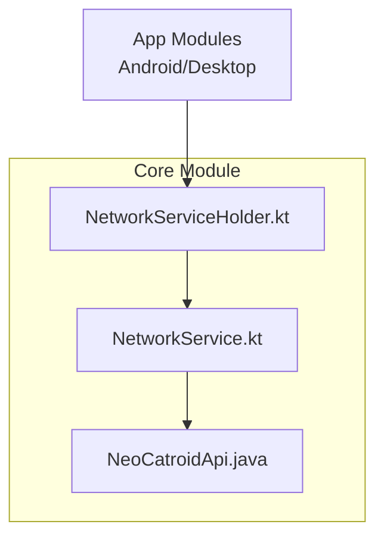
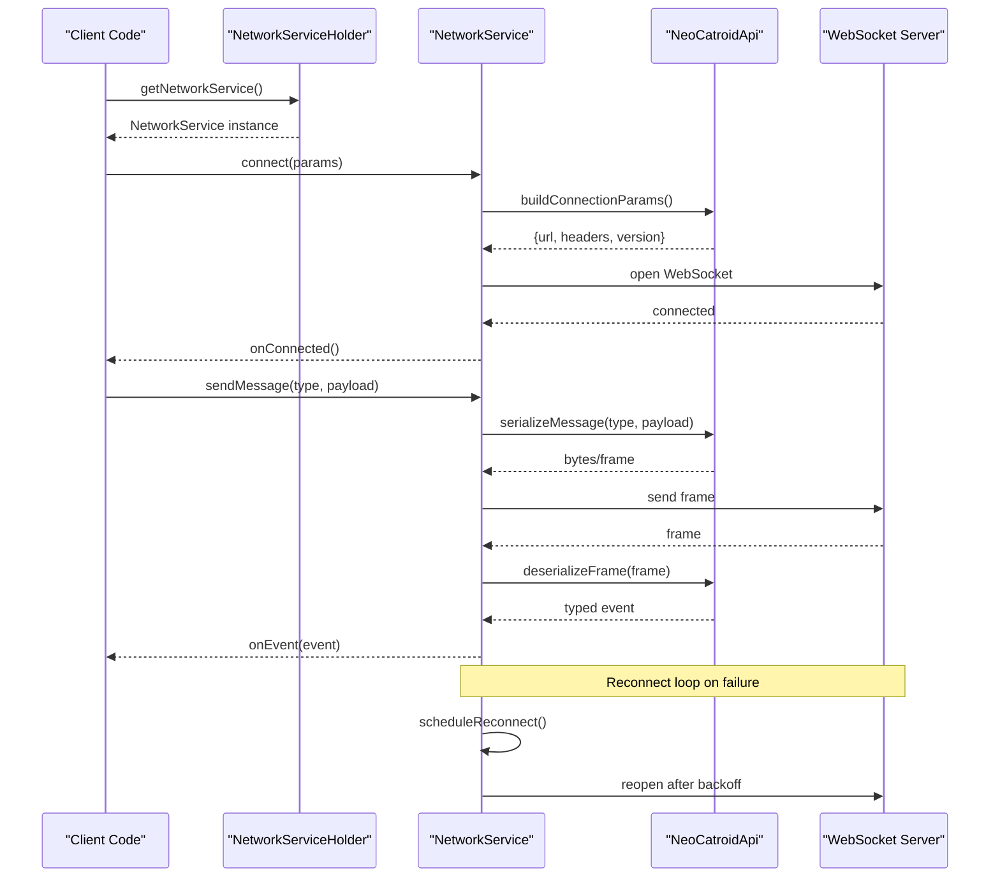
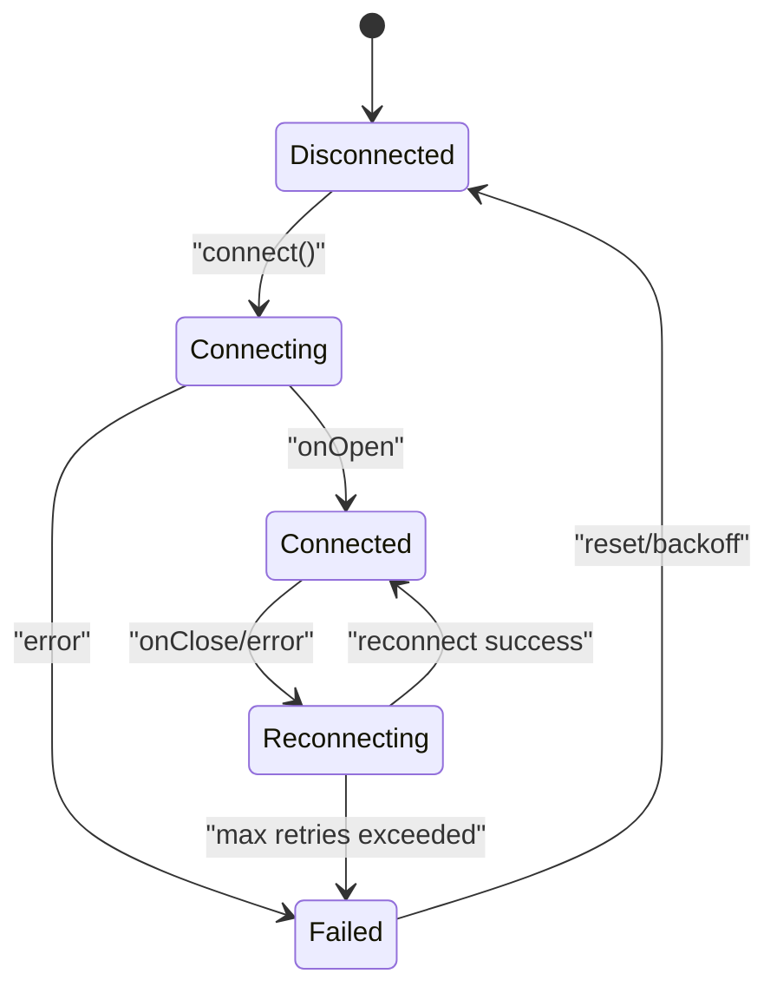
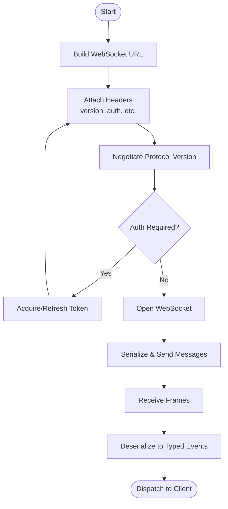
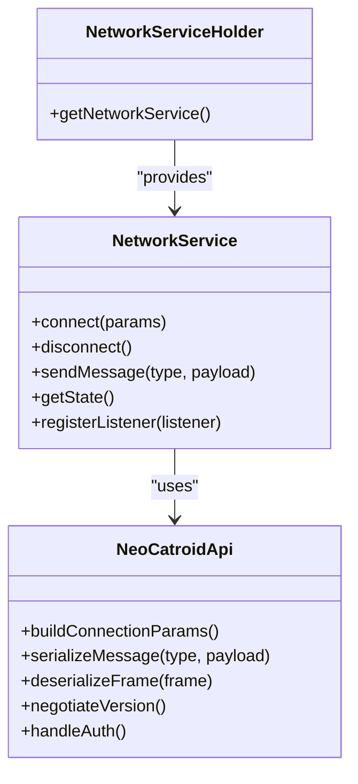

# WebSocket Communication Layer

<cite>
**Referenced Files in This Document**
- [NetworkService.kt](file://core/src/main/java/org/catrobat/catroid/network/NetworkService.kt)
- [NetworkServiceHolder.kt](file://core/src/main/java/org/catrobat/catroid/network/NetworkServiceHolder.kt)
- [NeoCatroidApi.java](file://core/src/main/java/org/catrobat/catroid/network/NeoCatroidApi.java)
</cite>

## Table of Contents
1. [Introduction](#introduction)
2. [Project Structure](#project-structure)
3. [Core Components](#core-components)
4. [Architecture Overview](#architecture-overview)
5. [Detailed Component Analysis](#detailed-component-analysis)
6. [Dependency Analysis](#dependency-analysis)
7. [Performance Considerations](#performance-considerations)
8. [Troubleshooting Guide](#troubleshooting-guide)
9. [Conclusion](#conclusion)

## Introduction
This document explains NewCatroid’s WebSocket communication layer, focusing on connection lifecycle management (establishment, reconnection, and state monitoring), message serialization formats, protocol versioning, error handling, platform-independent abstraction across Android and desktop, authentication flows, security considerations, and performance optimization techniques for real-time messaging.

## Project Structure
The WebSocket-related code is organized under the core module with a clear separation between:
- A Kotlin-based network service abstraction that exposes a unified API to clients
- A Java-based API facade that encapsulates HTTP/WebSocket interactions
- A holder utility that provides access to the network service instance

**Diagram sources**
- [NetworkService.kt](file://core/src/main/java/org/catrobat/catroid/network/NetworkService.kt)
- [NetworkServiceHolder.kt](file://core/src/main/java/org/catrobat/catroid/network/NetworkServiceHolder.kt)
- [NeoCatroidApi.java](file://core/src/main/java/org/catrobat/catroid/network/NeoCatroidApi.java)

**Section sources**
- [NetworkService.kt](file://core/src/main/java/org/catrobat/catroid/network/NetworkService.kt)
- [NetworkServiceHolder.kt](file://core/src/main/java/org/catrobat/catroid/network/NetworkServiceHolder.kt)
- [NeoCatroidApi.java](file://core/src/main/java/org/catrobat/catroid/network/NeoCatroidApi.java)

## Core Components
- NetworkService: The primary Kotlin interface/class that abstracts WebSocket operations and exposes methods for connecting, sending/receiving messages, and managing connection state. It centralizes reconnection logic and event dispatching.
- NeoCatroidApi: The Java API facade that encapsulates lower-level networking details, including URL construction, headers, and payload formatting. It may also coordinate with HTTP endpoints used during handshake or token refresh.
- NetworkServiceHolder: A lightweight holder providing global access to the active NetworkService instance, enabling platform-independent usage from both Android and desktop modules.

Key responsibilities:
- Connection lifecycle: connect, disconnect, reconnect, close
- Message I/O: send typed messages, receive events
- State monitoring: expose current connection status and listeners/callbacks
- Serialization/deserialization: encode/decode messages according to the protocol spec
- Error handling: translate transport errors into domain-specific exceptions/events
- Platform abstraction: hide Android vs Desktop differences behind a single API surface

**Section sources**
- [NetworkService.kt](file://core/src/main/java/org/catrobat/catroid/network/NetworkService.kt)
- [NeoCatroidApi.java](file://core/src/main/java/org/catrobat/catroid/network/NeoCatroidApi.java)
- [NetworkServiceHolder.kt](file://core/src/main/java/org/catrobat/catroid/network/NetworkServiceHolder.kt)

## Architecture Overview
The architecture follows a layered approach:
- Client layer calls into NetworkService
- NetworkService orchestrates connection lifecycle and delegates to NeoCatroidApi for transport
- NeoCatroidApi handles protocol specifics (headers, payloads, version negotiation)
- Underlying transports are abstracted so Android and Desktop share the same contract

**Diagram sources**
- [NetworkService.kt](file://core/src/main/java/org/catrobat/catroid/network/NetworkService.kt)
- [NeoCatroidApi.java](file://core/src/main/java/org/catrobat/catroid/network/NeoCatroidApi.java)
- [NetworkServiceHolder.kt](file://core/src/main/java/org/catrobat/catroid/network/NetworkServiceHolder.kt)

## Detailed Component Analysis

### NetworkService: Lifecycle, Reconnection, and State Monitoring
Responsibilities:
- Establish connections using parameters provided by NeoCatroidApi
- Manage automatic reconnection with exponential backoff and jitter
- Monitor connection state and emit lifecycle events
- Serialize outgoing messages and deserialize incoming frames
- Provide observers/listeners for UI and business logic updates

Reconnection strategy highlights:
- Initial delay and maximum retry limits
- Exponential backoff with jitter to avoid thundering herd
- Circuit breaker behavior when persistent failures occur
- Graceful degradation with user-visible states

State monitoring:
- Enumerated states such as disconnected, connecting, connected, reconnecting, failed
- Event callbacks for state transitions and errors
- Optional heartbeat/ping-pong to detect stale connections

**Diagram sources**
- [NetworkService.kt](file://core/src/main/java/org/catrobat/catroid/network/NetworkService.kt)

**Section sources**
- [NetworkService.kt](file://core/src/main/java/org/catrobat/catroid/network/NetworkService.kt)

### NeoCatroidApi: Protocol Versioning, Serialization, and Authentication
Responsibilities:
- Construct WebSocket URLs and HTTP upgrade requests
- Attach protocol version headers and negotiate capabilities
- Serialize outgoing messages to JSON or binary frames
- Deserialize incoming frames into strongly-typed events
- Handle authentication tokens and refresh flows
- Normalize errors and map them to application-level codes

Protocol versioning:
- Version negotiation via header or initial handshake message
- Backward compatibility checks and graceful fallbacks
- Deprecation policy for older versions

Serialization format:
- Envelope structure with fields like type, version, id, timestamp, payload
- Payload encoding rules per message type
- Compression flags where applicable

Authentication flow:
- Token acquisition before connect or via challenge-response
- Automatic refresh on 401-like conditions
- Secure storage and transmission of credentials

**Diagram sources**
- [NeoCatroidApi.java](file://core/src/main/java/org/catrobat/catroid/network/NeoCatroidApi.java)

**Section sources**
- [NeoCatroidApi.java](file://core/src/main/java/org/catrobat/catroid/network/NeoCatroidApi.java)

### NetworkServiceHolder: Platform-Independent Access
Responsibilities:
- Provide a singleton-like accessor to the active NetworkService
- Abstract platform differences in initialization and lifecycle
- Ensure consistent configuration across Android and Desktop builds

Usage pattern:
- Obtain service instance once at app startup
- Share across components without tight coupling

**Section sources**
- [NetworkServiceHolder.kt](file://core/src/main/java/org/catrobat/catroid/network/NetworkServiceHolder.kt)

## Dependency Analysis
High-level dependencies:
- NetworkService depends on NeoCatroidApi for transport and protocol details
- NetworkServiceHolder depends on concrete implementations of NetworkService
- Client modules depend only on the public interfaces exposed by these classes

**Diagram sources**
- [NetworkService.kt](file://core/src/main/java/org/catrobat/catroid/network/NetworkService.kt)
- [NeoCatroidApi.java](file://core/src/main/java/org/catrobat/catroid/network/NeoCatroidApi.java)
- [NetworkServiceHolder.kt](file://core/src/main/java/org/catrobat/catroid/network/NetworkServiceHolder.kt)

**Section sources**
- [NetworkService.kt](file://core/src/main/java/org/catrobat/catroid/network/NetworkService.kt)
- [NeoCatroidApi.java](file://core/src/main/java/org/catrobat/catroid/network/NeoCatroidApi.java)
- [NetworkServiceHolder.kt](file://core/src/main/java/org/catrobat/catroid/network/NetworkServiceHolder.kt)

## Performance Considerations
- Batch small messages when possible to reduce overhead
- Use efficient serialization formats; prefer compact JSON or binary where supported
- Implement heartbeat/ping-pong to detect dead connections early
- Tune reconnection backoff to balance responsiveness and server load
- Avoid heavy work on the IO thread; offload parsing and processing to background threads
- Compress large payloads if bandwidth is constrained
- Cache frequently used configuration and reuse connections when safe

[No sources needed since this section provides general guidance]

## Troubleshooting Guide
Common issues and remedies:
- Frequent disconnects: verify server reachability, check firewall/proxy settings, review backoff configuration
- Authentication failures: ensure token validity, implement refresh on expiry, validate header injection
- High latency: measure round-trip times, inspect serialization cost, consider batching/compression
- Memory pressure: monitor frame sizes, avoid retaining large payloads, release resources promptly
- Dead connections: enable ping-pong, set timeouts, handle socket errors gracefully

Operational tips:
- Log connection lifecycle events and errors with contextual metadata
- Surface user-friendly states and recovery actions in the UI
- Provide diagnostics endpoints or logs for production support

**Section sources**
- [NetworkService.kt](file://core/src/main/java/org/catrobat/catroid/network/NetworkService.kt)
- [NeoCatroidApi.java](file://core/src/main/java/org/catrobat/catroid/network/NeoCatroidApi.java)

## Conclusion
NewCatroid’s WebSocket layer centers around a clean abstraction (NetworkService) backed by a robust API facade (NeoCatroidApi) and a simple holder (NetworkServiceHolder). This design enables platform-independent real-time messaging with strong lifecycle management, clear protocol versioning, secure authentication, and resilient reconnection strategies. Following the performance and troubleshooting recommendations will help maintain reliable, low-latency communication across Android and Desktop environments.