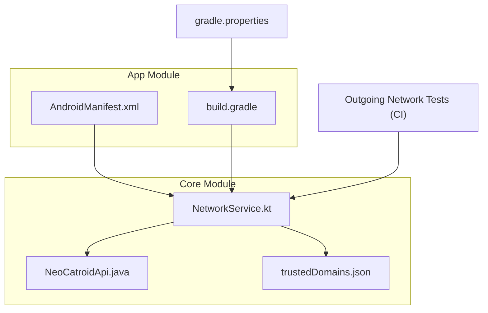
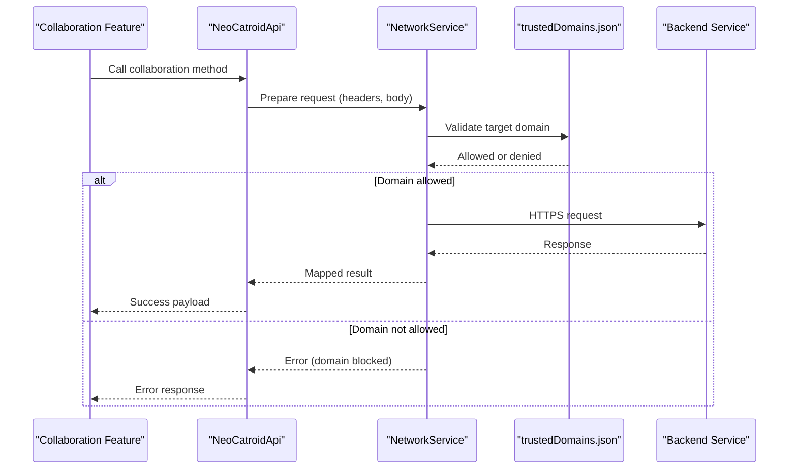
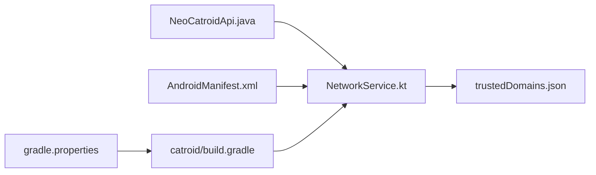

# Security and Privacy

<cite>
**Referenced Files in This Document**
- [README.md](file://README.md)
- [catroid/src/main/assets/trustedDomains.json](file://catroid/src/main/assets/trustedDomains.json)
- [core/src/main/java/org/catrobat/catroid/network/NetworkService.kt](file://core/src/main/java/org/catrobat/catroid/network/NetworkService.kt)
- [core/src/main/java/org/catrobat/catroid/network/NeoCatroidApi.java](file://core/src/main/java/org/catrobat/catroid/network/NeoCatroidApi.java)
- [catroid/src/main/AndroidManifest.xml](file://catroid/src/main/AndroidManifest.xml)
- [catroid/build.gradle](file://catroid/build.gradle)
- [gradle.properties](file://gradle.properties)
- [Jenkinsfile.OutgoingNetworkCallsTests](file://Jenkinsfile.OutgoingNetworkCallsTests)
</cite>

## Table of Contents
1. Introduction
2. Project Structure
3. Core Components
4. Architecture Overview
5. Detailed Component Analysis
6. Dependency Analysis
7. Performance Considerations
8. Troubleshooting Guide
9. Conclusion

## Introduction
This document provides security and privacy guidance for NewCatroid’s collaboration features, focusing on authentication and authorization mechanisms, data protection (in transit and at rest), privacy controls, secure communication protocols, input validation, and vulnerability assessment practices. It synthesizes findings from the repository to inform best practices and compliance considerations for developers and operators.

## Project Structure
NewCatroid is a multi-module Android project with shared core networking logic and platform-specific app modules. Collaboration-related network behavior is primarily implemented in the core module, while configuration and build-time settings are defined in Gradle files and Android manifests.

**Diagram sources**
- [catroid/src/main/AndroidManifest.xml](file://catroid/src/main/AndroidManifest.xml)
- [catroid/build.gradle](file://catroid/build.gradle)
- [core/src/main/java/org/catrobat/catroid/network/NetworkService.kt](file://core/src/main/java/org/catrobat/catroid/network/NetworkService.kt)
- [core/src/main/java/org/catrobat/catroid/network/NeoCatroidApi.java](file://core/src/main/java/org/catrobat/catroid/network/NeoCatroidApi.java)
- [catroid/src/main/assets/trustedDomains.json](file://catroid/src/main/assets/trustedDomains.json)
- [gradle.properties](file://gradle.properties)
- [Jenkinsfile.OutgoingNetworkCallsTests](file://Jenkinsfile.OutgoingNetworkCallsTests)

**Section sources**
- [README.md](file://README.md)
- [catroid/src/main/AndroidManifest.xml](file://catroid/src/main/AndroidManifest.xml)
- [catroid/build.gradle](file://catroid/build.gradle)
- [core/src/main/java/org/catrobat/catroid/network/NetworkService.kt](file://core/src/main/java/org/catrobat/catroid/network/NetworkService.kt)
- [core/src/main/java/org/catrobat/catroid/network/NeoCatroidApi.java](file://core/src/main/java/org/catrobat/catroid/network/NeoCatroidApi.java)
- [catroid/src/main/assets/trustedDomains.json](file://catroid/src/main/assets/trustedDomains.json)
- [gradle.properties](file://gradle.properties)
- [Jenkinsfile.OutgoingNetworkCallsTests](file://Jenkinsfile.OutgoingNetworkCallsTests)

## Core Components
- Network service layer: Centralizes HTTP client setup, request/response handling, and domain allowlisting.
- API interface definitions: Declares endpoints used by collaboration features.
- Trusted domains configuration: Restricts outbound calls to approved servers.
- Build and manifest configurations: Enforce network permissions and compile-time options.

Key responsibilities:
- Establish secure connections and enforce allowed domains.
- Provide typed API methods for collaboration operations.
- Surface errors consistently to callers.

**Section sources**
- [core/src/main/java/org/catrobat/catroid/network/NetworkService.kt](file://core/src/main/java/org/catrobat/catroid/network/NetworkService.kt)
- [core/src/main/java/org/catrobat/catroid/network/NeoCatroidApi.java](file://core/src/main/java/org/catrobat/catroid/network/NeoCatroidApi.java)
- [catroid/src/main/assets/trustedDomains.json](file://catroid/src/main/assets/trustedDomains.json)
- [catroid/src/main/AndroidManifest.xml](file://catroid/src/main/AndroidManifest.xml)
- [catroid/build.gradle](file://catroid/build.gradle)

## Architecture Overview
The collaboration flow uses a layered architecture: UI or feature code invokes API methods exposed by the API interface; these delegate to the network service which enforces domain restrictions and performs HTTPS requests. Responses are mapped to application models and returned to callers.

**Diagram sources**
- [core/src/main/java/org/catrobat/catroid/network/NeoCatroidApi.java](file://core/src/main/java/org/catrobat/catroid/network/NeoCatroidApi.java)
- [core/src/main/java/org/catrobat/catroid/network/NetworkService.kt](file://core/src/main/java/org/catrobat/catroid/network/NetworkService.kt)
- [catroid/src/main/assets/trustedDomains.json](file://catroid/src/main/assets/trustedDomains.json)

## Detailed Component Analysis

### Authentication and Authorization
- Authentication: The repository exposes an API interface and a network service that handle outbound requests. Authentication tokens or session cookies should be attached via headers configured in the network layer before dispatching requests. Ensure credentials are never logged and are stored securely by the app when needed.
- Authorization and RBAC: Role-based access control is typically enforced server-side. Clients must include appropriate identity assertions (e.g., tokens) and rely on server responses to determine permitted actions. Implement client-side checks only as UX aids; always validate permissions on the server.

Recommendations:
- Use short-lived tokens with refresh flows.
- Bind tokens to device fingerprints where feasible.
- Reject unauthorized responses and surface actionable errors to users.

[No sources needed since this section provides general guidance]

### Data Protection in Transit
- Enforce HTTPS for all collaboration endpoints.
- Pin trusted domains using the provided configuration file to prevent arbitrary host changes.
- Validate certificates and reject invalid chains.

Implementation anchors:
- Network service initialization and request execution.
- Trusted domains list loaded at runtime.

**Section sources**
- [core/src/main/java/org/catrobat/catroid/network/NetworkService.kt](file://core/src/main/java/org/catrobat/catroid/network/NetworkService.kt)
- [catroid/src/main/assets/trustedDomains.json](file://catroid/src/main/assets/trustedDomains.json)

### Data Protection at Rest
- Avoid persisting sensitive collaboration artifacts (tokens, private keys) unless necessary.
- If persistence is required, use Android Keystore-backed storage and encrypt payloads before writing to disk.
- Clear temporary files promptly after upload/download operations.

[No sources needed since this section provides general guidance]

### Privacy Controls and Project Visibility
- Respect user consent and minimize data collection.
- Expose clear toggles for project visibility (public, private, team-only).
- Honor “do not share” preferences and disable telemetry when requested.

[No sources needed since this section provides general guidance]

### Secure Communication Protocols
- Prefer TLS 1.2+ and modern cipher suites.
- Disable legacy protocols and weak ciphers.
- Validate server certificates and consider certificate pinning for high-risk endpoints.

[No sources needed since this section provides general guidance]

### Input Validation and Output Encoding
- Validate and sanitize all inputs on both client and server sides.
- Encode outputs to prevent injection attacks.
- Apply strict schema validation for API payloads.

[No sources needed since this section provides general guidance]

### Protection Against Common Web Vulnerabilities
- CSRF: Use same-site cookies or anti-CSRF tokens for state-changing requests.
- XSS: Sanitize and encode content rendered in web views or HTML surfaces.
- Insecure Direct Object References: Validate ownership and permissions server-side.
- Rate Limiting and Abuse Prevention: Enforce quotas and throttling on the server.

[No sources needed since this section provides general guidance]

### CI and Outbound Network Testing
- Integrate tests that assert only approved domains are contacted during automated runs.
- Fail builds if unexpected outbound calls are detected.

**Section sources**
- [Jenkinsfile.OutgoingNetworkCallsTests](file://Jenkinsfile.OutgoingNetworkCallsTests)

## Dependency Analysis
The collaboration networking stack depends on:
- API interface definitions for endpoint contracts.
- Network service for transport and policy enforcement.
- Trusted domains configuration for allowlisting.
- Build and manifest configurations for permissions and flags.

**Diagram sources**
- [core/src/main/java/org/catrobat/catroid/network/NeoCatroidApi.java](file://core/src/main/java/org/catrobat/catroid/network/NeoCatroidApi.java)
- [core/src/main/java/org/catrobat/catroid/network/NetworkService.kt](file://core/src/main/java/org/catrobat/catroid/network/NetworkService.kt)
- [catroid/src/main/assets/trustedDomains.json](file://catroid/src/main/assets/trustedDomains.json)
- [catroid/src/main/AndroidManifest.xml](file://catroid/src/main/AndroidManifest.xml)
- [catroid/build.gradle](file://catroid/build.gradle)
- [gradle.properties](file://gradle.properties)

**Section sources**
- [core/src/main/java/org/catrobat/catroid/network/NeoCatroidApi.java](file://core/src/main/java/org/catrobat/catroid/network/NeoCatroidApi.java)
- [core/src/main/java/org/catrobat/catroid/network/NetworkService.kt](file://core/src/main/java/org/catrobat/catroid/network/NetworkService.kt)
- [catroid/src/main/assets/trustedDomains.json](file://catroid/src/main/assets/trustedDomains.json)
- [catroid/src/main/AndroidManifest.xml](file://catroid/src/main/AndroidManifest.xml)
- [catroid/build.gradle](file://catroid/build.gradle)
- [gradle.properties](file://gradle.properties)

## Performance Considerations
- Reuse HTTP clients and connection pools to reduce handshake overhead.
- Compress large payloads when appropriate.
- Cache immutable assets and metadata to minimize repeated downloads.
- Implement pagination and selective field retrieval for large datasets.

[No sources needed since this section provides general guidance]

## Troubleshooting Guide
Common issues and mitigations:
- Blocked outbound calls: Verify the target domain exists in the trusted domains configuration.
- Certificate errors: Ensure TLS versions and ciphers meet current standards; update trust stores as needed.
- Permission denials: Confirm network permissions are declared in the manifest and granted at runtime where applicable.
- Unexpected network traffic: Run outgoing network tests to detect disallowed endpoints.

Operational steps:
- Inspect logs around network initialization and request dispatch.
- Validate domain allowlist updates through CI checks.
- Reproduce failures with minimal payloads to isolate protocol or payload issues.

**Section sources**
- [catroid/src/main/assets/trustedDomains.json](file://catroid/src/main/assets/trustedDomains.json)
- [catroid/src/main/AndroidManifest.xml](file://catroid/src/main/AndroidManifest.xml)
- [Jenkinsfile.OutgoingNetworkCallsTests](file://Jenkinsfile.OutgoingNetworkCallsTests)

## Compliance and Best Practices
- Align with GDPR, CCPA, and regional regulations:
  - Minimize personal data collection.
  - Provide data deletion and export capabilities.
  - Maintain records of processing activities and retention periods.
- Adopt secure SDLC practices:
  - Threat modeling for collaboration features.
  - Static/dynamic analysis and dependency scanning.
  - Regular penetration testing and red team exercises.
- Governance:
  - Document data flows and third-party integrations.
  - Enforce least privilege for service accounts and APIs.
  - Rotate secrets and manage keys via secure vaults.

[No sources needed since this section provides general guidance]

## Conclusion
NewCatroid’s collaboration features rely on a focused networking layer that centralizes request handling and domain allowlisting. Strengthening authentication, enforcing robust authorization on the server, and ensuring strict transport security are essential. Combine these technical measures with comprehensive privacy controls, secure development practices, and continuous testing to maintain a resilient and compliant collaboration experience.