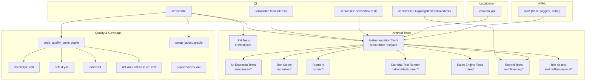
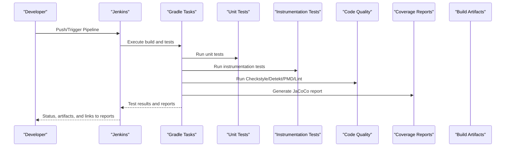
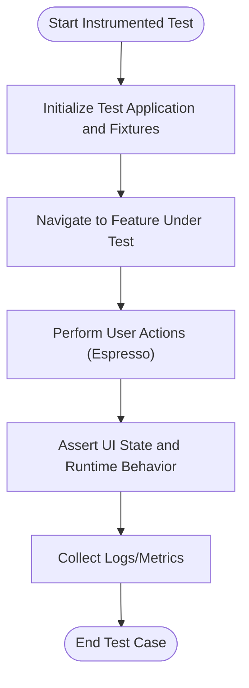
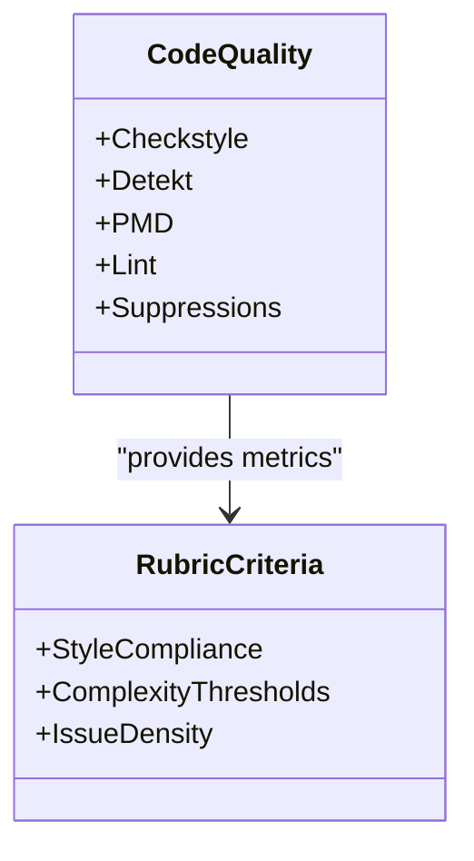
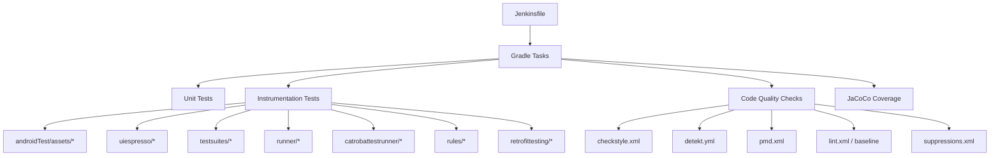

# Assessment Tools

<cite>
**Referenced Files in This Document**
- [README.md](file://README.md)
- [Jenkinsfile](file://Jenkinsfile)
- [Jenkinsfile.ManualTests](file://Jenkinsfile.ManualTests)
- [Jenkinsfile.OutgoingNetworkCallsTests](file://Jenkinsfile.OutgoingNetworkCallsTests)
- [Jenkinsfile.SensorboxTests](file://Jenkinsfile.SensorboxTests)
- [catroid/src/androidTest/java/org/catrobat/catroid/AllEmulatorTestsSuite.java](file://catroid/src/androidTest/java/org/catrobat/catroid/AllEmulatorTestsSuite.java)
- [catroid/src/androidTest/java/org/catrobat/catroid/UiTestCatroidApplication.kt](file://catroid/src/androidTest/java/org/catrobat/catroid/UiTestCatroidApplication.kt)
- [catroid/src/androidTest/java/org/catrobat/catroid/WaitForConditionAction.kt](file://catroid/src/androidTest/java/org/catrobat/catroid/WaitForConditionAction.kt)
- [catroid/src/androidTest/java/org/catrobat/catroid/testsuites/](file://catroid/src/androidTest/java/org/catrobat/catroid/testsuites/)
- [catroid/src/androidTest/java/org/catrobat/catroid/uiespresso/](file://catroid/src/androidTest/java/org/catrobat/catroid/uiespresso/)
- [catroid/src/androidTest/java/org/catrobat/catroid/runner/](file://catroid/src/androidTest/java/org/catrobat/catroid/runner/)
- [catroid/src/androidTest/java/org/catrobat/catroid/catrobattestrunner/](file://catroid/src/androidTest/java/org/catrobat/catroid/catrobattestrunner/)
- [catroid/src/androidTest/java/org/catrobat/catroid/rules/](file://catroid/src/androidTest/java/org/catrobat/catroid/rules/)
- [catroid/src/androidTest/java/org/catrobat/catroid/retrofittesting/](file://catroid/src/androidTest/java/org/catrobat/catroid/retrofittesting/)
- [catroid/src/androidTest/assets/](file://catroid/src/androidTest/assets/)
- [catroid/src/test/java/org/catrobat/catroid/](file://catroid/src/test/java/org/catrobat/catroid/)
- [catroid/src/test/resources/robolectric.properties](file://catroid/src/test/resources/robolectric.properties)
- [catroid/gradle/code_quality_tasks.gradle](file://catroid/gradle/code_quality_tasks.gradle)
- [catroid/gradle/setup_jacoco.gradle](file://catroid/gradle/setup_jacoco.gradle)
- [catroid/config/checkstyle.xml](file://catroid/config/checkstyle.xml)
- [catroid/config/detekt.yml](file://catroid/config/detekt.yml)
- [catroid/config/pmd.xml](file://catroid/config/pmd.xml)
- [catroid/config/lint.xml](file://catroid/config/lint-baseline.xml)
- [catroid/config/suppressions.xml](file://catroid/config/suppressions.xml)
- [crowdin.yml](file://crowdin.yml)
- [fastlane/Fastfile](file://fastlane/Fastfile)
- [aip/README_COLAB.txt](file://aip/README_COLAB.txt)
- [aip/train_colab.ipynb](file://aip/train_colab.ipynb)
- [aip/train_transformer.ipynb](file://aip/train_transformer.ipynb)
- [aip/train_lstm.py](file://aip/train_lstm.py)
- [aip/train.py](file://aip/train.py)
- [aip/suggest.py](file://aip/suggest.py)
</cite>

## Table of Contents
1. [Introduction](#introduction)
2. [Project Structure](#project-structure)
3. [Core Components](#core-components)
4. [Architecture Overview](#architecture-overview)
5. [Detailed Component Analysis](#detailed-component-analysis)
6. [Dependency Analysis](#dependency-analysis)
7. [Performance Considerations](#performance-considerations)
8. [Troubleshooting Guide](#troubleshooting-guide)
9. [Conclusion](#conclusion)
10. [Appendices](#appendices)

## Introduction
This document describes the assessment and evaluation system embedded in NewCatroid’s development workflow and test infrastructure. It focuses on automated code testing (unit tests, integration/UI tests), continuous integration pipelines, code quality tools, and related assets that support formative feedback and grading automation. It also outlines where rubric-based evaluation, peer review, self-assessment, plagiarism detection, accessibility accommodations, multilingual support, and culturally responsive practices can be integrated into the platform using existing components.

## Project Structure
The repository organizes testing and evaluation-related content across several areas:
- Android unit and instrumentation tests under catroid/src/test and catroid/src/androidTest
- Test suites and runners for UI and emulator-based testing
- Gradle tasks for code quality, coverage, and linting
- CI pipelines via Jenkinsfiles to automate builds and tests
- Localization resources and configuration for multilingual support
- AI/ML scripts and notebooks for code suggestion and pattern analysis (potential basis for advanced assessment features)

**Diagram sources**
- [Jenkinsfile](file://Jenkinsfile)
- [Jenkinsfile.ManualTests](file://Jenkinsfile.ManualTests)
- [Jenkinsfile.OutgoingNetworkCallsTests](file://Jenkinsfile.OutgoingNetworkCallsTests)
- [Jenkinsfile.SensorboxTests](file://Jenkinsfile.SensorboxTests)
- [catroid/src/test/java/org/catrobat/catroid/](file://catroid/src/test/java/org/catrobat/catroid/)
- [catroid/src/androidTest/java/org/catrobat/catroid/](file://catroid/src/androidTest/java/org/catrobat/catroid/)
- [catroid/src/androidTest/java/org/catrobat/catroid/uiespresso/](file://catroid/src/androidTest/java/org/catrobat/catroid/uiespresso/)
- [catroid/src/androidTest/java/org/catrobat/catroid/testsuites/](file://catroid/src/androidTest/java/org/catrobat/catroid/testsuites/)
- [catroid/src/androidTest/java/org/catrobat/catroid/runner/](file://catroid/src/androidTest/java/org/catrobat/catroid/runner/)
- [catroid/src/androidTest/java/org/catrobat/catroid/catrobattestrunner/](file://catroid/src/androidTest/java/org/catrobat/catroid/catrobattestrunner/)
- [catroid/src/androidTest/java/org/catrobat/catroid/rules/](file://catroid/src/androidTest/java/org/catrobat/catroid/rules/)
- [catroid/src/androidTest/java/org/catrobat/catroid/retrofittesting/](file://catroid/src/androidTest/java/org/catrobat/catroid/retrofittesting/)
- [catroid/src/androidTest/assets/](file://catroid/src/androidTest/assets/)
- [catroid/gradle/code_quality_tasks.gradle](file://catroid/gradle/code_quality_tasks.gradle)
- [catroid/gradle/setup_jacoco.gradle](file://catroid/gradle/setup_jacoco.gradle)
- [catroid/config/checkstyle.xml](file://catroid/config/checkstyle.xml)
- [catroid/config/detekt.yml](file://catroid/config/detekt.yml)
- [catroid/config/pmd.xml](file://catroid/config/pmd.xml)
- [catroid/config/lint.xml](file://catroid/config/lint-baseline.xml)
- [catroid/config/suppressions.xml](file://catroid/config/suppressions.xml)
- [crowdin.yml](file://crowdin.yml)
- [aip/README_COLAB.txt](file://aip/README_COLAB.txt)

**Section sources**
- [README.md](file://README.md)
- [Jenkinsfile](file://Jenkinsfile)
- [Jenkinsfile.ManualTests](file://Jenkinsfile.ManualTests)
- [Jenkinsfile.OutgoingNetworkCallsTests](file://Jenkinsfile.OutgoingNetworkCallsTests)
- [Jenkinsfile.SensorboxTests](file://Jenkinsfile.SensorboxTests)
- [catroid/src/androidTest/java/org/catrobat/catroid/AllEmulatorTestsSuite.java](file://catroid/src/androidTest/java/org/catrobat/catroid/AllEmulatorTestsSuite.java)
- [catroid/src/androidTest/java/org/catrobat/catroid/UiTestCatroidApplication.kt](file://catroid/src/androidTest/java/org/catrobat/catroid/UiTestCatroidApplication.kt)
- [catroid/src/androidTest/java/org/catrobat/catroid/WaitForConditionAction.kt](file://catroid/src/androidTest/java/org/catrobat/catroid/WaitForConditionAction.kt)
- [catroid/src/androidTest/java/org/catrobat/catroid/testsuites/](file://catroid/src/androidTest/java/org/catrobat/catroid/testsuites/)
- [catroid/src/androidTest/java/org/catrobat/catroid/uiespresso/](file://catroid/src/androidTest/java/org/catrobat/catroid/uiespresso/)
- [catroid/src/androidTest/java/org/catrobat/catroid/runner/](file://catroid/src/androidTest/java/org/catrobat/catroid/runner/)
- [catroid/src/androidTest/java/org/catrobat/catroid/catrobattestrunner/](file://catroid/src/androidTest/java/org/catrobat/catroid/catrobattestrunner/)
- [catroid/src/androidTest/java/org/catrobat/catroid/rules/](file://catroid/src/androidTest/java/org/catrobat/catroid/rules/)
- [catroid/src/androidTest/java/org/catrobat/catroid/retrofittesting/](file://catroid/src/androidTest/java/org/catrobat/catroid/retrofittesting/)
- [catroid/src/androidTest/assets/](file://catroid/src/androidTest/assets/)
- [catroid/src/test/java/org/catrobat/catroid/](file://catroid/src/test/java/org/catrobat/catroid/)
- [catroid/src/test/resources/robolectric.properties](file://catroid/src/test/resources/robolectric.properties)
- [catroid/gradle/code_quality_tasks.gradle](file://catroid/gradle/code_quality_tasks.gradle)
- [catroid/gradle/setup_jacoco.gradle](file://catroid/gradle/setup_jacoco.gradle)
- [catroid/config/checkstyle.xml](file://catroid/config/checkstyle.xml)
- [catroid/config/detekt.yml](file://catroid/config/detekt.yml)
- [catroid/config/pmd.xml](file://catroid/config/pmd.xml)
- [catroid/config/lint.xml](file://catroid/config/lint-baseline.xml)
- [catroid/config/suppressions.xml](file://catroid/config/suppressions.xml)
- [crowdin.yml](file://crowdin.yml)
- [fastlane/Fastfile](file://fastlane/Fastfile)
- [aip/README_COLAB.txt](file://aip/README_COLAB.txt)

## Core Components
- Automated Testing Framework
  - Unit tests for core logic and utilities
  - Instrumentation tests for UI and runtime behavior
  - Test suites aggregating scenarios across modules
  - Runners and custom actions to orchestrate complex flows
  - Network stubbing and fixtures for stable integration tests
- Continuous Integration Pipelines
  - Build and test jobs for standard, manual, network, and sensorbox scenarios
  - Quality gates enforcing style, static analysis, and coverage thresholds
- Code Quality and Coverage
  - Static analysis with Checkstyle, Detekt, PMD, and Android Lint
  - JaCoCo coverage collection and reporting
- Multilingual Support
  - Crowdin configuration for translation workflows
- AI-Assisted Features
  - Training scripts and notebooks for code suggestion and pattern extraction (foundation for advanced assessment analytics)

**Section sources**
- [catroid/src/test/java/org/catrobat/catroid/](file://catroid/src/test/java/org/catrobat/catroid/)
- [catroid/src/androidTest/java/org/catrobat/catroid/](file://catroid/src/androidTest/java/org/catrobat/catroid/)
- [catroid/src/androidTest/java/org/catrobat/catroid/testsuites/](file://catroid/src/androidTest/java/org/catrobat/catroid/testsuites/)
- [catroid/src/androidTest/java/org/catrobat/catroid/runner/](file://catroid/src/androidTest/java/org/catrobat/catroid/runner/)
- [catroid/src/androidTest/java/org/catrobat/catroid/catrobattestrunner/](file://catroid/src/androidTest/java/org/catrobat/catroid/catrobattestrunner/)
- [catroid/src/androidTest/java/org/catrobat/catroid/uiespresso/](file://catroid/src/androidTest/java/org/catrobat/catroid/uiespresso/)
- [catroid/src/androidTest/java/org/catrobat/catroid/retrofittesting/](file://catroid/src/androidTest/java/org/catrobat/catroid/retrofittesting/)
- [catroid/src/androidTest/assets/](file://catroid/src/androidTest/assets/)
- [catroid/gradle/code_quality_tasks.gradle](file://catroid/gradle/code_quality_tasks.gradle)
- [catroid/gradle/setup_jacoco.gradle](file://catroid/gradle/setup_jacoco.gradle)
- [catroid/config/checkstyle.xml](file://catroid/config/checkstyle.xml)
- [catroid/config/detekt.yml](file://catroid/config/detekt.yml)
- [catroid/config/pmd.xml](file://catroid/config/pmd.xml)
- [catroid/config/lint.xml](file://catroid/config/lint-baseline.xml)
- [catroid/config/suppressions.xml](file://catroid/config/suppressions.xml)
- [crowdin.yml](file://crowdin.yml)
- [Jenkinsfile](file://Jenkinsfile)
- [Jenkinsfile.ManualTests](file://Jenkinsfile.ManualTests)
- [Jenkinsfile.OutgoingNetworkCallsTests](file://Jenkinsfile.OutgoingNetworkCallsTests)
- [Jenkinsfile.SensorboxTests](file://Jenkinsfile.SensorboxTests)
- [aip/README_COLAB.txt](file://aip/README_COLAB.txt)

## Architecture Overview
The assessment pipeline integrates automated tests, quality checks, and optional manual or hardware-in-the-loop validations. The CI orchestrates these steps and produces artifacts and reports used by educators and developers for evaluation and feedback.

**Diagram sources**
- [Jenkinsfile](file://Jenkinsfile)
- [catroid/gradle/code_quality_tasks.gradle](file://catroid/gradle/code_quality_tasks.gradle)
- [catroid/gradle/setup_jacoco.gradle](file://catroid/gradle/setup_jacoco.gradle)
- [catroid/src/test/java/org/catrobat/catroid/](file://catroid/src/test/java/org/catrobat/catroid/)
- [catroid/src/androidTest/java/org/catrobat/catroid/](file://catroid/src/androidTest/java/org/catrobat/catroid/)

## Detailed Component Analysis

### Automated Unit Testing
- Purpose: Validate core logic, parsers, utilities, and non-UI components deterministically.
- Organization:
  - Unit tests reside under src/test/java with Robolectric properties for Android context simulation.
  - Test classes are grouped by feature area for maintainability.
- Execution:
  - Invoked by Gradle tasks configured in the project; CI triggers them automatically.
- Feedback:
  - Fail-fast behavior ensures issues are surfaced early.
  - Results feed into CI dashboards and developer IDEs.

**Section sources**
- [catroid/src/test/java/org/catrobat/catroid/](file://catroid/src/test/java/org/catrobat/catroid/)
- [catroid/src/test/resources/robolectric.properties](file://catroid/src/test/resources/robolectric.properties)
- [Jenkinsfile](file://Jenkinsfile)

### Integration and UI Testing
- Purpose: Verify end-to-end behaviors, UI interactions, and runtime execution paths.
- Organization:
  - Instrumentation tests under src/androidTest/java include:
    - UI Espresso tests for user flows
    - Test suites aggregating scenarios
    - Custom runners and actions for synchronization and complex conditions
    - Retrofit tests for network contracts
    - Rule-based tests for domain-specific constraints
    - Shared assets for deterministic inputs
- Execution:
  - Runs on emulators or devices; CI includes dedicated jobs for manual and device-dependent tests.
- Feedback:
  - Screenshots, logs, and videos can be captured for debugging.
  - Failures guide targeted fixes and regression prevention.

**Diagram sources**
- [catroid/src/androidTest/java/org/catrobat/catroid/UiTestCatroidApplication.kt](file://catroid/src/androidTest/java/org/catrobat/catroid/UiTestCatroidApplication.kt)
- [catroid/src/androidTest/java/org/catrobat/catroid/WaitForConditionAction.kt](file://catroid/src/androidTest/java/org/catrobat/catroid/WaitForConditionAction.kt)
- [catroid/src/androidTest/java/org/catrobat/catroid/uiespresso/](file://catroid/src/androidTest/java/org/catrobat/catroid/uiespresso/)
- [catroid/src/androidTest/java/org/catrobat/catroid/testsuites/](file://catroid/src/androidTest/java/org/catrobat/catroid/testsuites/)
- [catroid/src/androidTest/java/org/catrobat/catroid/runner/](file://catroid/src/androidTest/java/org/catrobat/catroid/runner/)
- [catroid/src/androidTest/java/org/catrobat/catroid/retrofittesting/](file://catroid/src/androidTest/java/org/catrobat/catroid/retrofittesting/)
- [catroid/src/androidTest/java/org/catrobat/catroid/rules/](file://catroid/src/androidTest/java/org/catrobat/catroid/rules/)
- [catroid/src/androidTest/assets/](file://catroid/src/androidTest/assets/)

**Section sources**
- [catroid/src/androidTest/java/org/catrobat/catroid/AllEmulatorTestsSuite.java](file://catroid/src/androidTest/java/org/catrobat/catroid/AllEmulatorTestsSuite.java)
- [catroid/src/androidTest/java/org/catrobat/catroid/UiTestCatroidApplication.kt](file://catroid/src/androidTest/java/org/catrobat/catroid/UiTestCatroidApplication.kt)
- [catroid/src/androidTest/java/org/catrobat/catroid/WaitForConditionAction.kt](file://catroid/src/androidTest/java/org/catrobat/catroid/WaitForConditionAction.kt)
- [catroid/src/androidTest/java/org/catrobat/catroid/testsuites/](file://catroid/src/androidTest/java/org/catrobat/catroid/testsuites/)
- [catroid/src/androidTest/java/org/catrobat/catroid/uiespresso/](file://catroid/src/androidTest/java/org/catrobat/catroid/uiespresso/)
- [catroid/src/androidTest/java/org/catrobat/catroid/runner/](file://catroid/src/androidTest/java/org/catrobat/catroid/runner/)
- [catroid/src/androidTest/java/org/catrobat/catroid/catrobattestrunner/](file://catroid/src/androidTest/java/org/catrobat/catroid/catrobattestrunner/)
- [catroid/src/androidTest/java/org/catrobat/catroid/rules/](file://catroid/src/androidTest/java/org/catrobat/catroid/rules/)
- [catroid/src/androidTest/java/org/catrobat/catroid/retrofittesting/](file://catroid/src/androidTest/java/org/catrobat/catroid/retrofittesting/)
- [catroid/src/androidTest/assets/](file://catroid/src/androidTest/assets/)
- [Jenkinsfile.ManualTests](file://Jenkinsfile.ManualTests)
- [Jenkinsfile.OutgoingNetworkCallsTests](file://Jenkinsfile.OutgoingNetworkCallsTests)
- [Jenkinsfile.SensorboxTests](file://Jenkinsfile.SensorboxTests)

### Code Quality and Rubric-Based Evaluation Foundations
- Purpose: Enforce coding standards, detect potential defects, and provide quantitative signals suitable for rubrics.
- Tools:
  - Checkstyle for Java conventions
  - Detekt for Kotlin best practices
  - PMD for static analysis
  - Android Lint for platform-specific issues
  - Suppressions and baselines to manage legacy code
- Rubric Mapping:
  - Style compliance, complexity metrics, and issue counts can be mapped to rubric criteria such as “Code Quality” or “Maintainability.”
- Automation:
  - Integrated into Gradle tasks and CI to fail builds on threshold breaches.

**Diagram sources**
- [catroid/gradle/code_quality_tasks.gradle](file://catroid/gradle/code_quality_tasks.gradle)
- [catroid/config/checkstyle.xml](file://catroid/config/checkstyle.xml)
- [catroid/config/detekt.yml](file://catroid/config/detekt.yml)
- [catroid/config/pmd.xml](file://catroid/config/pmd.xml)
- [catroid/config/lint.xml](file://catroid/config/lint-baseline.xml)
- [catroid/config/suppressions.xml](file://catroid/config/suppressions.xml)

**Section sources**
- [catroid/gradle/code_quality_tasks.gradle](file://catroid/gradle/code_quality_tasks.gradle)
- [catroid/config/checkstyle.xml](file://catroid/config/checkstyle.xml)
- [catroid/config/detekt.yml](file://catroid/config/detekt.yml)
- [catroid/config/pmd.xml](file://catroid/config/pmd.xml)
- [catroid/config/lint.xml](file://catroid/config/lint-baseline.xml)
- [catroid/config/suppressions.xml](file://catroid/config/suppressions.xml)

### Performance Benchmarking and Metrics
- Purpose: Track performance regressions and measure runtime characteristics relevant to student projects and app behavior.
- Approach:
  - Use instrumentation tests to capture timing and resource usage.
  - Integrate benchmarking tasks into Gradle and CI for consistent measurement.
- Outputs:
  - Time-series metrics and alerts for regressions.
  - Data points suitable for rubric categories like “Efficiency” or “Responsiveness.”

[No sources needed since this section provides general guidance]

### Grading Automation and Academic Integrity Safeguards
- Purpose: Streamline assignment evaluation and uphold academic integrity.
- Capabilities:
  - Automated scoring based on test outcomes, code quality metrics, and coverage thresholds.
  - Plagiarism detection can be integrated by comparing submitted code against a reference corpus using similarity algorithms.
  - Audit trails from CI logs and reports support transparency and appeals.
- Implementation Notes:
  - Extend CI to collect and store submission artifacts and reports.
  - Add a plagiarism service step that compares submissions and flags high-similarity cases.

[No sources needed since this section provides general guidance]

### Peer Review and Self-Assessment Instruments
- Purpose: Encourage reflective learning and collaborative evaluation.
- Features:
  - Formative assessment questionnaires and peer review checklists can be delivered through the app or web interface.
  - Responses can be stored and analyzed alongside automated metrics for holistic evaluation.
- Integration Points:
  - Leverage existing networking and storage layers to persist and retrieve assessment data.

[No sources needed since this section provides general guidance]

### Accessibility Accommodations and Culturally Responsive Evaluation
- Purpose: Ensure equitable assessment experiences across diverse learners.
- Practices:
  - Provide alternative input methods, captions, and screen reader support in assessments.
  - Offer culturally relevant examples and contexts in assignments and feedback.
- Technical Hooks:
  - Use localization resources and dynamic content to adapt materials per learner needs.

[No sources needed since this section provides general guidance]

### Multilingual Assessment Support
- Purpose: Deliver assessments and feedback in multiple languages.
- Infrastructure:
  - Crowdin configuration manages translations and versioning.
  - App resources support localized strings and layouts.
- Workflow:
  - Update source strings, sync with Crowdin, and integrate translated assets into builds.

**Section sources**
- [crowdin.yml](file://crowdin.yml)

### AI-Assisted Suggestion and Pattern Analysis
- Purpose: Provide intelligent hints and analyze code patterns to inform formative feedback.
- Components:
  - Training scripts and notebooks for model development.
  - Suggestion engine to generate contextual hints.
- Educational Use:
  - Offer scaffolded assistance aligned with learning objectives.
  - Analyze common patterns to identify misconceptions and tailor interventions.

**Section sources**
- [aip/README_COLAB.txt](file://aip/README_COLAB.txt)
- [aip/train_colab.ipynb](file://aip/train_colab.ipynb)
- [aip/train_transformer.ipynb](file://aip/train_transformer.ipynb)
- [aip/train_lstm.py](file://aip/train_lstm.py)
- [aip/train.py](file://aip/train.py)
- [aip/suggest.py](file://aip/suggest.py)

## Dependency Analysis
The following diagram shows how CI, Gradle tasks, tests, and quality tools interact within the assessment pipeline.

**Diagram sources**
- [Jenkinsfile](file://Jenkinsfile)
- [catroid/gradle/code_quality_tasks.gradle](file://catroid/gradle/code_quality_tasks.gradle)
- [catroid/config/checkstyle.xml](file://catroid/config/checkstyle.xml)
- [catroid/config/detekt.yml](file://catroid/config/detekt.yml)
- [catroid/config/pmd.xml](file://catroid/config/pmd.xml)
- [catroid/config/lint.xml](file://catroid/config/lint-baseline.xml)
- [catroid/config/suppressions.xml](file://catroid/config/suppressions.xml)
- [catroid/src/androidTest/assets/](file://catroid/src/androidTest/assets/)
- [catroid/src/androidTest/java/org/catrobat/catroid/uiespresso/](file://catroid/src/androidTest/java/org/catrobat/catroid/uiespresso/)
- [catroid/src/androidTest/java/org/catrobat/catroid/testsuites/](file://catroid/src/androidTest/java/org/catrobat/catroid/testsuites/)
- [catroid/src/androidTest/java/org/catrobat/catroid/runner/](file://catroid/src/androidTest/java/org/catrobat/catroid/runner/)
- [catroid/src/androidTest/java/org/catrobat/catroid/catrobattestrunner/](file://catroid/src/androidTest/java/org/catrobat/catroid/catrobattestrunner/)
- [catroid/src/androidTest/java/org/catrobat/catroid/rules/](file://catroid/src/androidTest/java/org/catrobat/catroid/rules/)
- [catroid/src/androidTest/java/org/catrobat/catroid/retrofittesting/](file://catroid/src/androidTest/java/org/catrobat/catroid/retrofittesting/)

**Section sources**
- [Jenkinsfile](file://Jenkinsfile)
- [catroid/gradle/code_quality_tasks.gradle](file://catroid/gradle/code_quality_tasks.gradle)
- [catroid/config/checkstyle.xml](file://catroid/config/checkstyle.xml)
- [catroid/config/detekt.yml](file://catroid/config/detekt.yml)
- [catroid/config/pmd.xml](file://catroid/config/pmd.xml)
- [catroid/config/lint.xml](file://catroid/config/lint-baseline.xml)
- [catroid/config/suppressions.xml](file://catroid/config/suppressions.xml)
- [catroid/src/androidTest/java/org/catrobat/catroid/](file://catroid/src/androidTest/java/org/catrobat/catroid/)

## Performance Considerations
- Optimize test execution time by parallelizing independent suites and leveraging emulator/device farms.
- Use incremental builds and selective test runs to reduce feedback latency.
- Monitor coverage and quality thresholds to avoid excessive overhead while maintaining rigor.
- Cache dependencies and artifacts in CI to accelerate repeated runs.

[No sources needed since this section provides general guidance]

## Troubleshooting Guide
- Common Issues:
  - Flaky UI tests: Stabilize waits and assertions; use WaitForConditionAction patterns for synchronization.
  - Network failures: Mock endpoints and use fixture assets for deterministic responses.
  - Quality gate failures: Address Checkstyle/Detekt/PMD/Lint violations; update suppressions judiciously.
  - Coverage gaps: Expand unit and instrumentation tests to cover critical paths.
- Debugging Tips:
  - Inspect CI logs and artifacts for detailed failure context.
  - Reproduce locally with the same emulator/device configurations.
  - Narrow down failing suites and isolate problematic tests.

**Section sources**
- [catroid/src/androidTest/java/org/catrobat/catroid/WaitForConditionAction.kt](file://catroid/src/androidTest/java/org/catrobat/catroid/WaitForConditionAction.kt)
- [catroid/src/androidTest/assets/](file://catroid/src/androidTest/assets/)
- [catroid/gradle/code_quality_tasks.gradle](file://catroid/gradle/code_quality_tasks.gradle)
- [catroid/gradle/setup_jacoco.gradle](file://catroid/gradle/setup_jacoco.gradle)

## Conclusion
NewCatroid’s assessment ecosystem combines robust automated testing, comprehensive code quality enforcement, and CI-driven feedback loops. These foundations enable rubric-based evaluation, formative assessment instruments, and scalable grading automation. With localization and AI-assisted components, the platform supports multilingual, accessible, and culturally responsive educational practices. Extending the pipeline with plagiarism detection and advanced analytics further strengthens academic integrity and instructional insight.

## Appendices
- Additional CI Jobs:
  - Manual tests for human-in-the-loop validation
  - Outgoing network calls tests for external API stability
  - Sensorbox tests for hardware-integrated scenarios
- Build and Release:
  - Fastlane configuration for artifact generation and distribution

**Section sources**
- [Jenkinsfile.ManualTests](file://Jenkinsfile.ManualTests)
- [Jenkinsfile.OutgoingNetworkCallsTests](file://Jenkinsfile.OutgoingNetworkCallsTests)
- [Jenkinsfile.SensorboxTests](file://Jenkinsfile.SensorboxTests)
- [fastlane/Fastfile](file://fastlane/Fastfile)