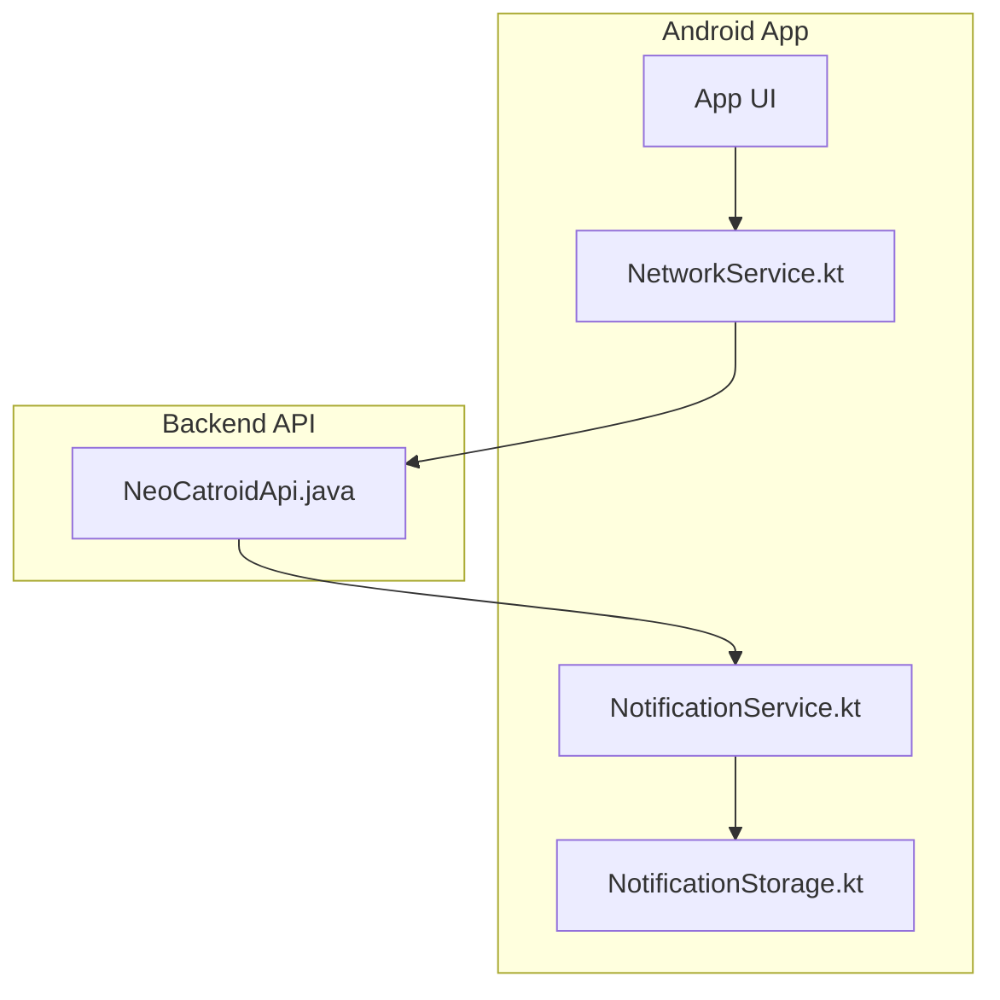
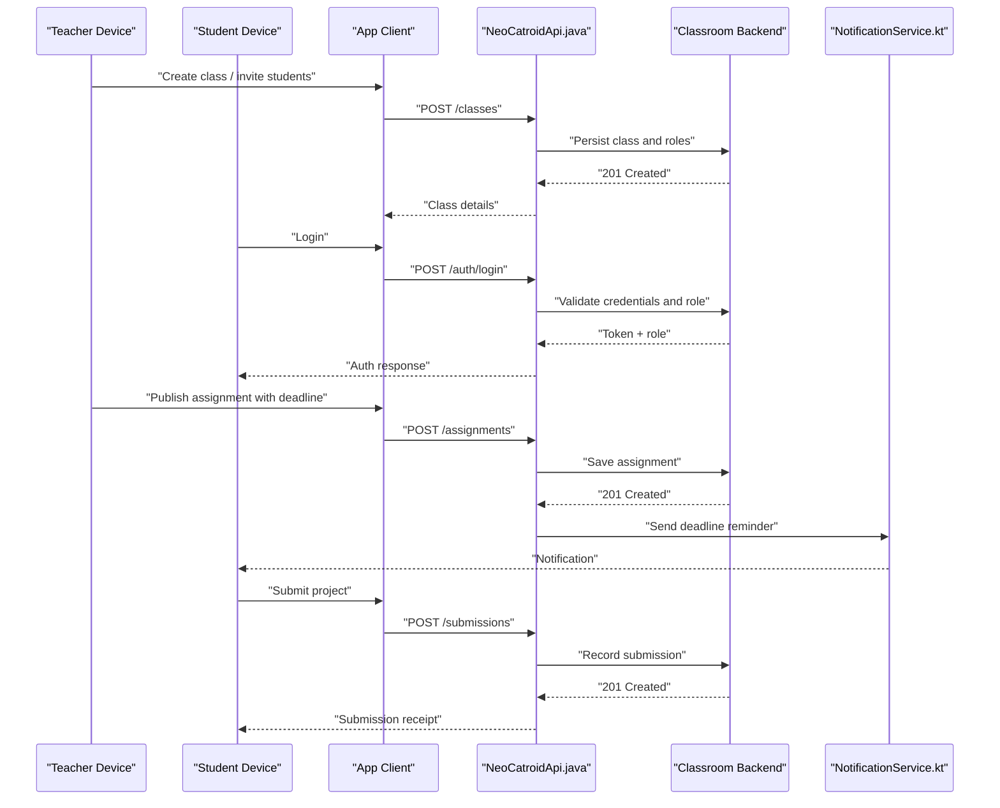
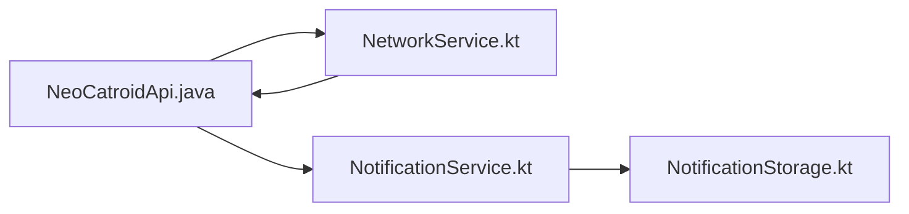

# Classroom Management

<cite>
**Referenced Files in This Document**
- [README.md](file://README.md)
- [task.md](file://task.md)
- [AGENTS.md](file://AGENTS.md)
- [catroid/src/main/java/org/catrobat/catroid/network/NeoCatroidApi.java](file://catroid/src/main/java/org/catrobat/catroid/network/NeoCatroidApi.java)
- [core/src/main/java/org/catrobat/catroid/network/NetworkService.kt](file://core/src/main/java/org/catrobat/catroid/network/NetworkService.kt)
- [core/src/main/java/org/catrobat/catroid/notification/NotificationService.kt](file://core/src/main/java/org/catrobat/catroid/notification/NotificationService.kt)
- [core/src/main/java/org/catrobat/catroid/content/notification/NotificationStorage.kt](file://core/src/main/java/org/catrobat/catroid/content/notification/NotificationStorage.kt)
</cite>

## Table of Contents
1. [Introduction](#introduction)
2. [Project Structure](#project-structure)
3. [Core Components](#core-components)
4. [Architecture Overview](#architecture-overview)
5. [Detailed Component Analysis](#detailed-component-analysis)
6. [Dependency Analysis](#dependency-analysis)
7. [Performance Considerations](#performance-considerations)
8. [Troubleshooting Guide](#troubleshooting-guide)
9. [Conclusion](#conclusion)
10. [Appendices](#appendices)

## Introduction
This document describes the classroom management system as implemented in NewCatroid, focusing on student account administration, assignment distribution, class organization, administrative controls, and security considerations. It synthesizes information from the repository’s documentation and source code to provide a comprehensive overview for educators, administrators, and developers.

## Project Structure
NewCatroid is an Android-based educational platform with modular components for networking, notifications, and runtime services. The classroom management features are primarily exposed through network APIs and notification services that support teacher-student workflows such as project distribution, deadlines, and communication.

**Diagram sources**
- [catroid/src/main/java/org/catrobat/catroid/network/NeoCatroidApi.java](file://catroid/src/main/java/org/catrobat/catroid/network/NeoCatroidApi.java)
- [core/src/main/java/org/catrobat/catroid/network/NetworkService.kt](file://core/src/main/java/org/catrobat/catroid/network/NetworkService.kt)
- [core/src/main/java/org/catrobat/catroid/notification/NotificationService.kt](file://core/src/main/java/org/catrobat/catroid/notification/NotificationService.kt)
- [core/src/main/java/org/catrobat/catroid/content/notification/NotificationStorage.kt](file://core/src/main/java/org/catrobat/catroid/content/notification/NotificationStorage.kt)

**Section sources**
- [README.md](file://README.md)
- [task.md](file://task.md)
- [AGENTS.md](file://AGENTS.md)

## Core Components
- Network layer: Provides HTTP-based access to backend services used by classroom management features (e.g., user accounts, assignments, submissions).
- Notification subsystem: Manages delivery and persistence of notifications related to assignments, deadlines, and announcements.
- Runtime and utility services: Support general app behavior and integration points.

Key responsibilities:
- User registration and authentication flows via network endpoints.
- Role-based access control enforcement at the API boundary.
- Assignment lifecycle management including templates, deadlines, and submission handling.
- Class organization primitives such as groups and seating arrangements modeled as server-side entities.
- Teacher dashboards and student monitoring tools driven by data returned from the API.
- Communication channels surfaced through notifications and messages.

**Section sources**
- [catroid/src/main/java/org/catrobat/catroid/network/NeoCatroidApi.java](file://catroid/src/main/java/org/catrobat/catroid/network/NeoCatroidApi.java)
- [core/src/main/java/org/catrobat/catroid/network/NetworkService.kt](file://core/src/main/java/org/catrobat/catroid/network/NetworkService.kt)
- [core/src/main/java/org/catrobat/catroid/notification/NotificationService.kt](file://core/src/main/java/org/catrobat/catroid/notification/NotificationService.kt)
- [core/src/main/java/org/catrobat/catroid/content/notification/NotificationStorage.kt](file://core/src/main/java/org/catrobat/catroid/content/notification/NotificationStorage.kt)

## Architecture Overview
The classroom management system follows a client-server architecture. The Android app interacts with a backend API to perform operations related to users, classes, assignments, and submissions. Notifications are delivered to students and teachers to keep them informed about deadlines and updates.

**Diagram sources**
- [catroid/src/main/java/org/catrobat/catroid/network/NeoCatroidApi.java](file://catroid/src/main/java/org/catrobat/catroid/network/NeoCatroidApi.java)
- [core/src/main/java/org/catrobat/catroid/network/NetworkService.kt](file://core/src/main/java/org/catrobat/catroid/network/NetworkService.kt)
- [core/src/main/java/org/catrobat/catroid/notification/NotificationService.kt](file://core/src/main/java/org/catrobat/catroid/notification/NotificationService.kt)

## Detailed Component Analysis

### Student Account Administration
- User registration and login are handled through network endpoints exposed by the API layer. Roles (teacher/student) determine access to features like class creation, assignment publishing, and submission viewing.
- Profile management includes updating personal information and preferences, typically synchronized with the backend.

Implementation highlights:
- Authentication requests flow through the network service to the API.
- Role checks are enforced by the backend; the client adapts UI based on returned role claims.

**Section sources**
- [catroid/src/main/java/org/catrobat/catroid/network/NeoCatroidApi.java](file://catroid/src/main/java/org/catrobat/catroid/network/NeoCatroidApi.java)
- [core/src/main/java/org/catrobat/catroid/network/NetworkService.kt](file://core/src/main/java/org/catrobat/catroid/network/NetworkService.kt)

### Assignment Distribution Mechanisms
- Project templates can be published by teachers and made available to students for cloning or adaptation.
- Deadline management ensures timely reminders and late submission policies are applied server-side.
- Submission workflows allow students to upload projects and receive acknowledgments.

Operational flow:
- Teachers create assignments with metadata (title, description, template link, deadline).
- Students view available assignments and submit work before deadlines.
- Notifications inform students of upcoming deadlines and submission confirmations.

**Section sources**
- [catroid/src/main/java/org/catrobat/catroid/network/NeoCatroidApi.java](file://catroid/src/main/java/org/catrobat/catroid/network/NeoCatroidApi.java)
- [core/src/main/java/org/catrobat/catroid/notification/NotificationService.kt](file://core/src/main/java/org/catrobat/catroid/notification/NotificationService.kt)

### Class Organization Features
- Group management enables teachers to organize students into collaborative teams for group projects.
- Seating arrangements may be represented as a visual layout for in-class activities or lab sessions.
- Resource allocation allows teachers to assign devices, materials, or digital resources to individuals or groups.

Data model considerations:
- Classes contain multiple students and groups.
- Assignments reference templates and deadlines.
- Submissions link to students/groups and assignments.

**Section sources**
- [catroid/src/main/java/org/catrobat/catroid/network/NeoCatroidApi.java](file://catroid/src/main/java/org/catrobat/catroid/network/NeoCatroidApi.java)

### Administrative Controls and Monitoring
- Teacher dashboards aggregate class statistics, assignment statuses, and submission progress.
- Student monitoring tools track activity metrics and completion rates.
- Communication channels include announcements and direct messaging, surfaced via notifications.

Integration points:
- Dashboard data is fetched through API endpoints.
- Notifications are dispatched for important events (new assignments, grade postings, reminders).

**Section sources**
- [catroid/src/main/java/org/catrobat/catroid/network/NeoCatroidApi.java](file://catroid/src/main/java/org/catrobat/catroid/network/NeoCatroidApi.java)
- [core/src/main/java/org/catrobat/catroid/notification/NotificationService.kt](file://core/src/main/java/org/catrobat/catroid/notification/NotificationService.kt)

### Security and Privacy
- Authentication tokens and role-based permissions protect sensitive operations.
- Data privacy compliance requires secure storage of personal information and adherence to institutional policies.
- Integration with school information systems should use secure protocols and least-privilege access.

Best practices:
- Validate all inputs on the server side.
- Enforce HTTPS for all communications.
- Minimize data retention and provide user consent mechanisms.

**Section sources**
- [catroid/src/main/java/org/catrobat/catroid/network/NeoCatroidApi.java](file://catroid/src/main/java/org/catrobat/catroid/network/NeoCatroidApi.java)

## Dependency Analysis
The classroom management features depend on the network layer and notification subsystem. The API module defines endpoints and request/response contracts, while the network service handles transport and error handling. Notifications are persisted locally and displayed to users.

**Diagram sources**
- [catroid/src/main/java/org/catrobat/catroid/network/NeoCatroidApi.java](file://catroid/src/main/java/org/catrobat/catroid/network/NeoCatroidApi.java)
- [core/src/main/java/org/catrobat/catroid/network/NetworkService.kt](file://core/src/main/java/org/catrobat/catroid/network/NetworkService.kt)
- [core/src/main/java/org/catrobat/catroid/notification/NotificationService.kt](file://core/src/main/java/org/catrobat/catroid/notification/NotificationService.kt)
- [core/src/main/java/org/catrobat/catroid/content/notification/NotificationStorage.kt](file://core/src/main/java/org/catrobat/catroid/content/notification/NotificationStorage.kt)

**Section sources**
- [catroid/src/main/java/org/catrobat/catroid/network/NeoCatroidApi.java](file://catroid/src/main/java/org/catrobat/catroid/network/NeoCatroidApi.java)
- [core/src/main/java/org/catrobat/catroid/network/NetworkService.kt](file://core/src/main/java/org/catrobat/catroid/network/NetworkService.kt)
- [core/src/main/java/org/catrobat/catroid/notification/NotificationService.kt](file://core/src/main/java/org/catrobat/catroid/notification/NotificationService.kt)
- [core/src/main/java/org/catrobat/catroid/content/notification/NotificationStorage.kt](file://core/src/main/java/org/catrobat/catroid/content/notification/NotificationStorage.kt)

## Performance Considerations
- Batch requests where possible to reduce network overhead.
- Cache frequently accessed read-only data (e.g., templates) locally with invalidation strategies.
- Use pagination for large lists (students, assignments, submissions).
- Optimize notification payloads to minimize bandwidth usage.

[No sources needed since this section provides general guidance]

## Troubleshooting Guide
Common issues and resolutions:
- Authentication failures: Verify credentials and token validity; ensure correct role claims are present.
- Network errors: Check connectivity and retry with exponential backoff; inspect API status codes.
- Missing notifications: Confirm notification permissions and local storage availability; verify dispatch logic.

Diagnostic steps:
- Inspect network logs for failed requests and responses.
- Review notification storage for persisted entries.
- Validate role-based access by checking endpoint authorization results.

**Section sources**
- [core/src/main/java/org/catrobat/catroid/network/NetworkService.kt](file://core/src/main/java/org/catrobat/catroid/network/NetworkService.kt)
- [core/src/main/java/org/catrobat/catroid/notification/NotificationService.kt](file://core/src/main/java/org/catrobat/catroid/notification/NotificationService.kt)
- [core/src/main/java/org/catrobat/catroid/content/notification/NotificationStorage.kt](file://core/src/main/java/org/catrobat/catroid/content/notification/NotificationStorage.kt)

## Conclusion
NewCatroid’s classroom management system integrates user administration, assignment workflows, class organization, and communication through a robust network layer and notification subsystem. By adhering to security best practices and optimizing performance, schools can effectively deploy these features to support teaching and learning outcomes.

[No sources needed since this section summarizes without analyzing specific files]

## Appendices
- Glossary:
  - Template: A reusable project scaffold provided by teachers.
  - Deadline: The due date for assignment submissions.
  - Submission: A student’s uploaded project linked to an assignment.
- References:
  - Repository README and task descriptions provide additional context on project goals and development tasks.

**Section sources**
- [README.md](file://README.md)
- [task.md](file://task.md)
- [AGENTS.md](file://AGENTS.md)