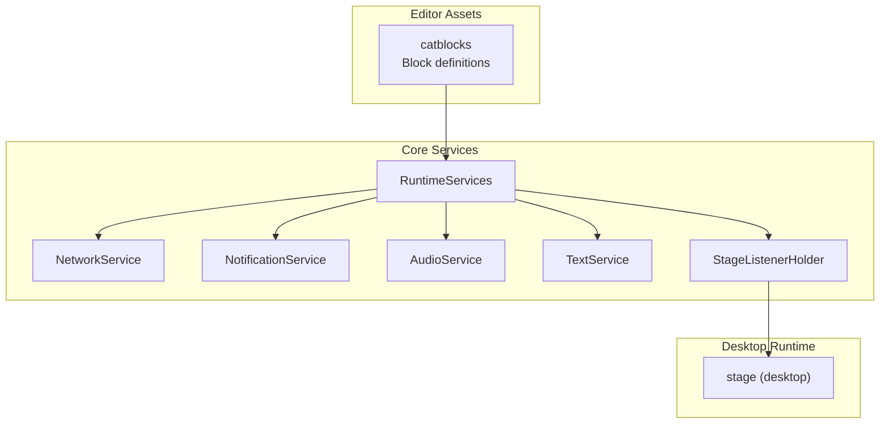
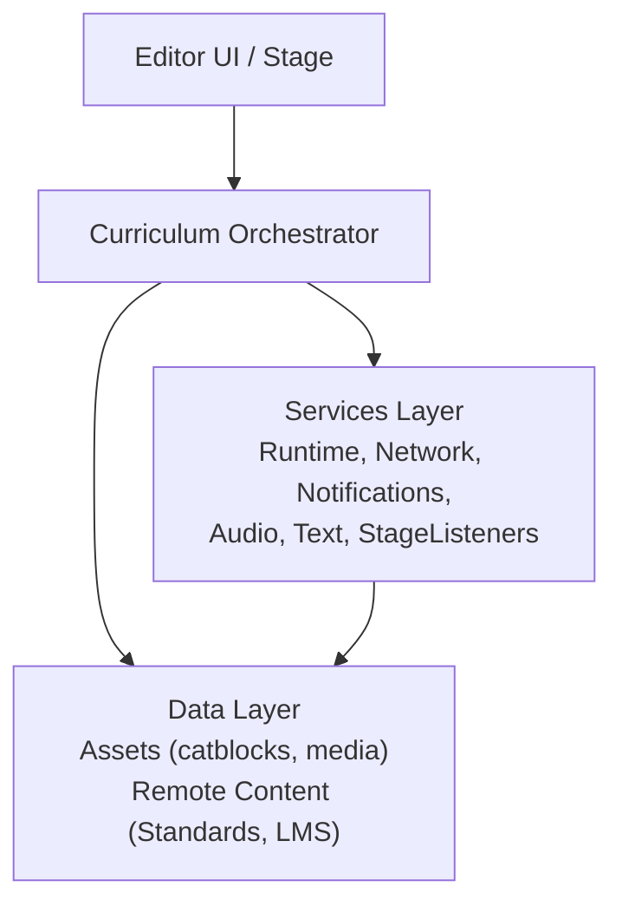
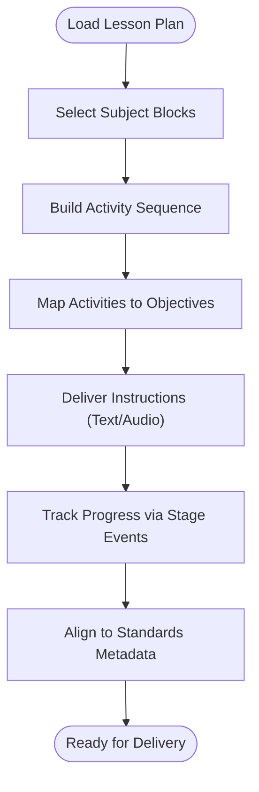
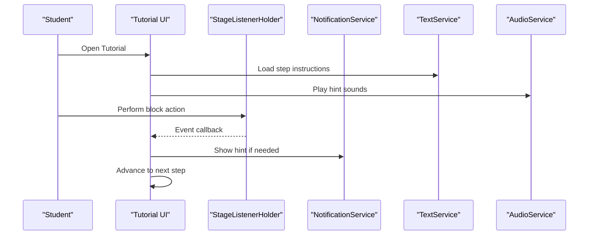
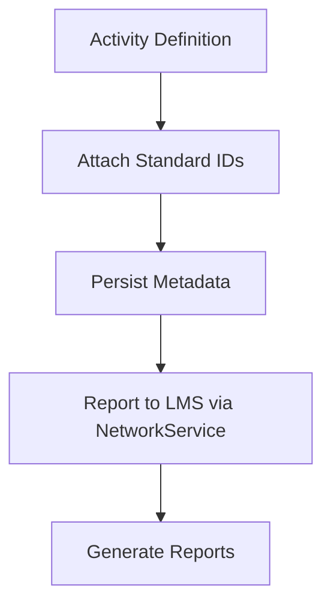
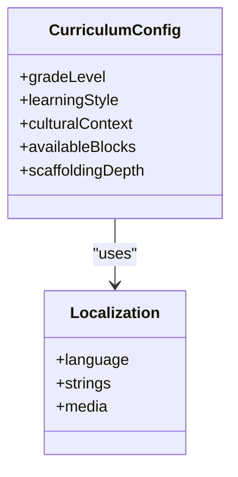
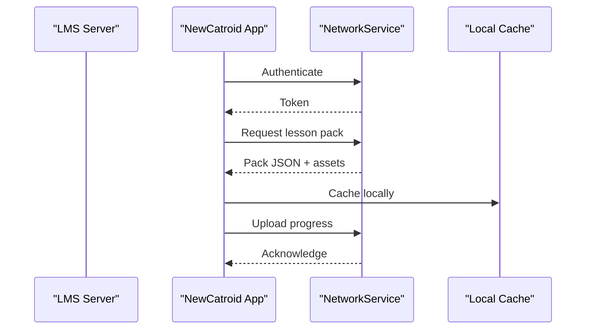
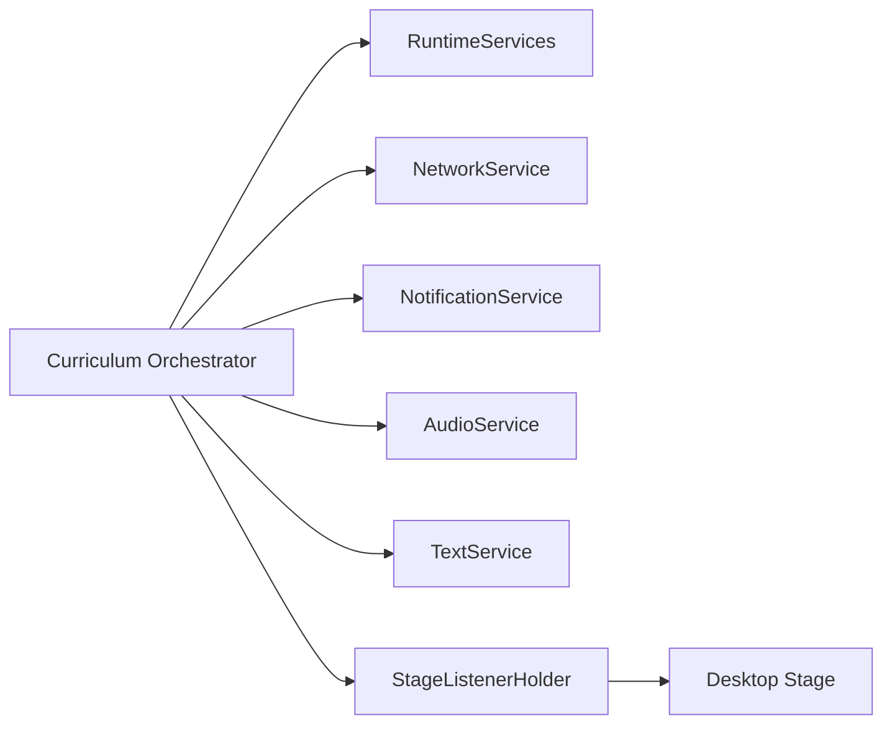

# Curriculum Integration

<cite>
**Referenced Files in This Document**
- [README.md](file://README.md)
- [AGENTS.md](file://AGENTS.md)
- [task.md](file://task.md)
- [catroid/src/main/assets/catblocks](file://catroid/src/main/assets/catblocks)
- [core/src/main/java/org/catrobat/catroid/runtime/RuntimeServices.kt](file://core/src/main/java/org/catrobat/catroid/runtime/RuntimeServices.kt)
- [core/src/main/java/org/catrobat/catroid/network/NetworkService.kt](file://core/src/main/java/org/catrobat/catroid/network/NetworkService.kt)
- [core/src/main/java/org/catrobat/catroid/notification/NotificationService.kt](file://core/src/main/java/org/catrobat/catroid/notification/NotificationService.kt)
- [core/src/main/java/org/catrobat/catroid/audio/AudioService.kt](file://core/src/main/java/org/catrobat/catroid/audio/AudioService.kt)
- [core/src/main/java/org/catrobat/catroid/text/TextService.kt](file://core/src/main/java/org/catrobat/catroid/text/TextService.kt)
- [core/src/main/java/org/catrobat/catroid/stage/StageListenerHolder.kt](file://core/src/main/java/org/catrobat/catroid/stage/StageListenerHolder.kt)
- [desktop-runtime/src/main/java/org/catrobat/catroid/stage](file://desktop-runtime/src/main/java/org/catrobat/catroid/stage)
</cite>

## Table of Contents
1. [Introduction](#introduction)
2. [Project Structure](#project-structure)
3. [Core Components](#core-components)
4. [Architecture Overview](#architecture-overview)
5. [Detailed Component Analysis](#detailed-component-analysis)
6. [Dependency Analysis](#dependency-analysis)
7. [Performance Considerations](#performance-considerations)
8. [Troubleshooting Guide](#troubleshooting-guide)
9. [Conclusion](#conclusion)
10. [Appendices](#appendices)

## Introduction
This document explains how NewCatroid can be used to integrate curriculum into programming lessons. It focuses on:
- Lesson plan templates and subject-specific blocks
- Interactive tutorials, guided exercises, and scaffolded learning experiences
- Standards alignment (e.g., Common Core, CSTA)
- Customization for grade levels, learning styles, and cultural contexts
- Integration with learning management systems (LMS), content authoring tools, and educational technology ecosystems

NewCatroid provides a block-based visual programming environment with extensible services and assets that can be leveraged to build structured, standards-aligned learning activities. The repository includes resources such as block definitions and runtime services that support interactive, step-by-step learning workflows.

## Project Structure
At a high level, the project is organized into modules and directories that separate core runtime logic, platform-specific implementations, and assets used by the editor and runtime. For curriculum integration, the most relevant areas include:
- Block definitions and UI resources under catroid assets
- Runtime services for audio, text, notifications, networking, and stage events
- Desktop runtime stage components for cross-platform behavior

[No sources needed since this diagram shows conceptual workflow, not actual code structure]

**Section sources**
- [README.md](file://README.md)
- [AGENTS.md](file://AGENTS.md)
- [task.md](file://task.md)

## Core Components
The following components are foundational for building curriculum features:

- RuntimeServices: Central access point to platform capabilities used by lessons and tutorials.
- NetworkService: Enables fetching lesson content, standards mappings, or LMS integrations.
- NotificationService: Supports reminders, hints, and progress nudges during guided exercises.
- AudioService: Provides sound feedback for interactions and scaffolding cues.
- TextService: Manages localized strings and dynamic text for instructions and feedback.
- StageListenerHolder: Coordinates stage-level events useful for sequencing tutorial steps.
- catblocks: Contains block definitions that can be extended for subject-specific curricula.

These components collectively enable:
- Step-by-step guided activities
- Dynamic feedback and hints
- Multi-modal instruction (text, audio, visuals)
- Networking for remote content and LMS connectivity

**Section sources**
- [core/src/main/java/org/catrobat/catroid/runtime/RuntimeServices.kt](file://core/src/main/java/org/catrobat/catroid/runtime/RuntimeServices.kt)
- [core/src/main/java/org/catrobat/catroid/network/NetworkService.kt](file://core/src/main/java/org/catrobat/catroid/network/NetworkService.kt)
- [core/src/main/java/org/catrobat/catroid/notification/NotificationService.kt](file://core/src/main/java/org/catrobat/catroid/notification/NotificationService.kt)
- [core/src/main/java/org/catrobat/catroid/audio/AudioService.kt](file://core/src/main/java/org/catrobat/catroid/audio/AudioService.kt)
- [core/src/main/java/org/catrobat/catroid/text/TextService.kt](file://core/src/main/java/org/catrobat/catroid/text/TextService.kt)
- [core/src/main/java/org/catrobat/catroid/stage/StageListenerHolder.kt](file://core/src/main/java/org/catrobat/catroid/stage/StageListenerHolder.kt)
- [catroid/src/main/assets/catblocks](file://catroid/src/main/assets/catblocks)

## Architecture Overview
Curriculum integration in NewCatroid can be modeled as a layered architecture:
- Presentation layer: Editor UI and stage rendering
- Curriculum orchestration: Tutorials, lesson plans, and activity sequences
- Services layer: Runtime, network, notifications, audio, text, and stage listeners
- Data layer: Local assets (blocks, media) and remote content (standards, LMS data)

[No sources needed since this diagram shows conceptual workflow, not actual code structure]

## Detailed Component Analysis

### Lesson Plan Template System
Lesson plans can be composed from:
- Subject-specific blocks: Extend or select from existing block sets to match domain vocabulary (math, science, language arts).
- Activity sequences: Define ordered steps using stage events and service calls.
- Learning objectives mapping: Attach metadata to activities to align with standards.

Implementation guidance:
- Use catblocks to define or constrain available blocks per subject.
- Leverage StageListenerHolder to sequence steps and trigger transitions.
- Use TextService and AudioService to deliver instructions and feedback.
- Persist lesson metadata and objective mappings via local assets or remote endpoints through NetworkService.

[No sources needed since this diagram shows conceptual workflow, not actual code structure]

**Section sources**
- [catroid/src/main/assets/catblocks](file://catroid/src/main/assets/catblocks)
- [core/src/main/java/org/catrobat/catroid/stage/StageListenerHolder.kt](file://core/src/main/java/org/catrobat/catroid/stage/StageListenerHolder.kt)
- [core/src/main/java/org/catrobat/catroid/text/TextService.kt](file://core/src/main/java/org/catrobat/catroid/text/TextService.kt)
- [core/src/main/java/org/catrobat/catroid/audio/AudioService.kt](file://core/src/main/java/org/catrobat/catroid/audio/AudioService.kt)
- [core/src/main/java/org/catrobat/catroid/network/NetworkService.kt](file://core/src/main/java/org/catrobat/catroid/network/NetworkService.kt)

### Interactive Tutorial Creation Tools
Interactive tutorials benefit from:
- Step-by-step programming lessons: Each step corresponds to a block placement or action.
- Guided exercises: Hints and prompts delivered via notifications and text.
- Scaffolded learning: Progressive release of complexity based on learner performance.

Recommended flow:
- Initialize tutorial state and load step definitions.
- Present instructions using TextService and optional AudioService cues.
- Validate student actions against expected outcomes.
- Provide hints via NotificationService when learners struggle.
- Advance to next step upon successful completion.

**Section sources**
- [core/src/main/java/org/catrobat/catroid/stage/StageListenerHolder.kt](file://core/src/main/java/org/catrobat/catroid/stage/StageListenerHolder.kt)
- [core/src/main/java/org/catrobat/catroid/notification/NotificationService.kt](file://core/src/main/java/org/catrobat/catroid/notification/NotificationService.kt)
- [core/src/main/java/org/catrobat/catroid/text/TextService.kt](file://core/src/main/java/org/catrobat/catroid/text/TextService.kt)
- [core/src/main/java/org/catrobat/catroid/audio/AudioService.kt](file://core/src/main/java/org/catrobat/catroid/audio/AudioService.kt)

### Standards Alignment Features
Standards alignment involves:
- Tagging activities with standard identifiers (e.g., CSTA, Common Core).
- Mapping learning objectives to specific standards.
- Reporting aligned outcomes to external systems via NetworkService.

Suggested approach:
- Maintain a standards registry as local assets or remote JSON.
- Associate each lesson/activity with one or more standards.
- Use NetworkService to sync alignments and retrieve updates.

[No sources needed since this diagram shows conceptual workflow, not actual code structure]

**Section sources**
- [core/src/main/java/org/catrobat/catroid/network/NetworkService.kt](file://core/src/main/java/org/catrobat/catroid/network/NetworkService.kt)

### Curriculum Customization Options
Customization supports:
- Grade levels: Adjust block complexity and scaffolding depth.
- Learning styles: Offer visual, auditory, and kinesthetic pathways.
- Cultural contexts: Localize content and examples; adapt scenarios.

Implementation pointers:
- Use TextService for localization and dynamic content.
- Configure block sets per grade via catblocks selection.
- Adapt difficulty by toggling available blocks and hints.

[No sources needed since this diagram shows conceptual workflow, not actual code structure]

**Section sources**
- [core/src/main/java/org/catrobat/catroid/text/TextService.kt](file://core/src/main/java/org/catrobat/catroid/text/TextService.kt)
- [catroid/src/main/assets/catblocks](file://catroid/src/main/assets/catblocks)

### Integration with LMS and EdTech Ecosystems
Integration points:
- Fetch lesson packs and standards mappings remotely.
- Sync learner progress and achievements.
- Embed NewCatroid activities within LMS pages or launch externally.

Key considerations:
- Authentication and secure communication via NetworkService.
- Idempotent uploads and conflict resolution for progress data.
- Fallbacks for offline mode using cached assets.

**Section sources**
- [core/src/main/java/org/catrobat/catroid/network/NetworkService.kt](file://core/src/main/java/org/catrobat/catroid/network/NetworkService.kt)

## Dependency Analysis
The curriculum orchestration depends on several core services. Understanding these relationships helps avoid circular dependencies and ensures proper initialization order.

**Section sources**
- [core/src/main/java/org/catrobat/catroid/runtime/RuntimeServices.kt](file://core/src/main/java/org/catrobat/catroid/runtime/RuntimeServices.kt)
- [core/src/main/java/org/catrobat/catroid/network/NetworkService.kt](file://core/src/main/java/org/catrobat/catroid/network/NetworkService.kt)
- [core/src/main/java/org/catrobat/catroid/notification/NotificationService.kt](file://core/src/main/java/org/catrobat/catroid/notification/NotificationService.kt)
- [core/src/main/java/org/catrobat/catroid/audio/AudioService.kt](file://core/src/main/java/org/catrobat/catroid/audio/AudioService.kt)
- [core/src/main/java/org/catrobat/catroid/text/TextService.kt](file://core/src/main/java/org/catrobat/catroid/text/TextService.kt)
- [core/src/main/java/org/catrobat/catroid/stage/StageListenerHolder.kt](file://core/src/main/java/org/catrobat/catroid/stage/StageListenerHolder.kt)
- [desktop-runtime/src/main/java/org/catrobat/catroid/stage](file://desktop-runtime/src/main/java/org/catrobat/catroid/stage)

## Performance Considerations
- Minimize network calls by caching lesson packs and standards metadata locally.
- Batch progress uploads to reduce overhead.
- Preload instructional media (audio, images) to avoid stutter during tutorials.
- Use efficient event handling in stage listeners to prevent blocking the main thread.
- Limit notification frequency to avoid user fatigue and system overhead.

[No sources needed since this section provides general guidance]

## Troubleshooting Guide
Common issues and resolutions:
- Missing assets: Ensure catblocks and media are packaged correctly and accessible at runtime.
- Network failures: Implement retries and fallbacks; verify authentication tokens.
- Localization problems: Confirm TextService string keys exist for all supported languages.
- Audio playback errors: Check permissions and asset formats; validate device capabilities.
- Stage event conflicts: Review listener registration and unregistration to avoid duplicate callbacks.

**Section sources**
- [core/src/main/java/org/catrobat/catroid/network/NetworkService.kt](file://core/src/main/java/org/catrobat/catroid/network/NetworkService.kt)
- [core/src/main/java/org/catrobat/catroid/text/TextService.kt](file://core/src/main/java/org/catrobat/catroid/text/TextService.kt)
- [core/src/main/java/org/catrobat/catroid/audio/AudioService.kt](file://core/src/main/java/org/catrobat/catroid/audio/AudioService.kt)
- [core/src/main/java/org/catrobat/catroid/stage/StageListenerHolder.kt](file://core/src/main/java/org/catrobat/catroid/stage/StageListenerHolder.kt)

## Conclusion
NewCatroid’s modular services and extensible block system provide a solid foundation for curriculum integration. By composing lesson templates, interactive tutorials, and standards-aligned activities, educators can create engaging, adaptable learning experiences. Leveraging network and local assets enables seamless LMS integration and scalable delivery across diverse classrooms and contexts.

[No sources needed since this section summarizes without analyzing specific files]

## Appendices
- Glossary:
  - LMS: Learning Management System
  - Standards: Educational benchmarks such as Common Core and CSTA
  - Scaffolding: Support structures that gradually fade as learners gain competence
- References:
  - Repository overview and setup details are available in the top-level documentation files.

**Section sources**
- [README.md](file://README.md)
- [AGENTS.md](file://AGENTS.md)
- [task.md](file://task.md)