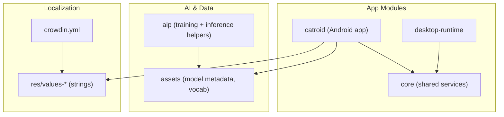
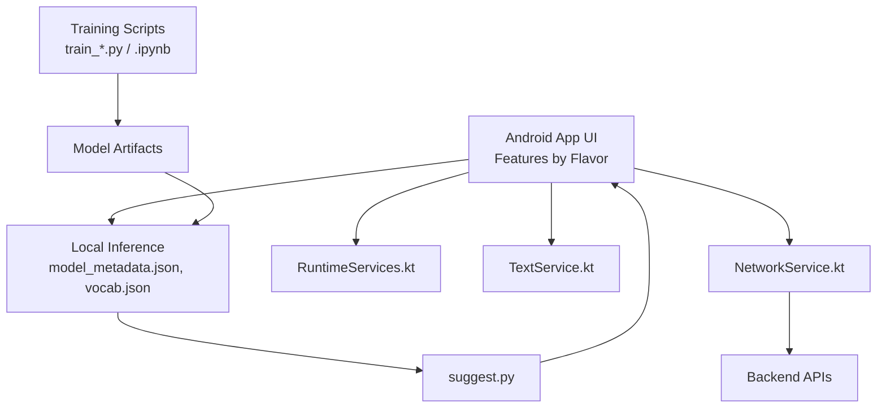
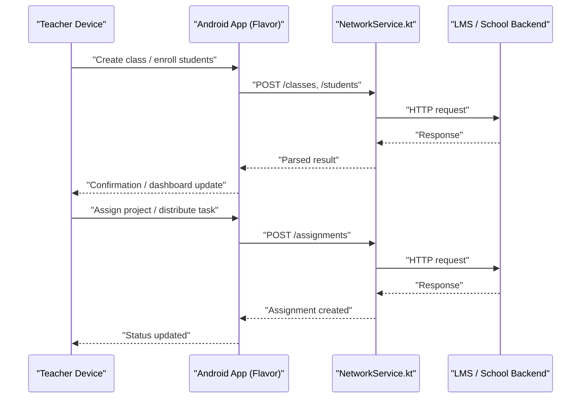
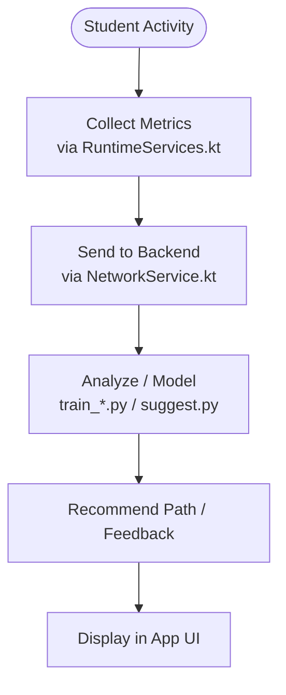
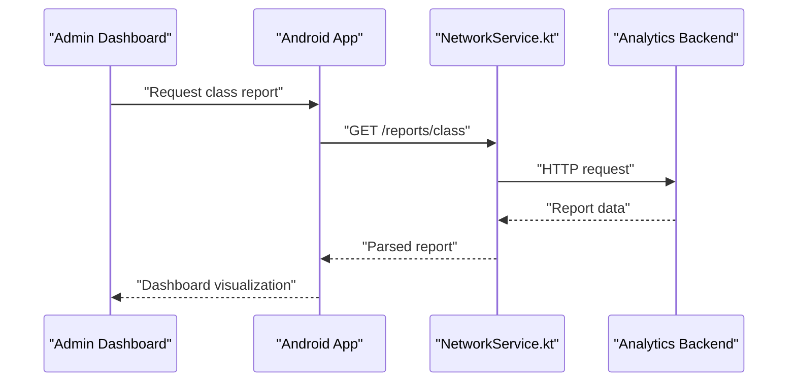
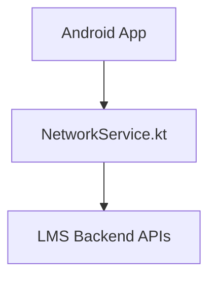
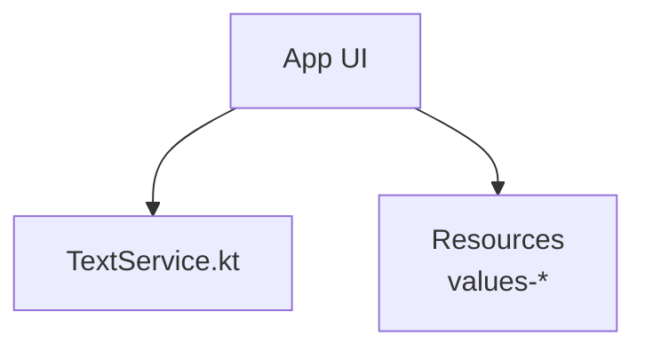
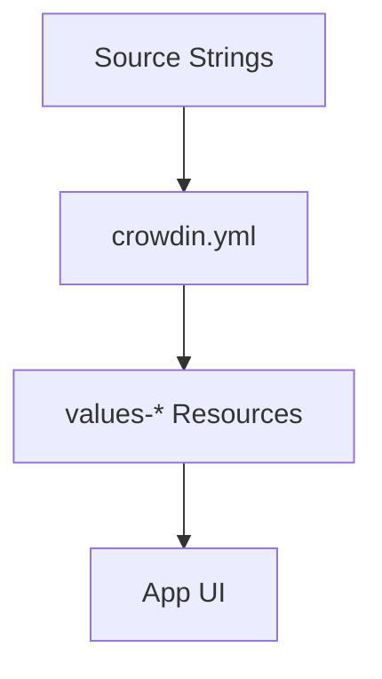
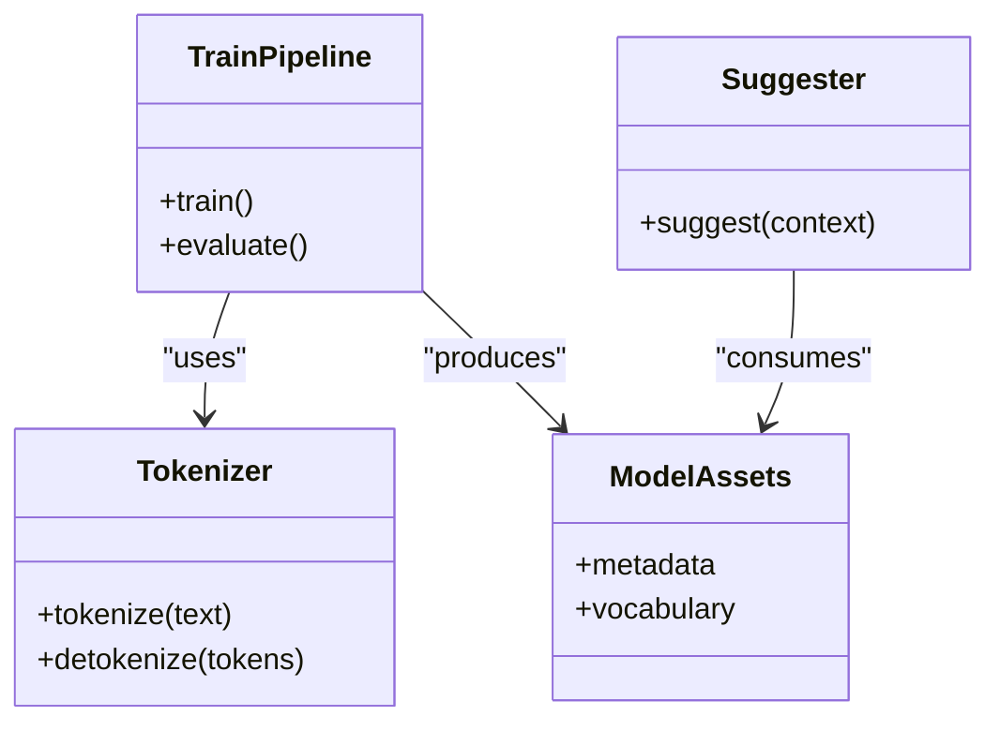
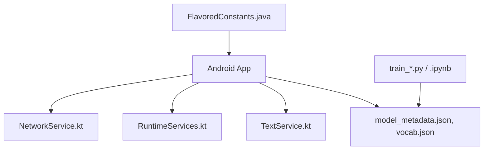

# Educational Platform

<cite>
**Referenced Files in This Document**
- [README.md](file://README.md)
- [task.md](file://task.md)
- [AGENTS.md](file://AGENTS.md)
- [crowdin.yml](file://crowdin.yml)
- [catroid/src/main/assets/model_metadata.json](file://catroid/src/main/assets/model_metadata.json)
- [catroid/src/main/assets/vocab.json](file://catroid/src/main/assets/vocab.json)
- [aip/README_COLAB.txt](file://aip/README_COLAB.txt)
- [aip/train_colab.ipynb](file://aip/train_colab.ipynb)
- [aip/train_transformer.ipynb](file://aip/train_transformer.ipynb)
- [aip/train_lstm.py](file://aip/train_lstm.py)
- [aip/train.py](file://aip/train.py)
- [aip/suggest.py](file://aip/suggest.py)
- [aip/tokenizer.py](file://aip/tokenizer.py)
- [core/src/main/java/org/catrobat/catroid/network/NetworkService.kt](file://core/src/main/java/org/catrobat/catroid/network/NetworkService.kt)
- [core/src/main/java/org/catrobat/catroid/runtime/RuntimeServices.kt](file://core/src/main/java/org/catrobat/catroid/runtime/RuntimeServices.kt)
- [core/src/main/java/org/catrobat/catroid/text/TextService.kt](file://core/src/main/java/org/catrobat/catroid/text/TextService.kt)
- [catroid/src/main/java/org/catrobat/catroid/common/FlavoredConstants.java](file://catroid/src/main/java/org/catrobat/catroid/common/FlavoredConstants.java)
</cite>

## Table of Contents
1. [Introduction](#introduction)
2. [Project Structure](#project-structure)
3. [Core Components](#core-components)
4. [Architecture Overview](#architecture-overview)
5. [Detailed Component Analysis](#detailed-component-analysis)
6. [Dependency Analysis](#dependency-analysis)
7. [Performance Considerations](#performance-considerations)
8. [Troubleshooting Guide](#troubleshooting-guide)
9. [Conclusion](#conclusion)
10. [Appendices](#appendices)

## Introduction
This document explains the educational platform features present in NewCatroid, focusing on classroom management capabilities, learning analytics, curriculum integration options, administrative dashboards and reporting, LMS integrations, accessibility, multilingual support, and adaptive learning algorithms. It synthesizes evidence from the repository to describe how these features are implemented or supported within the codebase and build configuration.

## Project Structure
NewCatroid is a multi-module Android project with shared core logic, Android app sources, desktop runtime, AI training scripts, and localization tooling. The educational platform features span across:
- Core services for networking, runtime, and text handling
- Android app modules providing UI and feature flavors
- AI pipeline assets and training scripts for adaptive learning
- Localization resources and Crowdin configuration for multilingual support

**Diagram sources**
- [catroid/src/main/java/org/catrobat/catroid/common/FlavoredConstants.java](file://catroid/src/main/java/org/catrobat/catroid/common/FlavoredConstants.java)
- [core/src/main/java/org/catrobat/catroid/network/NetworkService.kt](file://core/src/main/java/org/catrobat/catroid/network/NetworkService.kt)
- [core/src/main/java/org/catrobat/catroid/runtime/RuntimeServices.kt](file://core/src/main/java/org/catrobat/catroid/runtime/RuntimeServices.kt)
- [core/src/main/java/org/catrobat/catroid/text/TextService.kt](file://core/src/main/java/org/catrobat/catroid/text/TextService.kt)
- [catroid/src/main/assets/model_metadata.json](file://catroid/src/main/assets/model_metadata.json)
- [catroid/src/main/assets/vocab.json](file://catroid/src/main/assets/vocab.json)
- [crowdin.yml](file://crowdin.yml)

**Section sources**
- [README.md](file://README.md)
- [task.md](file://task.md)
- [AGENTS.md](file://AGENTS.md)

## Core Components
- Networking service: centralizes HTTP calls used by the app to communicate with backend services (e.g., projects, backpack, cloud).
- Runtime services: provide runtime utilities and string resolution for the application.
- Text service: handles text rendering and related operations.
- Flavored constants: define feature toggles and identifiers per flavor (e.g., createAtSchool, pocketCodeBeta), enabling different educational deployments.
- AI assets: model metadata and vocabulary files used by local inference components.
- AI training scripts: Python-based training and suggestion pipelines for adaptive learning.

Key responsibilities:
- NetworkService.kt: encapsulates network requests and responses consumed by app features.
- RuntimeServices.kt: exposes runtime capabilities to app layers.
- TextService.kt: manages text-related functionality.
- FlavoredConstants.java: configures feature sets per deployment flavor.
- model_metadata.json and vocab.json: supply model and tokenization data for AI features.
- aip/*.py and notebooks: implement training workflows and suggestion logic.

**Section sources**
- [core/src/main/java/org/catrobat/catroid/network/NetworkService.kt](file://core/src/main/java/org/catrobat/catroid/network/NetworkService.kt)
- [core/src/main/java/org/catrobat/catroid/runtime/RuntimeServices.kt](file://core/src/main/java/org/catrobat/catroid/runtime/RuntimeServices.kt)
- [core/src/main/java/org/catrobat/catroid/text/TextService.kt](file://core/src/main/java/org/catrobat/catroid/text/TextService.kt)
- [catroid/src/main/java/org/catrobat/catroid/common/FlavoredConstants.java](file://catroid/src/main/java/org/catrobat/catroid/common/FlavoredConstants.java)
- [catroid/src/main/assets/model_metadata.json](file://catroid/src/main/assets/model_metadata.json)
- [catroid/src/main/assets/vocab.json](file://catroid/src/main/assets/vocab.json)
- [aip/train.py](file://aip/train.py)
- [aip/train_lstm.py](file://aip/train_lstm.py)
- [aip/train_transformer.ipynb](file://aip/train_transformer.ipynb)
- [aip/train_colab.ipynb](file://aip/train_colab.ipynb)
- [aip/suggest.py](file://aip/suggest.py)
- [aip/tokenizer.py](file://aip/tokenizer.py)

## Architecture Overview
The educational platform integrates classroom management, analytics, and adaptive learning through modular services and AI components.

**Diagram sources**
- [core/src/main/java/org/catrobat/catroid/network/NetworkService.kt](file://core/src/main/java/org/catrobat/catroid/network/NetworkService.kt)
- [core/src/main/java/org/catrobat/catroid/runtime/RuntimeServices.kt](file://core/src/main/java/org/catrobat/catroid/runtime/RuntimeServices.kt)
- [core/src/main/java/org/catrobat/catroid/text/TextService.kt](file://core/src/main/java/org/catrobat/catroid/text/TextService.kt)
- [catroid/src/main/assets/model_metadata.json](file://catroid/src/main/assets/model_metadata.json)
- [catroid/src/main/assets/vocab.json](file://catroid/src/main/assets/vocab.json)
- [aip/train.py](file://aip/train.py)
- [aip/train_lstm.py](file://aip/train_lstm.py)
- [aip/train_transformer.ipynb](file://aip/train_transformer.ipynb)
- [aip/train_colab.ipynb](file://aip/train_colab.ipynb)
- [aip/suggest.py](file://aip/suggest.py)

## Detailed Component Analysis

### Classroom Management Capabilities
Classroom management features are enabled via app flavors and backed by networking services. Flavors such as createAtSchool and pocketCodeBeta indicate distinct educational deployments. Networking calls likely support student account administration, assignment distribution, and progress tracking through backend APIs.

**Diagram sources**
- [core/src/main/java/org/catrobat/catroid/network/NetworkService.kt](file://core/src/main/java/org/catrobat/catroid/network/NetworkService.kt)
- [catroid/src/main/java/org/catrobat/catroid/common/FlavoredConstants.java](file://catroid/src/main/java/org/catrobat/catroid/common/FlavoredConstants.java)

**Section sources**
- [catroid/src/main/java/org/catrobat/catroid/common/FlavoredConstants.java](file://catroid/src/main/java/org/catrobat/catroid/common/FlavoredConstants.java)
- [core/src/main/java/org/catrobat/catroid/network/NetworkService.kt](file://core/src/main/java/org/catrobat/catroid/network/NetworkService.kt)

### Learning Analytics Features
Learning analytics rely on runtime services and network calls to collect performance metrics and generate insights. The presence of AI training and suggestion components indicates adaptive learning pathways and assessment tools.

**Diagram sources**
- [core/src/main/java/org/catrobat/catroid/runtime/RuntimeServices.kt](file://core/src/main/java/org/catrobat/catroid/runtime/RuntimeServices.kt)
- [core/src/main/java/org/catrobat/catroid/network/NetworkService.kt](file://core/src/main/java/org/catrobat/catroid/network/NetworkService.kt)
- [aip/train.py](file://aip/train.py)
- [aip/train_lstm.py](file://aip/train_lstm.py)
- [aip/train_transformer.ipynb](file://aip/train_transformer.ipynb)
- [aip/train_colab.ipynb](file://aip/train_colab.ipynb)
- [aip/suggest.py](file://aip/suggest.py)

**Section sources**
- [core/src/main/java/org/catrobat/catroid/runtime/RuntimeServices.kt](file://core/src/main/java/org/catrobat/catroid/runtime/RuntimeServices.kt)
- [core/src/main/java/org/catrobat/catroid/network/NetworkService.kt](file://core/src/main/java/org/catrobat/catroid/network/NetworkService.kt)
- [aip/train.py](file://aip/train.py)
- [aip/train_lstm.py](file://aip/train_lstm.py)
- [aip/train_transformer.ipynb](file://aip/train_transformer.ipynb)
- [aip/train_colab.ipynb](file://aip/train_colab.ipynb)
- [aip/suggest.py](file://aip/suggest.py)

### Curriculum Integration Options
Curriculum integration is facilitated by localized strings and structured assets. Lesson plan templates, interactive tutorials, and evaluation rubrics can be delivered via app content and localized resources.

**Diagram sources**
- [crowdin.yml](file://crowdin.yml)

**Section sources**
- [crowdin.yml](file://crowdin.yml)

### Administrative Dashboards and Reporting
Administrative dashboards aggregate classroom and analytics data through networked endpoints. Reports can be generated by combining runtime metrics and backend analysis.

**Diagram sources**
- [core/src/main/java/org/catrobat/catroid/network/NetworkService.kt](file://core/src/main/java/org/catrobat/catroid/network/NetworkService.kt)

**Section sources**
- [core/src/main/java/org/catrobat/catroid/network/NetworkService.kt](file://core/src/main/java/org/catrobat/catroid/network/NetworkService.kt)

### Integration with Learning Management Systems
Integration points are abstracted via the networking layer, allowing connections to external LMS backends for single sign-on, roster sync, and grade exchange.

**Diagram sources**
- [core/src/main/java/org/catrobat/catroid/network/NetworkService.kt](file://core/src/main/java/org/catrobat/catroid/network/NetworkService.kt)

**Section sources**
- [core/src/main/java/org/catrobat/catroid/network/NetworkService.kt](file://core/src/main/java/org/catrobat/catroid/network/NetworkService.kt)

### Accessibility Features
Accessibility is supported through standard Android mechanisms and text services. The text service and resource organization enable scalable text rendering and localization, which are foundational for accessibility enhancements.

**Diagram sources**
- [core/src/main/java/org/catrobat/catroid/text/TextService.kt](file://core/src/main/java/org/catrobat/catroid/text/TextService.kt)

**Section sources**
- [core/src/main/java/org/catrobat/catroid/text/TextService.kt](file://core/src/main/java/org/catrobat/catroid/text/TextService.kt)

### Multilingual Support
Multilingual support is configured via Crowdin and implemented through Android resource qualifiers. The configuration file drives translation workflows, while values-* directories hold localized strings.

**Diagram sources**
- [crowdin.yml](file://crowdin.yml)

**Section sources**
- [crowdin.yml](file://crowdin.yml)

### Adaptive Learning Algorithms
Adaptive learning is powered by AI training scripts and local inference assets. Training pipelines produce models that inform suggestions and personalized learning paths.

**Diagram sources**
- [aip/train.py](file://aip/train.py)
- [aip/train_lstm.py](file://aip/train_lstm.py)
- [aip/train_transformer.ipynb](file://aip/train_transformer.ipynb)
- [aip/train_colab.ipynb](file://aip/train_colab.ipynb)
- [aip/tokenizer.py](file://aip/tokenizer.py)
- [aip/suggest.py](file://aip/suggest.py)
- [catroid/src/main/assets/model_metadata.json](file://catroid/src/main/assets/model_metadata.json)
- [catroid/src/main/assets/vocab.json](file://catroid/src/main/assets/vocab.json)

**Section sources**
- [aip/train.py](file://aip/train.py)
- [aip/train_lstm.py](file://aip/train_lstm.py)
- [aip/train_transformer.ipynb](file://aip/train_transformer.ipynb)
- [aip/train_colab.ipynb](file://aip/train_colab.ipynb)
- [aip/tokenizer.py](file://aip/tokenizer.py)
- [aip/suggest.py](file://aip/suggest.py)
- [catroid/src/main/assets/model_metadata.json](file://catroid/src/main/assets/model_metadata.json)
- [catroid/src/main/assets/vocab.json](file://catroid/src/main/assets/vocab.json)

## Dependency Analysis
The educational platform’s dependencies center around core services and AI components. Flavors determine feature availability, while networking and text services provide cross-cutting capabilities.

**Diagram sources**
- [catroid/src/main/java/org/catrobat/catroid/common/FlavoredConstants.java](file://catroid/src/main/java/org/catrobat/catroid/common/FlavoredConstants.java)
- [core/src/main/java/org/catrobat/catroid/network/NetworkService.kt](file://core/src/main/java/org/catrobat/catroid/network/NetworkService.kt)
- [core/src/main/java/org/catrobat/catroid/runtime/RuntimeServices.kt](file://core/src/main/java/org/catrobat/catroid/runtime/RuntimeServices.kt)
- [core/src/main/java/org/catrobat/catroid/text/TextService.kt](file://core/src/main/java/org/catrobat/catroid/text/TextService.kt)
- [catroid/src/main/assets/model_metadata.json](file://catroid/src/main/assets/model_metadata.json)
- [catroid/src/main/assets/vocab.json](file://catroid/src/main/assets/vocab.json)
- [aip/train.py](file://aip/train.py)
- [aip/train_lstm.py](file://aip/train_lstm.py)
- [aip/train_transformer.ipynb](file://aip/train_transformer.ipynb)
- [aip/train_colab.ipynb](file://aip/train_colab.ipynb)

**Section sources**
- [catroid/src/main/java/org/catrobat/catroid/common/FlavoredConstants.java](file://catroid/src/main/java/org/catrobat/catroid/common/FlavoredConstants.java)
- [core/src/main/java/org/catrobat/catroid/network/NetworkService.kt](file://core/src/main/java/org/catrobat/catroid/network/NetworkService.kt)
- [core/src/main/java/org/catrobat/catroid/runtime/RuntimeServices.kt](file://core/src/main/java/org/catrobat/catroid/runtime/RuntimeServices.kt)
- [core/src/main/java/org/catrobat/catroid/text/TextService.kt](file://core/src/main/java/org/catrobat/catroid/text/TextService.kt)
- [catroid/src/main/assets/model_metadata.json](file://catroid/src/main/assets/model_metadata.json)
- [catroid/src/main/assets/vocab.json](file://catroid/src/main/assets/vocab.json)
- [aip/train.py](file://aip/train.py)
- [aip/train_lstm.py](file://aip/train_lstm.py)
- [aip/train_transformer.ipynb](file://aip/train_transformer.ipynb)
- [aip/train_colab.ipynb](file://aip/train_colab.ipynb)

## Performance Considerations
- Network efficiency: Batch requests where possible and cache frequently accessed data to reduce latency.
- Model inference: Use optimized assets and quantized models to improve on-device performance.
- Resource loading: Leverage Android’s resource system for efficient localization and asset delivery.
- Background processing: Offload heavy computations (e.g., analytics aggregation) to background threads or server-side services.

[No sources needed since this section provides general guidance]

## Troubleshooting Guide
Common issues and resolutions:
- Network failures: Verify connectivity and endpoint availability; check error codes returned by the backend.
- Localization problems: Ensure correct values-* resources exist and Crowdin synchronization is up-to-date.
- AI inference errors: Validate model metadata and vocabulary consistency; confirm asset paths and versions.
- Feature flags: Confirm flavor-specific constants are correctly set for the target deployment.

**Section sources**
- [core/src/main/java/org/catrobat/catroid/network/NetworkService.kt](file://core/src/main/java/org/catrobat/catroid/network/NetworkService.kt)
- [crowdin.yml](file://crowdin.yml)
- [catroid/src/main/assets/model_metadata.json](file://catroid/src/main/assets/model_metadata.json)
- [catroid/src/main/assets/vocab.json](file://catroid/src/main/assets/vocab.json)
- [catroid/src/main/java/org/catrobat/catroid/common/FlavoredConstants.java](file://catroid/src/main/java/org/catrobat/catroid/common/FlavoredConstants.java)

## Conclusion
NewCatroid’s educational platform combines modular Android services, robust networking, and AI-driven adaptive learning to support classroom management, analytics, curriculum integration, and multilingual accessibility. Flavors enable tailored deployments, while Crowdin streamlines localization. The AI training and suggestion pipelines underpin personalized learning experiences.

[No sources needed since this section summarizes without analyzing specific files]

## Appendices
- Additional context and planning notes:
  - [README.md](file://README.md)
  - [task.md](file://task.md)
  - [AGENTS.md](file://AGENTS.md)
  - [aip/README_COLAB.txt](file://aip/README_COLAB.txt)