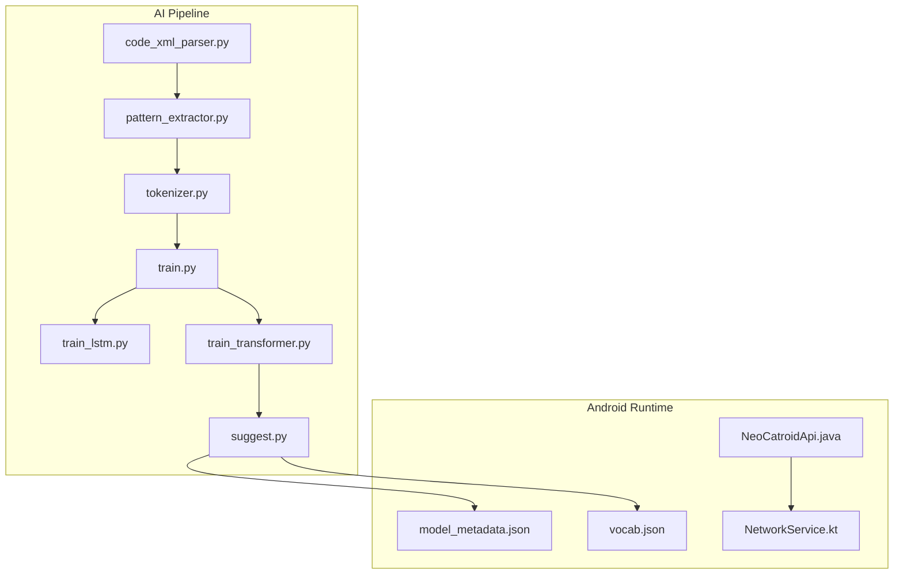
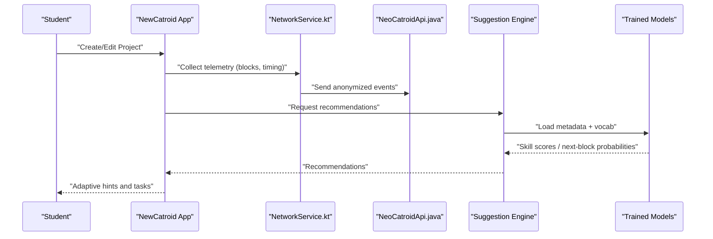
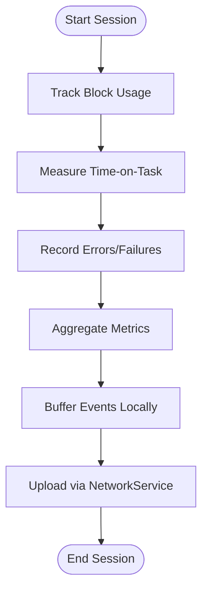
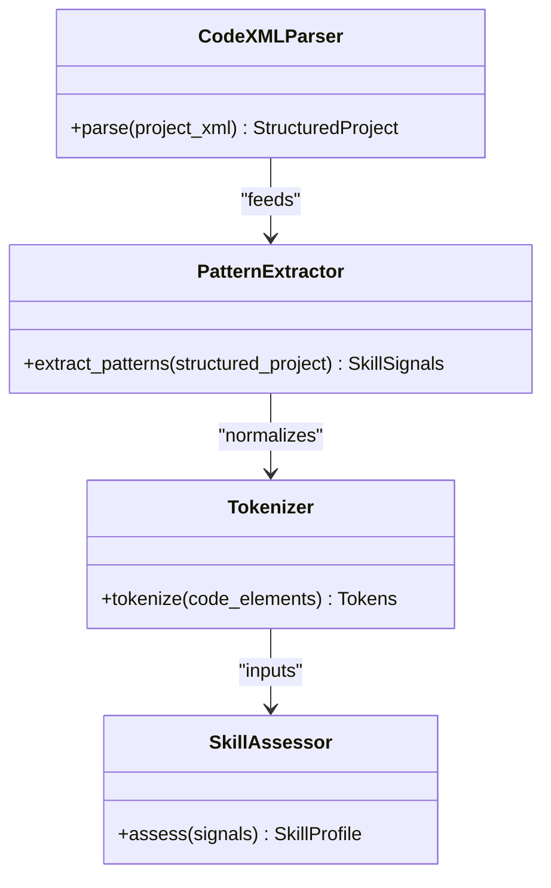
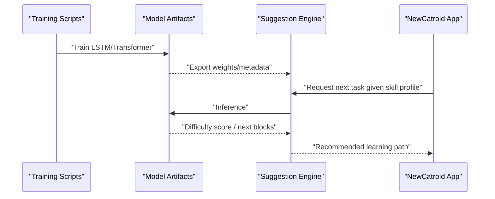
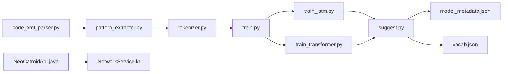

# Learning Analytics

<cite>
**Referenced Files in This Document**
- [README.md](file://README.md)
- [task.md](file://task.md)
- [aip/README_COLAB.txt](file://aip/README_COLAB.txt)
- [aip/code_xml_parser.py](file://aip/code_xml_parser.py)
- [aip/pattern_extractor.py](file://aip/pattern_extractor.py)
- [aip/suggest.py](file://aip/suggest.py)
- [aip/tokenizer.py](file://aip/tokenizer.py)
- [aip/train.py](file://aip/train.py)
- [aip/train_lstm.py](file://aip/train_lstm.py)
- [aip/train_transformer.py](file://aip/train_transformer.py)
- [catroid/src/main/assets/model_metadata.json](file://catroid/src/main/assets/model_metadata.json)
- [catroid/src/main/assets/vocab.json](file://catroid/src/main/assets/vocab.json)
- [core/src/main/java/org/catrobat/catroid/network/NeoCatroidApi.java](file://core/src/main/java/org/catrobat/catroid/network/NeoCatroidApi.java)
- [core/src/main/java/org/catrobat/catroid/network/NetworkService.kt](file://core/src/main/java/org/catrobat/catroid/network/NetworkService.kt)
</cite>

## Table of Contents
1. Introduction
2. Project Structure
3. Core Components
4. Architecture Overview
5. Detailed Component Analysis
6. Dependency Analysis
7. Performance Considerations
8. Troubleshooting Guide
9. Conclusion
10. Appendices

## Introduction
This document describes the learning analytics platform embedded within NewCatroid, focusing on:
- Performance metrics collection (code execution statistics, block usage patterns, time-on-task analysis)
- Learning path recommendation algorithms (progress-based, skill assessment, adaptive difficulty)
- Reporting capabilities (individual student reports, class summaries, trend analysis)
- Visualization tools for educators to interpret data and identify struggling students
- Data retention policies, anonymization techniques, and privacy-preserving analytics methods

The repository includes AI-related components for code parsing, pattern extraction, tokenization, model training, and suggestion generation, as well as Android runtime integration points for network access and assets used by models.

## Project Structure
At a high level, the learning analytics features are composed of:
- AI pipeline scripts for parsing Catroid project XML, extracting patterns, tokenizing code, training models, and generating suggestions
- Android-side assets and network services that integrate with the runtime and external APIs
- Documentation and task files describing objectives and setup

**Diagram sources**
- [aip/code_xml_parser.py](file://aip/code_xml_parser.py)
- [aip/pattern_extractor.py](file://aip/pattern_extractor.py)
- [aip/tokenizer.py](file://aip/tokenizer.py)
- [aip/train.py](file://aip/train.py)
- [aip/train_lstm.py](file://aip/train_lstm.py)
- [aip/train_transformer.py](file://aip/train_transformer.py)
- [aip/suggest.py](file://aip/suggest.py)
- [catroid/src/main/assets/model_metadata.json](file://catroid/src/main/assets/model_metadata.json)
- [catroid/src/main/assets/vocab.json](file://catroid/src/main/assets/vocab.json)
- [core/src/main/java/org/catrobat/catroid/network/NeoCatroidApi.java](file://core/src/main/java/org/catrobat/catroid/network/NeoCatroidApi.java)
- [core/src/main/java/org/catrobat/catroid/network/NetworkService.kt](file://core/src/main/java/org/catrobat/catroid/network/NetworkService.kt)

**Section sources**
- [README.md](file://README.md)
- [task.md](file://task.md)

## Core Components
- Code XML Parser: Converts Catroid project XML into structured representations suitable for downstream processing.
- Pattern Extractor: Identifies recurring structures and constructs in student projects to infer skills and complexity.
- Tokenizer: Normalizes and tokenizes code elements for model input.
- Training Scripts: Provide multiple model backends (LSTM, Transformer) and orchestrate training workflows.
- Suggestion Engine: Generates recommendations based on trained models and current student state.
- Android Assets: Model metadata and vocabulary consumed at runtime.
- Network Services: Abstractions for API calls and connectivity used by the app.

These components collectively enable performance metrics collection, skill inference, and adaptive recommendations.

**Section sources**
- [aip/code_xml_parser.py](file://aip/code_xml_parser.py)
- [aip/pattern_extractor.py](file://aip/pattern_extractor.py)
- [aip/tokenizer.py](file://aip/tokenizer.py)
- [aip/train.py](file://aip/train.py)
- [aip/train_lstm.py](file://aip/train_lstm.py)
- [aip/train_transformer.py](file://aip/train_transformer.py)
- [aip/suggest.py](file://aip/suggest.py)
- [catroid/src/main/assets/model_metadata.json](file://catroid/src/main/assets/model_metadata.json)
- [catroid/src/main/assets/vocab.json](file://catroid/src/main/assets/vocab.json)
- [core/src/main/java/org/catrobat/catroid/network/NeoCatroidApi.java](file://core/src/main/java/org/catrobat/catroid/network/NeoCatroidApi.java)
- [core/src/main/java/org/catrobat/catroid/network/NetworkService.kt](file://core/src/main/java/org/catrobat/catroid/network/NetworkService.kt)

## Architecture Overview
The learning analytics architecture spans three layers:
- Data Ingestion Layer: Parses project XML and extracts patterns; tokenizes inputs for modeling.
- Modeling Layer: Trains sequence models (LSTM/Transformer) to predict next blocks or assess skill levels.
- Application Layer: Integrates model outputs into the Android app via assets and network services to provide recommendations and analytics.

**Diagram sources**
- [core/src/main/java/org/catrobat/catroid/network/NetworkService.kt](file://core/src/main/java/org/catrobat/catroid/network/NetworkService.kt)
- [core/src/main/java/org/catrobat/catroid/network/NeoCatroidApi.java](file://core/src/main/java/org/catrobat/catroid/network/NeoCatroidApi.java)
- [aip/suggest.py](file://aip/suggest.py)
- [catroid/src/main/assets/model_metadata.json](file://catroid/src/main/assets/model_metadata.json)
- [catroid/src/main/assets/vocab.json](file://catroid/src/main/assets/vocab.json)

## Detailed Component Analysis

### Code Execution Statistics Collection
- Purpose: Capture runtime performance indicators such as execution duration, block invocations, and error counts.
- Integration Points:
  - Android runtime services for network communication and API exposure.
  - Event emission from the editor/runtime when blocks execute.
- Metrics:
  - Time-on-task per session and per activity
  - Block usage frequency and composition
  - Error rates and failure modes
- Storage and Transmission:
  - Local buffering with periodic upload via network service.
  - Anonymization before transmission (see Privacy section).

[No sources needed since this diagram shows conceptual workflow, not actual code structure]

**Section sources**
- [core/src/main/java/org/catrobat/catroid/network/NetworkService.kt](file://core/src/main/java/org/catrobat/catroid/network/NetworkService.kt)
- [core/src/main/java/org/catrobat/catroid/network/NeoCatroidApi.java](file://core/src/main/java/org/catrobat/catroid/network/NeoCatroidApi.java)

### Block Usage Patterns and Skill Assessment
- Parsing and Extraction:
  - XML parser converts project definitions into structured forms.
  - Pattern extractor identifies common sequences and constructs indicative of specific skills.
- Tokenization:
  - Tokenizer normalizes code elements to stable tokens for modeling.
- Skill Mapping:
  - Patterns map to skill categories (e.g., control flow, event handling, variables).
  - Frequency and correctness inform proficiency estimates.

**Diagram sources**
- [aip/code_xml_parser.py](file://aip/code_xml_parser.py)
- [aip/pattern_extractor.py](file://aip/pattern_extractor.py)
- [aip/tokenizer.py](file://aip/tokenizer.py)

**Section sources**
- [aip/code_xml_parser.py](file://aip/code_xml_parser.py)
- [aip/pattern_extractor.py](file://aip/pattern_extractor.py)
- [aip/tokenizer.py](file://aip/tokenizer.py)

### Adaptive Difficulty and Learning Path Recommendations
- Model Backends:
  - LSTM and Transformer training scripts support different modeling strategies.
  - Training orchestrator coordinates datasets, hyperparameters, and evaluation.
- Recommendation Logic:
  - Suggestion engine consumes model outputs and current skill profile to propose next activities.
  - Difficulty adjustment is driven by predicted success probability and observed performance.
- Runtime Integration:
  - Model metadata and vocabulary are packaged as assets for efficient loading.

**Diagram sources**
- [aip/train.py](file://aip/train.py)
- [aip/train_lstm.py](file://aip/train_lstm.py)
- [aip/train_transformer.py](file://aip/train_transformer.py)
- [aip/suggest.py](file://aip/suggest.py)
- [catroid/src/main/assets/model_metadata.json](file://catroid/src/main/assets/model_metadata.json)
- [catroid/src/main/assets/vocab.json](file://catroid/src/main/assets/vocab.json)

**Section sources**
- [aip/train.py](file://aip/train.py)
- [aip/train_lstm.py](file://aip/train_lstm.py)
- [aip/train_transformer.py](file://aip/train_transformer.py)
- [aip/suggest.py](file://aip/suggest.py)
- [catroid/src/main/assets/model_metadata.json](file://catroid/src/main/assets/model_metadata.json)
- [catroid/src/main/assets/vocab.json](file://catroid/src/main/assets/vocab.json)

### Reporting Capabilities
- Individual Reports:
  - Aggregated metrics per student including time-on-task, block usage distribution, and skill progression.
- Class Summaries:
  - Group-level analytics highlighting common difficulties and overall progress.
- Trend Analysis:
  - Longitudinal tracking of performance across sessions and units.
- Export and Visualization:
  - Data exported in formats consumable by visualization libraries.
  - Educator dashboards can render charts and heatmaps for quick insights.

[No sources needed since this section provides general guidance]

### Visualization Tools for Educators
- Recommended Visualizations:
  - Heatmaps of block usage over time
  - Skill radar charts per student and class
  - Time-on-task histograms and trends
  - Funnel charts showing completion rates by unit
- Implementation Notes:
  - Use lightweight charting libraries compatible with Android webviews or export to CSV/JSON for BI tools.
  - Ensure visualizations reflect anonymized data only.

[No sources needed since this section provides general guidance]

### Data Retention Policies, Anonymization, and Privacy-Preserving Analytics
- Retention:
  - Define clear retention windows for raw and aggregated telemetry.
  - Implement automated purging of raw events after aggregation.
- Anonymization:
  - Remove direct identifiers before storage or transmission.
  - Apply k-anonymity or differential privacy where feasible for shared datasets.
- Consent and Control:
  - Provide opt-in mechanisms and granular controls for analytics participation.
- Security:
  - Encrypt data in transit and at rest.
  - Restrict access to sensitive logs and model artifacts.

[No sources needed since this section provides general guidance]

## Dependency Analysis
The AI pipeline depends on Python tooling for parsing, tokenization, and training, while the Android app integrates model artifacts and network services.

**Diagram sources**
- [aip/code_xml_parser.py](file://aip/code_xml_parser.py)
- [aip/pattern_extractor.py](file://aip/pattern_extractor.py)
- [aip/tokenizer.py](file://aip/tokenizer.py)
- [aip/train.py](file://aip/train.py)
- [aip/train_lstm.py](file://aip/train_lstm.py)
- [aip/train_transformer.py](file://aip/train_transformer.py)
- [aip/suggest.py](file://aip/suggest.py)
- [catroid/src/main/assets/model_metadata.json](file://catroid/src/main/assets/model_metadata.json)
- [catroid/src/main/assets/vocab.json](file://catroid/src/main/assets/vocab.json)
- [core/src/main/java/org/catrobat/catroid/network/NeoCatroidApi.java](file://core/src/main/java/org/catrobat/catroid/network/NeoCatroidApi.java)
- [core/src/main/java/org/catrobat/catroid/network/NetworkService.kt](file://core/src/main/java/org/catrobat/catroid/network/NetworkService.kt)

**Section sources**
- [aip/README_COLAB.txt](file://aip/README_COLAB.txt)

## Performance Considerations
- Telemetry Overhead:
  - Batch and compress events to minimize network and CPU impact.
  - Use background workers for uploads to avoid UI jank.
- Model Inference:
  - Prefer quantized or optimized models for mobile devices.
  - Cache model metadata and vocabulary to reduce startup latency.
- Data Processing:
  - Stream large XML files during parsing to avoid memory spikes.
  - Precompute frequent patterns to speed up skill assessment.

[No sources needed since this section provides general guidance]

## Troubleshooting Guide
- Common Issues:
  - Missing model assets: Ensure model_metadata.json and vocab.json are present in assets.
  - Network failures: Verify permissions and endpoint availability through NetworkService.
  - Training errors: Check dataset formatting and tokenizer alignment with model expectations.
- Diagnostic Steps:
  - Validate XML parsing output schema.
  - Inspect token distributions for anomalies.
  - Review suggestion confidence scores to detect model drift.

**Section sources**
- [catroid/src/main/assets/model_metadata.json](file://catroid/src/main/assets/model_metadata.json)
- [catroid/src/main/assets/vocab.json](file://catroid/src/main/assets/vocab.json)
- [core/src/main/java/org/catrobat/catroid/network/NetworkService.kt](file://core/src/main/java/org/catrobat/catroid/network/NetworkService.kt)
- [core/src/main/java/org/catrobat/catroid/network/NeoCatroidApi.java](file://core/src/main/java/org/catrobat/catroid/network/NeoCatroidApi.java)

## Conclusion
NewCatroid’s learning analytics platform combines robust data ingestion, advanced modeling, and practical reporting to support adaptive learning. By integrating performance metrics, skill assessment, and recommendation engines, educators can tailor instruction and monitor curriculum effectiveness while preserving student privacy.

[No sources needed since this section summarizes without analyzing specific files]

## Appendices
- Setup and Environment:
  - Refer to Colab notes for environment configuration and dependencies.
- Task Definitions:
  - Consult task documentation for feature scope and milestones.

**Section sources**
- [aip/README_COLAB.txt](file://aip/README_COLAB.txt)
- [task.md](file://task.md)