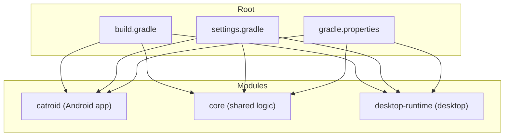
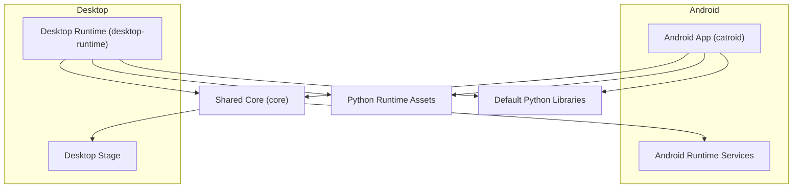
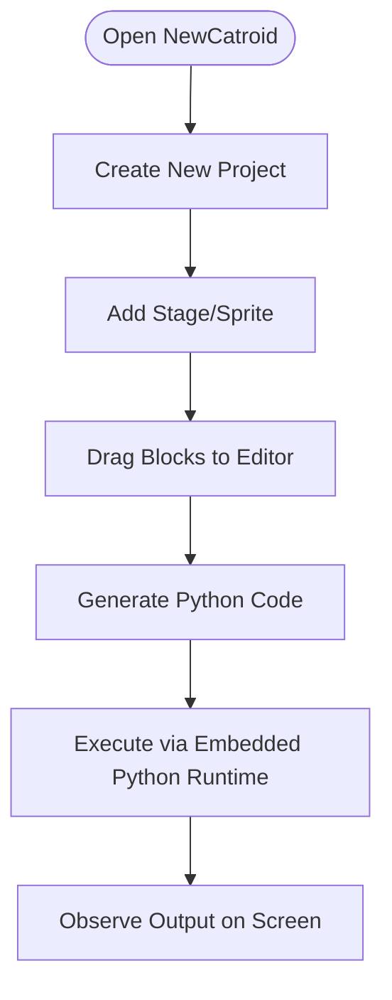
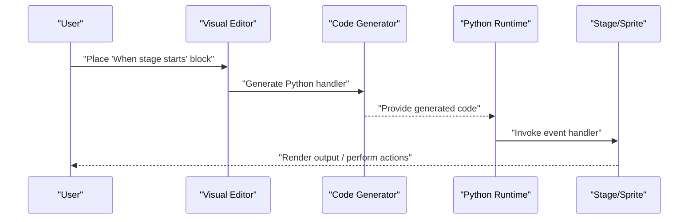
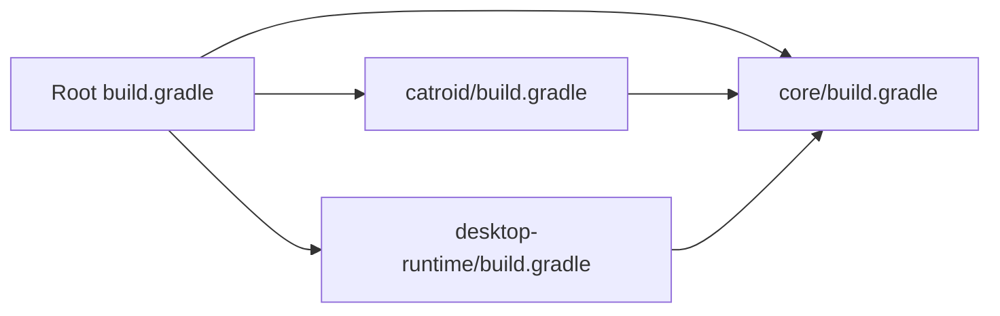

# Getting Started

<cite>
**Referenced Files in This Document**
- [README.md](file://README.md)
- [build.gradle](file://build.gradle)
- [settings.gradle](file://settings.gradle)
- [gradle.properties](file://gradle.properties)
- [catroid/build.gradle](file://catroid/build.gradle)
- [core/src/main/java/org/catrobat/catroid/runtime/RuntimeServices.kt](file://core/src/main/java/org/catrobat/catroid/runtime/RuntimeServices.kt)
- [desktop-runtime/build.gradle](file://desktop-runtime/build.gradle)
- [desktop-runtime/src/main/java/org/catrobat/catroid/stage/DesktopStage.java](file://desktop-runtime/src/main/java/org/catrobat/catroid/stage/DesktopStage.java)
- [catroid/src/main/AndroidManifest.xml](file://catroid/src/main/AndroidManifest.xml)
- [catroid/src/main/assets/python3.12/python3.12.zip](file://catroid/src/main/assets/python3.12/python3.12.zip)
- [catroid/src/main/assets/default_pylibs/](file://catroid/src/main/assets/default_pylibs/)
</cite>

## Table of Contents
1. Introduction
2. Project Structure
3. Core Components
4. Architecture Overview
5. Detailed Component Analysis
6. Dependency Analysis
7. Performance Considerations
8. Troubleshooting Guide
9. Conclusion

## Introduction
NewCatroid is a visual programming platform and game development environment designed for education. It enables learners to create interactive programs using block-based coding, which is then translated into executable code. The project targets Android devices and desktop environments, providing a consistent experience across platforms. Key capabilities include:
- Visual programming interface with drag-and-drop blocks
- Code generation from visual blocks to Python
- Hardware integration support (e.g., Bluetooth testing utilities)
- Multi-platform runtime for Android and desktop

This guide helps you set up the development environment, build the project, run it on different platforms, and start creating your first visual programming project.

## Project Structure
The repository is organized into multiple modules:
- catroid: Android application module containing UI, assets, and Android-specific resources
- core: Shared Kotlin/Java logic used by both Android and desktop runtimes
- desktop-runtime: Desktop-specific runtime and packaging scripts
- Additional tooling and automation under aip, automationScripts, fastlane, gradle, and vncclient

**Diagram sources**
- [build.gradle](file://build.gradle)
- [settings.gradle](file://settings.gradle)
- [gradle.properties](file://gradle.properties)
- [catroid/build.gradle](file://catroid/build.gradle)
- [desktop-runtime/build.gradle](file://desktop-runtime/build.gradle)

**Section sources**
- [build.gradle](file://build.gradle)
- [settings.gradle](file://settings.gradle)
- [gradle.properties](file://gradle.properties)
- [catroid/build.gradle](file://catroid/build.gradle)
- [desktop-runtime/build.gradle](file://desktop-runtime/build.gradle)

## Core Components
- Android App Module (catroid): Contains the main application entry point, UI, resources, and embedded assets such as the Python runtime and default libraries.
- Shared Logic (core): Provides cross-platform services like runtime orchestration, audio/text services, and network helpers.
- Desktop Runtime (desktop-runtime): Wraps shared logic for desktop execution and includes packaging scripts for Windows distribution.

Key implementation references:
- Android manifest and app configuration: [catroid/src/main/AndroidManifest.xml](file://catroid/src/main/AndroidManifest.xml)
- Shared runtime services: [core/src/main/java/org/catrobat/catroid/runtime/RuntimeServices.kt](file://core/src/main/java/org/catrobat/catroid/runtime/RuntimeServices.kt)
- Desktop stage entrypoint: [desktop-runtime/src/main/java/org/catrobat/catroid/stage/DesktopStage.java](file://desktop-runtime/src/main/java/org/catrobat/catroid/stage/DesktopStage.java)
- Embedded Python runtime and default libraries: 
  - [catroid/src/main/assets/python3.12/python3.12.zip](file://catroid/src/main/assets/python3.12/python3.12.zip)
  - [catroid/src/main/assets/default_pylibs/](file://catroid/src/main/assets/default_pylibs/)

**Section sources**
- [catroid/src/main/AndroidManifest.xml](file://catroid/src/main/AndroidManifest.xml)
- [core/src/main/java/org/catrobat/catroid/runtime/RuntimeServices.kt](file://core/src/main/java/org/catrobat/catroid/runtime/RuntimeServices.kt)
- [desktop-runtime/src/main/java/org/catrobat/catroid/stage/DesktopStage.java](file://desktop-runtime/src/main/java/org/catrobat/catroid/stage/DesktopStage.java)
- [catroid/src/main/assets/python3.12/python3.12.zip](file://catroid/src/main/assets/python3.12/python3.12.zip)
- [catroid/src/main/assets/default_pylibs/](file://catroid/src/main/assets/default_pylibs/)

## Architecture Overview
High-level architecture overview showing how the Android app and desktop runtime share common logic and integrate with the Python runtime.

**Diagram sources**
- [catroid/build.gradle](file://catroid/build.gradle)
- [desktop-runtime/build.gradle](file://desktop-runtime/build.gradle)
- [core/src/main/java/org/catrobat/catroid/runtime/RuntimeServices.kt](file://core/src/main/java/org/catrobat/catroid/runtime/RuntimeServices.kt)
- [desktop-runtime/src/main/java/org/catrobat/catroid/stage/DesktopStage.java](file://desktop-runtime/src/main/java/org/catrobat/catroid/stage/DesktopStage.java)
- [catroid/src/main/assets/python3.12/python3.12.zip](file://catroid/src/main/assets/python3.12/python3.12.zip)
- [catroid/src/main/assets/default_pylibs/](file://catroid/src/main/assets/default_pylibs/)

## Detailed Component Analysis

### Build System and Prerequisites
- Gradle Wrapper: Use the provided wrapper script to ensure consistent builds.
- Root build configuration: Centralized dependencies and tasks are defined at the root level.
- Settings and properties: Module inclusion and global Gradle properties are configured centrally.

Recommended prerequisites:
- Android Studio with Android SDK and NDK installed
- Java Development Kit compatible with the project’s Gradle settings
- Sufficient disk space for embedded Python assets and build outputs

Build steps:
- Open the project in Android Studio or use the command line via the Gradle wrapper.
- Sync Gradle files and resolve dependencies.
- Select an appropriate build variant (e.g., debug) and run or assemble.

References:
- [build.gradle](file://build.gradle)
- [settings.gradle](file://settings.gradle)
- [gradle.properties](file://gradle.properties)
- [catroid/build.gradle](file://catroid/build.gradle)
- [desktop-runtime/build.gradle](file://desktop-runtime/build.gradle)

**Section sources**
- [build.gradle](file://build.gradle)
- [settings.gradle](file://settings.gradle)
- [gradle.properties](file://gradle.properties)
- [catroid/build.gradle](file://catroid/build.gradle)
- [desktop-runtime/build.gradle](file://desktop-runtime/build.gradle)

### Running on Android
- Ensure an Android device or emulator is connected and recognized by adb.
- In Android Studio, select the catroid module and run the default configuration.
- Alternatively, assemble a debug APK and install it manually.

Key references:
- [catroid/src/main/AndroidManifest.xml](file://catroid/src/main/AndroidManifest.xml)
- [catroid/build.gradle](file://catroid/build.gradle)

**Section sources**
- [catroid/src/main/AndroidManifest.xml](file://catroid/src/main/AndroidManifest.xml)
- [catroid/build.gradle](file://catroid/build.gradle)

### Running on Desktop
- The desktop-runtime module provides a desktop entrypoint and packaging scripts.
- Use the provided Gradle task or scripts to build and launch the desktop version.

Key references:
- [desktop-runtime/build.gradle](file://desktop-runtime/build.gradle)
- [desktop-runtime/src/main/java/org/catrobat/catroid/stage/DesktopStage.java](file://desktop-runtime/src/main/java/org/catrobat/catroid/stage/DesktopStage.java)

**Section sources**
- [desktop-runtime/build.gradle](file://desktop-runtime/build.gradle)
- [desktop-runtime/src/main/java/org/catrobat/catroid/stage/DesktopStage.java](file://desktop-runtime/src/main/java/org/catrobat/catroid/stage/DesktopStage.java)

### Creating Your First Visual Programming Project
- Launch the app on your target platform (Android or desktop).
- Create a new project and add stages and sprites.
- Drag blocks from the palette onto the editor canvas to define behavior.
- Run the project to see the generated Python code execute within the embedded runtime.

Conceptual flow:

[No sources needed since this diagram shows conceptual workflow, not actual code structure]

### Relationship Between Visual Blocks and Generated Python Code
- Visual blocks represent program constructs that map to Python statements.
- The runtime executes the generated Python code using the embedded Python 3.12 assets and default libraries.

References:
- [catroid/src/main/assets/python3.12/python3.12.zip](file://catroid/src/main/assets/python3.12/python3.12.zip)
- [catroid/src/main/assets/default_pylibs/](file://catroid/src/main/assets/default_pylibs/)

**Section sources**
- [catroid/src/main/assets/python3.12/python3.12.zip](file://catroid/src/main/assets/python3.12/python3.12.zip)
- [catroid/src/main/assets/default_pylibs/](file://catroid/src/main/assets/default_pylibs/)

### Event-Driven Architecture Basics
- Programs respond to events (e.g., when stage starts, when sprite touched).
- Blocks are grouped into event handlers that trigger sequences of actions.
- The runtime listens for events and invokes corresponding generated code.

Conceptual sequence:

[No sources needed since this diagram shows conceptual workflow, not actual code structure]

## Dependency Analysis
Module relationships and shared dependencies:

**Diagram sources**
- [build.gradle](file://build.gradle)
- [catroid/build.gradle](file://catroid/build.gradle)
- [desktop-runtime/build.gradle](file://desktop-runtime/build.gradle)

**Section sources**
- [build.gradle](file://build.gradle)
- [catroid/build.gradle](file://catroid/build.gradle)
- [desktop-runtime/build.gradle](file://desktop-runtime/build.gradle)

## Performance Considerations
- Prefer running on physical devices for accurate performance evaluation.
- Avoid excessive asset sizes; keep sprites and sounds optimized.
- Minimize heavy operations in event handlers; offload work where possible.
- Use release builds for final performance measurements.

[No sources needed since this section provides general guidance]

## Troubleshooting Guide
Common setup issues and resolutions:
- Gradle sync failures:
  - Verify internet connectivity and proxy settings if required.
  - Invalidate caches and rebuild in Android Studio.
- Missing Android SDK components:
  - Install required SDK platforms and build tools via Android Studio SDK Manager.
- Emulator not detected:
  - Enable USB debugging on device or ensure emulator is started and visible.
- Desktop runtime launch issues:
  - Confirm Java installation matches project requirements.
  - Re-run packaging scripts and check logs for errors.

References:
- [README.md](file://README.md)
- [gradle.properties](file://gradle.properties)
- [catroid/build.gradle](file://catroid/build.gradle)
- [desktop-runtime/build.gradle](file://desktop-runtime/build.gradle)

**Section sources**
- [README.md](file://README.md)
- [gradle.properties](file://gradle.properties)
- [catroid/build.gradle](file://catroid/build.gradle)
- [desktop-runtime/build.gradle](file://desktop-runtime/build.gradle)

## Conclusion
You now have the essentials to set up, build, and run NewCatroid on Android and desktop platforms. Start experimenting with visual blocks, observe how they translate to Python, and iterate quickly by running your projects. As you grow more comfortable, explore hardware integration features and contribute to the open-source ecosystem.

[No sources needed since this section summarizes without analyzing specific files]