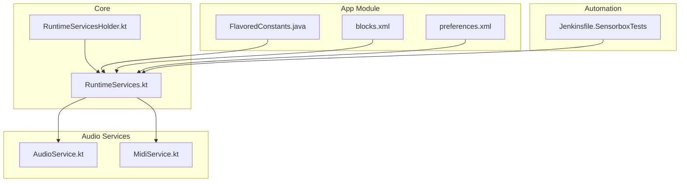
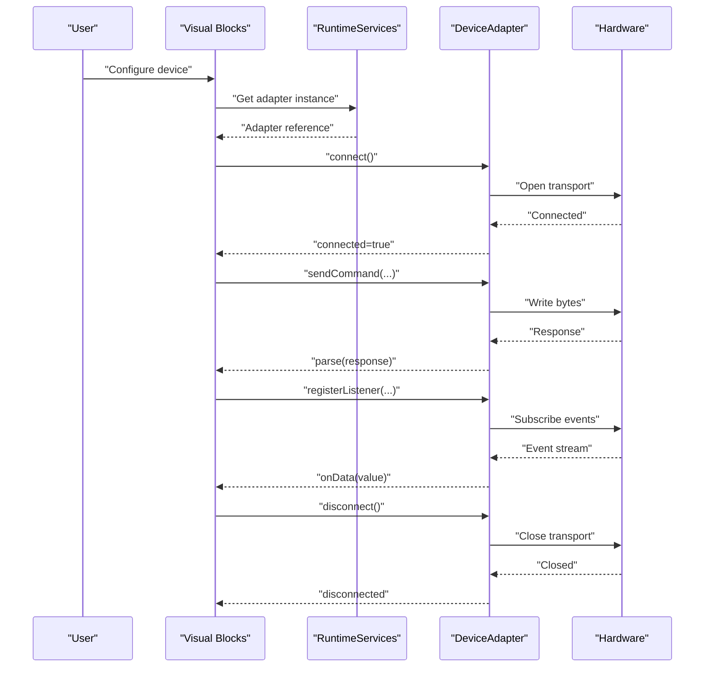
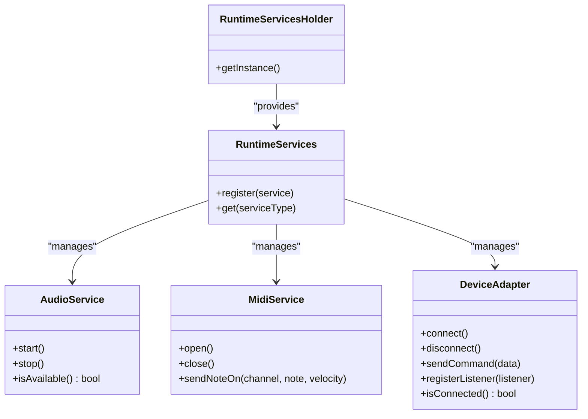
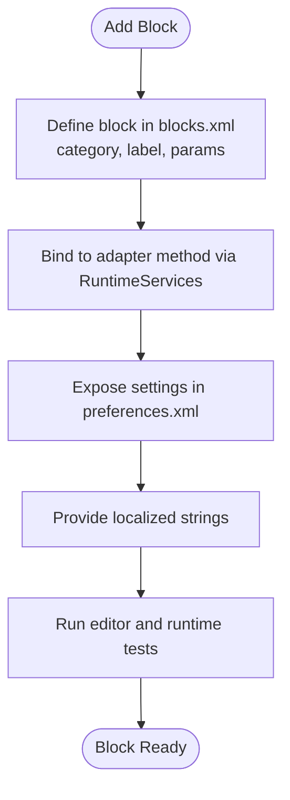
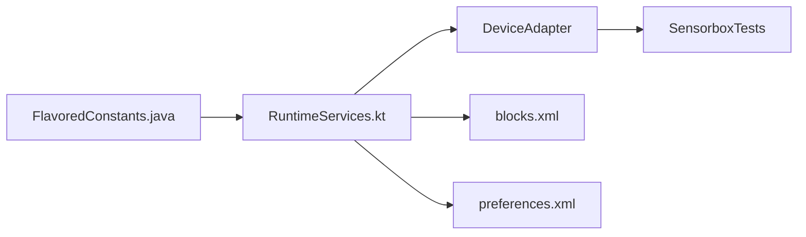

# Custom Device Development

<cite>
**Referenced Files in This Document**
- [README.md](file://README.md)
- [catroid/src/main/java/org/catrobat/catroid/common/FlavoredConstants.java](file://catroid/src/main/java/org/catrobat/catroid/common/FlavoredConstants.java)
- [core/src/main/java/org/catrobat/catroid/runtime/RuntimeServices.kt](file://core/src/main/java/org/catrobat/catroid/runtime/RuntimeServices.kt)
- [core/src/main/java/org/catrobat/catroid/runtime/RuntimeServicesHolder.kt](file://core/src/main/java/org/catrobat/catroid/runtime/RuntimeServicesHolder.kt)
- [core/src/main/java/org/catrobat/catroid/audio/AudioService.kt](file://core/src/main/java/org/catrobat/catroid/audio/AudioService.kt)
- [core/src/main/java/org/catrobat/catroid/audio/MidiService.kt](file://core/src/main/java/org/catrobat/catroid/audio/MidiService.kt)
- [catroid/src/main/assets/catblocks/blocks.xml](file://catroid/src/main/assets/catblocks/blocks.xml)
- [catroid/src/main/res/xml/preferences.xml](file://catroid/src/main/res/xml/preferences.xml)
- [Jenkinsfile.SensorboxTests](file://Jenkinsfile.SensorboxTests)
</cite>

## Table of Contents
1. Introduction
2. Project Structure
3. Core Components
4. Architecture Overview
5. Detailed Component Analysis
6. Dependency Analysis
7. Performance Considerations
8. Troubleshooting Guide
9. Conclusion
10. Appendices

## Introduction
This document explains how to develop custom device integrations for NewCatroid, focusing on the plugin architecture and extension points that enable third-party hardware support. It covers:
- The device adapter interface requirements (connection management, command protocol definition, data model mapping)
- How to create blocks to expose device functionality through visual programming
- Examples for sensors, actuators, and communication protocols
- Testing, debugging, and performance optimization guidelines
- Packaging and distribution of custom device plugins

The guidance is grounded in the repository’s structure and existing service patterns used by audio and MIDI subsystems, which serve as reference implementations for extensibility.

## Project Structure
NewCatroid organizes platform-specific features and services across modules. For device integration, key areas include:
- Runtime services and holders for lifecycle and discovery
- Feature flavors via FlavoredConstants to toggle capabilities at build time
- Block definitions under assets/catblocks for visual programming exposure
- Preferences XML for configuration UI
- Test automation scripts for sensor-related flows

**Diagram sources**
- [core/src/main/java/org/catrobat/catroid/runtime/RuntimeServices.kt](file://core/src/main/java/org/catrobat/catroid/runtime/RuntimeServices.kt)
- [core/src/main/java/org/catrobat/catroid/runtime/RuntimeServicesHolder.kt](file://core/src/main/java/org/catrobat/catroid/runtime/RuntimeServicesHolder.kt)
- [core/src/main/java/org/catrobat/catroid/audio/AudioService.kt](file://core/src/main/java/org/catrobat/catroid/audio/AudioService.kt)
- [core/src/main/java/org/catrobat/catroid/audio/MidiService.kt](file://core/src/main/java/org/catrobat/catroid/audio/MidiService.kt)
- [catroid/src/main/java/org/catrobat/catroid/common/FlavoredConstants.java](file://catroid/src/main/java/org/catrobat/catroid/common/FlavoredConstants.java)
- [catroid/src/main/assets/catblocks/blocks.xml](file://catroid/src/main/assets/catblocks/blocks.xml)
- [catroid/src/main/res/xml/preferences.xml](file://catroid/src/main/res/xml/preferences.xml)
- [Jenkinsfile.SensorboxTests](file://Jenkinsfile.SensorboxTests)

**Section sources**
- [README.md](file://README.md)
- [catroid/src/main/java/org/catrobat/catroid/common/FlavoredConstants.java](file://catroid/src/main/java/org/catrobat/catroid/common/FlavoredConstants.java)
- [core/src/main/java/org/catrobat/catroid/runtime/RuntimeServices.kt](file://core/src/main/java/org/catrobat/catroid/runtime/RuntimeServices.kt)
- [core/src/main/java/org/catrobat/catroid/runtime/RuntimeServicesHolder.kt](file://core/src/main/java/org/catrobat/catroid/runtime/RuntimeServicesHolder.kt)
- [core/src/main/java/org/catrobat/catroid/audio/AudioService.kt](file://core/src/main/java/org/catrobat/catroid/audio/AudioService.kt)
- [core/src/main/java/org/catrobat/catroid/audio/MidiService.kt](file://core/src/main/java/org/catrobat/catroid/audio/MidiService.kt)
- [catroid/src/main/assets/catblocks/blocks.xml](file://catroid/src/main/assets/catblocks/blocks.xml)
- [catroid/src/main/res/xml/preferences.xml](file://catroid/src/main/res/xml/preferences.xml)
- [Jenkinsfile.SensorboxTests](file://Jenkinsfile.SensorboxTests)

## Core Components
- RuntimeServices and RuntimeServicesHolder provide a central place to register and access services during app runtime. They are the recommended entry points for integrating device adapters.
- AudioService and MidiService demonstrate how to implement a long-lived service with connection lifecycle, event handling, and state management. These can be used as templates for new device adapters.
- FlavoredConstants allows toggling feature availability per build flavor, enabling optional device support without changing core logic.
- blocks.xml defines the visual programming blocks exposed to users; adding device blocks here integrates your adapter into the editor.
- preferences.xml provides a standard location for device configuration screens.
- Jenkinsfile.SensorboxTests shows how automated tests can exercise sensor-related flows.

**Section sources**
- [core/src/main/java/org/catrobat/catroid/runtime/RuntimeServices.kt](file://core/src/main/java/org/catrobat/catroid/runtime/RuntimeServices.kt)
- [core/src/main/java/org/catrobat/catroid/runtime/RuntimeServicesHolder.kt](file://core/src/main/java/org/catrobat/catroid/runtime/RuntimeServicesHolder.kt)
- [core/src/main/java/org/catrobat/catroid/audio/AudioService.kt](file://core/src/main/java/org/catrobat/catroid/audio/AudioService.kt)
- [core/src/main/java/org/catrobat/catroid/audio/MidiService.kt](file://core/src/main/java/org/catrobat/catroid/audio/MidiService.kt)
- [catroid/src/main/java/org/catrobat/catroid/common/FlavoredConstants.java](file://catroid/src/main/java/org/catrobat/catroid/common/FlavoredConstants.java)
- [catroid/src/main/assets/catblocks/blocks.xml](file://catroid/src/main/assets/catblocks/blocks.xml)
- [catroid/src/main/res/xml/preferences.xml](file://catroid/src/main/res/xml/preferences.xml)
- [Jenkinsfile.SensorboxTests](file://Jenkinsfile.SensorboxTests)

## Architecture Overview
The device integration follows a service-oriented pattern:
- A device adapter implements a well-defined interface and manages its own connection lifecycle.
- RuntimeServices registers the adapter and exposes it to the rest of the application.
- Visual blocks call into the adapter via RuntimeServices.
- Configuration is provided through preferences.
- Tests validate connectivity and behavior.

[No diagram sources since this diagram illustrates conceptual flow]

## Detailed Component Analysis

### Device Adapter Interface Requirements
Implement a device adapter that encapsulates:
- Connection management: connect(), disconnect(), isConnected()
- Command protocol: sendCommand(payload), parseResponse(raw)
- Data model mapping: convert raw bytes to typed values and vice versa
- Event streaming: register listeners for asynchronous updates
- Lifecycle safety: handle reconnection, timeouts, and resource cleanup

Use AudioService or MidiService as implementation references for threading, error propagation, and state transitions.

**Section sources**
- [core/src/main/java/org/catrobat/catroid/audio/AudioService.kt](file://core/src/main/java/org/catrobat/catroid/audio/AudioService.kt)
- [core/src/main/java/org/catrobat/catroid/audio/MidiService.kt](file://core/src/main/java/org/catrobat/catroid/audio/MidiService.kt)

#### Class Diagram: Service Pattern Reference

**Diagram sources**
- [core/src/main/java/org/catrobat/catroid/runtime/RuntimeServices.kt](file://core/src/main/java/org/catrobat/catroid/runtime/RuntimeServices.kt)
- [core/src/main/java/org/catrobat/catroid/runtime/RuntimeServicesHolder.kt](file://core/src/main/java/org/catrobat/catroid/runtime/RuntimeServicesHolder.kt)
- [core/src/main/java/org/catrobat/catroid/audio/AudioService.kt](file://core/src/main/java/org/catrobat/catroid/audio/AudioService.kt)
- [core/src/main/java/org/catrobat/catroid/audio/MidiService.kt](file://core/src/main/java/org/catrobat/catroid/audio/MidiService.kt)

### Connection Management
- Establish connections asynchronously and report status via callbacks or observable streams.
- Implement robust reconnection with exponential backoff and jitter.
- Ensure thread-safety for concurrent reads/writes.
- Release all resources on disconnect to prevent leaks.

Reference implementations show how to manage background threads and event loops safely.

**Section sources**
- [core/src/main/java/org/catrobat/catroid/audio/AudioService.kt](file://core/src/main/java/org/catrobat/catroid/audio/AudioService.kt)
- [core/src/main/java/org/catrobat/catroid/audio/MidiService.kt](file://core/src/main/java/org/catrobat/catroid/audio/MidiService.kt)

### Command Protocol Definition
Define a clear, versioned protocol:
- Frame format: header, length, payload, checksum
- Commands: request/response pairs with unique IDs
- Events: push notifications from device to host
- Error codes: standardized failure semantics

Provide serializers/deserializers for each message type and ensure idempotency where applicable.

[No sources needed since this section describes general protocol design]

### Data Model Mapping
Map raw payloads to domain models:
- Validate ranges and units
- Normalize timestamps and coordinate systems
- Expose typed getters/setters for block parameters
- Provide conversion utilities for common transformations

[No sources needed since this section describes general modeling practices]

### Block Creation Process
To expose device functionality to users:
- Add entries in blocks.xml defining categories, labels, parameters, and return types
- Link blocks to adapter methods via RuntimeServices
- Use preferences.xml to surface configuration options
- Ensure localization strings are available

**Diagram sources**
- [catroid/src/main/assets/catblocks/blocks.xml](file://catroid/src/main/assets/catblocks/blocks.xml)
- [catroid/src/main/res/xml/preferences.xml](file://catroid/src/main/res/xml/preferences.xml)
- [core/src/main/java/org/catrobat/catroid/runtime/RuntimeServices.kt](file://core/src/main/java/org/catrobat/catroid/runtime/RuntimeServices.kt)

**Section sources**
- [catroid/src/main/assets/catblocks/blocks.xml](file://catroid/src/main/assets/catblocks/blocks.xml)
- [catroid/src/main/res/xml/preferences.xml](file://catroid/src/main/res/xml/preferences.xml)
- [core/src/main/java/org/catrobat/catroid/runtime/RuntimeServices.kt](file://core/src/main/java/org/catrobat/catroid/runtime/RuntimeServices.kt)

### Example: Custom Sensor Integration
Steps:
- Implement a sensor adapter with periodic polling or event-driven updates
- Register the adapter in RuntimeServices
- Create blocks for reading sensor values and configuring sampling rate
- Map raw ADC/I2C/SPI frames to calibrated physical units
- Add a preference screen for calibration constants

[No sources needed since this section provides conceptual guidance]

### Example: Custom Actuator Integration
Steps:
- Implement an actuator adapter with safe power control and state checks
- Expose blocks for setting PWM, GPIO states, or motor speeds
- Include safety interlocks and maximum duty cycle limits
- Provide feedback blocks for current state and errors

[No sources needed since this section provides conceptual guidance]

### Example: Communication Protocol Implementation
Steps:
- Choose transport (UART, BLE, TCP/UDP, USB HID)
- Implement framing, checksums, and retries
- Handle partial reads and fragmentation
- Provide a test harness to simulate device responses

[No sources needed since this section provides conceptual guidance]

## Dependency Analysis
Device adapters depend on:
- RuntimeServices for registration and discovery
- Optional flavor flags via FlavoredConstants to enable/disable features
- Block definitions for user-facing API
- Preferences for configuration
- Automated tests for validation

**Diagram sources**
- [catroid/src/main/java/org/catrobat/catroid/common/FlavoredConstants.java](file://catroid/src/main/java/org/catrobat/catroid/common/FlavoredConstants.java)
- [core/src/main/java/org/catrobat/catroid/runtime/RuntimeServices.kt](file://core/src/main/java/org/catrobat/catroid/runtime/RuntimeServices.kt)
- [catroid/src/main/assets/catblocks/blocks.xml](file://catroid/src/main/assets/catblocks/blocks.xml)
- [catroid/src/main/res/xml/preferences.xml](file://catroid/src/main/res/xml/preferences.xml)
- [Jenkinsfile.SensorboxTests](file://Jenkinsfile.SensorboxTests)

**Section sources**
- [catroid/src/main/java/org/catrobat/catroid/common/FlavoredConstants.java](file://catroid/src/main/java/org/catrobat/catroid/common/FlavoredConstants.java)
- [core/src/main/java/org/catrobat/catroid/runtime/RuntimeServices.kt](file://core/src/main/java/org/catrobat/catroid/runtime/RuntimeServices.kt)
- [catroid/src/main/assets/catblocks/blocks.xml](file://catroid/src/main/assets/catblocks/blocks.xml)
- [catroid/src/main/res/xml/preferences.xml](file://catroid/src/main/res/xml/preferences.xml)
- [Jenkinsfile.SensorboxTests](file://Jenkinsfile.SensorboxTests)

## Performance Considerations
- Minimize blocking I/O; use asynchronous APIs and background threads
- Batch commands when possible to reduce overhead
- Debounce high-frequency sensor updates before publishing to blocks
- Cache stable configurations and avoid repeated initialization
- Profile memory usage and avoid object churn in hot paths
- Use efficient serialization formats and avoid unnecessary allocations

[No sources needed since this section provides general guidance]

## Troubleshooting Guide
Common issues and remedies:
- Connection failures: verify permissions, transport availability, and device pairing
- Timeouts: increase retry budgets and add jitter; log round-trip times
- Data corruption: validate checksums and frame boundaries; add unit tests for parsers
- Threading problems: ensure single-threaded access to hardware handles; use queues
- Memory leaks: confirm close/disconnect paths release all resources

Automated testing:
- Use Jenkinsfile.SensorboxTests to run sensor-related flows in CI
- Mock device responses for deterministic tests
- Record logs for failed runs and attach artifacts

**Section sources**
- [Jenkinsfile.SensorboxTests](file://Jenkinsfile.SensorboxTests)

## Conclusion
By following the service-oriented pattern demonstrated by existing audio and MIDI services, you can integrate custom devices into NewCatroid cleanly. Implement a robust adapter, register it via RuntimeServices, expose functionality through blocks, and validate with automated tests. Flavor flags allow flexible builds, while preferences provide user configuration. With careful attention to performance and error handling, your device plugin will be reliable and maintainable.

## Appendices

### Packaging and Distribution
- Build your adapter as a module or library compatible with the app’s target SDK
- If distributing as a separate APK/plugin, ensure it declares required permissions and dependencies
- Integrate blocks and preferences into the main app or provide a companion app that registers services at runtime
- Follow the project’s signing and release processes for consistent distribution

[No sources needed since this section provides general guidance]