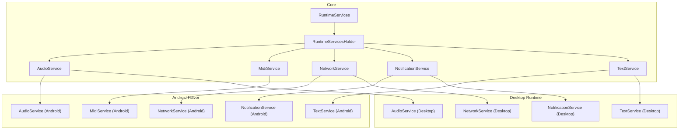
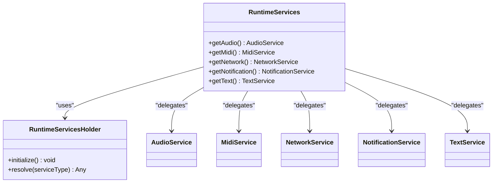
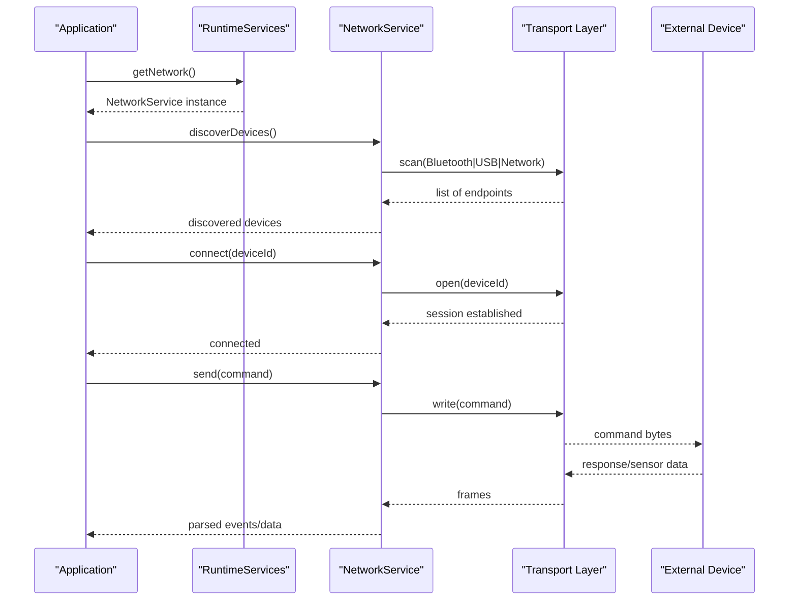
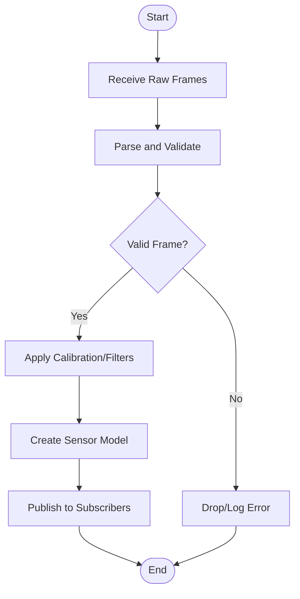
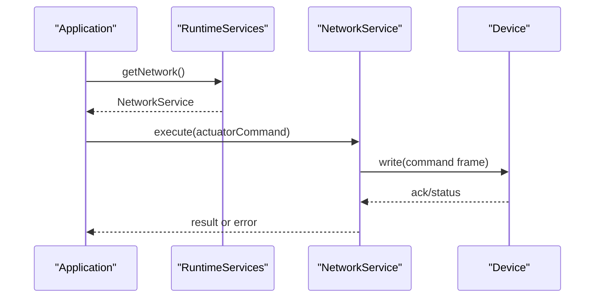
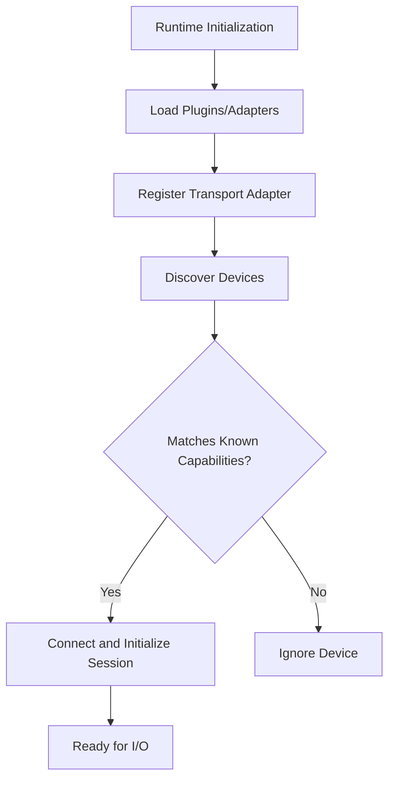
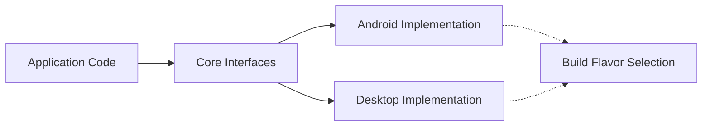

# Hardware Abstraction Layer

<cite>
**Referenced Files in This Document**
- [README.md](file://README.md)
- [task.md](file://task.md)
- [AGENTS.md](file://AGENTS.md)
- [catroid/src/main/java/org/catrobat/catroid/common/FlavoredConstants.java](file://catroid/src/main/java/org/catrobat/catroid/common/FlavoredConstants.java)
- [core/src/main/java/org/catrobat/catroid/runtime/RuntimeServices.kt](file://core/src/main/java/org/catrobat/catroid/runtime/RuntimeServices.kt)
- [core/src/main/java/org/catrobat/catroid/runtime/RuntimeServicesHolder.kt](file://core/src/main/java/org/catrobat/catroid/runtime/RuntimeServicesHolder.kt)
- [core/src/main/java/org/catrobat/catroid/audio/AudioService.kt](file://core/src/main/java/org/catrobat/catroid/audio/AudioService.kt)
- [core/src/main/java/org/catrobat/catroid/audio/MidiService.kt](file://core/src/main/java/org/catrobat/catroid/audio/MidiService.kt)
- [core/src/main/java/org/catrobat/catroid/network/NetworkService.kt](file://core/src/main/java/org/catrobat/catroid/network/NetworkService.kt)
- [core/src/main/java/org/catrobat/catroid/notification/NotificationService.kt](file://core/src/main/java/org/catrobat/catroid/notification/NotificationService.kt)
- [core/src/main/java/org/catrobat/catroid/text/TextService.kt](file://core/src/main/java/org/catrobat/catroid/text/TextService.kt)
- [desktop-runtime/src/main/java/org/catrobat/catroid/audio/AudioService.kt](file://desktop-runtime/src/main/java/org/catrobat/catroid/audio/AudioService.kt)
- [desktop-runtime/src/main/java/org/catrobat/catroid/network/NetworkService.kt](file://desktop-runtime/src/main/java/org/catrobat/catroid/network/NetworkService.kt)
- [desktop-runtime/src/main/java/org/catrobat/catroid/notification/NotificationService.kt](file://desktop-runtime/src/main/java/org/catrobat/catroid/notification/NotificationService.kt)
- [desktop-runtime/src/main/java/org/catrobat/catroid/text/TextService.kt](file://desktop-runtime/src/main/java/org/catrobat/catroid/text/TextService.kt)
</cite>

## Table of Contents
1. [Introduction](#introduction)
2. [Project Structure](#project-structure)
3. [Core Components](#core-components)
4. [Architecture Overview](#architecture-overview)
5. [Detailed Component Analysis](#detailed-component-analysis)
6. [Dependency Analysis](#dependency-analysis)
7. [Performance Considerations](#performance-considerations)
8. [Troubleshooting Guide](#troubleshooting-guide)
9. [Conclusion](#conclusion)
10. [Appendices](#appendices)

## Introduction
This document explains NewCatroid’s hardware abstraction layer (HAL) architecture and how it provides a unified API across platforms. It focuses on:
- Unified service interfaces that abstract platform-specific behavior
- Device discovery and connection management for Bluetooth, USB, and network transports
- Sensor data acquisition pipeline from raw signals to processed models
- Actuator control interfaces with platform-agnostic APIs
- Plugin-style extension points enabling new device support without modifying core code
- Practical examples for implementing custom adapters and integrating them into the runtime

The goal is to help developers add new hardware devices and transports while keeping the rest of the system stable and consistent.

## Project Structure
NewCatroid organizes HAL-related functionality around services and platform variants:
- Core module defines shared interfaces and default implementations
- Android flavor modules provide platform-specific implementations
- Desktop runtime provides desktop-targeted implementations
- Build flavors select which implementation is active at compile time

**Diagram sources**
- [core/src/main/java/org/catrobat/catroid/runtime/RuntimeServices.kt](file://core/src/main/java/org/catrobat/catroid/runtime/RuntimeServices.kt)
- [core/src/main/java/org/catrobat/catroid/runtime/RuntimeServicesHolder.kt](file://core/src/main/java/org/catrobat/catroid/runtime/RuntimeServicesHolder.kt)
- [core/src/main/java/org/catrobat/catroid/audio/AudioService.kt](file://core/src/main/java/org/catrobat/catroid/audio/AudioService.kt)
- [core/src/main/java/org/catrobat/catroid/audio/MidiService.kt](file://core/src/main/java/org/catrobat/catroid/audio/MidiService.kt)
- [core/src/main/java/org/catrobat/catroid/network/NetworkService.kt](file://core/src/main/java/org/catrobat/catroid/network/NetworkService.kt)
- [core/src/main/java/org/catrobat/catroid/notification/NotificationService.kt](file://core/src/main/java/org/catrobat/catroid/notification/NotificationService.kt)
- [core/src/main/java/org/catrobat/catroid/text/TextService.kt](file://core/src/main/java/org/catrobat/catroid/text/TextService.kt)
- [desktop-runtime/src/main/java/org/catrobat/catroid/audio/AudioService.kt](file://desktop-runtime/src/main/java/org/catrobat/catroid/audio/AudioService.kt)
- [desktop-runtime/src/main/java/org/catrobat/catroid/network/NetworkService.kt](file://desktop-runtime/src/main/java/org/catrobat/catroid/network/NetworkService.kt)
- [desktop-runtime/src/main/java/org/catrobat/catroid/notification/NotificationService.kt](file://desktop-runtime/src/main/java/org/catrobat/catroid/notification/NotificationService.kt)
- [desktop-runtime/src/main/java/org/catrobat/catroid/text/TextService.kt](file://desktop-runtime/src/main/java/org/catrobat/catroid/text/TextService.kt)

**Section sources**
- [README.md](file://README.md)
- [task.md](file://task.md)
- [AGENTS.md](file://AGENTS.md)

## Core Components
The HAL centers on a set of services exposed through a runtime facade. Each service defines a platform-neutral contract; platform modules implement these contracts. The runtime holder resolves the correct implementation based on build flavor.

Key responsibilities:
- RuntimeServices: orchestrates access to subsystems (audio, MIDI, networking, notifications, text)
- RuntimeServicesHolder: binds concrete implementations to the runtime at startup
- AudioService: audio input/output abstraction
- MidiService: MIDI I/O abstraction
- NetworkService: transport abstraction for remote devices
- NotificationService: user-facing feedback abstraction
- TextService: text rendering/processing abstraction

Implementation selection is driven by build flavors and constants. For example, FlavoredConstants can be used to toggle features or choose implementations per flavor.

**Section sources**
- [core/src/main/java/org/catrobat/catroid/runtime/RuntimeServices.kt](file://core/src/main/java/org/catrobat/catroid/runtime/RuntimeServices.kt)
- [core/src/main/java/org/catrobat/catroid/runtime/RuntimeServicesHolder.kt](file://core/src/main/java/org/catrobat/catroid/runtime/RuntimeServicesHolder.kt)
- [core/src/main/java/org/catrobat/catroid/audio/AudioService.kt](file://core/src/main/java/org/catrobat/catroid/audio/AudioService.kt)
- [core/src/main/java/org/catrobat/catroid/audio/MidiService.kt](file://core/src/main/java/org/catrobat/catroid/audio/MidiService.kt)
- [core/src/main/java/org/catrobat/catroid/network/NetworkService.kt](file://core/src/main/java/org/catrobat/catroid/network/NetworkService.kt)
- [core/src/main/java/org/catrobat/catroid/notification/NotificationService.kt](file://core/src/main/java/org/catrobat/catroid/notification/NotificationService.kt)
- [core/src/main/java/org/catrobat/catroid/text/TextService.kt](file://core/src/main/java/org/catrobat/catroid/text/TextService.kt)
- [catroid/src/main/java/org/catrobat/catroid/common/FlavoredConstants.java](file://catroid/src/main/java/org/catrobat/catroid/common/FlavoredConstants.java)

## Architecture Overview
The HAL follows a layered design:
- Application layer calls into RuntimeServices
- RuntimeServices delegates to specific services via RuntimeServicesHolder
- Platform-specific services implement the contracts defined in core
- Transports (Bluetooth, USB, network) are encapsulated behind NetworkService and related abstractions
- Sensors and actuators are modeled as typed data streams and commands, respectively

**Diagram sources**
- [core/src/main/java/org/catrobat/catroid/runtime/RuntimeServices.kt](file://core/src/main/java/org/catrobat/catroid/runtime/RuntimeServices.kt)
- [core/src/main/java/org/catrobat/catroid/runtime/RuntimeServicesHolder.kt](file://core/src/main/java/org/catrobat/catroid/runtime/RuntimeServicesHolder.kt)
- [core/src/main/java/org/catrobat/catroid/audio/AudioService.kt](file://core/src/main/java/org/catrobat/catroid/audio/AudioService.kt)
- [core/src/main/java/org/catrobat/catroid/audio/MidiService.kt](file://core/src/main/java/org/catrobat/catroid/audio/MidiService.kt)
- [core/src/main/java/org/catrobat/catroid/network/NetworkService.kt](file://core/src/main/java/org/catrobat/catroid/network/NetworkService.kt)
- [core/src/main/java/org/catrobat/catroid/notification/NotificationService.kt](file://core/src/main/java/org/catrobat/catroid/notification/NotificationService.kt)
- [core/src/main/java/org/catrobat/catroid/text/TextService.kt](file://core/src/main/java/org/catrobat/catroid/text/TextService.kt)

## Detailed Component Analysis

### Unified Service Interfaces
Each HAL service exposes a stable interface independent of platform details. Consumers call methods like open, close, read/write, configure, and subscribe/unsubscribe. Implementations vary by platform but adhere to the same method signatures and semantics.

- AudioService: manages audio capture/playback resources and streams
- MidiService: manages MIDI ports, messages, and events
- NetworkService: manages connections, discovery, and message framing over various transports
- NotificationService: posts notifications and status updates
- TextService: renders or processes text consistently across platforms

Platform-specific implementations live in flavor modules (Android) and desktop-runtime.

**Section sources**
- [core/src/main/java/org/catrobat/catroid/audio/AudioService.kt](file://core/src/main/java/org/catrobat/catroid/audio/AudioService.kt)
- [core/src/main/java/org/catrobat/catroid/audio/MidiService.kt](file://core/src/main/java/org/catrobat/catroid/audio/MidiService.kt)
- [core/src/main/java/org/catrobat/catroid/network/NetworkService.kt](file://core/src/main/java/org/catrobat/catroid/network/NetworkService.kt)
- [core/src/main/java/org/catrobat/catroid/notification/NotificationService.kt](file://core/src/main/java/org/catrobat/catroid/notification/NotificationService.kt)
- [core/src/main/java/org/catrobat/catroid/text/TextService.kt](file://core/src/main/java/org/catrobat/catroid/text/TextService.kt)
- [desktop-runtime/src/main/java/org/catrobat/catroid/audio/AudioService.kt](file://desktop-runtime/src/main/java/org/catrobat/catroid/audio/AudioService.kt)
- [desktop-runtime/src/main/java/org/catrobat/catroid/network/NetworkService.kt](file://desktop-runtime/src/main/java/org/catrobat/catroid/network/NetworkService.kt)
- [desktop-runtime/src/main/java/org/catrobat/catroid/notification/NotificationService.kt](file://desktop-runtime/src/main/java/org/catrobat/catroid/notification/NotificationService.kt)
- [desktop-runtime/src/main/java/org/catrobat/catroid/text/TextService.kt](file://desktop-runtime/src/main/java/org/catrobat/catroid/text/TextService.kt)

### Device Discovery and Connection Management
Discovery and connection flows are abstracted behind NetworkService and related components. Typical flow:
- Discover available devices (Bluetooth, USB, network endpoints)
- Present a list to the application
- Establish a connection using a selected transport
- Maintain session state and handle reconnection
- Route sensor/actuator messages over the established channel

**Diagram sources**
- [core/src/main/java/org/catrobat/catroid/network/NetworkService.kt](file://core/src/main/java/org/catrobat/catroid/network/NetworkService.kt)

**Section sources**
- [core/src/main/java/org/catrobat/catroid/network/NetworkService.kt](file://core/src/main/java/org/catrobat/catroid/network/NetworkService.kt)

### Sensor Data Acquisition Pipeline
Raw signals from sensors are converted into structured data models through a pipeline:
- Transport receives raw frames
- Parser validates and decodes frames into typed sensor events
- Optional filters/calibrations transform values into physical units
- Stream consumers receive normalized data

[No sources needed since this diagram shows conceptual workflow, not actual code structure]

### Actuator Control Interfaces
Actuators are controlled via standardized commands:
- Commands are encoded into transport frames
- Devices acknowledge execution or return status/error codes
- Errors are surfaced uniformly to the caller

**Diagram sources**
- [core/src/main/java/org/catrobat/catroid/network/NetworkService.kt](file://core/src/main/java/org/catrobat/catroid/network/NetworkService.kt)

**Section sources**
- [core/src/main/java/org/catrobat/catroid/network/NetworkService.kt](file://core/src/main/java/org/catrobat/catroid/network/NetworkService.kt)

### Plugin Architecture for New Devices
To add support for a new device without changing core code:
- Define a new transport adapter implementing the transport contract used by NetworkService
- Register the adapter through the runtime initialization process
- Provide device metadata and capability descriptors so discovery can identify the device
- Optionally contribute parsers/filters for sensor data and command encoders for actuators

[No sources needed since this diagram shows conceptual workflow, not actual code structure]

### Example: Implementing a Custom Hardware Adapter
Steps to integrate a new device:
- Create an adapter class implementing the required transport interface
- Expose discovery logic for your transport (e.g., Bluetooth UUIDs, USB VID/PID, or network endpoints)
- Implement connect/disconnect and read/write operations
- Map device capabilities to the unified model used by the runtime
- Ensure errors and timeouts are handled consistently

Integration points:
- Use RuntimeServicesHolder to bind your adapter during startup
- Reference FlavoredConstants if you need feature toggles per flavor

**Section sources**
- [core/src/main/java/org/catrobat/catroid/runtime/RuntimeServicesHolder.kt](file://core/src/main/java/org/catrobat/catroid/runtime/RuntimeServicesHolder.kt)
- [catroid/src/main/java/org/catrobat/catroid/common/FlavoredConstants.java](file://catroid/src/main/java/org/catrobat/catroid/common/FlavoredConstants.java)

## Dependency Analysis
The HAL minimizes coupling between application code and platform specifics:
- Application depends only on core interfaces
- RuntimeServicesHolder resolves implementations at runtime
- Platform modules depend on core interfaces but not on each other
- Build flavors determine which implementation is included

[No sources needed since this diagram shows conceptual relationships, not actual code structure]

## Performance Considerations
- Prefer asynchronous I/O for transport operations to avoid blocking UI threads
- Batch sensor readings when possible to reduce overhead
- Apply lightweight filtering at the edge to minimize payload size
- Reuse connections and sessions where appropriate
- Handle backpressure in high-frequency sensor streams

[No sources needed since this section provides general guidance]

## Troubleshooting Guide
Common issues and strategies:
- Connection failures: verify permissions and availability of transports; log transport-level errors
- Parsing errors: validate frame formats and update parsers for protocol changes
- Missing device: ensure device capabilities match known descriptors; check discovery filters
- High latency: inspect buffering and threading; consider reducing sampling rate or batching

Operational hooks:
- Use NotificationService to surface errors and status to users
- Use TextService for consistent logging and diagnostics formatting

**Section sources**
- [core/src/main/java/org/catrobat/catroid/notification/NotificationService.kt](file://core/src/main/java/org/catrobat/catroid/notification/NotificationService.kt)
- [core/src/main/java/org/catrobat/catroid/text/TextService.kt](file://core/src/main/java/org/catrobat/catroid/text/TextService.kt)

## Conclusion
NewCatroid’s HAL provides a clean separation between platform-specific details and application logic. By standardizing service interfaces, centralizing runtime resolution, and supporting plugin-style adapters, it enables rapid integration of new devices and transports while maintaining stability and consistency across Android and desktop targets.

## Appendices
- Build flavor configuration influences which HAL implementations are compiled in
- Constants such as FlavoredConstants can be used to enable/disable features per flavor
- Desktop runtime provides its own implementations for parity during development and testing

**Section sources**
- [catroid/src/main/java/org/catrobat/catroid/common/FlavoredConstants.java](file://catroid/src/main/java/org/catrobat/catroid/common/FlavoredConstants.java)
- [desktop-runtime/src/main/java/org/catrobat/catroid/audio/AudioService.kt](file://desktop-runtime/src/main/java/org/catrobat/catroid/audio/AudioService.kt)
- [desktop-runtime/src/main/java/org/catrobat/catroid/network/NetworkService.kt](file://desktop-runtime/src/main/java/org/catrobat/catroid/network/NetworkService.kt)
- [desktop-runtime/src/main/java/org/catrobat/catroid/notification/NotificationService.kt](file://desktop-runtime/src/main/java/org/catrobat/catroid/notification/NotificationService.kt)
- [desktop-runtime/src/main/java/org/catrobat/catroid/text/TextService.kt](file://desktop-runtime/src/main/java/org/catrobat/catroid/text/TextService.kt)