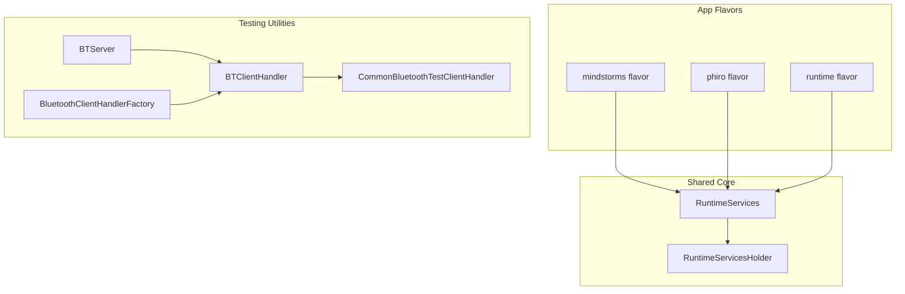
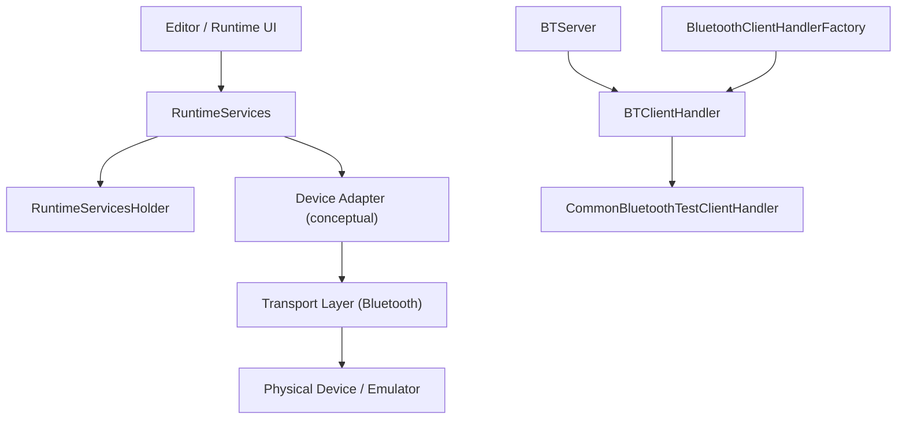
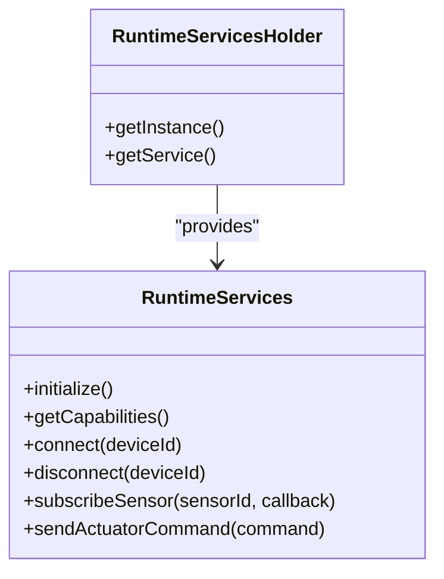
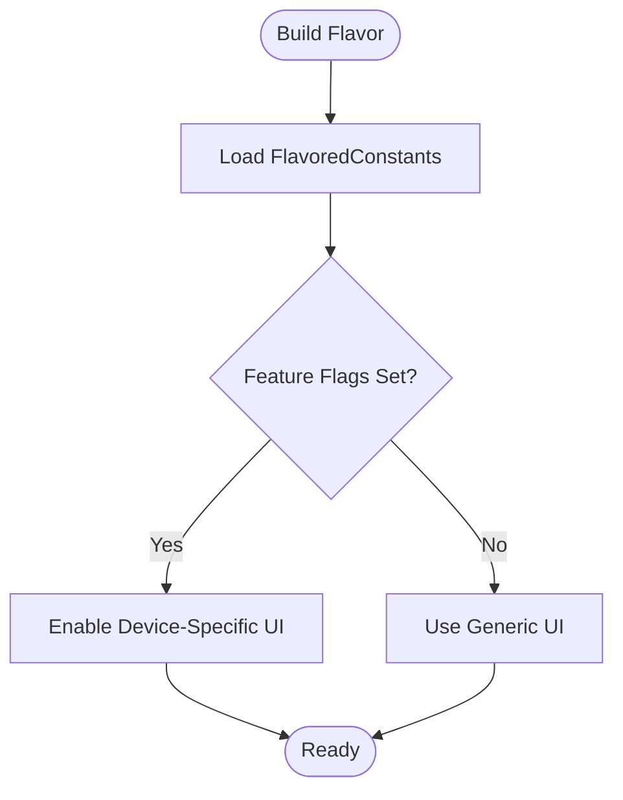
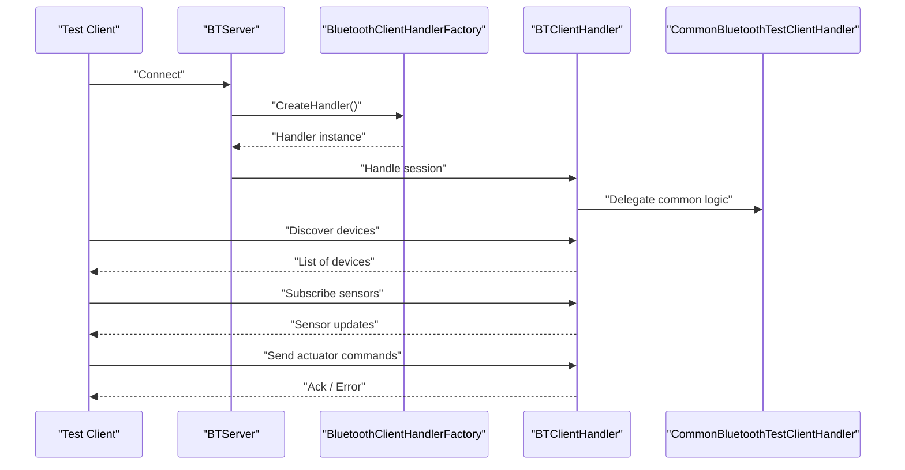
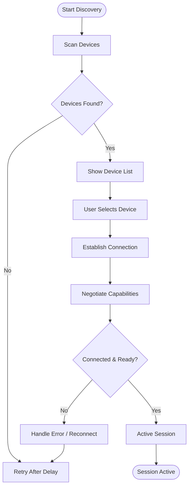
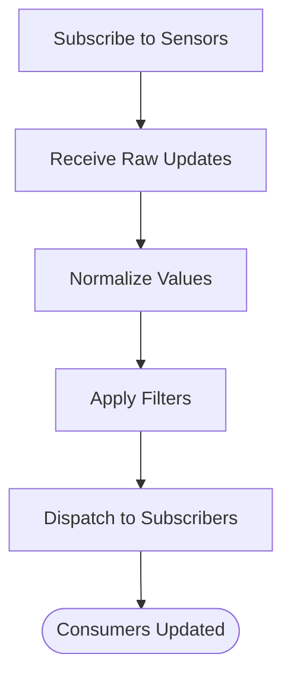
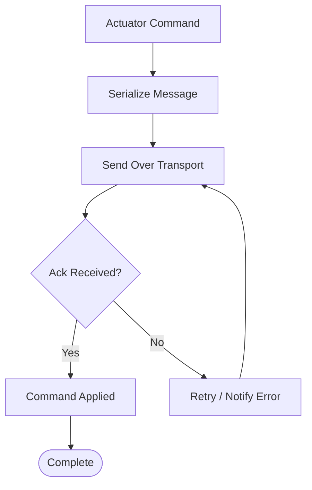
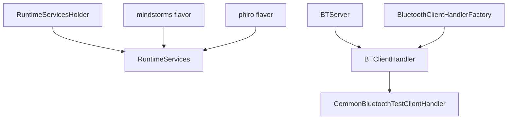

# Hardware Integration

<cite>
**Referenced Files in This Document**
- [README.md](file://README.md)
- [catroid/src/main/java/org/catrobat/catroid/common/FlavoredConstants.java](file://catroid/src/main/java/org/catrobat/catroid/common/FlavoredConstants.java)
- [core/src/main/java/org/catrobat/catroid/runtime/RuntimeServices.kt](file://core/src/main/java/org/catrobat/catroid/runtime/RuntimeServices.kt)
- [core/src/main/java/org/catrobat/catroid/runtime/RuntimeServicesHolder.kt](file://core/src/main/java/org/catrobat/catroid/runtime/RuntimeServicesHolder.kt)
- [catroid/src/main/java/org/catrobat/catroid/bluetoothtestserver/BTServer.java](file://catroid/src/main/java/org/catrobat/catroid/bluetoothtestserver/BTServer.java)
- [catroid/src/main/java/org/catrobat/catroid/bluetoothtestserver/BTClientHandler.java](file://catroid/src/main/java/org/catrobat/catroid/bluetoothtestserver/BTClientHandler.java)
- [catroid/src/main/java/org/catrobat/catroid/bluetoothtestserver/BluetoothClientHandlerFactory.java](file://catroid/src/main/java/org/catrobat/catroid/bluetoothtestserver/BluetoothClientHandlerFactory.java)
- [catroid/src/main/java/org/catrobat/catroid/bluetoothtestserver/clienthandlers/CommonBluetoothTestClientHandler.java](file://catroid/src/main/java/org/catrobat/catroid/bluetoothtestserver/clienthandlers/CommonBluetoothTestClientHandler.java)
</cite>

## Table of Contents
1. [Introduction](#introduction)
2. [Project Structure](#project-structure)
3. [Core Components](#core-components)
4. [Architecture Overview](#architecture-overview)
5. [Detailed Component Analysis](#detailed-component-analysis)
6. [Dependency Analysis](#dependency-analysis)
7. [Performance Considerations](#performance-considerations)
8. [Troubleshooting Guide](#troubleshooting-guide)
9. [Conclusion](#conclusion)
10. [Appendices](#appendices)

## Introduction
This document explains NewCatroid’s hardware abstraction layer and device integration capabilities with a focus on connecting to multiple platforms such as LEGO Mindstorms, Phiro robots, and custom IoT devices. It describes the unified API surface for discovery and connection management, sensor data acquisition and processing, actuator control interfaces, and the plugin-style patterns that enable consistent programming experiences across different devices. It also provides integration guides for supported platforms, example workflows for sensor programming, and guidelines for adding support for new devices through the existing architecture.

## Project Structure
NewCatroid organizes platform-specific integrations using Android flavor modules and shared runtime services:
- Flavor modules provide per-device resources and constants (e.g., mindstorms, phiro).
- Shared core runtime exposes service holders and runtime services used by both editor and runtime.
- A Bluetooth test server is included to simulate and validate device communication flows during development and testing.

**Diagram sources**
- [catroid/src/main/java/org/catrobat/catroid/common/FlavoredConstants.java](file://catroid/src/main/java/org/catrobat/catroid/common/FlavoredConstants.java)
- [core/src/main/java/org/catrobat/catroid/runtime/RuntimeServices.kt](file://core/src/main/java/org/catrobat/catroid/runtime/RuntimeServices.kt)
- [core/src/main/java/org/catrobat/catroid/runtime/RuntimeServicesHolder.kt](file://core/src/main/java/org/catrobat/catroid/runtime/RuntimeServicesHolder.kt)
- [catroid/src/main/java/org/catrobat/catroid/bluetoothtestserver/BTServer.java](file://catroid/src/main/java/org/catrobat/catroid/bluetoothtestserver/BTServer.java)
- [catroid/src/main/java/org/catrobat/catroid/bluetoothtestserver/BTClientHandler.java](file://catroid/src/main/java/org/catrobat/catroid/bluetoothtestserver/BTClientHandler.java)
- [catroid/src/main/java/org/catrobat/catroid/bluetoothtestserver/BluetoothClientHandlerFactory.java](file://catroid/src/main/java/org/catrobat/catroid/bluetoothtestserver/BluetoothClientHandlerFactory.java)
- [catroid/src/main/java/org/catrobat/catroid/bluetoothtestserver/clienthandlers/CommonBluetoothTestClientHandler.java](file://catroid/src/main/java/org/catrobat/catroid/bluetoothtestserver/clienthandlers/CommonBluetoothTestClientHandler.java)

**Section sources**
- [README.md](file://README.md)
- [catroid/src/main/java/org/catrobat/catroid/common/FlavoredConstants.java](file://catroid/src/main/java/org/catrobat/catroid/common/FlavoredConstants.java)
- [core/src/main/java/org/catrobat/catroid/runtime/RuntimeServices.kt](file://core/src/main/java/org/catrobat/catroid/runtime/RuntimeServices.kt)
- [core/src/main/java/org/catrobat/catroid/runtime/RuntimeServicesHolder.kt](file://core/src/main/java/org/catrobat/catroid/runtime/RuntimeServicesHolder.kt)
- [catroid/src/main/java/org/catrobat/catroid/bluetoothtestserver/BTServer.java](file://catroid/src/main/java/org/catrobat/catroid/bluetoothtestserver/BTServer.java)
- [catroid/src/main/java/org/catrobat/catroid/bluetoothtestserver/BTClientHandler.java](file://catroid/src/main/java/org/catrobat/catroid/bluetoothtestserver/BTClientHandler.java)
- [catroid/src/main/java/org/catrobat/catroid/bluetoothtestserver/BluetoothClientHandlerFactory.java](file://catroid/src/main/java/org/catrobat/catroid/bluetoothtestserver/BluetoothClientHandlerFactory.java)
- [catroid/src/main/java/org/catrobat/catroid/bluetoothtestserver/clienthandlers/CommonBluetoothTestClientHandler.java](file://catroid/src/main/java/org/catrobat/catroid/bluetoothtestserver/clienthandlers/CommonBluetoothTestClientHandler.java)

## Core Components
The hardware abstraction centers around a small set of cohesive components:
- Runtime Services: Provide access to platform features and device-related functionality from both editor and runtime contexts.
- Service Holder: Centralized accessor for runtime services, enabling consistent retrieval across the app.
- Flavor Constants: Per-device configuration and capability flags exposed via flavor-specific builds.
- Bluetooth Test Server: A local server and client handler framework to emulate devices and validate communication protocols.

Key responsibilities:
- Unified access to device capabilities via runtime services.
- Discovery and connection lifecycle management through standardized handlers.
- Sensor data ingestion and actuator command dispatching via common message formats.
- Extensibility points for new device types through handler factories and flavor modules.

**Section sources**
- [core/src/main/java/org/catrobat/catroid/runtime/RuntimeServices.kt](file://core/src/main/java/org/catrobat/catroid/runtime/RuntimeServices.kt)
- [core/src/main/java/org/catrobat/catroid/runtime/RuntimeServicesHolder.kt](file://core/src/main/java/org/catrobat/catroid/runtime/RuntimeServicesHolder.kt)
- [catroid/src/main/java/org/catrobat/catroid/common/FlavoredConstants.java](file://catroid/src/main/java/org/catrobat/catroid/common/FlavoredConstants.java)
- [catroid/src/main/java/org/catrobat/catroid/bluetoothtestserver/BTServer.java](file://catroid/src/main/java/org/catrobat/catroid/bluetoothtestserver/BTServer.java)
- [catroid/src/main/java/org/catrobat/catroid/bluetoothtestserver/BTClientHandler.java](file://catroid/src/main/java/org/catrobat/catroid/bluetoothtestserver/BTClientHandler.java)
- [catroid/src/main/java/org/catrobat/catroid/bluetoothtestserver/BluetoothClientHandlerFactory.java](file://catroid/src/main/java/org/catrobat/catroid/bluetoothtestserver/BluetoothClientHandlerFactory.java)
- [catroid/src/main/java/org/catrobat/catroid/bluetoothtestserver/clienthandlers/CommonBluetoothTestClientHandler.java](file://catroid/src/main/java/org/catrobat/catroid/bluetoothtestserver/clienthandlers/CommonBluetoothTestClientHandler.java)

## Architecture Overview
The system follows a layered approach:
- Presentation and Editor layers request device operations via runtime services.
- Runtime services coordinate with device adapters (conceptual), which encapsulate platform-specific details.
- Device adapters communicate over transport channels (e.g., Bluetooth) using a common protocol.
- The Bluetooth test server simulates devices to validate end-to-end flows without physical hardware.

**Diagram sources**
- [core/src/main/java/org/catrobat/catroid/runtime/RuntimeServices.kt](file://core/src/main/java/org/catrobat/catroid/runtime/RuntimeServices.kt)
- [core/src/main/java/org/catrobat/catroid/runtime/RuntimeServicesHolder.kt](file://core/src/main/java/org/catrobat/catroid/runtime/RuntimeServicesHolder.kt)
- [catroid/src/main/java/org/catrobat/catroid/bluetoothtestserver/BTServer.java](file://catroid/src/main/java/org/catrobat/catroid/bluetoothtestserver/BTServer.java)
- [catroid/src/main/java/org/catrobat/catroid/bluetoothtestserver/BTClientHandler.java](file://catroid/src/main/java/org/catrobat/catroid/bluetoothtestserver/BTClientHandler.java)
- [catroid/src/main/java/org/catrobat/catroid/bluetoothtestserver/BluetoothClientHandlerFactory.java](file://catroid/src/main/java/org/catrobat/catroid/bluetoothtestserver/BluetoothClientHandlerFactory.java)
- [catroid/src/main/java/org/catrobat/catroid/bluetoothtestserver/clienthandlers/CommonBluetoothTestClientHandler.java](file://catroid/src/main/java/org/catrobat/catroid/bluetoothtestserver/clienthandlers/CommonBluetoothTestClientHandler.java)

## Detailed Component Analysis

### Runtime Services and Holder
Purpose:
- Expose a stable API for device-related operations to both editor and runtime.
- Provide centralized access via a holder to avoid tight coupling.

Responsibilities:
- Initialization and lifecycle management of device subsystems.
- Accessors for device capabilities and state.
- Coordination of discovery and connection events.

Design notes:
- Use holder pattern to decouple callers from concrete implementations.
- Keep methods focused on orchestration; delegate to adapters or transports.

**Diagram sources**
- [core/src/main/java/org/catrobat/catroid/runtime/RuntimeServices.kt](file://core/src/main/java/org/catrobat/catroid/runtime/RuntimeServices.kt)
- [core/src/main/java/org/catrobat/catroid/runtime/RuntimeServicesHolder.kt](file://core/src/main/java/org/catrobat/catroid/runtime/RuntimeServicesHolder.kt)

**Section sources**
- [core/src/main/java/org/catrobat/catroid/runtime/RuntimeServices.kt](file://core/src/main/java/org/catrobat/catroid/runtime/RuntimeServices.kt)
- [core/src/main/java/org/catrobat/catroid/runtime/RuntimeServicesHolder.kt](file://core/src/main/java/org/catrobat/catroid/runtime/RuntimeServicesHolder.kt)

### Flavor Constants
Purpose:
- Define per-flavor identifiers, feature flags, and resource references for each supported device type.

Responsibilities:
- Provide compile-time selection of device-specific behavior.
- Centralize constants to avoid magic strings and numbers.

Usage:
- Reference constants when building UI elements, menus, or logic branches for specific devices.

**Diagram sources**
- [catroid/src/main/java/org/catrobat/catroid/common/FlavoredConstants.java](file://catroid/src/main/java/org/catrobat/catroid/common/FlavoredConstants.java)

**Section sources**
- [catroid/src/main/java/org/catrobat/catroid/common/FlavoredConstants.java](file://catroid/src/main/java/org/catrobat/catroid/common/FlavoredConstants.java)

### Bluetooth Test Server and Handlers
Purpose:
- Simulate hardware devices over Bluetooth to validate discovery, pairing, messaging, and error handling paths.

Components:
- BTServer: Accepts incoming connections and routes them to handlers.
- BTClientHandler: Manages per-client sessions and message routing.
- BluetoothClientHandlerFactory: Creates appropriate handlers based on device type or capabilities.
- CommonBluetoothTestClientHandler: Implements shared behaviors for test clients.

**Diagram sources**
- [catroid/src/main/java/org/catrobat/catroid/bluetoothtestserver/BTServer.java](file://catroid/src/main/java/org/catrobat/catroid/bluetoothtestserver/BTServer.java)
- [catroid/src/main/java/org/catrobat/catroid/bluetoothtestserver/BTClientHandler.java](file://catroid/src/main/java/org/catrobat/catroid/bluetoothtestserver/BTClientHandler.java)
- [catroid/src/main/java/org/catrobat/catroid/bluetoothtestserver/BluetoothClientHandlerFactory.java](file://catroid/src/main/java/org/catrobat/catroid/bluetoothtestserver/BluetoothClientHandlerFactory.java)
- [catroid/src/main/java/org/catrobat/catroid/bluetoothtestserver/clienthandlers/CommonBluetoothTestClientHandler.java](file://catroid/src/main/java/org/catrobat/catroid/bluetoothtestserver/clienthandlers/CommonBluetoothTestClientHandler.java)

**Section sources**
- [catroid/src/main/java/org/catrobat/catroid/bluetoothtestserver/BTServer.java](file://catroid/src/main/java/org/catrobat/catroid/bluetoothtestserver/BTServer.java)
- [catroid/src/main/java/org/catrobat/catroid/bluetoothtestserver/BTClientHandler.java](file://catroid/src/main/java/org/catrobat/catroid/bluetoothtestserver/BTClientHandler.java)
- [catroid/src/main/java/org/catrobat/catroid/bluetoothtestserver/BluetoothClientHandlerFactory.java](file://catroid/src/main/java/org/catrobat/catroid/bluetoothtestserver/BluetoothClientHandlerFactory.java)
- [catroid/src/main/java/org/catrobat/catroid/bluetoothtestserver/clienthandlers/CommonBluetoothTestClientHandler.java](file://catroid/src/main/java/org/catrobat/catroid/bluetoothtestserver/clienthandlers/CommonBluetoothTestClientHandler.java)

### Device Discovery and Connection Management
Conceptual flow:
- Discover available devices via transport-layer scanning.
- Present discovered devices to the user through flavor-aware UI.
- Establish a connection and negotiate capabilities.
- Maintain connection state and handle reconnection attempts.

[No sources needed since this diagram shows conceptual workflow, not actual code structure]

### Sensor Data Acquisition and Processing
Conceptual pipeline:
- Subscribe to sensor streams after connection negotiation.
- Receive periodic updates and normalize values into a common format.
- Apply filtering or transformations as needed.
- Dispatch processed data to subscribers (e.g., blocks, UI, analytics).

[No sources needed since this diagram shows conceptual workflow, not actual code structure]

### Actuator Control Interfaces
Conceptual model:
- Define a set of actuator commands (e.g., motor speed, LED brightness).
- Serialize commands into transport messages.
- Send commands over active connections.
- Acknowledge success or propagate errors back to the caller.

[No sources needed since this diagram shows conceptual workflow, not actual code structure]

## Dependency Analysis
High-level dependencies:
- Runtime services depend on the holder for access.
- Flavor modules depend on shared constants and runtime services.
- Bluetooth test utilities are independent but integrate with handlers and factory patterns.

**Diagram sources**
- [core/src/main/java/org/catrobat/catroid/runtime/RuntimeServices.kt](file://core/src/main/java/org/catrobat/catroid/runtime/RuntimeServices.kt)
- [core/src/main/java/org/catrobat/catroid/runtime/RuntimeServicesHolder.kt](file://core/src/main/java/org/catrobat/catroid/runtime/RuntimeServicesHolder.kt)
- [catroid/src/main/java/org/catrobat/catroid/bluetoothtestserver/BTServer.java](file://catroid/src/main/java/org/catrobat/catroid/bluetoothtestserver/BTServer.java)
- [catroid/src/main/java/org/catrobat/catroid/bluetoothtestserver/BTClientHandler.java](file://catroid/src/main/java/org/catrobat/catroid/bluetoothtestserver/BTClientHandler.java)
- [catroid/src/main/java/org/catrobat/catroid/bluetoothtestserver/BluetoothClientHandlerFactory.java](file://catroid/src/main/java/org/catrobat/catroid/bluetoothtestserver/BluetoothClientHandlerFactory.java)
- [catroid/src/main/java/org/catrobat/catroid/bluetoothtestserver/clienthandlers/CommonBluetoothTestClientHandler.java](file://catroid/src/main/java/org/catrobat/catroid/bluetoothtestserver/clienthandlers/CommonBluetoothTestClientHandler.java)

**Section sources**
- [core/src/main/java/org/catrobat/catroid/runtime/RuntimeServices.kt](file://core/src/main/java/org/catrobat/catroid/runtime/RuntimeServices.kt)
- [core/src/main/java/org/catrobat/catroid/runtime/RuntimeServicesHolder.kt](file://core/src/main/java/org/catrobat/catroid/runtime/RuntimeServicesHolder.kt)
- [catroid/src/main/java/org/catrobat/catroid/bluetoothtestserver/BTServer.java](file://catroid/src/main/java/org/catrobat/catroid/bluetoothtestserver/BTServer.java)
- [catroid/src/main/java/org/catrobat/catroid/bluetoothtestserver/BTClientHandler.java](file://catroid/src/main/java/org/catrobat/catroid/bluetoothtestserver/BTClientHandler.java)
- [catroid/src/main/java/org/catrobat/catroid/bluetoothtestserver/BluetoothClientHandlerFactory.java](file://catroid/src/main/java/org/catrobat/catroid/bluetoothtestserver/BluetoothClientHandlerFactory.java)
- [catroid/src/main/java/org/catrobat/catroid/bluetoothtestserver/clienthandlers/CommonBluetoothTestClientHandler.java](file://catroid/src/main/java/org/catrobat/catroid/bluetoothtestserver/clienthandlers/CommonBluetoothTestClientHandler.java)

## Performance Considerations
- Minimize blocking calls on UI threads; use background workers for discovery and I/O.
- Batch sensor updates where possible to reduce overhead.
- Implement exponential backoff for reconnection attempts.
- Cache device capabilities after initial negotiation to avoid repeated handshakes.
- Use efficient serialization formats for messages to reduce bandwidth usage.

[No sources needed since this section provides general guidance]

## Troubleshooting Guide
Common issues and strategies:
- Connection failures: Validate permissions, ensure device is discoverable, and check transport availability.
- No devices found: Confirm scanning intervals and retry policies; verify Bluetooth stack status.
- Sensor data anomalies: Inspect normalization and filtering steps; add logging around raw vs processed values.
- Actuator commands ignored: Verify command serialization and acknowledgment handling; confirm device supports requested actions.

Diagnostic aids:
- Use the Bluetooth test server to reproduce issues without physical hardware.
- Leverage handler factory to switch between device types quickly during debugging.
- Log connection states and message payloads for end-to-end tracing.

**Section sources**
- [catroid/src/main/java/org/catrobat/catroid/bluetoothtestserver/BTServer.java](file://catroid/src/main/java/org/catrobat/catroid/bluetoothtestserver/BTServer.java)
- [catroid/src/main/java/org/catrobat/catroid/bluetoothtestserver/BTClientHandler.java](file://catroid/src/main/java/org/catrobat/catroid/bluetoothtestserver/BTClientHandler.java)
- [catroid/src/main/java/org/catrobat/catroid/bluetoothtestserver/BluetoothClientHandlerFactory.java](file://catroid/src/main/java/org/catrobat/catroid/bluetoothtestserver/BluetoothClientHandlerFactory.java)
- [catroid/src/main/java/org/catrobat/catroid/bluetoothtestserver/clienthandlers/CommonBluetoothTestClientHandler.java](file://catroid/src/main/java/org/catrobat/catroid/bluetoothtestserver/clienthandlers/CommonBluetoothTestClientHandler.java)

## Conclusion
NewCatroid’s hardware abstraction leverages runtime services, flavor-based configuration, and a robust Bluetooth test harness to deliver a consistent programming experience across diverse devices. By centralizing device interactions and standardizing discovery, connection, sensor, and actuator flows, developers can extend support to new platforms efficiently while maintaining a uniform API for users.

[No sources needed since this section summarizes without analyzing specific files]

## Appendices

### Integration Guides for Supported Platforms
- LEGO Mindstorms:
  - Build the mindstorms flavor to enable device-specific UI and constants.
  - Use runtime services to initiate discovery and connect to Mindstorms hubs.
  - Subscribe to onboard sensors and send motor commands via the unified interface.
- Phiro Robots:
  - Build the phiro flavor to activate Phiro-specific features.
  - Follow the same discovery and connection flow; adjust capabilities based on flavor constants.
  - Map Phiro actuators to the generic actuator command set provided by runtime services.

[No sources needed since this section provides general guidance]

### Sensor Programming Examples
- Subscribe to a sensor stream after successful connection.
- Process incoming updates by normalizing units and applying filters.
- React to changes in event-driven blocks or UI components.

[No sources needed since this section provides general guidance]

### Guidelines for Adding Support for New Devices
- Create a new flavor module with its own constants and resources.
- Extend runtime services to expose device-specific capabilities if needed.
- Implement or adapt device adapters to translate generic commands to device protocols.
- Add test coverage using the Bluetooth test server and handler factory to simulate the new device.
- Update UI and documentation to reflect the new device options.

[No sources needed since this section provides general guidance]