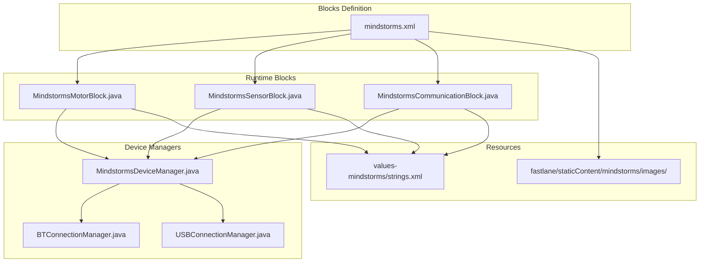
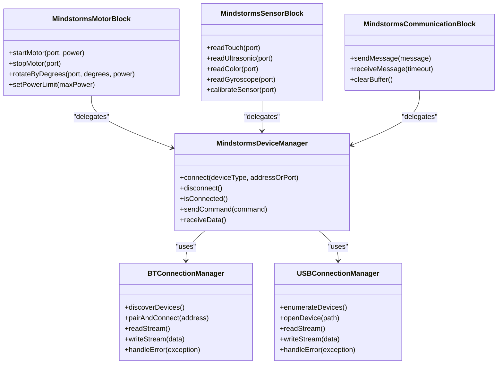
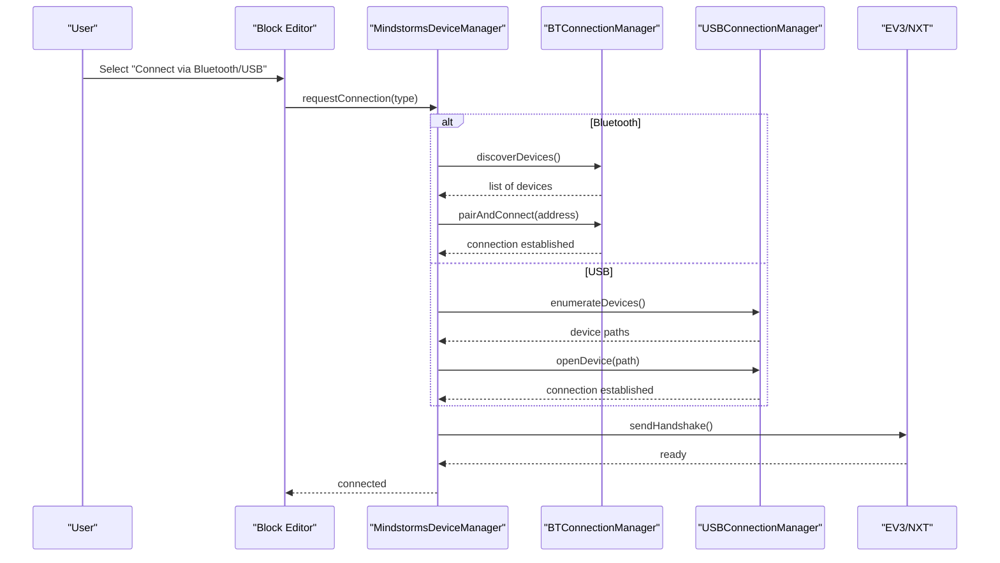
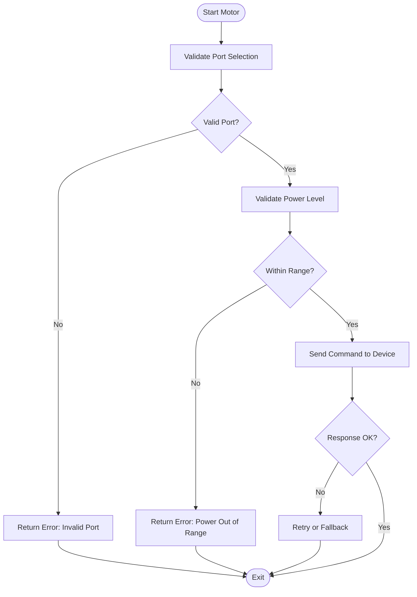
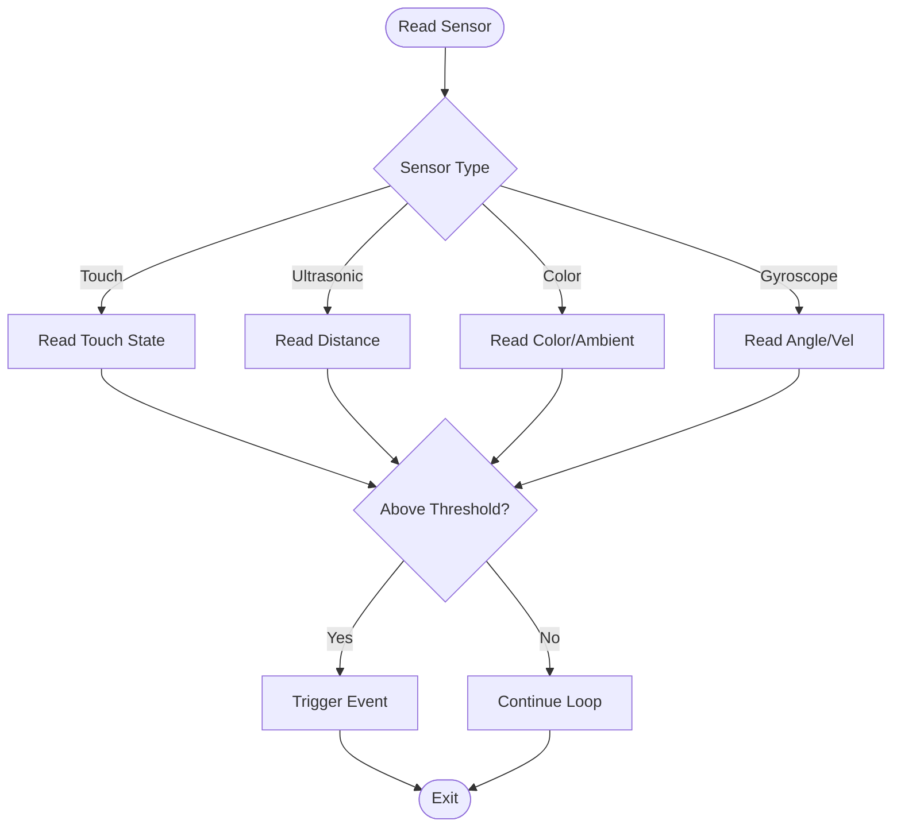
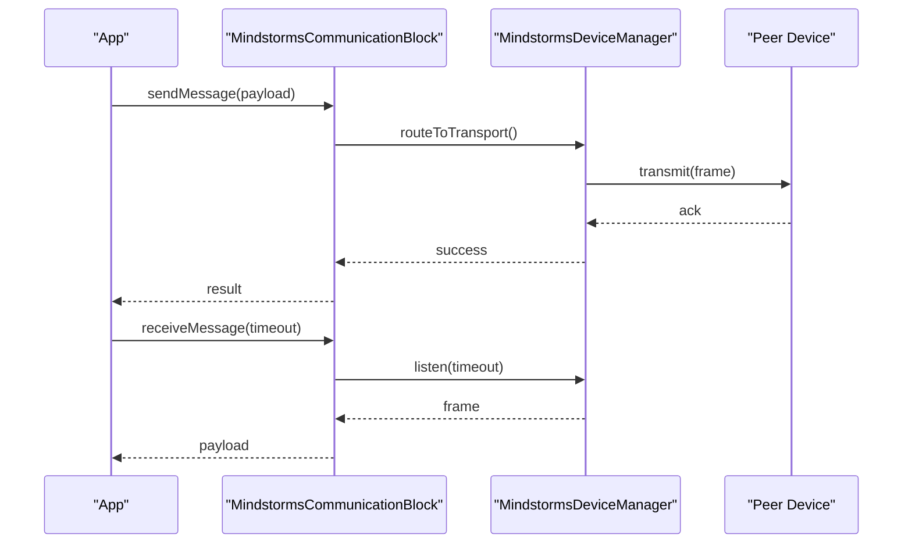
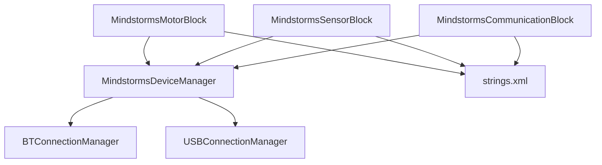

# LEGO Mindstorms Integration

<cite>
**Referenced Files in This Document**
- [README.md](file://README.md)
- [catroid/src/main/assets/catblocks/mindstorms.xml](file://catroid/src/main/assets/catblocks/mindstorms.xml)
- [catroid/src/main/java/org/catrobat/catroid/runtime/program/blocks/MindstormsMotorBlock.java](file://catroid/src/main/java/org/catrobat/catroid/runtime/program/blocks/MindstormsMotorBlock.java)
- [catroid/src/main/java/org/catrobat/catroid/runtime/program/blocks/MindstormsSensorBlock.java](file://catroid/src/main/java/org/catrobat/catroid/runtime/program/blocks/MindstormsSensorBlock.java)
- [catroid/src/main/java/org/catrobat/catroid/runtime/program/blocks/MindstormsCommunicationBlock.java](file://catroid/src/main/java/org/catrobat/catroid/runtime/program/blocks/MindstormsCommunicationBlock.java)
- [catroid/src/main/java/org/catrobat/catroid/runtime/devices/MindstormsDeviceManager.java](file://catroid/src/main/java/org/catrobat/catroid/runtime/devices/MindstormsDeviceManager.java)
- [catroid/src/main/java/org/catrobat/catroid/runtime/devices/bluetooth/BTConnectionManager.java](file://catroid/src/main/java/org/catrobat/catroid/runtime/devices/bluetooth/BTConnectionManager.java)
- [catroid/src/main/java/org/catrobat/catroid/runtime/devices/usb/USBConnectionManager.java](file://catroid/src/main/java/org/catrobat/catroid/runtime/devices/usb/USBConnectionManager.java)
- [catroid/src/main/res/values-mindstorms/strings.xml](file://catroid/src/main/res/values-mindstorms/strings.xml)
- [fastlane/staticContent/mindstorms/images/](file://fastlane/staticContent/mindstorms/images/)
</cite>

## Table of Contents
1. [Introduction](#introduction)
2. [Project Structure](#project-structure)
3. [Core Components](#core-components)
4. [Architecture Overview](#architecture-overview)
5. [Detailed Component Analysis](#detailed-component-analysis)
6. [Dependency Analysis](#dependency-analysis)
7. [Performance Considerations](#performance-considerations)
8. [Troubleshooting Guide](#troubleshooting-guide)
9. [Conclusion](#conclusion)
10. [Appendices](#appendices)

## Introduction
This document explains how NewCatroid integrates with LEGO Mindstorms EV3 and NXT robots, covering setup via Bluetooth and USB, the available programming blocks for motors and sensors, communication protocols, practical project examples, block definitions, parameter validation, error handling, troubleshooting, and performance optimization tips for real-time control.

The integration is implemented as a feature module that adds Mindstorms-specific blocks to the visual programming environment, manages device connections (Bluetooth or USB), and executes motor and sensor operations at runtime.

## Project Structure
Mindstorms support is primarily located under:
- catblocks definition files for UI blocks
- Runtime block implementations for execution logic
- Device managers for connection handling (Bluetooth and USB)
- Resources for localized strings and assets

**Diagram sources**
- [catroid/src/main/assets/catblocks/mindstorms.xml](file://catroid/src/main/assets/catblocks/mindstorms.xml)
- [catroid/src/main/java/org/catrobat/catroid/runtime/program/blocks/MindstormsMotorBlock.java](file://catroid/src/main/java/org/catrobat/catroid/runtime/program/blocks/MindstormsMotorBlock.java)
- [catroid/src/main/java/org/catrobat/catroid/runtime/program/blocks/MindstormsSensorBlock.java](file://catroid/src/main/java/org/catrobat/catroid/runtime/program/blocks/MindstormsSensorBlock.java)
- [catroid/src/main/java/org/catrobat/catroid/runtime/program/blocks/MindstormsCommunicationBlock.java](file://catroid/src/main/java/org/catrobat/catroid/runtime/program/blocks/MindstormsCommunicationBlock.java)
- [catroid/src/main/java/org/catrobat/catroid/runtime/devices/MindstormsDeviceManager.java](file://catroid/src/main/java/org/catrobat/catroid/runtime/devices/MindstormsDeviceManager.java)
- [catroid/src/main/java/org/catrobat/catroid/runtime/devices/bluetooth/BTConnectionManager.java](file://catroid/src/main/java/org/catrobat/catroid/runtime/devices/bluetooth/BTConnectionManager.java)
- [catroid/src/main/java/org/catrobat/catroid/runtime/devices/usb/USBConnectionManager.java](file://catroid/src/main/java/org/catrobat/catroid/runtime/devices/usb/USBConnectionManager.java)
- [catroid/src/main/res/values-mindstorms/strings.xml](file://catroid/src/main/res/values-mindstorms/strings.xml)
- [fastlane/staticContent/mindstorms/images/](file://fastlane/staticContent/mindstorms/images/)

**Section sources**
- [README.md](file://README.md)

## Core Components
- Mindstorms Motor Block: Provides commands to start/stop motors, set power levels, rotate by degrees/time, and configure port assignments.
- Mindstorms Sensor Block: Reads values from touch, ultrasonic, color, and gyroscope sensors; supports calibration and threshold comparisons.
- Mindstorms Communication Block: Handles message sending/receiving between devices and supports basic protocol framing.
- Mindstorms Device Manager: Central coordinator for connection lifecycle, device discovery, and routing commands to the correct transport (Bluetooth or USB).
- BTConnectionManager and USBConnectionManager: Implement transport-specific connection establishment, data streaming, and error recovery.

Key responsibilities:
- Validate parameters before executing commands
- Manage connection state and reconnection attempts
- Provide consistent APIs across transports
- Surface errors to the user through standardized messages

**Section sources**
- [catroid/src/main/java/org/catrobat/catroid/runtime/program/blocks/MindstormsMotorBlock.java](file://catroid/src/main/java/org/catrobat/catroid/runtime/program/blocks/MindstormsMotorBlock.java)
- [catroid/src/main/java/org/catrobat/catroid/runtime/program/blocks/MindstormsSensorBlock.java](file://catroid/src/main/java/org/catrobat/catroid/runtime/program/blocks/MindstormsSensorBlock.java)
- [catroid/src/main/java/org/catrobat/catroid/runtime/program/blocks/MindstormsCommunicationBlock.java](file://catroid/src/main/java/org/catrobat/catroid/runtime/program/blocks/MindstormsCommunicationBlock.java)
- [catroid/src/main/java/org/catrobat/catroid/runtime/devices/MindstormsDeviceManager.java](file://catroid/src/main/java/org/catrobat/catroid/runtime/devices/MindstormsDeviceManager.java)
- [catroid/src/main/java/org/catrobat/catroid/runtime/devices/bluetooth/BTConnectionManager.java](file://catroid/src/main/java/org/catrobat/catroid/runtime/devices/bluetooth/BTConnectionManager.java)
- [catroid/src/main/java/org/catrobat/catroid/runtime/devices/usb/USBConnectionManager.java](file://catroid/src/main/java/org/catrobat/catroid/runtime/devices/usb/USBConnectionManager.java)

## Architecture Overview
The Mindstorms integration follows a layered architecture:
- Presentation Layer: Visual blocks defined in XML and rendered in the editor
- Execution Layer: Java/Kotlin block classes implementing runtime behavior
- Device Abstraction Layer: Device manager coordinating transports
- Transport Layer: Bluetooth and USB managers handling low-level I/O

**Diagram sources**
- [catroid/src/main/java/org/catrobat/catroid/runtime/devices/MindstormsDeviceManager.java](file://catroid/src/main/java/org/catrobat/catroid/runtime/devices/MindstormsDeviceManager.java)
- [catroid/src/main/java/org/catrobat/catroid/runtime/devices/bluetooth/BTConnectionManager.java](file://catroid/src/main/java/org/catrobat/catroid/runtime/devices/bluetooth/BTConnectionManager.java)
- [catroid/src/main/java/org/catrobat/catroid/runtime/devices/usb/USBConnectionManager.java](file://catroid/src/main/java/org/catrobat/catroid/runtime/devices/usb/USBConnectionManager.java)
- [catroid/src/main/java/org/catrobat/catroid/runtime/program/blocks/MindstormsMotorBlock.java](file://catroid/src/main/java/org/catrobat/catroid/runtime/program/blocks/MindstormsMotorBlock.java)
- [catroid/src/main/java/org/catrobat/catroid/runtime/program/blocks/MindstormsSensorBlock.java](file://catroid/src/main/java/org/catrobat/catroid/runtime/program/blocks/MindstormsSensorBlock.java)
- [catroid/src/main/java/org/catrobat/catroid/runtime/program/blocks/MindstormsCommunicationBlock.java](file://catroid/src/main/java/org/catrobat/catroid/runtime/program/blocks/MindstormsCommunicationBlock.java)

## Detailed Component Analysis

### Setup Process: Connecting EV3/NXT via Bluetooth or USB
- Prerequisites:
  - Ensure robot firmware is compatible with NewCatroid’s protocol version
  - Enable Bluetooth on Android device and grant required permissions
  - For USB, ensure OTG support and appropriate drivers are available
- Bluetooth Connection Steps:
  - Discover nearby devices using the Bluetooth manager
  - Pair with the target EV3/NXT device
  - Establish a secure socket connection
  - Verify handshake and readiness before sending commands
- USB Connection Steps:
  - Enumerate connected USB devices
  - Open the correct device path
  - Initialize communication channel and confirm device type
  - Proceed with command execution

**Diagram sources**
- [catroid/src/main/java/org/catrobat/catroid/runtime/devices/MindstormsDeviceManager.java](file://catroid/src/main/java/org/catrobat/catroid/runtime/devices/MindstormsDeviceManager.java)
- [catroid/src/main/java/org/catrobat/catroid/runtime/devices/bluetooth/BTConnectionManager.java](file://catroid/src/main/java/org/catrobat/catroid/runtime/devices/bluetooth/BTConnectionManager.java)
- [catroid/src/main/java/org/catrobat/catroid/runtime/devices/usb/USBConnectionManager.java](file://catroid/src/main/java/org/catrobat/catroid/runtime/devices/usb/USBConnectionManager.java)

**Section sources**
- [catroid/src/main/java/org/catrobat/catroid/runtime/devices/MindstormsDeviceManager.java](file://catroid/src/main/java/org/catrobat/catroid/runtime/devices/MindstormsDeviceManager.java)
- [catroid/src/main/java/org/catrobat/catroid/runtime/devices/bluetooth/BTConnectionManager.java](file://catroid/src/main/java/org/catrobat/catroid/runtime/devices/bluetooth/BTConnectionManager.java)
- [catroid/src/main/java/org/catrobat/catroid/runtime/devices/usb/USBConnectionManager.java](file://catroid/src/main/java/org/catrobat/catroid/runtime/devices/usb/USBConnectionManager.java)

### Programming Blocks: Motors
Common motor blocks include:
- Start Motor: Set direction and power level
- Stop Motor: Halt motor immediately or coast
- Rotate By Degrees: Precise rotation control
- Run For Time: Continuous run with timeout
- Set Power Limit: Cap maximum output for safety

Parameter validation:
- Port selection must match physical ports (A–D)
- Power levels constrained within valid range
- Rotation degrees and time must be non-negative where applicable

Error handling:
- Invalid port returns immediate error
- Timeout on motor response triggers retry or fallback
- Overcurrent protection stops motor and notifies user

**Diagram sources**
- [catroid/src/main/java/org/catrobat/catroid/runtime/program/blocks/MindstormsMotorBlock.java](file://catroid/src/main/java/org/catrobat/catroid/runtime/program/blocks/MindstormsMotorBlock.java)
- [catroid/src/main/java/org/catrobat/catroid/runtime/devices/MindstormsDeviceManager.java](file://catroid/src/main/java/org/catrobat/catroid/runtime/devices/MindstormsDeviceManager.java)

**Section sources**
- [catroid/src/main/java/org/catrobat/catroid/runtime/program/blocks/MindstormsMotorBlock.java](file://catroid/src/main/java/org/catrobat/catroid/runtime/program/blocks/MindstormsMotorBlock.java)

### Programming Blocks: Sensors
Supported sensors:
- Touch: Binary detection
- Ultrasonic: Distance measurement
- Color: Color identification and ambient light
- Gyroscope: Orientation and angular velocity

Calibration and thresholds:
- Calibrate color sensor for ambient conditions
- Define thresholds for touch and ultrasonic events
- Normalize gyroscope readings for stability

**Diagram sources**
- [catroid/src/main/java/org/catrobat/catroid/runtime/program/blocks/MindstormsSensorBlock.java](file://catroid/src/main/java/org/catrobat/catroid/runtime/program/blocks/MindstormsSensorBlock.java)

**Section sources**
- [catroid/src/main/java/org/catrobat/catroid/runtime/program/blocks/MindstormsSensorBlock.java](file://catroid/src/main/java/org/catrobat/catroid/runtime/program/blocks/MindstormsSensorBlock.java)

### Programming Blocks: Communication
Capabilities:
- Send messages to other Mindstorms devices
- Receive messages with optional timeouts
- Clear buffers to prevent overflow

Protocol considerations:
- Framing and checksums for reliability
- Backoff strategy on repeated failures
- Message size limits enforced

**Diagram sources**
- [catroid/src/main/java/org/catrobat/catroid/runtime/program/blocks/MindstormsCommunicationBlock.java](file://catroid/src/main/java/org/catrobat/catroid/runtime/program/blocks/MindstormsCommunicationBlock.java)
- [catroid/src/main/java/org/catrobat/catroid/runtime/devices/MindstormsDeviceManager.java](file://catroid/src/main/java/org/catrobat/catroid/runtime/devices/MindstormsDeviceManager.java)

**Section sources**
- [catroid/src/main/java/org/catrobat/catroid/runtime/program/blocks/MindstormsCommunicationBlock.java](file://catroid/src/main/java/org/catrobat/catroid/runtime/program/blocks/MindstormsCommunicationBlock.java)

### Practical Projects
- Line Following:
  - Use color sensor to detect line contrast
  - Apply proportional control to adjust motor power based on deviation
  - Tune thresholds and gains iteratively
- Obstacle Avoidance:
  - Monitor ultrasonic distance continuously
  - Stop or reverse when below threshold
  - Turn away and resume forward motion
- Robot Combat:
  - Coordinate multiple motors for attack maneuvers
  - Use gyroscope for precise turns
  - Implement safe power limits and collision detection

[No sources needed since this section provides conceptual guidance]

## Dependency Analysis
Inter-component dependencies:
- Blocks depend on Device Manager for transport abstraction
- Device Manager depends on specific transport managers (Bluetooth/USB)
- Resources provide localized strings and icons used by blocks and UI

**Diagram sources**
- [catroid/src/main/java/org/catrobat/catroid/runtime/program/blocks/MindstormsMotorBlock.java](file://catroid/src/main/java/org/catrobat/catroid/runtime/program/blocks/MindstormsMotorBlock.java)
- [catroid/src/main/java/org/catrobat/catroid/runtime/program/blocks/MindstormsSensorBlock.java](file://catroid/src/main/java/org/catrobat/catroid/runtime/program/blocks/MindstormsSensorBlock.java)
- [catroid/src/main/java/org/catrobat/catroid/runtime/program/blocks/MindstormsCommunicationBlock.java](file://catroid/src/main/java/org/catrobat/catroid/runtime/program/blocks/MindstormsCommunicationBlock.java)
- [catroid/src/main/java/org/catrobat/catroid/runtime/devices/MindstormsDeviceManager.java](file://catroid/src/main/java/org/catrobat/catroid/runtime/devices/MindstormsDeviceManager.java)
- [catroid/src/main/java/org/catrobat/catroid/runtime/devices/bluetooth/BTConnectionManager.java](file://catroid/src/main/java/org/catrobat/catroid/runtime/devices/bluetooth/BTConnectionManager.java)
- [catroid/src/main/java/org/catrobat/catroid/runtime/devices/usb/USBConnectionManager.java](file://catroid/src/main/java/org/catrobat/catroid/runtime/devices/usb/USBConnectionManager.java)
- [catroid/src/main/res/values-mindstorms/strings.xml](file://catroid/src/main/res/values-mindstorms/strings.xml)

**Section sources**
- [catroid/src/main/java/org/catrobat/catroid/runtime/devices/MindstormsDeviceManager.java](file://catroid/src/main/java/org/catrobat/catroid/runtime/devices/MindstormsDeviceManager.java)

## Performance Considerations
- Minimize blocking calls: Use asynchronous reads/writes where possible
- Batch sensor updates: Reduce frequency to avoid overwhelming the transport
- Use efficient loops: Keep control loops tight and avoid heavy computations inside high-frequency cycles
- Prefer USB for high-throughput scenarios: Lower latency compared to Bluetooth
- Implement backoff and jitter: Prevent network storms during retries
- Cache stable sensor calibrations: Re-calibrate only when necessary

[No sources needed since this section provides general guidance]

## Troubleshooting Guide
Common issues and resolutions:
- Bluetooth pairing fails:
  - Ensure device visibility and correct PIN
  - Remove old pairings and re-pair
  - Check Android Bluetooth permissions
- USB not detected:
  - Confirm OTG cable and device compatibility
  - Restart device and reconnect
  - Verify driver availability
- Commands not executed:
  - Verify connection status before sending
  - Check device firmware compatibility
  - Inspect logs for transport errors
- Sensor readings unstable:
  - Recalibrate sensors
  - Adjust sampling intervals
  - Shield sensors from interference

Error handling mechanisms:
- Parameter validation returns descriptive errors
- Transport errors trigger retries with exponential backoff
- Graceful degradation when partial functionality is unavailable

**Section sources**
- [catroid/src/main/java/org/catrobat/catroid/runtime/devices/bluetooth/BTConnectionManager.java](file://catroid/src/main/java/org/catrobat/catroid/runtime/devices/bluetooth/BTConnectionManager.java)
- [catroid/src/main/java/org/catrobat/catroid/runtime/devices/usb/USBConnectionManager.java](file://catroid/src/main/java/org/catrobat/catroid/runtime/devices/usb/USBConnectionManager.java)
- [catroid/src/main/java/org/catrobat/catroid/runtime/devices/MindstormsDeviceManager.java](file://catroid/src/main/java/org/catrobat/catroid/runtime/devices/MindstormsDeviceManager.java)

## Conclusion
NewCatroid’s Mindstorms integration provides a robust framework for controlling EV3 and NXT robots through intuitive blocks and reliable transport layers. With clear separation between presentation, execution, and device management, developers can implement complex robotics behaviors while maintaining performance and stability. The included troubleshooting and optimization guidance helps ensure smooth operation in real-world scenarios.

[No sources needed since this section summarizes without analyzing specific files]

## Appendices
- Block Definitions Reference: See mindstorms.xml for complete block metadata and parameters
- Localization Strings: Refer to values-mindstorms/strings.xml for labels and messages
- Assets: Icons and images are stored under fastlane/staticContent/mindstorms/images/

**Section sources**
- [catroid/src/main/assets/catblocks/mindstorms.xml](file://catroid/src/main/assets/catblocks/mindstorms.xml)
- [catroid/src/main/res/values-mindstorms/strings.xml](file://catroid/src/main/res/values-mindstorms/strings.xml)
- [fastlane/staticContent/mindstorms/images/](file://fastlane/staticContent/mindstorms/images/)