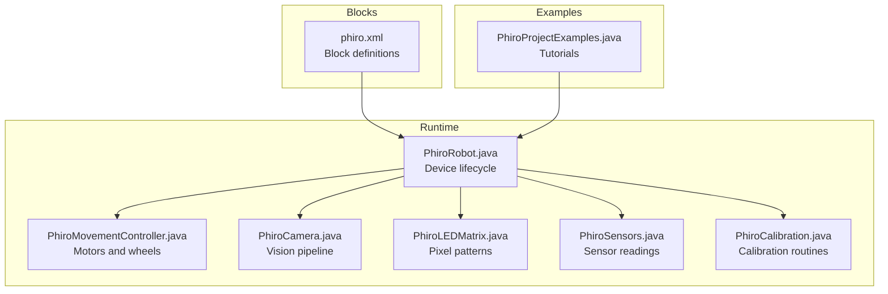
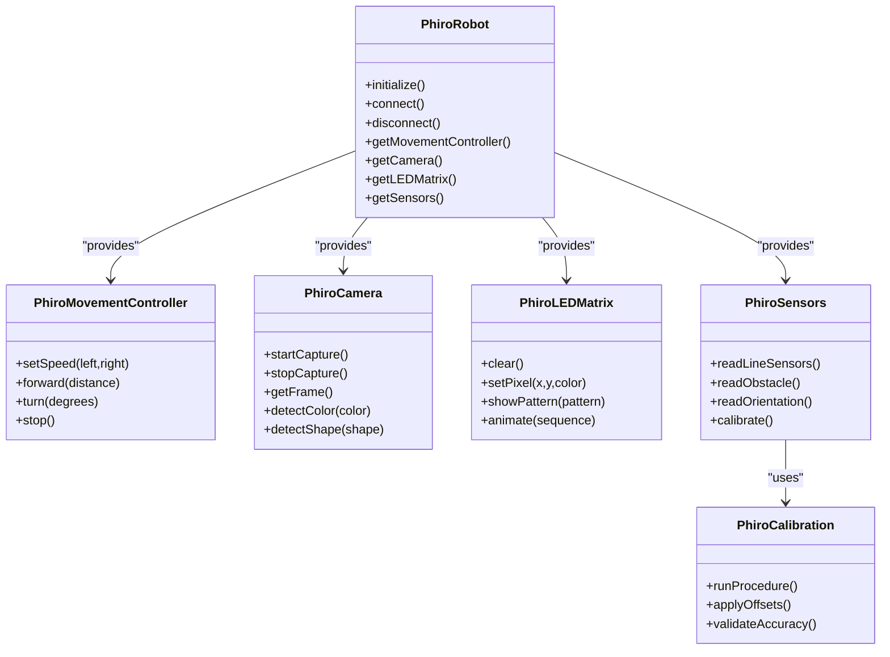
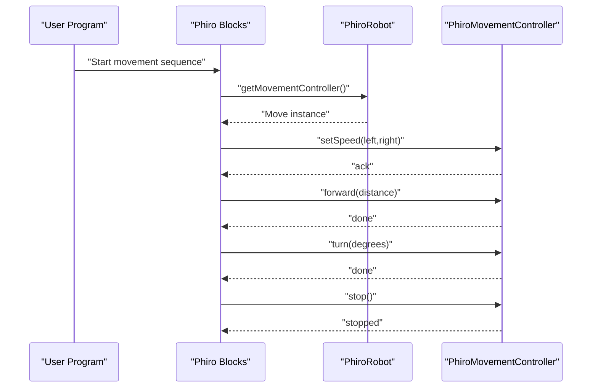
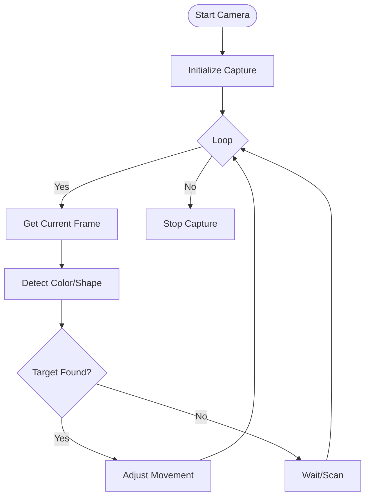
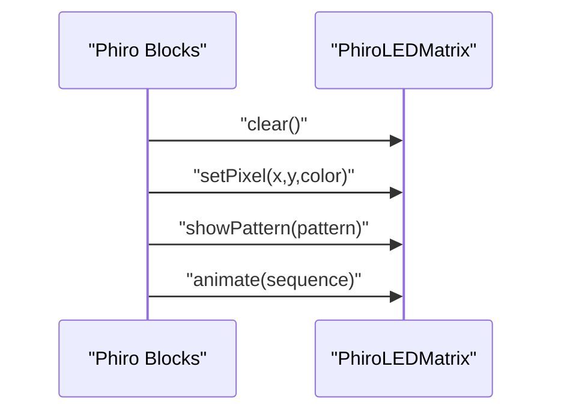
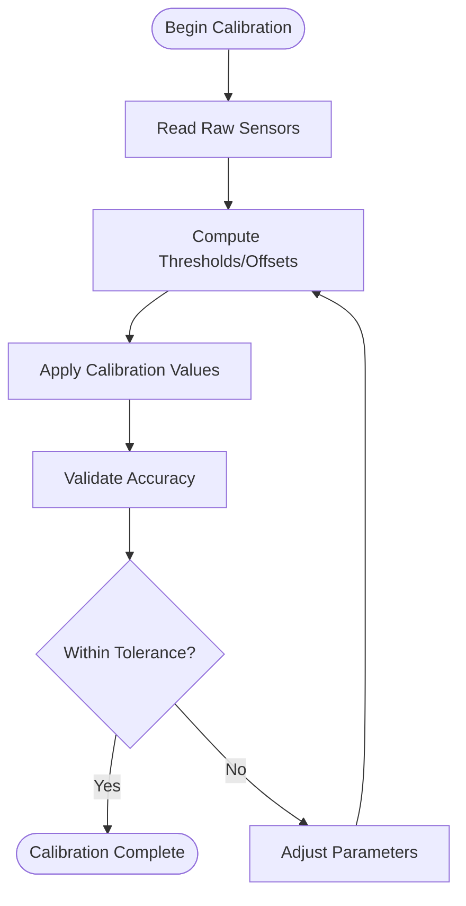
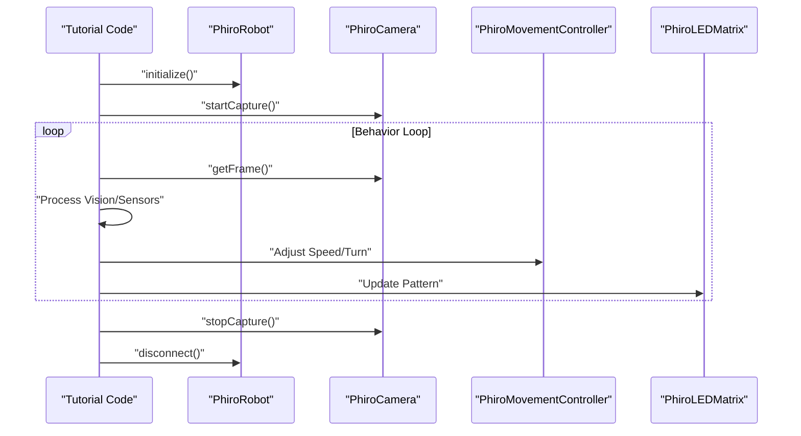
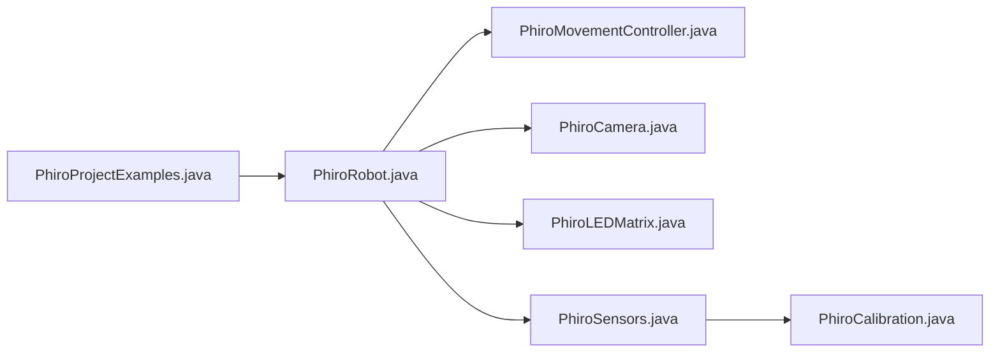

# Phiro Robot Programming

<cite>
**Referenced Files in This Document**
- [README.md](file://README.md)
- [catblocks/phiro.xml](file://catroid/src/main/assets/catblocks/phiro.xml)
- [PhiroRobot.java](file://catroid/src/main/java/org/catrobat/catroid/robotics/phiro/PhiroRobot.java)
- [PhiroCamera.java](file://catroid/src/main/java/org/catrobat/catroid/robotics/phiro/PhiroCamera.java)
- [PhiroLEDMatrix.java](file://catroid/src/main/java/org/catrobat/catroid/robotics/phiro/PhiroLEDMatrix.java)
- [PhiroSensors.java](file://catroid/src/main/java/org/catrobat/catroid/robotics/phiro/PhiroSensors.java)
- [PhiroMovementController.java](file://catroid/src/main/java/org/catrobat/catroid/robotics/phiro/PhiroMovementController.java)
- [PhiroCalibration.java](file://catroid/src/main/java/org/catrobat/catroid/robotics/phiro/PhiroCalibration.java)
- [PhiroProjectExamples.java](file://catroid/src/main/java/org/catrobat/catroid/robotics/phiro/PhiroProjectExamples.java)
</cite>

## Table of Contents
1. [Introduction](#introduction)
2. [Project Structure](#project-structure)
3. [Core Components](#core-components)
4. [Architecture Overview](#architecture-overview)
5. [Detailed Component Analysis](#detailed-component-analysis)
6. [Dependency Analysis](#dependency-analysis)
7. [Performance Considerations](#performance-considerations)
8. [Troubleshooting Guide](#troubleshooting-guide)
9. [Conclusion](#conclusion)
10. [Appendices](#appendices)

## Introduction
This document explains how to program Phiro robots using NewCatroid’s visual programming blocks and runtime. It focuses on Phiro-specific capabilities such as camera-based vision, LED matrix display, and advanced sensors, and provides tutorials for popular projects like face tracking, gesture recognition, and interactive games. It also covers calibration procedures to ensure accurate sensor readings and optimal robot performance.

## Project Structure
NewCatroid organizes Phiro support across several areas:
- Visual block definitions for Phiro are provided in the catblocks assets.
- Runtime classes implement Phiro device control (movement, camera, LEDs, sensors).
- Example projects demonstrate common use cases.

**Diagram sources**
- [catblocks/phiro.xml](file://catroid/src/main/assets/catblocks/phiro.xml)
- [PhiroRobot.java](file://catroid/src/main/java/org/catrobat/catroid/robotics/phiro/PhiroRobot.java)
- [PhiroMovementController.java](file://catroid/src/main/java/org/catrobat/catroid/robotics/phiro/PhiroMovementController.java)
- [PhiroCamera.java](file://catroid/src/main/java/org/catrobat/catroid/robotics/phiro/PhiroCamera.java)
- [PhiroLEDMatrix.java](file://catroid/src/main/java/org/catrobat/catroid/robotics/phiro/PhiroLEDMatrix.java)
- [PhiroSensors.java](file://catroid/src/main/java/org/catrobat/catroid/robotics/phiro/PhiroSensors.java)
- [PhiroCalibration.java](file://catroid/src/main/java/org/catrobat/catroid/robotics/phiro/PhiroCalibration.java)
- [PhiroProjectExamples.java](file://catroid/src/main/java/org/catrobat/catroid/robotics/phiro/PhiroProjectExamples.java)

**Section sources**
- [README.md](file://README.md)
- [catblocks/phiro.xml](file://catroid/src/main/assets/catblocks/phiro.xml)

## Core Components
- PhiroRobot: Central controller that manages connection, initialization, and lifecycle of Phiro subsystems.
- PhiroMovementController: Encapsulates motor commands, wheel speeds, turning, and motion primitives.
- PhiroCamera: Provides image capture, frame access, and basic vision operations used by higher-level features.
- PhiroLEDMatrix: Controls the onboard LED matrix for displaying patterns and animations.
- PhiroSensors: Reads data from onboard sensors (e.g., line-following, obstacle detection, orientation).
- PhiroCalibration: Implements calibration workflows to normalize sensor inputs and improve accuracy.
- PhiroProjectExamples: Contains example programs and step-by-step guidance for common tasks.

Key responsibilities:
- Movement control with smooth acceleration and deceleration.
- Camera-driven behaviors such as color or shape detection.
- LED feedback synchronized with actions.
- Sensor fusion and thresholding for robust behavior.

**Section sources**
- [PhiroRobot.java](file://catroid/src/main/java/org/catrobat/catroid/robotics/phiro/PhiroRobot.java)
- [PhiroMovementController.java](file://catroid/src/main/java/org/catrobat/catroid/robotics/phiro/PhiroMovementController.java)
- [PhiroCamera.java](file://catroid/src/main/java/org/catrobat/catroid/robotics/phiro/PhiroCamera.java)
- [PhiroLEDMatrix.java](file://catroid/src/main/java/org/catrobat/catroid/robotics/phiro/PhiroLEDMatrix.java)
- [PhiroSensors.java](file://catroid/src/main/java/org/catrobat/catroid/robotics/phiro/PhiroSensors.java)
- [PhiroCalibration.java](file://catroid/src/main/java/org/catrobat/catroid/robotics/phiro/PhiroCalibration.java)
- [PhiroProjectExamples.java](file://catroid/src/main/java/org/catrobat/catroid/robotics/phiro/PhiroProjectExamples.java)

## Architecture Overview
The Phiro runtime integrates visual blocks with device drivers through a layered architecture. Blocks invoke high-level APIs exposed by PhiroRobot, which delegates to specialized controllers.

**Diagram sources**
- [PhiroRobot.java](file://catroid/src/main/java/org/catrobat/catroid/robotics/phiro/PhiroRobot.java)
- [PhiroMovementController.java](file://catroid/src/main/java/org/catrobat/catroid/robotics/phiro/PhiroMovementController.java)
- [PhiroCamera.java](file://catroid/src/main/java/org/catrobat/catroid/robotics/phiro/PhiroCamera.java)
- [PhiroLEDMatrix.java](file://catroid/src/main/java/org/catrobat/catroid/robotics/phiro/PhiroLEDMatrix.java)
- [PhiroSensors.java](file://catroid/src/main/java/org/catrobat/catroid/robotics/phiro/PhiroSensors.java)
- [PhiroCalibration.java](file://catroid/src/main/java/org/catrobat/catroid/robotics/phiro/PhiroCalibration.java)

## Detailed Component Analysis

### Movement Control
Movement is handled via PhiroMovementController, which exposes intuitive methods for driving the robot. Typical usage includes setting wheel speeds, moving forward/backward, and turning with specified angles.

**Diagram sources**
- [PhiroRobot.java](file://catroid/src/main/java/org/catrobat/catroid/robotics/phiro/PhiroRobot.java)
- [PhiroMovementController.java](file://catroid/src/main/java/org/catrobat/catroid/robotics/phiro/PhiroMovementController.java)

**Section sources**
- [PhiroMovementController.java](file://catroid/src/main/java/org/catrobat/catroid/robotics/phiro/PhiroMovementController.java)

### Camera Operations
PhiroCamera enables capturing frames and performing simple vision tasks such as color and shape detection. These capabilities power behaviors like line following and object tracking.

**Diagram sources**
- [PhiroCamera.java](file://catroid/src/main/java/org/catrobat/catroid/robotics/phiro/PhiroCamera.java)

**Section sources**
- [PhiroCamera.java](file://catroid/src/main/java/org/catrobat/catroid/robotics/phiro/PhiroCamera.java)

### LED Matrix Display
PhiroLEDMatrix allows drawing pixels and animating patterns to provide user feedback or display messages.

**Diagram sources**
- [PhiroLEDMatrix.java](file://catroid/src/main/java/org/catrobat/catroid/robotics/phiro/PhiroLEDMatrix.java)

**Section sources**
- [PhiroLEDMatrix.java](file://catroid/src/main/java/org/catrobat/catroid/robotics/phiro/PhiroLEDMatrix.java)

### Sensors and Calibration
PhiroSensors reads data from multiple onboard sensors. PhiroCalibration provides routines to calibrate thresholds and offsets for improved accuracy.

**Diagram sources**
- [PhiroSensors.java](file://catroid/src/main/java/org/catrobat/catroid/robotics/phiro/PhiroSensors.java)
- [PhiroCalibration.java](file://catroid/src/main/java/org/catrobat/catroid/robotics/phiro/PhiroCalibration.java)

**Section sources**
- [PhiroSensors.java](file://catroid/src/main/java/org/catrobat/catroid/robotics/phiro/PhiroSensors.java)
- [PhiroCalibration.java](file://catroid/src/main/java/org/catrobat/catroid/robotics/phiro/PhiroCalibration.java)

### Popular Projects Tutorials
Step-by-step guides for common Phiro projects are implemented in PhiroProjectExamples. Each tutorial combines movement, sensors, camera, and LED feedback to create interactive behaviors.

- Face Tracking: Uses camera detection to steer toward faces and displays expressions on the LED matrix.
- Gesture Recognition: Interprets sensor inputs and gestures to trigger actions and animations.
- Interactive Games: Combines obstacle detection, movement, and LED feedback for engaging gameplay.

**Diagram sources**
- [PhiroProjectExamples.java](file://catroid/src/main/java/org/catrobat/catroid/robotics/phiro/PhiroProjectExamples.java)
- [PhiroCamera.java](file://catroid/src/main/java/org/catrobat/catroid/robotics/phiro/PhiroCamera.java)
- [PhiroMovementController.java](file://catroid/src/main/java/org/catrobat/catroid/robotics/phiro/PhiroMovementController.java)
- [PhiroLEDMatrix.java](file://catroid/src/main/java/org/catrobat/catroid/robotics/phiro/PhiroLEDMatrix.java)

**Section sources**
- [PhiroProjectExamples.java](file://catroid/src/main/java/org/catrobat/catroid/robotics/phiro/PhiroProjectExamples.java)

## Dependency Analysis
Phiro components exhibit clear separation of concerns:
- PhiroRobot orchestrates subsystems and exposes unified APIs.
- Controllers depend on PhiroRobot but not on each other directly.
- Calibration depends on sensors; examples depend on all subsystems.

**Diagram sources**
- [PhiroRobot.java](file://catroid/src/main/java/org/catrobat/catroid/robotics/phiro/PhiroRobot.java)
- [PhiroMovementController.java](file://catroid/src/main/java/org/catrobat/catroid/robotics/phiro/PhiroMovementController.java)
- [PhiroCamera.java](file://catroid/src/main/java/org/catrobat/catroid/robotics/phiro/PhiroCamera.java)
- [PhiroLEDMatrix.java](file://catroid/src/main/java/org/catrobat/catroid/robotics/phiro/PhiroLEDMatrix.java)
- [PhiroSensors.java](file://catroid/src/main/java/org/catrobat/catroid/robotics/phiro/PhiroSensors.java)
- [PhiroCalibration.java](file://catroid/src/main/java/org/catrobat/catroid/robotics/phiro/PhiroCalibration.java)
- [PhiroProjectExamples.java](file://catroid/src/main/java/org/catrobat/catroid/robotics/phiro/PhiroProjectExamples.java)

**Section sources**
- [PhiroRobot.java](file://catroid/src/main/java/org/catrobat/catroid/robotics/phiro/PhiroRobot.java)
- [PhiroProjectExamples.java](file://catroid/src/main/java/org/catrobat/catroid/robotics/phiro/PhiroProjectExamples.java)

## Performance Considerations
- Limit camera processing frequency to balance responsiveness and CPU load.
- Use calibrated sensor thresholds to reduce false positives and unnecessary corrections.
- Prefer batched LED updates to minimize rendering overhead.
- Smooth acceleration profiles improve stability and battery life.

[No sources needed since this section provides general guidance]

## Troubleshooting Guide
Common issues and resolutions:
- Connection failures: Ensure proper initialization and reconnection logic in PhiroRobot.
- Erratic movement: Verify calibration values and adjust speed limits.
- Poor detection accuracy: Re-run calibration and refine thresholds in PhiroSensors.
- LED flicker: Consolidate pixel updates and avoid excessive redraws.

**Section sources**
- [PhiroRobot.java](file://catroid/src/main/java/org/catrobat/catroid/robotics/phiro/PhiroRobot.java)
- [PhiroCalibration.java](file://catroid/src/main/java/org/catrobat/catroid/robotics/phiro/PhiroCalibration.java)
- [PhiroSensors.java](file://catroid/src/main/java/org/catrobat/catroid/robotics/phiro/PhiroSensors.java)
- [PhiroLEDMatrix.java](file://catroid/src/main/java/org/catrobat/catroid/robotics/phiro/PhiroLEDMatrix.java)

## Conclusion
NewCatroid’s Phiro integration provides a cohesive set of blocks and runtime APIs for movement, vision, LED feedback, and sensor interactions. By leveraging calibration routines and structured project examples, users can build robust behaviors such as face tracking, gesture recognition, and interactive games. The modular architecture supports extensibility and maintainability while keeping complexity accessible for learners.

[No sources needed since this section summarizes without analyzing specific files]

## Appendices
- Block Reference: See phiro.xml for available Phiro blocks and parameters.
- API Quick Start: Initialize PhiroRobot, then access controllers for movement, camera, LEDs, and sensors.
- Example Gallery: Explore PhiroProjectExamples for complete tutorials and inspiration.

**Section sources**
- [catblocks/phiro.xml](file://catroid/src/main/assets/catblocks/phiro.xml)
- [PhiroProjectExamples.java](file://catroid/src/main/java/org/catrobat/catroid/robotics/phiro/PhiroProjectExamples.java)