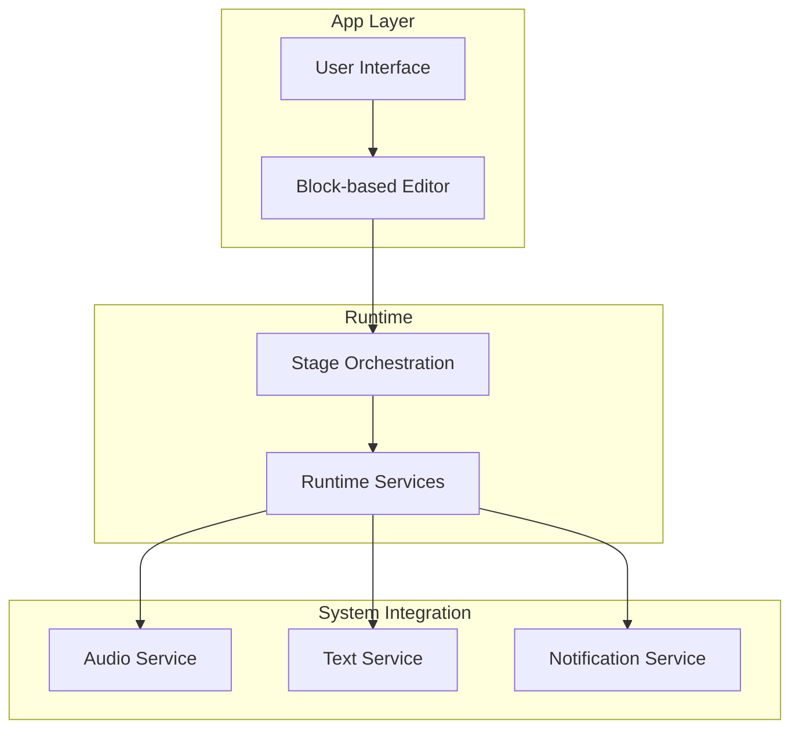
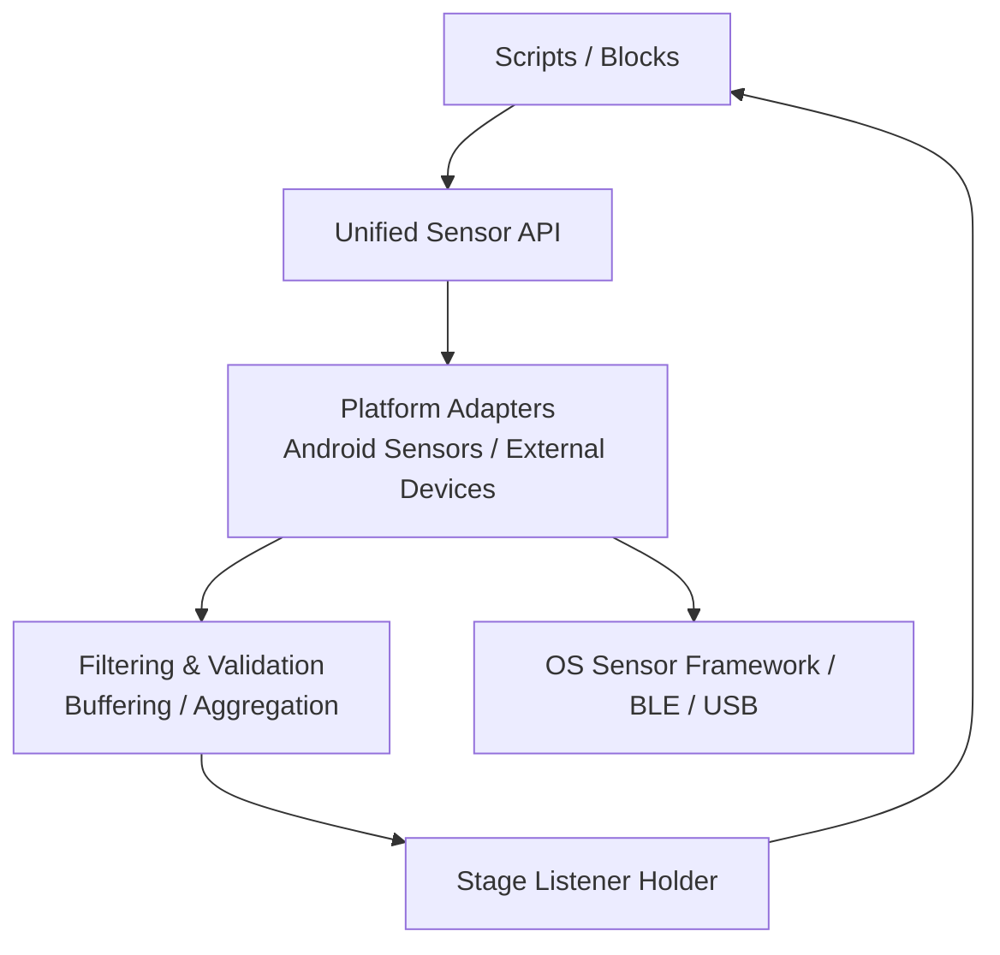
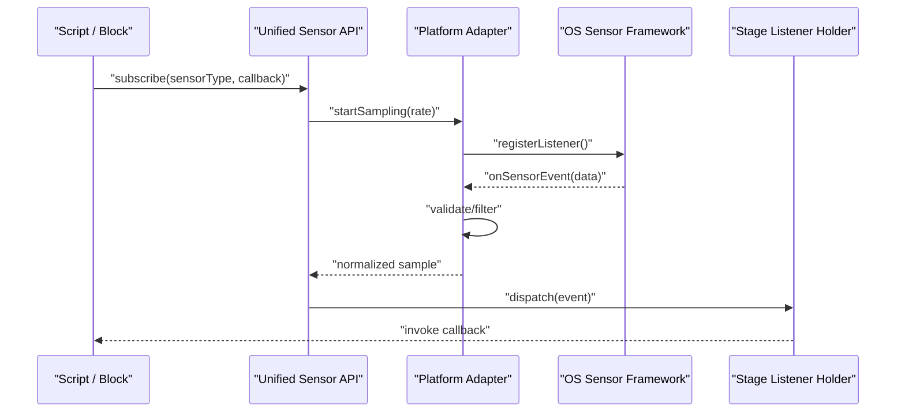
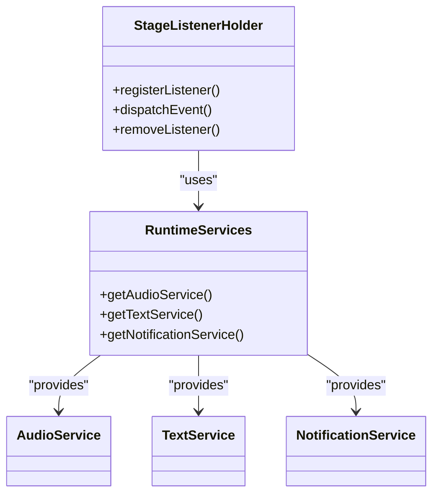
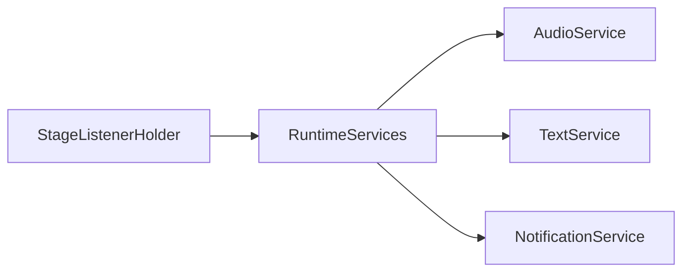

# Sensor Programming Guide

<cite>
**Referenced Files in This Document**
- [README.md](file://README.md)
- [Jenkinsfile.SensorboxTests](file://Jenkinsfile.SensorboxTests)
- [catroid/src/main/java/org/catrobat/catroid/stage/StageListenerHolder.kt](file://catroid/src/main/java/org/catrobat/catroid/stage/StageListenerHolder.kt)
- [core/src/main/java/org/catrobat/catroid/runtime/RuntimeServices.kt](file://core/src/main/java/org/catrobat/catroid/runtime/RuntimeServices.kt)
- [core/src/main/java/org/catrobat/catroid/audio/AudioService.kt](file://core/src/main/java/org/catrobat/catroid/audio/AudioService.kt)
- [core/src/main/java/org/catrobat/catroid/text/TextService.kt](file://core/src/main/java/org/catrobat/catroid/text/TextService.kt)
- [core/src/main/java/org/catrobat/catroid/notification/NotificationService.kt](file://core/src/main/java/org/catrobat/catroid/notification/NotificationService.kt)
</cite>

## Table of Contents
1. Introduction
2. Project Structure
3. Core Components
4. Architecture Overview
5. Detailed Component Analysis
6. Dependency Analysis
7. Performance Considerations
8. Troubleshooting Guide
9. Conclusion

## Introduction
This guide explains sensor programming across supported hardware platforms in NewCatroid. It focuses on a unified sensor API that abstracts differences between various sensor types and manufacturers, real-time data acquisition, filtering, and processing techniques, event-driven patterns with callbacks, calibration and validation practices, error handling strategies, and performance optimization for high-frequency polling and efficient pipelines. The content is designed to be accessible to both newcomers and experienced developers.

## Project Structure
NewCatroid organizes platform-specific runtime behavior under the catroid module and shared services under core. Sensor-related integration typically resides within stage orchestration and runtime service holders, while audio and text services provide examples of how system-level subsystems are exposed to the application layer.

[No sources needed since this diagram shows conceptual workflow, not actual code structure]

**Section sources**
- [README.md](file://README.md)

## Core Components
The following components form the foundation for sensor integration:

- Stage Listener Holder: Centralizes lifecycle and event coordination for the stage, which is where sensor events can be dispatched to blocks and scripts.
- Runtime Services: Provides access to cross-cutting capabilities (e.g., audio, text, notifications) that may be used by sensor-driven logic or feedback loops.
- Platform Services (Audio, Text, Notification): Illustrate how system-level subsystems are encapsulated and exposed via service holders.

These components collectively enable an event-driven architecture suitable for sensor input, allowing sensors to trigger block execution and update UI state without blocking the main thread.

**Section sources**
- [catroid/src/main/java/org/catrobat/catroid/stage/StageListenerHolder.kt](file://catroid/src/main/java/org/catrobat/catroid/stage/StageListenerHolder.kt)
- [core/src/main/java/org/catrobat/catroid/runtime/RuntimeServices.kt](file://core/src/main/java/org/catrobat/catroid/runtime/RuntimeServices.kt)
- [core/src/main/java/org/catrobat/catroid/audio/AudioService.kt](file://core/src/main/java/org/catrobat/catroid/audio/AudioService.kt)
- [core/src/main/java/org/catrobat/catroid/text/TextService.kt](file://core/src/main/java/org/catrobat/catroid/text/TextService.kt)
- [core/src/main/java/org/catrobat/catroid/notification/NotificationService.kt](file://core/src/main/java/org/catrobat/catroid/notification/NotificationService.kt)

## Architecture Overview
A unified sensor API should present a consistent interface to the editor and runtime, regardless of underlying hardware. The recommended architecture separates concerns into layers:

- Abstraction Layer: Defines common sensor types (temperature, accelerometer, gyroscope, light, analog/digital), units, sampling rates, and event contracts.
- Adapter Layer: Implements platform-specific drivers (Android sensors, external devices via Bluetooth/USB).
- Pipeline Layer: Handles buffering, filtering, validation, and aggregation before dispatching events.
- Event Dispatch: Integrates with the stage listener holder to notify scripts and update UI.

[No sources needed since this diagram shows conceptual workflow, not actual code structure]

## Detailed Component Analysis

### Unified Sensor API Design
The unified API should expose:
- Sensor discovery and capability queries
- Start/stop sampling with configurable rate
- Data read methods returning normalized values and timestamps
- Event subscription for real-time updates
- Calibration helpers and metadata access

Recommended abstractions:
- SensorType enum: temperature, acceleration, rotation, light, analog, digital
- SensorData model: value(s), unit, timestamp, quality flags
- Callback interfaces: onSample, onError, onCalibrationComplete

Implementation guidance:
- Use a factory pattern to instantiate adapters per device type
- Provide default no-op implementations for unsupported sensors
- Ensure thread-safe access to shared buffers and state

[No sources needed since this section provides general guidance]

### Real-Time Acquisition and Event-Driven Patterns
Event-driven programming is essential for responsive sensor applications:
- Subscribe to sensor events at initialization
- Process samples asynchronously to avoid blocking UI
- Debounce or throttle high-frequency streams when necessary
- Propagate events through the stage listener holder to trigger block execution

Sequence of operations:
- Initialize adapter and request permissions
- Register listeners and start sampling
- On each sample, validate and filter
- Emit events to the stage for script execution
- Handle errors and resource cleanup on stop

[No sources needed since this diagram shows conceptual workflow, not actual code structure]

### Filtering and Processing Techniques
Common techniques include:
- Moving average and exponential smoothing for noise reduction
- Outlier detection using z-score or median absolute deviation
- Rate limiting and batching to reduce overhead
- Unit conversion and coordinate frame normalization

Pipeline considerations:
- Maintain fixed-size circular buffers for sliding windows
- Apply filters on worker threads and marshal results back to UI thread
- Preserve timestamps for synchronization with other inputs

[No sources needed since this section provides general guidance]

### Examples by Sensor Type
- Temperature sensors:
  - Normalize readings to Celsius
  - Apply moving average over short windows
  - Trigger alerts when thresholds are exceeded
- Accelerometers:
  - Compute magnitude from x/y/z axes
  - Detect taps or shakes via thresholding
  - Coordinate transformation if needed
- Gyroscopes:
  - Integrate angular velocity for orientation estimates
  - Apply drift correction and low-pass filtering
- Light sensors:
  - Log ambient levels and detect sudden changes
  - Smooth readings to avoid flicker
- Custom analog/digital sensors:
  - Map raw ADC values to physical units using calibration curves
  - Validate ranges and flag invalid states

[No sources needed since this section provides general guidance]

### Calibration, Validation, and Error Handling
Calibration guidelines:
- Perform multi-point calibration for non-linear sensors
- Store calibration coefficients and version metadata
- Re-calibrate on significant environmental changes

Validation rules:
- Check min/max bounds and monotonicity where applicable
- Flag stale or missing data based on timestamps
- Reject samples with low confidence or high variance

Error handling:
- Gracefully degrade when sensors are unavailable
- Retry connection with backoff for external devices
- Notify users via notifications or UI feedback

[No sources needed since this section provides general guidance]

### Integration with Stage and Runtime Services
Leverage existing service holders to integrate sensor-driven actions:
- Use stage listener holder to broadcast sensor events to scripts
- Combine sensor data with audio cues or text outputs
- Post notifications for important events (e.g., threshold breaches)

**Diagram sources**
- [catroid/src/main/java/org/catrobat/catroid/stage/StageListenerHolder.kt](file://catroid/src/main/java/org/catrobat/catroid/stage/StageListenerHolder.kt)
- [core/src/main/java/org/catrobat/catroid/runtime/RuntimeServices.kt](file://core/src/main/java/org/catrobat/catroid/runtime/RuntimeServices.kt)
- [core/src/main/java/org/catrobat/catroid/audio/AudioService.kt](file://core/src/main/java/org/catrobat/catroid/audio/AudioService.kt)
- [core/src/main/java/org/catrobat/catroid/text/TextService.kt](file://core/src/main/java/org/catrobat/catroid/text/TextService.kt)
- [core/src/main/java/org/catrobat/catroid/notification/NotificationService.kt](file://core/src/main/java/org/catrobat/catroid/notification/NotificationService.kt)

**Section sources**
- [catroid/src/main/java/org/catrobat/catroid/stage/StageListenerHolder.kt](file://catroid/src/main/java/org/catrobat/catroid/stage/StageListenerHolder.kt)
- [core/src/main/java/org/catrobat/catroid/runtime/RuntimeServices.kt](file://core/src/main/java/org/catrobat/catroid/runtime/RuntimeServices.kt)
- [core/src/main/java/org/catrobat/catroid/audio/AudioService.kt](file://core/src/main/java/org/catrobat/catroid/audio/AudioService.kt)
- [core/src/main/java/org/catrobat/catroid/text/TextService.kt](file://core/src/main/java/org/catrobat/catroid/text/TextService.kt)
- [core/src/main/java/org/catrobat/catroid/notification/NotificationService.kt](file://core/src/main/java/org/catrobat/catroid/notification/NotificationService.kt)

## Dependency Analysis
At a high level, sensor integration depends on:
- Stage orchestration for event propagation
- Runtime services for auxiliary capabilities
- Platform sensor frameworks or external device stacks

**Diagram sources**
- [catroid/src/main/java/org/catrobat/catroid/stage/StageListenerHolder.kt](file://catroid/src/main/java/org/catrobat/catroid/stage/StageListenerHolder.kt)
- [core/src/main/java/org/catrobat/catroid/runtime/RuntimeServices.kt](file://core/src/main/java/org/catrobat/catroid/runtime/RuntimeServices.kt)
- [core/src/main/java/org/catrobat/catroid/audio/AudioService.kt](file://core/src/main/java/org/catrobat/catroid/audio/AudioService.kt)
- [core/src/main/java/org/catrobat/catroid/text/TextService.kt](file://core/src/main/java/org/catrobat/catroid/text/TextService.kt)
- [core/src/main/java/org/catrobat/catroid/notification/NotificationService.kt](file://core/src/main/java/org/catrobat/catroid/notification/NotificationService.kt)

**Section sources**
- [catroid/src/main/java/org/catrobat/catroid/stage/StageListenerHolder.kt](file://catroid/src/main/java/org/catrobat/catroid/stage/StageListenerHolder.kt)
- [core/src/main/java/org/catrobat/catroid/runtime/RuntimeServices.kt](file://core/src/main/java/org/catrobat/catroid/runtime/RuntimeServices.kt)
- [core/src/main/java/org/catrobat/catroid/audio/AudioService.kt](file://core/src/main/java/org/catrobat/catroid/audio/AudioService.kt)
- [core/src/main/java/org/catrobat/catroid/text/TextService.kt](file://core/src/main/java/org/catrobat/catroid/text/TextService.kt)
- [core/src/main/java/org/catrobat/catroid/notification/NotificationService.kt](file://core/src/main/java/org/catrobat/catroid/notification/NotificationService.kt)

## Performance Considerations
Optimization strategies for high-frequency sensor polling and efficient processing:
- Batch samples and process in chunks to reduce context switching
- Use ring buffers and lock-free queues where appropriate
- Apply adaptive sampling rates based on activity or battery constraints
- Offload heavy computations to background threads and marshal lightweight results to UI
- Avoid allocations inside hot paths; reuse objects and pre-allocate buffers
- Implement backpressure to prevent queue overflow during spikes

[No sources needed since this section provides general guidance]

## Troubleshooting Guide
Common issues and resolutions:
- Permission denied: Ensure required sensor permissions are requested and granted at runtime
- No data received: Verify sensor availability and driver initialization; fall back gracefully
- High CPU usage: Reduce sampling rate, increase filtering window size, or switch to event-driven updates
- Stale data: Validate timestamps and discard outdated samples
- Device disconnects: Implement reconnection logic with exponential backoff and user notification

[No sources needed since this section provides general guidance]

## Conclusion
By adopting a layered architecture with a unified sensor API, robust filtering and validation, and event-driven integration through the stage listener holder, NewCatroid can support diverse sensors across platforms consistently. Following the calibration, validation, error handling, and performance guidelines outlined here will help deliver responsive, accurate, and energy-efficient sensor experiences.

[No sources needed since this section summarizes without analyzing specific files]