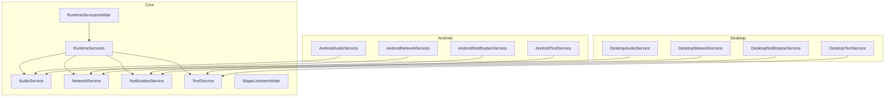
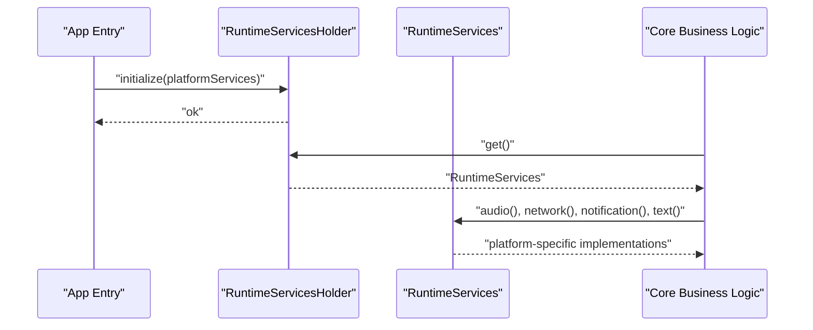
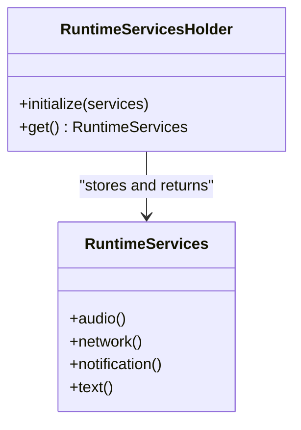
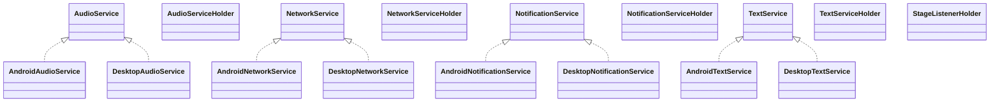
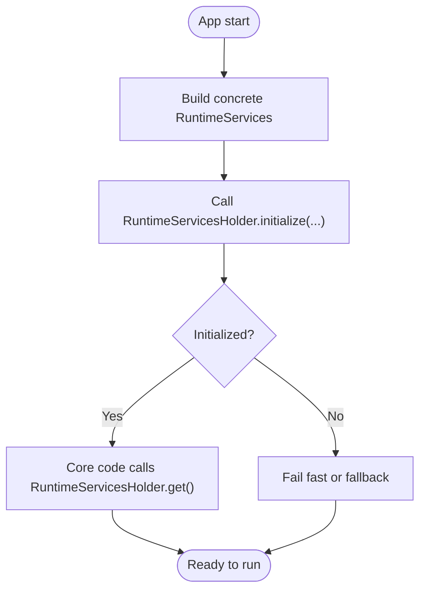
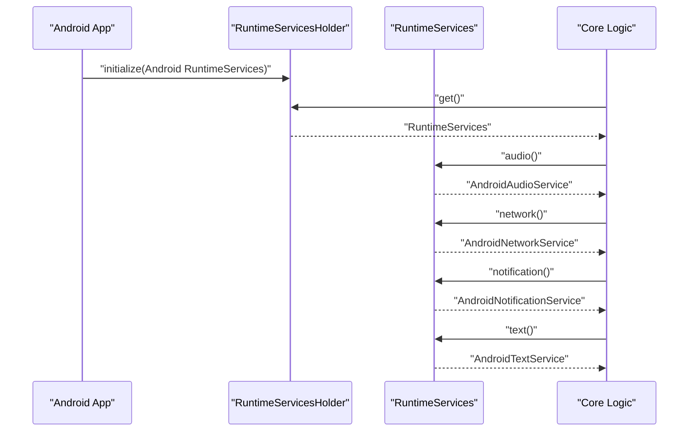
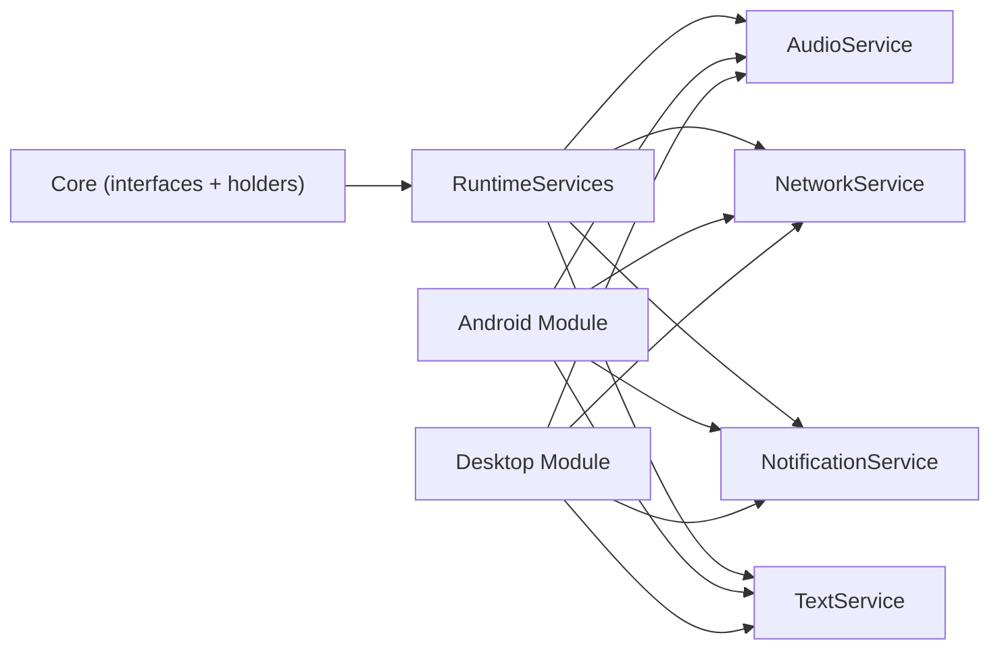

# Cross-Platform Runtime Architecture

<cite>
**Referenced Files in This Document**
- [RuntimeServices.kt](file://core/src/main/java/org/catrobat/catroid/runtime/RuntimeServices.kt)
- [RuntimeServicesHolder.kt](file://core/src/main/java/org/catrobat/catroid/runtime/RuntimeServicesHolder.kt)
- [AudioService.kt](file://core/src/main/java/org/catrobat/catroid/audio/AudioService.kt)
- [AudioServiceHolder.kt](file://core/src/main/java/org/catrobat/catroid/audio/AudioServiceHolder.kt)
- [MidiService.kt](file://core/src/main/java/org/catrobat/catroid/audio/MidiService.kt)
- [MidiServiceHolder.kt](file://core/src/main/java/org/catrobat/catroid/audio/MidiServiceHolder.kt)
- [NetworkService.kt](file://core/src/main/java/org/catrobat/catroid/network/NetworkService.kt)
- [NetworkServiceHolder.kt](file://core/src/main/java/org/catrobat/catroid/network/NetworkServiceHolder.kt)
- [NotificationService.kt](file://core/src/main/java/org/catrobat/catroid/notification/NotificationService.kt)
- [NotificationServiceHolder.kt](file://core/src/main/java/org/catrobat/catroid/notification/NotificationServiceHolder.kt)
- [TextService.kt](file://core/src/main/java/org/catrobat/catroid/text/TextService.kt)
- [TextServiceHolder.kt](file://core/src/main/java/org/catrobat/catroid/text/TextServiceHolder.kt)
- [StageListenerHolder.kt](file://core/src/main/java/org/catrobat/catroid/stage/StageListenerHolder.kt)
- [Desktop Audio Service](file://desktop-runtime/src/main/java/org/catrobat/catroid/audio/DesktopAudioService.kt)
- [Desktop Network Service](file://desktop-runtime/src/main/java/org/catrobat/catroid/network/DesktopNetworkService.kt)
- [Desktop Notification Service](file://desktop-runtime/src/main/java/org/catrobat/catroid/notification/DesktopNotificationService.kt)
- [Desktop Text Service](file://desktop-runtime/src/main/java/org/catrobat/catroid/text/DesktopTextService.kt)
- [Android Audio Service](file://catroid/src/main/java/org/catrobat/catroid/audio/AndroidAudioService.java)
- [Android Network Service](file://catroid/src/main/java/org/catrobat/catroid/network/AndroidNetworkService.java)
- [Android Notification Service](file://catroid/src/main/java/org/catrobat/catroid/notification/AndroidNotificationService.java)
- [Android Text Service](file://catroid/src/main/java/org/catrobat/catroid/text/AndroidTextService.java)
</cite>

## Table of Contents
1. [Introduction](#introduction)
2. [Project Structure](#project-structure)
3. [Core Components](#core-components)
4. [Architecture Overview](#architecture-overview)
5. [Detailed Component Analysis](#detailed-component-analysis)
6. [Dependency Analysis](#dependency-analysis)
7. [Performance Considerations](#performance-considerations)
8. [Troubleshooting Guide](#troubleshooting-guide)
9. [Conclusion](#conclusion)

## Introduction
This document explains NewCatroid’s cross-platform runtime architecture with a focus on the service locator pattern implemented via RuntimeServices and RuntimeServicesHolder. It describes how the core module provides platform-agnostic business logic while Android and desktop modules implement platform-specific behaviors. The document covers project lifecycle management, initialization sequences, dependency injection mechanisms, and examples of registering, retrieving, and managing services across platforms. It also details the abstraction layers that enable code sharing between Android and desktop implementations.

## Project Structure
NewCatroid is organized into:
- core: Platform-agnostic interfaces and service holders for audio, network, notifications, text, and stage listeners.
- catroid (Android): Android-specific service implementations.
- desktop-runtime (Desktop): Desktop-specific service implementations.

**Diagram sources**
- [RuntimeServices.kt](file://core/src/main/java/org/catrobat/catroid/runtime/RuntimeServices.kt)
- [RuntimeServicesHolder.kt](file://core/src/main/java/org/catrobat/catroid/runtime/RuntimeServicesHolder.kt)
- [AudioService.kt](file://core/src/main/java/org/catrobat/catroid/audio/AudioService.kt)
- [NetworkService.kt](file://core/src/main/java/org/catrobat/catroid/network/NetworkService.kt)
- [NotificationService.kt](file://core/src/main/java/org/catrobat/catroid/notification/NotificationService.kt)
- [TextService.kt](file://core/src/main/java/org/catrobat/catroid/text/TextService.kt)
- [Android Audio Service](file://catroid/src/main/java/org/catrobat/catroid/audio/AndroidAudioService.java)
- [Android Network Service](file://catroid/src/main/java/org/catrobat/catroid/network/AndroidNetworkService.java)
- [Android Notification Service](file://catroid/src/main/java/org/catrobat/catroid/notification/AndroidNotificationService.java)
- [Android Text Service](file://catroid/src/main/java/org/catrobat/catroid/text/AndroidTextService.java)
- [Desktop Audio Service](file://desktop-runtime/src/main/java/org/catrobat/catroid/audio/DesktopAudioService.kt)
- [Desktop Network Service](file://desktop-runtime/src/main/java/org/catrobat/catroid/network/DesktopNetworkService.kt)
- [Desktop Notification Service](file://desktop-runtime/src/main/java/org/catrobat/catroid/notification/DesktopNotificationService.kt)
- [Desktop Text Service](file://desktop-runtime/src/main/java/org/catrobat/catroid/text/DesktopTextService.kt)

**Section sources**
- [RuntimeServices.kt](file://core/src/main/java/org/catrobat/catroid/runtime/RuntimeServices.kt)
- [RuntimeServicesHolder.kt](file://core/src/main/java/org/catrobat/catroid/runtime/RuntimeServicesHolder.kt)

## Core Components
The core module defines service interfaces and their holders:
- RuntimeServices: Central registry exposing typed accessors for platform services such as audio, network, notifications, and text.
- RuntimeServicesHolder: Global holder that stores and returns the active RuntimeServices instance.
- Service interfaces and holders:
  - AudioService and AudioServiceHolder
  - MidiService and MidiServiceHolder
  - NetworkService and NetworkServiceHolder
  - NotificationService and NotificationServiceHolder
  - TextService and TextServiceHolder
  - StageListenerHolder

These components form the abstraction layer used by both Android and desktop implementations.

**Section sources**
- [RuntimeServices.kt](file://core/src/main/java/org/catrobat/catroid/runtime/RuntimeServices.kt)
- [RuntimeServicesHolder.kt](file://core/src/main/java/org/catrobat/catroid/runtime/RuntimeServicesHolder.kt)
- [AudioService.kt](file://core/src/main/java/org/catrobat/catroid/audio/AudioService.kt)
- [AudioServiceHolder.kt](file://core/src/main/java/org/catrobat/catroid/audio/AudioServiceHolder.kt)
- [MidiService.kt](file://core/src/main/java/org/catrobat/catroid/audio/MidiService.kt)
- [MidiServiceHolder.kt](file://core/src/main/java/org/catrobat/catroid/audio/MidiServiceHolder.kt)
- [NetworkService.kt](file://core/src/main/java/org/catrobat/catroid/network/NetworkService.kt)
- [NetworkServiceHolder.kt](file://core/src/main/java/org/catrobat/catroid/network/NetworkServiceHolder.kt)
- [NotificationService.kt](file://core/src/main/java/org/catrobat/catroid/notification/NotificationService.kt)
- [NotificationServiceHolder.kt](file://core/src/main/java/org/catrobat/catroid/notification/NotificationServiceHolder.kt)
- [TextService.kt](file://core/src/main/java/org/catrobat/catroid/text/TextService.kt)
- [TextServiceHolder.kt](file://core/src/main/java/org/catrobat/catroid/text/TextServiceHolder.kt)
- [StageListenerHolder.kt](file://core/src/main/java/org/catrobat/catroid/stage/StageListenerHolder.kt)

## Architecture Overview
The runtime uses a service locator pattern to decouple platform-agnostic business logic from platform-specific implementations. At startup, each platform initializes its own RuntimeServices implementation and registers it via RuntimeServicesHolder. Business logic in core depends only on interfaces exposed by RuntimeServices, enabling seamless switching between Android and desktop without changes to core code.

**Diagram sources**
- [RuntimeServicesHolder.kt](file://core/src/main/java/org/catrobat/catroid/runtime/RuntimeServicesHolder.kt)
- [RuntimeServices.kt](file://core/src/main/java/org/catrobat/catroid/runtime/RuntimeServices.kt)

## Detailed Component Analysis

### Service Locator Pattern: RuntimeServices and RuntimeServicesHolder
- RuntimeServices exposes typed getters for all platform services.
- RuntimeServicesHolder maintains a singleton reference to the active RuntimeServices instance.
- Typical usage:
  - Registration: Platform entry points call RuntimeServicesHolder.initialize(...) with a concrete RuntimeServices.
  - Retrieval: Core code calls RuntimeServicesHolder.get() to obtain the current RuntimeServices and then accesses services through it.

**Diagram sources**
- [RuntimeServices.kt](file://core/src/main/java/org/catrobat/catroid/runtime/RuntimeServices.kt)
- [RuntimeServicesHolder.kt](file://core/src/main/java/org/catrobat/catroid/runtime/RuntimeServicesHolder.kt)

**Section sources**
- [RuntimeServices.kt](file://core/src/main/java/org/catrobat/catroid/runtime/RuntimeServices.kt)
- [RuntimeServicesHolder.kt](file://core/src/main/java/org/catrobat/catroid/runtime/RuntimeServicesHolder.kt)

### Abstraction Layer: Service Interfaces and Holders
Each capability is modeled as an interface plus a small holder:
- AudioService / AudioServiceHolder
- MidiService / MidiServiceHolder
- NetworkService / NetworkServiceHolder
- NotificationService / NotificationServiceHolder
- TextService / TextServiceHolder
- StageListenerHolder

These abstractions allow core logic to remain independent of platform specifics.

**Diagram sources**
- [AudioService.kt](file://core/src/main/java/org/catrobat/catroid/audio/AudioService.kt)
- [AudioServiceHolder.kt](file://core/src/main/java/org/catrobat/catroid/audio/AudioServiceHolder.kt)
- [NetworkService.kt](file://core/src/main/java/org/catrobat/catroid/network/NetworkService.kt)
- [NetworkServiceHolder.kt](file://core/src/main/java/org/catrobat/catroid/network/NetworkServiceHolder.kt)
- [NotificationService.kt](file://core/src/main/java/org/catrobat/catroid/notification/NotificationService.kt)
- [NotificationServiceHolder.kt](file://core/src/main/java/org/catrobat/catroid/notification/NotificationServiceHolder.kt)
- [TextService.kt](file://core/src/main/java/org/catrobat/catroid/text/TextService.kt)
- [TextServiceHolder.kt](file://core/src/main/java/org/catrobat/catroid/text/TextServiceHolder.kt)
- [StageListenerHolder.kt](file://core/src/main/java/org/catrobat/catroid/stage/StageListenerHolder.kt)
- [Android Audio Service](file://catroid/src/main/java/org/catrobat/catroid/audio/AndroidAudioService.java)
- [Desktop Audio Service](file://desktop-runtime/src/main/java/org/catrobat/catroid/audio/DesktopAudioService.kt)
- [Android Network Service](file://catroid/src/main/java/org/catrobat/catroid/network/AndroidNetworkService.java)
- [Desktop Network Service](file://desktop-runtime/src/main/java/org/catrobat/catroid/network/DesktopNetworkService.kt)
- [Android Notification Service](file://catroid/src/main/java/org/catrobat/catroid/notification/AndroidNotificationService.java)
- [Desktop Notification Service](file://desktop-runtime/src/main/java/org/catrobat/catroid/notification/DesktopNotificationService.kt)
- [Android Text Service](file://catroid/src/main/java/org/catrobat/catroid/text/AndroidTextService.java)
- [Desktop Text Service](file://desktop-runtime/src/main/java/org/catrobat/catroid/text/DesktopTextService.kt)

**Section sources**
- [AudioService.kt](file://core/src/main/java/org/catrobat/catroid/audio/AudioService.kt)
- [AudioServiceHolder.kt](file://core/src/main/java/org/catrobat/catroid/audio/AudioServiceHolder.kt)
- [NetworkService.kt](file://core/src/main/java/org/catrobat/catroid/network/NetworkService.kt)
- [NetworkServiceHolder.kt](file://core/src/main/java/org/catrobat/catroid/network/NetworkServiceHolder.kt)
- [NotificationService.kt](file://core/src/main/java/org/catrobat/catroid/notification/NotificationService.kt)
- [NotificationServiceHolder.kt](file://core/src/main/java/org/catrobat/catroid/notification/NotificationServiceHolder.kt)
- [TextService.kt](file://core/src/main/java/org/catrobat/catroid/text/TextService.kt)
- [TextServiceHolder.kt](file://core/src/main/java/org/catrobat/catroid/text/TextServiceHolder.kt)
- [StageListenerHolder.kt](file://core/src/main/java/org/catrobat/catroid/stage/StageListenerHolder.kt)

### Lifecycle Management and Initialization Sequences
Initialization flow:
1. Platform entry point constructs a concrete RuntimeServices implementation.
2. Platform entry point calls RuntimeServicesHolder.initialize(...).
3. Core modules retrieve services via RuntimeServicesHolder.get().

**Diagram sources**
- [RuntimeServicesHolder.kt](file://core/src/main/java/org/catrobat/catroid/runtime/RuntimeServicesHolder.kt)
- [RuntimeServices.kt](file://core/src/main/java/org/catrobat/catroid/runtime/RuntimeServices.kt)

**Section sources**
- [RuntimeServicesHolder.kt](file://core/src/main/java/org/catrobat/catroid/runtime/RuntimeServicesHolder.kt)
- [RuntimeServices.kt](file://core/src/main/java/org/catrobat/catroid/runtime/RuntimeServices.kt)

### Dependency Injection Mechanisms
- No external DI framework is required; the service locator pattern acts as a simple DI mechanism.
- Registration occurs once at app startup per platform.
- Retrieval is global and type-safe via RuntimeServices getters.

Examples:
- Registering services: Platform entry calls RuntimeServicesHolder.initialize(concreteServices).
- Retrieving services: Core code calls RuntimeServicesHolder.get().audio(), .network(), .notification(), .text().

**Section sources**
- [RuntimeServicesHolder.kt](file://core/src/main/java/org/catrobat/catroid/runtime/RuntimeServicesHolder.kt)
- [RuntimeServices.kt](file://core/src/main/java/org/catrobat/catroid/runtime/RuntimeServices.kt)

### Examples Across Platforms

#### Android Example
- AndroidAudioService implements AudioService.
- AndroidNetworkService implements NetworkService.
- AndroidNotificationService implements NotificationService.
- AndroidTextService implements TextService.

**Diagram sources**
- [RuntimeServicesHolder.kt](file://core/src/main/java/org/catrobat/catroid/runtime/RuntimeServicesHolder.kt)
- [RuntimeServices.kt](file://core/src/main/java/org/catrobat/catroid/runtime/RuntimeServices.kt)
- [Android Audio Service](file://catroid/src/main/java/org/catrobat/catroid/audio/AndroidAudioService.java)
- [Android Network Service](file://catroid/src/main/java/org/catrobat/catroid/network/AndroidNetworkService.java)
- [Android Notification Service](file://catroid/src/main/java/org/catrobat/catroid/notification/AndroidNotificationService.java)
- [Android Text Service](file://catroid/src/main/java/org/catrobat/catroid/text/AndroidTextService.java)

**Section sources**
- [Android Audio Service](file://catroid/src/main/java/org/catrobat/catroid/audio/AndroidAudioService.java)
- [Android Network Service](file://catroid/src/main/java/org/catrobat/catroid/network/AndroidNetworkService.java)
- [Android Notification Service](file://catroid/src/main/java/org/catrobat/catroid/notification/AndroidNotificationService.java)
- [Android Text Service](file://catroid/src/main/java/org/catrobat/catroid/text/AndroidTextService.java)

#### Desktop Example
- DesktopAudioService implements AudioService.
- DesktopNetworkService implements NetworkService.
- DesktopNotificationService implements NotificationService.
- DesktopTextService implements TextService.

**Diagram sources**
- [RuntimeServicesHolder.kt](file://core/src/main/java/org/catrobat/catroid/runtime/RuntimeServicesHolder.kt)
- [RuntimeServices.kt](file://core/src/main/java/org/catrobat/catroid/runtime/RuntimeServices.kt)
- [Desktop Audio Service](file://desktop-runtime/src/main/java/org/catrobat/catroid/audio/DesktopAudioService.kt)
- [Desktop Network Service](file://desktop-runtime/src/main/java/org/catrobat/catroid/network/DesktopNetworkService.kt)
- [Desktop Notification Service](file://desktop-runtime/src/main/java/org/catrobat/catroid/notification/DesktopNotificationService.kt)
- [Desktop Text Service](file://desktop-runtime/src/main/java/org/catrobat/catroid/text/DesktopTextService.kt)

**Section sources**
- [Desktop Audio Service](file://desktop-runtime/src/main/java/org/catrobat/catroid/audio/DesktopAudioService.kt)
- [Desktop Network Service](file://desktop-runtime/src/main/java/org/catrobat/catroid/network/DesktopNetworkService.kt)
- [Desktop Notification Service](file://desktop-runtime/src/main/java/org/catrobat/catroid/notification/DesktopNotificationService.kt)
- [Desktop Text Service](file://desktop-runtime/src/main/java/org/catrobat/catroid/text/DesktopTextService.kt)

## Dependency Analysis
The core module depends only on service interfaces. Platform modules depend on core interfaces and provide concrete implementations. RuntimeServices aggregates these dependencies and exposes them uniformly.

**Diagram sources**
- [RuntimeServices.kt](file://core/src/main/java/org/catrobat/catroid/runtime/RuntimeServices.kt)
- [AudioService.kt](file://core/src/main/java/org/catrobat/catroid/audio/AudioService.kt)
- [NetworkService.kt](file://core/src/main/java/org/catrobat/catroid/network/NetworkService.kt)
- [NotificationService.kt](file://core/src/main/java/org/catrobat/catroid/notification/NotificationService.kt)
- [TextService.kt](file://core/src/main/java/org/catrobat/catroid/text/TextService.kt)
- [Android Audio Service](file://catroid/src/main/java/org/catrobat/catroid/audio/AndroidAudioService.java)
- [Android Network Service](file://catroid/src/main/java/org/catrobat/catroid/network/AndroidNetworkService.java)
- [Android Notification Service](file://catroid/src/main/java/org/catrobat/catroid/notification/AndroidNotificationService.java)
- [Android Text Service](file://catroid/src/main/java/org/catrobat/catroid/text/AndroidTextService.java)
- [Desktop Audio Service](file://desktop-runtime/src/main/java/org/catrobat/catroid/audio/DesktopAudioService.kt)
- [Desktop Network Service](file://desktop-runtime/src/main/java/org/catrobat/catroid/network/DesktopNetworkService.kt)
- [Desktop Notification Service](file://desktop-runtime/src/main/java/org/catrobat/catroid/notification/DesktopNotificationService.kt)
- [Desktop Text Service](file://desktop-runtime/src/main/java/org/catrobat/catroid/text/DesktopTextService.kt)

**Section sources**
- [RuntimeServices.kt](file://core/src/main/java/org/catrobat/catroid/runtime/RuntimeServices.kt)
- [AudioService.kt](file://core/src/main/java/org/catrobat/catroid/audio/AudioService.kt)
- [NetworkService.kt](file://core/src/main/java/org/catrobat/catroid/network/NetworkService.kt)
- [NotificationService.kt](file://core/src/main/java/org/catrobat/catroid/notification/NotificationService.kt)
- [TextService.kt](file://core/src/main/java/org/catrobat/catroid/text/TextService.kt)

## Performance Considerations
- Singleton holder access is O(1) and avoids repeated construction costs.
- Keep service initialization lightweight; defer heavy work until first use if appropriate.
- Avoid holding long-lived references to UI objects in services to prevent leaks.
- Prefer lazy initialization inside services when possible to reduce startup time.

## Troubleshooting Guide
Common issues and checks:
- Ensure RuntimeServicesHolder.initialize(...) is called before any core code requests services.
- Verify that the correct platform-specific RuntimeServices implementation is registered for the target platform.
- If a service appears null, confirm that the corresponding platform module is included in the build configuration.
- For network-related failures, check platform-specific network permissions and proxies.
- For audio or notification issues, validate platform capabilities and user permissions.

**Section sources**
- [RuntimeServicesHolder.kt](file://core/src/main/java/org/catrobat/catroid/runtime/RuntimeServicesHolder.kt)
- [RuntimeServices.kt](file://core/src/main/java/org/catrobat/catroid/runtime/RuntimeServices.kt)

## Conclusion
NewCatroid’s cross-platform runtime relies on a clear separation of concerns: core business logic depends on stable service interfaces, while Android and desktop modules supply platform-specific implementations. The service locator pattern, centered around RuntimeServices and RuntimeServicesHolder, provides a simple yet effective dependency injection mechanism. This design enables robust code sharing, easy testing, and straightforward extension to additional platforms.