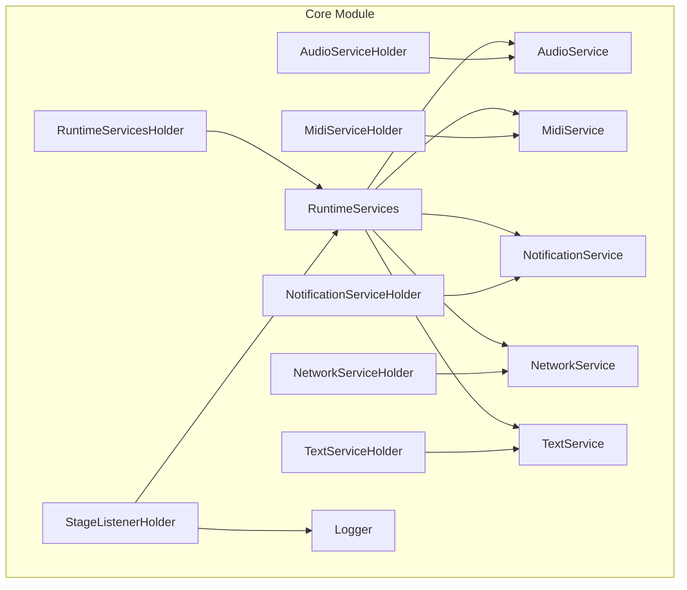
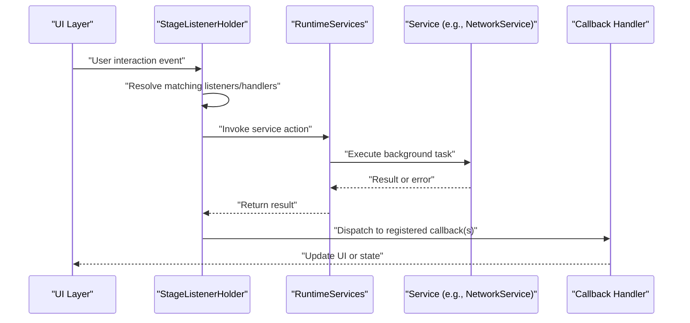
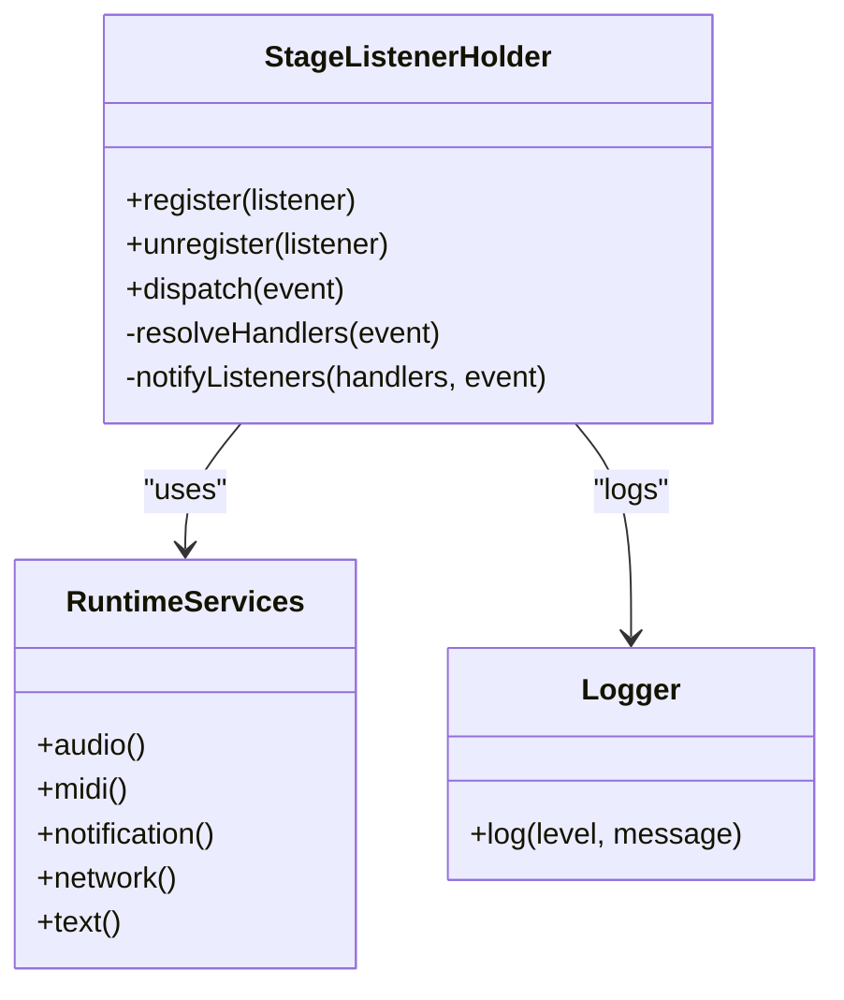
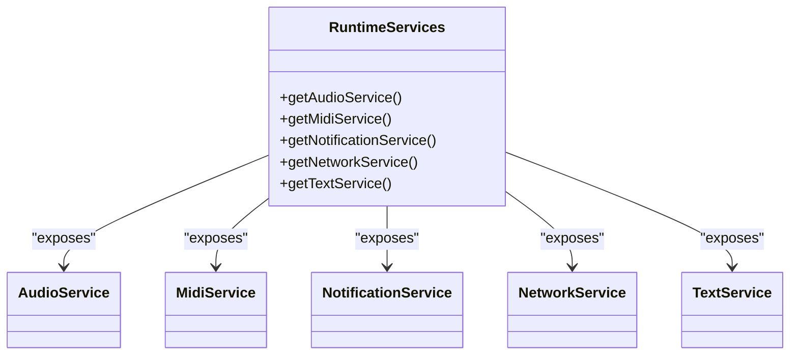
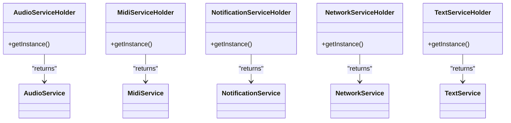
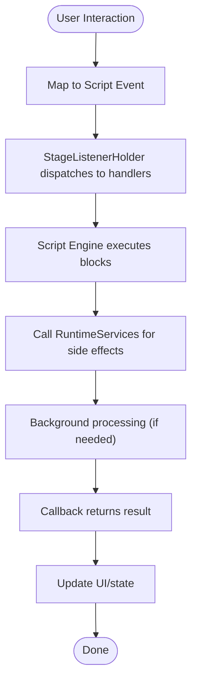
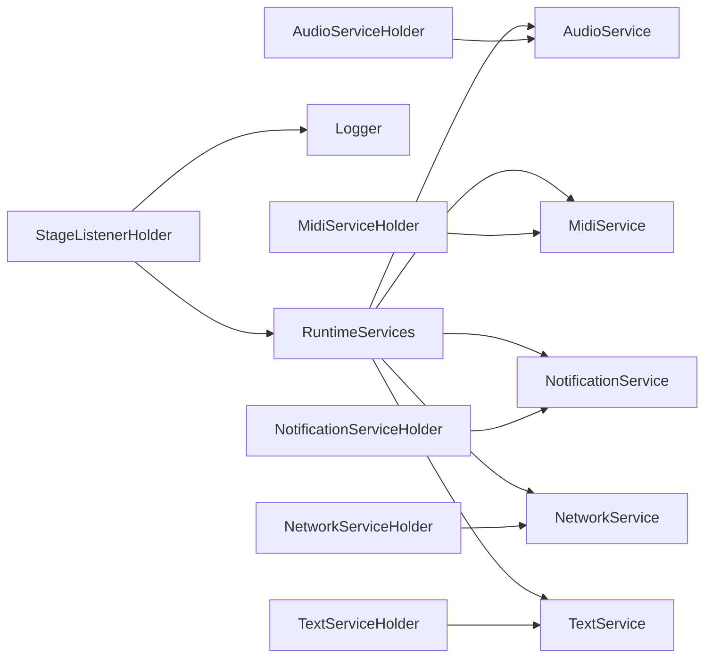

# Event System and Asynchronous Processing

<cite>
**Referenced Files in This Document**
- [StageListenerHolder.kt](file://core/src/main/java/org/catrobat/catroid/stage/StageListenerHolder.kt)
- [AudioService.kt](file://core/src/main/java/org/catrobat/catroid/audio/AudioService.kt)
- [AudioServiceHolder.kt](file://core/src/main/java/org/catrobat/catroid/audio/AudioServiceHolder.kt)
- [MidiService.kt](file://core/src/main/java/org/catrobat/catroid/audio/MidiService.kt)
- [MidiServiceHolder.kt](file://core/src/main/java/org/catrobat/catroid/audio/MidiServiceHolder.kt)
- [NotificationService.kt](file://core/src/main/java/org/catrobat/catroid/notification/NotificationService.kt)
- [NotificationServiceHolder.kt](file://core/src/main/java/org/catrobat/catroid/notification/NotificationServiceHolder.kt)
- [NetworkService.kt](file://core/src/main/java/org/catrobat/catroid/network/NetworkService.kt)
- [NetworkServiceHolder.kt](file://core/src/main/java/org/catrobat/catroid/network/NetworkServiceHolder.kt)
- [RuntimeServices.kt](file://core/src/main/java/org/catrobat/catroid/runtime/RuntimeServices.kt)
- [RuntimeServicesHolder.kt](file://core/src/main/java/org/catrobat/catroid/runtime/RuntimeServicesHolder.kt)
- [TextService.kt](file://core/src/main/java/org/catrobat/catroid/text/TextService.kt)
- [TextServiceHolder.kt](file://core/src/main/java/org/catrobat/catroid/text/TextServiceHolder.kt)
- [Logger.kt](file://core/src/main/java/org/catrobat/catroid/util/Logger.kt)
</cite>

## Table of Contents
1. [Introduction](#introduction)
2. [Project Structure](#project-structure)
3. [Core Components](#core-components)
4. [Architecture Overview](#architecture-overview)
5. [Detailed Component Analysis](#detailed-component-analysis)
6. [Dependency Analysis](#dependency-analysis)
7. [Performance Considerations](#performance-considerations)
8. [Troubleshooting Guide](#troubleshooting-guide)
9. [Conclusion](#conclusion)

## Introduction
This document explains NewCatroid’s event-driven programming model and asynchronous processing capabilities with a focus on the stage listener system, event propagation mechanisms, and callback handling patterns. It also covers how events flow through the block-based programming system from user interactions to script execution, thread management for background processing, synchronization primitives for concurrent operations, and best practices for efficient event handling.

## Project Structure
The event and async infrastructure is primarily implemented in the core module under org.catrobat.catroid. Key areas include:
- Stage listener holder for centralized stage-level event coordination
- Service holders that expose platform services (audio, MIDI, notifications, network, text) used by scripts and UI components
- Runtime services aggregator that provides unified access to subsystems
- Logging utility for diagnostics across the event pipeline

**Diagram sources**
- [StageListenerHolder.kt](file://core/src/main/java/org/catrobat/catroid/stage/StageListenerHolder.kt)
- [RuntimeServices.kt](file://core/src/main/java/org/catrobat/catroid/runtime/RuntimeServices.kt)
- [RuntimeServicesHolder.kt](file://core/src/main/java/org/catrobat/catroid/runtime/RuntimeServicesHolder.kt)
- [AudioService.kt](file://core/src/main/java/org/catrobat/catroid/audio/AudioService.kt)
- [AudioServiceHolder.kt](file://core/src/main/java/org/catrobat/catroid/audio/AudioServiceHolder.kt)
- [MidiService.kt](file://core/src/main/java/org/catrobat/catroid/audio/MidiService.kt)
- [MidiServiceHolder.kt](file://core/src/main/java/org/catrobat/catroid/audio/MidiServiceHolder.kt)
- [NotificationService.kt](file://core/src/main/java/org/catrobat/catroid/notification/NotificationService.kt)
- [NotificationServiceHolder.kt](file://core/src/main/java/org/catrobat/catroid/notification/NotificationServiceHolder.kt)
- [NetworkService.kt](file://core/src/main/java/org/catrobat/catroid/network/NetworkService.kt)
- [NetworkServiceHolder.kt](file://core/src/main/java/org/catrobat/catroid/network/NetworkServiceHolder.kt)
- [TextService.kt](file://core/src/main/java/org/catrobat/catroid/text/TextService.kt)
- [TextServiceHolder.kt](file://core/src/main/java/org/catrobat/catroid/text/TextServiceHolder.kt)
- [Logger.kt](file://core/src/main/java/org/catrobat/catroid/util/Logger.kt)

**Section sources**
- [StageListenerHolder.kt](file://core/src/main/java/org/catrobat/catroid/stage/StageListenerHolder.kt)
- [RuntimeServices.kt](file://core/src/main/java/org/catrobat/catroid/runtime/RuntimeServices.kt)
- [RuntimeServicesHolder.kt](file://core/src/main/java/org/catrobat/catroid/runtime/RuntimeServicesHolder.kt)
- [AudioService.kt](file://core/src/main/java/org/catrobat/catroid/audio/AudioService.kt)
- [AudioServiceHolder.kt](file://core/src/main/java/org/catrobat/catroid/audio/AudioServiceHolder.kt)
- [MidiService.kt](file://core/src/main/java/org/catrobat/catroid/audio/MidiService.kt)
- [MidiServiceHolder.kt](file://core/src/main/java/org/catrobat/catroid/audio/MidiServiceHolder.kt)
- [NotificationService.kt](file://core/src/main/java/org/catrobat/catroid/notification/NotificationService.kt)
- [NotificationServiceHolder.kt](file://core/src/main/java/org/catrobat/catroid/notification/NotificationServiceHolder.kt)
- [NetworkService.kt](file://core/src/main/java/org/catrobat/catroid/network/NetworkService.kt)
- [NetworkServiceHolder.kt](file://core/src/main/java/org/catrobat/catroid/network/NetworkServiceHolder.kt)
- [TextService.kt](file://core/src/main/java/org/catrobat/catroid/text/TextService.kt)
- [TextServiceHolder.kt](file://core/src/main/java/org/catrobat/catroid/text/TextServiceHolder.kt)
- [Logger.kt](file://core/src/main/java/org/catrobat/catroid/util/Logger.kt)

## Core Components
- StageListenerHolder: Centralizes stage-level listeners and coordinates event dispatching to registered handlers. It acts as the primary entry point for stage-scoped events and integrates with runtime services when needed.
- RuntimeServices: Aggregates access to audio, MIDI, notifications, network, and text services. Scripts and UI components use this facade to trigger side effects and receive callbacks.
- Service Holders: Provide singleton-like accessors for each service, ensuring consistent lifecycle and thread affinity.
- Logger: Provides structured logging for event flows and debugging.

Key responsibilities:
- Registration and lifecycle management of stage listeners
- Dispatching events to appropriate handlers
- Bridging UI/user input to script execution via runtime services
- Scheduling background tasks and returning results via callbacks

**Section sources**
- [StageListenerHolder.kt](file://core/src/main/java/org/catrobat/catroid/stage/StageListenerHolder.kt)
- [RuntimeServices.kt](file://core/src/main/java/org/catrobat/catroid/runtime/RuntimeServices.kt)
- [RuntimeServicesHolder.kt](file://core/src/main/java/org/catrobat/catroid/runtime/RuntimeServicesHolder.kt)
- [AudioService.kt](file://core/src/main/java/org/catrobat/catroid/audio/AudioService.kt)
- [MidiService.kt](file://core/src/main/java/org/catrobat/catroid/audio/MidiService.kt)
- [NotificationService.kt](file://core/src/main/java/org/catrobat/catroid/notification/NotificationService.kt)
- [NetworkService.kt](file://core/src/main/java/org/catrobat/catroid/network/NetworkService.kt)
- [TextService.kt](file://core/src/main/java/org/catrobat/catroid/text/TextService.kt)
- [Logger.kt](file://core/src/main/java/org/catrobat/catroid/util/Logger.kt)

## Architecture Overview
The event-driven architecture centers around a stage listener hub that receives events from UI or system sources, routes them to registered handlers, and invokes runtime services for side effects. Services may perform work on background threads and return results via callbacks or reactive streams.

**Diagram sources**
- [StageListenerHolder.kt](file://core/src/main/java/org/catrobat/catroid/stage/StageListenerHolder.kt)
- [RuntimeServices.kt](file://core/src/main/java/org/catrobat/catroid/runtime/RuntimeServices.kt)
- [NetworkService.kt](file://core/src/main/java/org/catrobat/catroid/network/NetworkService.kt)

## Detailed Component Analysis

### Stage Listener System
Responsibilities:
- Maintain registries of stage listeners
- Match incoming events to handlers based on type and context
- Ensure thread-safe dispatch and proper ordering
- Integrate with runtime services for cross-cutting concerns (logging, metrics)

Event propagation:
- Events originate from UI or system sources
- StageListenerHolder resolves applicable listeners
- Handlers may call into RuntimeServices to perform actions
- Results are propagated back to callers or observers

**Diagram sources**
- [StageListenerHolder.kt](file://core/src/main/java/org/catrobat/catroid/stage/StageListenerHolder.kt)
- [RuntimeServices.kt](file://core/src/main/java/org/catrobat/catroid/runtime/RuntimeServices.kt)
- [Logger.kt](file://core/src/main/java/org/catrobat/catroid/util/Logger.kt)

**Section sources**
- [StageListenerHolder.kt](file://core/src/main/java/org/catrobat/catroid/stage/StageListenerHolder.kt)
- [RuntimeServices.kt](file://core/src/main/java/org/catrobat/catroid/runtime/RuntimeServices.kt)
- [Logger.kt](file://core/src/main/java/org/catrobat/catroid/util/Logger.kt)

### Runtime Services Facade
Responsibilities:
- Aggregate access to audio, MIDI, notification, network, and text services
- Provide consistent APIs for scripts and UI
- Manage service lifecycles and thread affinity

**Diagram sources**
- [RuntimeServices.kt](file://core/src/main/java/org/catrobat/catroid/runtime/RuntimeServices.kt)
- [AudioService.kt](file://core/src/main/java/org/catrobat/catroid/audio/AudioService.kt)
- [MidiService.kt](file://core/src/main/java/org/catrobat/catroid/audio/MidiService.kt)
- [NotificationService.kt](file://core/src/main/java/org/catrobat/catroid/notification/NotificationService.kt)
- [NetworkService.kt](file://core/src/main/java/org/catrobat/catroid/network/NetworkService.kt)
- [TextService.kt](file://core/src/main/java/org/catrobat/catroid/text/TextService.kt)

**Section sources**
- [RuntimeServices.kt](file://core/src/main/java/org/catrobat/catroid/runtime/RuntimeServices.kt)
- [AudioService.kt](file://core/src/main/java/org/catrobat/catroid/audio/AudioService.kt)
- [MidiService.kt](file://core/src/main/java/org/catrobat/catroid/audio/MidiService.kt)
- [NotificationService.kt](file://core/src/main/java/org/catrobat/catroid/notification/NotificationService.kt)
- [NetworkService.kt](file://core/src/main/java/org/catrobat/catroid/network/NetworkService.kt)
- [TextService.kt](file://core/src/main/java/org/catrobat/catroid/text/TextService.kt)

### Service Holders
Responsibilities:
- Provide global accessors for services
- Ensure singletons and correct initialization order
- Decouple consumers from concrete implementations

**Diagram sources**
- [AudioServiceHolder.kt](file://core/src/main/java/org/catrobat/catroid/audio/AudioServiceHolder.kt)
- [MidiServiceHolder.kt](file://core/src/main/java/org/catrobat/catroid/audio/MidiServiceHolder.kt)
- [NotificationServiceHolder.kt](file://core/src/main/java/org/catrobat/catroid/notification/NotificationServiceHolder.kt)
- [NetworkServiceHolder.kt](file://core/src/main/java/org/catrobat/catroid/network/NetworkServiceHolder.kt)
- [TextServiceHolder.kt](file://core/src/main/java/org/catrobat/catroid/text/TextServiceHolder.kt)
- [AudioService.kt](file://core/src/main/java/org/catrobat/catroid/audio/AudioService.kt)
- [MidiService.kt](file://core/src/main/java/org/catrobat/catroid/audio/MidiService.kt)
- [NotificationService.kt](file://core/src/main/java/org/catrobat/catroid/notification/NotificationService.kt)
- [NetworkService.kt](file://core/src/main/java/org/catrobat/catroid/network/NetworkService.kt)
- [TextService.kt](file://core/src/main/java/org/catrobat/catroid/text/TextService.kt)

**Section sources**
- [AudioServiceHolder.kt](file://core/src/main/java/org/catrobat/catroid/audio/AudioServiceHolder.kt)
- [MidiServiceHolder.kt](file://core/src/main/java/org/catrobat/catroid/audio/MidiServiceHolder.kt)
- [NotificationServiceHolder.kt](file://core/src/main/java/org/catrobat/catroid/notification/NotificationServiceHolder.kt)
- [NetworkServiceHolder.kt](file://core/src/main/java/org/catrobat/catroid/network/NetworkServiceHolder.kt)
- [TextServiceHolder.kt](file://core/src/main/java/org/catrobat/catroid/text/TextServiceHolder.kt)

### Event Flow Through Block-Based Programming
Conceptual flow:
- User interacts with blocks or UI controls
- The stage listener system captures the interaction and maps it to a script event
- Script engine executes corresponding logic
- Side effects are performed via runtime services
- Results propagate back to update UI or state

[No sources needed since this diagram shows conceptual workflow, not actual code structure]

## Dependency Analysis
High-level dependencies:
- StageListenerHolder depends on RuntimeServices and Logger
- RuntimeServices aggregates multiple service interfaces
- Service Holders provide access to concrete service implementations
- NetworkService typically performs I/O asynchronously and notifies via callbacks

**Diagram sources**
- [StageListenerHolder.kt](file://core/src/main/java/org/catrobat/catroid/stage/StageListenerHolder.kt)
- [RuntimeServices.kt](file://core/src/main/java/org/catrobat/catroid/runtime/RuntimeServices.kt)
- [AudioService.kt](file://core/src/main/java/org/catrobat/catroid/audio/AudioService.kt)
- [MidiService.kt](file://core/src/main/java/org/catrobat/catroid/audio/MidiService.kt)
- [NotificationService.kt](file://core/src/main/java/org/catrobat/catroid/notification/NotificationService.kt)
- [NetworkService.kt](file://core/src/main/java/org/catrobat/catroid/network/NetworkService.kt)
- [TextService.kt](file://core/src/main/java/org/catrobat/catroid/text/TextService.kt)
- [AudioServiceHolder.kt](file://core/src/main/java/org/catrobat/catroid/audio/AudioServiceHolder.kt)
- [MidiServiceHolder.kt](file://core/src/main/java/org/catrobat/catroid/audio/MidiServiceHolder.kt)
- [NotificationServiceHolder.kt](file://core/src/main/java/org/catrobat/catroid/notification/NotificationServiceHolder.kt)
- [NetworkServiceHolder.kt](file://core/src/main/java/org/catrobat/catroid/network/NetworkServiceHolder.kt)
- [TextServiceHolder.kt](file://core/src/main/java/org/catrobat/catroid/text/TextServiceHolder.kt)
- [Logger.kt](file://core/src/main/java/org/catrobat/catroid/util/Logger.kt)

**Section sources**
- [StageListenerHolder.kt](file://core/src/main/java/org/catrobat/catroid/stage/StageListenerHolder.kt)
- [RuntimeServices.kt](file://core/src/main/java/org/catrobat/catroid/runtime/RuntimeServices.kt)
- [AudioService.kt](file://core/src/main/java/org/catrobat/catroid/audio/AudioService.kt)
- [MidiService.kt](file://core/src/main/java/org/catrobat/catroid/audio/MidiService.kt)
- [NotificationService.kt](file://core/src/main/java/org/catrobat/catroid/notification/NotificationService.kt)
- [NetworkService.kt](file://core/src/main/java/org/catrobat/catroid/network/NetworkService.kt)
- [TextService.kt](file://core/src/main/java/org/catrobat/catroid/text/TextService.kt)
- [AudioServiceHolder.kt](file://core/src/main/java/org/catrobat/catroid/audio/AudioServiceHolder.kt)
- [MidiServiceHolder.kt](file://core/src/main/java/org/catrobat/catroid/audio/MidiServiceHolder.kt)
- [NotificationServiceHolder.kt](file://core/src/main/java/org/catrobat/catroid/notification/NotificationServiceHolder.kt)
- [NetworkServiceHolder.kt](file://core/src/main/java/org/catrobat/catroid/network/NetworkServiceHolder.kt)
- [TextServiceHolder.kt](file://core/src/main/java/org/catrobat/catroid/text/TextServiceHolder.kt)
- [Logger.kt](file://core/src/main/java/org/catrobat/catroid/util/Logger.kt)

## Performance Considerations
- Minimize event payload size to reduce serialization overhead
- Batch small events where possible to avoid excessive dispatching
- Prefer lightweight handlers; offload heavy work to background threads
- Use connection pooling and request coalescing for network operations
- Avoid blocking the main thread in callbacks; schedule UI updates appropriately
- Reuse objects and caches within services to reduce GC pressure
- Monitor event throughput and handler latency; instrument with Logger for profiling

[No sources needed since this section provides general guidance]

## Troubleshooting Guide
Common issues and strategies:
- Missing or duplicate registrations: Verify registration/unregistration paths in StageListenerHolder
- Threading violations: Ensure callbacks update UI on the correct thread
- Deadlocks: Check for nested locks or circular waits between services
- Memory leaks: Confirm listeners are unregistered when no longer needed
- Network failures: Inspect error paths in NetworkService and handle retries/backoff
- Logging gaps: Add contextual logs around event boundaries using Logger

Practical steps:
- Enable detailed logging around event dispatch and service calls
- Validate handler lists before dispatch to detect empty sets
- Wrap long-running tasks with timeouts and cancellation support
- Use structured logs with correlation IDs to trace event chains

**Section sources**
- [StageListenerHolder.kt](file://core/src/main/java/org/catrobat/catroid/stage/StageListenerHolder.kt)
- [NetworkService.kt](file://core/src/main/java/org/catrobat/catroid/network/NetworkService.kt)
- [Logger.kt](file://core/src/main/java/org/catrobat/catroid/util/Logger.kt)

## Conclusion
NewCatroid’s event-driven architecture leverages a central stage listener hub and a set of runtime services to coordinate user interactions, script execution, and background processing. By adhering to clear registration/dispatch patterns, careful threading, and robust logging, developers can build responsive and maintainable applications. Following the performance and troubleshooting recommendations will help ensure reliable operation at scale.