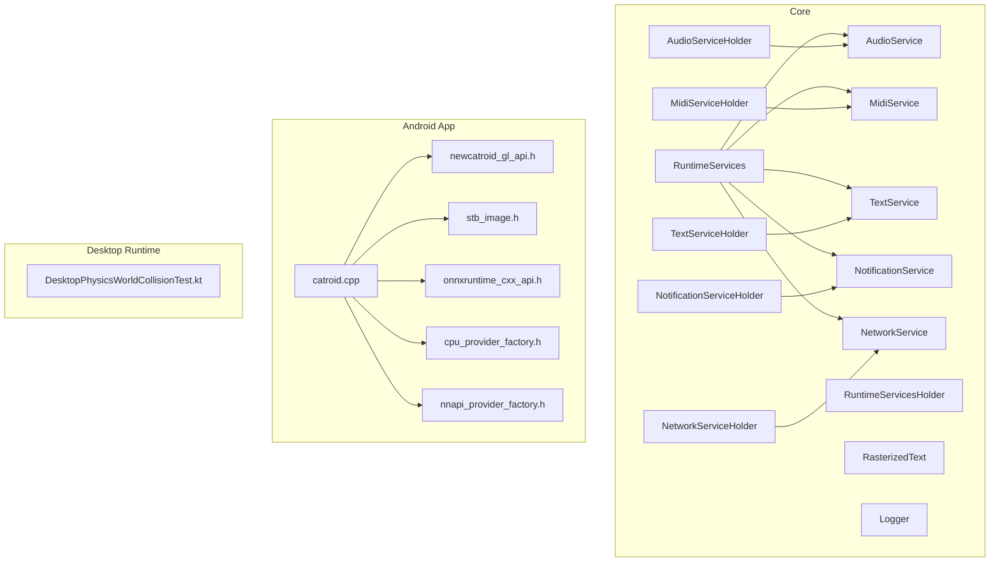
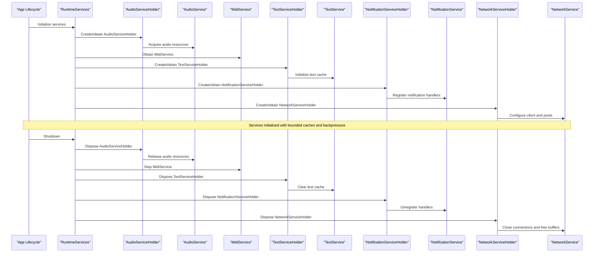
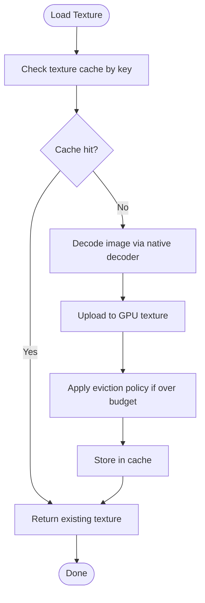
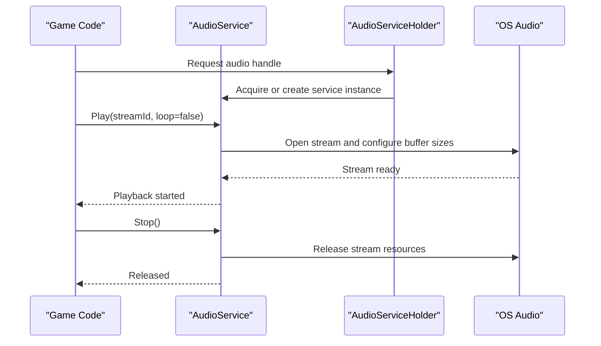
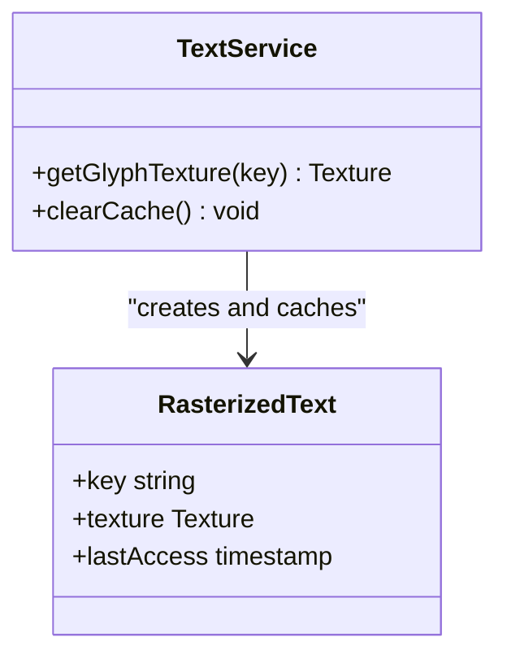
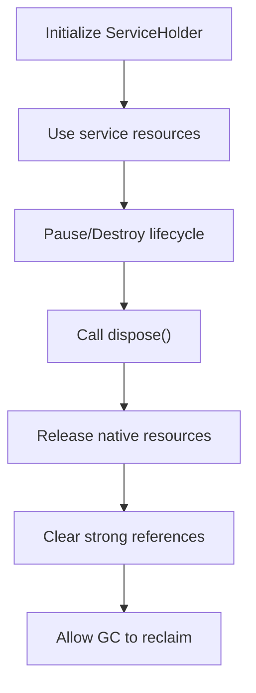
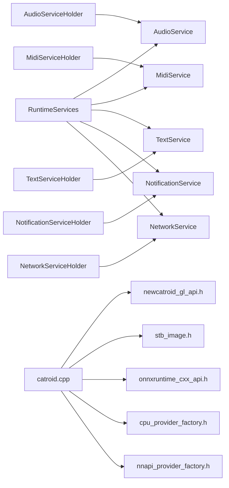

# Memory and Resource Management

<cite>
**Referenced Files in This Document**
- [AudioService.kt](file://core/src/main/java/org/catrobat/catroid/audio/AudioService.kt)
- [AudioServiceHolder.kt](file://core/src/main/java/org/catrobat/catroid/audio/AudioServiceHolder.kt)
- [MidiService.kt](file://core/src/main/java/org/catrobat/catroid/audio/MidiService.kt)
- [MidiServiceHolder.kt](file://core/src/main/java/org/catrobat/catroid/audio/MidiServiceHolder.kt)
- [RuntimeServices.kt](file://core/src/main/java/org/catrobat/catroid/runtime/RuntimeServices.kt)
- [RuntimeServicesHolder.kt](file://core/src/main/java/org/catrobat/catroid/runtime/RuntimeServicesHolder.kt)
- [TextService.kt](file://core/src/main/java/org/catrobat/catroid/text/TextService.kt)
- [TextServiceHolder.kt](file://core/src/main/java/org/catrobat/catroid/text/TextServiceHolder.kt)
- [RasterizedText.kt](file://core/src/main/java/org/catrobat/catroid/text/RasterizedText.kt)
- [NotificationStorage.kt](file://core/src/main/java/org/catrobat/catroid/content/notification/NotificationStorage.kt)
- [NetworkService.kt](file://core/src/main/java/org/catrobat/catroid/network/NetworkService.kt)
- [NetworkServiceHolder.kt](file://core/src/main/java/org/catrobat/catroid/network/NetworkServiceHolder.kt)
- [NotificationService.kt](file://core/src/main/java/org/catrobat/catroid/notification/NotificationService.kt)
- [NotificationServiceHolder.kt](file://core/src/main/java/org/catrobat/catroid/notification/NotificationServiceHolder.kt)
- [Logger.kt](file://core/src/main/java/org/catrobat/catroid/util/Logger.kt)
- [catroid.cpp](file://catroid/src/main/cpp/catroid.cpp)
- [newcatroid_gl_api.h](file://catroid/src/main/cpp/newcatroid_gl_api.h)
- [stb_image.h](file://catroid/src/main/cpp/stb_image.h)
- [onnxruntime_cxx_api.h](file://catroid/src/main/cpp/onnxruntime_cxx_api.h)
- [cpu_provider_factory.h](file://catroid/src/main/cpp/cpu_provider_factory.h)
- [nnapi_provider_factory.h](file://catroid/src/main/cpp/nnapi_provider_factory.h)
- [build.gradle](file://catroid/build.gradle)
- [proguard-runtime.pro](file://catroid/proguard-runtime.pro)
- [DesktopPhysicsWorldCollisionTest.kt](file://desktop-runtime/src/test/java/org/catrobat/catroid/stage/DesktopPhysicsWorldCollisionTest.kt)
</cite>

## Table of Contents
1. Introduction
2. Project Structure
3. Core Components
4. Architecture Overview
5. Detailed Component Analysis
6. Dependency Analysis
7. Performance Considerations
8. Troubleshooting Guide
9. Conclusion

## Introduction
This document explains memory and resource management in NewCatroid’s runtime system across Android and desktop platforms. It covers garbage collection strategies, object pooling patterns, memory optimization techniques, asset loading and caching (textures, audio streaming, file I/O), leak prevention and disposal protocols, performance monitoring tools, and platform-specific considerations for Android versus desktop environments. The goal is to provide actionable guidance for efficient resource usage, profiling, and debugging memory-related issues.

## Project Structure
NewCatroid organizes shared runtime services in a core module with platform-specific implementations in the Android app module and a desktop runtime module. Key areas relevant to memory and resources include:
- Audio subsystem: centralized audio services and holders
- Text rendering: rasterization and text service abstractions
- Runtime orchestration: service registry and lifecycle coordination
- Native layer: OpenGL bindings, image decoding, and optional ML providers
- Desktop runtime: tests and platform-specific entry points

**Diagram sources**
- [RuntimeServices.kt](file://core/src/main/java/org/catrobat/catroid/runtime/RuntimeServices.kt)
- [RuntimeServicesHolder.kt](file://core/src/main/java/org/catrobat/catroid/runtime/RuntimeServicesHolder.kt)
- [AudioService.kt](file://core/src/main/java/org/catrobat/catroid/audio/AudioService.kt)
- [AudioServiceHolder.kt](file://core/src/main/java/org/catrobat/catroid/audio/AudioServiceHolder.kt)
- [MidiService.kt](file://core/src/main/java/org/catrobat/catroid/audio/MidiService.kt)
- [MidiServiceHolder.kt](file://core/src/main/java/org/catrobat/catroid/audio/MidiServiceHolder.kt)
- [TextService.kt](file://core/src/main/java/org/catrobat/catroid/text/TextService.kt)
- [TextServiceHolder.kt](file://core/src/main/java/org/catrobat/catroid/text/TextServiceHolder.kt)
- [RasterizedText.kt](file://core/src/main/java/org/catrobat/catroid/text/RasterizedText.kt)
- [NotificationService.kt](file://core/src/main/java/org/catrobat/catroid/notification/NotificationService.kt)
- [NotificationServiceHolder.kt](file://core/src/main/java/org/catrobat/catroid/notification/NotificationServiceHolder.kt)
- [NetworkService.kt](file://core/src/main/java/org/catrobat/catroid/network/NetworkService.kt)
- [NetworkServiceHolder.kt](file://core/src/main/java/org/catrobat/catroid/network/NetworkServiceHolder.kt)
- [Logger.kt](file://core/src/main/java/org/catrobat/catroid/util/Logger.kt)
- [catroid.cpp](file://catroid/src/main/cpp/catroid.cpp)
- [newcatroid_gl_api.h](file://catroid/src/main/cpp/newcatroid_gl_api.h)
- [stb_image.h](file://catroid/src/main/cpp/stb_image.h)
- [onnxruntime_cxx_api.h](file://catroid/src/main/cpp/onnxruntime_cxx_api.h)
- [cpu_provider_factory.h](file://catroid/src/main/cpp/cpu_provider_factory.h)
- [nnapi_provider_factory.h](file://catroid/src/main/cpp/nnapi_provider_factory.h)
- [DesktopPhysicsWorldCollisionTest.kt](file://desktop-runtime/src/test/java/org/catrobat/catroid/stage/DesktopPhysicsWorldCollisionTest.kt)

**Section sources**
- [RuntimeServices.kt](file://core/src/main/java/org/catrobat/catroid/runtime/RuntimeServices.kt)
- [RuntimeServicesHolder.kt](file://core/src/main/java/org/catrobat/catroid/runtime/RuntimeServicesHolder.kt)
- [AudioService.kt](file://core/src/main/java/org/catrobat/catroid/audio/AudioService.kt)
- [AudioServiceHolder.kt](file://core/src/main/java/org/catrobat/catroid/audio/AudioServiceHolder.kt)
- [MidiService.kt](file://core/src/main/java/org/catrobat/catroid/audio/MidiService.kt)
- [MidiServiceHolder.kt](file://core/src/main/java/org/catrobat/catroid/audio/MidiServiceHolder.kt)
- [TextService.kt](file://core/src/main/java/org/catrobat/catroid/text/TextService.kt)
- [TextServiceHolder.kt](file://core/src/main/java/org/catrobat/catroid/text/TextServiceHolder.kt)
- [RasterizedText.kt](file://core/src/main/java/org/catrobat/catroid/text/RasterizedText.kt)
- [NotificationService.kt](file://core/src/main/java/org/catrobat/catroid/notification/NotificationService.kt)
- [NotificationServiceHolder.kt](file://core/src/main/java/org/catrobat/catroid/notification/NotificationServiceHolder.kt)
- [NetworkService.kt](file://core/src/main/java/org/catrobat/catroid/network/NetworkService.kt)
- [NetworkServiceHolder.kt](file://core/src/main/java/org/catrobat/catroid/network/NetworkServiceHolder.kt)
- [Logger.kt](file://core/src/main/java/org/catrobat/catroid/util/Logger.kt)
- [catroid.cpp](file://catroid/src/main/cpp/catroid.cpp)
- [newcatroid_gl_api.h](file://catroid/src/main/cpp/newcatroid_gl_api.h)
- [stb_image.h](file://catroid/src/main/cpp/stb_image.h)
- [onnxruntime_cxx_api.h](file://catroid/src/main/cpp/onnxruntime_cxx_api.h)
- [cpu_provider_factory.h](file://catroid/src/main/cpp/cpu_provider_factory.h)
- [nnapi_provider_factory.h](file://catroid/src/main/cpp/nnapi_provider_factory.h)
- [DesktopPhysicsWorldCollisionTest.kt](file://desktop-runtime/src/test/java/org/catrobat/catroid/stage/DesktopPhysicsWorldCollisionTest.kt)

## Core Components
- Runtime Services Registry: Centralizes access to audio, MIDI, text, notifications, and network services. Ensures consistent initialization and disposal lifecycles.
- Audio Subsystem: Provides unified audio playback and MIDI control via dedicated services and holders that manage underlying native or framework resources.
- Text Rendering: Abstracts text layout and rasterization; rasterized glyphs are cached to reduce repeated work.
- Notification and Network Services: Encapsulate long-lived resources and background tasks; holders coordinate lifecycle and prevent leaks.
- Native Layer: Bridges to OpenGL, image decoding, and optional ML runtimes; responsible for explicit resource allocation/deallocation.

Key responsibilities for memory and resources:
- Explicit resource acquisition and release at well-defined lifecycle boundaries
- Caching policies tuned per resource type (textures, fonts, audio buffers)
- Backpressure and streaming for large media
- Platform-aware optimizations (Android vs desktop)

**Section sources**
- [RuntimeServices.kt](file://core/src/main/java/org/catrobat/catroid/runtime/RuntimeServices.kt)
- [RuntimeServicesHolder.kt](file://core/src/main/java/org/catrobat/catroid/runtime/RuntimeServicesHolder.kt)
- [AudioService.kt](file://core/src/main/java/org/catrobat/catroid/audio/AudioService.kt)
- [AudioServiceHolder.kt](file://core/src/main/java/org/catrobat/catroid/audio/AudioServiceHolder.kt)
- [MidiService.kt](file://core/src/main/java/org/catrobat/catroid/audio/MidiService.kt)
- [MidiServiceHolder.kt](file://core/src/main/java/org/catrobat/catroid/audio/MidiServiceHolder.kt)
- [TextService.kt](file://core/src/main/java/org/catrobat/catroid/text/TextService.kt)
- [TextServiceHolder.kt](file://core/src/main/java/org/catrobat/catroid/text/TextServiceHolder.kt)
- [RasterizedText.kt](file://core/src/main/java/org/catrobat/catroid/text/RasterizedText.kt)
- [NotificationService.kt](file://core/src/main/java/org/catrobat/catroid/notification/NotificationService.kt)
- [NotificationServiceHolder.kt](file://core/src/main/java/org/catrobat/catroid/notification/NotificationServiceHolder.kt)
- [NetworkService.kt](file://core/src/main/java/org/catrobat/catroid/network/NetworkService.kt)
- [NetworkServiceHolder.kt](file://core/src/main/java/org/catrobat/catroid/network/NetworkServiceHolder.kt)
- [Logger.kt](file://core/src/main/java/org/catrobat/catroid/util/Logger.kt)

## Architecture Overview
The runtime composes services through holder objects that encapsulate lifecycle and resource ownership. Native code handles GPU textures and decoders, while Kotlin services coordinate high-level behavior.

**Diagram sources**
- [RuntimeServices.kt](file://core/src/main/java/org/catrobat/catroid/runtime/RuntimeServices.kt)
- [RuntimeServicesHolder.kt](file://core/src/main/java/org/catrobat/catroid/runtime/RuntimeServicesHolder.kt)
- [AudioService.kt](file://core/src/main/java/org/catrobat/catroid/audio/AudioService.kt)
- [AudioServiceHolder.kt](file://core/src/main/java/org/catrobat/catroid/audio/AudioServiceHolder.kt)
- [MidiService.kt](file://core/src/main/java/org/catrobat/catroid/audio/MidiService.kt)
- [TextService.kt](file://core/src/main/java/org/catrobat/catroid/text/TextService.kt)
- [TextServiceHolder.kt](file://core/src/main/java/org/catrobat/catroid/text/TextServiceHolder.kt)
- [NotificationService.kt](file://core/src/main/java/org/catrobat/catroid/notification/NotificationService.kt)
- [NotificationServiceHolder.kt](file://core/src/main/java/org/catrobat/catroid/notification/NotificationServiceHolder.kt)
- [NetworkService.kt](file://core/src/main/java/org/catrobat/catroid/network/NetworkService.kt)
- [NetworkServiceHolder.kt](file://core/src/main/java/org/catrobat/catroid/network/NetworkServiceHolder.kt)

## Detailed Component Analysis

### Garbage Collection Strategy and Object Pooling
- Java/Kotlin GC: Relies on JVM/ART generational GC. Minimize short-lived allocations in hot paths (render loop, input handling). Prefer object reuse and pooling for frequently allocated types (e.g., temporary buffers, event wrappers).
- Object pooling patterns:
  - Reuse byte buffers for audio streams and image decoding intermediates.
  - Cache reusable containers for UI updates and physics calculations.
  - Use immutable data structures where possible to reduce copying.
- Avoid hidden allocations:
  - Precompute strings and formats.
  - Avoid boxing primitives in tight loops.
  - Batch operations to reduce intermediate collections.

[No sources needed since this section provides general guidance]

### Asset Loading and Caching Systems

#### Texture Management
- Native image decoding uses stb_image to convert compressed images into GPU-friendly formats.
- OpenGL bindings expose texture creation and deletion APIs.
- Recommended practices:
  - Decode once and cache decoded bitmaps or directly upload to GPU textures.
  - Implement size-based eviction for texture caches.
  - Use mipmaps and appropriate pixel formats to reduce VRAM pressure.
  - Ensure explicit texture deletion when assets are unloaded.

**Diagram sources**
- [stb_image.h](file://catroid/src/main/cpp/stb_image.h)
- [newcatroid_gl_api.h](file://catroid/src/main/cpp/newcatroid_gl_api.h)

**Section sources**
- [stb_image.h](file://catroid/src/main/cpp/stb_image.h)
- [newcatroid_gl_api.h](file://catroid/src/main/cpp/newcatroid_gl_api.h)

#### Audio Streaming
- AudioService and holders manage playback resources.
- For long audio, stream from disk rather than fully loading into memory.
- Use fixed-size circular buffers and pre-warm playback to avoid stalls.
- Apply adaptive bitrate or chunked reading for remote audio.

**Diagram sources**
- [AudioService.kt](file://core/src/main/java/org/catrobat/catroid/audio/AudioService.kt)
- [AudioServiceHolder.kt](file://core/src/main/java/org/catrobat/catroid/audio/AudioServiceHolder.kt)

**Section sources**
- [AudioService.kt](file://core/src/main/java/org/catrobat/catroid/audio/AudioService.kt)
- [AudioServiceHolder.kt](file://core/src/main/java/org/catrobat/catroid/audio/AudioServiceHolder.kt)

#### File I/O Optimization
- Prefer buffered reads/writes and sequential access patterns.
- Use memory-mapped files for large read-only assets when appropriate.
- Compress assets and decompress on-demand.
- Avoid synchronous I/O on the main thread; offload to background threads.

[No sources needed since this section provides general guidance]

#### Text Rasterization and Caching
- TextService coordinates font metrics and glyph generation.
- RasterizedText holds pre-rendered glyph textures to avoid recomputation.
- Cache keys should include font family, size, style, and color.
- Evict least recently used entries under memory pressure.

**Diagram sources**
- [TextService.kt](file://core/src/main/java/org/catrobat/catroid/text/TextService.kt)
- [TextServiceHolder.kt](file://core/src/main/java/org/catrobat/catroid/text/TextServiceHolder.kt)
- [RasterizedText.kt](file://core/src/main/java/org/catrobat/catroid/text/RasterizedText.kt)

**Section sources**
- [TextService.kt](file://core/src/main/java/org/catrobat/catroid/text/TextService.kt)
- [TextServiceHolder.kt](file://core/src/main/java/org/catrobat/catroid/text/TextServiceHolder.kt)
- [RasterizedText.kt](file://core/src/main/java/org/catrobat/catroid/text/RasterizedText.kt)

### Memory Leak Prevention Patterns and Disposal Protocols
- Holders as owners: ServiceHolder instances own resources and implement explicit dispose methods.
- Lifecycle alignment: Bind service lifetime to application or scene lifecycle; dispose on pause/destroy.
- Reference hygiene:
  - Avoid holding references to destroyed contexts (GL context, activity, view).
  - Null out callbacks and listeners after disposal.
- Native resource cleanup:
  - Ensure all native allocations (textures, decoders, ML sessions) are released in reverse order of creation.
  - Validate that JNI calls do not retain Java objects longer than necessary.

[No sources needed since this diagram shows conceptual workflow, not actual code structure]

**Section sources**
- [RuntimeServicesHolder.kt](file://core/src/main/java/org/catrobat/catroid/runtime/RuntimeServicesHolder.kt)
- [AudioServiceHolder.kt](file://core/src/main/java/org/catrobat/catroid/audio/AudioServiceHolder.kt)
- [MidiServiceHolder.kt](file://core/src/main/java/org/catrobat/catroid/audio/MidiServiceHolder.kt)
- [TextServiceHolder.kt](file://core/src/main/java/org/catrobat/catroid/text/TextServiceHolder.kt)
- [NotificationServiceHolder.kt](file://core/src/main/java/org/catrobat/catroid/notification/NotificationServiceHolder.kt)
- [NetworkServiceHolder.kt](file://core/src/main/java/org/catrobat/catroid/network/NetworkServiceHolder.kt)

### Performance Monitoring Tools
- Logging: Logger centralizes diagnostics; use structured logs for memory events (allocations, cache hits/misses, evictions).
- Profiling:
  - Android: Use Android Studio Profiler (Memory, CPU, Network) and systrace/perfetto.
  - Desktop: Use VisualVM/JProfiler or equivalent JVM profilers.
- Metrics to track:
  - Heap growth rate and GC frequency
  - Texture cache size and eviction rates
  - Audio buffer utilization and underruns
  - I/O latency and throughput

**Section sources**
- [Logger.kt](file://core/src/main/java/org/catrobat/catroid/util/Logger.kt)

### Platform-Specific Considerations

#### Android
- Strict memory constraints:
  - Limit texture cache size based on device heap and GPU capabilities.
  - Prefer streaming audio and lower sample rates for background music.
  - Use smaller font atlases and lazy load rarely used glyphs.
- Background execution limits:
  - Offload heavy I/O and decoding to background threads.
  - Respect Doze and battery optimization guidelines.
- ProGuard/R8:
  - Keep critical classes and reflection targets to avoid runtime failures.
  - Tune rules to minimize overhead while preserving functionality.

**Section sources**
- [build.gradle](file://catroid/build.gradle)
- [proguard-runtime.pro](file://catroid/proguard-runtime.pro)

#### Desktop
- Larger memory budgets allow larger caches and higher-resolution assets.
- Still apply eviction policies to avoid unbounded growth.
- Leverage multi-threading more aggressively for decoding and I/O.

[No sources needed since this section provides general guidance]

## Dependency Analysis
The runtime composes services via holders and delegates heavy lifting to native code.

**Diagram sources**
- [RuntimeServices.kt](file://core/src/main/java/org/catrobat/catroid/runtime/RuntimeServices.kt)
- [AudioService.kt](file://core/src/main/java/org/catrobat/catroid/audio/AudioService.kt)
- [AudioServiceHolder.kt](file://core/src/main/java/org/catrobat/catroid/audio/AudioServiceHolder.kt)
- [MidiService.kt](file://core/src/main/java/org/catrobat/catroid/audio/MidiService.kt)
- [MidiServiceHolder.kt](file://core/src/main/java/org/catrobat/catroid/audio/MidiServiceHolder.kt)
- [TextService.kt](file://core/src/main/java/org/catrobat/catroid/text/TextService.kt)
- [TextServiceHolder.kt](file://core/src/main/java/org/catrobat/catroid/text/TextServiceHolder.kt)
- [NotificationService.kt](file://core/src/main/java/org/catrobat/catroid/notification/NotificationService.kt)
- [NotificationServiceHolder.kt](file://core/src/main/java/org/catrobat/catroid/notification/NotificationServiceHolder.kt)
- [NetworkService.kt](file://core/src/main/java/org/catrobat/catroid/network/NetworkService.kt)
- [NetworkServiceHolder.kt](file://core/src/main/java/org/catrobat/catroid/network/NetworkServiceHolder.kt)
- [catroid.cpp](file://catroid/src/main/cpp/catroid.cpp)
- [newcatroid_gl_api.h](file://catroid/src/main/cpp/newcatroid_gl_api.h)
- [stb_image.h](file://catroid/src/main/cpp/stb_image.h)
- [onnxruntime_cxx_api.h](file://catroid/src/main/cpp/onnxruntime_cxx_api.h)
- [cpu_provider_factory.h](file://catroid/src/main/cpp/cpu_provider_factory.h)
- [nnapi_provider_factory.h](file://catroid/src/main/cpp/nnapi_provider_factory.h)

**Section sources**
- [RuntimeServices.kt](file://core/src/main/java/org/catrobat/catroid/runtime/RuntimeServices.kt)
- [catroid.cpp](file://catroid/src/main/cpp/catroid.cpp)

## Performance Considerations
- Cache sizing: Set maximum texture and glyph cache sizes proportional to available memory; implement LRU eviction.
- Streaming: Always stream large audio and video; avoid full in-memory loads.
- Batching: Combine small draws and I/O operations to reduce overhead.
- Threading: Perform decoding and I/O off the render thread; synchronize only when necessary.
- Compression: Use efficient formats (e.g., ETC2/ASTC for textures, Ogg/Opus for audio).
- GC pressure: Reduce allocations in hot paths; reuse buffers and objects.

[No sources needed since this section provides general guidance]

## Troubleshooting Guide
Common symptoms and actions:
- OutOfMemoryError during texture load:
  - Verify cache eviction and max size settings.
  - Check for duplicate texture uploads or missing deletions.
  - Inspect native logs for decoder errors.
- Audio stuttering or crashes:
  - Confirm stream buffer sizes and backpressure handling.
  - Ensure no blocking I/O on audio thread.
- Font rendering artifacts:
  - Validate cache keys and eviction logic.
  - Clear text cache on configuration changes.
- Leaks detected by profiler:
  - Audit ServiceHolder.dispose() paths.
  - Remove lingering callbacks and static references.

Tools and steps:
- Use Android Studio Profiler to capture heap dumps and identify retained objects.
- Enable detailed logging around resource acquisition/release points.
- On desktop, run unit tests like collision tests to validate stability under load.

**Section sources**
- [Logger.kt](file://core/src/main/java/org/catrobat/catroid/util/Logger.kt)
- [DesktopPhysicsWorldCollisionTest.kt](file://desktop-runtime/src/test/java/org/catrobat/catroid/stage/DesktopPhysicsWorldCollisionTest.kt)

## Conclusion
Effective memory and resource management in NewCatroid hinges on disciplined lifecycle management, targeted caching, streaming media, and careful native resource handling. By applying the patterns and guidelines above—especially around service holders, cache eviction, and explicit disposal—you can achieve stable performance across Android and desktop platforms while minimizing leaks and GC pressure.