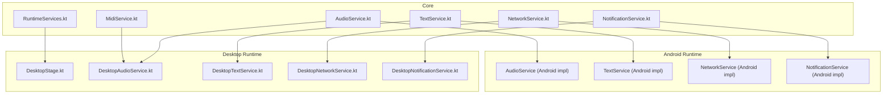
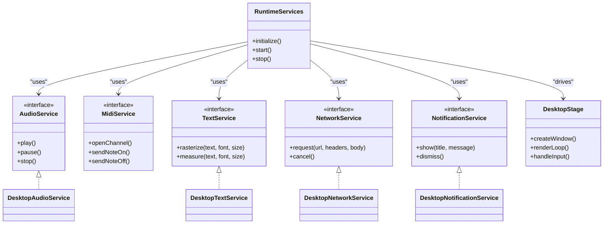
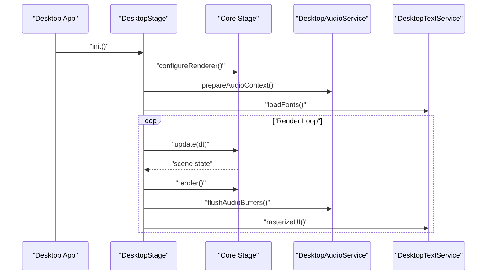
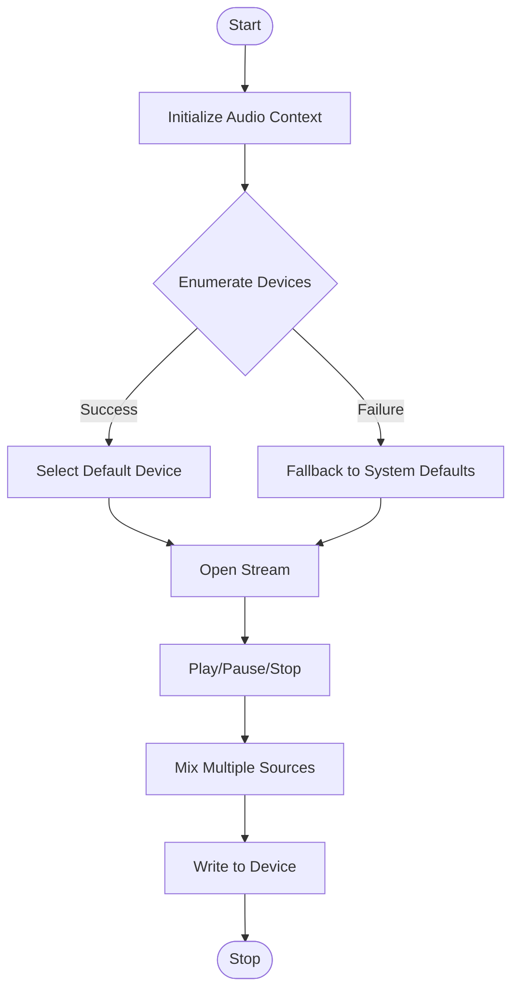
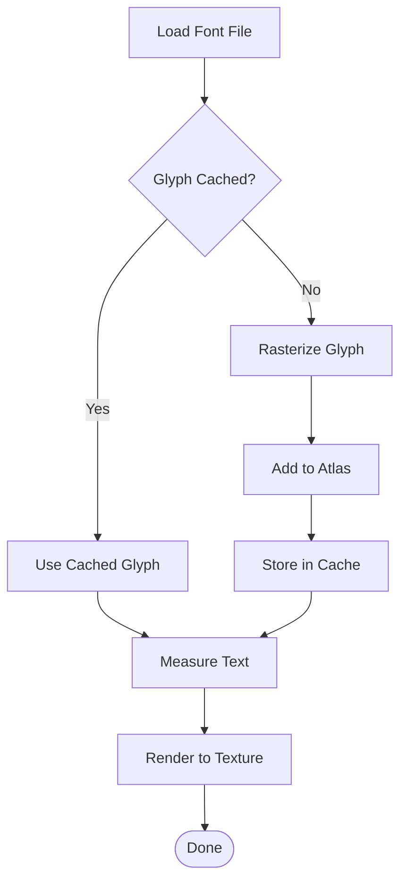
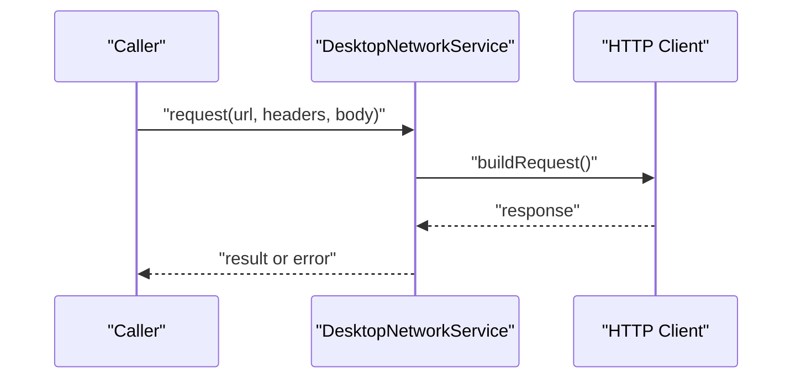
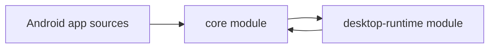

# Platform-Specific Implementations

<cite>
**Referenced Files in This Document**
- [build.gradle](file://build.gradle)
- [settings.gradle](file://settings.gradle)
- [core/build.gradle](file://core/build.gradle)
- [desktop-runtime/build.gradle](file://desktop-runtime/build.gradle)
- [catroid/src/main/java/org/catrobat/catroid/runtime/RuntimeServices.kt](file://catroid/src/main/java/org/catrobat/catroid/runtime/RuntimeServices.kt)
- [catroid/src/main/java/org/catrobat/catroid/audio/AudioService.kt](file://catroid/src/main/java/org/catrobat/catroid/audio/AudioService.kt)
- [catroid/src/main/java/org/catrobat/catroid/audio/MidiService.kt](file://catroid/src/main/java/org/catrobat/catroid/audio/MidiService.kt)
- [catroid/src/main/java/org/catrobat/catroid/text/TextService.kt](file://catroid/src/main/java/org/catrobat/catroid/text/TextService.kt)
- [catroid/src/main/java/org/catrobat/catroid/network/NetworkService.kt](file://catroid/src/main/java/org/catrobat/catroid/network/NetworkService.kt)
- [catroid/src/main/java/org/catrobat/catroid/notification/NotificationService.kt](file://catroid/src/main/java/org/catrobat/catroid/notification/NotificationService.kt)
- [desktop-runtime/src/main/java/org/catrobat/catroid/stage/DesktopStage.kt](file://desktop-runtime/src/main/java/org/catrobat/catroid/stage/DesktopStage.kt)
- [desktop-runtime/src/main/java/org/catrobat/catroid/audio/DesktopAudioService.kt](file://desktop-runtime/src/main/java/org/catrobat/catroid/audio/DesktopAudioService.kt)
- [desktop-runtime/src/main/java/org/catrobat/catroid/text/DesktopTextService.kt](file://desktop-runtime/src/main/java/org/catrobat/catroid/text/DesktopTextService.kt)
- [desktop-runtime/src/main/java/org/catrobat/catroid/network/DesktopNetworkService.kt](file://desktop-runtime/src/main/java/org/catrobat/catroid/network/DesktopNetworkService.kt)
- [desktop-runtime/src/main/java/org/catrobat/catroid/notification/DesktopNotificationService.kt](file://desktop-runtime/src/main/java/org/catrobat/catroid/notification/DesktopNotificationService.kt)
</cite>

## Table of Contents
1. [Introduction](#introduction)
2. [Project Structure](#project-structure)
3. [Core Components](#core-components)
4. [Architecture Overview](#architecture-overview)
5. [Detailed Component Analysis](#detailed-component-analysis)
6. [Dependency Analysis](#dependency-analysis)
7. [Performance Considerations](#performance-considerations)
8. [Troubleshooting Guide](#troubleshooting-guide)
9. [Conclusion](#conclusion)
10. [Appendices](#appendices)

## Introduction
This document explains the platform-specific runtime implementations in NewCatroid, focusing on how Android and desktop targets differ across input handling, rendering pipelines, audio processing, and hardware access patterns. It documents key classes such as DesktopStage and DesktopAudioService, describes platform detection and conditional compilation strategies, and provides guidance for porting features to new platforms. Performance characteristics and optimization strategies are outlined per target, along with a troubleshooting guide for common platform-specific issues.

## Project Structure
NewCatroid is organized into shared core modules and platform-specific modules:
- Core module defines abstract services and interfaces used by both Android and desktop runtimes.
- Desktop runtime module implements platform-specific services and a desktop stage.
- Android runtime lives within the main Android application sources.

**Diagram sources**
- [core/build.gradle](file://core/build.gradle)
- [desktop-runtime/build.gradle](file://desktop-runtime/build.gradle)
- [catroid/src/main/java/org/catrobat/catroid/runtime/RuntimeServices.kt](file://catroid/src/main/java/org/catrobat/catroid/runtime/RuntimeServices.kt)
- [desktop-runtime/src/main/java/org/catrobat/catroid/stage/DesktopStage.kt](file://desktop-runtime/src/main/java/org/catrobat/catroid/stage/DesktopStage.kt)
- [desktop-runtime/src/main/java/org/catrobat/catroid/audio/DesktopAudioService.kt](file://desktop-runtime/src/main/java/org/catrobat/catroid/audio/DesktopAudioService.kt)
- [desktop-runtime/src/main/java/org/catrobat/catroid/text/DesktopTextService.kt](file://desktop-runtime/src/main/java/org/catrobat/catroid/text/DesktopTextService.kt)
- [desktop-runtime/src/main/java/org/catrobat/catroid/network/DesktopNetworkService.kt](file://desktop-runtime/src/main/java/org/catrobat/catroid/network/DesktopNetworkService.kt)
- [desktop-runtime/src/main/java/org/catrobat/catroid/notification/DesktopNotificationService.kt](file://desktop-runtime/src/main/java/org/catrobat/catroid/notification/DesktopNotificationService.kt)

**Section sources**
- [build.gradle](file://build.gradle)
- [settings.gradle](file://settings.gradle)
- [core/build.gradle](file://core/build.gradle)
- [desktop-runtime/build.gradle](file://desktop-runtime/build.gradle)

## Core Components
The core module exposes service abstractions that both Android and desktop implement:
- Runtime services orchestration and lifecycle coordination.
- Audio and MIDI services for sound playback and sequencing.
- Text services for rasterization and font management.
- Network services for HTTP requests and connectivity.
- Notification services for user alerts.

These abstractions enable consistent behavior across platforms while allowing each platform to optimize or adapt to its capabilities.

**Section sources**
- [catroid/src/main/java/org/catrobat/catroid/runtime/RuntimeServices.kt](file://catroid/src/main/java/org/catrobat/catroid/runtime/RuntimeServices.kt)
- [catroid/src/main/java/org/catrobat/catroid/audio/AudioService.kt](file://catroid/src/main/java/org/catrobat/catroid/audio/AudioService.kt)
- [catroid/src/main/java/org/catrobat/catroid/audio/MidiService.kt](file://catroid/src/main/java/org/catrobat/catroid/audio/MidiService.kt)
- [catroid/src/main/java/org/catrobat/catroid/text/TextService.kt](file://catroid/src/main/java/org/catrobat/catroid/text/TextService.kt)
- [catroid/src/main/java/org/catrobat/catroid/network/NetworkService.kt](file://catroid/src/main/java/org/catrobat/catroid/network/NetworkService.kt)
- [catroid/src/main/java/org/catrobat/catroid/notification/NotificationService.kt](file://catroid/src/main/java/org/catrobat/catroid/notification/NotificationService.kt)

## Architecture Overview
The runtime architecture separates platform-agnostic logic from platform-specific implementations. The desktop runtime provides concrete implementations for services and a dedicated stage for rendering and input. Android uses its own implementations under the Android source tree.

**Diagram sources**
- [catroid/src/main/java/org/catrobat/catroid/runtime/RuntimeServices.kt](file://catroid/src/main/java/org/catrobat/catroid/runtime/RuntimeServices.kt)
- [desktop-runtime/src/main/java/org/catrobat/catroid/stage/DesktopStage.kt](file://desktop-runtime/src/main/java/org/catrobat/catroid/stage/DesktopStage.kt)
- [desktop-runtime/src/main/java/org/catrobat/catroid/audio/DesktopAudioService.kt](file://desktop-runtime/src/main/java/org/catrobat/catroid/audio/DesktopAudioService.kt)
- [desktop-runtime/src/main/java/org/catrobat/catroid/text/DesktopTextService.kt](file://desktop-runtime/src/main/java/org/catrobat/catroid/text/DesktopTextService.kt)
- [desktop-runtime/src/main/java/org/catrobat/catroid/network/DesktopNetworkService.kt](file://desktop-runtime/src/main/java/org/catrobat/catroid/network/DesktopNetworkService.kt)
- [desktop-runtime/src/main/java/org/catrobat/catroid/notification/DesktopNotificationService.kt](file://desktop-runtime/src/main/java/org/catrobat/catroid/notification/DesktopNotificationService.kt)

## Detailed Component Analysis

### DesktopStage
DesktopStage encapsulates the desktop windowing, rendering loop, and input handling. It coordinates with core services to render sprites, handle events, and manage timing.

Key responsibilities:
- Window creation and lifecycle management.
- Rendering pipeline integration with the core stage.
- Input event dispatch (keyboard, mouse).
- Frame pacing and synchronization.

**Diagram sources**
- [desktop-runtime/src/main/java/org/catrobat/catroid/stage/DesktopStage.kt](file://desktop-runtime/src/main/java/org/catrobat/catroid/stage/DesktopStage.kt)
- [desktop-runtime/src/main/java/org/catrobat/catroid/audio/DesktopAudioService.kt](file://desktop-runtime/src/main/java/org/catrobat/catroid/audio/DesktopAudioService.kt)
- [desktop-runtime/src/main/java/org/catrobat/catroid/text/DesktopTextService.kt](file://desktop-runtime/src/main/java/org/catrobat/catroid/text/DesktopTextService.kt)

**Section sources**
- [desktop-runtime/src/main/java/org/catrobat/catroid/stage/DesktopStage.kt](file://desktop-runtime/src/main/java/org/catrobat/catroid/stage/DesktopStage.kt)

### DesktopAudioService
DesktopAudioService implements audio playback and mixing for the desktop target. It manages audio contexts, buffers, and device selection.

Key responsibilities:
- Initialize audio backend and device enumeration.
- Stream audio data and manage latency.
- Provide volume control and mute/unmute.
- Integrate with MIDI service for sequencer output.

**Diagram sources**
- [desktop-runtime/src/main/java/org/catrobat/catroid/audio/DesktopAudioService.kt](file://desktop-runtime/src/main/java/org/catrobat/catroid/audio/DesktopAudioService.kt)
- [catroid/src/main/java/org/catrobat/catroid/audio/MidiService.kt](file://catroid/src/main/java/org/catrobat/catroid/audio/MidiService.kt)

**Section sources**
- [desktop-runtime/src/main/java/org/catrobat/catroid/audio/DesktopAudioService.kt](file://desktop-runtime/src/main/java/org/catrobat/catroid/audio/DesktopAudioService.kt)
- [catroid/src/main/java/org/catrobat/catroid/audio/MidiService.kt](file://catroid/src/main/java/org/catrobat/catroid/audio/MidiService.kt)

### DesktopTextService
DesktopTextService handles text rasterization and measurement using desktop graphics libraries. It caches glyphs and fonts to improve performance.

Key responsibilities:
- Font loading and caching.
- Glyph rasterization and atlas generation.
- Text measurement utilities.
- Integration with UI rendering.

**Diagram sources**
- [desktop-runtime/src/main/java/org/catrobat/catroid/text/DesktopTextService.kt](file://desktop-runtime/src/main/java/org/catrobat/catroid/text/DesktopTextService.kt)
- [catroid/src/main/java/org/catrobat/catroid/text/TextService.kt](file://catroid/src/main/java/org/catrobat/catroid/text/TextService.kt)

**Section sources**
- [desktop-runtime/src/main/java/org/catrobat/catroid/text/DesktopTextService.kt](file://desktop-runtime/src/main/java/org/catrobat/catroid/text/DesktopTextService.kt)
- [catroid/src/main/java/org/catrobat/catroid/text/TextService.kt](file://catroid/src/main/java/org/catrobat/catroid/text/TextService.kt)

### DesktopNetworkService
DesktopNetworkService provides HTTP networking for the desktop runtime. It manages connections, timeouts, and retries.

Key responsibilities:
- Create and configure HTTP clients.
- Perform GET/POST requests with headers and bodies.
- Handle cancellation and errors.
- Abstract platform differences from core logic.

**Diagram sources**
- [desktop-runtime/src/main/java/org/catrobat/catroid/network/DesktopNetworkService.kt](file://desktop-runtime/src/main/java/org/catrobat/catroid/network/DesktopNetworkService.kt)
- [catroid/src/main/java/org/catrobat/catroid/network/NetworkService.kt](file://catroid/src/main/java/org/catrobat/catroid/network/NetworkService.kt)

**Section sources**
- [desktop-runtime/src/main/java/org/catrobat/catroid/network/DesktopNetworkService.kt](file://desktop-runtime/src/main/java/org/catrobat/catroid/network/DesktopNetworkService.kt)
- [catroid/src/main/java/org/catrobat/catroid/network/NetworkService.kt](file://catroid/src/main/java/org/catrobat/catroid/network/NetworkService.kt)

### DesktopNotificationService
DesktopNotificationService displays notifications via desktop APIs. It supports basic title/message notifications and dismissal.

Key responsibilities:
- Show system notifications.
- Manage notification lifecycle.
- Provide fallbacks when OS support is limited.

**Section sources**
- [desktop-runtime/src/main/java/org/catrobat/catroid/notification/DesktopNotificationService.kt](file://desktop-runtime/src/main/java/org/catrobat/catroid/notification/DesktopNotificationService.kt)
- [catroid/src/main/java/org/catrobat/catroid/notification/NotificationService.kt](file://catroid/src/main/java/org/catrobat/catroid/notification/NotificationService.kt)

### Android vs Desktop Differences
- Input handling:
  - DesktopStage processes keyboard and mouse events through desktop windowing APIs.
  - Android relies on touch and sensor events via Android frameworks.
- Rendering pipeline:
  - DesktopStage integrates with desktop graphics backends; frame pacing is managed explicitly.
  - Android uses surface views and GPU acceleration provided by the OS.
- Audio processing:
  - DesktopAudioService manages low-latency streams and device selection.
  - Android uses platform audio APIs optimized for mobile power constraints.
- Hardware access:
  - Desktop accesses file systems, devices, and peripherals via standard OS APIs.
  - Android restricts direct hardware access and requires permissions and abstraction layers.

[No sources needed since this section summarizes conceptual differences]

## Dependency Analysis
The build configuration wires core and desktop modules together. The desktop runtime depends on core services and provides concrete implementations.

**Diagram sources**
- [build.gradle](file://build.gradle)
- [settings.gradle](file://settings.gradle)
- [core/build.gradle](file://core/build.gradle)
- [desktop-runtime/build.gradle](file://desktop-runtime/build.gradle)

**Section sources**
- [build.gradle](file://build.gradle)
- [settings.gradle](file://settings.gradle)
- [core/build.gradle](file://core/build.gradle)
- [desktop-runtime/build.gradle](file://desktop-runtime/build.gradle)

## Performance Considerations
- Desktop runtime:
  - Prefer batched rendering and texture atlases to reduce draw calls.
  - Use asynchronous I/O for large assets and network requests.
  - Tune audio buffer sizes to balance latency and CPU usage.
  - Cache fonts and glyphs aggressively to avoid repeated rasterization.
- Android runtime:
  - Minimize object allocations during the render loop to reduce GC pressure.
  - Leverage hardware-accelerated textures and shaders.
  - Use background threads for heavy computations and I/O.
  - Respect battery life by throttling updates when not visible.

[No sources needed since this section provides general guidance]

## Troubleshooting Guide
Common platform-specific issues and resolutions:
- Desktop audio no output:
  - Verify device enumeration and default device selection.
  - Check stream initialization and buffer sizes.
  - Ensure no conflicting applications hold the audio device.
- Desktop text rendering artifacts:
  - Confirm font files are present and readable.
  - Validate glyph cache consistency and atlas bounds.
- Network failures on desktop:
  - Inspect proxy settings and firewall rules.
  - Validate certificate stores and TLS configurations.
- Notifications not shown:
  - Confirm OS notification permissions and API availability.
  - Provide fallback UI messages if OS notifications are disabled.

**Section sources**
- [desktop-runtime/src/main/java/org/catrobat/catroid/audio/DesktopAudioService.kt](file://desktop-runtime/src/main/java/org/catrobat/catroid/audio/DesktopAudioService.kt)
- [desktop-runtime/src/main/java/org/catrobat/catroid/text/DesktopTextService.kt](file://desktop-runtime/src/main/java/org/catrobat/catroid/text/DesktopTextService.kt)
- [desktop-runtime/src/main/java/org/catrobat/catroid/network/DesktopNetworkService.kt](file://desktop-runtime/src/main/java/org/catrobat/catroid/network/DesktopNetworkService.kt)
- [desktop-runtime/src/main/java/org/catrobat/catroid/notification/DesktopNotificationService.kt](file://desktop-runtime/src/main/java/org/catrobat/catroid/notification/DesktopNotificationService.kt)

## Conclusion
NewCatroid’s modular design cleanly separates platform-agnostic logic from platform-specific implementations. DesktopStage and DesktopAudioService exemplify how the desktop runtime adapts core services to desktop environments. By following the migration guidelines and leveraging feature checks, developers can extend support to additional platforms while maintaining consistent behavior and performance.

[No sources needed since this section summarizes without analyzing specific files]

## Appendices

### Platform Detection and Conditional Compilation
- Build-time flags:
  - Use Gradle build variants and properties to include platform-specific code paths.
  - Configure module dependencies to conditionally compile desktop or Android implementations.
- Runtime checks:
  - Detect OS and environment at startup to select appropriate service implementations.
  - Feature flags can gate optional capabilities based on platform support.

[No sources needed since this section provides general guidance]

### Migration Guide: Porting Features to Additional Platforms
Steps to add a new platform (e.g., iOS):
- Define or extend core service interfaces in the core module if needed.
- Implement platform-specific services mirroring existing desktop implementations.
- Wire the new platform’s implementations into the runtime bootstrap.
- Add build configuration to include the new platform module.
- Test input handling, rendering, audio, network, and notifications thoroughly.
- Document platform limitations and feature availability.

[No sources needed since this section provides general guidance]